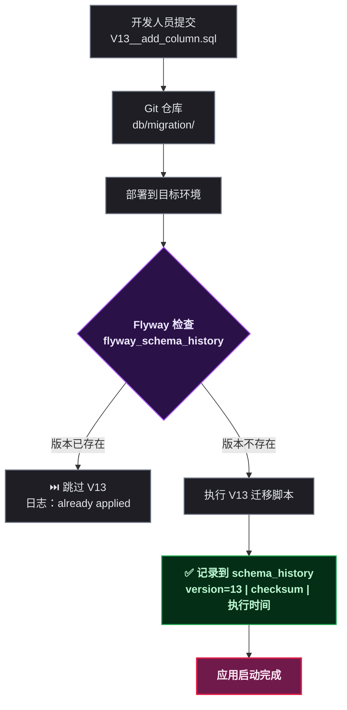
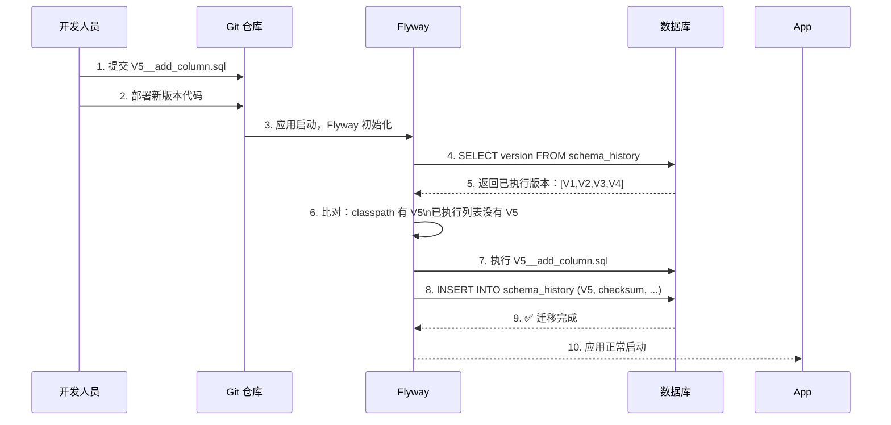

# Flyway 数据库迁移

## 第1步：目标说明 — 从 38 个手工 SQL 脚本说起

Mall 商城项目的 README 里有一句坦诚的自我检讨：

> SQL 脚本丢在 `sql/` 目录手工执行，没有 Flyway / Liquibase。无法追踪某台机器跑过哪些 DDL，回滚靠猜。

打开 `sql/feature_1.0.1/` 目录一看——38 个 SQL 文件，命名靠日期：

```
create_table_2024_01_05.sql
create_table_2024_01_29.sql
alter_table_2024_02_27.sql
alter_table_2024_05_12.sql
alter_table_2024_09_26.sql
...
```

每次上线，开发人员手动连上数据库，挑出"这次要跑的"脚本，逐个执行。脚本里还夹杂了手工更新历史数据的 DML：

```sql
use mall_db;
alter table mall_product add column `cover_url` varchar(200) DEFAULT NULL COMMENT '封面图片url';

-- 更新历史数据
update mall_product p
inner join mall_product_photo m on p.id = m.product_id
set p.cover_url = m.url
where m.type=1 and m.is_del=0;

-- 别忘了还有分库
use mall_db_order_0;
alter table order_trade_item_0 add column `cover_url` varchar(200) ...
alter table order_trade_item_1 add column `cover_url` varchar(200) ...

use mall_db_order_1;
alter table order_trade_item_0 add column `cover_url` varchar(200) ...
alter table order_trade_item_1 add column `cover_url` varchar(200) ...
```

这种模式下会发生什么，写过的人都懂：

1. **漏执行**：某台机器跳了一个脚本，上线后报 `Unknown column 'cover_url'`
2. **重复执行**：脚本忘了加 `IF NOT EXISTS`，第二次跑直接报错
3. **顺序混乱**：A 同事改表结构，B 同事也改同一个表，合并时发现依赖关系对不上
4. **回滚靠猜**：不知道当前数据库"处于哪个版本"，要回滚只能对着备份还原
5. **多环境不一致**：开发库跑过 A 脚本但测试库没跑，联调时字段对不上

本教程的目标：用 Flyway 替代手工 SQL 脚本管理，实现 DDL 的版本化、自动化执行和可追溯。

## 第2步：前置条件

| 条件 | 要求 | 验证命令 |
|------|------|----------|
| JDK | 1.8+ | `java -version` |
| Spring Boot | 2.x（Flyway 已内置在 spring-boot-starter 中） | 查看 `pom.xml` |
| MySQL | 5.7+（或其他关系型数据库） | `mysql --version` |
| 项目已有数据库 | 需要迁移管理的数据库 | `show databases;` |

> ⚠️ 新手提示：Flyway 和 Liquibase 都是**数据库迁移工具**（Database Migration Tool），和"数据迁移"（把数据从 MySQL 迁到 MongoDB）是完全不同的两件事。数据库迁移管理的是**表结构的变更**（DDL），是"改房子结构"而不是"搬家"。

## 第3步：环境搭建

### 添加 Flyway 依赖

Flyway 已集成在 Spring Boot 的起步依赖中。以 Mall 项目为例，在 `mall-service` 模块的 `pom.xml` 中加入：

```xml
<dependency>
    <groupId>org.flywaydb</groupId>
    <artifactId>flyway-core</artifactId>
    <!-- Spring Boot 2.x 已管理版本号，不需要手动指定 -->
</dependency>
<dependency>
    <groupId>org.flywaydb</groupId>
    <artifactId>flyway-mysql</artifactId>
    <!-- MySQL 8.x 需要此依赖 -->
</dependency>
```

Spring Boot 的自动配置会在启动时检测到 Flyway 依赖，自动创建 `FlywayMigrationInitializer` Bean，在 Hibernate 生成表之前先执行迁移脚本。

> ⚠️ 新手提示：如果项目中用了 JPA / Hibernate 的 `ddl-auto: update`，需要把它改成 `ddl-auto: validate` 或 `ddl-auto: none`。Flyway 接管 DDL 之后，Hibernate 只做校验不做变更，否则两边打架。

### application.yml 配置

```yaml
spring:
  flyway:
    enabled: true
    # 迁移脚本存放路径，默认 classpath:db/migration
    locations: classpath:db/migration
    # 校验迁移脚本的 Checksum，不一致时启动报错
    validate-on-migrate: true
    # 数据源（复用 Spring 的数据源，通常不用单独配置）
    # url: jdbc:mysql://...
    # user: root
    # password: ...
    # 基线版本：已有数据库用此参数跳过已执行的 V1 ~ Vx 脚本
    # baseline-on-migrate: true
    # baseline-version: 1.0
```

最简配置其实一行都不需要写——Flyway 会使用 Spring Boot 的默认 DataSource，从 `classpath:db/migration` 加载脚本。上面的配置只在需要自定义行为时才加。

### 创建迁移脚本目录

在 `mall-service/src/main/resources/` 下创建 `db/migration/` 目录：

```
mall-service/
└── src/
    └── main/
        └── resources/
            └── db/
                └── migration/
                    ├── V1__init_schema.sql
                    ├── V2__add_product_table.sql
                    ├── V3__add_order_tables.sql
                    └── ...
```

脚本命名规则官方且严格：

```
V<版本号>__<描述>.sql
```

- `V` 开头（Versioned Migration），大写
- 版本号用数字，点分也行（如 `V1.0.1__xxx.sql`）
- 两个下划线 `__` 分隔版本号和描述
- 描述用下划线或连字符连接英文单词

**这个命名不能随便改**——Flyway 启动时按版本号排序依次执行，版本号已经执行过的会跳过。

## 第4步：分步实践

### 第1步实操：将现有 SQL 脚本改造为 Flyway 迁移

把 Mall 项目散落在 `sql/feature_1.0.1/` 中的 38 个脚本，按时间顺序重新命名并移到 `db/migration/` 下。原始脚本的内容需要适配 Flyway 规范：

**原始脚本**（`alter_table_2024_09_26.sql`）：

```sql
use mall_db;
alter table mall_product add column `cover_url` varchar(200) DEFAULT NULL COMMENT '封面图片url';

update mall_product p
inner join mall_product_photo m on p.id = m.product_id
set p.cover_url = m.url
where m.type=1 and m.is_del=0;

use mall_db_order_0;
alter table order_trade_item_0 add column `cover_url` varchar(200) ...
```

**改造后的 Flyway 脚本**（`V12__add_product_cover_url.sql`）：

```sql
-- ① 去掉 USE 语句，Flyway 用 DataSource 绑定的数据库
-- ② DDL 加 IF NOT EXISTS 保证幂等（虽然 Flyway 不会重复执行，但多一层防护）

ALTER TABLE mall_product
    ADD COLUMN IF NOT EXISTS `cover_url` VARCHAR(200) DEFAULT NULL COMMENT '封面图片url';

-- ③ DML 也放在迁移脚本中，和历史 DDL 一起执行
-- Flyway 执行 DDL 期间没有其他事务竞争，可以放心跑 UPDATE
UPDATE mall_product p
    INNER JOIN mall_product_photo m ON p.id = m.product_id
SET p.cover_url = m.url
WHERE m.type = 1 AND m.is_del = 0;
```

改造要点：

| 原始脚本问题 | Flyway 做法 |
|-------------|------------|
| `USE mall_db` 硬编码库名 | 去掉，Flyway 默认连 DataSource 指定的库 |
| 文件名靠日期辨认 | 改为 `V12__xxx.sql`，版本号天然保证顺序 |
| 扔在 `sql/` 手工挑着跑 | 放在 `db/migration/`，启动自动按序执行 |
| 多库的脚本混在一个文件 | 每个库的 DataSource 各有自己的 `db/migration/`，分库脚本放各自的 migration 目录 |

**预期效果**：启动项目时控制台输出 Flyway 日志，显示迁移脚本执行列表，最后一行 `Successfully applied N migrations`。

**排错**：如果 Flyway 启动时报 `Checksum mismatch`，说明某个已执行的脚本被修改过。这是因为 Flyway 首次执行脚本时记录了它的 Checksum（CRC32），之后每次启动都校验。不要直接改已执行过的脚本——新建一个版本号更大的迁移来修正。

### 第2步实操：新建一个迁移脚本

假设要给商品表加一个"是否热销"标记字段：

```sql
-- V13__add_product_hot_sale_flag.sql
ALTER TABLE mall_product
    ADD COLUMN IF NOT EXISTS `is_hot_sale` TINYINT(1) NOT NULL DEFAULT 0 COMMENT '是否热销 1:是 0:否';
```

放到 `db/migration/` 目录下，启动项目。Flyway 会检测到版本号 `13` 是新版本，自动执行。

> ⚠️ 新手提示：Flyway 的版本号一旦执行就锁定，不能再改。如果团队里有两个人同时写了 V13 的脚本，后合并的人必须改成 V14（或 V13.1 这种点分版本），否则启动报错。

### 第3步实操：处理已有数据库（Baseline）

如果数据库已经有一堆表了——Mall 项目就是这个情况——直接加 Flyway，启动时会因为 `flyway_schema_history` 表不存在而尝试执行所有 V1 ~ V12 的 CREATE TABLE，然后报"表已存在"。

解决方法是告诉 Flyway"现有数据库已经是 V1.0 版本了，别从头跑"：

```yaml
spring:
  flyway:
    baseline-on-migrate: true
    baseline-version: 1.0
```

Flyway 会在数据库中创建 `flyway_schema_history` 表，插入一条 `version=1.0, type=BASELINE` 的记录。之后只执行版本号 > 1.0 的迁移脚本。

完整的操作顺序（针对已有数据库）：

1. 导出当前数据库结构：`mysqldump -d -u root -p mall_db > baseline.sql`
2. 将 baseline.sql 保存为 `V1__baseline.sql`（内容可以留空，只是占位）
3. 配置 `baseline-on-migrate: true` 和 `baseline-version: 1`
4. 从 V2 开始放新的迁移脚本
5. 启动项目，Flyway 跳过 V1，执行 V2 及之后的新脚本

**预期效果**：Flyway 启动日志显示 `Successfully validated X migrations`，不会报表已存在的错误。

**排错**：如果配置了 baseline 但还是报错，检查数据库中是否已经存在 `flyway_schema_history` 表——可能是之前某次启动 Flyway 自动创建的。删掉这张表，或者把 `baseline-version` 调到比表中已有记录更大的版本号。

### 第4步实操：回滚操作

Flyway 社区版不支持自动回滚。但回滚这件事本身就很难自动化——ALTER TABLE 删掉的列，数据已经没了，神仙也恢复不了。

实际项目中的做法：

```sql
-- V14__rollback_hot_sale.sql（一个新的迁移，而不是撤回 V13）
ALTER TABLE mall_product DROP COLUMN IF EXISTS `is_hot_sale`;
```

就是把回滚也当作一个新版本的迁移来执行。如果确实需要可逆操作，用 Flyway 企业版（支持 `UNDO` 迁移），或者换 Liquibase（原生支持 `rollback`）。



## 第5步：部署验证

### 验证清单

| 验证项 | 预期结果 |
|--------|----------|
| 启动日志 | 控制台输出 Flyway 执行的迁移列表 |
| `flyway_schema_history` 表 | 自动创建，包含已执行的迁移记录 |
| 新迁移脚本执行 | 启动时自动执行新版本的 DDL |
| 已执行的脚本不重复跑 | 启动日志显示 `already applied` |
| Checksum 校验 | 修改已执行的脚本后启动报错 |
| 多环境一致性 | 开发/测试/生产库的 schema_history 版本号序列一致 |

### 验证 `flyway_schema_history` 表

启动项目后，连上数据库查询：

```sql
SELECT version, description, type, script, checksum, installed_on, success
FROM flyway_schema_history
ORDER BY installed_rank;
```

预期输出示例：

| version | description | type | script | checksum | success |
|---------|-------------|------|--------|----------|---------|
| 1 | baseline | BASELINE | << Flyway Baseline >> | null | 1 |
| 2 | add product table | SQL | V2__add_product_table.sql | 1836420911 | 1 |
| 3 | add order tables | SQL | V3__add_order_tables.sql | -102348572 | 1 |

每一行就是一个"已执行的迁移"，Flyway 每次启动都对着这张表决定哪些脚本要跑、哪些跳过。

### 常见问题

**Q1：Flyway 和 JPA 的 ddl-auto 冲突怎么办？**

把 `spring.jpa.hibernate.ddl-auto` 从 `update` 改为 `validate`。Hibernate 只校验 Entity 和表结构是否匹配，不自动改表结构。DDL 完全交给 Flyway。

**Q2：多数据源怎么配 Flyway？**

每个数据源需要一个独立的 `FlywayMigrationStrategy` Bean。Spring Boot 自动配置只为 `@Primary` 数据源创建 Flyway，其他数据源需要手动配置：

```java
@Configuration
public class OrderDbFlywayConfig {

    @Bean
    public FlywayMigrationInitializer orderFlywayInitializer(
            @Qualifier("orderDataSource") DataSource dataSource) {
        Flyway flyway = Flyway.configure()
                .dataSource(dataSource)
                .locations("classpath:db/migration_order")
                .load();
        return new FlywayMigrationInitializer(flyway);
    }
}
```

Mall 项目有分库（mall_db、mall_db_order_0、mall_db_order_1），就需要这种多数据源的 Flyway 配置，每个库的迁移脚本放在各自的目录下。

**Q3：迁移脚本里能写 DML 吗？能，但要知道边界。**

短小的数据修正（加个默认值、更新几条历史记录）放在迁移脚本里没问题。大批量的数据迁移（几百万行 UPDATE）不建议——Flyway 迁移在事务中执行，长事务锁表会导致业务不可用。大批量数据操作应该用独立的批处理任务。

## 第6步：原理简述

### 为什么需要追踪"跑过哪些 DDL"

一句话概括：**让数据库的表结构变更和代码变更保持同步，且可追溯**。

代码有 Git 管着，每次提交都有记录，谁改了哪行、什么时候改的一清二楚。但数据库表结构没有"版本历史"——周一加了个字段，周三删了个索引，周五又改了字段类型。三个月后没人记得当前库到底长什么样，更不知道哪个环境跑了哪些变更。



Flyway 通过一张 `flyway_schema_history` 表解决了"不知道跑过哪些 DDL"的问题。这张表就是数据库的 Git log——每次 DDL 变更都有一条带版本号、Checksum 和时间戳的记录。

### Flyway vs Liquibase

| 维度 | Flyway | Liquibase |
|------|--------|-----------|
| 迁移定义方式 | 纯 SQL 文件 | XML / YAML / JSON / SQL 都支持 |
| 学习成本 | 极低，会写 SQL 就能用 | 需要学 Liquibase 的 changelog 语法 |
| 回滚支持 | 社区版不支持，企业版支持 UNDO | 原生支持 rollback |
| 多数据库兼容 | 每种数据库写各自的 SQL | 一套 changelog 自动适配不同数据库 |
| Spring Boot 集成 | 原生支持，自动配置 | 需加 `liquibase-core` 依赖 |
| 适用场景 | 团队都用同一种数据库（MySQL），SQL 写得熟 | 需要适配多种数据库，或需要自动回滚 |

选型建议：团队只用一个数据库、成员 SQL 熟练，Flyway 足够。需要适配 Oracle / PostgreSQL / MySQL 多种数据库，或者有强制的回滚审计要求，选 Liquibase。

如果从 Mall 项目的手工脚本起步，Flyway 的迁移成本最低——把现有 SQL 文件重命名、挪目录就完成了 80% 的工作。

## 第7步：总结与下一步

### 核心要点

1. **手工 SQL 的五个坑**：漏执行、重复执行、顺序乱、回滚靠猜、多环境不一致——每个都踩过
2. **Flyway 的解决思路**：版本号命名 + `flyway_schema_history` 追踪 + 启动自动执行
3. **命名绝对不能乱改**：`V<版本号>__<描述>.sql`，两个下划线，已执行的版本号锁死
4. **已有数据库用 Baseline**：告诉 Flyway 从哪个版本开始，跳过已存在的表
5. **DDL 和 DML 可以混在迁移脚本中**：小批量数据修正没问题，大批量用独立任务
6. **回滚 = 写一个新的迁移**：社区版不支持自动回滚，新增一个迁移把改动改回去
7. **多数据源 = 多 Flyway Bean**：每个库有自己的 migration 目录和 Flyway 实例

### 关于 Mall 项目的手工脚本

回头看那 38 个手工 SQL 文件——命名靠日期、内容带 `USE` 语句、多库混在一个文件里——其实并不是"写得不好"，而是所有没有迁移工具的项目到最后都会长这样。引入 Flyway 不是否定之前的做法，而是把经验固化到工具里，让下一台机器、下一个环境、下一个人接手时不需要靠"猜"和"问"。

### 下一步学习方向

- **Flyway 回调（Callback）**：在迁移前后执行自定义逻辑（如迁移前备份、迁移后刷新缓存）
- **Liquibase 入门**：用 XML changelog 写迁移，体验"一套脚本跨数据库"的便利
- **CI/CD 集成**：把 Flyway 迁移绑在部署流水线里，每次部署自动跑最新的迁移脚本
- **生产环境回滚演练**：模拟一次需要回滚 DDL 的场景，验证备份和恢复流程
