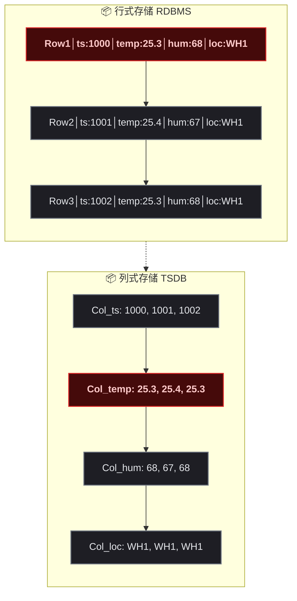
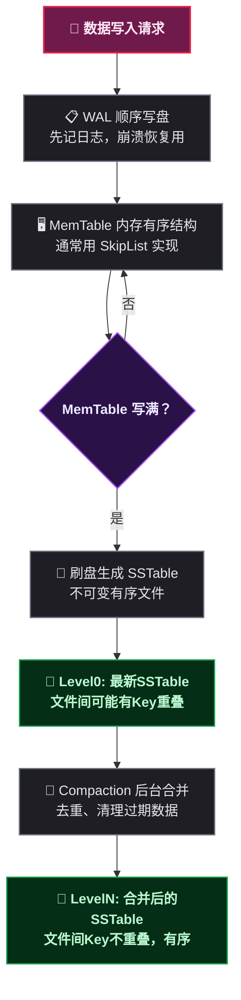
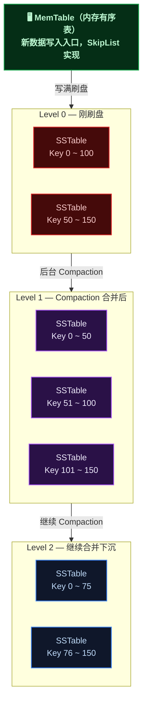
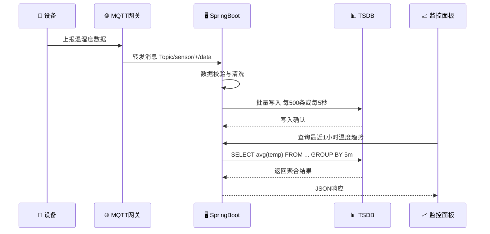
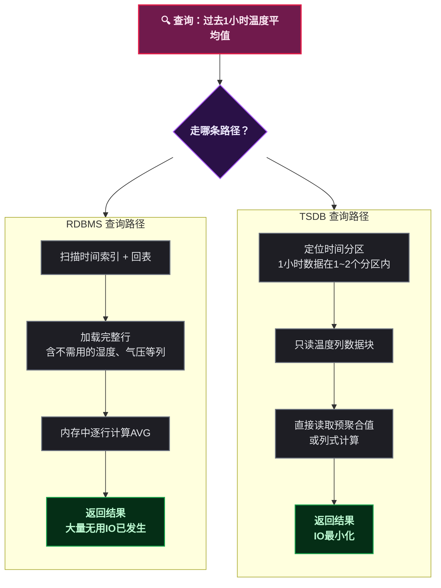

# 时序数据库在物联网日志系统中的设计与实践：从数据结构到SpringBoot接入

## 一、一张表撑不住了

> 📌 前置知识：了解关系型数据库（RDBMS）基本概念，知道什么是SQL、索引、事务。知道什么是磁盘IO，理解顺序IO和随机IO的大致性能差距（约一个数量级）。

某开发者接手了一个物联网项目，设备每秒上报一次数据，1000台设备跑了一周，MySQL 的 `iot_logs` 表已经几千万行，查询一条设备最近一小时的数据要跑十几秒。加了索引，写入又慢得让人抓狂。这种场景，写过的都懂——关系型数据库不是不能存时序数据，而是它的每一个设计决策都和时序场景的需求背道而驰。

物联网日志（IoT Logs）具有几个典型特征：

- <strong>写入密集且顺序</strong>：数据按时间顺序持续产生，极少更新或删除
- <strong>查询模式固定</strong>：通常按时间范围 + 设备ID聚合查询，很少跨设备做复杂JOIN
- <strong>数据冷热分明</strong>：最近几小时的数据被频繁访问，一周前的数据偶尔查一次
- <strong>压缩空间巨大</strong>：传感器数据变化缓慢，相邻时间点数据高度相似，而 RDBMS 的通用压缩算法根本不认识这种模式

这就引出了一个核心问题：时序数据库（TSDB，Time Series Database）到底在数据结构层面做了哪些改造，让它和经典关系型数据库（RDBMS）产生了本质差异？以及如何在 Spring Boot 项目中把这些 TSDB 用起来？

## 二、数据结构层面的根本差异

### 2.1 行式存储 vs 列式存储

RDBMS 以 <strong>行（Row）</strong> 为单位组织数据，一行数据的各个字段在磁盘上连续存放。这种设计让单行读写非常高效——适合 OLTP 场景下"查一行、改一行"的套路。但面对时序查询时，问题就暴露了：查询"过去一小时内所有传感器的温度平均值"，只需要温度这一个列，行式存储却会把湿度、气压、设备状态等几十个列一并从磁盘读进内存——IO 利用率奇低。

TSDB 采用 <strong>列式存储（Columnar Storage）</strong>，将同一列的数据在磁盘上连续存放。查询温度列时，只读取温度相关的数据块，其他列完全不参与 IO。这和 ClickHouse 等 OLAP 引擎的思路一致，但 TSDB 在列式基础上又叠加了时间维度的特殊优化。



> ⚠️ 新手提示：不要混淆"列式存储的数据库"和"时序数据库"。列式存储是 TSDB 的技术手段之一，但不是全部。ClickHouse 是列式存储的 OLAP 数据库，但它不是 TSDB——它没有时间维度的特殊处理（如自动分区、自动过期删除）。

### 2.2 B+Tree vs LSM-Tree

> 📌 前置知识：了解B+Tree基本原理——树的高度、叶子节点形成有序链表、页分裂（Page Split）为何产生随机IO。了解WAL（Write-Ahead Log，预写日志）的概念——先写日志再写数据，用于崩溃恢复。

这是最核心的架构差异，也是理解"为什么TSDB写入这么快"的关键。

RDBMS 的索引底层通常是 <strong>B+Tree</strong>（或其变种，如 InnoDB 的 B+Tree 聚簇索引）。写入一条数据意味着：定位叶子节点→检查页空间→如果满了则页分裂→更新父节点→可能递归分裂。这个过程涉及多次随机磁盘寻道，单次也许只是几毫秒，但在每秒数万行的写入量下，累积的延迟不可接受。

TSDB 几乎清一色使用 <strong>LSM-Tree（Log-Structured Merge-Tree，日志结构合并树）</strong>或其变体。LSM-Tree 的核心思想极为务实——既然随机写慢，那就永远不随机写：



LSM-Tree 的写入流程把随机IO完全转化为了顺序IO——WAL 是顺序追加，MemTable 在内存中排序，刷盘也是连续写入。Compaction 虽然会带来写放大，但它在后台异步执行，不影响前台写入延迟。这个设计和 Kafka 的日志存储思路异曲同工——<strong>磁盘在顺序写入时，带宽可以接近理论极限</strong>（现代 SATA SSD 顺序写轻松达到 500MB/s，而随机写可能只有几十 MB/s）。

但如果把 LSM-Tree 的数据结构画成 B+Tree 那种粒度的图，它是这样的——不是一个树，而是一个<strong>分层堆积的结构</strong>：



和 B+Tree 摆在一起看，结构层面的差异就很直白了：

<strong>B+Tree vs LSM-Tree 核心对比：</strong>

| 维度 | B+Tree（RDBMS） | LSM-Tree（TSDB） |
|------|------|------|
| 写入方式 | 原地更新，随机IO为主 | 顺序追加写入 |
| 写入延迟 | 单次写入微妙级，但受页分裂影响 | 单次写入纳秒级（写内存），批量刷盘毫秒级 |
| 读取路径 | 单次B+Tree查找即可 | 多路径查找（MemTable + 多层SSTable），常配合Bloom Filter |
| 空间放大 | 低（约1.0 ~ 1.2x） | 中（Compaction期间临时多份文件） |
| 写放大 | 高（页分裂、回滚段等） | 中（Compaction重写数据，约10 ~ 30x） |
| 适用场景 | 读写均衡、频繁更新 | 写多读少、数据不可变 |

### 2.3 时间维度的特殊处理

RDBMS 把时间当作普通字段，和 VARCHAR、INT 没有任何区别——所有字段在存储引擎面前一律平等。TSDB 把时间当作 <strong>一等公民</strong>，围绕它做了三重特殊处理。

<strong>第一重：时间分区（Time Partitioning）</strong>

数据按时间范围切分到不同的 <strong>Shard</strong> 或 <strong>Bucket</strong>，比如按天或按小时。一个分区不再接收新写入时，整个分区文件可设为只读——极大简化了并发控制和 Compaction 策略。更关键的是，过期的分区可以<strong>整个文件直接删除</strong>，而不是像 RDBMS 那样逐行 DELETE 然后等待 VACUUM。

> ⚠️ 新手提示：在MySQL中删除几千万行过期数据可能是运维的噩梦——DELETE会产生大量undo日志、锁持有时间长、磁盘碎片严重。在TSDB中，这件事就是删除几个文件，毫秒级完成。

<strong>第二重：专用压缩算法</strong>

时序数据相邻时间点的数值变化微小。TSDB 利用这个特点使用专用算法：

<div style="max-width:700px;background:#F5F5F5;border:1px solid #BDBDBD;padding:10px;font-family:monospace;font-size:13px;margin:10px 0;">
<div style="background:#1E88E5;color:#FFFFFF;padding:4px 8px;font-weight:bold;">TSDB 时间戳列压缩示意（Delta-of-Delta 算法）</div>
<div style="padding:8px;">
原始时间戳（8字节×4）：<span style="background:#C8E6C9;color:#1B5E20;padding:1px 4px;">1700000000000</span> <span style="background:#C8E6C9;color:#1B5E20;padding:1px 4px;">1700000001000</span> <span style="background:#C8E6C9;color:#1B5E20;padding:1px 4px;">1700000002000</span> <span style="background:#C8E6C9;color:#1B5E20;padding:1px 4px;">1700000003000</span> = 32字节<br/>
Delta编码后：<span style="background:#FFE082;color:#5D4037;padding:1px 4px;">1700000000000</span>(基准) <span style="background:#FFCCBC;color:#BF360C;padding:1px 4px;">+1000</span> <span style="background:#FFCCBC;color:#BF360C;padding:1px 4px;">+1000</span> <span style="background:#FFCCBC;color:#BF360C;padding:1px 4px;">+1000</span><br/>
Delta-of-Delta：<span style="background:#FFE082;color:#5D4037;padding:1px 4px;">1700000000000</span>(基准) <span style="background:#E1BEE7;color:#4A148C;padding:1px 4px;">1000</span>(步长) <span style="background:#E1BEE7;color:#4A148C;padding:1px 4px;">0</span> <span style="background:#E1BEE7;color:#4A148C;padding:1px 4px;">0</span><br/>
<span style="color:#388E3C;font-weight:bold;">最终：8 + 4 + 1 + 1 = 14字节，压缩率 56.25%</span>
</div>
</div>

对于浮点数（温度、湿度等），TSDB 使用 <strong>Gorilla</strong> 或 <strong>XOR</strong> 压缩：相邻值如果变化幅度小，它们的 IEEE 754 二进制表示中大部分位是相同的，XOR 结果会产生大量前导零，再用游程编码压缩即可。TSDB 的压缩率通常能达到 10:1 到 30:1，而 InnoDB 的页压缩通常只有 2:1 到 4:1——因为通用压缩算法不知道数据是"按时间排列的温度序列"，无法利用时间相邻性。

<strong>第三重：预聚合（Downsampling）</strong>

TSDB 在写入时可以自动计算并存储聚合值——比如每分钟的 min/max/avg/sum。查询"过去30天每天的温度均值"时，直接从预聚合表中读取，而不需要扫描原始数据。这本质上是用空间换时间，但对于物联网日志这种"查询粒度往往粗于采集粒度"的场景，效果极好。

## 三、一条物联网日志的完整旅程

把视角拉高，看一条传感器数据从设备产尘到被查询的全链路：



整条链路中，从 APP 到 TSDB 这一段和传统的"Spring Boot 写 MySQL"在开发体验上相似——都是拼 SQL、调连接池。但底层发生的事情完全不同。

再看查询路径的对比：



> ⚠️ 新手提示：这条链路和传统Web应用写MySQL的最大区别在于——TSDB的写入路径上没有事务锁、没有索引更新、没有页分裂。整个写入路径几乎全是顺序IO。这也是为什么单机TSDB可以轻松达到百万点/秒的写入吞吐，而单机MySQL在几万行/秒时就开始出现写入抖动。

## 四、国产时序数据库一览

近几年国产TSDB生态发展很快，以下是几个有代表性的项目：

| 项目 | 主导方 | 存储引擎 | 查询语言 | 核心特色 |
|------|------|------|------|------|
| <strong>TDengine</strong> | 涛思数据 | 自研TSM | 类SQL | 超级表（STable）抽象、零配置、内置缓存与消息队列 |
| <strong>Apache IoTDB</strong> | 清华大学 | 自研TsFile | 类SQL | 端边云协同、多编码算法、Apache顶级项目 |
| <strong>GreptimeDB</strong> | 格睿云 | 基于Parquet | SQL + PromQL | 云原生存算分离、兼容Prometheus生态 |
| <strong>CnosDB</strong> | 云时科技 | 自研 | 类SQL | Rust实现、高基数场景优化 |
| <strong>DolphinDB</strong> | 浙江智臾 | 自研OLAP | 类SQL + Python | 时序存储与计算一体引擎，金融领域应用较广 |

### 4.1 TDengine：超级表模型

TDengine 提出了 <strong>超级表（STable）</strong> 的概念：同一类设备（如同一型号的温度传感器）共享一张超级表的 Schema，每台具体设备对应一张子表。打个比方——超级表是"模具"，子表是模具压出来的"零件"。

> 📌 前置知识：了解 SQL 中表（Table）和 Schema（模式）概念。知道什么是元数据（Metadata）膨胀——每个表在数据库中都需要维护对应的元数据（列信息、索引信息、统计信息），表数量太多会导致 information_schema 查询变慢、DDL操作变重。

这个设计的精妙之处在于解决了"大量同构设备"场景的元数据膨胀问题。如果每台设备建一张普通表，100万台设备就是100万张独立表——MySQL 的 information_schema 大概要当场去世。而 TDengine 中，100万台设备共用一张超级表的 Schema，设备差异仅通过 TAG 列区分，元数据开销 O(1)。

```java
// TDengine 超级表建表SQL示例
CREATE STABLE IF NOT EXISTS sensor_data (
    ts TIMESTAMP,
    temperature DOUBLE,
    humidity DOUBLE,
    voltage DOUBLE
) TAGS (
    device_id VARCHAR(64),
    location VARCHAR(128),
    device_type VARCHAR(32)
);

-- 子表：每个设备一张，使用TAG区分
CREATE TABLE d_device_001 USING sensor_data
  TAGS ('device_001', '武汉-仓库A', '温湿度传感器');
```

### 4.2 Apache IoTDB：TsFile 自描述存储

IoTDB 的核心资产是 <strong>TsFile</strong>——一个自描述的列式文件格式，数据块（Chunk）、索引、统计信息（min/max/count）、BloomFilter 全部封装在一个文件内。TsFile 可以脱离 IoTDB 服务端独立读写。

这个设计最酷的地方在于：边缘设备可以在本地生成 TsFile 文件，用 U盘/网络上传到云端，云端直接加载——不需要经过数据库写入链路。这就是所谓"端边云协同"，在工业物联网场景下尤其实用（工厂车间的边缘网关算力有限、网络不稳定）。

### 4.3 GreptimeDB：存算分离新秀

GreptimeDB 是较新的项目，最大设计特点是 <strong>存算分离</strong>——计算节点无状态，存储层基于对象存储（S3 / OSS）。天然适合 K8s 部署：计算节点可以随意扩缩容，不用担心数据迁移。同时兼容 PromQL，可以直接替代 Prometheus 做监控数据的长期存储。

## 五、Spring Boot 集成实战

> 📌 前置知识：熟悉 Spring Boot 基础（自动配置、@Bean 声明周期、JdbcTemplate）。了解 Maven 依赖管理。知道连接池是什么，以及为什么高吞吐场景下连接管理策略需要调整。

### 5.1 TDengine Spring Boot 接入

TDengine 对 Spring Boot 的接入非常友好，本质就是 JDBC——你甚至不需要专门的 Starter，直接用 JdbcTemplate 就够了。

<strong>第1步：添加依赖</strong>

```xml
<!-- pom.xml -->
<dependency>
    <groupId>com.taosdata.jdbc</groupId>
    <artifactId>taos-jdbcdriver</artifactId>
    <version>3.2.5</version>
</dependency>
```

> ⚠️ 新手提示：TDengine 3.x 的 JDBC Driver 同时支持原生连接和 REST 连接。`jdbc:TAOS://` 走原生协议（需要客户端和服务端架构一致，通常x64），`jdbc:TAOS-RS://` 走 REST（跨架构更友好，但性能略低）。生产环境建议用原生连接。

<strong>第2步：数据源配置</strong>

```yaml
# application.yml
spring:
  datasource:
    tdengine:
      driver-class-name: com.taosdata.jdbc.TSDBDriver
      url: jdbc:TAOS://localhost:6030/iot_logs
      username: root
      password: taosdata
```

```java
@Configuration
public class TDengineConfig {

    @Bean
    @ConfigurationProperties(prefix = "spring.datasource.tdengine")
    public DataSource tdengineDataSource() {
        return DataSourceBuilder.create().build();
    }

    @Bean
    public JdbcTemplate tdengineJdbcTemplate(
            @Qualifier("tdengineDataSource") DataSource ds) {
        return new JdbcTemplate(ds);
    }
}
```

<strong>第3步：DAO 层——子表与批量写入</strong>

```java
@Repository
public class SensorDataDao {

    private final JdbcTemplate jdbc;

    public SensorDataDao(@Qualifier("tdengineJdbcTemplate") JdbcTemplate jdbc) {
        this.jdbc = jdbc;
    }

    // 为每个设备创建子表
    public void ensureDeviceTable(String deviceId,
            String location, String type) {
        String sql = "CREATE TABLE IF NOT EXISTS d_" + deviceId
            + " USING sensor_data TAGS ('" + deviceId + "', '"
            + location + "', '" + type + "')";
        jdbc.execute(sql);
    }

    // 批量写入：一条SQL塞多条数据，利用TDengine的高吞吐
    public void batchInsert(List<SensorDataPoint> points) {
        if (points.isEmpty()) return;
        StringBuilder sql = new StringBuilder("INSERT INTO ");
        for (SensorDataPoint p : points) {
            sql.append("d_").append(p.getDeviceId())
               .append(" VALUES(")
               .append(p.getTs()).append(", ")
               .append(p.getTemperature()).append(", ")
               .append(p.getHumidity()).append(", ")
               .append(p.getVoltage()).append(") ");
        }
        jdbc.update(sql.toString());
    }
}
```

<strong>第4步：Service 层——带缓冲的批量写入</strong>

这是最容易踩坑的地方。逐条 INSERT 是性能杀手——每次都是一次网络往返，TSDB 的高吞吐优势完全被网络延迟吞掉。正确的做法是加一个内存缓冲区。

```java
@Service
public class SensorDataService {

    private final SensorDataDao dao;
    private final BlockingQueue<SensorDataPoint> buffer
        = new LinkedBlockingQueue<>(10000);

    public SensorDataService(SensorDataDao dao) {
        this.dao = dao;
    }

    // MQTT消息回调入口：只入队，不做IO
    public void onMessage(SensorDataPoint point) {
        if (!buffer.offer(point)) {
            // 队列满了就强制刷盘——宁可丢一条消息
            // 也不能让内存无限膨胀
            flush();
        }
    }

    // 每5秒或积攒500条时批量刷盘
    @Scheduled(fixedRate = 5000)
    public void scheduledFlush() {
        flush();
    }

    private void flush() {
        List<SensorDataPoint> batch = new ArrayList<>();
        buffer.drainTo(batch, 500);   // 最多取500条
        if (!batch.isEmpty()) {
            dao.batchInsert(batch);
        }
    }
}
```

<strong>TDengine 常用 API 速查</strong>

| API | 说明 | 备注 |
|------|------|------|
| `CREATE STABLE ... TAGS(...)` | 创建超级表 | 定义Schema和标签列 |
| `CREATE TABLE ... USING ... TAGS(...)` | 创建子表 | 继承超级表结构 |
| `INSERT INTO t VALUES(...)` | 单条写入 | 仅供测试，生产不要用 |
| `INSERT INTO t1 VALUES(...) t2 VALUES(...)` | 批量写入 | 生产推荐，一条SQL多行 |
| `SELECT ... WHERE ts >= ... INTERVAL(5m)` | 时间窗口聚合 | TDengine独有语法 |
| `SHOW STABLES` | 列出所有超级表 | 类似 MySQL 的 SHOW TABLES |
| `SHOW CREATE STABLE st_name` | 查看超级表定义 | 排查Schema问题用 |
| `DROP TABLE IF EXISTS d_xxx` | 删除子表 | 数据随表一并删除 |

### 5.2 Apache IoTDB Session API 接入

IoTDB 提供 JDBC 和原生 Session API 两种接入方式。高吞吐场景下建议用 Session API——它绕过了 JDBC 的抽象层，直接走 Thrift RPC，写入性能更高。

<strong>第1步：添加依赖</strong>

```xml
<dependency>
    <groupId>org.apache.iotdb</groupId>
    <artifactId>iotdb-session</artifactId>
    <version>1.3.0</version>
</dependency>
```

<strong>第2步：配置 Session Bean 与自动重连</strong>

```java
@Configuration
public class IoTDBConfig {

    @Value("${iotdb.host:127.0.0.1}")
    private String host;

    @Value("${iotdb.port:6667}")
    private int port;

    @Value("${iotdb.username:root}")
    private String username;

    @Value("${iotdb.password:root}")
    private String password;

    @Bean
    public Session session() throws IoTDBConnectionException {
        Session session = new Session.Builder()
            .host(host)
            .port(port)
            .username(username)
            .password(password)
            .enableRedirection(true)
            .enableAutoFetch(true)
            .build();
        session.open(false);  // false = 单机模式，不探测集群
        return session;
    }

    @PreDestroy
    public void closeSession(Session session)
            throws IoTDBConnectionException {
        if (session != null) {
            session.close();
        }
    }
}
```

<strong>第3步：写入服务——利用 insertRecords 批量接口</strong>

```java
@Service
public class IoTDBService {

    private final Session session;

    public IoTDBService(Session session) {
        this.session = session;
    }

    // 创建时间序列（路径式Schema）
    public void createTimeseries(String deviceId) {
        String prefix = "root.iot." + deviceId;
        session.createTimeseries(prefix + ".temperature",
            TSDataType.DOUBLE, TSEncoding.GORILLA,
            CompressionType.LZ4);
        session.createTimeseries(prefix + ".humidity",
            TSDataType.DOUBLE, TSEncoding.GORILLA,
            CompressionType.LZ4);
    }

    // 批量写入：一次RPC携带多条数据
    public void batchInsert(List<SensorDataPoint> points)
            throws IoTDBConnectionException, StatementExecutionException {
        List<String> deviceIds = new ArrayList<>();
        List<Long> times = new ArrayList<>();
        List<List<String>> measurements = new ArrayList<>();
        List<List<TSDataType>> types = new ArrayList<>();
        List<List<Object>> values = new ArrayList<>();

        for (SensorDataPoint p : points) {
            deviceIds.add("root.iot." + p.getDeviceId());
            times.add(p.getTs());
            measurements.add(List.of("temperature", "humidity"));
            types.add(List.of(TSDataType.DOUBLE, TSDataType.DOUBLE));
            values.add(List.of(p.getTemperature(), p.getHumidity()));
        }

        session.insertRecords(deviceIds, times, measurements,
            types, values);
    }
}
```

<strong>IoTDB Session 常用 API 速查</strong>

| API | 说明 | 备注 |
|------|------|------|
| `session.open(enableRPCCompression)` | 打开连接 | 集群模式传true可探测集群 |
| `session.createTimeseries(path, type, encoding, compression)` | 创建时间序列 | 编码和压缩算法直接影响存储效率 |
| `session.insertRecord(deviceId, time, ...)` | 单设备单时间戳写入 | 测试用 |
| `session.insertRecords(deviceIds, times, ...)` | 多设备批量写入 | 生产推荐，一次RPC |
| `session.executeQueryStatement(sql)` | 执行查询SQL | 返回 SessionDataSet |
| `session.deleteTimeseries(path)` | 删除时间序列 | 数据一并删除 |
| `session.deleteData(path, startTime, endTime)` | 删除时间范围数据 | 指定时间范围的精确删除 |

### 5.3 通用实践要点

以下是切身体会，供参考：

<strong>连接管理不要照搬 MySQL 经验</strong>

TSDB 的连接和 MySQL 有本质不同。TDengine 和 IoTDB 的写路径没有锁竞争，一个应用实例通常只需要少量长连接（甚至一个 Session）就能打满吞吐。不要照搬 Druid / HikariCP 连接池那一套——多连接不会线性提升 TSDB 的写入性能，反而增加服务端的线程上下文切换开销。这点第一次从 MySQL 切到 TSDB 的开发大概率会踩坑——看到连接池队列堆积，直觉反应就是"加连接"，结果性能不升反降。

<strong>批量大小需要调优</strong>

攒多少条提交一次没有固定公式。太少（< 100条）——网络往返开销占比过高；太多（> 5000条）——单次提交超过服务端缓冲区大小会被拒绝，或者提交耗时太长阻塞接收端。建议从 500 条 / 5 秒开始，观察服务端监控后调整。

<strong>时间戳对齐能提升写入密度</strong>

如果多个传感器的数据在同一采集时刻产生（如同一台设备的温湿度和气压同时采样），合并成一条记录写入，而不是拆成多条。IoTDB 的 `insertRecord` 本身就支持一个时间戳携带多个测点值。

## 六、为什么这么设计

回到核心问题：TSDB 为什么要把数据结构设计成这样？答案藏在物联网日志系统的几个硬约束里。

### 6.1 写入是系统唯一瓶颈

物联网场景下，数据24小时不间断地产生。10000台设备 × 每秒1条 = 每秒10000条写入。如果写入路径上有锁竞争、索引更新、页分裂，这个量级足以让单机 RDBMS 苦苦挣扎。

LSM-Tree 让写入路径极短：WAL 顺序写 → 内存排序 → 批量刷盘。全程无随机IO，无锁等待，无原地更新。<strong>顺序写入是磁盘最友好的访问模式</strong>——这个认识造就了 Kafka、LSM-Tree、WAL 等一系列关键设计。

### 6.2 数据不可变——最大的简化假设

传感器数据一旦采集就是既定事实，不存在"修改上一条温度记录"的需求。这个看似普通的约束，对数据库设计的影响是颠覆性的：

- 数据文件可以设为不可变（Immutable），写入完成后永不修改
- 并发控制从"锁"降级为"追加顺序"——不需要行锁、间隙锁、MVCC
- Compaction 可以完全异步，不影响在线读写
- 备份变得极其简单——只需复制文件，不用担心"复制过程中文件被修改"

RDBMS 为了支持 UPDATE 和 DELETE，必须在存储引擎层面引入页分裂、undo 日志、MVCC 版本链等一系列复杂机制。TSDB 说"对不起，我们不支持更新"，然后把这些复杂度全部扔掉了。

### 6.3 查询模式固定——可以用空间换时间

时序查询 90% 的模式是"按时间范围 + 设备ID做聚合"。TSDB 利用这个特点：

- 同一设备的数据在磁盘上连续存储，一次顺序 IO 读出大段连续数据
- 写入时同步计算 min / max / sum / count 存入索引，查询时直接取用
- 根据 TAG 建立稀疏索引（不需要 B+Tree 那样为每行建细粒度索引）

这些优化的前提是：TSDB 清楚地知道"数据是按时间排列的、查询是按设备和时间范围的"。RDBMS 不知道这些，它只能对所有列一视同仁。

### 6.4 数据生命周期天然匹配分区策略

时序数据有明确的生命周期——保留30天，30天前的直接丢弃。TSDB 按时间分区后，删除过期数据就是操作系统级别的删除文件，毫秒级完成。RDBMS 中做同样的事情——DELETE + VACUUM + REBUILD INDEX——可能需要一个维护窗口，而且执行期间性能显著下降。

## 七、总结

时序数据库并不是"关系型数据库改一改就能用的东西"。它在数据结构层面做了根本性的改变——从行式到列式，从 B+Tree 到 LSM-Tree，从通用压缩到时序专用编码，从平等对待所有字段到让时间成为一等公民。每一个设计取舍都精准对应物联网日志系统的真实痛点：<strong>海量写入、极少更新、按时间聚合、定期清理</strong>。

在 Spring Boot 中接入 TSDB 并不复杂。TDengine 的三行配置 + JdbcTemplate，IoTDB 的 Session API，都足以让一个熟悉 Spring Boot 的开发者在一小时内完成从 MySQL 到 TSDB 的切换。真正需要投入时间的是理解存储模型——超级表和子表的区分、编码算法的选择、时间分区策略的规划——这些才是决定系统上线后是否稳定的关键。

国产的 TDengine、IoTDB、GreptimeDB 等项目各有特色，选型时建议关注三点：
- <strong>数据模型是否匹配</strong>：你的设备是否大量同构？是则 TDengine 的超级表模型会很舒服
- <strong>团队技术栈是否契合</strong>：SQL 熟练则优先考虑类SQL的TSDB；需要 Prometheus 兼容则看 GreptimeDB
- <strong>运维成本是否可控</strong>：存算分离架构运维更灵活但组件更多；一体化架构部署简单但扩展性有限

最后一句实在话：如果你现在的物联网项目在 MySQL 上还没遇到性能瓶颈，那就继续用——不要为了用 TSDB 而用 TSDB。但当写入开始卡、查询开始慢、数据清理开始影响正常业务时，TSDB 的每一项设计差异都会让你觉得"这玩意就是为这个场景造的"。
