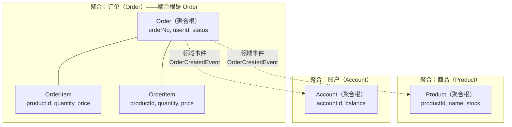
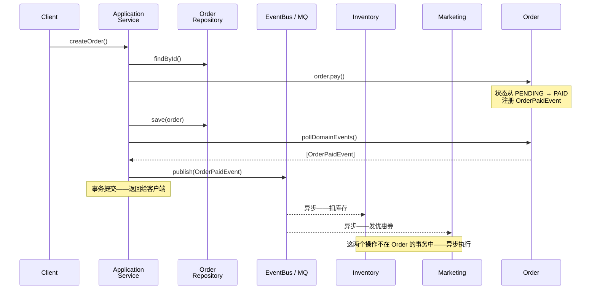

# DDD 本质——领域驱动设计的核心概念

## 一、⚡ 一个下单方法 800 行——你知道拆不开是因为什么吗？

先看一段熟悉的代码——我们所有微服务的 Controller/Service 大概都长这样：

```java
@Service
public class OrderService {

    @Autowired
    private OrderMapper orderMapper;
    @Autowired
    private UserMapper userMapper;
    @Autowired
    private ProductMapper productMapper;
    @Autowired
    private InventoryMapper inventoryMapper;

    public Order createOrder(CreateOrderRequest request) {
        // ① 查用户——有没有被封号
        User user = userMapper.selectById(request.getUserId());
        if (user == null || user.getStatus() == UserStatus.BANNED) {
            throw new BusinessException("用户不存在或已封号");
        }

        // ② 查商品——库存够不够
        BigDecimal totalAmount = BigDecimal.ZERO;
        List<OrderItem> items = new ArrayList<>();
        for (CreateOrderItemRequest itemReq : request.getItems()) {
            Product product = productMapper.selectById(itemReq.getProductId());
            if (product == null || product.getStatus() != ProductStatus.ON_SALE) {
                throw new BusinessException("商品 " + itemReq.getProductId() + " 不可售");
            }
            if (product.getStock() < itemReq.getQuantity()) {
                throw new BusinessException("商品 " + itemReq.getProductId() + " 库存不足");
            }
            // ③ 扣库存——直接在 Service 里 UPDATE
            product.setStock(product.getStock() - itemReq.getQuantity());
            productMapper.updateById(product);

            totalAmount = totalAmount.add(product.getPrice()
                    .multiply(BigDecimal.valueOf(itemReq.getQuantity())));
            items.add(new OrderItem(itemReq.getProductId(), itemReq.getQuantity(),
                    product.getPrice()));
        }

        // ④ 扣余额——直接操作 Account 表
        Account account = accountMapper.selectByUserId(request.getUserId());
        if (account.getBalance().compareTo(totalAmount) < 0) {
            throw new BusinessException("余额不足");
        }
        account.setBalance(account.getBalance().subtract(totalAmount));
        accountMapper.updateById(account);

        // ⑤ 创建订单
        Order order = new Order();
        order.setOrderNo(generateOrderNo());
        order.setUserId(request.getUserId());
        order.setTotalAmount(totalAmount);
        order.setStatus(OrderStatus.PENDING_PAY);
        order.setItems(items);
        orderMapper.insert(order);

        // ⑥ 发通知——MQ
        rocketMQTemplate.syncSend("order-created", order);

        return order;
    }
}
```

<strong>问题不是代码长——问题是：你想加一个"首单 9 折"的功能——该加在哪？</strong>

```
你要加首单 9 折：
  ① 先判断是不是首单 —— 调 orderMapper.countByUserId() —— 写在哪？OrderService 中再加 5 行
  ② 如果是首单 —— totalAmount × 0.9 —— 改 calculateTotalAmount 逻辑
  ③ 但要先算原价 —— 再打折 —— 前后的库存扣减计算不能错
  → 你要改 3 个地方——都挤在 createOrder() 这个 800 行的方法里——稍有不慎就改出 bug
```

<strong>根源：贫血模型——所有业务逻辑都堆在 Service 中——Domain Object 只是 getter/setter 的空壳。</strong>

DDD 要解决的就是这个：<strong>把业务逻辑放回对象里——对象不只是一堆字段——对象有行为。</strong>

## 二、🧩 贫血模型 vs 充血模型——DDD 要改变的根本问题

### 2.1 贫血模型——当前的写法

```java
// 贫血模型——Order 只是一个数据载体——没有行为
public class Order {
    private Long id;
    private String orderNo;
    private Long userId;
    private BigDecimal totalAmount;
    private OrderStatus status;
    private List<OrderItem> items;
    // 30 个 getter/setter——翻屏 3 页——没有任何业务逻辑
}

// 所有业务逻辑都在 Service 中——Service 变得无限膨胀
@Service
public class OrderService {
    // 800 行——方法 20 个——每个 30-50 行——夹杂着 SQL 操作
    // 想加新功能——不知道加在哪个方法——因为逻辑散落各处
}
```

### 2.2 充血模型——DDD 的写法

```java
// 充血模型——Order 有自己的行为——数据和行为在一起
public class Order {
    private Long id;
    private String orderNo;
    private Long userId;
    private BigDecimal totalAmount;
    private OrderStatus status;
    private List<OrderItem> items;

    // 构造函数——创建订单时必须满足的不变量
    public Order(Long userId, List<OrderItem> items) {
        if (userId == null) throw new IllegalArgumentException("用户 ID 不能为空");
        if (items == null || items.isEmpty()) throw new IllegalArgumentException("订单项不能为空");

        this.userId = userId;
        this.items = new ArrayList<>(items);
        this.orderNo = generateOrderNo();
        this.status = OrderStatus.PENDING_PAY;
        this.totalAmount = calculateTotalAmount(items);
    }

    // 行为——不是 Service 里的 static 方法——是对象自己的方法
    public void applyFirstOrderDiscount() {
        if (this.status != OrderStatus.PENDING_PAY) {
            throw new BusinessException("只有待支付的订单才能享受首单优惠");
        }
        this.totalAmount = this.totalAmount.multiply(BigDecimal.valueOf(0.9));
    }

    public void pay() {
        if (this.status != OrderStatus.PENDING_PAY) {
            throw new BusinessException("订单状态不正确——当前状态：" + this.status);
        }
        this.status = OrderStatus.PAID;
    }

    public void cancel(String reason) {
        if (this.status == OrderStatus.SHIPPED || this.status == OrderStatus.DELIVERED) {
            throw new BusinessException("已发货的订单不能取消");
        }
        this.status = OrderStatus.CANCELLED;
        // 发布领域事件——"订单已取消"
        registerEvent(new OrderCancelledEvent(this.id, reason));
    }

    private BigDecimal calculateTotalAmount(List<OrderItem> items) {
        return items.stream()
                .map(item -> item.getPrice().multiply(BigDecimal.valueOf(item.getQuantity())))
                .reduce(BigDecimal.ZERO, BigDecimal::add);
    }
}
```

<strong>区别——一张表</strong>：

| 维度 | 贫血模型 | 充血模型 |
|------|------|------|
| <strong>数据和行为</strong> | 分离——数据在 Domain 对象中，行为在 Service 中 | 在一起——数据和行为在同一个对象中 |
| <strong>谁做校验</strong> | Service——散落在 800 行代码中 | Domain 对象——在构造函数和方法里——和对象绑定 |
| <strong>改业务逻辑</strong> | 在 Service 里翻——找到对应的 if 语句——改 | 找到对应的 Domain 对象——改方法——逻辑集中 |
| <strong>测试</strong> | 必须 Mock 5 个 Mapper——测 Service 方法 | 可以直接 new 一个 Order 对象——不依赖数据库——测业务逻辑 |
| <strong>结果</strong> | Service → 3000 行——"上帝类" | 每个 Domain 对象 → 100-200 行——职责清晰 |

## 三、🏛️ Entity（实体）——有唯一标识符——改了属性还是它自己

### 3.1 什么是实体——一句话

<strong>有唯一身份标识符（ID）的对象——属性全变了——只要 ID 没变——还是同一个对象。</strong>

```
人：张三——身份证号 110101199001011234
  → 换了名字（张三→张伟）——还是同一个人——身份证号没变
  → 换了手机号——还是同一个人——身份证号没变

订单：订单号 ORD-20220101-001
  → 状态从"待支付"变成"已支付"——还是同一个订单——订单号没变
  → 金额改了——还是同一个订单——订单号没变

和 Value Object 的区别——后面详细讲：
  → 钱：100 元——换成 5 张 20 元——虽然金额一样——但不是同一张钱了
  → "100 元"本身没有身份——只看金额——这就是值对象
```

### 3.2 实体在代码中——Order 就是实体

```java
// 实体——equals() 和 hashCode() 只基于 ID
public class Order {
    private Long id;               // ← 唯一标识符——实体靠这个区分"是不是同一个"
    private String orderNo;
    private Long userId;
    private BigDecimal totalAmount;
    private OrderStatus status;

    @Override
    public boolean equals(Object o) {
        if (this == o) return true;
        if (!(o instanceof Order other)) return false;
        return id != null && id.equals(other.id);   // 只比 ID——ID 一样就是同一个订单
    }

    @Override
    public int hashCode() {
        return id != null ? id.hashCode() : 0;
    }
}

// 例子：
Order order1 = new Order(1L, ...);  // ID=1, 状态=PENDING
order1.setStatus(OrderStatus.PAID);

Order order2 = new Order(1L, ...);  // ID=1, 状态=PAID
// order1.equals(order2) == true  ← ID 一样——就是同一个订单——不管状态/金额变了没有
```

### 3.3 什么时候是实体——判断标准

```
问自己：这两个对象——如果所有属性都一样——但 ID 不一样——它们是同一个东西吗？

① 用户：ID=1, name=张三, phone=138xxxx
        ID=2, name=张三, phone=138xxxx
   → 不同的人——ID 不同 → 实体

② 订单：orderNo=ORD-001, userId=1, amount=100
        orderNo=ORD-002, userId=1, amount=100
   → 不同的订单——orderNo 不同 → 实体

③ 手机号：138xxxx 和 138xxxx
   → 完全一样——不需要 ID 区分 → 值对象

④ 订单状态：PENDING_PAY 和 PENDING_PAY
   → 完全一样——不需要 ID 区分 → 值对象（枚举）
```

<strong>实体的标志——有 ID——并且 ID 相等的判断逻辑是你自己定义的（订单号 / UUID / 数据库自增 ID）。</strong>

## 四、📌 Value Object（值对象）——没有身份——只看属性是否相等

### 4.1 什么是值对象——一句话

<strong>没有唯一身份——两个值对象的属性都一样——它们就是相等的。换一张 100 元的钞票——还是 100 元。</strong>

```
地址：北京市朝阳区望京 SOHO T1 1001
  → 两个订单的收货地址都是这个——就是同一个地址
  → 地址不需要一个 "addressId"——属性相同就等于相同

钱：100.00 元（人民币）
  → 你钱包里的 100 元和我的 100 元——是完全相等的
  → 钱没有"身份"——不会说"这是我的 100 元——编号 001"
```

### 4.2 值对象在代码中——Address、Money、OrderStatus

```java
// 值对象——equals() 和 hashCode() 比较所有属性
// 关键特征：不可变——创建后不能改——改了就是新的
public class Money {
    private final BigDecimal amount;  // ← final——创建后不可变
    private final String currency;    // ← final——创建后不可变

    public Money(BigDecimal amount, String currency) {
        if (amount == null || amount.compareTo(BigDecimal.ZERO) < 0) {
            throw new IllegalArgumentException("金额不能为空或负数");
        }
        this.amount = amount;
        this.currency = currency;
    }

    // 业务行为——返回新的 Money——不修改自己
    public Money add(Money other) {
        if (!this.currency.equals(other.currency)) {
            throw new BusinessException("不能加不同币种的钱");
        }
        return new Money(this.amount.add(other.amount), this.currency);
    }

    public Money multiply(BigDecimal factor) {
        return new Money(this.amount.multiply(factor), this.currency);
    }

    // equals——比较所有属性——有 amount 有 currency
    @Override
    public boolean equals(Object o) {
        if (this == o) return true;
        if (!(o instanceof Money other)) return false;
        return amount.compareTo(other.amount) == 0
                && currency.equals(other.currency);
    }

    @Override
    public int hashCode() {
        return Objects.hash(amount, currency);
    }

    // getter——没有 setter——值对象不可变
    public BigDecimal getAmount() { return amount; }
    public String getCurrency() { return currency; }
}
```

```java
// 值对象——收货地址
public class Address {
    private final String province;    // ← 所有字段都是 final
    private final String city;
    private final String district;
    private final String detail;
    private final String zipCode;

    public Address(String province, String city, String district,
                   String detail, String zipCode) {
        this.province = Objects.requireNonNull(province);
        this.city = Objects.requireNonNull(city);
        this.district = Objects.requireNonNull(district);
        this.detail = Objects.requireNonNull(detail);
        this.zipCode = zipCode;
    }

    // 返回完整的地址字符串——值对象可以有自己的格式化行为
    public String toFullAddress() {
        return province + city + district + detail;
    }

    // equals——全部属性比较
    @Override
    public boolean equals(Object o) {
        if (this == o) return true;
        if (!(o instanceof Address other)) return false;
        return province.equals(other.province)
                && city.equals(other.city)
                && district.equals(other.district)
                && detail.equals(other.detail)
                && Objects.equals(zipCode, other.zipCode);
    }

    @Override
    public int hashCode() {
        return Objects.hash(province, city, district, detail, zipCode);
    }
}
```

### 4.3 在实体中使用值对象

```java
// 实体中使用值对象——值对象代替了原来零散的 String/int 字段
public class Order {
    private Long id;
    private String orderNo;
    private Long userId;
    private Money totalAmount;     // ← 用值对象——不是 BigDecimal
    private Address deliveryAddress; // ← 用值对象——不是 5 个 String 字段
    private OrderStatus status;
    private List<OrderItem> items;
    private LocalDateTime createdAt;

    // 改收货地址——下单后 10 分钟内可以改
    public void changeDeliveryAddress(Address newAddress) {
        if (this.status != OrderStatus.PENDING_PAY) {
            throw new BusinessException("只有待支付订单才能改地址");
        }
        if (Duration.between(this.createdAt, LocalDateTime.now()).toMinutes() > 10) {
            throw new BusinessException("下单超过 10 分钟不能改地址");
        }
        this.deliveryAddress = Objects.requireNonNull(newAddress);
    }
}
```

### 4.4 实体 vs 值对象——一张表搞定所有判断

| 判断维度 | 实体 | 值对象 |
|------|:---:|:---:|
| <strong>有身份吗</strong> | 有——靠 ID 区分 | 没有——靠属性值区分 |
| <strong>可变吗</strong> | 属性可以变（ID 不变） | 不可变——改了就是新的 |
| <strong>equals()</strong> | 只比 ID | 比所有属性 |
| <strong>数据库</strong> | 一张表——有主键 | 嵌入父表中——没有独立主键 |
| <strong>生命周期</strong> | 独立——有自己的 CRUD | 依附于实体——没有独立的 Repository |
| <strong>示例</strong> | Order, User, Product | Money, Address, OrderStatus, PhoneNumber |

<strong>判断口诀：删掉 ID——这个对象还有意义吗？</strong>有意义 → 值对象。没意义 → 实体。例如：给 Money 加一个 `moneyId`——没有意义——因为"100 元"不需要 ID 来标识。

## 五、🏰 Aggregate（聚合）——最重要的概念——90% 的人在这里栽跟头

### 5.1 问题——跨表操作泛滥——数据不一致

回到开头的下单代码——最可怕的部分：

```java
// 同一个 Service 中——直接操作 4 个 Mapper——没有任何保护
product.setStock(product.getStock() - itemReq.getQuantity());
productMapper.updateById(product);   // ← 直接修改 Product 表

account.setBalance(account.getBalance().subtract(totalAmount));
accountMapper.updateById(account);   // ← 直接修改 Account 表

order.setStatus(OrderStatus.PENDING_PAY);
orderMapper.insert(order);           // ← 创建订单

// 问题：如果 Product 扣了——Account 扣了——但 Order 没插进去
// → 库存少了——余额少了——订单没生成——数据不一致
// → 你用 @Transactional —— 但 Product 和 Account 和 Order 在不在同一个数据库？
// → 如果 Product 是独立服务（微服务）——@Transactional 根本跨不了服务
```

<strong>聚合要解决的就是这个：一个事务中应该改多少数据？</strong>

### 5.2 聚合的本质——一致性边界

```
什么是聚合：
  → 聚合是一组相关对象的集合——有一个"聚合根"作为入口
  → 外部只能通过聚合根操作聚合内的数据——不能绕过聚合根直接改聚合内的表
  → 一个聚合 = 一个事务边界——一个事务最多改一个聚合的数据
  → 跨聚合的修改——必须通过领域事件异步完成
```



<strong>关键规则——四条铁律</strong>：

| 规则 | 含义 | 违反后果 |
|------|------|------|
| <strong>① 外部只能通过聚合根访问聚合内部</strong> | 要改 OrderItem——必须通过 Order.addItem()——不能直接 orderItemMapper.update() | 绕过业务校验——数据变脏 |
| <strong>② 一个事务只改一个聚合</strong> | createOrder() 只改 Order 聚合——不能同时改 Product 和 Account | 事务边界跨聚合——服务挂了数据不一致 |
| <strong>③ 聚合之间用 ID 引用</strong> | OrderItem 中存 productId——不是 Product 对象 | 拿整个 Product 对象进来——改了 Product——就可能修改另一个聚合 |
| <strong>④ 跨聚合同步用领域事件</strong> | 订单创建后发 OrderCreatedEvent → Product 和 Account 各自处理 | 写了耦合的代码——下次拆服务改不动 |

### 5.3 聚合根在代码中——Order 作为聚合根

```java
// Order 聚合根——外部只能通过 Order 操作这个聚合
public class Order {
    private Long id;
    private String orderNo;
    private Long userId;                    // ← 引用 User 聚合——只存 ID
    private Money totalAmount;
    private List<OrderItem> items;          // ← OrderItem 是聚合内的实体——不是聚合根
    private OrderStatus status;
    private Address deliveryAddress;

    private List<DomainEvent> domainEvents = new ArrayList<>();  // 领域事件收集

    // ========== 聚合根的职责——保护内部对象 ==========

    // ① 只能通过聚合根添加 OrderItem
    public void addItem(Long productId, String productName,
                        BigDecimal price, int quantity) {
        if (this.status != OrderStatus.PENDING_PAY) {
            throw new BusinessException("待支付状态才能修改订单项");
        }
        if (quantity <= 0) {
            throw new BusinessException("数量必须大于 0");
        }
        // 防止重复添加同一个商品——聚合根内部的一致性校验
        if (items.stream().anyMatch(i -> i.getProductId().equals(productId))) {
            throw new BusinessException("该商品已在订单中——请修改数量而不是重复添加");
        }
        this.items.add(new OrderItem(productId, productName,
                new Money(price, "CNY"), quantity));

        // 重新计算总价
        this.totalAmount = calculateTotal();
    }

    // ② 只能通过聚合根修改 OrderItem 数量
    public void changeItemQuantity(Long productId, int newQuantity) {
        if (this.status != OrderStatus.PENDING_PAY) {
            throw new BusinessException("待支付状态才能修改");
        }
        OrderItem item = items.stream()
                .filter(i -> i.getProductId().equals(productId))
                .findFirst()
                .orElseThrow(() -> new BusinessException("订单中无此商品"));
        item.setQuantity(newQuantity);
        this.totalAmount = calculateTotal();
    }

    // ③ 支付——聚合根自己的状态迁移
    public void pay(Money paidAmount) {
        if (this.status != OrderStatus.PENDING_PAY) {
            throw new BusinessException("只有待支付订单才能支付");
        }
        if (!this.totalAmount.equals(paidAmount)) {
            throw new BusinessException("支付金额不匹配");
        }
        this.status = OrderStatus.PAID;
        // 发布领域事件——"订单已支付"
        this.domainEvents.add(new OrderPaidEvent(this.id, this.orderNo, this.userId));
    }

    // ④ 取消——聚合根自己的状态迁移
    public void cancel(String reason) {
        if (this.status == OrderStatus.SHIPPED
                || this.status == OrderStatus.DELIVERED) {
            throw new BusinessException("已发货/已送达的订单不能取消");
        }
        this.status = OrderStatus.CANCELLED;
        this.domainEvents.add(new OrderCancelledEvent(this.id, reason));
    }

    // 收集领域事件——Repository 在保存时发布
    public List<DomainEvent> pollDomainEvents() {
        List<DomainEvent> events = new ArrayList<>(this.domainEvents);
        this.domainEvents.clear();
        return events;
    }

    // ========== 内部辅助 ==========

    private Money calculateTotal() {
        return items.stream()
                .map(OrderItem::getSubTotal)
                .reduce(new Money(BigDecimal.ZERO, "CNY"), Money::add);
    }
}
```

```java
// OrderItem——聚合内部实体——不是聚合根——没有独立的 Repository
// 只能通过 Order 聚合根访问
public class OrderItem {
    private Long id;
    private Long productId;      // ← 引用 Product 聚合——只存 ID
    private String productName;  // ← 快照——下单时商品叫什么——以后商品改名不影响
    private Money price;         // ← 快照——下单时的价格——以后商品涨价不影响
    private int quantity;

    public OrderItem(Long productId, String productName, Money price, int quantity) {
        this.productId = productId;
        this.productName = productName;
        this.price = price;
        this.quantity = quantity;
    }

    // 只有 package-private 的 setter——不让外部直接改
    void setQuantity(int quantity) {
        if (quantity <= 0) throw new BusinessException("数量必须 > 0");
        this.quantity = quantity;
    }

    Money getSubTotal() {
        return price.multiply(BigDecimal.valueOf(quantity));
    }

    // getter
    public Long getProductId() { return productId; }
    public String getProductName() { return productName; }
    public Money getPrice() { return price; }
    public int getQuantity() { return quantity; }
}
```

> ⚠️ 新手提示——聚合设计最容易犯的三个错误：
>
> <strong>错误 1：聚合太大——把 User 对象塞进 Order</strong>
> ```java
> // ❌ 错误——Order 中直接持有 User 对象
> public class Order { private User user; }
> // → Order 的 save() 可能误改 User——跨聚合了
>
> // ✅ 正确——只存 userId
> public class Order { private Long userId; }
> ```
>
> <strong>错误 2：为一个 OrderItem 建独立的 Repository</strong>
> ```java
> // ❌ 错误——OrderItem 不是聚合根——不需要自己的 Repository
> public interface OrderItemRepository { ... }
> // → 外部就可以绕过 Order 直接改 OrderItem——聚合根的保护形同虚设
>
> // ✅ 正确——OrderItem 的变更通过 Order 聚合根
> order.addItem(...); → OrderRepository.save(order); → 一起保存 OrderItem
> ```
>
> <strong>错误 3：给聚合根加太多行为——Order 变成万能的</strong>
> ```java
> // ❌ 错误——Order 难道要包含"判断首单"、"推荐商品"？
> public class Order {
>     public boolean isFirstOrder() { ... }  // 首单判断应该在哪？→ 在订单上下文的领域服务中
>     public List<Product> recommendProducts() { ... }  // 推荐？→ 完全不是 Order 的职责
> }
> ```
> <strong>聚合只关心自己的不变量（invariant）——只保护自己内部的数据一致性——不是什么都往里塞。</strong>

## 六、🗺️ Bounded Context（限界上下文）——DDD 最难的概念——但也是最有用的

### 6.1 同一个"User"——在不同上下文中是完全不同的东西

```
你有一个 User 表——所有服务都在用——这有什么问题？

电商系统中——"用户"在不同的场景下有不同的含义：

① 认证上下文（AuthContext）：
   用户 = 登录账号 + 密码 + 手机号 + 验证码
   关心的属性：username, password, phone, email, lastLoginTime
   行为：login(), logout(), resetPassword(), verifyPhone()

② 订单上下文（OrderContext）：
   用户 = 买家——下单的人
   关心的属性：userId, userName, defaultAddress, membershipLevel
   行为：placeOrder(), viewOrderHistory()——用户不能在这"登录"

③ 营销上下文（MarketingContext）：
   用户 = 被推送优惠券的人
   关心的属性：userId, phone, tags, lastPurchaseDate, couponPreference
   行为：receiveCoupon(), checkQualification()

④ 物流上下文（LogisticsContext）：
   用户 = 收货人——可能是下单人，也可能是别人
   关心的属性：receiverName, receiverPhone, deliveryAddress
   行为：confirmReceipt()——收货人不一定是下单人

同一个表——User——在 4 个上下文中——每个上下文的 User 模型完全不同
如果你用一个 User 类——把所有上下文的属性都塞在一起：
  → 300 个字段——所有服务依赖同一个 User 模型
  → 改认证逻辑——可能影响订单——因为共享了 User 类
```

### 6.2 限界上下文的本质——模型的适用范围

```
┌───────────────────────────────┐  ┌───────────────────────────────┐
│  订单上下文（OrderContext）     │  │  营销上下文（MarketingContext）  │
│                               │  │                               │
│  Buyer {                      │  │  Member {                     │
│    userId: Long               │  │    userId: Long               │
│    defaultAddress: Address    │  │    tags: List<String>         │
│    membershipLevel: Level     │  │    couponPreference: String   │
│                              │  │    lastPurchaseDate: Date     │
│    isFirstOrder(): boolean   │  │    isEligible(Coupon): bool   │
│  }                            │  │  }                            │
│                               │  │                               │
│  Order { ... }                │  │  Coupon { ... }               │
│                               │  │                               │
│  OrderRepository ——> DB       │  │  CouponRepository ——> DB      │
│  只访问订单相关表              │  │  只访问营销相关表              │
└───────────────────────────────┘  └───────────────────────────────┘

每个 Context 有自己的：
  ① 自己的模型（类名、字段、行为都不同）
  ② 自己的 Repository（访问自己的表——不跨 Context 访问表）
  ③ 自己的数据库 Schema（甚至可以用不同的数据库）
```

<strong>限界上下文的本质就一句话：一个模型在一个上下文中有明确含义——出了这个上下文——同一个词可能有完全不同的含义。</strong>

### 6.3 上下文之间的关系——上下文映射

```
两个上下文之间如何交互——不是随意调对方的表——而是通过预定义的"翻译层"：

① 共享内核（Shared Kernel）——两个上下文共享一部分模型
   → 但 DDD 社区不推荐——耦合

② 客户-供应商（Customer-Supplier）——下游依赖上游
   → 订单上下文依赖商品上下文——商品是供应商——订单是客户

③ 防腐层（Anti-Corruption Layer, ACL）——在下游建一层翻译
   → 订单上下文需要商品信息——但不要直接依赖 Product 模型
   → 在订单上下文中建一个 ProductAdapter——把外部 Product 翻译成订单内部的 ProductSnapshot

④ 上下游分离（Separate Ways）——两个上下文完全独立——通过事件通信
   → 订单和营销——创建订单后发事件——营销听事件发优惠券——互不依赖
```

## 七、📢 Domain Event（领域事件）——跨聚合、跨上下文的异步通信

### 7.1 领域事件是什么——已发生的业务事实

```
领域事件 = "已经发生了什么——而且是不可撤销的"

不是："创建订单请求"（这还不够确定——可能创建失败）
而是："订单已创建"（这是已经发生的事实——不存争议）

领域事件的特征：
  ① 命名用过去式——OrderCreated, OrderPaid, OrderCancelled
  ② 包含尽可能少的字段——只传事件相关 ID——不传整个聚合
  ③ 不可变——发生了就是事实——不能修改
  ④ 异步处理——发布者不关心谁来消费——不阻塞当前流程
```

### 7.2 领域事件在代码中

```java
// 领域事件接口
public interface DomainEvent {
    LocalDateTime occurredAt();
}

// 订单已创建事件
public record OrderCreatedEvent(
    Long orderId,
    String orderNo,
    Long userId,
    Money totalAmount,
    LocalDateTime occurredAt
) implements DomainEvent {

    public OrderCreatedEvent(Long orderId, String orderNo, Long userId, Money totalAmount) {
        this(orderId, orderNo, userId, totalAmount, LocalDateTime.now());
    }
}

// 订单已支付事件
public record OrderPaidEvent(
    Long orderId,
    String orderNo,
    Long userId,
    LocalDateTime occurredAt
) implements DomainEvent {

    public OrderPaidEvent(Long orderId, String orderNo, Long userId) {
        this(orderId, orderNo, userId, LocalDateTime.now());
    }
}
```

```java
// 聚合根中发布事件
public class Order {
    private List<DomainEvent> domainEvents = new ArrayList<>();

    public void pay(Money paidAmount) {
        // ... 校验——状态迁移
        this.status = OrderStatus.PAID;
        // 发布事件——"订单已支付"（已经发生的事实）
        this.domainEvents.add(new OrderPaidEvent(this.id, this.orderNo, this.userId));
    }

    // Repository 保存聚合后——调用此方法收集事件——然后发布到 EventBus/MQ
    public List<DomainEvent> pollDomainEvents() {
        List<DomainEvent> events = new ArrayList<>(this.domainEvents);
        this.domainEvents.clear();
        return events;
    }
}
```

```java
// Application Service 中——保存聚合后发布事件
@Service
public class OrderApplicationService {

    @Autowired
    private OrderRepository orderRepository;
    @Autowired
    private ApplicationEventPublisher eventPublisher;

    @Transactional
    public void payOrder(Long orderId, Money paidAmount) {
        Order order = orderRepository.findById(orderId)
                .orElseThrow(() -> new BusinessException("订单不存在"));
        order.pay(paidAmount);
        orderRepository.save(order);

        // 发布领域事件——异步——不阻塞当前线程
        for (DomainEvent event : order.pollDomainEvents()) {
            eventPublisher.publish(event);
        }
    }
}

// 事件消费者——在其他上下文中
@Component
public class MarketingEventHandler {

    @EventListener
    public void onOrderPaid(OrderPaidEvent event) {
        // 订单支付后——发优惠券——完全异步——不阻塞订单流程
        couponService.grantFirstPurchaseCoupon(event.userId());
    }
}

@Component
public class InventoryEventHandler {

    @EventListener
    public void onOrderCreated(OrderCreatedEvent event) {
        // 订单创建后——异步扣库存——不在创建订单的事务中
        inventoryService.deductStock(event);
    }
}
```

### 7.3 领域事件的流转全景



## 八、🗺️ 战略设计 vs 战术设计——DDD 的两层

```
DDD 分成两个层面——一个讲"怎么分"——一个讲"怎么写"：

战略设计（Strategic Design）——搞清楚"系统怎么分成不同的部分"
  ① 和领域专家一起画——统一语言（Ubiquitous Language）
     → 业务说"下单"——开发代码中也是"placeOrder"——不是"insertOrderRecord"
  ② 划分限界上下文（Bounded Context）
     → 订单 / 商品 / 营销 / 物流——各自独立——有明确的上下文边界
  ③ 画上下文映射图（Context Map）
     → 订单 ⟷ 商品（客户-供应商关系）、订单 → 营销（事件驱动）

战术设计（Tactical Design）——每个限界上下文内部怎么写代码
  ① 实体 vs 值对象——怎么建模型
  ② 聚合根——一致性边界怎么定
  ③ Repository——聚合的存取
  ④ 领域服务——跨聚合的逻辑放哪
  ⑤ 领域事件——跨聚合的异步通信
  ⑥ 工厂——复杂对象的创建
  ⑦ 防腐层——隔离外部模型
```

<strong>区别一句话</strong>：战略设计决定"系统拆成几个服务"——战术设计决定"每个服务内部怎么写"。先战略后战术——划分错了边界——代码再漂亮也没用。

## 🎯 总结

1. <strong>DDD 的本质不是背概念——是解决贫血模型</strong>：数据和行为分离导致 Service 无限膨胀——改需求不敢改。充血模型把业务逻辑放回对象里——数据和行为在一起——对象有自己的不变量校验——Service 只做编排。

2. <strong>实体有身份——值对象没有</strong>：实体靠 ID 区分——属性变了还是同一个。值对象用全部属性比较——不可变——改了就是新的。Money、Address、PhoneNumber 都是值对象——不要给它们加 ID。

3. <strong>聚合 = 一致性边界——最重要的概念</strong>：一个事务只改一个聚合——外部只能通过聚合根访问聚合内部——聚合之间只存 ID 引用——跨聚合用领域事件异步同步。四个铁律记牢——90% 的 DDD 坑都来自违反聚合规则。

4. <strong>限界上下文——同一个"User"在不同上下文是完全不同的模型</strong>：不要在订单上下文和营销上下文中共享同一个 User 类——每个上下文定义自己需要的模型——只包含自己关心的字段和行为。上下文之间通过领域事件通信——不要跨上下文查数据库。

> 📖 <strong>下一步阅读</strong>：概念清楚了——代码怎么写？聚合根的 Repository 怎么定义？Domain Service 和 Application Service 怎么分？防腐层怎么设计？继续阅读 [<strong>DDD 战术落地——代码怎么写</strong>]()。
