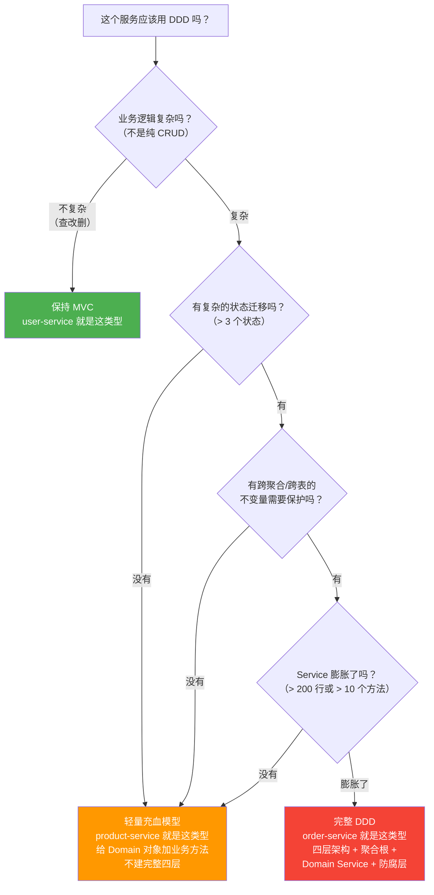

# DDD 重构实战——什么时候该用 DDD？什么时候 MVC 就够了？

> 📖 <strong>前置阅读</strong>：本文假设读者已理解 DDD 的核心概念（实体/值对象/聚合根/限界上下文）和战术代码模板（四层架构/Repository/Domain Service）。如果还不熟悉，建议先阅读 [<strong>DDD 本质</strong>]() 和 [<strong>DDD 战术落地</strong>]()。

## 一、⚡ DDD 这么好——是不是所有服务都要重构一遍？

看完前两篇——概念清楚了——代码模板也有了——冲动上来了：

```
"先把所有微服务用 DDD 重构一遍！"
  ① user-service → DDD
  ② order-service → DDD
  ③ product-service → DDD
  ④ account-service → DDD
  ⑤ inventory-service → DDD
  → 加班 2 个月——重构了一堆——代码没更好——反而更复杂了
```

<strong>DDD 不是银弹——不是所有代码都值得用 DDD。</strong>这篇的核心就是告诉你：<strong>什么该改、什么不改、改到什么程度。</strong>

## 二、🔍 诊断——我们现有的三个服务——各自是什么情况

### 2.1 user-service——经典 MVC——不改

```java
// user-service——现有结构
controller/
  └─ UserController.java       @RestController——GET/POST/PUT
service/
  └─ UserService.java          简单的增删改查 + 缓存操作
mapper/
  └─ UserMapper.java           MyBatis——selectById/insert/update
model/
  └─ User.java                 15 个字段——getter/setter

// UserService 最复杂的方法——也就 20 行
@Service
public class UserService {
    @Autowired
    private UserMapper userMapper;
    @Autowired
    private RedisTemplate<String, User> redisTemplate;

    public User getUser(Long userId) {
        String cacheKey = "user:" + userId;
        User cached = redisTemplate.opsForValue().get(cacheKey);
        if (cached != null) return cached;

        User user = userMapper.selectById(userId);
        if (user != null) redisTemplate.opsForValue().set(cacheKey, user, 30, TimeUnit.MINUTES);
        return user;
    }

    public void updateUser(User user) {
        user.setUpdatedAt(LocalDateTime.now());
        userMapper.updateById(user);
        redisTemplate.delete("user:" + user.getId());  // 失效缓存
    }
}
```

<strong>判断——不需要 DDD</strong>：

```
user-service 的特征：
  ✅ 业务逻辑简单——基本就是 CRUD
  ✅ 没有复杂的状态迁移——User 的状态就 ACTIVE/DISABLED 两个
  ✅ 没有跨聚合的不变量——User 不需要保护自己的内部数据一致性
  ✅ Service 方法 < 30 行——没有膨胀

如果用 DDD 重构——会变成什么？
  → User 变成聚合根——加一堆业务方法
  → 建 UserRepository 接口 + UserRepositoryImpl 实现——代替直接调 UserMapper
  → 建 UserDomainService——管理 User 的状态迁移
  → Application Service 编排

  结果：4 个新类 + 转换器——替代原来 1 个 Service
  → 代码量翻倍——复杂度增加——可读性反而下降
  → 在 user-service 这种纯 CRUD 上——DDD 是过度设计
```

<strong>结论：user-service 保持 MVC——不需要 DDD。</strong>

### 2.2 product-service——中等复杂——部分 DDD

```java
// product-service——现有结构
controller/
  └─ ProductController.java
service/
  └─ ProductService.java       有一些业务逻辑——库存管理
mapper/
  └─ ProductMapper.java
model/
  └─ Product.java

// ProductService 中有业务逻辑——但不算特别复杂
@Service
public class ProductService {
    @Autowired
    private ProductMapper productMapper;

    // 扣库存——有业务规则：库存不能为负
    public void deductStock(Long productId, int quantity) {
        Product product = productMapper.selectById(productId);
        if (product == null) throw new BusinessException("商品不存在");
        if (product.getStock() < quantity) throw new BusinessException("库存不足");

        product.setStock(product.getStock() - quantity);
        productMapper.updateById(product);
    }

    // 上架/下架——有状态迁移
    public void updateStatus(Long productId, ProductStatus newStatus) {
        Product product = productMapper.selectById(productId);
        if (product == null) throw new BusinessException("商品不存在");

        // 校验状态迁移——简单的 switch
        switch (newStatus) {
            case ON_SALE:
                if (product.getStock() <= 0)
                    throw new BusinessException("库存为 0 不能上架");
                break;
            case OFF_SHELF:
                // 任意状态都可以下架
                break;
        }
        product.setStatus(newStatus);
        productMapper.updateById(product);
    }
}
```

<strong>判断——可以做轻量 DDD</strong>：

```
product-service 的特征：
  ✅ 有业务规则——扣库存不能为负、库存为 0 不能上架
  ✅ 有状态迁移——ON_SALE/OFF_SHELF/DISCONTINUED
  ✅ Service 方法开始膨胀——30-50 行
  ⚠️ 但也不算特别复杂——不需要完整的 DDD 四层架构

轻量 DDD 方案——只要把 Product 变成充血模型：
  ① Product 加上业务方法（deductStock/putOnSale/takeOffShelf）
  ② 保留 Service——但只做编排
  ③ 不需要建 Domain Service、Repository 接口层——项目量级不够
  ④ 不需要建防腐层——Product 没有外部依赖
```

```java
// 轻量 DDD——Product 充血模型
public class Product {
    private Long id;
    private String name;
    private String description;
    private Money price;
    private int stock;
    private ProductStatus status;

    // ========== 业务方法——从 Service 移过来 ==========

    // 扣库存
    public void deductStock(int quantity) {
        if (quantity <= 0) {
            throw new BusinessException("扣减数量必须大于 0");
        }
        if (this.stock < quantity) {
            throw new BusinessException("库存不足——当前：" + this.stock + "——扣减：" + quantity);
        }
        this.stock -= quantity;
    }

    // 恢复库存（订单取消时）
    public void restoreStock(int quantity) {
        if (quantity <= 0) {
            throw new BusinessException("恢复数量必须大于 0");
        }
        this.stock += quantity;
    }

    // 上架
    public void putOnSale() {
        if (this.status == ProductStatus.ON_SALE) {
            throw new BusinessException("商品已在上架状态");
        }
        if (this.stock <= 0) {
            throw new BusinessException("库存为 0 不能上架");
        }
        this.status = ProductStatus.ON_SALE;
    }

    // 下架
    public void takeOffShelf() {
        if (this.status == ProductStatus.OFF_SHELF) {
            throw new BusinessException("商品已下架");
        }
        this.status = ProductStatus.OFF_SHELF;
    }

    // 查询——不影响状态
    public boolean isOnSale() { return this.status == ProductStatus.ON_SALE; }
    public boolean hasEnoughStock(int quantity) { return this.stock >= quantity; }
    public boolean isOutOfStock() { return this.stock <= 0; }

    // getter——没有 setter
}

// Service 变薄——只做编排
@Service
public class ProductService {
    @Autowired
    private ProductMapper productMapper;

    @Transactional
    public void deductStock(Long productId, int quantity) {
        Product product = productMapper.selectById(productId);
        if (product == null) throw new BusinessException("商品不存在");

        product.deductStock(quantity);       // 业务逻辑在 Product 里
        productMapper.updateById(product);   // 只负责持久化
    }

    @Transactional
    public void putOnSale(Long productId) {
        Product product = productMapper.selectById(productId);
        if (product == null) throw new BusinessException("商品不存在");

        product.putOnSale();                 // 业务逻辑在 Product 里
        productMapper.updateById(product);
    }
}

// Product 的单测——不需要 Mock Mapper——直接 new 就能测
@Test
void deductStock_shouldThrow_whenInsufficient() {
    Product product = new Product("键盘", new Money(199, "CNY"), 5);
    assertThrows(BusinessException.class, () -> product.deductStock(10));
}

@Test
void deductStock_shouldReduce_whenEnough() {
    Product product = new Product("键盘", new Money(199, "CNY"), 5);
    product.deductStock(3);
    assertEquals(2, product.getStock());
}
```

<strong>结论：product-service 适合轻量 DDD——对象变充血——不建完整四层。</strong>

### 2.3 order-service——复杂——完整 DDD

```java
// order-service——现有结构
controller/
  └─ OrderController.java
service/
  └─ OrderService.java         800 行——20 个方法——上帝类
mapper/
  ├─ OrderMapper.java
  ├─ OrderItemMapper.java
  ├─ UserMapper.java           ← 跨表——OrderService 直接调
  ├─ ProductMapper.java        ← 跨表
  └─ AccountMapper.java        ← 跨表
model/
  ├─ Order.java                贫血——只有 getter/setter
  └─ OrderItem.java            贫血

// OrderService.createOrder()——800 行中最典型的 80 行
// 问题：逻辑散落——没有不变量保护——测试困难——改代码不敢改
```

<strong>判断——需要完整 DDD</strong>：

```
order-service 的特征：
  ❌ 业务逻辑重——下单流程涉及 5 步校验（用户/商品/库存/余额/金额）
  ❌ 跨聚合操作——Order 和 Product 和 Account 的修改混在一起
  ❌ 状态迁移复杂——待支付→已支付→已发货→已送达→已完成、待支付→已取消
  ❌ Service 膨胀 800 行——20 个方法——"上帝类"
  ❌ 改需求困难——"加首单折扣"要改 3 处代码
  ❌ 测试困难——必须 Mock 5 个 Mapper——测试不跑数据库就没法测

→ 完整 DDD——聚合根 + Domain Service + Repository + 防腐层 + 领域事件
```

<strong>结论：order-service 是 DDD 的最佳场景——复杂业务逻辑 + 多状态 + 跨聚合协调。</strong>

## 三、🔄 重构 order-service——完整的 Before / After

### 3.1 Before——当前贫血模型

```java
// ===== Before——现有代码 =====

// 贫血的 Order——只有字段和 getter/setter
public class Order {
    private Long id;
    private String orderNo;
    private Long userId;
    private BigDecimal totalAmount;
    private String status;           // "PENDING_PAY", "PAID", ...
    private String province;
    private String city;
    private String district;
    private String detail;
    private LocalDateTime createdAt;
    private LocalDateTime updatedAt;
    // 30 个 getter / setter——省略
}

// 贫血的 OrderItem
public class OrderItem {
    private Long id;
    private Long orderId;
    private Long productId;
    private String productName;
    private BigDecimal price;
    private int quantity;
    // getter / setter——省略
}

// 上帝类 Service——800 行
@Service
public class OrderService {

    @Autowired
    private OrderMapper orderMapper;
    @Autowired
    private OrderItemMapper orderItemMapper;
    @Autowired
    private UserMapper userMapper;
    @Autowired
    private ProductMapper productMapper;
    @Autowired
    private AccountMapper accountMapper;
    @Autowired
    private RocketMQTemplate rocketMQTemplate;

    public Order createOrder(CreateOrderRequest request) {
        // ① 校验用户——调 UserMapper
        User user = userMapper.selectById(request.getUserId());
        if (user == null || user.getStatus() == UserStatus.BANNED) {
            throw new BusinessException("用户不存在或已封号");
        }

        // ② 校验商品——调 ProductMapper——循环中逐条查
        BigDecimal totalAmount = BigDecimal.ZERO;
        List<OrderItem> items = new ArrayList<>();
        for (CreateOrderItemRequest itemReq : request.getItems()) {
            Product product = productMapper.selectById(itemReq.getProductId());
            if (product == null || product.getStatus() != ProductStatus.ON_SALE) {
                throw new BusinessException("商品 " + itemReq.getProductId() + " 不可售");
            }
            if (product.getStock() < itemReq.getQuantity()) {
                throw new BusinessException("商品 " + itemReq.getProductId() + " 库存不足");
            }
            // 直接改 Product 表——跨聚合修改
            product.setStock(product.getStock() - itemReq.getQuantity());
            productMapper.updateById(product);

            totalAmount = totalAmount.add(product.getPrice()
                    .multiply(BigDecimal.valueOf(itemReq.getQuantity())));
            items.add(new OrderItem(itemReq.getProductId(), itemReq.getQuantity(), product.getPrice()));
        }

        // ③ 扣余额——直接调 AccountMapper——跨聚合修改
        Account account = accountMapper.selectByUserId(request.getUserId());
        if (account.getBalance().compareTo(totalAmount) < 0) {
            throw new BusinessException("余额不足");
        }
        account.setBalance(account.getBalance().subtract(totalAmount));
        accountMapper.updateById(account);

        // ④ 创建订单
        Order order = new Order();
        order.setOrderNo(generateOrderNo());
        order.setUserId(request.getUserId());
        order.setTotalAmount(totalAmount);
        order.setStatus("PENDING_PAY");
        order.setCreatedAt(LocalDateTime.now());
        orderMapper.insert(order);

        // ⑤ 保存订单项
        for (OrderItem item : items) {
            item.setOrderId(order.getId());
            orderItemMapper.insert(item);
        }

        // ⑥ 发 MQ——直接发——事务还没提交
        rocketMQTemplate.syncSend("order-created", order);

        return order;
    }

    // ... 还有 19 个方法——cancel/confirmReceipt/refund/...——总共 800 行
}
```

### 3.2 After——DDD 重构

#### Step 1：目录结构

```
order-service/
├── interfaces/rest/
│   ├── OrderController.java
│   └── dto/
│       ├── CreateOrderRequest.java
│       └── OrderResponse.java
├── application/
│   └── OrderApplicationService.java
├── domain/
│   ├── model/aggregate/
│   │   └── Order.java                    ← 聚合根——充血
│   ├── model/entity/
│   │   └── OrderItem.java                ← 聚合内部实体
│   ├── model/valueobject/
│   │   ├── Money.java                    ← 值对象——金额
│   │   ├── Address.java                  ← 值对象——地址
│   │   └── OrderStatus.java              ← 枚举——状态
│   ├── model/event/
│   │   ├── OrderCreatedEvent.java
│   │   └── OrderPaidEvent.java
│   ├── repository/
│   │   └── OrderRepository.java          ← 接口
│   └── service/
│       └── OrderDomainService.java       ← 跨聚合逻辑
└── infrastructure/
    ├── persistence/
    │   ├── OrderRepositoryImpl.java      ← 实现
    │   ├── mapper/
    │   │   ├── OrderMapper.java
    │   │   └── OrderItemMapper.java
    │   └── converter/
    │       └── OrderConverter.java
    └── messaging/
        └── RocketMQEventPublisher.java
```

#### Step 2：Domain 层——聚合根 + 值对象 + Repository 接口

```java
// ===== domain/model/aggregate/Order.java =====
// 聚合根——所有下单相关的业务逻辑都在这里

public class Order {
    private Long id;
    private String orderNo;
    private Long userId;                    // ← 引用 User 聚合——只存 ID
    private Money totalAmount;              // ← 值对象——不是 BigDecimal
    private Address deliveryAddress;        // ← 值对象——不是 5 个 String
    private OrderStatus status;             // ← 枚举——不是 String
    private List<OrderItem> items;
    private LocalDateTime createdAt;
    private LocalDateTime updatedAt;
    private List<DomainEvent> domainEvents = new ArrayList<>();

    private Order(Long userId, Address deliveryAddress, List<OrderItem> items) {
        if (userId == null) throw new IllegalArgumentException("用户 ID 不能为空");
        if (deliveryAddress == null) throw new IllegalArgumentException("收货地址不能为空");
        if (items == null || items.isEmpty()) throw new IllegalArgumentException("订单项不能为空");

        this.userId = userId;
        this.deliveryAddress = deliveryAddress;
        this.items = new ArrayList<>(items);
        this.orderNo = generateOrderNo();
        this.status = OrderStatus.PENDING_PAY;
        this.totalAmount = calculateTotalAmount();
        this.createdAt = LocalDateTime.now();
        this.updatedAt = LocalDateTime.now();

        this.domainEvents.add(new OrderCreatedEvent(this.id, this.orderNo,
                this.userId, this.totalAmount));
    }

    public static Order create(Long userId, Address deliveryAddress,
                                List<OrderItem> items) {
        return new Order(userId, deliveryAddress, items);
    }

    // ========== 业务方法——原来散落在 Service 800 行中 ==========

    public void pay(Money paidAmount) {
        if (this.status != OrderStatus.PENDING_PAY) {
            throw new BusinessException("只有待支付订单才能支付——当前：" + this.status);
        }
        if (!this.totalAmount.equals(paidAmount)) {
            throw new BusinessException("支付金额不匹配——应付：" + this.totalAmount
                    + "——实付：" + paidAmount);
        }
        this.status = OrderStatus.PAID;
        this.updatedAt = LocalDateTime.now();
        this.domainEvents.add(new OrderPaidEvent(this.id, this.orderNo, this.userId));
    }

    public void cancel(String reason) {
        if (this.status == OrderStatus.SHIPPED || this.status == OrderStatus.DELIVERED) {
            throw new BusinessException("已发货的订单不能取消");
        }
        if (this.status == OrderStatus.CANCELLED) {
            throw new BusinessException("订单已取消");
        }
        this.status = OrderStatus.CANCELLED;
        this.updatedAt = LocalDateTime.now();
        this.domainEvents.add(new OrderCancelledEvent(this.id, this.orderNo, reason));
    }

    public void ship(String trackingNumber) {
        if (this.status != OrderStatus.PAID) {
            throw new BusinessException("只有已支付订单才能发货");
        }
        this.status = OrderStatus.SHIPPED;
        this.updatedAt = LocalDateTime.now();
    }

    public void confirmReceive() {
        if (this.status != OrderStatus.SHIPPED) {
            throw new BusinessException("只有已发货订单才能确认收货");
        }
        this.status = OrderStatus.DELIVERED;
        this.updatedAt = LocalDateTime.now();
    }

    public void changeAddress(Address newAddress) {
        if (this.status != OrderStatus.PENDING_PAY) {
            throw new BusinessException("只有待支付订单才能修改地址");
        }
        if (Duration.between(this.createdAt, LocalDateTime.now()).toMinutes() > 10) {
            throw new BusinessException("下单超过 10 分钟不能修改地址");
        }
        this.deliveryAddress = Objects.requireNonNull(newAddress);
        this.updatedAt = LocalDateTime.now();
    }

    // 查询方法
    public boolean canBeCancelled() {
        return this.status == OrderStatus.PENDING_PAY || this.status == OrderStatus.PAID;
    }
    public int getTotalItemCount() {
        return items.stream().mapToInt(OrderItem::getQuantity).sum();
    }

    // 领域事件收集
    public List<DomainEvent> pollDomainEvents() {
        List<DomainEvent> events = new ArrayList<>(this.domainEvents);
        this.domainEvents.clear();
        return events;
    }

    // 包级可见——给 Repository 重建用
    static Order reconstruct(Long id, String orderNo, Long userId, Money totalAmount,
                              Address address, OrderStatus status, List<OrderItem> items,
                              LocalDateTime createdAt) {
        Order order = new Order(userId, address, items);
        order.id = id;
        order.orderNo = orderNo;
        order.totalAmount = totalAmount;
        order.status = status;
        order.createdAt = createdAt;
        return order;
    }

    private String generateOrderNo() { /* ... */ }
    private Money calculateTotalAmount() {
        return items.stream().map(OrderItem::getSubTotal)
                .reduce(new Money(BigDecimal.ZERO, "CNY"), Money::add);
    }

    // getter——只读
    public Long getId() { return id; }
    public String getOrderNo() { return orderNo; }
    public Long getUserId() { return userId; }
    public Money getTotalAmount() { return totalAmount; }
    public Address getDeliveryAddress() { return deliveryAddress; }
    public OrderStatus getStatus() { return status; }
    public List<OrderItem> getItems() { return Collections.unmodifiableList(items); }
    public LocalDateTime getCreatedAt() { return createdAt; }
    void setId(Long id) { this.id = id; }
}
```

```java
// ===== domain/model/valueobject/Money.java =====
public class Money {
    private final BigDecimal amount;    // final——不可变
    private final String currency;

    public Money(BigDecimal amount, String currency) {
        if (amount == null || amount.compareTo(BigDecimal.ZERO) < 0) {
            throw new IllegalArgumentException("金额不能为空或负数");
        }
        this.amount = amount;
        this.currency = Objects.requireNonNull(currency);
    }

    public Money add(Money other) {
        if (!this.currency.equals(other.currency))
            throw new BusinessException("不能加不同币种");
        return new Money(this.amount.add(other.amount), this.currency);
    }

    public Money multiply(BigDecimal factor) {
        return new Money(this.amount.multiply(factor), this.currency);
    }

    @Override
    public boolean equals(Object o) {
        if (!(o instanceof Money other)) return false;
        return amount.compareTo(other.amount) == 0 && currency.equals(other.currency);
    }
    @Override
    public int hashCode() { return Objects.hash(amount, currency); }
    @Override
    public String toString() { return currency + " " + amount; }

    public BigDecimal getAmount() { return amount; }
    public String getCurrency() { return currency; }
}
```

```java
// ===== domain/repository/OrderRepository.java =====
public interface OrderRepository {
    Optional<Order> findById(Long id);
    Optional<Order> findByOrderNo(String orderNo);
    List<Order> findByUserId(Long userId);
    void save(Order order);
    void delete(Order order);
    List<Order> findPendingPaymentBefore(LocalDateTime deadline);
}
```

#### Step 3：Application Service——编排——不再包含业务逻辑

```java
// ===== application/OrderApplicationService.java =====
@Service
public class OrderApplicationService {

    @Autowired
    private OrderRepository orderRepository;
    @Autowired
    private ProductRepository productRepository;  // Product 聚合的 Repository
    @Autowired
    private UserServiceAdapter userServiceAdapter; // 防腐层
    @Autowired
    private OrderDomainService orderDomainService; // Domain Service
    @Autowired
    private ApplicationEventPublisher eventPublisher;

    @Transactional
    public OrderResponse createOrder(CreateOrderCommand command) {
        // ① 通过防腐层获取 Buyer——隔离外部 UserService
        Buyer buyer = userServiceAdapter.getBuyer(command.getUserId());

        // ② 通过 ProductRepository 加载 Product 聚合
        List<Long> productIds = command.getItems().stream()
                .map(CreateOrderCommand.ItemCommand::getProductId)
                .toList();
        List<Product> products = productRepository.findByIds(productIds);

        // ③ Domain Service——创建 OrderItem——校验库存
        List<OrderItem> orderItems = orderDomainService.createOrderItems(
                command.getItems(), products);

        // ④ Domain Service——计算价格
        Money totalPrice = orderDomainService.calculatePrice(
                command.getUserId(), orderItems);

        // ⑤ 创建聚合根——业务校验在构造函数中
        Order order = Order.create(command.getUserId(),
                command.getDeliveryAddress(), orderItems);

        // ⑥ 保存——只保存 Order 聚合——不保存 Product 和 Account
        orderRepository.save(order);

        // ⑦ 在事务提交后发布领域事件——异步扣库存 + 发优惠券
        for (DomainEvent event : order.pollDomainEvents()) {
            eventPublisher.publishEvent(event);  // Spring 内部事件——事务提交后转发到 MQ
        }

        // ⑧ 返回
        return OrderResponse.from(order);
    }

    @Transactional
    public void payOrder(Long orderId, Money paidAmount) {
        Order order = orderRepository.findById(orderId)
                .orElseThrow(() -> new BusinessException("订单不存在"));
        order.pay(paidAmount);             // 业务逻辑在聚合根中
        orderRepository.save(order);        // 保存
        for (DomainEvent event : order.pollDomainEvents()) {
            eventPublisher.publishEvent(event);
        }
    }

    @Transactional
    public void cancelOrder(Long orderId, String reason) {
        Order order = orderRepository.findById(orderId)
                .orElseThrow(() -> new BusinessException("订单不存在"));
        order.cancel(reason);               // 业务逻辑在聚合根中
        orderRepository.save(order);
        for (DomainEvent event : order.pollDomainEvents()) {
            eventPublisher.publishEvent(event);
        }
    }
}
```

#### Step 4：领域事件——异步处理跨聚合操作

```java
// ===== 事件监听——在事务提交后处理 =====
@Component
public class OrderEventDispatcher {

    @Autowired
    private InventoryServiceAdapter inventoryAdapter;  // 防腐层——隔离 Inventory 服务
    @Autowired
    private AccountServiceAdapter accountAdapter;      // 防腐层——隔离 Account 服务
    @Autowired
    private RocketMQTemplate rocketMQTemplate;

    @TransactionalEventListener(phase = TransactionPhase.AFTER_COMMIT)
    public void onOrderCreated(OrderCreatedEvent event) {
        // ① 异步扣库存——通过防腐层调用——不在 Order 的事务中
        inventoryAdapter.deductStock(event.orderId());

        // ② 发送 MQ——通知其他服务（营销、物流等）
        rocketMQTemplate.syncSend("order-created-topic", event);
    }

    @TransactionalEventListener(phase = TransactionPhase.AFTER_COMMIT)
    public void onOrderCancelled(OrderCancelledEvent event) {
        // ① 恢复库存
        inventoryAdapter.restoreStock(event.orderId());

        // ② 发送 MQ
        rocketMQTemplate.syncSend("order-cancelled-topic", event);
    }
}
```

### 3.3 Before / After 对比——一图看懂

```
Before（贫血 MVC）：
  ┌────────────────────────────────────────────┐
  │  OrderService.java — 800 行                 │
  │  ① 查用户 ② 查商品 ③ 扣库存 ④ 扣余额       │
  │  ⑤ 建订单 ⑥ 建订单项 ⑦ 发 MQ               │
  │  直接调 5 个 Mapper——跨 4 张表——一个事务     │
  │  Order.java — 只有 getter/setter            │
  │  OrderItem.java — 只有 getter/setter        │
  └────────────────────────────────────────────┘
  测试：必须 Mock 5 个 Mapper
  改代码：在 800 行中找——改 3 处

After（DDD）：
  ┌──────────────────────────────────────────────┐
  │  OrderApplicationService.java — 40 行         │
  │  编排：查聚合 → 调 Domain Service → 创建聚合   │
  │        → 保存 → 发事件                        │
  │                                               │
  │  Order.java（聚合根）— 200 行                  │
  │  业务逻辑：pay() / cancel() / ship() / ...     │
  │  保护不变量：状态迁移校验、金额匹配校验          │
  │                                               │
  │  OrderDomainService.java — 50 行               │
  │  跨聚合逻辑：createOrderItems / calculatePrice  │
  │                                               │
  │  Money.java（值对象）— 30 行                    │
  │  Address.java（值对象）— 40 行                  │
  │                                               │
  │  UserServiceAdapter.java（防腐层）— 20 行       │
  │  翻译外部 UserDTO → Buyer                      │
  └──────────────────────────────────────────────┘
  测试：聚合根可以直接 new——不依赖数据库
  改代码：找到对应的聚合根方法——改一处——不影响其他
```

## 四、📊 DDD vs MVC——决策框架

### 4.1 一张决策图



### 4.2 三档方案的适用范围

| 方案 | 工作量 | 适用场景 | 示例 |
|------|:---:|------|------|
| <strong>MVC（贫血模型）</strong> | 标准 | 纯 CRUD——没有复杂业务逻辑 | user-service、config-service |
| <strong>轻量充血模型</strong> | +30% | 有业务规则——但状态迁移简单 | product-service、inventory-service |
| <strong>完整 DDD 四层</strong> | +80% | 复杂业务逻辑 + 多状态 + 跨聚合 | order-service、payment-service |

<strong>关键判断依据</strong>：

```
决定了是否用 DDD 的 5 个信号：
  ① Service 类 > 200 行 → 该拆了
  ② 一个方法改了 3 个以上的表 → 聚合边界不清
  ③ 改一个功能要翻 3 个以上的文件 → 逻辑散落
  ④ 加新功能时心里没底——"会不会影响已有逻辑？" → 没有不变量保护
  ⑤ 单测写不出来——必须跑数据库 → 逻辑和持久化耦合

只要出现 2 个信号——就该考虑轻量充血了
出现 4 个以上——完整 DDD 值得投入
```

## 五、⚠️ DDD 的三大误区——什么时候不该用

### 误区一：所有微服务都要 DDD

```
❌ 错误想法：
  "DDD 是微服务的标配——所有服务都应该按 DDD 来写"

✅ 正确做法：
  user-service → MVC 就够了——20 行一个方法——CRUD 而已
  notification-service → MVC 就够了——发短信——没有业务逻辑
  config-service → MVC 就够了——管理配置项——就是 restful CRUD

  这些服务强行 DDD：
    → 多了 10 个类——每个类的代码不到 30 行
    → 团队抱怨"好复杂——以前就一个 Service 搞定"
    → 新人看不懂——"为什么查个用户要过 3 层"
```

### 误区二：DDD = 不用 @Transactional

```
❌ 错误想法：
  "DDD 说一个事务只改一个聚合——那就不用事务了"

✅ 正确做法：
  一个事务 = 一个聚合的修改——但事务还是要的
  
  Application Service 的 createOrder() 加了 @Transactional
    → 事务内只改了 Order 聚合——没改 Product 和 Account
    → Product 的库存扣减通过领域事件异步处理——不在 Order 的事务中
    → 但 Order 聚合本身（Order + OrderItem）是在事务中的——保证原子性

  DDD 不是"不用事务"——是"事务边界 = 聚合边界"
```

### 误区三：聚合拆得越细越好

```
❌ 错误做法：
  把 Order 和 OrderItem 拆成两个独立的聚合——"OrderItem 也很重要"
  → OrderItem 有独立的 Repository——外部可以直接调 orderItemRepository.save(item)
  → 绕过 Order 的校验——"数量必须 > 0"、"状态必须 PENDING_PAY"——全废了

✅ 正确做法：
  OrderItem 在 Order 聚合内部——没有独立的 Repository
  所有对 OrderItem 的修改——必须通过 Order.addItem() / Order.changeItemQuantity()
  Order 是唯一的入口——保护 Order 聚合内的所有不变量
```

## 🎯 总结

1. <strong>DDD 不是银弹——看复杂度而不是跟风</strong>：user-service（纯 CRUD）保持 MVC，product-service（有业务规则但不算复杂）做轻量充血，order-service（复杂逻辑 + 多状态 + 跨聚合）用完整 DDD。5 个信号的 checklist 帮你决定——"200 行 Service / 3 个表的事务 / 改 3 个文件 / 改代码没底 / 单测写不出来"。

2. <strong>重构后最大的变化——业务逻辑从 Service 移到聚合根</strong>：不是增加代码——是代码换了个位置。聚合根的构造函数/业务方法保护不变量——Application Service 变成纯粹的编排——5 步流程（查聚合 → 调 Domain Service → 创建聚合 → 保存 → 发事件）一目了然。

3. <strong>跨聚合的修改——从事务内移到领域事件中异步处理</strong>：扣库存和扣余额不在 Order 的事务中——而是通过 OrderCreatedEvent 异步触发。事务边界 = 聚合边界——一个事务只改一个聚合——靠 MQ + 幂等消费保证最终一致性。

4. <strong>不要为了 DDD 而 DDD——过度设计比贫血更糟糕</strong>：纯 CRUD 的 Service 强行 DDD——多了 10 个类——没人维护得了。轻量充血是 80% 场景的最优解——对象有行为——但不过度分层。

> 📖 <strong>系列回顾</strong>：DDD 三部曲到此结束——
> 1. [<strong>DDD 本质——领域驱动设计的核心概念</strong>]() —— 实体/值对象/聚合根/限界上下文/领域事件
> 2. [<strong>DDD 战术落地——代码怎么写</strong>]() —— 四层架构/Repository/Domain Service/防腐层/Outbox
> 3. <strong>DDD 重构实战——什么时候该用 DDD</strong>（本文） —— MVC vs 轻量充血 vs 完整 DDD 的决策框架
>
> 📖 <strong>下一步预告</strong>：代码写完了——怎么提交到 Git？怎么跑 CI？怎么自动部署？下一系列——GitLab CI/CD 全家桶：从零搭建 GitLab + Runner，编译 → 单测 → SonarQube → 构建镜像 → Harbor → 多环境部署（dev/staging/prod）。
