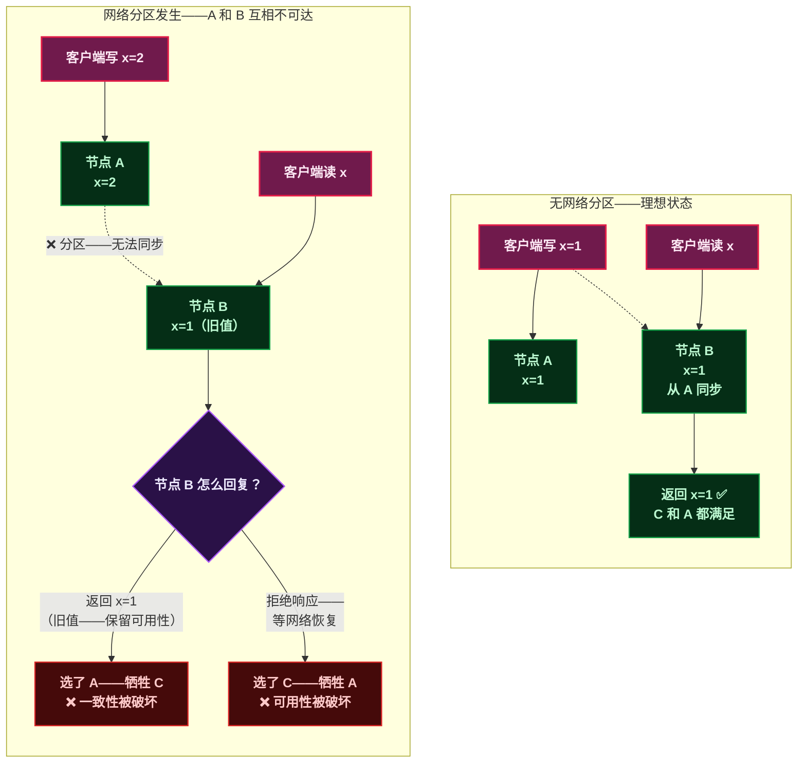
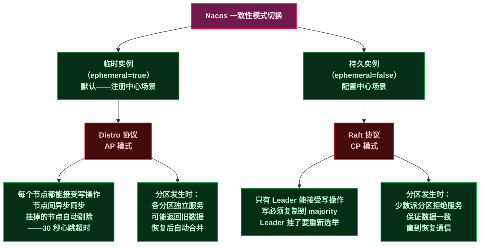
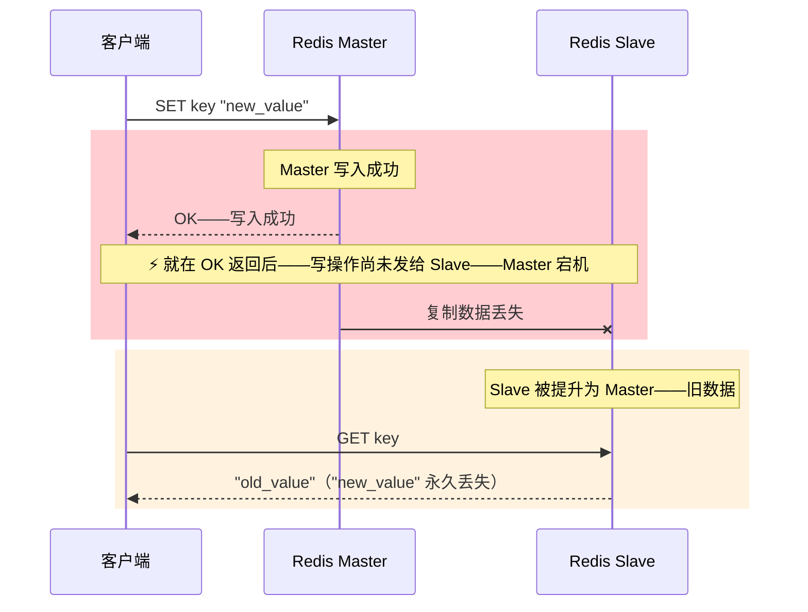
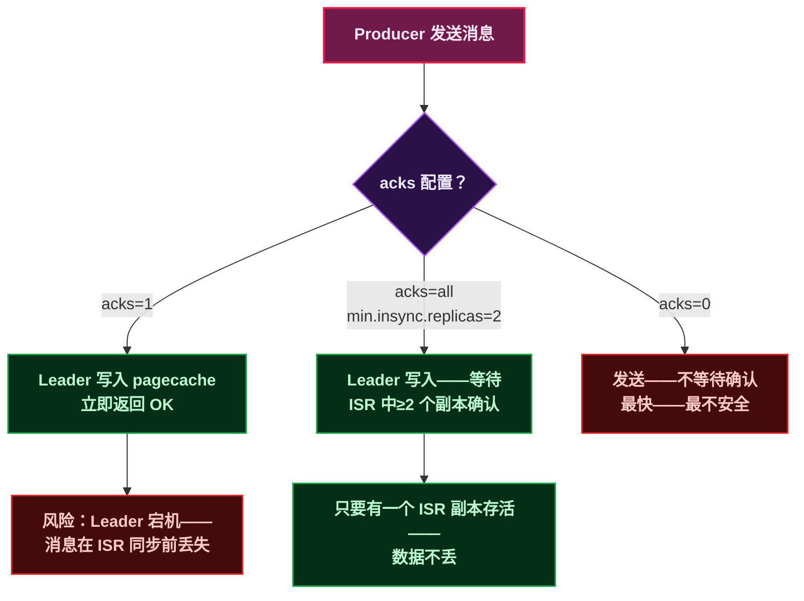
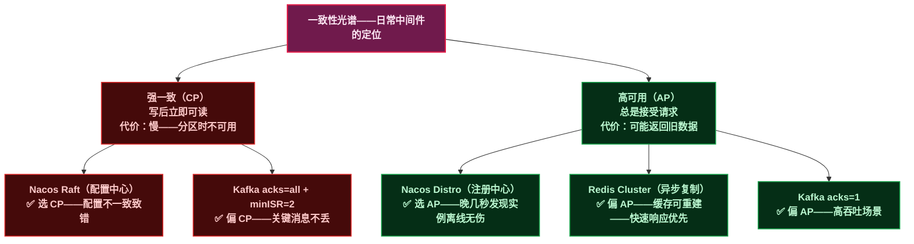

# CAP 定理与一致性模型

[上篇]()讲了两件事：网络不可靠、时钟不可信。结尾留了一句话——<strong>这两个不确定性叠加——迫使你在"等精确答案"和"快速给大致答案"之间选边站。</strong>

这句话有一个更正式的名字：<strong>CAP 定理。</strong>

但 CAP 被误解的程度——大概仅次于"TCP 三次握手"——绝大多数文章都把它简化成"一致性、可用性、分区容错性三者选其二"——就像点菜时三选二。

<strong>真正的 CAP 远比这复杂——而且它不是一个开关——而是一条光谱。</strong>

> 📌 <strong>前置知识</strong>：建议先读[上篇]()——理解网络分区和时钟漂移的成因。另外需要有 Nacos 的基本使用经验（知道它可以做注册中心和配置中心即可）。

---

## 一、CAP 的经典定义——先搞清楚每个字母到底在说什么

CAP 是 Eric Brewer 在 2000 年提出的——后来由 Gilbert 和 Lynch 在 2002 年给出了形式化证明。<strong>注意——CAP 里的"证明"不是实验验证——是数学上严格证明了这三个性质不可能同时满足。</strong>

先搞清楚每个字母的精确含义：

| 字母 | 全称 | 经典定义 | 一句话翻译 |
|:---:|------|------|------|
| C | Consistency | 每次读操作——都能读到<strong>最近一次写操作的结果</strong>——所有节点在同一时刻看到的数据完全一致 | "你刚写的——马上就能读到" |
| A | Availability | 每个发给<strong>非故障节点</strong>的请求——都能在有限时间内得到一个<strong>非错误的响应</strong> | "请求一定有人接——不会晾着你" |
| P | Partition Tolerance | 系统在<strong>部分节点之间的网络被切断</strong>后——仍然能继续对外提供服务 | "网线拔了——系统还能撑——不至于完全挂掉" |

> ⚠️ <strong>新手提示</strong>：CAP 里的 P（分区容错）不是"系统可以容忍多少台机器宕机"——那叫容错。P 的精确含义是——<strong>任意数量的消息丢失或延迟——系统不能进入不可恢复的状态</strong>。换句话说——P 不是在问"系统会不会出分区"——分区是客观物理现象——P 是在问"分区发生时——系统还能不能运转"。

现在用一张图看清楚：没有分区时的理想状态 vs 分区发生时的两难。



<strong>分区发生时——你只能在"接受不一致"和"拒绝服务"之间二选一。</strong>

这就是 CAP 最经典的表述：一个分布式系统在网络分区发生时——最多同时满足 C 和 A 中的一项。P 不是可选——P 是前提——分区一定会发生——你必须在 C 和 A 之间做一个倾向性选择。

---

## 二、CAP 最常被误解的三个地方

<strong>误解一：CAP 是"三选二"——设计系统时从 C、A、P 中选两个。</strong>

这是最普遍的错误理解。事实是——<strong>P 不是可选的——分区是物理现象——你只能选择"分区发生时该怎么办"</strong>——是保 C 还是保 A。把 P 当成可选——等于说"我希望网络永远不断"——这显然不现实。

<strong>误解二：没有分区的时候——CAP 不适用——系统可以同时满足 C 和 A。</strong>

对——但这不叫"打破了 CAP"——而叫<strong>"当前没有分区——所以 CAP 没有触发"</strong>。CAP 是一个约束——只在分区事件触发后才生效。日常运行时——大多数系统的确同时提供了一致性和可用性——这不矛盾——因为网络是正常的。

<strong>误解三：选了 CP 就永远不一致——选了 AP 就永远不一致——这是个二值开关。</strong>

这是把问题想简单了。真实系统里——C 和 A 都是<strong>程度问题</strong>——不是 0 和 1。


<strong>真实现实——没有哪个中间件是"纯 CP"或"纯 AP"——每个都在光谱上选了一个位置。</strong>

---

## 三、一致性是怎么"变弱"的——三个核心问题

脱离具体数据去谈"一致性到了什么程度"——等于什么都没说。要搞清楚——必须回答三个问题：

| 维度 | 问题 | 举例 |
|------|------|------|
| <strong>一致性范围</strong> | 多少节点需要一致？所有节点？还是多数就行？ | Raft 要求 majority——Nacos Distro 只要求"最终" |
| <strong>一致性延迟</strong> | 一次写入后——多久才能保证所有读操作能读到新值？ | MySQL 主从复制 0.1 秒——Redis 异步复制 0.01 秒——但 Redis 丢数据的概率更高 |
| <strong>冲突处理</strong> | 如果两个节点同时写入——发生冲突——怎么解决？ | 最后一个写入胜出（Last Write Wins）——或者设计可合并的数据结构（CRDT） |

这三个问题——每个中间件都在用自己的方式回答。

---

## 四、Nacos——一个组件为什么能同时提供 AP 和 CP

Nacos 是博客里已经覆盖了很多次的组件——但有一个设计细节值得重新审视：<strong>Nacos 是少有的同时支持 AP 和 CP 两种模式的中间件。</strong>



<strong>为什么注册中心用 AP——而配置中心用 CP？</strong>

注册中心的场景——product-service 的三个实例——其中一个挂了——其他两个还在——消费者<strong>晚几秒感知到变化</strong>不会造成数据错误——顶多短暂调用了一下不可用的地址——触发一次重试就解决了。用 AP——牺牲一致性换取高可用——合理。

配置中心的场景——线上服务的数据库连接池从 20 改成 50——如果三个节点中有一个读到了旧配置（20 而不是 50）——服务可能还未达到预期性能。配置的一时不一致会导致线上行为错误。用 CP——牺牲可用性换取一致——也合理。

> ⚠️ <strong>新手提示</strong>：Nacos 的临时实例剔除不是"实时"的——默认心跳间隔 5 秒——超时 15 秒（3 个心跳周期内未收到心跳才剔除）。在这 15 秒窗口内——消费者仍有可能调用到已宕机的实例。这就是 AP 的代价——它承诺"最终你会发现挂了"——但不承诺"立刻发现"。

---

## 五、Redis Cluster——AP 阵营里的投机分子

Redis Cluster 的一致性选择相比 Nacos 要微妙得多——它<strong>不是纯粹的 AP——而是在 AP 的基础上——做了一些"尽量让数据不丢"的努力。</strong>

```
Redis Cluster 的复制模型：
  Master M1 → 异步复制 → Slave S1
  Master M2 → 异步复制 → Slave S2
  Master M3 → 异步复制 → Slave S3

主节点接受写操作——异步同步给从节点——不等从节点确认
```

<strong>异步复制意味着——Master 收到写请求——返回 OK 给客户端——同时把这个写操作放到复制缓冲区——后台线程异步发给 Slave。如果 Master 在"返回 OK"和"发复制包"之间宕机——这个写操作就永久丢失了。</strong>



Redis 的 `wait` 命令可以手动要求"至少 N 个从节点确认"——等于在<strong>单次操作上临时提升到接近 CP 级别</strong>——但要付出延迟代价。

<strong>Redis Cluster 做 AP 选择的原因很好理解：缓存数据本就可以重新计算——丢一条缓存数据通常不是致命的——但缓存返回超时会影响整个服务——所以"快速响应"优先于"数据绝对一致"。</strong>

---

## 六、Kafka——ISR 机制在一致性光谱上的精确位置

Kafka 既不是纯 AP 也不是纯 CP——<strong>它通过 ISR（In-Sync Replicas，同步副本集合）机制——让用户自己决定往哪边靠。</strong>

```
Topic: order-events——分区数 3——副本数 3
  Partition 0: Broker 1 (Leader)——Broker 2 (ISR Follower)——Broker 3 (ISR Follower)
  Partition 1: Broker 2 (Leader)——Broker 3 (ISR Follower)——Broker 1 (ISR Follower)
  Partition 2: Broker 3 (Leader)——Broker 1 (ISR Follower)——Broker 2 (ISR Follower)

ISR = 与 Leader 保持同步的副本集合（延迟低于 replica.lag.time.max.ms——默认 30 秒）
```

Kafka 的一致性强度由两个配置控制：

| 配置 | 值 | 一致性效果 |
|------|------|------|
| `acks=1` | Leader 写入成功即返回 | <strong>接近 AP</strong>——Leader 宕机可能丢数据——持久性 |
| `acks=all` / `acks=-1` | 所有 ISR 副本确认后才返回 | <strong>接近 CP</strong>——只要 ISR 中至少一个副本存活就不会丢——但延迟更高 |
| `min.insync.replicas=2` | ISR 中至少要有 2 个副本 | <strong>配合 acks=all</strong>——保证至少写入两个节点——进一步降低丢数据概率 |



> ⚠️ <strong>新手提示</strong>：`acks=all` 不是"所有副本都确认"——是<strong>所有 ISR 中的副本</strong>确认。如果原来 ISR 有 3 个副本——其中 2 个因为延迟被踢出 ISR——那 `acks=all` 只需要当前 ISR 中的 1 个副本确认（Leader 自己）。这就是为什么必须同时设置 `min.insync.replicas`——它规定了 ISR 最少要有几个副本——不够就拒绝写入——防止 ISR 缩到只剩 Leader 时降级成 `acks=1`。

<strong>Kafka 的智慧在于——它没有替你选——它把一致性和可用性的权衡——以配置项的形式交给了你。</strong>

---

## 七、一张全景图——三个中间件在一致性光谱上的位置



这张图里有几个结论值得注意：

<strong>第一——没有一个中间件是纯 CP 或纯 AP。</strong>Nacos Raft 在无分区时响应很快（不像纯 CP 那样不可用）——Redis Cluster 有 `wait` 命令可以临时接近 CP。光谱上的位置是倾向——不是绝对。

<strong>第二——同一个中间件——不同功能选不同模型。</strong>Nacos 注册中心用 AP、配置中心用 CP——因为它们的业务后果不同。注册中心返回旧地址——顶多重试一次——配置中心返回旧配置——可能直接引发线上故障。

<strong>第三——选择不是非黑即白——是可以配置的。</strong>Kafka 的 acks 从 0 到 all——本质上是在一致性光谱上滑动——让用户按场景付费。

---

## 八、总结——这篇讲了什么

| 核心概念 | 精确含义 | 误区 |
|------|------|------|
| CAP 不是三选二 | P 是物理前提——你只能在 C 和 A 之间做倾向性选择 | 把 P 当可选——设计假定网络永不分区 |
| 一致性光谱 | 从 CP 到 AP 是连续的光谱——不是开关 | 以为选了 CP 就永远一致——选了 AP 就永远不一致 |
| Nacos 双模 | Distro（AP）给注册中心——Raft（CP）给配置中心 | 不知道 Nacos 有两种模式——或者不知道为什么这样选 |
| Redis Cluster | 异步复制默认 AP——`wait` 临时提升 | 以为 Redis 不丢数据——或者以为它随时会丢 |
| Kafka ISR | acks + minISR 让用户自行选择一致性级别 | `acks=all` 误解成"所有副本都确认" |

<strong>理解了 CAP 和一致性光谱——再看 Nacos 的心跳机制、RocketMQ 的同步刷盘、Sentinel 的限流策略——核心问题其实都是同一个：在一致性和可用性之间——这个组件选了什么位置——以及为什么。</strong>

下一篇——进入 Raft 共识算法——它是 Nacos CP 模式和 etcd 的核心——讲清楚"从选举到日志复制——多数派到底是怎么达成一致的"。

---

> 📖 <strong>本系列导航</strong>：
> - 第一篇：[网络与时间的不确定性]()
> - <strong>本文</strong>：第二篇——CAP 定理与一致性模型
> - 第三篇：Raft 选举与心跳——Nacos/Dubbo 中的故障检测与领导者选举
> - 第四篇：流控算法——Sentinel 滑动窗口、令牌桶与 Dubbo 负载均衡
