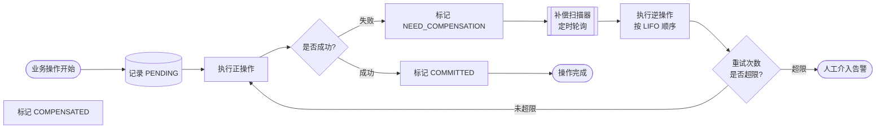
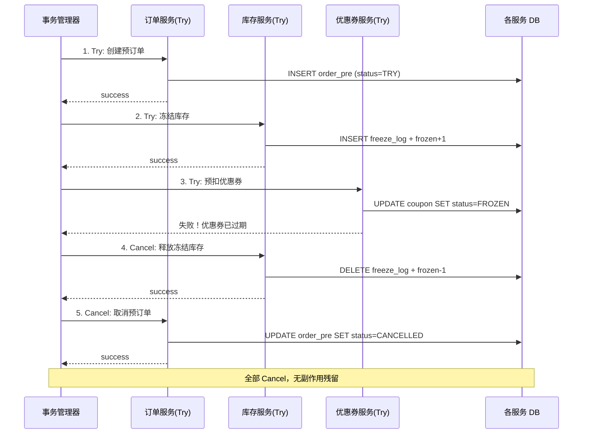
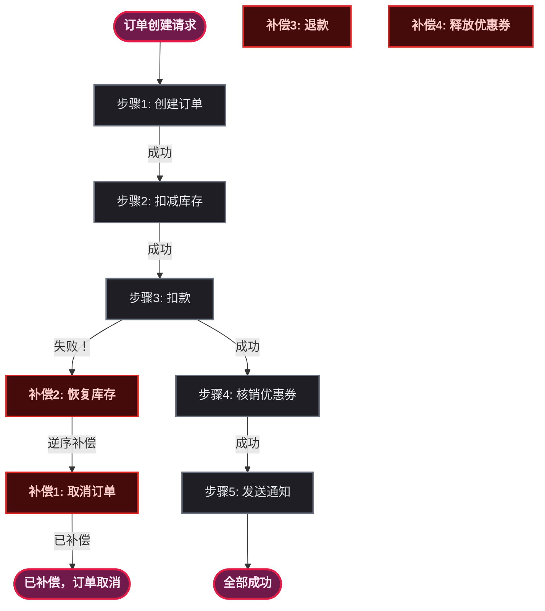
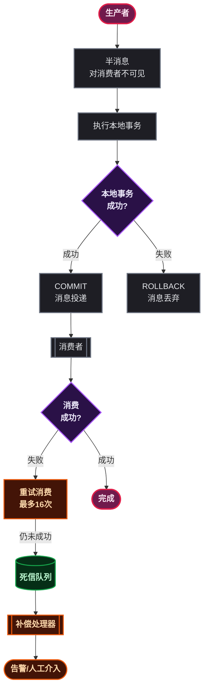
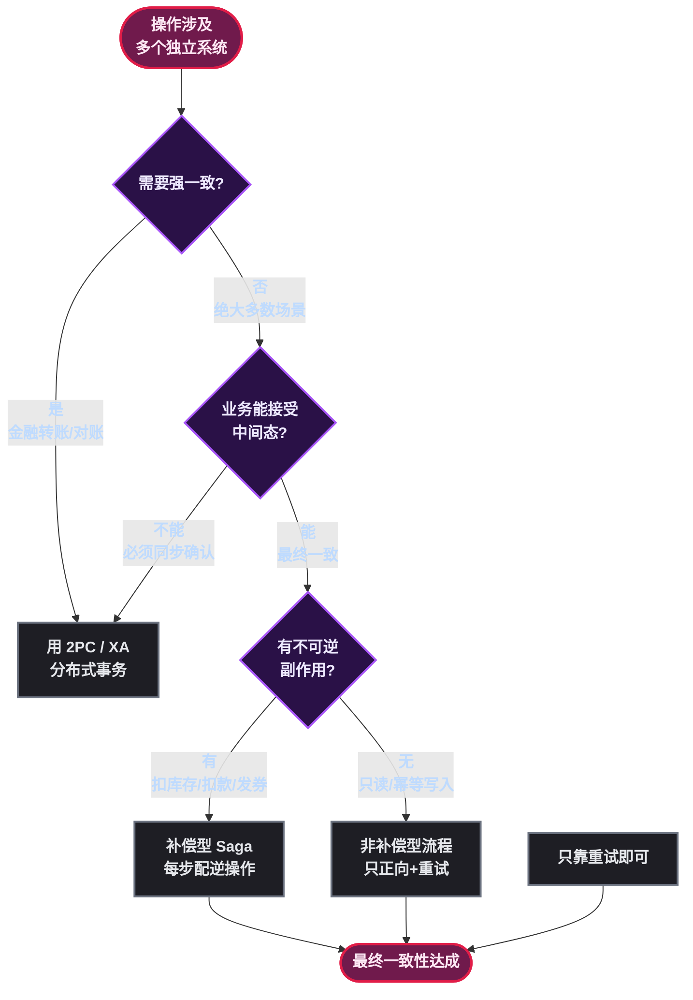
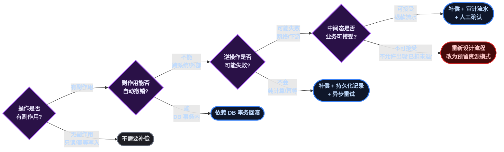

# 补偿：别等炸了才想兜底

某一天凌晨，运维群里弹出一条告警：订单服务返回码全是 500，错误日志里赫然写着 `库存扣减失败，事务已提交`。排查一圈发现——库存服务超时了，但订单服务的本地事务已经提交，用户钱扣了，货没发出去。

这不是什么玄幻剧情。只要你的系统**一次操作涉及两个以上的外部依赖**，它就一定会发生。

问题的根儿不在于某个服务挂了，而在于**挂了之后没人善后**。这就是补偿机制要解决的事。

> 📌 前置知识：本文假设读者已经知道数据库事务 ACID 的基本概念、分布式系统中"网络不可靠"的前提。如果对分布式事务的 2PC / TCC / Saga 还没概念，建议先翻一下本站的《分布式事务基础》和《TCC + Saga》两篇。

---

## 什么是补偿机制

先给个直接的定义：

> **补偿（Compensation）** 是一系列操作，用于**撤销**一个已经部分执行或完全执行的业务流程，使系统回到业务上可接受的**一致状态**。

注意两个关键词：

- **撤销**——不是 "取消"，是"对已经产生的副作用进行逆操作"。扣掉的库存加回去，冻结的额度解冻，发的优惠券标记作废。
- **业务上可接受**——补偿之后的状态不一定等于执行之前的状态。比如退款流水里多了一条退款记录，这不是脏数据，这是**业务可审计的中间态**，本来就是设计的一部分。

补偿 ≠ 回滚（Rollback）。回滚是数据库层的物理操作，依赖 undo log，对业务透明；补偿是业务层的逻辑操作，需要开发者**显式编写逆操作代码**。

`> ⚠️ 新手提示：把补偿理解成 Ctrl+Z 不准确。Ctrl+Z 是"回到上一步"，补偿是"把已经造成的后果消弭掉"——相当于打翻了水杯，Ctrl+Z 是水自动回到杯子里（物理回滚），补偿是拿抹布擦干净桌子然后重新倒一杯（业务补救）。`

---

## 补偿思维从本地就开始了

很多人觉得补偿是"分布式事务"才碰的东西，其实**本地代码里到处都是补偿的影子**，只是你没把它当成一个专门的概念。

### 场景一：文件操作的"撤销三部曲"

```java
public void processFile(String srcPath, String destPath) {
    File backupFile = null;
    File tempFile = null;
    try {
        // 步骤1：创建备份
        backupFile = new File(srcPath + ".bak");
        Files.copy(Path.of(srcPath), backupFile.toPath(),
                   StandardCopyOption.REPLACE_EXISTING);

        // 步骤2：处理并写入临时文件
        tempFile = new File(destPath + ".tmp");
        try (var reader = new BufferedReader(new FileReader(srcPath));
             var writer = new BufferedWriter(new FileWriter(tempFile))) {
            String line;
            while ((line = reader.readLine()) != null) {
                writer.write(transform(line));
                writer.newLine();
            }
        }

        // 步骤3：原子替换目标文件
        Files.move(tempFile.toPath(), Path.of(destPath),
                   StandardCopyOption.REPLACE_EXISTING,
                   StandardCopyOption.ATOMIC_MOVE);

    } catch (Exception e) {
        // 补偿逻辑：清掉所有中间产物
        if (tempFile != null && tempFile.exists()) {
            tempFile.delete();           // 撤销步骤2
        }
        if (backupFile != null && backupFile.exists()) {
            try {
                Files.move(backupFile.toPath(), Path.of(srcPath),
                           StandardCopyOption.REPLACE_EXISTING);  // 撤销步骤1
            } catch (IOException ex) {
                log.error("连备份恢复都失败了，手动处理吧...", ex);
            }
        }
        throw new ProcessingException("文件处理失败，已尽力回滚", e);
    }
}
```

这段代码没什么高深的，但仔细看它的结构——**每执行一步，catch 里就有对应的逆操作**。这就是补偿机制的最朴素形态：

- 步骤 1（创建备份）的逆操作 → 用备份恢复原文件
- 步骤 2（写临时文件）的逆操作 → 删掉临时文件
- 步骤 3 原子移动成功 → 无需补偿

**三个步骤的逆操作顺序恰好跟正操作相反**，跟栈的 LIFO 一模一样——这可不是巧合，补偿链天然就是逆序的。

### 场景二：try-finally 是你最熟悉的补偿

```java
Lock lock = lockManager.acquireLock("order:12345");
try {
    // 执行业务逻辑
    processOrder(order);
} finally {
    lockManager.releaseLock(lock);  // 补偿：释放锁
}
```

`acquireLock` 的副作用是"持有锁"， `releaseLock` 就是它的逆操作。 `finally` 保证了无论 `processOrder` 是否抛异常，锁都会被释放。

类似的还有：

```java
Connection conn = dataSource.getConnection();
try {
    // 执行 SQL
} finally {
    conn.close();  // 补偿：归还连接
}
```

> ⚠️ 新手提示： `close()` 在很多场景下就是最基础的补偿操作——它把资源"还回去"，消除"占用"这个副作用。这也是为什么 try-with-resources 这么香：编译器帮你保证补偿一定执行。

### 场景三：缓存更新失败，DB 要补偿吗

来看一个更微妙的场景：

```java
@Transactional
public void updateProduct(ProductDTO dto) {
    // 1. 更新数据库
    productMapper.updateById(dto.toEntity());

    // 2. 更新 Redis 缓存
    try {
        redisTemplate.opsForValue().set("product:" + dto.getId(), dto,
                                         Duration.ofMinutes(30));
    } catch (Exception e) {
        log.warn("缓存更新失败，但不影响主流程", e);
        // 这里要不要回滚 DB？
    }
}
```

问题来了：**Redis 更新失败，要不要回滚 MySQL？**

大多数场景下答案是**不要**。理由：

1. 缓存是**可重建的**，失败了下次读请求会从 DB 重新加载，这是缓存模式的天然容错
2. 为缓存失败回滚 DB 是本末倒置——DB 是真相源（Source of Truth），缓存是影子
3. 回滚 DB 意味着一次**非关键路径的失败**影响了**关键路径的成功**

但如果你没有设置 TTL，或者业务上**强依赖缓存数据的新鲜度**（比如秒杀库存扣减走的是 Redis 扣减再异步落库），那就需要反向补偿——Redis 扣减失败要补偿回 Redis 的额度。

```java
public Result deductStock(String productId, int quantity) {
    // 先在 Redis 扣减（关键路径）
    Long remaining = redisTemplate.opsForValue()
            .decrement("stock:" + productId, quantity);

    if (remaining < 0) {
        // 补偿：加回去
        redisTemplate.opsForValue()
                .increment("stock:" + productId, quantity);
        return Result.fail("库存不足");
    }

    // 异步同步到 DB（非关键路径，失败可重试）
    eventBus.publish(new StockDeductedEvent(productId, quantity));
    return Result.ok();
}
```

**关键路径失败必须补偿，非关键路径失败可以靠异步重试或定时对账。** 这个原则贯穿所有补偿场景。

---

## 跨服务了，补偿就变成正经事了

本地代码里的补偿最多是 catch 块写几行 `delete()` / `close()`。一旦跨了服务边界，情况就复杂得多：

1. **逆操作本身也可能失败**——库存扣减成功了，退款接口挂了怎么办
2. **没有全局事务帮你统一回滚**——每个服务有自己的数据库，各自提交
3. **中间态可能被读到**——订单已创建但支付已退款，这个"临时的脏数据"有人看到了

### 场景四：RPC 调用的补偿——最直白的分布式问题

```java
@Service
public class OrderService {

    @Autowired
    private InventoryClient inventoryClient;  // RPC 调用库存服务
    @Autowired
    private CouponClient couponClient;        // RPC 调用优惠券服务
    @Autowired
    private OrderMapper orderMapper;

    @Transactional
    public CreateOrderResult createOrder(CreateOrderRequest req) {
        // 步骤1：创建订单（本地 DB）
        Order order = Order.from(req);
        orderMapper.insert(order);

        try {
            // 步骤2：扣减库存（远程 RPC）
            DeductResult deductResult = inventoryClient.deduct(
                req.getProductId(), req.getQuantity());

            if (!deductResult.isSuccess()) {
                throw new BusinessException("库存扣减失败");
            }

        } catch (Exception e) {
            // 库存扣减失败 → 补偿步骤1：订单需要取消
            // 但此时本地事务还没提交，直接抛异常让 @Transactional 回滚即可
            throw e;
        }

        try {
            // 步骤3：核销优惠券（远程 RPC）
            couponClient.use(req.getCouponId(), order.getId());

        } catch (Exception e) {
            // ⚠️ 优惠券核销失败 → 需要补偿步骤1和步骤2
            // 但订单还没提交（本地事务），库存已经扣了（远程已提交）

            // 补偿步骤2：恢复库存
            inventoryClient.restore(req.getProductId(), req.getQuantity());

            // 步骤1 由 @Transactional 回滚
            throw new BusinessException("优惠券核销失败，已恢复库存", e);
        }

        // 所有步骤成功，事务提交
        return CreateOrderResult.success(order.getId());
    }
}
```

这段代码已经在危险的边缘了。问题在哪？

**假如 `couponClient.use()` 抛异常， `inventoryClient.restore()` 也失败了怎么办？**

这时候库存已经扣了，优惠券没核销，恢复库存的请求又失败了。库存服务那边少了几件库存，用户这边订单没创建成功——出现了一个**悬空的副作用**。

这就是为什么正经的分布式补偿方案需要**持久化的操作记录**和**重试机制**，而不是靠 catch 块里调一次逆操作就完事。

下面看一个改进版：

```java
@Service
public class OrderServiceV2 {

    @Autowired
    private CompensationLogMapper compLogMapper;  // 补偿操作记录表

    @Transactional
    public CreateOrderResult createOrder(CreateOrderRequest req) {
        // 步骤1：创建订单
        Order order = Order.from(req);
        orderMapper.insert(order);

        // 步骤2：扣减库存
        String inventoryLogId = UUID.randomUUID().toString();
        compLogMapper.insert(new CompensationLog(
            inventoryLogId, "INVENTORY_DEDUCT",
            order.getId(), "PENDING"
        ));

        try {
            DeductResult result = inventoryClient.deduct(
                req.getProductId(), req.getQuantity());
            compLogMapper.updateStatus(inventoryLogId, "COMMITTED");
        } catch (Exception e) {
            compLogMapper.updateStatus(inventoryLogId, "FAILED");
            throw e;  // 还没提交其他副作用，直接抛
        }

        // 步骤3：核销优惠券
        String couponLogId = UUID.randomUUID().toString();
        compLogMapper.insert(new CompensationLog(
            couponLogId, "COUPON_USE",
            order.getId(), "PENDING"
        ));

        try {
            couponClient.use(req.getCouponId(), order.getId());
            compLogMapper.updateStatus(couponLogId, "COMMITTED");
        } catch (Exception e) {
            // 记录需要补偿
            compLogMapper.updateStatus(couponLogId, "NEED_COMPENSATION");
            throw new NeedCompensationException(
                order.getId(),
                List.of("INVENTORY_DEDUCT")  // 需要补偿的操作
            );
        }

        return CreateOrderResult.success(order.getId());
    }
}
```

配合一个独立的补偿执行器：

```java
@Component
public class CompensationExecutor {

    @Scheduled(fixedDelay = 10_000)  // 每 10 秒扫一次
    public void executePendingCompensations() {
        List<CompensationLog> pending = compLogMapper
            .selectByStatus("NEED_COMPENSATION");

        for (CompensationLog log : pending) {
            try {
                executeCompensation(log);
                compLogMapper.updateStatus(log.getId(), "COMPENSATED");
            } catch (Exception e) {
                log.error("补偿失败，等待下次重试: {}", log.getId(), e);
                compLogMapper.incrementRetryCount(log.getId());
            }
        }
    }

    private void executeCompensation(CompensationLog log) {
        // 查出这个订单所有 COMMITTED 的操作，按逆序补偿
        List<CompensationLog> committedOps = compLogMapper
            .selectByOrderAndStatus(log.getOrderId(), "COMMITTED");

        // 逆序遍历
        for (int i = committedOps.size() - 1; i >= 0; i--) {
            CompensationLog op = committedOps.get(i);
            switch (op.getOperationType()) {
                case "INVENTORY_DEDUCT" -> inventoryClient.restore(
                    op.getProductId(), op.getQuantity());
                case "COUPON_USE" -> couponClient.release(
                    op.getCouponId(), op.getOrderId());
                // 每种操作都有对应的逆操作
            }
        }
    }
}
```

这里的核心设计思想：



> ⚠️ 新手提示：补偿记录表（compensation_log）是整个补偿机制的基础设施。它解决了一个根本问题：**补偿操作本身可能失败，需要有地方记住"谁还没被补偿"**。没有这个表，你的补偿就是一次性的 catch 块，网络抖一下就丢了。

---

## TCC 和 Saga：补偿机制的两种"正规军打法"

上面我们手动管理补偿记录表的方案，本质上是在写一个**简陋的 Saga**。业界已经把这两种模式抽象得比较成熟了。

### TCC（Try-Confirm-Cancel）：预留资源式的补偿

TCC 的核心思想是**先预留，再确认**。每个参与方提供三个接口：

| 阶段 | 干什么 | 是否可以失败 | 逆操作 |
|------|--------|:---:|--------|
| Try | 预留资源、检查条件 | 可以 | 无需（没有副作用） |
| Confirm | 提交确认、真正执行 | 不可以 | Cancel |
| Cancel | 释放预留、撤销 Try | 不可以 | Confirm（如果被错误 Cancel） |

典型代码（Seata TCC 模式）：

```java
@Service
public class InventoryTccService {

    @Autowired
    private InventoryMapper inventoryMapper;
    @Autowired
    private FreezeLogMapper freezeLogMapper;

    // Try：冻结库存（不是扣减！）
    @TwoPhaseBusinessAction(name = "deductInventory", commitMethod = "confirm", rollbackMethod = "cancel")
    public boolean tryDeduct(String productId, int quantity, String xid) {
        // 检查可用库存 >= 冻结库存 + 请求数量
        int available = inventoryMapper.selectAvailable(productId);
        if (available < quantity) {
            return false;
        }

        // 插入冻结记录 + 增加冻结数量（一两条 SQL，原子性）
        freezeLogMapper.insert(xid, productId, quantity, "TRY");
        inventoryMapper.increaseFrozen(productId, quantity);
        return true;
    }

    // Confirm：确认扣减——真正扣库存
    public boolean confirm(String productId, int quantity, String xid) {
        // 真正减少库存 + 扣减冻结数量
        inventoryMapper.decreaseStock(productId, quantity);
        inventoryMapper.decreaseFrozen(productId, quantity);
        freezeLogMapper.updateStatus(xid, "CONFIRMED");
        return true;
    }

    // Cancel：取消——释放冻结
    public boolean cancel(String productId, int quantity, String xid) {
        // 释放冻结，库存不变
        inventoryMapper.decreaseFrozen(productId, quantity);
        freezeLogMapper.updateStatus(xid, "CANCELLED");
        return true;
    }
}
```

TCC 的补偿（Cancel）之所以可靠，是因为 **Try 阶段只预留了资源，没有产生真正的业务副作用**。Cancel 做的事情是"释放预留"而不是"撤销扣减"——这个区别很关键。



### Saga：长流程的补偿链

Saga 适用于**无法预留资源**的场景。比如调用第三方支付——钱已经扣了，你没法"预留"一笔钱，只能退回来。

Saga 的核心是**每一步都有一个对应的逆操作，按顺序执行正向操作，任意一步失败则按逆序执行补偿操作**。

```java
@Component
public class OrderSagaOrchestrator {

    private final List<SagaStep> steps;

    public OrderSagaOrchestrator() {
        // 编排型 Saga：显式定义步骤链
        this.steps = List.of(
            new SagaStep("CREATE_ORDER",     this::createOrder,     this::cancelOrder),
            new SagaStep("DEDUCT_INVENTORY", this::deductInventory, this::restoreInventory),
            new SagaStep("CHARGE_PAYMENT",   this::chargePayment,   this::refundPayment),
            new SagaStep("USE_COUPON",       this::useCoupon,       this::releaseCoupon),
            new SagaStep("SEND_NOTIFY",      this::sendNotify,      this::voidNotify) // void 不是撤销，是"发送一条'您的订单已退款'通知"
        );
    }

    public SagaResult execute(CreateOrderRequest req) {
        SagaContext ctx = new SagaContext();
        int executedIndex = -1;

        try {
            // 正向执行
            for (int i = 0; i < steps.size(); i++) {
                steps.get(i).forward().accept(ctx, req);
                executedIndex = i;
            }
            return SagaResult.success();

        } catch (Exception e) {
            log.error("步骤 {} 失败，开始逆序补偿", steps.get(executedIndex + 1).name(), e);

            // 逆序补偿已执行的步骤
            for (int i = executedIndex; i >= 0; i--) {
                try {
                    steps.get(i).compensate().accept(ctx, req);
                } catch (Exception compEx) {
                    log.error("补偿步骤 {} 也失败了！需要人工介入",
                              steps.get(i).name(), compEx);
                    // 记录到补偿表，异步重试
                    compLogMapper.insert(new CompensationLog(
                        req.getOrderId(), steps.get(i).name(), "COMPENSATE_FAILED"
                    ));
                }
            }
            return SagaResult.failed(e.getMessage());
        }
    }

    // 每一步的正向操作和补偿操作
    private void createOrder(SagaContext ctx, CreateOrderRequest req) {
        Order order = Order.from(req);
        orderMapper.insert(order);
        ctx.setOrderId(order.getId());
    }

    private void cancelOrder(SagaContext ctx, CreateOrderRequest req) {
        orderMapper.updateStatus(ctx.getOrderId(), "CANCELLED");
    }
    // ... 其余步骤类似
}
```



Saga 的补偿有几个硬伤需要正视：

1. **补偿操作本身可能失败**——这是补偿机制的阿喀琉斯之踵。解决方案是**补偿操作必须幂等 + 可重试**，多次调用 `refundPayment` 不能重复退款
2. **中间态可见**——订单创建成功后库存也扣了，然后支付失败，在退款到账之前，用户看到"扣了钱又退款"的行为，这是**正常的业务中间态**，不是 bug
3. **补偿语义不等于撤销**—— `sendNotify` 的补偿是 `voidNotify` （发一条退款通知），而不是"撤回已发送的通知"（做不到）

---

## 消息驱动的补偿：异步场景怎么办

当业务流程涉及异步消息，补偿就不再是同步的逆序调用，而变成了**基于消息的最终协调**。

### 事务消息（Transactional Message）：发消息和本地事务绑定

RocketMQ 的事务消息是最经典的实现：

```java
@Service
public class OrderWithTransactionalMessage {

    @Autowired
    private RocketMQTemplate rocketMQTemplate;

    @Transactional
    public void createOrderAndNotify(CreateOrderRequest req) {
        // 发送半消息（此时消费者不可见）
        String txId = UUID.randomUUID().toString();
        Message<String> msg = MessageBuilder
            .withPayload(JSON.toJSONString(req))
            .setHeader("txId", txId)
            .build();

        // 步骤1：发半消息 + 步骤2：执行本地事务
        rocketMQTemplate.sendMessageInTransaction(
            "order-created-topic", msg, req);

        // TransactionListener.executeLocalTransaction() 中：
        //   - 本地事务（订单入库）成功 → COMMIT，消息对消费者可见
        //   - 本地事务失败 → ROLLBACK，消息丢弃

        // TransactionListener.checkLocalTransaction() 中：
        //   - 回查本地事务状态（处理 COMMIT/ROLLBACK 丢失的情况）
    }
}
```

事务消息保证的是**本地事务提交了，消息一定发出去；本地事务回滚了，消息一定不投递**。但如果消费者消费失败了怎么办？

**消费者侧的补偿靠的是重试 + 死信队列：**

```java
@RocketMQMessageListener(
    topic = "order-created-topic",
    consumerGroup = "inventory-deduct-group"
)
@Component
public class InventoryDeductConsumer
        implements RocketMQListener<MessageExt> {

    @Override
    public void onMessage(MessageExt message) {
        try {
            OrderCreatedEvent event = JSON.parseObject(
                message.getBody(), OrderCreatedEvent.class);

            // 执行库存扣减
            inventoryService.deduct(event.getProductId(), event.getQuantity());

        } catch (Exception e) {
            // 抛异常 → MQ 自动重试（默认 16 次，间隔递增）
            // 重试全部失败 → 进入死信队列（DLQ）
            throw new RuntimeException("库存扣减失败，等待重试", e);
        }
    }
}
```

死信队列的消费者就是**终极补偿**：

```java
@RocketMQMessageListener(
    topic = "%DLQ%inventory-deduct-group",  // 死信队列
    consumerGroup = "dlq-handler-group"
)
@Component
public class InventoryDeductDLQHandler
        implements RocketMQListener<MessageExt> {

    @Override
    public void onMessage(MessageExt message) {
        // 进入死信 = 所有重试都已失败
        // 此时需要补偿前置操作
        OrderCreatedEvent event = JSON.parseObject(
            message.getBody(), OrderCreatedEvent.class);

        // 补偿：释放之前可能已经扣除的库存
        // （虽然扣减失败，但如果之前部分成功，需要清理）
        inventoryService.forceReleaseByOrder(event.getOrderId());

        // 通知订单服务：该订单需要取消 / 退款
        orderClient.markAsFailed(event.getOrderId(),
            "库存扣减多次重试均失败");

        // 告警
        alertService.sendAlert("DLQ",
            "订单 %s 库存扣减彻底失败，已触发补偿".formatted(event.getOrderId()));
    }
}
```



---

## 补偿机制 vs 最终一致性：到底谁是老大

很多人把补偿和最终一致性混在一起说，其实它们解决的是不同层次的问题。

### 一张图理清关系



**核心结论：**

- **最终一致性是一种目标**（系统最终会达到一致状态），补偿是**达成这个目标的一种手段**
- **不是所有最终一致性都需要补偿**——如果所有操作都是幂等的或者只读的，重试就够了
- **补偿机制是为"有不可逆副作用"的操作准备的**——扣库存、扣款、发优惠券、发送实物出库指令

### 什么时候不需要补偿

```java
// 场景 A：幂等写入，重试即可，不需要补偿
@Retryable(maxAttempts = 3, backoff = @Backoff(delay = 1000))
public void syncUserToES(Long userId) {
    User user = userMapper.selectById(userId);
    // ES 的 index 操作本身就是幂等的（相同 docId 覆盖写入）
    elasticsearchOperations.save(user.toDocument());
    // 失败？重试。重试还失败？记日志，定时对账补数据。
}

// 场景 B：只读操作，根本没有副作用
public List<Product> searchProducts(String keyword) {
    // 搜索失败了不需要补偿任何东西，因为没有改动任何数据
    return elasticsearchOperations.search(query, Product.class);
}
```

### 什么时候必须补偿

```java
// 场景 C：调了第三方支付，有外部不可逆副作用
public void processRefund(Order order) {
    // 支付宝的退款接口调用成功后，钱已经退回用户账户
    // 如果后续操作失败，你能"撤回退款"吗？不能。
    // 你只能再发起一笔扣款——这就是补偿
    AlipayRefundResponse response = alipayClient.refund(
        order.getPayOrderNo(), order.getAmount());

    if (response.isSuccess()) {
        // 记录退款成功
        refundLogMapper.insert(response);
    }
    // 退款操作本身失败了？可以重试（支付宝 refund 接口幂等）
    // 退款成功但后续操作失败？需要补偿——再扣一次钱
}

// 场景 D：发了实物的出库指令，无法撤回
public void shipProduct(Order order) {
    // WMS 已经收到出库指令，拣货机器人开始动了
    // 此时无法"撤回"（物理世界没有 Ctrl+Z）
    // 补偿只能走退货退款流程
    wmsClient.createOutboundOrder(order.toOutboundRequest());
    // 如果这个订单稍后被取消 → 补偿是创建退货入库单，而不是"取消出库"
}
```

### 设计补偿机制的现实清单

讲了这么多场景，最后给一个可以对照着用的清单：



落到代码层面，一个"补偿友好"的操作长这样：

```java
/**
 * 补偿友好型操作的四个要素：
 * 1. 正向操作记录唯一标识
 * 2. 逆操作幂等（多次调用效果相同）
 * 3. 逆操作可重试（网络失败不丢）
 * 4. 状态可审计（中间态有迹可循）
 */
public class CompensationFriendlyOperation {

    private CompensationLogMapper logMapper;

    public void executeWithCompensation(String bizId,
                                         Runnable forward,
                                         Runnable compensate) {
        // 1. 记录操作意图
        CompensationLog log = new CompensationLog(bizId, "PENDING");
        logMapper.insert(log);

        try {
            // 2. 执行正向操作
            forward.run();
            logMapper.updateStatus(log.getId(), "COMMITTED");

        } catch (Exception e) {
            // 3. 标记需要补偿
            logMapper.updateStatus(log.getId(), "NEED_COMPENSATION");

            // 4. 尝试补偿（带重试）
            retryCompensate(compensate, 3);
        }
    }

    private void retryCompensate(Runnable compensate, int maxRetries) {
        for (int i = 0; i < maxRetries; i++) {
            try {
                compensate.run();
                return;  // 补偿成功
            } catch (Exception e) {
                if (i == maxRetries - 1) {
                    // 最后一次也失败了 → 持久化，等外部介入
                    log.error("补偿失败，已耗尽重试次数", e);
                    // 注意：此时 NEED_COMPENSATION 状态依然存在
                    // 定时扫描器会继续尝试
                }
            }
        }
    }
}
```

---

## 总结

补偿机制不是某个框架提供的特性，它是一种**设计思维**：每次产生副作用，都问一问自己——"如果下一步失败了，这个副作用谁来收拾？"

回顾一下关键点：

1. **补偿从本地就开始了**——文件操作的逆操作、try-finally、缓存更新失败的兜底，都是补偿的朴素形态。不用等到分布式才学。
2. **补偿的核心是"逆操作 + 持久化记录 + 重试"**——别指望一次 catch 就搞定，网络抖一下你的补偿就没了。写到表里，让定时任务帮你盯。
3. **TCC 靠预留资源避免补偿，Saga 靠业务逆操作实现补偿**——前者适合内部可控服务，后者适合涉及第三方/外部调用的场景。能预留就别扣减，TCC 比 Saga 干净得多。
4. **事务消息 + 死信队列是异步场景的补偿基础设施**——消息消费失败不能假装没看见，死信队列的消费者就是终极兜底。
5. **最终一致性是目标，补偿是手段**——不是所有最终一致性都需要补偿。幂等写入靠重试，有不可逆副作用才需要补偿。设计之前先问自己：这操作能不能做成幂等的？

最后说一句看了这么多代码之后的大实话：补偿机制最棘手的不是并发不是性能，而是**测试**。正向流程你测一遍就过了，补偿路径——Try 成功 Confirm 失败、Try 成功 Confirm 超时、Cancel 也超时、补偿表里躺了三天又被扫起来——这些组合爆炸的异常路径，才是线上真正出事的地方。建议把补偿路径的测试覆盖率当成硬指标。

---

*占位项待替换：无（本文未使用图片/视频）*
