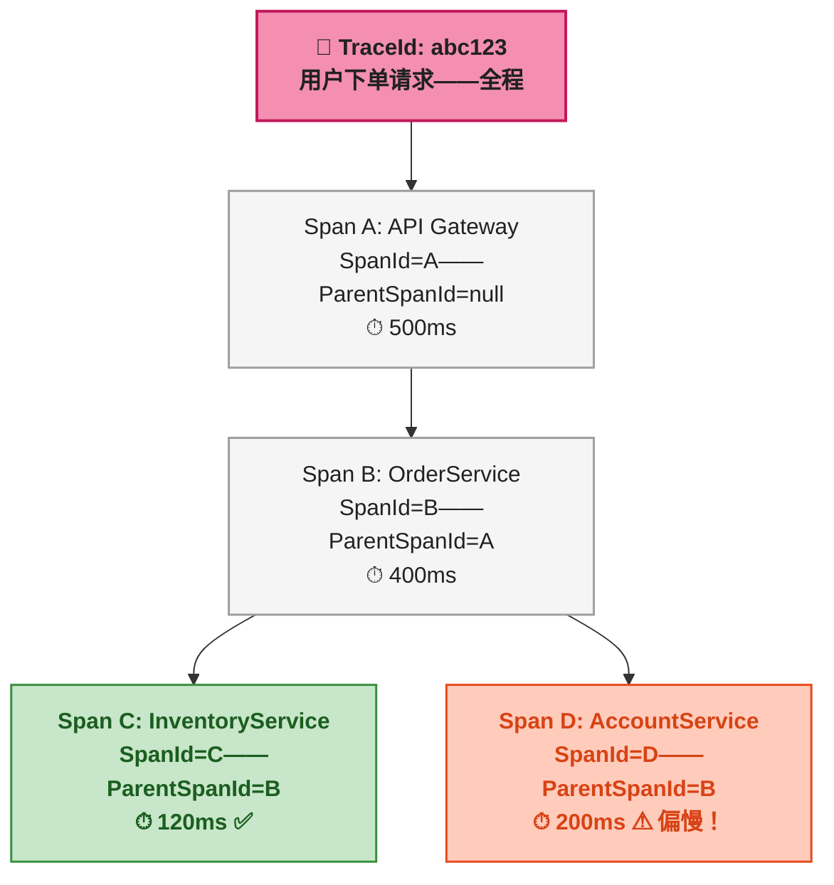
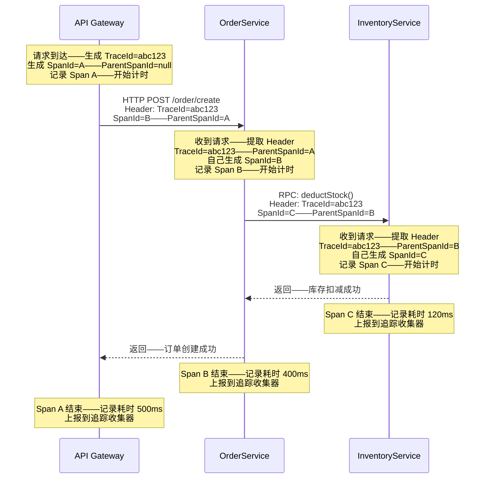
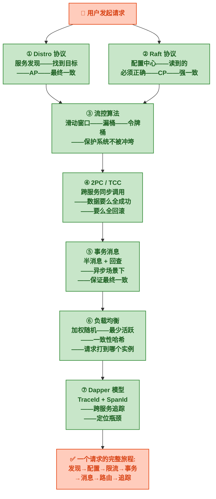

# Dapper 模型

> 本文是<strong>分布式算法科普系列</strong>第七篇，也是收官之作。前面六篇从服务发现、共识、流控、事务、消息、负载均衡一路讲过来——现在整个分布式系统已经跑起来了。但最后一个问题：<strong>一个请求跨了十几个服务，慢了，到底是哪个服务慢了？</strong>

## 一、故事：Google 搜索到底慢在哪

2008 年前后，Google 的搜索基础设施已经是一个超级复杂的分布式系统——一个用户搜索请求从前端 Web 服务器进入后，要经过拼写检查、查询改写、广告检索、文档索引查询、图片搜索、个性化排序等几十个服务，每个服务又有数十到数百台机器。

<strong>问题来了</strong>——运维团队收到告警："搜索延迟上涨了 200ms"。全链路跨了几十个服务，研发团队只能挨个翻日志、看监控、拍脑门猜测到底是哪个服务变慢了。运气不好的时候——<strong>一个延迟问题排查一天是常有的事</strong>，而且经验依赖极高——只有老员工大概知道"这种情况一般是索引服务慢了"。

2010 年，Google 发表了《Dapper, a Large-Scale Distributed Systems Tracing Infrastructure》技术报告，公布了他们内部从 2005 年就开始使用的分布式追踪系统。<strong>Dapper 的核心贡献不是工程实现，而是一个极其简洁的数据模型</strong>——用两个 ID 和一个父引用，就能还原出任意复杂度的调用链路。

这个模型后来成为<strong>所有现代分布式追踪系统的理论基础</strong>——Twitter 的 Zipkin（2012）、Uber 的 Jaeger（2017）、Apache SkyWalking（2015）、以及 OpenTelemetry 标准（2019），全部沿用了 Dapper 的 TraceId + SpanId 模型。

---

## 二、前置：没有追踪时，排查有多痛苦

先感受一下一个典型的微服务调用链：

```
用户点击"下单"
  → API Gateway（网关——接收HTTP请求）
    → OrderService（订单服务——创建订单）
      → InventoryService（库存服务——扣库存）
        → Redis（缓存——检查库存标记）
      → AccountService（账户服务——扣余额）
      → CouponService（优惠券服务——核销优惠券）
    → NotificationService（通知服务——发短信）
```

<strong>总共 7 个服务节点。</strong>如果用户反馈"下单等了 3 秒才成功"——研发需要翻 7 个服务的日志，靠时间戳手工对——"订单服务的这条日志是 14:03:52.123，库存服务好像对应的日志是 14:03:52.245……这两条是同一个请求吗？"——没人知道。

> 写过的都懂——凌晨三点被叫起来排查线上问题，对着七八个服务的日志靠 grep + 时间戳对，好不容易对出大概链路，发现只是 Redis 慢了一下。没有追踪系统的日子，就是这么过的。

<strong>Dapper 要解决的就是这个——把同一条请求链路的所有日志串在一起，一眼看清调用树。</strong>

---

## 三、核心模型——三个 ID 还原一棵调用树

### 3.1 TraceId、SpanId、ParentSpanId

Dapper 模型用<strong>三个字段</strong>就把整个调用链路结构描述清楚了：

| 字段 | 作用 | 生命周期 |
|------|------|------|
| <strong>TraceId</strong> | 全局唯一的请求标识——同一条请求链路中的<strong>所有节点共享同一个 TraceId</strong> | 从请求进入系统到离开——跨越所有服务 |
| <strong>SpanId</strong> | 标识链路中<strong>一个独立的步骤</strong>——比如"OrderService 处理创建订单" | 一个服务的一次调用 |
| <strong>ParentSpanId</strong> | 当前 Span 的<strong>上游 SpanId</strong>——谁调了我 | 用于还原父子关系——串联成树 |

> 可以把这三个 ID 理解为<strong>快递包裹的追踪系统</strong>——TraceId 是快递单号——贯穿整个配送过程。SpanId 是每个中转站的扫码记录——"到达 A 分拣中心""离开 B 配送站"。ParentSpanId 记录是从哪个上一站发过来的——有了这个才能还原出整个配送路径。没有 ParentSpanId——所有记录就是一堆散乱的扫码事件，不知道先后顺序。

### 3.2 一个完整的追踪示例

用户点击"下单"，请求经过三个服务——下面是这个请求产生的 Span 树：

```
TraceId: abc123

Span A (SpanId=A, ParentSpanId=null)
  └── API Gateway——接收 HTTP 请求——耗时 500ms

Span B (SpanId=B, ParentSpanId=A)
  └── OrderService——创建订单——耗时 400ms

Span C (SpanId=C, ParentSpanId=B)
      └── InventoryService——扣库存——耗时 120ms

Span D (SpanId=D, ParentSpanId=B)
      └── AccountService——扣余额——耗时 200ms
```

四个 Span 共享同一个 TraceId（abc123），通过 ParentSpanId 串联成调用树。在 SkyWalking 的 UI 上——这张图会被渲染成一棵可视化调用树——每个 Span 的耗时用颜色标记（绿色快、黄色一般、红色慢），研发一眼就能看到<strong>"AccountService 的扣余额花了 200ms——比扣库存的 120ms 多了近一倍"</strong>——排查范围瞬间缩小。



---

## 四、ID 如何跨服务传播

### 4.1 传播机制

模型定义了，但<strong>ID 怎么从一个服务传到下一个服务？</strong>答案很直接——<strong>放在请求头里</strong>。

服务 A 调用服务 B 时（不管是 HTTP、gRPC 还是 Dubbo RPC），在请求里带上三个 Header：

```
X-Trace-Id: abc123
X-Span-Id: B
X-Parent-Span-Id: A
```

服务 B 收到请求后——从 Header 里读出 TraceId 和 ParentSpanId——自己生成一个新的 SpanId——在本地记录"TraceId=abc123, SpanId=B, ParentSpanId=A, 操作=扣库存"——然后继续往下游传。



### 4.2 自动埋点——对业务代码零侵入

如果让业务开发者自己写代码生成 TraceId、传 Header、记录 Span、上报数据——大概率没人会用。SkyWalking 的做法是<strong>字节码增强</strong>——在 JVM 加载类的时候自动修改字节码，在关键方法（比如 Spring MVC 的 Controller、Dubbo 的 Filter、HTTP 连接池的 execute）前后插入追踪代码。

业务代码完全不用改——开发者写自己的业务逻辑就行了。SkyWalking Agent 自动做三件事：
1. <strong>入口处生成或提取 TraceId</strong>——如果请求里已经带了就沿用，没带就生成新的
2. <strong>出口处把 ID 写到 Header</strong>——传给下游
3. <strong>每个 Span 结束时异步上报</strong>——不阻塞业务请求

> ⚠️ 新手提示：自动埋点虽然方便，但默认只追踪框架级别的方法（Controller、RPC 调用、数据库查询）。如果有一段自己的业务代码想追踪内部细节（比如"这段 for 循环到底跑了多久"），需要手动加 `@Trace` 注解——这在 SkyWalking 里叫"自定义 Span"。

---

## 五、Dapper 模型的局限性

| 局限性 | 后果 | 怎么缓解 |
|------|------|------|
| <strong>采样率 vs 完整性的权衡</strong> | 大流量系统 100% 追踪会产生海量数据——只能采样（比如只追踪 10% 的请求） | 自适应采样——慢请求 100% 追踪、正常请求按比例采样 |
| <strong>跨线程/异步场景需要特殊处理</strong> | 异步线程里 TraceId 可能丢失——因为 Header 传递是基于同步调用链的 | SkyWalking 自动增强线程池——异步任务自动传递上下文 |
| <strong>时钟偏移</strong> | 不同服务器的时间不同步——会导致 Span 的时间线看起来混乱——甚至出现"子 Span 在父 Span 之前结束" | 所有时间以追踪收集器的时间戳为准——不使用各服务器本地时间 |
| <strong>开销</strong> | 每个 Span 的创建和上报有性能开销——极端情况下可能影响业务延迟 | 异步批量上报——Agent 内存缓冲——对业务延迟影响通常 < 1% |

---

## 六、哪些系统用了 Dapper 模型

| 系统 | 开源方 | 核心特点 |
|------|------|------|
| <strong>SkyWalking</strong> | Apache（原华为捐献） | 字节码增强——零侵入——支持 JVM、.NET、Node.js——自带 UI |
| <strong>Zipkin</strong> | Twitter | 最早的开源追踪系统——需手动集成 SDK 或配合 Brave 库 |
| <strong>Jaeger</strong> | Uber（CNCF 毕业项目） | 兼容 OpenTracing 标准——Go 语言原生 |
| <strong>OpenTelemetry</strong> | CNCF（合并 OpenTracing + OpenCensus） | 不是具体实现——是<strong>标准规范</strong>——定义 TraceId/SpanId 的格式和传播协议 |

<strong>SkyWalking 在国内使用最广泛</strong>——原因是它对 Java 生态的自动埋点做得最好——Spring Boot、Dubbo、RocketMQ、MySQL 驱动全部开箱即用——不需要改代码、不需要加注解、启动时加一个 `-javaagent` 参数就行。

---

## 七、系列总结——七篇回顾

这是分布式算法科普系列的最后一篇。从第一篇到这里，七个主题覆盖了一个请求在分布式系统中的完整生命周期：



| # | 文章 | 核心算法/协议 | 一句话 |
|:---:|------|------|------|
| 1 | [<strong>Distro 协议：去中心化与最终一致</strong>]() | Distro——去中心化——异步同步——反熵 | 没有老板——谁都能拍板——事后对账 |
| 2 | [<strong>Raft 协议：选举、日志复制与强一致</strong>]() | Raft——Leader 选举——日志复制——多数派确认 | 选出老板——事事多数同意——错了不如不做 |
| 3 | [<strong>流控算法三件套</strong>]() | 滑动窗口——漏桶——令牌桶 | 统计多快——控制放不放——允许偶尔冲刺 |
| 4 | [<strong>分布式事务：两阶段提交与 TCC</strong>]() | 2PC——TCC——Try/Confirm/Cancel | 协调者问所有人准备好了没——或自己预留资源——确认或释放 |
| 5 | [<strong>事务消息：半消息与回查</strong>]() | 半消息——Broker 回查 | 消息先存起来不让看——办完事再决定公开还是删除 |
| 6 | [<strong>负载均衡三剑客</strong>]() | 加权随机——最少活跃——一致性哈希 | 按能力分配——挑最闲的——同类请求到同台机器 |
| 7 | <strong>Dapper 模型：TraceId 与 SpanId</strong>（本文） | TraceId——SpanId——ParentSpanId | 一个单号串全程——每个步骤记一笔——还原整棵调用树 |

<strong>这个系列的初衷——让完全没接触过分布式的业务开发者，不用啃论文、不用看源码、不用记配置，能搞清楚这些算法"为什么存在""解决什么问题""大致怎么工作"。</strong>有了这些底子，再去看 Nacos、Sentinel、Seata、RocketMQ、Dubbo、SkyWalking 的官方文档——就不会被一堆术语砸懵了。
