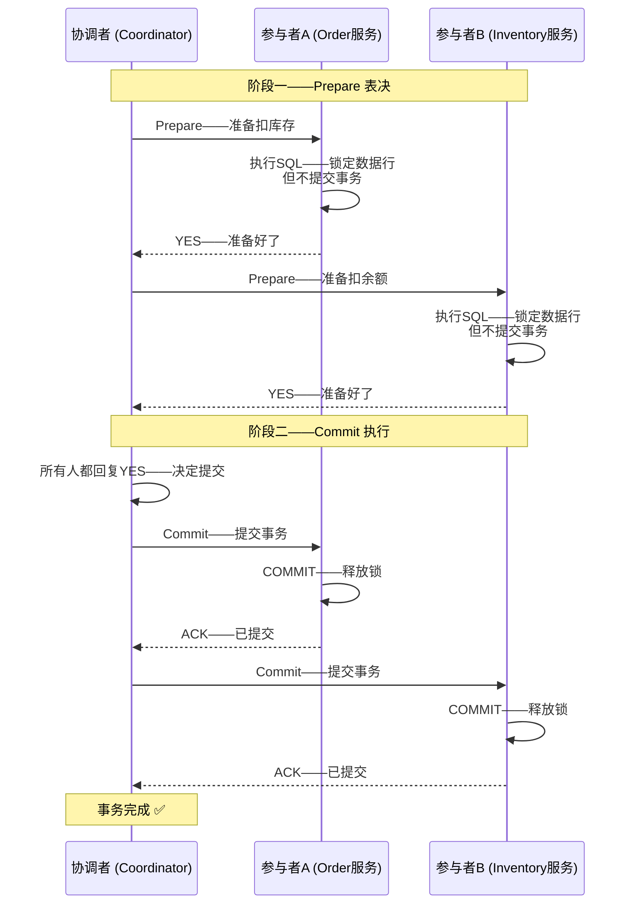
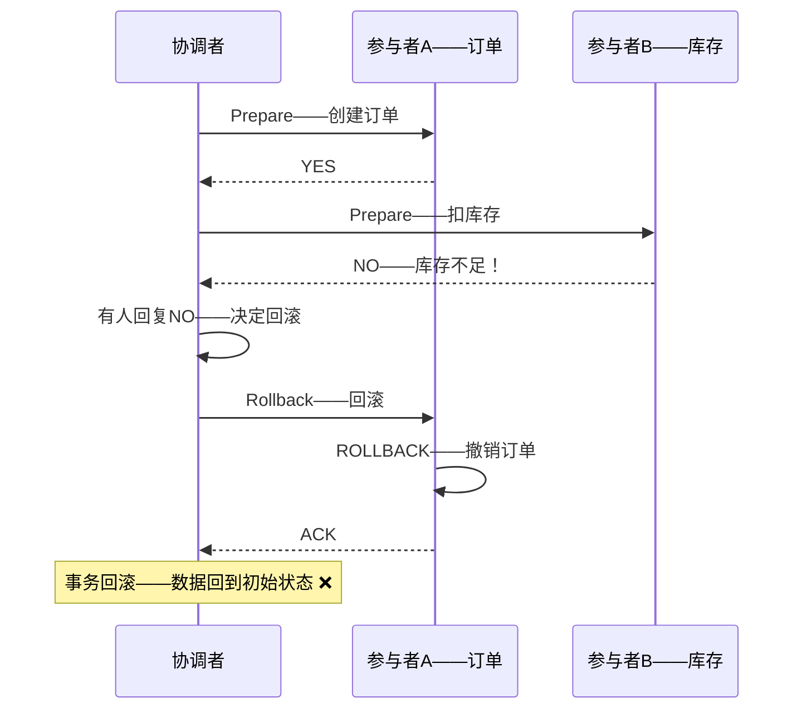
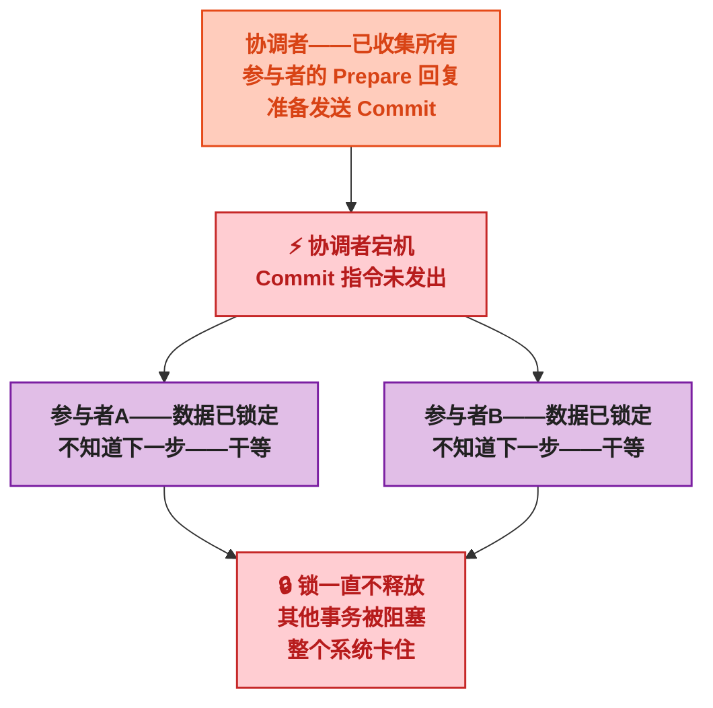
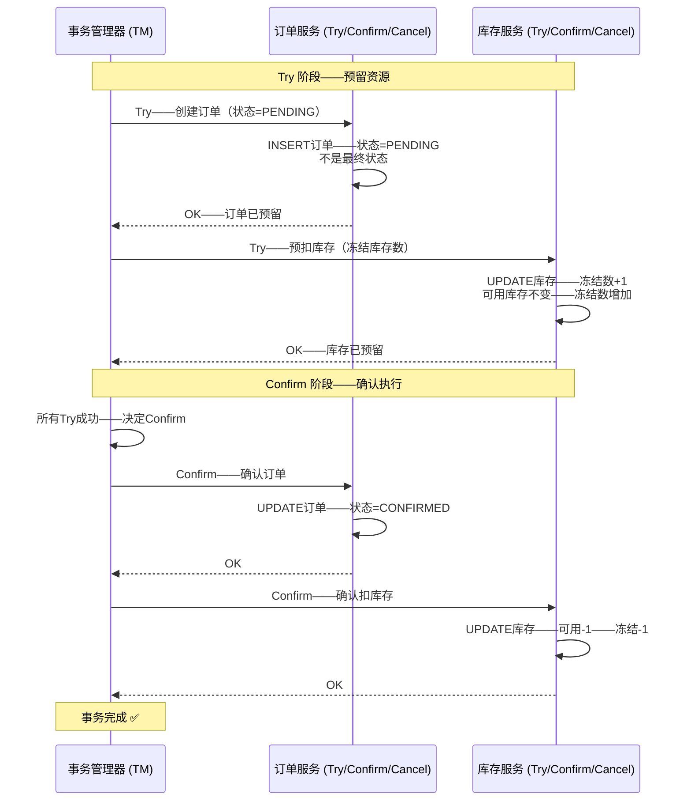
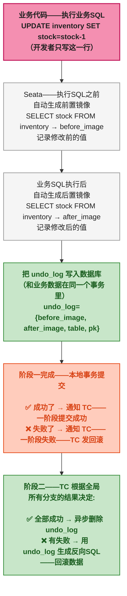
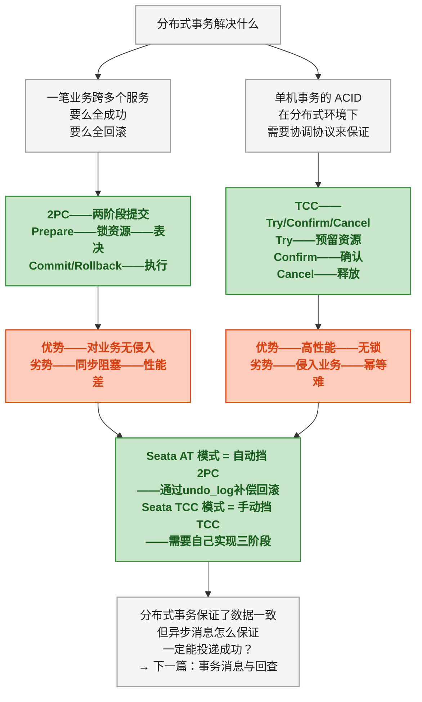

# 分布式事务

> 本文是<strong>分布式算法科普系列</strong>第四篇。前三篇讲了服务发现、共识算法、流控——都是"怎么把活分下去"和"怎么保护自己不被冲垮"。这一篇回到一个老问题：一笔业务操作跨越了多个服务，怎么保证数据要么全成功、要么全回滚？

## 一、故事：数据库拆了，事务怎么办

1970 年代，随着数据库从单机走向网络化，一个此前不存在的问题浮现出来——<strong>一笔业务需要同时修改两台机器上的数据，怎么保证原子性？</strong>

在单机数据库上，事务是再自然不过的事情——BEGIN → 改 A 表 → 改 B 表 → COMMIT。数据库内部用 undo log 和 redo log 保证崩溃恢复后数据的一致性。但如果 A 表在机器 1 上，B 表在机器 2 上——COMMIT 只对机器 1 生效，机器 2 没收到，或者收到了但执行到一半宕机了——怎么办？

Jim Gray 在 1978 年的《Notes on Data Base Operating Systems》中首次系统描述了<strong>两阶段提交（2PC，Two-Phase Commit）</strong>——用一个"协调者"站在所有参与者中间，分两步确认：第一步问所有人"准备好了没"，第二步根据所有人的答复决定"一起提交"还是"一起回滚"。

<strong>这个设计的影响延续至今。</strong>XA 规范（1991 年由 X/Open 组织发布）将 2PC 标准化为分布式事务处理的工业协议。几乎所有关系型数据库（MySQL、Oracle、PostgreSQL）都支持 XA 事务。

但 2PC 有一个众所周知的痛点——<strong>同步阻塞</strong>。协调者挂了，参与者只能干等。于是在微服务时代，一种更灵活的方案出现了——<strong>TCC（Try-Confirm-Cancel）</strong>，把二阶段的"锁资源"升级为"预留资源 + 确认或释放"。

---

## 二、前置：单机事务不够用了

先从业务场景开始。一个典型的电商下单流程：

```
下单（Order 服务）→ 扣库存（Inventory 服务）→ 扣余额（Account 服务）
```

三个操作跨了三个服务、三套数据库。如果在"扣库存"成功后、"扣余额"之前——Account 服务宕机了——库存扣了，但余额没扣，钱没收，货没了。

<strong>这就是分布式事务要解决的问题——跨多个服务（多个数据库）的一组操作，要么全部成功，要么全部回滚。</strong>

单机事务靠 ACID 保证——原子性（Atomicity）、一致性（Consistency）、隔离性（Isolation）、持久性（Durability）。分布式事务的目标也是 ACID，但实现手段完全不同——它不靠数据库内部的 undo/redo log，而是靠<strong>多个参与者之间的协调协议</strong>。

> 📌 前置知识：ACID 中的原子性（Atomicity）指的是"一个事务中的所有操作要么全做、要么全不做"——不是物理上的"不可分割"，而是逻辑上"失败时自动回滚到事务开始前的状态"。分布式事务的"原子性"也是这个意思——跨服务的操作失败时，每个服务各自回滚。

---

## 三、2PC——两阶段提交

### 3.1 角色与两个阶段

2PC 引入一个<strong>协调者（Coordinator）</strong>——它不执行业务逻辑，只管"问"和"拍板"。真正执行操作的是<strong>参与者（Participant）</strong>——各个微服务。

2PC 把一次分布式事务分成两个阶段：

```
阶段一（Prepare / 表决阶段）
协调者 → 问所有参与者："这个操作你能做吗？"
参与者 → 各自执行操作——但不提交——把结果锁住——回复"可以"或"不行"

阶段二（Commit / 执行阶段）
协调者 → 所有人的回复都是"可以" → 通知所有人："提交！"
协调者 → 有任何人回复"不行" → 通知所有人："回滚！"
参与者 → 执行协调者的指令——提交或回滚——释放锁
```



### 3.2 如果有人在 Prepare 阶段说了 NO

如果参与者 B 回复"不行"——协调者不会进入 Commit，而是向所有人发送 Rollback：



### 3.3 2PC 的核心问题——协调者宕机

2PC 最大的软肋是<strong>协调者自己有单点故障</strong>。如果协调者在发出 Commit 指令之前宕机了——参与者已经在 Prepare 阶段锁住了数据，不知道接下来该提交还是回滚——<strong>只能干等协调者恢复</strong>。

这被称为<strong>阻塞问题（Blocking Problem）</strong>。参与者手里的锁在协调者恢复之前无法释放，可能导致大量其他事务被阻塞。



> ⚠️ 新手提示：有些资料说"3PC（三阶段提交）解决了 2PC 的阻塞问题"——这个说法不完全对。3PC 通过引入超时机制<strong>减少</strong>了阻塞的概率，但如果发生网络分区，3PC 同样可能脑裂。生产环境中用 3PC 的系统很少，反而是 TCC 更实用。

---

## 四、TCC——Try、Confirm、Cancel

### 4.1 核心思路——从"锁资源"到"预留资源"

2PC 在 Prepare 阶段依赖数据库的<strong>行锁</strong>来保证数据一致性——锁住被修改的数据行，直到第二阶段决定提交或回滚。<strong>锁是强力的，但也是笨重的</strong>——锁着的时候其他事务完全无法操作这些数据。

TCC 换了一个思路：不靠数据库锁，而是让业务代码自己提供<strong>三个阶段的操作</strong>：

| 阶段 | 干了什么 | 类比 |
|------|------|------|
| <strong>Try</strong> | 预留资源——检查是否可以执行——但不真正执行 | 订机票时"锁定座位"——还没出票——别人不能抢 |
| <strong>Confirm</strong> | 确认执行——真正使用预留的资源 | 付款成功后"出票"——座位真正归你 |
| <strong>Cancel</strong> | 释放预留资源——恢复到 Try 之前 | 付款失败——"释放座位"——别人可以订 |

> 可以把 TCC 理解为<strong>会议室的预约系统</strong>。Try：在前台预约某个时段的会议室——这时会议室还不能用（别人不能同时预约），但也没真正占用。Confirm：到时间了，确认使用，会议室正式被占用。Cancel：取消预约，释放时段，别人可以重新预约。

### 4.2 TCC 的完整流程



如果 Try 阶段有任何参与者返回失败——TM 向所有人发 Cancel：

```
Cancel 阶段——释放预留

TM → 订单服务: Cancel——取消订单
订单服务 → UPDATE 订单——状态=CANCELLED

TM → 库存服务: Cancel——释放冻结库存
库存服务 → UPDATE 库存——冻结数-1（可用库存不变——没真正扣过）
```

### 4.3 TCC 的 Confirm 和 Cancel 必须是幂等的

<strong>这是 TCC 最容易踩的坑。</strong>网络超时可能导致 TM 重试 Confirm 或 Cancel——如果 Confirm 被调了两次，扣库存不能扣两次。Cancel 同理——释放冻结库存不能释放两次变成负数。

TCC 的每个参与者都要自己保证幂等性（通常通过唯一事务 ID + 状态机判断来防止重复执行）。

> ⚠️ 新手提示：幂等性（Idempotency）——同一个操作执行一次和执行多次，结果相同。比如"设置 x=5"是幂等的——执行 100 次，x 还是 5。"x+1"不是幂等的——每次执行结果都不同。TCC 的 Confirm 和 Cancel 必须是"设置为某个状态"而不是"加减某个值"——这样才能扛住网络重试。

---

## 五、2PC vs TCC 对比

| 维度 | 2PC | TCC |
|------|------|------|
| <strong>资源隔离方式</strong> | 数据库行锁——锁住数据直到第二阶段 | 业务预留——通过状态字段（PENDING/FROZEN）隔离 |
| <strong>对业务的侵入性</strong> | 低——数据库层面——业务代码几乎无感知 | 高——每个参与者必须实现 Try/Confirm/Cancel 三个接口 |
| <strong>阻塞风险</strong> | 高——协调者宕机导致参与者锁等待 | 低——不依赖数据库锁——超时后自动 Cancel |
| <strong>性能</strong> | 较差——第一阶段就锁表——并发度低 | 较好——Try 阶段只改状态字段——不锁核心数据 |
| <strong>回滚复杂度</strong> | 低——数据库自动 ROLLBACK | 高——Cancel 逻辑要自己写——涉及各种补偿 |
| <strong>适用场景</strong> | 短事务、对一致性要求极高 | 长事务、对并发和可用性要求高 |
| <strong>典型实现</strong> | Seata AT 模式、XA 事务 | Seata TCC 模式 |

<strong>没有谁更好，只有谁更合适。</strong>如果业务简单、事务执行快（几十毫秒）、并发量低——2PC 够用。如果业务复杂、事务可能跨几分钟（涉及人工审批）、并发量高——TCC 更合适。

---

## 六、Seata 如何实现这两种模式

Seata（Simple Extensible Autonomous Transaction Architecture）是阿里巴巴开源的分布式事务中间件，它的 AT 模式和 TCC 模式分别对应 2PC 和 TCC 两种算法。

### 6.1 AT 模式——自动挡的 2PC

AT 模式的思路是<strong>对业务代码零侵入</strong>——业务开发者只管写自己的 SQL，Seata 自动做 2PC：



Seata AT 模式的核心是<strong>undo_log 表</strong>——Seata 自动在业务数据库里建一张 `undo_log` 表，拦截所有 SQL，自动记录修改前和修改后的快照。回滚时，用 before_image 生成反向 UPDATE 语句把数据改回去。

> ⚠️ 新手提示：AT 模式的回滚不是数据库的 ROLLBACK——一阶段的本地事务已经 COMMIT 了。AT 的回滚是<strong>补偿</strong>——用 undo_log 生成反向 SQL 把数据恢复成修改前的样子。这是 AT 模式和 XA 2PC 的关键区别——XA 在一阶段不提交事务、锁一直不释放；AT 在一阶段就提交了、只靠 undo_log 来补救。

### 6.2 TCC 模式——手动挡的补偿型事务

TCC 模式需要业务开发者自己实现 Try / Confirm / Cancel 三个方法：

```
Try:    冻结库存（stock_frozen + 1）
Confirm: 确认扣库存（stock - 1, stock_frozen - 1）
Cancel:  释放冻结（stock_frozen - 1）
```

每个方法都必须<strong>幂等</strong>——Seata 的 TCC 框架会通过事务 ID 做幂等控制，但业务开发者需要在数据库层面配合（比如用唯一索引防止重复插入、用状态机防止重复扣减）。

---

## 七、总结



<strong>一句话记住 —— 2PC 靠锁保证一致性，笨重但简单；TCC 靠业务补偿保证一致性，灵活但对开发者要求高。</strong>实际选型时，大部分场景用 Seata AT（自动挡）就够了。当遇到高并发扣库存、长事务跨多系统这类 AT 扛不住的场景时，再考虑 TCC。

下一篇讲 RocketMQ 的事务消息——另一种处理分布式事务的思路——不靠锁也不靠补偿接口，靠"半消息 + 回查"来保证异步场景下的事务一致性。

> 📖 <strong>系列导航</strong>：本文是<strong>分布式算法科普系列</strong>第 4 篇。上一篇：[<strong>流控算法三件套：滑动窗口、漏桶与令牌桶</strong>]()，讲 Sentinel 如何限流。下一篇：[<strong>事务消息：半消息与回查</strong>]()，讲 RocketMQ 怎么用半消息保证分布式事务的最终一致性。
