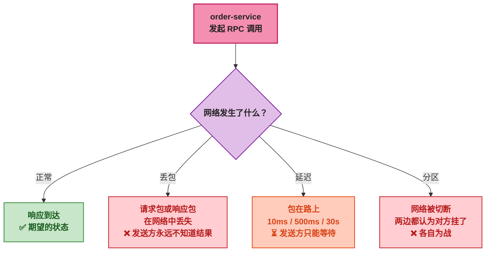
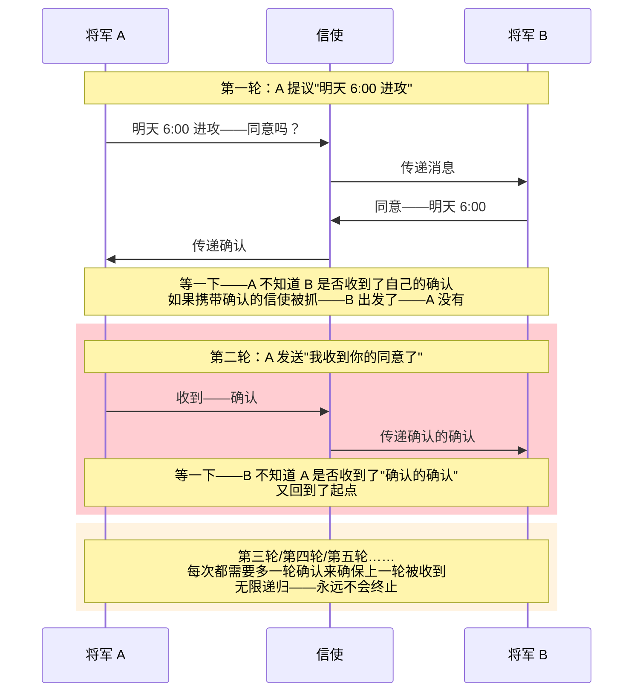
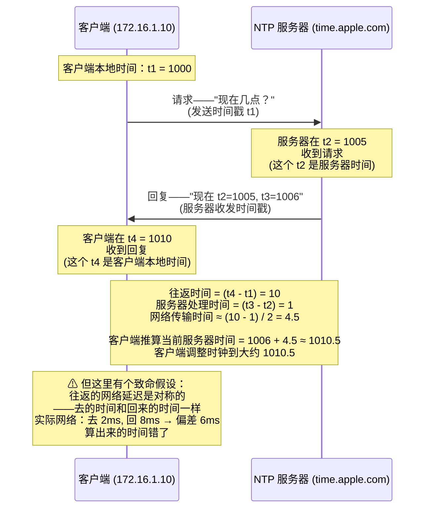
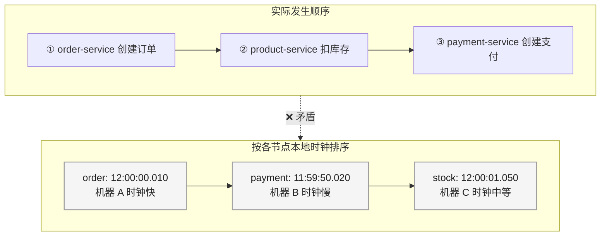
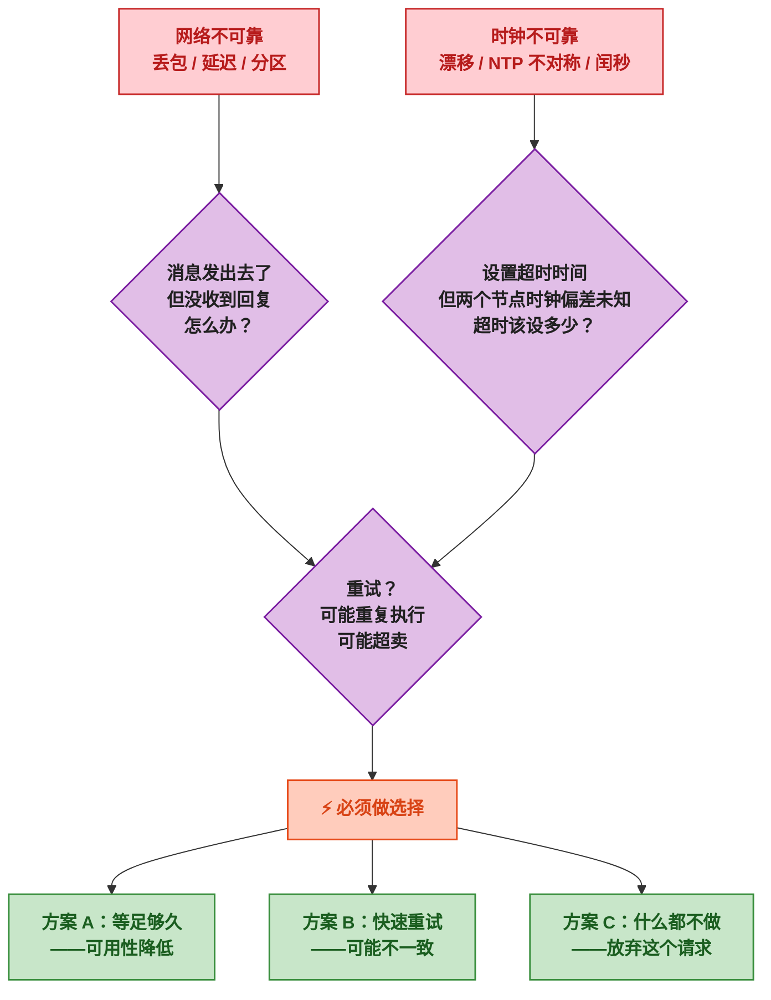

# 如果网络会骗你，时钟也会骗你

单机程序写了几年，什么 bug 都见过——NullPointerException、死循环、线程不安全——但至少有一个信念是牢不可破的：<strong>调用一个方法，它要么返回结果，要么抛异常，不会凭空消失。</strong>

```java
// 单机世界——确定性
boolean ok = service.deductStock(productId, 5);
if (ok) {
    orderMapper.insert(order);  // 扣成功了才下单
}
```

这段代码在单机上运行了成千上万次——从来没出过问题。if/else 的逻辑像物理定律一样可靠。

然后某天系统拆成了微服务。扣库存从本地方法调用变成了远程 RPC 调用：

```java
// 分布式世界——不确定性
boolean ok = rpcService.deductStock(productId, 5);
// 这一行代码可能：
//   - 正常返回 true
//   - 正常返回 false
//   - 抛异常
//   - 永远不返回——线程一直卡着
//   - 扣库存成功——但响应包在网络丢了——你以为失败了
if (ok) {
    orderMapper.insert(order);
}
```

从那一刻起——之前所有关于"确定性"的直觉——全部失效。

> 📌 <strong>前置知识</strong>：本文不需要任何分布式系统经验，但建议有基本的 TCP/HTTP 通信认知（知道"请求-响应"模式即可）。如果写过 Spring Boot 项目，理解 RPC 调用的概念，阅读体验会更好。

---

## 一、单机世界 vs 分布式世界——一张图看懂差异

单机程序中——所有事情都发生在一个进程里。方法调用是在同一块内存里跳转指令，操作系统保证要么执行完成、要么异常退出——<strong>不存在"不确定有没有执行"这种状态。</strong>

分布式系统完全不同。两个服务之间的通信——说白了就是两台机器之间发网络包。而网络——从来就不是为确定性设计的。

<div style="display: flex; gap: 20px; max-width: 700px; font-family: monospace; font-size: 13px; margin: 20px 0;">
    <div style="flex: 1; border: 1px solid #388E3C; border-radius: 4px; overflow: hidden;">
        <div style="background: #1E88E5; color: #FFFFFF; padding: 8px 12px; font-weight: bold; text-align: center;">单机世界</div>
        <div style="padding: 12px; background: #F5F5F5;">
            <div style="background: #C8E6C9; border: 1px solid #388E3C; padding: 6px 8px; margin: 4px 0; border-radius: 2px;">
                JVM 进程<br>
                ├── Service → <span style="color: #1B5E20; font-weight: bold;">→ 直接方法调用 → →</span> → Service B<br>
                ├── 线程共享堆内存<br>
                ├── 异常一定被捕获<br>
                └── <span style="color: #1B5E20; font-weight: bold;">结果：确定</span>
            </div>
        </div>
    </div>
    <div style="flex: 1; border: 1px solid #C62828; border-radius: 4px; overflow: hidden;">
        <div style="background: #E64A19; color: #FFFFFF; padding: 8px 12px; font-weight: bold; text-align: center;">分布式世界</div>
        <div style="padding: 12px; background: #F5F5F5;">
            <div style="background: #FFCDD2; border: 1px solid #C62828; padding: 6px 8px; margin: 4px 0; border-radius: 2px;">
                机器 A (192.168.1.10)<br>
                ├── order-service → <span style="color: #C62828; font-weight: bold;">→ 网络包 → →</span> → 机器 B (192.168.1.20)<br>
                ├── 网线/交换机/WiFi<br>
                ├── 包可能丢在路上<br>
                └── <span style="color: #C62828; font-weight: bold;">结果：不确定</span>
            </div>
        </div>
    </div>
</div>

单机方法的调用栈——参数在寄存器里、返回值在栈帧里——CPU 一个时钟周期就能跳过去。分布式调用的"参数"要序列化成字节流、经过操作系统的协议栈、穿过不知道多少台交换机——<strong>每一步都可能出错。</strong>

问题来了：到底有多少种"出错"的方式？

---

## 二、网络的不确定性——发了不等于到了

### 2.1 三种崩溃方式：丢包、延迟、分区



先说丢包。TCP 有重传机制——丢了就重发——为什么还有问题？<strong>因为重传解决不了"响应丢了"的情况。</strong>

```
请求到达 → 服务端执行成功 → 扣了库存 → 发送响应 → 响应包丢了

发送方视角：超时没收到响应——重试——又扣了一次库存——超卖
```

> ⚠️ <strong>新手提示</strong>：RPC 框架里的"超时重试"默认是<strong>不安全的</strong>。扣库存、支付、发券这类写操作——除非服务端实现了幂等——不然重试就是事故。这也是为什么 Dubbo 的 Failover 策略默认只对读操作安全。

再说延迟。延迟的麻烦不在于慢——而在于<strong>你不知道它有多慢。</strong>一个线程等 RPC 响应等了 30 秒——这 30 秒里线程池可能在累积新请求——最后雪崩。Sentinel 的线程数限流、Dubbo 的超时与熔断——本质上都是在对抗延迟的不确定性。

最后是分区——最棘手的一种。网络断开——order-service 和 product-service 各自正常运行——但无法通信。<strong>两边都不知道对方还活着。</strong>

<div style="background: #F5F5F5; border: 1px solid #BDBDBD; padding: 16px; max-width: 500px; border-radius: 4px; font-family: monospace; font-size: 12px; margin: 16px 0;">
    <div style="background: #1E88E5; color: #FFFFFF; padding: 6px 10px; font-weight: bold; margin: -16px -16px 12px -16px; border-radius: 4px 4px 0 0;">网络分区示意</div>
    <div style="display: flex; gap: 20px;">
        <div style="flex: 1; background: #C8E6C9; border: 1px solid #388E3C; padding: 10px; border-radius: 2px; text-align: center;">
            <strong style="color: #1B5E20;">机器 A</strong><br>
            order-service 正常运行<br>
            认为 "product-service 挂了"<br>
            开始走降级逻辑
        </div>
        <div style="color: #757575; font-size: 20px; align-self: center; font-weight: bold;">✕</div>
        <div style="flex: 1; background: #C8E6C9; border: 1px solid #388E3C; padding: 10px; border-radius: 2px; text-align: center;">
            <strong style="color: #1B5E20;">机器 B</strong><br>
            product-service 正常运行<br>
            认为 "order-service 没发请求"<br>
            库存数据还在更新
        </div>
    </div>
    <div style="text-align: center; color: #757575; margin-top: 10px; font-size: 11px;">
        交换机/网线故障——两台机器都正常工作——但彼此不知道
    </div>
</div>

### 2.2 两将军问题——理论上就不可能

丢包、延迟、分区都可以通过"重试+超时"来缓解——能不能设计一种协议——在不可靠的信道上<strong>100% 达成一致</strong>？

<strong>答案是：不能。这就是两将军问题（Two Generals' Problem）。</strong>

问题的设定很简单：两支军队分别从两个方向包围一座城市——必须同时进攻才能获胜——但信使穿越敌人的领地可能被抓——怎么保证两军都同意进攻时间？



<strong>无论发多少轮确认消息——总存在"最后一轮可能丢失"——因此无法在有限轮次内达成绝对一致。</strong>这个结论不是"目前还没有好办法"——<strong>是数学上已经证明的——在有消息丢失的信道上——完全一致性不可能达到。</strong>

> 📌 <strong>前置知识</strong>：两将军问题的严格表述是——在不可靠通信环境（消息可能丢失但不被篡改）中——两个节点无法在有限轮次内就某个值达成<strong>确定性一致</strong>。多数派协议（Raft/Paxos）通过"接受不确定性"——只要多数节点同意就算一致——绕过了这个理论限制。这也是后续第三篇文章重点展开的内容。

这个问题直接宣告了一个残酷的事实：<strong>在分布式系统中——绝对一致是不可能的——你只能选择"接受低概率的不一致"或者"牺牲可用性来等"。</strong>

---

## 三、时间的不确定性——时钟不可信

### 3.1 你以为 System.currentTimeMillis() 返回的是什么

任何写过 Java 的人都知道这行代码：

```java
long now = System.currentTimeMillis();
// 返回：从 1970-01-01T00:00:00Z 到现在的毫秒数
// 看起来是"客观时间"——对吧？
```

问题是——这个值来自哪里？

计算机主板上有一颗石英晶振——每秒振荡 32,768 次（或者 1,000,000 次）——操作系统数振荡次数——换算成秒。一块普通晶振的精度大约是 <strong>20 ppm（parts per million）</strong>——听起来很精确？

<strong>20 ppm 意味着每天漂移 1.7 秒——一个月漂移 50 秒。</strong>

<div style="background: #F5F5F5; border: 1px solid #BDBDBD; padding: 14px; max-width: 600px; border-radius: 4px; font-family: monospace; font-size: 12px; margin: 16px 0;">
    <div style="background: #1E88E5; color: #FFFFFF; padding: 6px 10px; font-weight: bold; margin: -14px -14px 10px -14px; border-radius: 4px 4px 0 0;">两台机器的时钟——经过一周后</div>
    <div style="display: flex; gap: 16px;">
        <div style="flex: 1; text-align: center;">
            <div style="background: #C8E6C9; border: 1px solid #388E3C; padding: 8px; border-radius: 2px;">
                <div style="color: #1B5E20; font-weight: bold; font-size: 18px;">🕐 机器 A</div>
                <div style="font-size: 14px; margin: 4px 0;">2023-01-08 12:00:00.000</div>
                <div style="color: #388E3C; font-size: 11px;">晶振精度 15 ppm</div>
                <div style="color: #388E3C; font-size: 11px;">一周漂移：+9 秒</div>
            </div>
        </div>
        <div style="flex: 1; text-align: center;">
            <div style="background: #FFCCBC; border: 1px solid #E64A19; padding: 8px; border-radius: 2px;">
                <div style="color: #BF360C; font-weight: bold; font-size: 18px;">🕑 机器 B</div>
                <div style="font-size: 14px; margin: 4px 0;">2023-01-08 11:59:48.000</div>
                <div style="color: #E64A19; font-size: 11px;">晶振精度 25 ppm</div>
                <div style="color: #E64A19; font-size: 11px;">一周漂移：-12 秒</div>
            </div>
        </div>
    </div>
    <div style="text-align: center; color: #C62828; font-weight: bold; margin-top: 10px; font-size: 13px;">
        ⚠ 两台机器相差 12 秒——谁是对的？
    </div>
</div>

两台服务器部署在同一天——一周后——它们的时钟已经差了 10 ~ 20 秒。<strong>两个不同的"现在"——哪个才是真的？</strong>

> ⚠️ <strong>新手提示</strong>：在你的开发机上——时钟通常很准——因为操作系统会通过 NTP（Network Time Protocol）定期校准。所以平时开发时你感觉不到时钟漂移。生产环境也会做 NTP 校准——但问题在于 <strong>NTP 校准本身也是不确定的</strong>——下一节展开。

### 3.2 NTP 校准——你问时间这件事本身就有时间

NTP 的工作原理看起来简单：客户端问一个权威时间服务器"现在几点"——服务器回答——客户端调整自己的时钟。

<strong>但"问时间"这个动作本身就需要时间。</strong>



<strong>NTP 假设网络延迟对称——去和回一样快。但真实网络从来不对称。</strong>交换机缓冲、路由策略、链路负载——都可能导致"去 2ms 回来 8ms"。这个不对称本身就在几十毫秒级别。

> 📌 <strong>前置知识</strong>：为什么不对称会导致误差？假设实际去 2ms、回 8ms——客户端却假设各 4.5ms——那么它推算的"服务器当前时间"就比实际早了 2.5ms。对于需要微秒级精度的场景（分布式事务的时间戳排序、金融交易）——这个误差足以引发"哪个操作先发生"的错误判断。

而且——NTP 服务器可能不可达。网络分区发生时——连 NTP 包都发不出去——时钟只能靠本机晶振硬撑。时间越长——漂移越大。

### 3.3 时间戳不再是可靠的仲裁者

在单机世界里——"哪个操作先发生"由时间戳决定：

```
操作 A：2023-01-08 12:00:00.100 → 插入数据
操作 B：2023-01-08 12:00:00.200 → 更新数据
B 在 A 之后——毫无疑问
```

在分布式世界里——两台机器的时钟相差 12 秒——"先发生"失去了意义：

```
机器 A：2023-01-08 12:00:00.010 → order-service 创建订单
机器 B：2023-01-08 11:59:50.020 → payment-service 收到支付回调

机器 B 的时间戳比机器 A 早了 10 秒——但实际上是支付在订单之后发生的
如果用时间戳排序——支付会在订单前面——逻辑完全反了
```



这就是为什么在分布式系统中——不能直接用物理时间戳来判断事件顺序（这也是 Logical Clock / Vector Clock 被发明的原因——留到后续文章展开）。

---

## 四、两个不确定性叠加——为什么分布式系统"总是要做取舍"

现在把网络不确定性和时间不确定性放在一起——看看会发生什么：

```
场景：order-service 调用 product-service 扣库存

网络层不确定：
  → 消息可能丢了——你不知道扣了还是没扣
  → 消息可能延迟——你不知道要等多久
  → 网络可能分区——你不知道对方还活着吗

时间层不确定：
  → 你不知道"超时"到底该设多少——设短了误判——设长了雪崩
  → 两个节点看到的"当前时间"不一致——谁的结果是旧的
  → NTP 校准可能滞后——时钟在不知不觉中漂移
```

<strong>这两个不确定性相互放大——网络的延迟影响你对时间的判断——时间的偏差影响你对网络状态的判断。</strong>



这就是为什么 CAP 定理不是"三选二"的游戏——<strong>而是网络和时间的双重不确定性迫使你在"等精确答案"和"快速给大致答案"之间选边站。</strong>

当你理解了这两个不确定性——Nacos 为什么同时提供 AP 和 CP 两种模式、RocketMQ 事务消息为什么需要回查机制、Sentinel 为什么用滑动窗口而不是精确计数——这些设计决策就不再神秘。

---

## 五、总结——这篇讲了什么

<strong>分布式系统的所有复杂设计——都源于两个基本事实：网络会丢包、时钟会漂移。</strong>

| 不确定性 | 根源 | 导致的问题 | 对应中间件设计 |
|------|------|------|------|
| 网络不可靠 | 丢包、延迟、分区——物理链路不可控 | 无法区分"对方挂了"和"消息丢了" | Nacos 心跳+保护阈值、Dubbo 超时重试、Sentinel 熔断 |
| 时钟不可靠 | 晶振漂移、NTP 不对称、网络延迟 | 无法用时间戳仲裁"先发生" | 分布式事务用 XID/全局锁替代时间戳排序 |

<strong>两个不确定性叠加——产生了一个不可回避的现实：在分布式系统中——任何涉及"等待远程响应"的操作——都存在不确定性——你无法 100% 确定操作的结果——只能在"等更久"和"接受可能出错"之间做取舍。</strong>

下一篇——从 CAP 定理出发——用 Nacos、Redis、Kafka 这几个你每天用的中间件——看它们具体是怎么做取舍的。

---

> 📖 <strong>本系列导航</strong>：
> - <strong>本文</strong>：第一篇——网络与时间的不确定性（打基础）
> - 第二篇：CAP 定理与一致性模型——Nacos AP/CP 双模、Redis/Kafka 的一致性抉择
> - 第三篇：Raft 选举与心跳——Nacos/Dubbo 中的故障检测与领导者选举
> - 第四篇：流控算法——Sentinel 滑动窗口、令牌桶与 Dubbo 负载均衡
