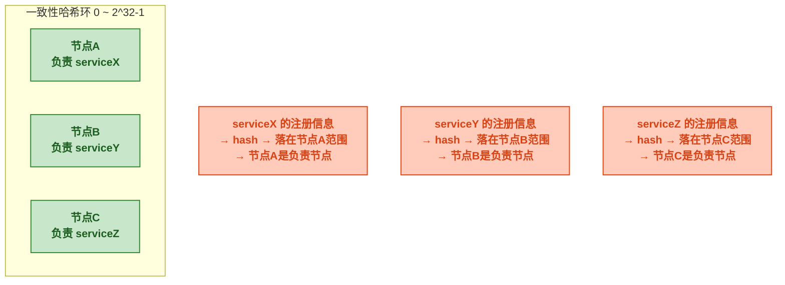
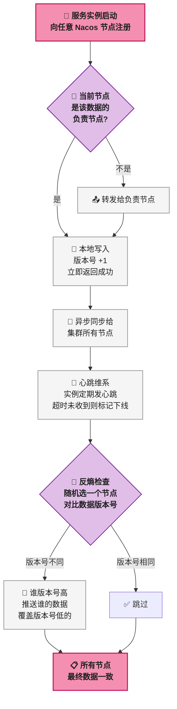
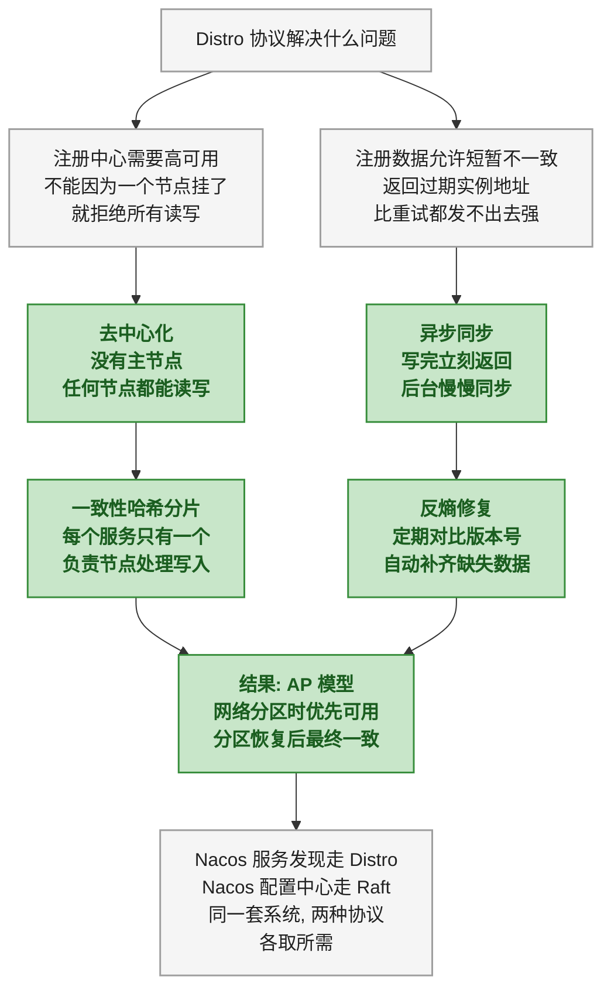

# Distro 协议：去中心化与最终一致

> 本文是<strong>分布式算法科普系列</strong>第一篇。系列面向完全没接触过分布式的业务开发者，用历史故事开场、比喻辅助理解、不涉及数学证明和代码实现。

## 一、故事：微服务来了，电话号码本怎么办

早年的单体应用，一个进程内部互相调用，不需要"发现"对方——函数调用就行。微服务架构来了，服务实例的数量和位置开始动态变化：扩容加几台、某台机器宕机撤掉、滚动发布换一批新实例。服务 A 要调用服务 B，必须知道此时此刻服务 B 在哪些 IP 和端口上。

最朴素的想法是——搞一个<strong>电话号码本</strong>。所有服务启动后把自己的地址登记上去，调用方去电话本里查。这个"电话本"就是注册中心。

但问题来了：电话本自己怎么保证不挂？如果只有一个电话本，挂了所有服务都变瞎子。那就多搞几个电话本，每个存一份完整的地址副本。新问题又来了——服务 A 的地址变了，怎么保证所有电话本上写的都一样？

用个比方来理解这个场景：

> 一个小区有三家传达室，每家都有一本住户登记簿。住户搬家了会通知最近的那家传达室更新记录。有人来访时，随便问哪家传达室都能查到住户的门牌号——哪怕其中一家的登记簿还没来得及更新。

这就是 Distro 协议要解决的问题：<strong>在一个多节点集群中，如何让写入请求快速得到响应（高可用），同时保证各节点上的数据最终会变得一致（最终一致）</strong>。

---

## 二、前置：为什么不能又一致又可用

在深入 Distro 之前，需要先理解一个约束——CAP 定理。

> 📌 前置知识：CAP 定理说的是，在一个分布式系统中，当网络发生分区（Partition，即节点之间网络不通）时，你只能在一致性（Consistency）和可用性（Availability）之间二选一。网络没出问题时，一致性和可用性可以同时满足。

用电话本的比方说：一号传达室和二号传达室之间电话线断了（网络分区）。此时有人去一号传达室改了一个住户的门牌号（写操作）。一号传达室有两个选择：

- <strong>选一致性（C）</strong>：拒绝这个修改请求，因为无法同步给二号传达室。结果：修改失败，但所有传达室的数据保持一致。
- <strong>选可用性（A）</strong>：先接受修改，等电话线恢复后再同步给二号传达室。结果：修改成功，但二号传达室暂时还是旧数据。

<strong>注册中心这个场景天然更适合选 AP（可用 + 分区容忍）</strong>。原因很现实：返回一个略微过期的实例地址（可能已经下线了），调用方最多重试一次换另一个实例；但注册中心如果拒绝查询，整个调用链直接断了。两害相权取其轻。

Raft 协议选了 CP（后面一篇会讲），Distro 协议选了 AP。这就是它们在同一套 Nacos 系统里分工的原因——<strong>服务发现走 Distro（AP），配置中心走 Raft（CP）</strong>。

---

## 三、Distro 的核心设计

### 3.1 没有主节点

这是 Distro 和 Raft 最根本的区别。Raft 通过选举产生一个主节点（Leader），所有写操作必须经过主节点——主节点把日志复制给从节点，多数确认后提交。如果主节点挂了，必须重新选举，选举期间集群无法写入。

Distro 没有主节点。<strong>集群里每个节点都是平等的</strong>。写请求可以打到任意一个节点，该节点立刻返回成功，然后异步把变更同步给其他节点。

用一个比方来理解这个差异：

> Raft 像公司报销流程——所有报销单必须部门经理（Leader）签字才能入账。经理出差了？等着，等他回来或者换新经理。
> Distro 像小组共享文档——任何人改了一段，改了就先保存，其他同事打开文档时看到最新版就行。就算有人离线没同步到，等他上线后会自动补上。

去中心化带来的直接好处：<strong>没有主节点，就不存在主节点宕机后的"选举窗口"</strong>。任何时候任何节点都能处理读写。

### 3.2 数据分片与一致性哈希

Distro 虽然每个节点都能独立处理写请求，但为了减少冲突和降低同步开销，它对数据做了分片——<strong>每个服务实例的注册信息只由一个"负责节点"来权威维护</strong>，其他节点虽然也存了这份数据，但只是副本。

分片机制用了一致性哈希。一致性哈希把存储空间组织成一个首尾相连的环（0 ~ 2^32-1）。每个节点在环上占据一个位置，每条数据根据 Key 的哈希值落在环上的某个点，顺时针方向遇到的第一个节点就是<strong>这条数据的负责节点</strong>。



<strong>负责节点做什么</strong>：当一条服务注册请求到达某个节点，如果该节点不是这条数据的负责节点，它会把请求转发给负责节点。负责节点完成写入后，异步同步给集群中所有其他节点。

这种设计的好处是<strong>避免了并发写冲突</strong>——同一个服务的注册信息总在同一个负责节点上被修改，不会出现两个节点同时改同一份数据导致冲突的情况。

### 3.3 异步同步与版本号

Distro 节点之间的数据同步是异步的。同步的粒度不是整个数据库，而是一条条独立的记录——每个服务实例的注册信息单独同步、单独带版本号。

每条数据带一个版本号（单调递增的时间戳或序列号）。同步时遵循一个简单规则：<strong>版本号大的覆盖版本号小的</strong>。

```
节点A: serviceX → {ip:10.0.1.5, port:8080, version:102}
节点B: serviceX → {ip:10.0.1.5, port:8080, version:101}

节点A 把自己的数据推给节点B → 节点B 对比 version: 102 > 101 →
节点B 更新为 version 102 的数据
```

这个规则虽然简单，但解决了一个关键问题：<strong>在异步同步的网络环境下，消息到达顺序可能乱掉</strong>。版本号高的一定是更新的数据，不管谁先到。

> ⚠️ 新手提示：这和 Git 冲突解决很像——改同一个文件的同一行才会冲突，改不同文件或同一文件的不同行不会冲突。Distro 每个服务实例的注册信息是一条独立记录，所以不同服务的注册信息不存在冲突问题。如果两个节点同时修改了同一个服务实例的注册信息（极少发生），以版本号高的为准——"最后写入胜出"（Last Write Wins）。

---

## 四、四个核心机制串起来的完整流程



### 4.1 写操作路径

1. 服务实例启动，向配置的 Nacos 地址发送注册请求（HTTP 或 gRPC）
2. Nacos 收到请求的节点检查自己是不是这个服务数据的负责节点
3. 不是 → 转发给负责节点；是 → 本地写入，版本号 +1，<strong>立即返回成功</strong>
4. 负责节点<strong>异步</strong>把变更推送给集群中所有其他节点

<strong>"立即返回成功"是关键</strong>——客户端不用等数据同步完成。这和 Raft 的"多数节点确认后才返回"形成鲜明对比。

### 4.2 读操作路径

读请求打到任意节点，直接读本地数据。不需要去其他节点确认"你的数据是不是最新的"。这意味着<strong>可能读到过期数据</strong>——某个节点还没来得及同步。

但实际上，注册中心的读操作对延迟极度敏感（每次 RPC 调用前都要查注册中心），对数据一致性容忍度很高（偶尔拿到一个已下线实例的地址，重试即可）。

### 4.3 心跳与故障检测

服务实例注册后，需要<strong>定期发心跳</strong>给 Nacos 证明自己还活着。心跳超时（默认 15 秒没收到心跳），Nacos 把该实例标记为不健康；继续超时（默认 30 秒），把实例摘除。

心跳检测是<strong>由负责节点来做的</strong>——每个 Nacos 节点负责自己分片内的实例的心跳检测。如果负责节点自己宕机了，一致性哈希环会重新分配——该节点负责的数据段会平移给顺时针下一个节点接管。

### 4.4 反熵（Anti-Entropy）

异步同步有个问题：网络丢包、节点短暂不可用，可能导致某些节点的数据一直落后。Distro 用<strong>反熵机制</strong>兜底——每个节点每隔一段时间随机选一个对端节点，互相比较各自数据的版本号。发现不一致 → 版本号高的推送给版本号低的。

这里的"熵"是物理学借来的词，表示系统的混乱程度。反熵就是<strong>定期打扫</strong>——不管中间漏了多少次同步，最终都能通过这个机制把数据拉到一致。

反熵是周期性的（比如每 5 秒一次），不管有没有写入都会执行。这意味着即使一次异步同步因为网络抖动失败了，下一次反熵时数据也会被修复。

---

## 五、Distro 的局限性

没有任何协议是完美的。Distro 的 AP 选择带来了三个明确的代价：

| 局限性 | 后果 | 能容忍吗 |
|------|------|:---:|
| <strong>写后未必立刻能读到</strong> | 服务刚注册，其他节点可能查不到它 | ✅ 注册中心场景下容忍（等几百毫秒就能读到） |
| <strong>可能读到过期数据</strong> | 服务已下线，注册中心还返回它的地址 | ✅ 调用方重试另一个实例即可 |
| <strong>网络分区时可能出现短暂不一致</strong> | 两个分区的节点各自独立接受写入，恢复后靠版本号解决 | ✅ 最终一致，且注册数据的冲突概率极低 |
| <strong>不保证强一致的事务</strong> | 不能用 Distro 做配置中心这类需要"读到的必须是正确的"的场景 | ✅ 这就是为什么 Nacos 配置中心走 Raft，不走 Distro |

---

## 六、总结



一句话记住 Distro：<strong>没有老板（无主节点），谁都能拍板（任何节点独立处理请求），事后对账（反熵修复），适合错了也能补救的场景。</strong>

下一篇文章讲 Raft——和 Distro 相反的选择：必须选出一个老板，事事经过老板同意，换来的是"读到的永远是对的"。

> 📖 <strong>系列导航</strong>：本文是<strong>分布式算法科普系列</strong>第 1 篇。下一篇：[<strong>Raft 协议：选举、日志复制与强一致</strong>]()，讲明白为什么配置中心需要"读到的必须是正确的"。
