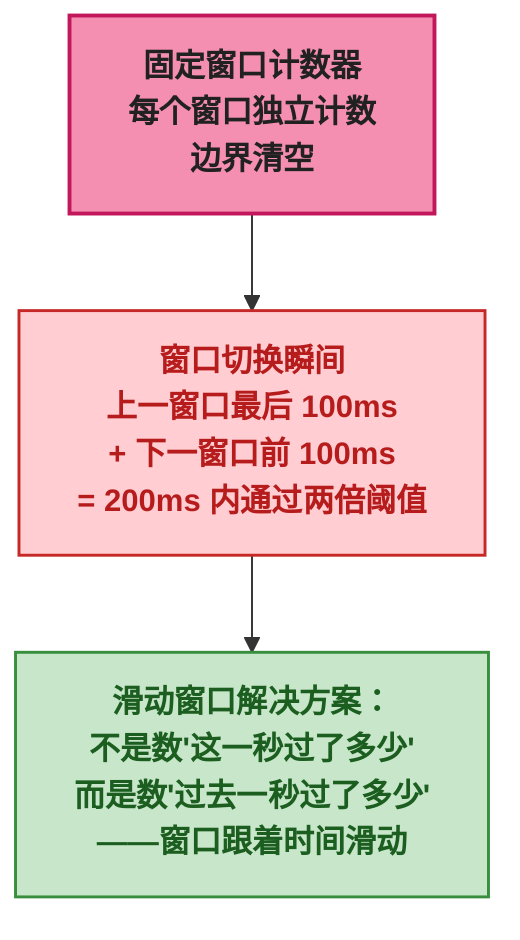
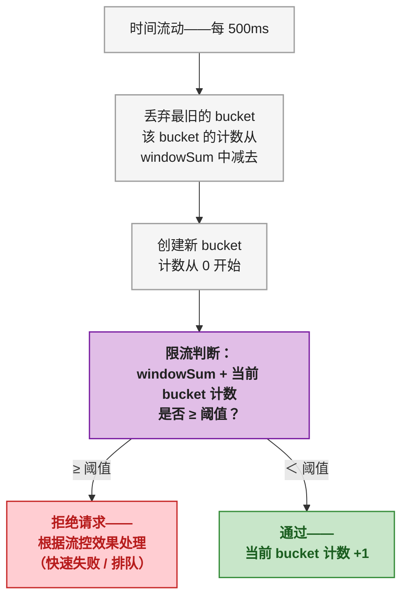
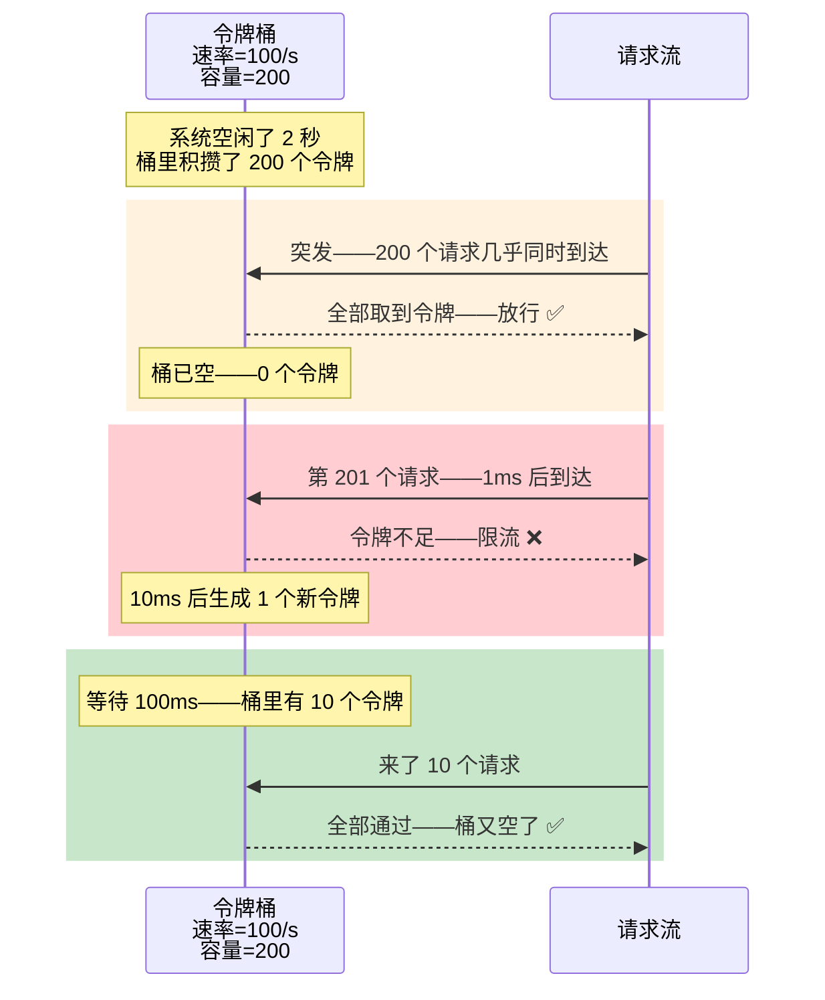
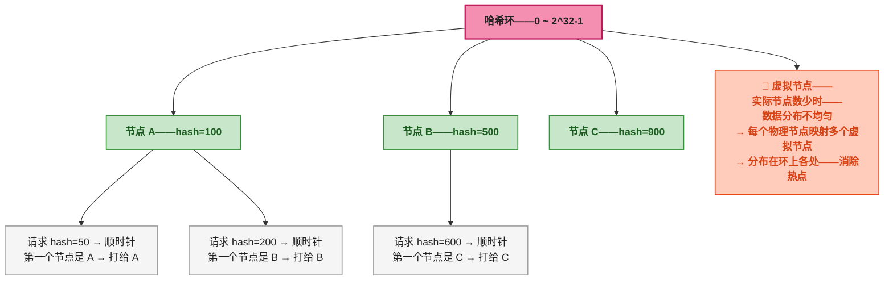

# 流控三板斧——Sentinel滑动窗口、令牌桶与Dubbo负载均衡

前三篇讲了一个核心矛盾：分布式系统里——网络和时钟不可靠——所以你必须在一致性和可用性之间做取舍——Raft 用 majority 保证 CP——Nacos Distro 用最终一致性取 AP。

<strong>但取舍不只发生在数据一致性层面——流量控制层面同样存在。</strong>每个服务有自己的承载上限——超过上限就必须拒绝一部分请求——这就是限流。<strong>拒绝哪些请求？以什么粒度计数？桶还是窗口？</strong>

> 📌 <strong>前置知识</strong>：需要有 Sentinel 基本概念（知道它是限流熔断组件）和 Dubbo 基本用法（知道 @DubboReference 怎么调用远程服务）。如果还没用过 Sentinel 的 Dashboard——建议先对着官方文档跑一遍 Quick Start——不需要深入——但得知道控制台里"流控规则"长什么样。

---

## 一、为什么"每秒 100 个请求"这种限流方式有 Bug——固定窗口的边界突刺

对限流最直观的理解：系统处理能力是每秒 100 个——超过就拒绝。实现这个最简单的办法——搞一个计数器——每秒归零。

```java
// 固定窗口计数器——最朴素的想法
class FixedWindowRateLimiter {
    private long windowStart = System.currentTimeMillis();
    private int counter = 0;
    private final int limit = 100;

    public synchronized boolean tryAcquire() {
        long now = System.currentTimeMillis();
        if (now - windowStart > 1000) {
            windowStart = now;  // 新窗口——计数器归零
            counter = 0;
        }
        if (counter < limit) {
            counter++;
            return true;  // 放行
        }
        return false;  // 限流
    }
}
```

看起来没毛病——每秒最多通过 100 个——超过就拒绝。问题出在<strong>窗口边界</strong>：

<div style="background: #F5F5F5; border: 1px solid #BDBDBD; padding: 14px; max-width: 650px; border-radius: 4px; font-family: monospace; font-size: 11px; margin: 16px 0;">
    <div style="background: #1E88E5; color: #FFFFFF; padding: 6px 10px; font-weight: bold; margin: -14px -14px 10px -14px; border-radius: 4px 4px 0 0;">固定窗口的致命缺陷——边界突刺</div>
    <div style="display: flex; gap: 0;">
        <div style="flex: 1; text-align: center; padding: 6px; background: #C8E6C9; border: 1px solid #388E3C;">
            <strong style="color: #1B5E20;">窗口 1</strong><br>
            12:00:00 ~ 12:00:01<br>
            第 51 ~ 100 个请求<br>
            <span style="color: #E64A19; font-weight: bold;">→ 集中在 12:00:00.900 ~ 12:00:01.000</span><br>
            <span style="color: #388E3C;">窗口 1 总计 100 ✓</span>
        </div>
        <div style="flex: 1; text-align: center; padding: 6px; background: #FFCCBC; border: 1px solid #E64A19;">
            <strong style="color: #BF360C;">窗口 2</strong><br>
            12:00:01 ~ 12:00:02<br>
            第 1 ~ 50 个请求<br>
            <span style="color: #E64A19; font-weight: bold;">→ 集中在 12:00:01.000 ~ 12:00:01.100</span><br>
            <span style="color: #388E3C;">窗口 2 总计 50 ✓</span>
        </div>
    </div>
    <div style="text-align: center; color: #C62828; font-weight: bold; margin-top: 8px; font-size: 12px;">
        ⚡ 200ms 内（12:00:00.900 ~ 12:00:01.100）实际通过了 100 + 50 = 150 个请求<br>
        系统承载上限是每秒 100——但 200ms 内打了 150——限流形同虚设
    </div>
</div>

<strong>窗口边界是计数器归零的时刻——如果在归零前压满窗口、归零后又立即压新窗口——两个窗口叠加——实际通过的流量远超限流阈值。</strong>



---

## 二、滑动窗口——把一秒切成 N 份——统计的是"过去一秒"

固定窗口的问题在于<strong>只看窗口内部的计数——不看跨窗口的连续性</strong>。滑动窗口把一秒切成 N 个<strong>小格子（bucket）</strong>——每个小格子记录这一小段时间里的通过量——统计"过去一秒"时——把过去 N 个小格子的数据加起来就行。

```
滑动窗口结构——1 秒窗口——分成 5 个 bucket——每个 200ms：

时间轴：─────────────────────────────────────────────────────►
        │ bucket-0 │ bucket-1 │ bucket-2 │ bucket-3 │ bucket-4 │
        │ 200ms     │ 200ms     │ 200ms     │ 200ms     │ 200ms     │
        │ 通过: 20  │ 通过: 30  │ 通过: 25  │ 通过: 28  │ 通过: 22  │
                                           ◄──────────────────►
                                        过去 1 秒（当前窗口）
                                        总计: 30+25+28+22+... = 统计范围
```

<strong>每过一个 bucket 的时间——丢弃最旧的 bucket——创建新的 bucket——窗口始终覆盖"过去一秒"。</strong>这样——没有任何两个相邻请求可以跨窗口叠加绕过限流——因为窗口不是固定的——它一直跟着时间走。

Sentinel 的滑动窗口实现<strong>用了一个环形数组（LeapArray）——bucket 数量可配置——默认两个窗口——一个 500ms</strong>。在 Dashboard 里看到的 QPS 限流——底层就是这个滑动窗口在统计。



> ⚠️ <strong>新手提示</strong>：滑动窗口不是万能的——bucket 数量决定了它的精确度和内存开销。1 个 bucket（= 固定窗口）——精确度最差但内存最小——N 个 bucket——越精确但内存越大。Sentinel 默认 2 个 bucket——500ms 粒度的滑动窗口——工程上够用——但不是数学上精确的滑动窗口。

---

## 三、令牌桶——"匀速放令牌——突发取走"——而不是"每秒固定个数"

前面讲的固定窗口和滑动窗口——都是<strong>直接计数</strong>——"过去一秒过了多少"。另一种思路是——<strong>用一个"桶"作为中间缓冲</strong>——令牌以固定速率放入桶——请求来了消耗令牌——令牌不够就拒绝。这就是令牌桶算法。

```
令牌桶的运作——假设速率 limit=100/s——桶容量=200：

① 一个后台线程——每 10ms 放入 1 个令牌（100 个/秒的速率）
② 桶里最多容纳 200 个令牌——满了就丢弃（令牌不是数据——不存储请求——只是"允许通过"的凭证）
③ 每来一个请求——从桶里取一个令牌——取到 → 放行——取不到 → 限流
④ 如果来了 200 个请求——桶里有 200 个令牌——全部取走——瞬间通过 200 个
   然后桶空了——后续请求被限流——直到新的令牌被放入
```

<strong>令牌桶相比固定窗口的最大区别——它允许突发流量。</strong>桶容量 200——如果系统空闲了 2 秒——桶里积攒了 200 个令牌——突然来一批请求——可以瞬间消耗完——但接下来就得等令牌慢慢补充。



<strong>Sentinel 的 WarmUp 预热模式——本质上是一个令牌桶的变体</strong>——系统刚启动时——令牌生成速率从低值逐渐提升到设定值——防止冷系统被突如其来的流量打爆。

| Sentinel 流控效果 | 底层机制 | 适用场景 |
|------|------|------|
| <strong>快速失败</strong> | 滑动窗口计数——超阈值直接抛 FlowException | 默认——大多数场景 |
| <strong>WarmUp 预热</strong> | 令牌桶——令牌生成速率从 coldFactor 逐渐增加到设定值 | 系统刚启动——缓存还没预热——连接池还没建立 |
| <strong>排队等待</strong> | 漏桶——请求匀速通过——超过排队超时则拒绝 | 希望削峰填谷——高峰期的请求排队——有空闲时就处理 |

---

## 四、漏桶——不是令牌桶的反面——作用完全不同

令牌桶控制的是<strong>速率</strong>——漏桶控制的是<strong>匀速</strong>。令牌桶允许突发——漏桶强制平滑。

```
漏桶的运作——假设速率=100/s，排队超时=500ms：

① 请求到达——如果桶内有空闲槽位——放入桶——等待处理
② 桶底以固定速率（100/s=每 10ms 一个）漏出请求——实际执行
③ 如果桶满了——新请求排队等待——等待超过 500ms——拒绝
④ 不在乎请求的到达速度多快——只在乎处理的速率是匀速的
```

<strong>漏桶和令牌桶的关键区别：</strong>

<div style="display: flex; gap: 16px; max-width: 700px; font-family: monospace; font-size: 12px; margin: 16px 0;">
    <div style="flex: 1; border: 1px solid #388E3C; border-radius: 4px; padding: 12px; background: #F5F5F5;">
        <div style="background: #1E88E5; color: #FFFFFF; padding: 4px 8px; text-align: center; font-weight: bold; margin: -12px -12px 8px -12px; border-radius: 4px 4px 0 0;">令牌桶</div>
        <div style="color: #1B5E20;">允许突发——桶里有令牌就可以一次取走</div>
        <div style="color: #757575; margin-top: 4px;">令牌在<strong style="color: #212121;">进入</strong>端控制速率</div>
        <div style="color: #757575;">关注：<strong style="color: #212121;">瞬时能不能过</strong></div>
        <div style="color: #388E3C; margin-top: 4px;">Sentinel WarmUp</div>
    </div>
    <div style="flex: 1; border: 1px solid #C62828; border-radius: 4px; padding: 12px; background: #F5F5F5;">
        <div style="background: #E64A19; color: #FFFFFF; padding: 4px 8px; text-align: center; font-weight: bold; margin: -12px -12px 8px -12px; border-radius: 4px 4px 0 0;">漏桶</div>
        <div style="color: #BF360C;">强制平滑——请求不管多快到达——匀速处理</div>
        <div style="color: #757575; margin-top: 4px;">在<strong style="color: #212121;">流出</strong>端控制速率</div>
        <div style="color: #757575;">关注：<strong style="color: #212121;">平均处理速率</strong></div>
        <div style="color: #E64A19; margin-top: 4px;">Sentinel 排队等待</div>
    </div>
</div>

---

## 五、Dubbo 负载均衡——请求过来了——打给谁

限流负责<strong>"过不过"</strong>——负载均衡负责<strong>"去哪台机器"</strong>。Dubbo 内置了多种负载均衡策略——每种背后都有明确的算法和取舍。

### 5.1 加权随机（RandomLoadBalance）——带概率的随机

最简单的策略——给每台机器设一个权重——权重大的被选中的概率大。

```
Provider A：权重 5 → 被选中概率 50%
Provider B：权重 3 → 被选中概率 30%
Provider C：权重 2 → 被选中概率 20%

实现思路——把所有权重加起来=10——在 0~9 之间取随机数
  0~4 → Provider A
  5~7 → Provider B
  8~9 → Provider C
```

加权随机适合<strong>Provider 性能差异大——好机器多抗一点——差机器少抗一点</strong>——实现极其简单——性能开销几乎为零。

### 5.2 最少活跃调用数（LeastActiveLoadBalance）——谁闲找谁

把请求发给<strong>当前活跃调用数最少</strong>的 Provider。活跃调用数 = 发出的请求数 - 收到的响应数——如果 Provider A 当前有 3 个请求在处理——Provider B 只有 1 个——新请求发给 B。

<strong>这个策略的隐含假设——活跃调用数低的机器处理能力更强——能更快处理完请求。但实际情况是——如果某个 Provider 恰好刚启动——活跃调用数低——请求都涌过去——反而可能被打挂。</strong>Dubbo 通过加一个随机权重来解决——防止所有请求都涌入活跃最低的那台。

> ⚠️ <strong>新手提示</strong>：LeastActive 在 Provider 性能差异大时效果很好——但如果所有 Provider 的性能差不多——随机就够了——LeastActive 反而因为需要维护计数增加了开销。不是越复杂越好——根据场景选。

### 5.3 一致性哈希（ConsistentHashLoadBalance）——同一个用户总是打到同一台机器

前两种策略都不关心<strong>"哪个请求该去哪个 Provider"</strong>——一致性哈希反其道而行——<strong>让同一类请求永远路由到同一台机器。</strong>

这个需求很常见：用户下单后——后续的支付回调、物流更新——如果都打给同一台机器——可以利用本地缓存避免重复查数据库——效率高很多。

<strong>一致性哈希不是普通的取模哈希——它的关键创新在于——节点增减时——只有少部分数据需要迁移。</strong>

```
普通哈希取模：hash(key) % N → N 变了——几乎所有 key 的路由都变了
一致性哈希：hash(key) 映射到哈希环 → 节点也映射到环 → key 落在哪个节点就到哪
             节点增减——只有受影响的那一小段环的数据需要迁移
```



<strong>一致性哈希最核心的应用场景是缓存类服务——Redis Cluster 的分片——Dubbo 里的粘性路由——网关里按用户 ID 分流——都依赖这个算法。</strong>

> ⚠️ <strong>新手提示</strong>：如果只有 2-3 个物理节点——一致性哈希环上节点分布会很稀疏——导致"hash 热区"——某些节点分到的请求明显更多。解决方案是<strong>虚拟节点（virtual node）</strong>——每个物理节点映射成 160 个虚拟节点——散落在环上——请求分布就均匀了。

---

## 六、三种策略选型的决策框架

| 场景 | 推荐策略 | 原因 |
|------|------|------|
| Provider 性能差异大——机器配置不同 | <strong>加权随机</strong> | 权重直接映射硬件能力——简单有效 |
| 需要粘性——同一用户的请求去同一台 | <strong>一致性哈希</strong> | 节点增减时迁移量最小 |
| Provider 数量少——性能差异未知 | <strong>最少活跃调用</strong> | 自动探测——无需手动配置权重 |
| 默认场景——Provider 同构——QPS 不高 | <strong>加权随机</strong> | 开销最低——够用 |

---

## 七、总结——流控的本质是"在确定性和效率之间找平衡"

| 算法 | 核心问题 | 交换 |
|------|------|------|
| <strong>滑动窗口</strong> | 怎么精确统计"过去一秒" | 用内存换精确度——bucket 越多越精确但越占内存 |
| <strong>令牌桶</strong> | 允许突发但不超平均 | 用桶容量换突发容忍——容量越大突发越强——但内存和检查开销越大 |
| <strong>漏桶</strong> | 强制匀速——削峰填谷 | 用排队延迟换平滑——排队越久越平滑——但延迟越高 |
| <strong>一致性哈希</strong> | 节点增减最少迁移 | 用虚拟节点数量换分布均匀——虚拟节点越多越均匀——内存开销也越大 |

回头看这一整个系列——从网络和时钟的不确定性——到 CAP 的取舍——到 Raft 的 majority——再到今天的流控算法——<strong>分布式系统的所有设计——本质上都是在一个不可靠的基础上——用受控的交换（tradeoff）——建造出可用的东西。</strong>

没有一个算法在所有场景下都是最优的——每个算法都在说同一句话：<strong>"在 XX 条件下——我能给你 YY 的保证——代价是 ZZ。"</strong>理解了这句话——就理解了分布式算法。

---

> 📖 <strong>本系列导航</strong>：
> - 第一篇：[网络与时间的不确定性]()
> - 第二篇：[CAP 定理与一致性模型]()
> - 第三篇：[Raft 选举、心跳与故障检测]()
> - <strong>本文</strong>：第四篇——流控算法
