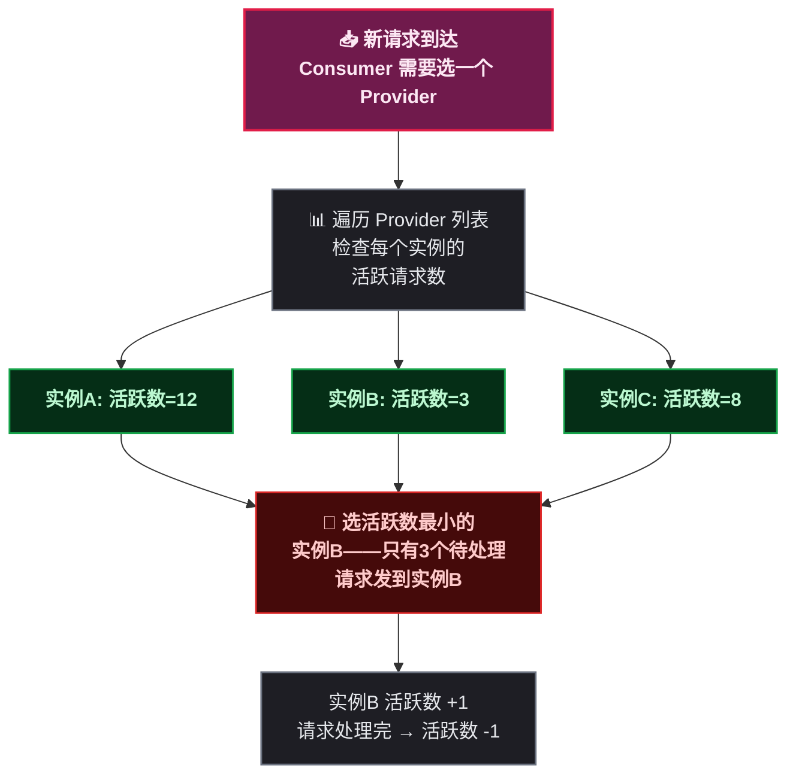
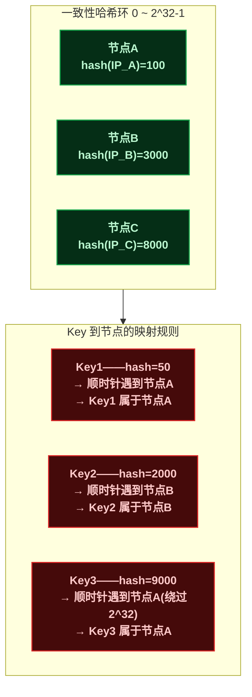
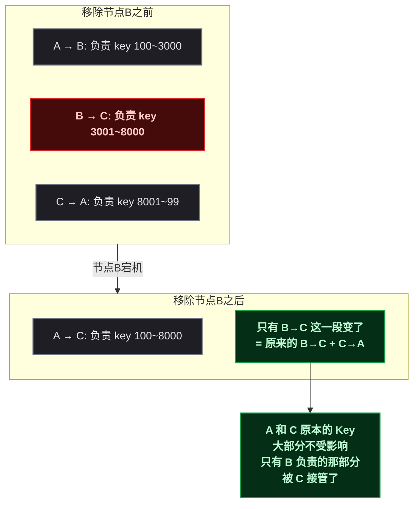
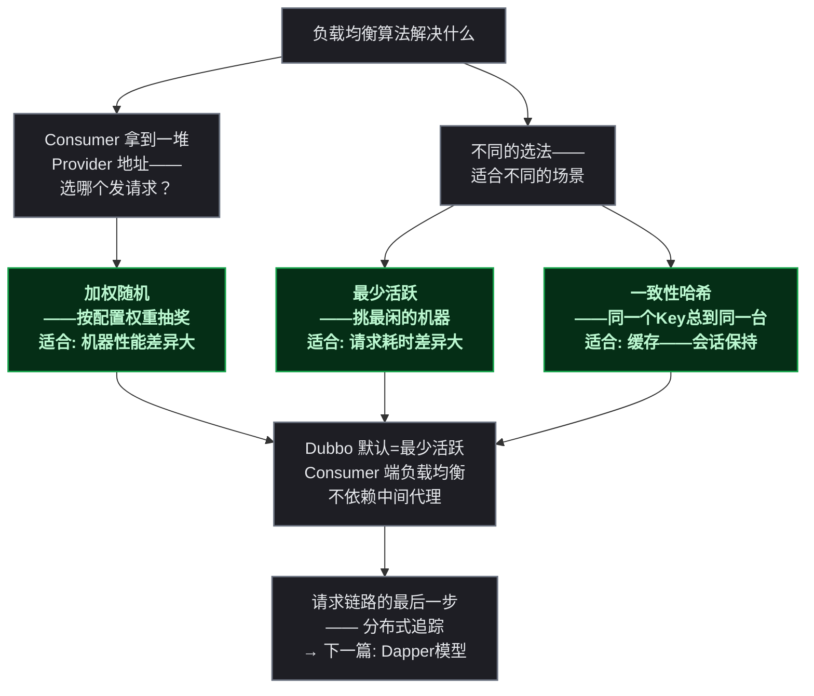

# 负载均衡三剑客

> 本文是<strong>分布式算法科普系列</strong>第六篇。前面讲了服务怎么发现、怎么保证一致性、怎么限流、怎么处理事务——现在一个请求终于要发出去了。但目标服务部署了 5 个实例，<strong>请求该打到哪一个上面？</strong>这就是负载均衡要回答的问题。

## 一、故事：缓存集群增减机器时的雪崩

1997 年，MIT 的 David Karger 和他的同事们遇到了一个实际问题。当时的 Web 缓存系统（比如 Akamai 这样的 CDN 前身）由几十上百台服务器组成，每台存一部分网页缓存。浏览器请求一个页面时——先算哈希——根据哈希值决定去哪台缓存服务器取数据。

<strong>问题出在服务器数量变化的时候。</strong>假设有 10 台服务器——用 `hash(key) % 10` 决定数据落在哪台机器。当一台机器宕机——变成了 9 台——几乎所有 key 的 `hash % 9` 结果都和之前不一样了——<strong>几乎所有缓存同时失效，所有请求打向后端源站，源站瞬间被冲垮。</strong>

这就是所谓的<strong>"缓存雪崩"</strong>——不是因为流量突增，而是因为集群规模变化导致哈希取模结果大面积重映射。Karger 等人在 1997 年的论文《Consistent Hashing and Random Trees》中提出了一致性哈希——当节点增减时，只有少部分数据需要重新分配，而不是全部。

<strong>一致性哈希解决的只是负载均衡算法要处理的众多问题之一。</strong>在这之前，加权随机和最少活跃已经在各自的场景中发挥作用——它们共同构成了负载均衡算法的核心工具箱。

---

## 二、前置：负载均衡到底在均衡什么

在一个典型的微服务调用链中：

```
Consumer → [从注册中心拿到 Provider 列表] → 选一个 Provider → 发请求
                                       ↑
                                  负载均衡算法在这一步起作用
```

注册中心（比如 Nacos）返回了服务实例的列表——5 个 IP 加端口。Consumer 要从中挑一个发请求。<strong>怎么挑——就是负载均衡算法的事。</strong>

不同的挑法对应不同的目标：

| 目标 | 对应算法 |
|------|------|
| <strong>后端实例配置不同</strong>（有的机器性能好、有的差） | 加权随机 |
| <strong>后端实例忙闲不均</strong>（有些正在处理慢请求） | 最少活跃 |
| <strong>需要同一类请求总是打到同一台机器</strong> | 一致性哈希 |

三种算法不是"谁更好"的关系——它们是<strong>三种不同的策略，各解决各的问题</strong>。

---

## 三、加权随机——按能力分配

### 3.1 核心思路

最简单的随机——所有实例一视同仁，每个被选中的概率相等。但如果实例配置不一样呢？一台 8 核 16G、另一台 4 核 8G——分配同样的请求量显然不合理。

<strong>加权随机给每个实例分配一个权重</strong>（Weight），权重越大的实例被选中的概率越高。

```
实例A: 权重 = 5
实例B: 权重 = 3
实例C: 权重 = 2

总权重 = 5 + 3 + 2 = 10

每次请求: 生成 0~9 的随机数
  0~4 (5个) → 落到实例A——概率 50%
  5~7 (3个) → 落到实例B——概率 30%
  8~9 (2个) → 落到实例C——概率 20%
```

> 加权随机本质上是一个<strong>带刻度的抽奖转盘</strong>——性能好的机器刻度大（分到的扇形面积大），性能差的刻度小。指针随机停在哪里——请求就发给谁。

### 3.2 加权随机的特点

<strong>优点——简单、无状态、代码量小。</strong>不需要记录每个实例当前的请求数，不需要维护计数器，纯粹靠随机+权重。

<strong>缺点——完全不管当前状态。</strong>就算某个实例正在处理 100 个慢请求、已经忙得冒烟了，加权随机还是按概率往里面塞新请求。它只看"配置上的能力"，不看"此刻的负载"。

<strong>适用场景</strong>：后端实例配置差异大，但请求处理时间比较均匀——没有明显的"某个请求特别慢"的情况。

---

## 四、最少活跃——挑最闲的那个

### 4.1 核心思路

最少活跃换个说法就是——<strong>谁的当前"待处理请求"最少，就发给谁。</strong>



每个 Consumer 内部维护一个计数器——发给实例 A 的请求还没收到返回——活跃数 +1；收到返回——活跃数 -1。选择时遍历所有实例，找活跃数最小的那个。如果有多个实例活跃数相同——随机选一个。

### 4.2 最少活跃的"慢启动"问题

<strong>权重在这里也能起作用。</strong>如果两台机器活跃数相同，可以引入权重做二级决策——权重大的优先。Dubbo 的 LeastActive 实现就是"最少活跃 + 加权随机"的组合——先按活跃数排序，活跃数相同的情况下按权重随机分配。

> ⚠️ 新手提示：最少活跃在<strong>刚启动时会有一个短暂的不准确期</strong>——所有实例的活跃数都是 0，Consumer 会把第一个请求发给任意一个实例，这时还不能反映真实负载。但几十个请求之后，慢实例的活跃数就会堆积起来，算法自然会让它少接新请求。

<strong>适用场景</strong>：请求处理时间差异大——有的请求几毫秒、有的几秒——最少活跃能自动把请求引向处理快的实例。也是 Dubbo 的<strong>默认负载均衡策略</strong>。

---

## 五、一致性哈希——节点增减时只影响最近邻居

### 5.1 问题背景

回到开头 MIT 的故事。取模法（`hash % N`）的问题是——N 变了，几乎所有 key 的映射都变了。

如果缓存系统能在节点增减时只重新分配<strong>少部分 key</strong>——大部分缓存仍然有效——就不会雪崩了。一致性哈希就是为此设计的。

### 5.2 哈希环

一致性哈希不取模。它把哈希空间组织成一个<strong>首尾相连的环</strong>——0 到 2^32-1，绕一圈回到 0：



<strong>规则很简单</strong>：Key 做哈希，看它落在环上哪个位置，顺时针方向遇到的第一个节点就是负责这个 Key 的节点。

### 5.3 节点增减——只影响局部

<strong>新增节点</strong>：加入节点 D——hash 在 A 和 B 之间。原来归 B 管的一部分 Key（落在 A~D 之间的）现在归 D 管。A 和 C 的 Key 不受影响。

<strong>移除节点</strong>：节点 B 宕机。原来归 B 管的 Key 自动归 C 管（顺时针下一个）。A 和 C 原本负责的 Key 不受影响。

<strong>和取模法的对比</strong>：
- 取模法：增加一台机器 → 几乎 100% 的 key 重新映射
- 一致性哈希：增加一台机器 → 只有约 1/N 的 key 重新映射（N = 节点数）



### 5.4 虚拟节点——解决数据倾斜

一致性哈希有一个<strong>直观的缺陷</strong>。如果节点数量少且哈希值落点不均匀——环上可能出现"长弧"和"短弧"——长弧上的节点要负责大段的数据，短弧上的节点只负责一点点。

<strong>虚拟节点</strong>解决这个问题——每个物理节点在环上映射为多个位置（比如 150 个虚拟节点）：

```
物理节点A → 虚拟节点 A#1, A#2, A#3, ... A#150 ——在环上散落 150 个点
物理节点B → 虚拟节点 B#1, B#2, B#3, ... B#150 ——在环上散落 150 个点
```

150 个点均匀散落在环上——物理上三台机器，逻辑上环上有 450 个点——数据分布自然均匀了。而且每台机器 150 个点——A 和 B 分到的弧长几乎相等。

> Dubbo 的一致性哈希默认给每个物理节点创建<strong>160 个虚拟节点</strong>。这个数字是经验值——太少则分布不均匀，太多则内存开销增大但收益递减。

---

## 六、三种算法对比

| 维度 | 加权随机 | 最少活跃 | 一致性哈希 |
|------|:---:|:---:|:---:|
| <strong>决策依据</strong> | 配置权重——静态 | 当前活跃数——动态 | Key 的哈希值——确定性 |
| <strong>是否感知负载</strong> | 不感知 | 感知——实时活跃数 | 不感知 |
| <strong>状态维护</strong> | 无状态 | 需维护每个实例的活跃计数 | 需维护哈希环结构 |
| <strong>同一 Key 是否总到同一节点</strong> | 不保证 | 不保证 | <strong>保证</strong>——只要节点不变 |
| <strong>节点增减的影响</strong> | 权重重新分配——全面影响 | 无影响——每个请求独立选 | 只影响邻近节点——局部影响 |
| <strong>适用场景</strong> | 实例配置异构——请求耗时均匀 | 请求耗时差异大——需动态避开慢节点 | 需要绑定——缓存——会话保持 |
| <strong>Dubbo 中的实现</strong> | RandomLoadBalance | LeastActiveLoadBalance（默认） | ConsistentHashLoadBalance |

---

## 七、总结



<strong>三种算法对应三种场景——配置异构用加权随机，请求耗时不均用最少活跃，需要同类请求到同台机器用一致性哈希。</strong>Dubbo 默认使用最少活跃——因为它最能适应线上真实环境的不确定性——谁也不知道哪个实例什么时候会变慢。

下一篇是这个系列的最后一篇——Dapper 模型的 TraceId 和 SpanId——讲怎么在跨了几十个服务的调用链上快速定位问题。

> 📖 <strong>系列导航</strong>：本文是<strong>分布式算法科普系列</strong>第 6 篇。上一篇：[<strong>事务消息：半消息与回查</strong>]()，讲 RocketMQ 怎么用半消息保证异步分布式事务。下一篇：[<strong>Dapper 模型：TraceId 与 SpanId 的传播之道</strong>]()，讲 SkyWalking 怎么用链路追踪定位跨服务调用的问题。
