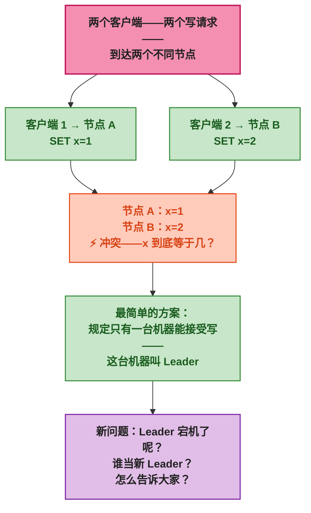
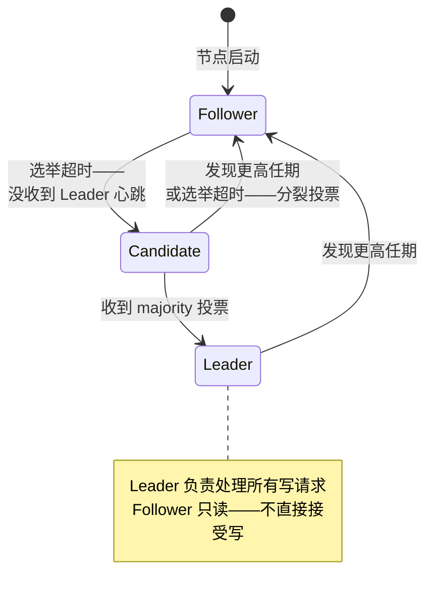
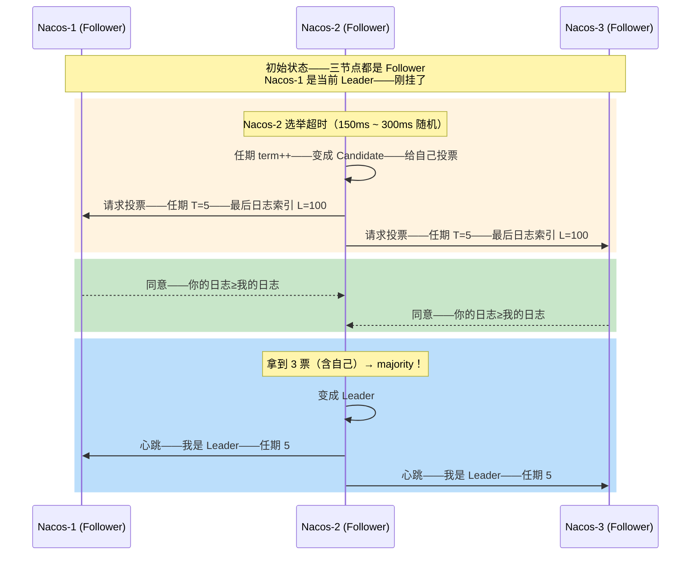
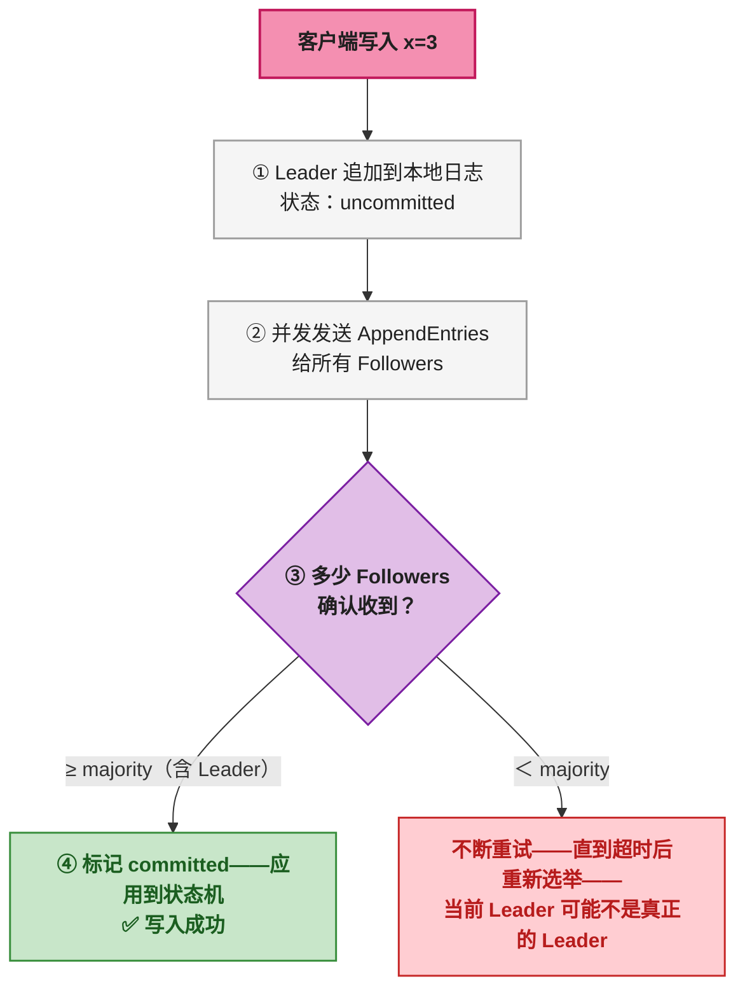
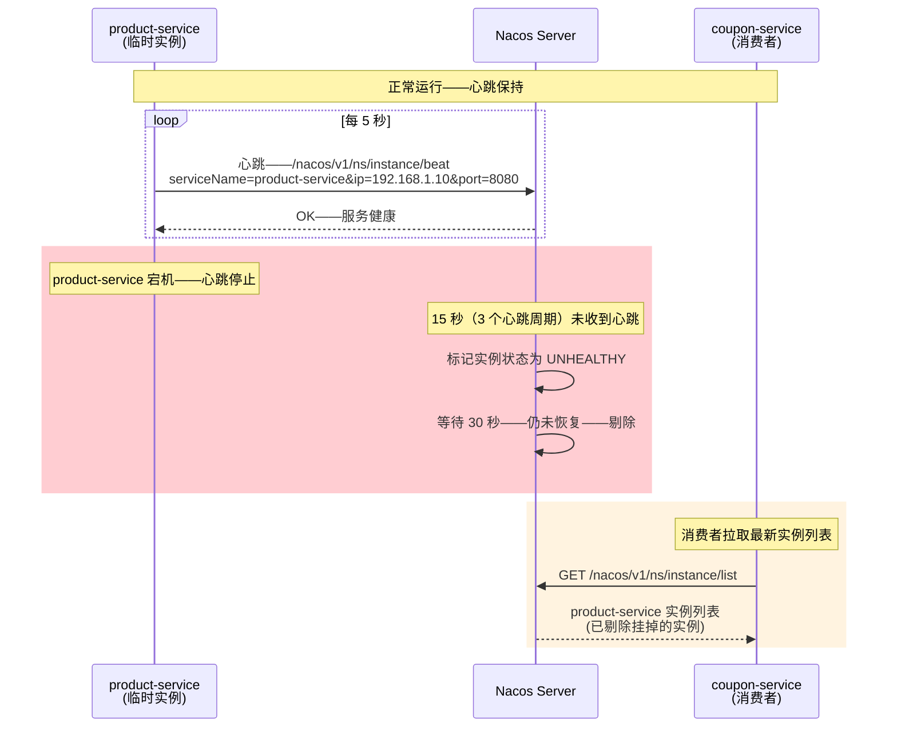
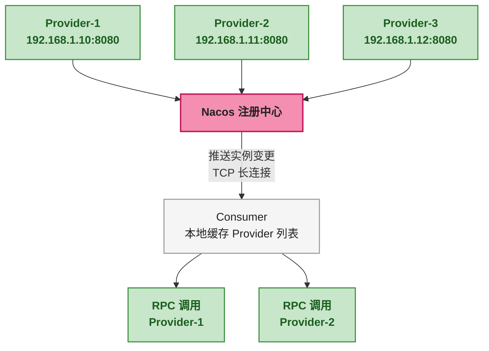

# 谁说了算——Raft选举、心跳与故障检测在Nacos/Dubbo中的应用

前两篇讲了一个道理：网络和时钟不可靠 → 必须做取舍 → CAP 把取舍定了性。那<strong>具体怎么做取舍呢？</strong>

如果集群里只有一台机器——不存在一致性问题——所有写操作都在同一块硬盘上——谁先谁后清清楚楚。但只有一台机器的代价是——这台机器宕机——系统全挂。所以需要多台机器——而多台机器就需要一个机制来决定<strong>"谁的版本算数"</strong>。

这个机制在分布式系统里有一个正式的名字——<strong>共识算法（Consensus Algorithm）</strong>。Raft 是目前工程界最广泛使用的共识算法——不是因为它理论上最完美——而是因为它<strong>可以让人看得懂</strong>。

> 📌 <strong>前置知识</strong>：建议先读[上篇 CAP 定理]()——理解 CP vs AP 的区别。Raft 是典型的 CP 实现——本文的 Raft 部分主要解释它如何实现 C（一致性）。

---

## 一、为什么要有人"说了算"——分布式写操作的困境

先看一个最简单的集群：三台机器——每台都存一份数据——都可以接受写请求。

```
客户端写入 x=1 → 节点 A 收到——更新本地 x=1
客户端写入 x=2 → 节点 B 收到——更新本地 x=2
（几乎同时——两个客户端连到了两个不同的节点）

A 认为 x=1——B 认为 x=2——到底 x 是多少？
```

两者各自都认为自己的数据正确——没有人有权限说"听我的"——<strong>这就是分布式系统里最核心的问题——没有单点权威——写操作需要协调。</strong>



Raft 要解决的就是这两个问题合在一起：<strong>(1) 选出一个大家都认可的 Leader——(2) Leader 挂了以后——自动选出新 Leader。</strong>

---

## 二、Raft 的核心思想——不是"所有节点都同意"——是"多数同意就行"

回忆第一篇讲的<strong>两将军问题</strong>——两个节点在不可靠信道上永远无法在有限轮次内达成一致。<strong>Raft 的突破口是——不要求全部节点同意——只要超过半数（majority）同意就行。</strong>

为什么 majority 就够了？因为三节点集群里——majority 是 2 个——<strong>任何两次 majority 投票——必然至少有一个节点重叠。</strong>

```
第一次投票——多数派：{A, B} 同意 Leader 是 A
第二次投票——多数派：{B, C} 同意 Leader 是 C

重叠节点 B 手里有 A=旧Leader 的历史记录
B 不会在同一任期内既同意 A 又同意 C
→ 这就防止了"两个 Leader 同时存在"
```

<div style="background: #F5F5F5; border: 1px solid #BDBDBD; padding: 16px; max-width: 600px; border-radius: 4px; font-family: monospace; font-size: 12px; margin: 16px 0;">
    <div style="background: #1E88E5; color: #FFFFFF; padding: 6px 10px; font-weight: bold; margin: -16px -16px 12px -16px; border-radius: 4px 4px 0 0;">Majority 重叠证明——为什么只需要多数派</div>
    <div style="display: flex; gap: 12px;">
        <div style="flex: 1; background: #C8E6C9; border: 1px solid #388E3C; padding: 8px; text-align: center; border-radius: 2px;">
            <span style="color: #1B5E20; font-weight: bold;">任期 T1 多数派</span><br>
            A ✓ B ✓<br>
            C ✗ (未响应)<br>
            <span style="color: #388E3C;">→ Leader = A</span>
        </div>
        <div style="flex: 1; background: #FFCCBC; border: 1px solid #E64A19; padding: 8px; text-align: center; border-radius: 2px;">
            <span style="color: #BF360C; font-weight: bold;">如果任期 T2 想选 C</span><br>
            C ✓ B ? A ?<br>
            B 已经被 T1 承诺过<br>
            B 不会在同一任期投两票<br>
            <span style="color: #E64A19;">→ 不可能拿到 majority</span>
        </div>
    </div>
</div>

这个简单的数学事实是 Raft 正确性的根基——也是为什么 Raft 集群<strong>必须是奇数个节点</strong>（3/5/7）——偶数节点会出现"各拿一半"的平局。

---

## 三、Raft 选举——三个角色与一个状态机

Raft 里每个节点在任意时刻只属于三种角色之一：



| 角色 | 职责 | 关键行为 |
|------|------|------|
| <strong>Leader</strong> | 处理所有写请求——将日志复制到 Followers | 持续发送心跳——维护权威 |
| <strong>Follower</strong> | 被动接收 Leader 的日志和心跳 | 超时未收到心跳——转为 Candidate |
| <strong>Candidate</strong> | 发起选举——请求投票 | 获得 majority 投票 → Leader——发现更高任期 → Follower |

<strong>选举的核心流程——用 Nacos 三节点 Raft 集群来演示：</strong>



> ⚠️ <strong>新手提示</strong>：Raft 里每个节点<strong>必须先给自己投票</strong>。否则如果三个节点都等别人先投——就死锁了——没有任何人能拿到 majority。另外——选举超时是<strong>随机的</strong>（150ms ~ 300ms）——这个随机化避免了三个节点同时超时——同时变成 Candidate——导致分裂投票。

---

## 四、日志复制——Leader 不是独裁者——必须多数派确认

Leader 选出来之后——写操作怎么处理？步骤很简单——<strong>但"提交"这个概念的精确理解是关键。</strong>

```
写操作 x=3 的完整流程：

① Leader（Nacos-2）收到客户端写请求——SET x=3
② Leader 将 SET x=3 追加到自己的日志——但标记为 uncommitted（未提交）
③ Leader 并发发送 AppendEntries RPC——携带 SET x=3——给 Nacos-1 和 Nacos-3
④ Nacos-1 收到——追加到日志——返回确认
⑤ Nacos-3 收到——追加到日志——返回确认
⑥ Leader 收到 majority（含自己——共 2/3）确认——将 SET x=3 标记为 committed（已提交）
⑦ Leader 将 x=3 应用到状态机（实际生效）
⑧ 后续心跳中——Leader 告诉 Followers "这条日志已提交"——Followers 也应用到状态机
```

<strong>关键点——步骤 6 中——只需要 majority 确认——不需要全部节点。</strong>如果 Nacos-3 在步骤 5 之前挂了——Nacos-1 确认就够了（加上自己——2/3 = majority）——日志照样提交。挂着的那台——恢复后通过心跳追上进度。



这就是 Raft 如何实现 CP——<strong>写操作必须 majority 确认——网络分区发生时——少数派分区不可能提交任何新数据——保证了一致性。</strong>

---

## 五、心跳——Raft 里的双重作用

在 Raft 里——心跳不止是"我还活着"——它承载了两个关键作用：

<strong>作用一：阻止不必要的选举。</strong>Leader 定期（默认 1/2 选举超时——约 75ms ~ 150ms）向所有 Follower 发送心跳（空的 AppendEntries RPC）。Follower 收到心跳后重置选举超时——只要 Leader 活得好好的——就不会有新选举。

<strong>作用二：携带已提交的日志索引（LeaderCommit）。</strong>即使没有新日志——心跳里也会携带 Leader 当前已提交到哪一条（LeaderCommit 字段）。Follower 比较自己的已提交位置——如果落后——就知道哪些之前的日志也该提交了。

```
心跳包（AppendEntries RPC）的结构——简化版：

{
    term: 5,                // Leader 的当前任期——Follower 用来判断对方是不是合法 Leader
    leaderId: "nacos-2",    // 谁是 Leader——方便路由
    prevLogIndex: 100,      // 上一条日志的索引——Follower 用来检查是否匹配
    prevLogTerm: 5,         // 上一条日志的任期——不匹配说明日志有分歧
    entries: [],            // 要复制的日志条目——心跳时为空
    leaderCommit: 98        // Leader 已提交到第 98 条——Follower 可以安全提交 1~98
}
```

> ⚠️ <strong>新手提示</strong>：心跳虽然简单——但在 Raft 的正确性中非常关键——它不仅在维持 Leadership——同时也是在传播"哪些日志已经安全提交了"这个信息。在 Nacos Raft 实现中——如果心跳间隔配得太长——Follower 可能因为迟迟不知道日志已提交——导致读到的数据是旧版本。

---

## 六、Nacos 的 AP 心跳——注册中心的故障检测

上一节讲的是 Raft 的 CP 心跳——Nacos 里还有另一套心跳——用于<strong>服务注册中心——属于 AP 模型。</strong>



<strong>Nacos AP 心跳的关键参数：</strong>

| 参数 | 默认值 | 含义 |
|------|:---:|------|
| 心跳间隔 | 5 秒 | 临时实例向 Server 发心跳的频率 |
| 心跳超时 | 15 秒 | 连续 3 次没收到——标记为不健康 |
| 实例剔除 | 30 秒 | 标记不健康后——再过 30 秒还没恢复——从列表删除 |
| 保护阈值 | 0.85 | 健康实例占比低于 85%——触发保护——不剔除——防止因网络分区误删大量实例 |

<strong>保护阈值是 AP 模式最有趣的机制——它承认网络是不可靠的——在判断"实例挂了"这件事上主动留了余地。</strong>

> ⚠️ <strong>新手提示</strong>：保护阈值的工作原理——假设 product-service 部署了 10 个实例——某时刻 2 个实例健康、8 个被标记不健康——健康比例 20%——低于保护阈值 85%——Nacos 不会剔除那 8 个"不健康"的实例——而是继续返回全部 10 个给消费者。这看起来很蠢——明明 8 个都不健康了还返回——但恰好是因为 Nacos 假设 <strong>同时挂 8 个更可能是网络分区而非所有实例都挂了</strong>——盲目剔除会导致大规模误伤。

---

## 七、Dubbo 如何感知服务变化——三个角色协作

Dubbo 的服务发现依赖注册中心（通常是 Nacos 或 Zookeeper）来感知服务上下线。与 Nacos 的主动心跳不同——Dubbo 的消费者端更依赖<strong>注册中心的推送</strong>来感知 Provider 的变化。

```
Dubbo 服务感知的完整链路：

① Provider 启动 → 向 Nacos 注册自己的 IP:Port
② Consumer 启动 → 订阅 Nacos 中 Provider 的实例列表 → 缓存到本地
③ Provider 定时心跳 → Nacos 维持注册状态
④ Provider 宕机 → Nacos 检测到心跳超时 → 通过 TCP 长连接推送变更到 Consumer
⑤ Consumer 收到推送 → 更新本地缓存 → 新请求不再发往已宕机的 Provider
```

<strong>Dubbo 设计的核心哲学——Consumer 不直接探测 Provider 是否存活——而是信任注册中心的判断。</strong>这样做的好处是：Consumer 不需要维护 N × M 条心跳连接（N 个 Consumer × M 个 Provider）——只需要与注册中心维持一条长连接。



> ⚠️ <strong>新手提示</strong>：Dubbo Consumer 本地的 Provider 缓存是 <strong>最终一致性</strong>的——从 Provider 宕机到 Consumer 收到推送、更新缓存——这中间有一小段时间差——Consumer 可能还在往已宕机的 Provider 发请求。所以 Dubbo 通常要配合<strong>重试机制</strong>（Failover）来兜这个时间窗口——这又是 AP 模式在可用性和一致性之间的权衡——缓存机制加快了 Consumer 调用速度（不用每次都查注册中心）——代价是短暂的地址不一致。

---

## 八、总结——这篇讲了什么

| 概念 | 一句话 | 在哪个中间件里用到 |
|------|------|------|
| <strong>Raft 选举</strong> | majority 投票——重叠保证唯一性——防止脑裂 | Nacos CP（配置中心） |
| <strong>日志复制</strong> | majority 确认后提交——少数派无法独立提交 | Nacos CP——保证配置一致 |
| <strong>Raft 心跳</strong> | 阻止新选举 + 传播提交位——双作用 | Nacos CP 模式下 Leader 维护 |
| <strong>AP 心跳</strong> | 临时实例定期上报——超时剔除——保护阈值防误杀 | Nacos AP（注册中心） |
| <strong>注册中心推送</strong> | Consumer 不直接探活 Provider——信任注册中心 | Dubbo 服务发现 |

<strong>贯穿这一篇的一个核心设计思想——多数派（majority）——Raft 用它选 Leader——用它提交日志——用它保证一致性。而"多数派"这个概念之所以成立——正是数学上的"任意两次 majority 必有重叠"——这才是分布式共识算法的理论根基。</strong>

下一篇——最后一篇——从 Sentinel 的滑动窗口到令牌桶——再到 Dubbo 的负载均衡——讲清楚流控算法三板斧。

---

> 📖 <strong>本系列导航</strong>：
> - 第一篇：[网络与时间的不确定性]()
> - 第二篇：[CAP 定理与一致性模型]()
> - <strong>本文</strong>：第三篇——Raft 选举、心跳与故障检测
> - 第四篇：流控算法——Sentinel 滑动窗口、令牌桶与 Dubbo 负载均衡
