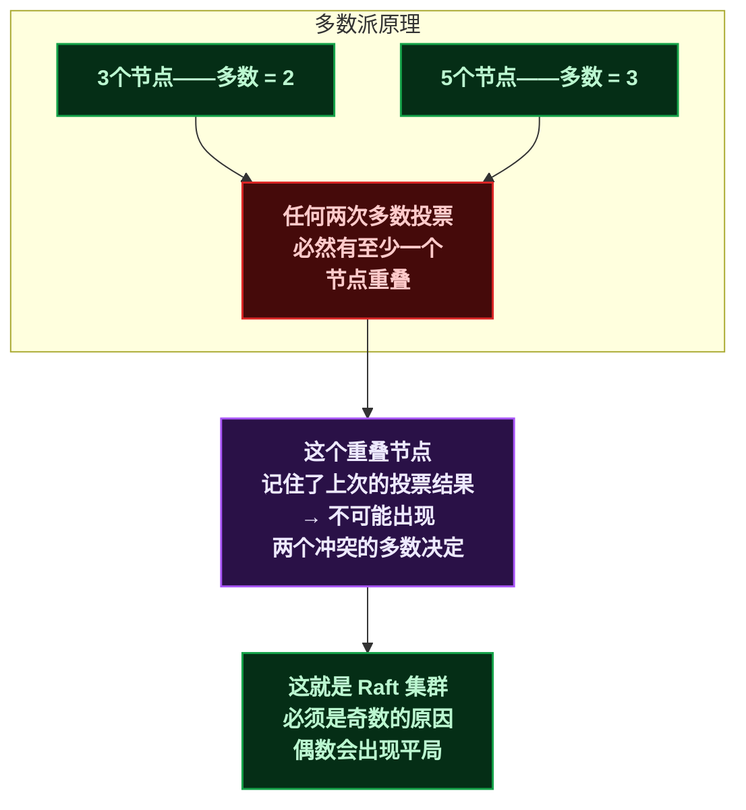
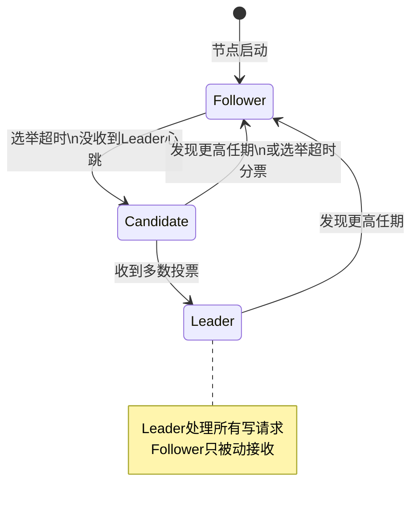
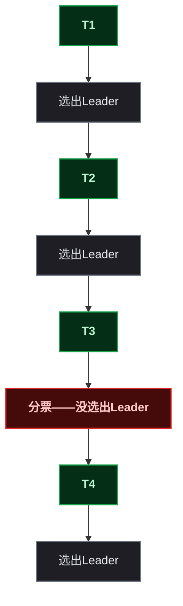
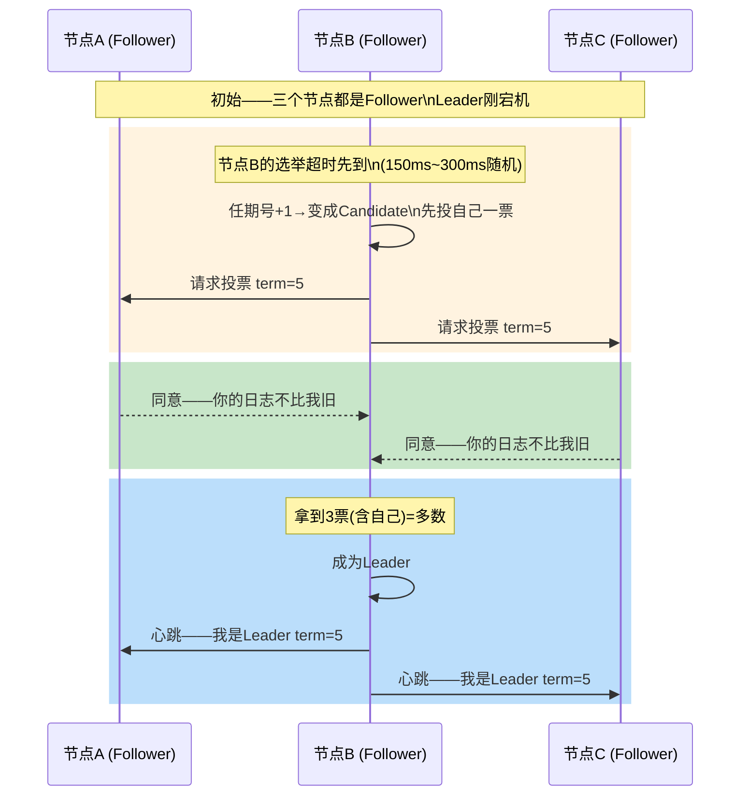
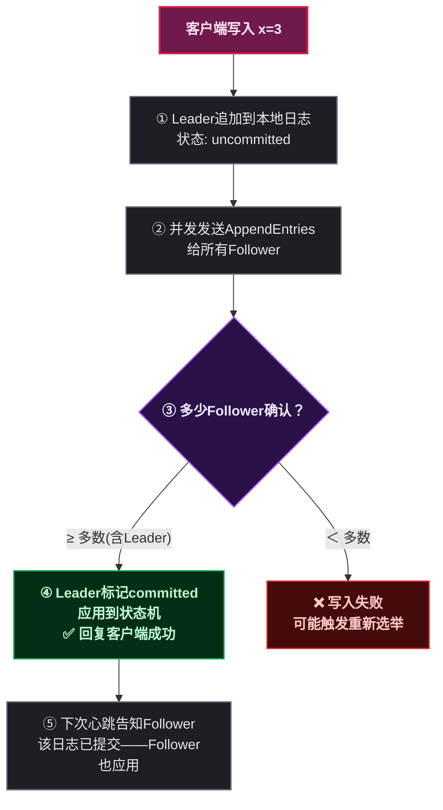
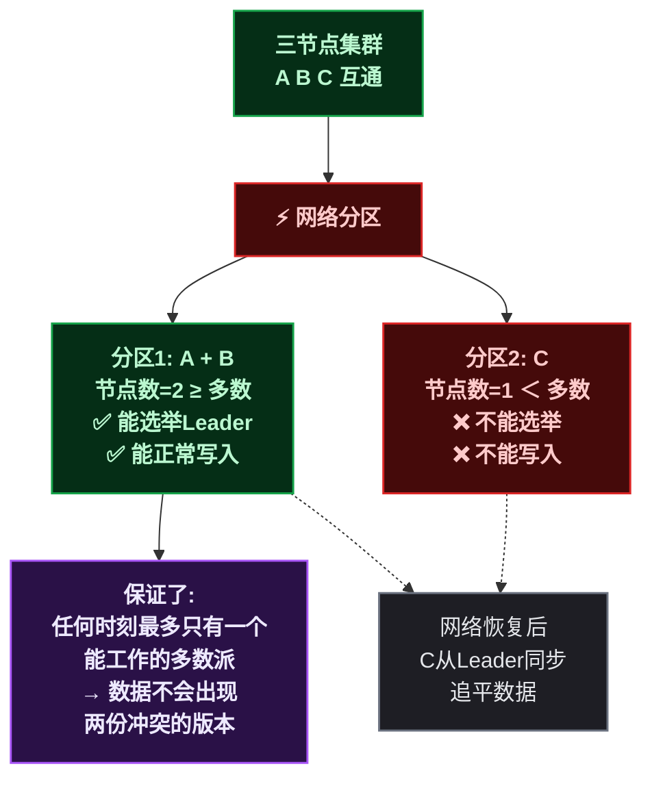
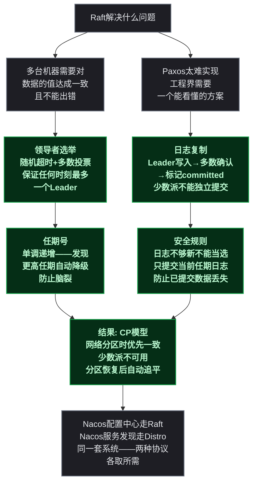

# Raft 协议

> 本文是<strong>分布式算法科普系列</strong>第二篇。上一篇讲了 Distro 协议如何用"去中心化 + 异步同步"实现 AP 模型——写完立刻返回、事后慢慢对齐。这一篇讲它的反面：Raft 如何用"选出一个老板 + 事事多数同意"实现 CP 模型——宁可暂时不可用、绝不返回错误数据。

## 一、故事：Paxos 太难了，于是有了 Raft

在 Raft 出现之前，分布式共识领域有一个"上古神器"——Paxos。Paxos 由 Leslie Lamport（就是写 LaTeX 的那位）在 1989 年提出，理论正确性无可挑剔，但有一个致命的工程问题：<strong>几乎没有人能真正看懂它</strong>。

Lamport 在 1998 年发表了一篇补充论文《Paxos Made Simple》，摘要第一句话就是——"The Paxos algorithm, when presented in plain English, is very simple."（用大白话讲，Paxos 其实很简单。）但工程界的反馈很统一：不，它一点也不 simple。

<strong>这不是段子，是真实历史。</strong>Google 的 Chubby 分布式锁系统在实现 Paxos 的过程中遇到了大量问题，Chubby 的作者 Mike Burrows 有一句著名的吐槽："世界上只有两种共识算法——Paxos 和那些没人能证明正确的算法。"

2013 年，斯坦福大学的博士生 Diego Ongaro 和导师 John Ousterhout 决定正面解决这个问题。他们的出发点和前面所有人都不一样——<strong>把"可理解性"作为算法的首要设计目标</strong>，而不是附带的副产品。

Ongaro 从头设计了一个全新的共识算法，刻意把整个协议拆成三个相对独立的模块——领导者选举、日志复制、安全保证——每个模块都可以单独理解。2014 年，他们发表了论文《In Search of an Understandable Consensus Algorithm》（寻找一个可理解的共识算法），Raft 正式诞生。

<strong>这篇论文的标题本身就说明了一切</strong>——"寻找"意味着在此之前，工程界确实缺少一个普通人能看懂的共识算法。而 Raft 的成功印证了 Ongaro 的判断：因为好懂，所以不容易写错；因为不容易写错，所以工程落地快。短短几年，etcd、TiKV、Consul、Nacos 配置中心全部采用了 Raft。

> ⚠️ 新手提示：Paxos 和 Raft 解决的是同一个问题——让多台机器对"数据的值是什么"达成一致。区别在于 Paxos 理论优雅但实现困难，Raft 刻意牺牲了一些理论美感换来工程可读性。本文只讲 Raft，不需要了解 Paxos 的细节。

---

## 二、前置：共识问题到底是什么

在深入 Raft 之前，先理解它到底要解决什么问题。上一篇文章讲 Distro 时提到了 CAP 定理——网络分区时，一致性（C）和可用性（A）只能二选一。Distro 选了 AP，Raft 选了 CP。

<strong>选 CP 意味着什么？</strong>用一个比喻来理解：

> 一家公司有三个合伙人。任何一笔支出，必须至少两个人签字才能报销。如果某个合伙人出差联系不上了（网络分区），剩下的两个人仍然可以签字报销（因为两人是多数）。但那个出差的合伙人，如果想一个人签字报销——不行，因为单独一个人不是多数。他必须等到恢复联系，重新跟另外两人协商。

<strong>这里的"多数签字"就是 Raft 的核心机制——majority（多数派）</strong>。任何操作必须得到超过半数节点的确认才能生效。这意味着：

- <strong>少数节点不可用时，系统仍能正常工作</strong>（多数还在）
- <strong>少数节点被隔离时，不能独立做出决策</strong>（不是多数）
- <strong>任何一个时刻，最多只有一个"多数派"存在</strong>（这是数学事实，后面会反复用到）



Raft 集群的节点数通常是 3、5 或 7。为什么是奇数？因为 4 个节点的多数是 3——容忍故障数仍然是 1（和 3 节点一样），但多浪费了一台机器。所以 Raft 的推荐规模是 <strong>2N+1 个节点——容忍 N 个节点同时故障</strong>。

---

## 三、领导者选举——谁是老板

### 3.1 三种角色

Raft 把集群中的每个节点在任意时刻归入三种角色之一：



| 角色 | 日常状态 | 什么情况下会变 |
|------|------|------|
| <strong>Leader</strong> | 唯一的老板——处理所有写请求——定时给所有人发心跳 | 发现更高任期号 → 降级为 Follower |
| <strong>Follower</strong> | 群众——被动接收 Leader 的指令——只读不写 | 长时间没收到心跳 → 升级为 Candidate |
| <strong>Candidate</strong> | 竞选者——临时状态——向所有人拉票 | 拿到多数票 → 成为 Leader；发现更高任期 → 退回 Follower |

角色切换的核心驱动力是<strong>心跳超时</strong>。Leader 每隔一段时间（通常几十毫秒）向所有 Follower 发送心跳包。Follower 只要收到心跳，就知道 Leader 还活着，乖乖当群众。如果 Follower 等了一段时间没收到任何心跳——<strong>它认为 Leader 可能挂了，自己跳出来竞选</strong>。

### 3.2 任期（Term）

Raft 把时间划分成一段一段的<strong>任期（Term）</strong>，每个任期最多有一个 Leader。任期号单调递增——1、2、3……永远不会倒退。

可以把任期理解为<strong>"学年"</strong>：每个学年开学时选举班长（Leader Election）。如果某个学年没选出班长（分票），这学年直接作废，下学期重新选。如果有同学发现自己是上学期留级的（任期号比别人低），自动闭嘴——你已经过期了。



任期号出现在 Raft 的每条消息里。节点收到一条任期号比自己低的请求——直接拒绝（你过时了）。收到任期号比自己高的请求——立刻更新自己的任期号、退回 Follower 状态（来了新学年，旧班长自动下课）。

### 3.3 选举过程

用三节点集群来演示一次完整的选举：



几个关键细节：

<strong>随机超时</strong>：每个 Follower 的选举超时是随机的（比如 150ms ~ 300ms 之间随机取一个值）。如果三个节点同时超时、同时变成 Candidate、同时拉票——就会三个人各得一票，谁也拿不到多数。随机化让这种情况几乎不可能发生——总有一个先超时、先拉票、先获胜。

<strong>先投自己</strong>：每个 Candidate 发起选举时，第一票投给自己。这是必须的——如果每个人都在等别人先投，永远没人拿到多数。

<strong>日志不能比自己旧</strong>：Follower 投票前会检查 Candidate 的日志是不是至少跟自己一样新。如果 Candidate 的日志落后太多，Follower 拒绝投票——不能让一个"缺课太多"的节点当班长。

---

## 四、日志复制——老板拍板，但必须多数签字

Leader 选出来后，写请求怎么处理？这是 Raft 实现强一致的核心环节。

### 4.1 一次写入的完整过程

```
客户端想写入 x=3，请求发到 Leader（节点B）：

① Leader 把 SET x=3 追加到自己的日志末尾——状态: uncommitted（未生效）
② Leader 向所有 Follower 并发发送 AppendEntries 消息——携带 SET x=3
③ Follower A 收到消息——追加到自己的日志末尾——回复"收到"
④ Follower C 收到消息——追加到自己的日志末尾——回复"收到"
⑤ Leader 收到 A 和 C 的确认——加上自己——3个里面确认了3个 ≥ 多数(2)
⑥ Leader 把 SET x=3 标记为 committed（已生效）——应用到状态机——x 正式变成 3
⑦ Leader 回复客户端——"写入成功"
⑧ 下一次心跳时——Leader 告诉 Followers"第N条日志已提交"——Followers 也应用到状态机
```



<strong>uncommitted 和 committed 的区别是关键</strong>。Leader 收到写请求后先记在自己的日志里但标注"未生效"——此时如果 Leader 宕机，这条日志可能永远不会被应用。只有多数节点确认收到后，Leader 才标记"已生效"——此时即使 Leader 宕机，新选出的 Leader 也必然包含这条日志（因为多数派必有重叠）。

### 4.2 网络分区时会发生什么

这是理解 Raft 的 CP 属性的核心场景。假设三节点集群发生网络分区：

```
分区1: 节点A + 节点B (多数——可以继续工作)
分区2: 节点C (少数——被隔离)

分区1 里——A和B都是多数——可以选出新Leader——可以正常写入
分区2 里——C单独一个节点——拿不到多数——不能选举——不能写入

网络恢复后——C重新加入集群——发现自己落后了——
从新Leader那里同步缺失的日志——追上来
```

<strong>关键点：少数分区不能写入。</strong>这就是 Raft 的 CP——在网络分区的情况下，宁可那部分节点不可用（牺牲 A），也绝不产生两份互相冲突的数据（保护 C）。



### 4.3 为什么"多数确认"一定能保证一致性

回到前面讲过的数学事实：<strong>任意两个多数派必然有重叠节点</strong>。三节点集群的多数是 2——第一次多数派是 {A, B}，第二次多数派不可能是 {C} 单独一个节点（只有一个，不是多数）。第二次多数派只可能是 {A, C} 或 {B, C}——都和前一次有重叠。

重叠节点手里有上一次提交的记录。当新 Leader 选举时，它必须拿到多数票——而这些投票者中至少有一个节点包含上一次提交的最后一条日志。<strong>这意味着新 Leader 的日志一定包含了所有已提交的日志</strong>，不可能出现"已提交的数据在新 Leader 手里丢了"的情况。

---

## 五、Raft 的安全性保证

除了选举和日志复制，Raft 还有几个关键的安全机制确保"数据绝对不错"。

### 5.1 选举限制——日志不够新的人不能当 Leader

Candidate 拉票时，Follower 会检查 Candidate 的最后一条日志是不是至少跟自己一样新。判断标准：先比较任期号，任期号大的更新；任期号相同则比较日志长度，更长的更新。

这保证了<strong>新 Leader 一定包含了所有已提交的日志</strong>。如果某个节点的日志落后太多——比如它少了很多条已提交的日志——它永远拿不到多数票，永远当不上 Leader。

### 5.2 只能提交当前任期的日志

Leader 只能通过"多数确认"来提交<strong>当前任期</strong>的日志。不能通过确认当前任期的日志，顺便把之前任期未提交的日志也提交了。

这个规则防止一种非常微妙的数据丢失场景——前一个任期的 Leader 可能只把日志复制到了少数节点就宕机了，那条日志其实没有提交。如果新 Leader 不小心把它也提交了，等这个新 Leader 也宕机后，日志就可能丢失。

> ⚠️ 新手提示：这个规则很绕，第一次看大概率会懵。不用深究——这是 Raft 协议作者在论文里专门花了一节讨论的 corner case。记住结论就行：<strong>Raft 通过"只提交当前任期日志"这个规则，避免了前任 Leader 遗留的未提交日志在新 Leader 手里被错误提交</strong>。

### 5.3 崩溃恢复——节点重启后自动追平

Follower 宕机后重启，Leader 会通过心跳发现它落后了，然后持续发送缺失的日志直到追平。Leader 宕机后，集群选出新 Leader，旧 Leader 重启后发现自己任期号落后——自动降级为 Follower，从新 Leader 那里同步缺失的数据。

整个过程不需要人工介入。<strong>只要多数节点还活着，集群就能自动恢复</strong>。

---

## 六、Raft 的局限性

| 局限性 | 后果 | 为什么可以接受 |
|------|------|------|
| <strong>写入必须经 Leader</strong> | Leader 挂了要重新选举——选举期间（几百毫秒）不能写入 | 配置变更频率低、对延迟不敏感 |
| <strong>需要多数节点存活</strong> | 三节点挂两台——集群不可用 | 配置中心场景下，三节点挂两台的同时概率极低 |
| <strong>性能不如 AP 模型</strong> | 每条日志都要多数确认——写入延迟比 Distro 高 | 一致性比速度重要——配置错了比配置慢半秒损失大得多 |
| <strong>所有读也要经 Leader</strong> | Follower 不能分担读压力（默认情况下） | 配置读写 QPS 本来就不高——不需要水平扩展 |
| <strong>节点数越多性能越差</strong> | 5 节点比 3 节点需要多等一个确认 | 配置中心 3 节点就够了——不会大规模部署 |

---

## 七、哪些中间件用了 Raft

Raft 因为好理解、好实现，已经成为分布式系统里最广泛使用的共识算法：

| 中间件 | 用 Raft 做什么 | 为什么选 Raft |
|------|------|------|
| <strong>Nacos 配置中心</strong> | 配置数据的强一致存储——多个 Nacos 节点之间同步配置 | 配置数据不能出错——"读到的必须是正确的" |
| <strong>etcd</strong> | Kubernetes 的底层存储——存 Pod、Service、ConfigMap 等核心元数据 | K8s 集群的"唯一真相来源"——必须强一致 |
| <strong>TiKV</strong> | TiDB 的分布式存储层——存每一行数据 | 数据库的数据——一致性是第一优先级 |
| <strong>Consul</strong> | 服务发现 + KV 存储 + 健康检查 | 多数据中心场景下需要强一致的 KV 存储 |

这些中间件的共同特点是：<strong>它们存储的数据"错不起"</strong>。配置错了可能导致全站故障，K8s 元数据错了可能导致 Pod 被误删，数据库的数据错了就是线上事故。

这也是为什么 Nacos 在同一套系统里用了两种协议——服务发现走 Distro（AP，可用性优先），配置中心走 Raft（CP，一致性优先）。<strong>不是谁更好，而是谁更合适。</strong>

---

## 八、总结



一句话记住 Raft：<strong>选出一个老板（Leader），事事多数同意（Majority），换来的代价是老板不在时不能干活（选举期间不可用），换来的收益是读到的数据绝对正确。</strong>

和 Distro 对比着看：

| | Distro（AP） | Raft（CP） |
|------|:---:|:---:|
| <strong>有没有主节点</strong> | 没有——人人平等 | 有——Leader 说了算 |
| <strong>写操作路径</strong> | 任意节点——立刻返回——异步同步 | 必须经 Leader——多数确认——同步返回 |
| <strong>读操作路径</strong> | 读本地——可能读到旧数据 | 读 Leader——保证读到最新 |
| <strong>网络分区时</strong> | 所有分区都能读写——事后修 | 只有多数分区能读写——少数干等 |
| <strong>适合场景</strong> | 错了能补救——服务发现 | 错了就是事故——配置中心 |

下一篇讲 Sentinel 的流控算法三件套——滑动窗口、漏桶、令牌桶——保护系统不被流量冲垮。

> 📖 <strong>系列导航</strong>：本文是<strong>分布式算法科普系列</strong>第 2 篇。上一篇：[<strong>Distro 协议：去中心化与最终一致</strong>]()，讲注册中心为什么选 AP。下一篇：[<strong>流控算法三件套：滑动窗口、漏桶与令牌桶</strong>]()，讲 Sentinel 怎么用这三种算法做流量控制。
