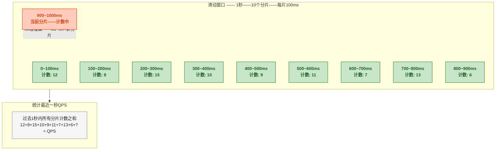
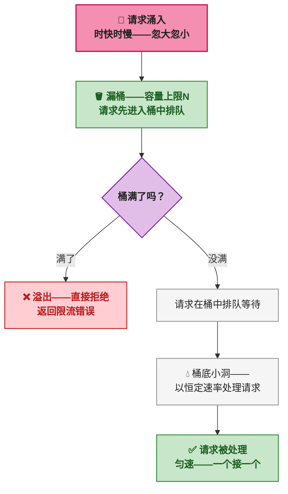
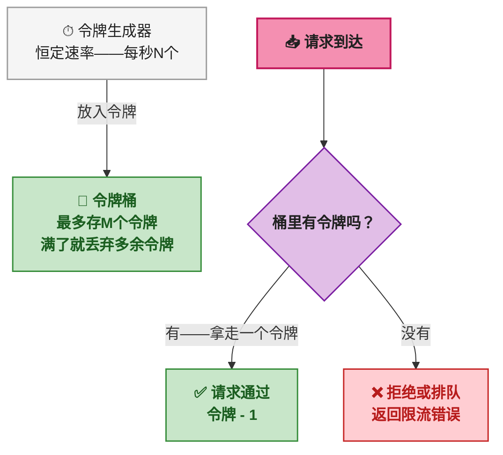
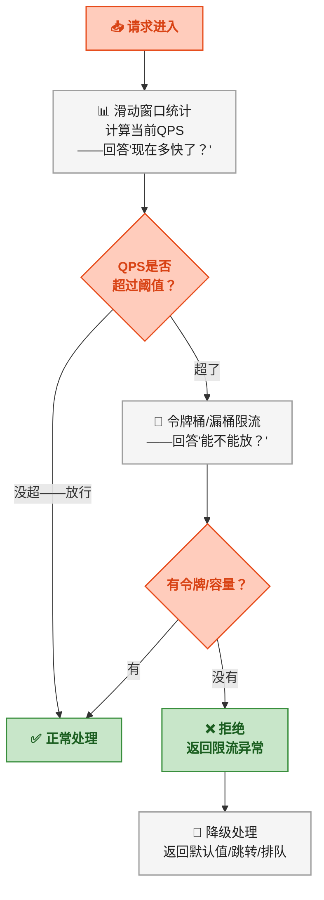
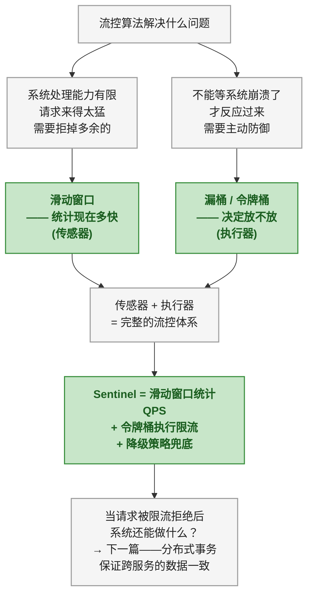

# 流控算法三件套：滑动窗口、漏桶与令牌桶

> 本文是<strong>分布式算法科普系列</strong>第三篇。前两篇讲了服务怎么找到彼此（Distro）和怎么对数据达成一致（Raft）。这一篇换一个角度——找到服务了、数据也一致了，但如果请求来得太快太多，怎么保护系统不被冲垮？

## 一、故事：互联网的拥塞崩溃

1986 年 10 月，互联网历史上发生了一次著名的事故——<strong>拥塞崩溃（Congestion Collapse）</strong>。劳伦斯伯克利实验室和加州大学伯克利分校之间的网络链路，带宽从通常的 32Kbps 骤降到 40bps——没错，不是 40K，是 40，下降了近三个数量级。

原因并不复杂：发送方在拼命重传丢失的数据包，但这些重传又进一步加剧了网络拥堵，导致更多丢包——<strong>恶性循环</strong>。链路上跑的全是重传包，几乎没有有效数据到达对端。

这次事件促使 Van Jacobson 在 1988 年发表了《Congestion Avoidance and Control》，提出了 TCP 拥塞控制的几个核心算法——慢启动、拥塞避免、快速重传。而 TCP 里的<strong>滑动窗口</strong>，正是用来控制"同一时刻最多有多少数据在传输途中"的机制。

<strong>同一个问题，换个场景照样发生。</strong>微服务架构普及后，服务 A 调用服务 B——如果服务 B 处理能力有限，服务 A 还一个劲地往里灌请求，服务 B 的响应会越来越慢，进而拖慢服务 A 的线程池，再拖慢服务 A 的调用方……一路传导，整个系统雪崩。

> 这就是流控要解决的核心问题：<strong>系统处理能力有限，请求来得太猛太快，必须有一个机制把多余的请求挡在外面——宁可拒绝一部分，也不能让整个系统被冲垮。</strong>

---

## 二、前置：固定窗口的"边界作弊"

在讲滑动窗口之前，先看一眼最简单的限流方案——<strong>固定窗口</strong>。理解它的缺陷，才能理解为什么需要滑动窗口。

固定窗口的思路很简单：把时间切成一段一段（比如每秒一段），每段内计数，超过阈值就拒绝。

```
窗口: [0秒 ~ 1秒) → 计数器 = 0 → 请求来了 → 计数器+1 → 计数器≤阈值 → 放行
窗口: [1秒 ~ 2秒) → 计数器归零 → 重新计数
```

<strong>问题出在窗口边界。</strong>假设阈值是每秒 100 个请求。有人在 0.95 秒到 1.05 秒之间发了 150 个请求——0.95 到 1 秒 80 个，1 到 1.05 秒 70 个。两个窗口各自的计数器都没超阈值（80 < 100，70 < 100），但实际上<strong>在 0.95 ~ 1.05 这 0.1 秒内系统实际承受了 150 个请求</strong>。

这就是"边界作弊"——攻击者故意在窗口交界处集中发请求，就能绕过固定窗口的限制。

<strong>滑动窗口正是为了解决这个"边界问题"而设计的。</strong>

---

## 三、滑动窗口——统计最近一段时间内的请求量

### 3.1 核心思路

固定窗口的问题在于<strong>窗口边界是死的</strong>，计数器一到整点就归零。滑动窗口的思路是：<strong>窗口跟着时间一起走，任何时刻都只统计"最近 N 秒"内的请求数</strong>。

用个比方：

> 商场的安保系统想控制场内人数不超过 200 人。固定窗口的做法是——每个整点把计数器清零，重新数。结果就是 11:59 进来 100 人，12:01 又进来 100 人——计数器都没超，但 11:59 到 12:01 这两分钟内场内实际有 200 人，挤得要命。
>
> 滑动窗口的做法是——<strong>任何时刻都在统计"最近一小时内进来的人"</strong>。11:59 进来 100 人，加上 11:30 进来的 80 人，再加上之前零零散散的人——滑动窗口一直在算最近一小时的累计人数。不会因为跨了整点就清零。

### 3.2 滑动窗口的数据结构

滑动窗口在实现上，通常用<strong>时间分片 + 环形数组</strong>来降低成本。

把整个窗口（比如 1 秒）切成多个小分片（比如 10 个，每个 100ms）。用环形数组存每个分片的计数，窗口滑动时只更新当前分片，不用重新遍历所有请求。



> ⚠️ 新手提示：分片越细（比如 100 个 vs 10 个），精度越高，但计算量也越大。Sentinel 默认使用 2 个分片（500ms 一个），这已经足够绝大多数场景使用——对于 QPS 统计来说，毫秒级精度没有太大意义。

### 3.3 滑动窗口解决了什么、没解决什么

<strong>解决的</strong>：消除了固定窗口的"边界作弊"问题。任意时刻的 QPS 统计都基于最近一段时间，而不是基于日历上的整秒。

<strong>没解决的</strong>：滑动窗口只是<strong>统计工具</strong>——它告诉你"目前的 QPS 是多少"，但它不负责"超了怎么办"。那部分工作由漏桶和令牌桶来接手。

---

## 四、漏桶——不管你来多猛，我都匀速处理

### 4.1 核心思路

漏桶算法的灵感来自<strong>一个底部有洞的水桶</strong>：

- 请求像水一样倒进桶里（可以时快时慢、忽大忽小）
- 桶底有一个固定大小的洞——水以<strong>恒定速率</strong>漏出去
- 桶有容量上限——桶满了，多余的水直接溢出（请求被拒绝）

<strong>关键特性：不管进水有多猛，出水永远是匀速的。</strong>这恰好符合后端服务的真实情况——后端处理能力有限，不管前面来了多少请求，只能一个一个（或固定并发数）地慢慢处理。



### 4.2 漏桶的特点

| 特性 | 说明 |
|------|------|
| <strong>强制平滑</strong> | 不管进水速率怎么波动，出水速率恒定 |
| <strong>削峰填谷</strong> | 把突发流量"削"平——转换成匀速处理 |
| <strong>有排队缓冲</strong> | 桶容量提供了有限的缓冲空间——短暂高峰不会被立即拒绝 |
| <strong>无突发能力</strong> | 即使后端此刻有空闲——出水速率也不会变快 |

第四个特性是漏桶<strong>最大的缺点</strong>——系统明明还有余力，漏桶也不会加速处理。它像一条严格的流水线，速度恒定，不加班也不偷懒。有些场景需要"平时稳定，但允许偶尔冲刺一下"——这时候就需要令牌桶。

---

## 五、令牌桶——允许突发，但限制总量的节奏控制器

### 5.1 核心思路

令牌桶和漏桶"长得像但逻辑相反"：

- 有一个<strong>令牌生成器</strong>，以<strong>恒定速率</strong>往桶里放令牌（比如每秒放 100 个）
- 桶有<strong>容量上限</strong>（比如最多存 200 个令牌）
- 每个请求要<strong>从桶里拿走一个令牌</strong>才能被处理
- 拿不到令牌的请求——被拒绝或排队等待

<strong>关键区别：令牌可以攒。</strong>如果一段时间没有请求，令牌会在桶里积累（最多到桶容量上限）。等突发流量来了——桶里攒了 200 个令牌，一口气可以放 200 个请求过去。但平均下来，每秒还是只处理 100 个。



### 5.2 令牌桶的三个关键参数

| 参数 | 含义 | 对行为的影响 |
|------|------|------|
| <strong>令牌生成速率</strong> | 每秒放多少个令牌 | 决定长期平均 QPS 上限 |
| <strong>桶容量（burst）</strong> | 最多能攒多少令牌 | 决定能扛住多大的突发流量 |
| <strong>当前令牌数</strong> | 桶里现在有多少令牌 | 决定此刻还能放多少个请求 |

<strong>令牌生成速率控制平均值，桶容量控制突发峰值。</strong>速率 100/s、桶容量 200——意味着长期来看每秒最多 100 个请求，但短时间内可以承受 200 个请求的突发。

### 5.3 漏桶 vs 令牌桶——一句话区分

> 漏桶是<strong>"出"</strong>被控制——不管来多少，出去的速率是固定的。令牌桶是<strong>"入"</strong>被控制——进来的速率由令牌发放速度决定。

<strong>漏桶消除突发，令牌桶允许受限突发。</strong>哪种更好？看场景：

- 需要严格保护下游、希望流量绝对平滑 → 漏桶
- 下游有一定弹性、希望允许合理突发 → 令牌桶

实际工程中令牌桶用得更多——后端服务通常不是一根筋的固定速率，而是"平时 100 QPS 没问题，偶尔 200 QPS 也能扛一下"。

---

## 六、Sentinel 如何组合使用这三种算法

Sentinel（阿里巴巴开源的流量控制组件）是这三种算法的经典使用者。它在不同层面组合了不同算法：



<strong>滑动窗口负责"感知"</strong>——统计当前的 QPS 是多少。它是一个传感器，不做决策。

<strong>令牌桶/漏桶负责"决策"</strong>——基于统计结果判断要不要放行这个请求。它是执行器。

二者的分工很像汽车的速度表和限速器——速度表（滑动窗口）告诉你开多快，限速器（令牌桶）决定要不要断油。

> ⚠️ 新手提示：Sentinel 的默认模式用的是<strong>滑动窗口统计 + 令牌桶限流</strong>的组合。之所以不用漏桶，是因为漏桶的"绝对匀速"在实际业务场景中太严格了——大多数服务不需要绝对平滑，只需要"别超过某个上限就行"。令牌桶允许攒一点令牌应对突发，更符合业务的弹性需求。

---

## 七、三种算法对比

| 维度 | 滑动窗口 | 漏桶 | 令牌桶 |
|------|:---:|:---:|:---:|
| <strong>要解决的问题</strong> | 统计"最近一段时间来了多少请求" | 强制把突发流量转成匀速 | 限制平均速率——允许合理突发 |
| <strong>核心数据结构</strong> | 环形数组 + 时间分片 | 请求队列——桶容量 | 令牌计数器——桶容量 |
| <strong>是否允许突发</strong> | 不适用（只是统计工具） | 不允许——绝对平滑 | 允许——可以攒令牌 |
| <strong>闲置时的行为</strong> | 统计值自然衰减 | 没有请求——桶变空 | 令牌积累——最多到桶容量 |
| <strong>典型使用者</strong> | Sentinel（QPS 统计） | Nginx（连接限流）、Guava（SmoothBursty 变体） | Sentinel（限流执行）、Guava RateLimiter |
| <strong>一句话总结</strong> | "现在有多快" | "不管多快都按我的节奏走" | "按我的节奏走——但允许你先跑两步" |

---

## 八、总结



<strong>三个算法分工明确——滑动窗口当眼睛（统计），漏桶当阀门（平滑），令牌桶当节奏器（允许突发）。</strong>实际项目中，绝大多数场景用"滑动窗口 + 令牌桶"就足够了——不需要漏桶那种绝对的匀速。除非你的下游服务真的极其脆弱、一点波动都扛不住，才需要漏桶来强制削峰。

下一篇讲分布式事务——当一个请求跨越多个服务，怎么保证数据要么全成功、要么全回滚。

> 📖 <strong>系列导航</strong>：本文是<strong>分布式算法科普系列</strong>第 3 篇。上一篇：[<strong>Raft 协议：选举、日志复制与强一致</strong>]()，讲配置中心为什么需要强一致。下一篇：[<strong>分布式事务：两阶段提交与 TCC</strong>]()，讲 Seata 怎么用两阶段提交和 TCC 保证跨服务的数据一致性。
