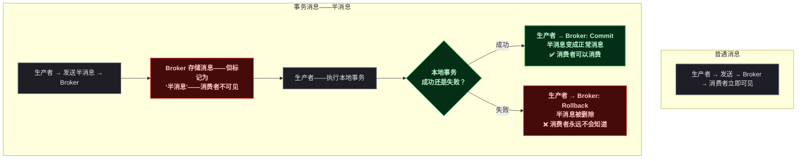
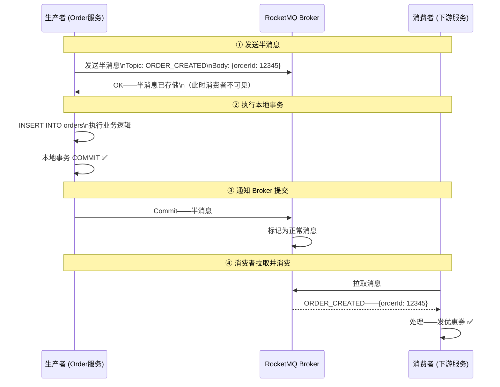
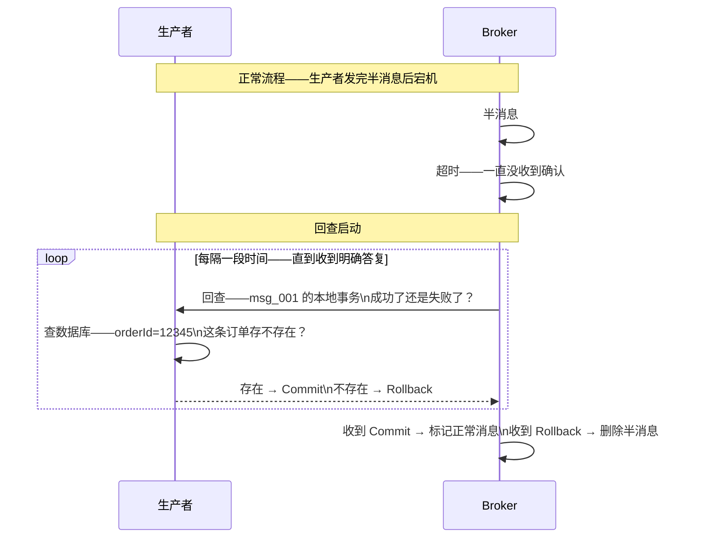
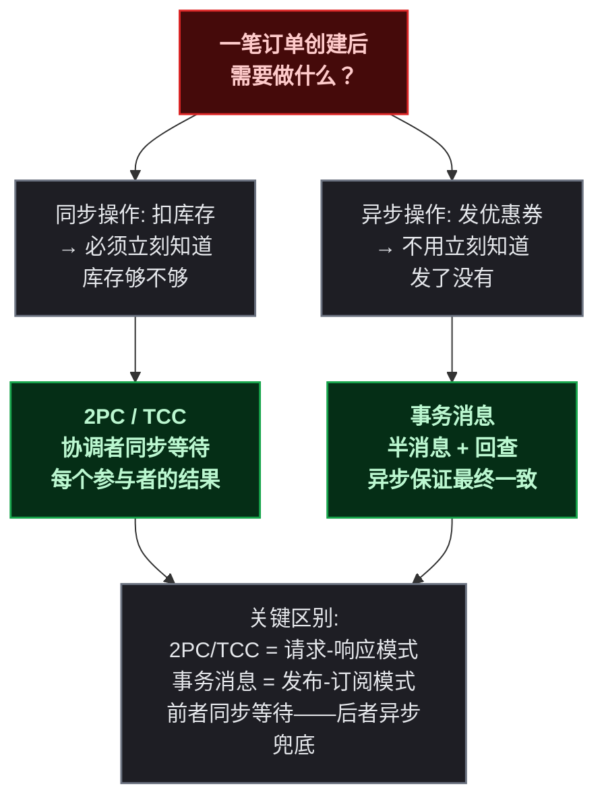
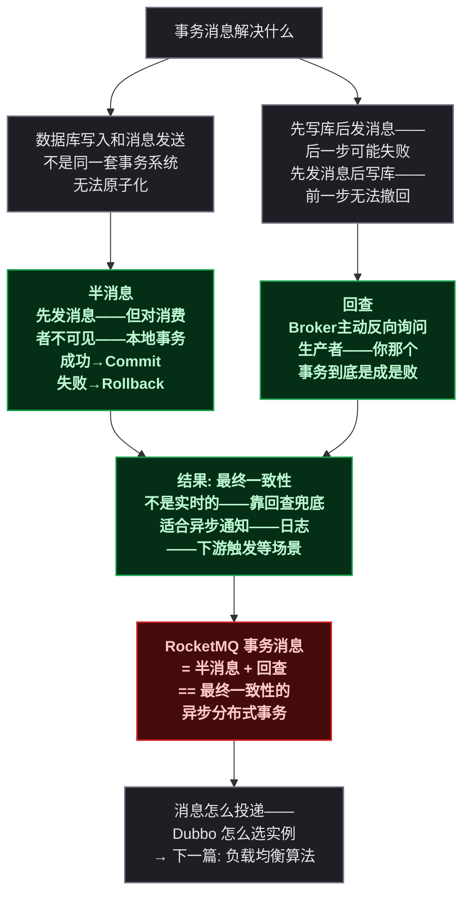

# 事务消息

> 本文是<strong>分布式算法科普系列</strong>第五篇。上一篇讲了 2PC 和 TCC——处理"同步调用"场景下的分布式事务。这一篇换一个跑道——当业务逻辑和消息发送需要原子化，但发消息本身是异步的，怎么保证一致性？

## 一、故事："先写数据库还是先发消息"的终极难题

在消息队列成为微服务通信标配之后，开发者很快撞上了一个死结。<strong>一个极其常见的场景</strong>：订单创建成功 → 需要发一条消息通知下游（发优惠券、发短信、记录日志）。代码看起来人畜无害：

```
// 伪代码——演示问题——不要在生产里这么写
BEGIN TRANSACTION
    INSERT INTO orders (...)
COMMIT
// ↓ 事务已经提交了
mq.send("order_created", order)  // 如果这里执行之前——进程突然挂了？
```

<strong>数据库写入了，消息没发出去——下游永远不知道这笔订单。</strong>

那把发消息放进事务里？

```
BEGIN TRANSACTION
    INSERT INTO orders (...)
    mq.send("order_created", order)  // 消息队列有自己的事务吗？
COMMIT
```

数据库事务和消息队列是两套独立的系统——没有"联合事务"这种东西。数据库的 ROLLBACK 不会撤回已经发到 Broker 的消息。

那反过来——先发消息再写数据库？

```
mq.send("order_created", order)  // 消息发出去了
// ↓ 然后写数据库时——数据库挂了
INSERT INTO orders (...)  // 失败！
```

<strong>消息发出去了，数据库没写入——下游收到消息后来查订单——发现根本没有这笔订单。</strong>

> 写过的都懂——这个"先有鸡还是先有蛋"的问题在异步场景下几乎无解。早期方案是在数据库里建一张"消息发件箱"表（outbox），把消息和业务数据在同一个事务里写入，再用一个独立的进程轮询这张表来真正发送。但这个方案太重了——需要额外的轮询进程、需要处理重复投递、需要清理已发送的消息。

2016 年前后，RocketMQ 的团队给出了一个更优雅的方案——让 Broker 自己承担"协调者"的角色，引入"半消息"和"回查"两个机制，一举解决了这个难题。这就是<strong>事务消息（Transactional Message）</strong>。

---

## 二、前置：同步事务 vs 异步事务

在深入事务消息之前，先理清它和上一篇讲的 2PC/TCC 之间的分工：

| 场景 | 用哪种方案 | 特点 |
|------|------|------|
| <strong>服务 A 同步调用服务 B</strong>——需要 B 的操作和 A 的操作一起成功或回滚 | 2PC / TCC | 同步——A 等 B 的返回结果 |
| <strong>服务 A 发消息给服务 B</strong>——需要消息的发送和 A 的本地事务原子化 | 事务消息 | 异步——A 不关心 B 什么时候消费 |

<strong>2PC/TCC 处理的是"请求-响应"模式下的分布式事务，事务消息处理的是"发布-订阅"模式下的分布式事务。</strong>它们解决的是同一个问题（一致性）的两个不同侧面。

---

## 三、核心机制——半消息（Half Message）

### 3.1 半消息是什么

RocketMQ 事务消息的核心创新在于<strong>消息有了"中间态"</strong>。普通消息发送到 Broker 后立刻对消费者可见——谁都可能抢到并消费。事务消息不一样——它先以"半消息"的身份进入 Broker，<strong>消费者对这个消息完全不可见</strong>。

只有当事务的发起方明确告诉 Broker "提交"之后，这条消息才变成普通消息，消费者才能看到并消费。



> 把半消息理解为<strong>邮局的"挂号信暂存"</strong>——寄信人把信交给邮局，邮局暂时收下但不投递。寄信人确认"这信能寄"——邮局才开始投递。寄信人说"别寄了"——邮局把信销毁。收信人从头到尾不知道有这么一封信存在过——除非寄信人确认了投递。

### 3.2 完整流程——四步走



<strong>如果第 ② 步本地事务失败了</strong>——生产者给 Broker 发 Rollback——Broker 删除半消息——消费者永远收不到。整个流程就像"什么都没发生过"——数据库里没数据，消息队列里也没消息。

---

## 四、兜底机制——事务回查（Checkback）

### 4.1 回查解决什么问题

上面流程中有一个<strong>致命的时间窗口</strong>：生产者在第 ② 步执行完本地事务后、第 ③ 步通知 Broker 之前——如果生产者进程宕机了——半消息会一直"悬"在 Broker 里。消费者永远收不到这条消息，但数据库里数据已经写入了。

<strong>回查机制就是为这个场景兜底的。</strong>Broker 发现半消息长时间没有被 Commit 或 Rollback——主动反向询问生产者："你那个本地事务到底成了没有？"



### 4.2 回查的关键设计

<strong>生产者必须自己实现回查逻辑。</strong>RocketMQ 不知道你的业务——它只能回调你注册的 `checkLocalTransaction()` 方法。这个方法的职责很简单：

```
收到 Broker 的查证请求 →
查数据库——这笔业务数据到底写成功没有 →
成功了 → 返回 COMMIT
没找到 → 返回 ROLLBACK
```

几个关键规则：

<strong>回查可能被调多次。</strong>如果第一次回查时生产者刚好在重启——返回了 UNKNOWN——Broker 过一会儿会再来问一次。所以回查逻辑必须是幂等的——每次都返回相同的结果。

<strong>回查有次数上限。</strong>默认最多回查 15 次——超过之后如果还没得到明确答复——Broker 会自动回滚（删除半消息）。这是为了防止半消息永久"悬"在队列里占用存储。

<strong>回查不是实时触发的。</strong>半消息提交超时（通常几十秒）后 Broker 才启动回查。所以事务消息不是毫秒级的实时保证——它保证的是<strong>最终一致性</strong>。

---

## 五、事务消息 vs 2PC/TCC——什么时候用哪个



| 维度 | 2PC / TCC | 事务消息 |
|------|:---:|:---:|
| <strong>通信模式</strong> | 同步——调用方等返回 | 异步——生产者和消费者不直接交互 |
| <strong>一致性时间</strong> | 实时——二阶段完成后数据一致 | 最终一致——依赖回查兜底 |
| <strong>对下游的侵入性</strong> | 高——下游必须实现 Prepare/Commit/Rollback 或 Try/Confirm/Cancel | 低——下游只是普通消费者 |
| <strong>适用场景</strong> | 扣库存、转账——需要立刻知道结果 | 发通知、记录日志、触发异步流程 |
| <strong>实现复杂度</strong> | 高——需要协调者、参与者协议 | 中——只需实现回查逻辑 |

> ⚠️ 新手提示：很多场景下两种方案会<strong>同时出现</strong>。比如下单流程——先走 2PC/TCC 扣库存（同步——必须当场知道库存够不够）——成功后再发事务消息触发发优惠券（异步——晚几秒甚至几分钟都行）。不同的步骤、不同的保证方式——搭起来用。

---

## 六、哪些中间件用了事务消息

| 中间件 | 实现方式 | 特点 |
|------|------|------|
| <strong>RocketMQ</strong> | 半消息 + Broker 回查 | 原生支持——业界最早、最成熟的事务消息实现 |
| <strong>Apache Pulsar</strong> | Transaction API | 2019 年加入——支持跨 Topic 的事务发送 |
| <strong>RabbitMQ</strong> | 无原生支持——需配合发件箱模式 | 通过数据库 + 轮询进程实现——比较重 |
| <strong>Kafka</strong> | 仅支持幂等写入——不支持事务消息 | 可以通过 Kafka Streams + exactly-once 语义变相实现——但不是同一回事 |

<strong>RocketMQ 是目前实现事务消息最成熟的消息中间件之一。</strong>这个特性也是它当初在设计时重点考虑的场景——阿里巴巴内部的电商交易、金融转账等场景对"数据库写入和消息发送的原子化"有极强的需求。

---

## 七、总结



<strong>一句话记住事务消息：先把消息"存"进 Broker 但不让任何人看到——办完事再决定是公开还是销毁——办事中途宕机了 Broker 主动来问结果。</strong>它和 2PC/TCC 不是替代关系——一个处理同步调用、一个处理异步消息，同一个分布式事务难题的两条不同赛道。

下一篇讲 Dubbo 的负载均衡算法——请求好不容易发出来了，该打到哪个服务实例上？

> 📖 <strong>系列导航</strong>：本文是<strong>分布式算法科普系列</strong>第 5 篇。上一篇：[<strong>分布式事务：两阶段提交与 TCC</strong>]()，讲同步调用场景下的分布式事务。下一篇：[<strong>负载均衡三剑客：加权随机、最少活跃与一致性哈希</strong>]()，讲 Dubbo 怎么用负载均衡算法决定请求打到哪台机器。
