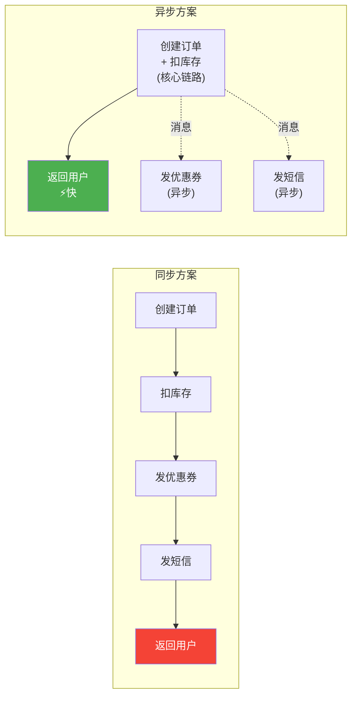
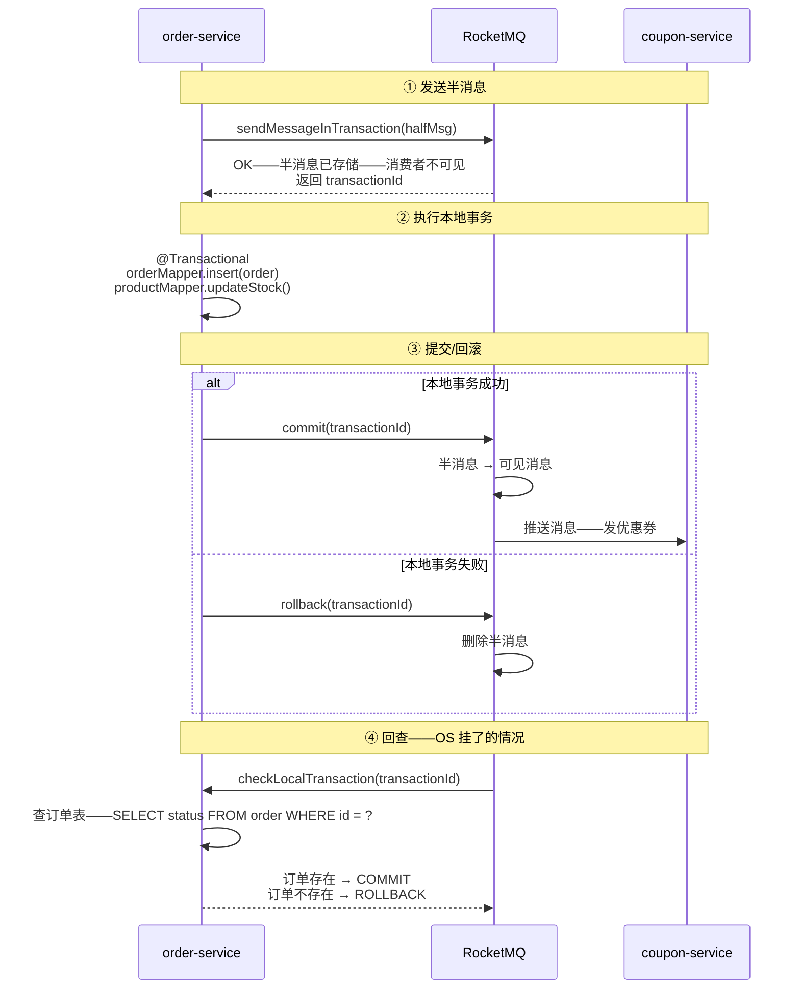
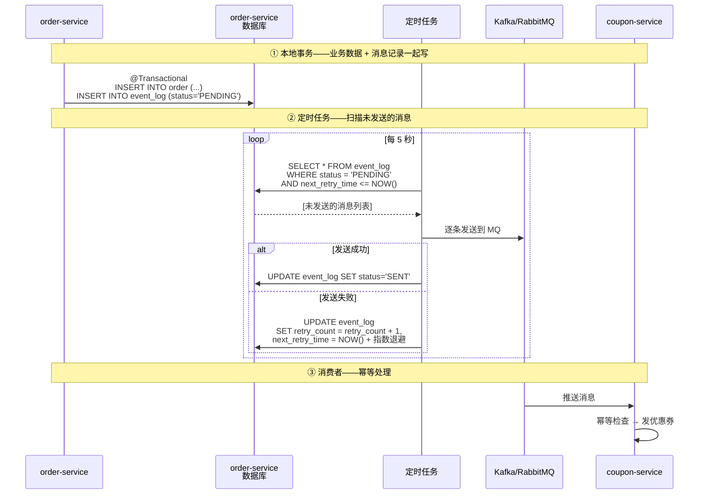

# 事务消息 + 本地消息表

> 📖 <strong>前置阅读</strong>：本文是分布式事务系列的第四篇——假设你已经理解了 CAP/BASE 理论、Seata AT 的 undo_log 机制、TCC 的 Try/Confirm/Cancel 三阶段和 Saga 的补偿链。如果这些概念还陌生——先读 [分布式事务本质——CAP、BASE 与四大方案]()、[Seata AT 模式——undo_log 与二阶段原理]() 和 [TCC + Saga——补偿型分布式事务]()。

## 一、⚡ 同步方案的瓶颈——为什么还需要异步方案

先回顾前面三篇文章我们做了什么：

```
Seata AT：下单 → 扣库存 → 扣余额——三个操作在一个 @GlobalTransactional 中——同步执行
TCC：Try 预留 → Confirm 确认 → Cancel 回滚——三个阶段——同步执行
Saga：正向执行 → 失败逆补偿——协调者串联——同步执行
```

它们有一个共同特征：<strong>调用方要等所有分支都执行完——才返回结果</strong>。

```
order-service 调用 product-service 扣库存：
  → 发起 RPC 调用
  → 等待 product-service 处理
  → 等待 product-service 返回结果
  → 拿到结果——继续下一步

如果 product-service 很慢——比如库存要查 3 个 Redis + 2 个 DB：
  → order-service 的线程就等着
  → 线程池撑爆
  → 整个链路超时
```

<strong>同步方案的根本矛盾：事务参与方的响应时间——直接影响调用方的吞吐量。</strong>

现实场景中——很多操作其实不需要同步等待：

```
下单后"发短信通知用户"——用户不需要在下单页面上等短信发完
下单后"赠送积分"——积分晚 5 分钟到账——用户根本感知不到
下单后"发优惠券"——优惠券晚 30 秒到——用户不会投诉
```

<strong>异步分布式事务的本质：把非关键路径的操作——从同步链路中剥离出来——通过消息异步执行——用最终一致性保证数据正确。</strong>



但异步引入了一个新问题：<strong>怎么保证"消息一定发出去"？怎么保证"消息发出去了——消费一定成功"？</strong>

这就是事务消息和本地消息表要解决的问题。

## 二、🧩 事务消息的本质——RocketMQ 半消息 + 回查

### 2.1 普通消息的致命缺陷

```
order-service 的代码：

@Transactional
public void createOrder(CreateOrderRequest request) {
    // ① 创建订单——写数据库
    orderMapper.insert(order);

    // ② 发消息——通知优惠券服务发券
    rocketMQTemplate.send("coupon-topic", new CouponMessage(order));

    // 问题来了：如果 ② 发消息成功——但 ① 的事务回滚了——
    // 优惠券发出去了——但订单没创建——用户白得一张券
}
```

```
换个顺序——先发消息再写库：

@Transactional
public void createOrder(CreateOrderRequest request) {
    // ① 发消息
    rocketMQTemplate.send("coupon-topic", new CouponMessage(order));

    // ② 创建订单——写数据库
    orderMapper.insert(order);

    // 问题反过来：① 消息发出去了——② 事务回滚——
    // 优惠券发出去了——订单没创建——同样的问题
}
```

<strong>普通的 send + @Transactional 无法保证"本地事务"和"消息发送"的原子性——消息发了事务可能回滚——事务提交了消息可能没发。</strong>

### 2.2 半消息（Half Message）——先占位——后确认

RocketMQ 事务消息的核心思路：<strong>把消息发送拆成两步——先发一个"半消息"（消费者不可见）——等本地事务提交了——再发"确认"——消息才对消费者可见。</strong>

```
事务消息的完整生命周期：

① 发送半消息（Half Message）
   order-service → RocketMQ："我要发一条消息——但先别让消费者看到"
   RocketMQ → order-service："好的——半消息已保存——给你一个事务 ID"

② 执行本地事务
   order-service 执行 @Transactional 方法——创建订单——扣库存

③ 根据本地事务结果——决定半消息的命运
   成功 → 发 Commit → RocketMQ 将半消息标记为"可见"——消费者能消费了
   失败 → 发 Rollback → RocketMQ 删除半消息——消费者永远看不到

④ 回查（Check）——兜底机制
   如果 order-service 在 ③ 之前挂了——RocketMQ 不知道要 Commit 还是 Rollback
   → RocketMQ 定期回调 order-service 的 check 接口："这条半消息——你本地事务到底成了没？"
   → order-service 查数据库——返回事务状态
```



> ⚠️ <strong>新手提示</strong>：半消息不是"发到消费者队列但标记为不可见"——它存在一个独立的半消息主题（RMQ_SYS_TRANS_HALF_TOPIC）中——消费者根本订阅不到。只有 Commit 后——消息才从半消息主题移到真正的业务主题。

### 2.3 代码实现——完整的事务消息发送

<strong>第一步：RocketMQ 环境搭建（Docker Compose）</strong>

```yaml
# docker-compose-rocketmq.yml
version: '3.8'
services:
  namesrv:
    image: apache/rocketmq:5.1.0
    container_name: rmq-namesrv
    ports:
      - "9876:9876"
    command: sh mqnamesrv
    environment:
      - JAVA_OPT_EXT=-Xms512m -Xmx512m -Xmn256m

  broker:
    image: apache/rocketmq:5.1.0
    container_name: rmq-broker
    ports:
      - "10909:10909"
      - "10911:10911"
    command: sh mqbroker -n namesrv:9876
    environment:
      - JAVA_OPT_EXT=-Xms1g -Xmx1g -Xmn512m
      - NAMESRV_ADDR=namesrv:9876
    depends_on:
      - namesrv

  dashboard:
    image: apacherocketmq/rocketmq-dashboard:latest
    container_name: rmq-dashboard
    ports:
      - "8080:8080"
    environment:
      - JAVA_OPTS=-Drocketmq.namesrv.addr=namesrv:9876
    depends_on:
      - namesrv
      - broker
```

```bash
# 验证搭建
# 启动
docker-compose -f docker-compose-rocketmq.yml up -d

# 验证 NameServer
curl http://localhost:9876

# 验证 Broker
docker logs rmq-broker | grep "boot success"

# 验证 Dashboard
# 浏览器打开 http://localhost:8080
```

<strong>第二步：创建 Topic</strong>

```java
// 在启动类中创建事务消息 Topic
@Configuration
public class RocketMQConfig {

    @Bean
    public TransactionMQProducer transactionMQProducer() throws Exception {
        TransactionMQProducer producer = new TransactionMQProducer("order-producer-group");
        producer.setNamesrvAddr("localhost:9876");

        // 设置线程池——处理回查
        ExecutorService checkExecutor = new ThreadPoolExecutor(
            2, 5, 100, TimeUnit.SECONDS,
            new ArrayBlockingQueue<>(2000),
            new ThreadFactoryBuilder().setNameFormat("check-thread-%d").build()
        );
        producer.setExecutorService(checkExecutor);

        // 注册事务监听器——关键
        producer.setTransactionListener(new OrderTransactionListener());

        producer.start();
        return producer;
    }
}
```

<strong>第三步：事务监听器——本地事务执行 + 回查</strong>

```java
@Slf4j
@Component
public class OrderTransactionListener implements TransactionListener {

    @Autowired
    private OrderMapper orderMapper;

    /**
     * executeLocalTransaction：执行本地事务——半消息发送成功后回调
     * RocketMQ 根据返回值决定 Commit 还是 Rollback
     */
    @Override
    public LocalTransactionState executeLocalTransaction(Message msg, Object arg) {
        CreateOrderRequest request = (CreateOrderRequest) arg;

        try {
            // 执行本地事务——创建订单 + 扣库存——在同一个 @Transactional 中
            orderService.createOrderAndDeductStock(request);

            // 本地事务成功 → 告诉 RocketMQ 提交半消息
            log.info("本地事务执行成功——提交半消息——orderId={}", request.getOrderId());
            return LocalTransactionState.COMMIT_MESSAGE;

        } catch (Exception e) {
            log.error("本地事务执行失败——回滚半消息——orderId={}", request.getOrderId(), e);
            return LocalTransactionState.ROLLBACK_MESSAGE;
        }
    }

    /**
     * checkLocalTransaction：回查——RocketMQ 定期回调
     * 当 executeLocalTransaction 没有返回（进程挂了、网络超时）——RocketMQ 调用这个方法
     * 去数据库里查——这条订单到底有没有创建成功
     */
    @Override
    public LocalTransactionState checkLocalTransaction(MessageExt msg) {
        // 从消息体取出 orderId
        String orderId = new String(msg.getBody(), StandardCharsets.UTF_8);

        // 去数据库查——订单是否存在
        Order order = orderMapper.selectById(orderId);

        if (order != null) {
            log.info("回查——订单存在——提交半消息——orderId={}", orderId);
            return LocalTransactionState.COMMIT_MESSAGE;
        } else {
            log.info("回查——订单不存在——回滚半消息——orderId={}", orderId);
            return LocalTransactionState.ROLLBACK_MESSAGE;
        }
    }
}
```

<strong>第四步：发送事务消息——封装成一个 Service</strong>

```java
@Service
@Slf4j
public class OrderMessageService {

    @Autowired
    private TransactionMQProducer transactionMQProducer;

    /**
     * 发送事务消息——创建订单后——通知下游服务
     */
    public void sendOrderCreatedMessage(CreateOrderRequest request) {
        // 构造消息体——把需要的信息塞进去
        OrderMessageBody body = OrderMessageBody.builder()
            .orderId(request.getOrderId())
            .userId(request.getUserId())
            .totalAmount(request.getTotalAmount())
            .timestamp(System.currentTimeMillis())
            .build();

        Message message = new Message();
        message.setTopic("order-created-topic");
        message.setTags("create");                    // 标签——消费者可以按 tag 过滤
        message.setKeys(request.getOrderId());        // key——用于消息去重和查询
        message.setBody(JSON.toJSONBytes(body));

        // sendMessageInTransaction：发送半消息 + 执行本地事务
        // 第三个参数 arg——会传给 executeLocalTransaction 的 arg 参数
        TransactionSendResult result = transactionMQProducer
            .sendMessageInTransaction(message, request);

        log.info("事务消息发送结果——orderId={}——result={}",
            request.getOrderId(), result.getSendStatus());
    }
}
```

<strong>第五步：在业务入口处调用</strong>

```java
@RestController
@RequestMapping("/order")
public class OrderController {

    @Autowired
    private OrderMessageService orderMessageService;

    @PostMapping("/create")
    public Result<String> createOrder(@RequestBody CreateOrderRequest request) {
        request.setOrderId(UUID.randomUUID().toString().replace("-", ""));

        // 发事务消息——内部会执行本地事务（创建订单+扣库存）
        // 不用 @GlobalTransactional——不用 Seata——
        // RocketMQ 事务消息自己保证"本地事务"和"消息发送"的原子性
        orderMessageService.sendOrderCreatedMessage(request);

        return Result.success(request.getOrderId());
    }
}
```

### 2.4 事务消息的回查机制——三个关键参数

```
RocketMQ 回查的三个关键配置：

① transactionTimeout（默认 6 秒）
  → 半消息发出去后——如果 executeLocalTransaction 超过 6 秒没返回
  → RocketMQ 认为本地事务状态未知——触发回查

② transactionCheckMax（默认 15 次）
  → 一条半消息最多回查 15 次
  → 15 次后还没确定——半消息被删除——日志告警

③ transactionCheckInterval（默认 60 秒）
  → 第一次回查在半消息发送 60 秒后
  → 后续回查间隔逐次递增——60s → 120s → 180s → ...
```

```java
// 调整回查参数
@Bean
public TransactionMQProducer transactionMQProducer() throws Exception {
    TransactionMQProducer producer = new TransactionMQProducer("order-producer-group");
    producer.setNamesrvAddr("localhost:9876");

    // 本地事务执行超时时间（毫秒）——超过这个时间没返回就回查
    producer.setSendMsgTimeout(10000);

    // 回查最多 10 次
    producer.setTransactionCheckMax(10);

    producer.start();
    return producer;
}
```

> ⚠️ <strong>新手提示</strong>：回查回调的 checkLocalTransaction 方法——必须能通过消息体中的信息查到本地事务的状态。所以消息体里一定要包含业务标识（如 orderId）——并且去数据库查——不要依赖内存中的状态——因为回查可能发生在另一台机器上。

### 2.5 消费者——幂等消费

```java
@Service
@Slf4j
@RocketMQMessageListener(
    topic = "order-created-topic",
    consumerGroup = "coupon-service-group",
    selectorExpression = "create"          // 只消费 tag=create 的消息
)
public class CouponMessageConsumer implements RocketMQListener<OrderMessageBody> {

    @Autowired
    private CouponService couponService;

    @Override
    public void onMessage(OrderMessageBody body) {
        log.info("收到订单创建消息——orderId={}", body.getOrderId());

        try {
            // 幂等——发优惠券之前——先查有没有发过
            if (couponService.alreadyIssued(body.getOrderId())) {
                log.info("优惠券已发——跳过——orderId={}", body.getOrderId());
                return;
            }

            couponService.issueCoupon(body.getOrderId(), body.getUserId());

        } catch (Exception e) {
            log.error("发优惠券失败——orderId={}", body.getOrderId(), e);
            // 抛出异常——RocketMQ 会重试——默认重试 16 次
            throw new RuntimeException("发优惠券失败——等待重试", e);
        }
    }
}
```

## 三、📦 本地消息表——没有 RocketMQ 也能做事务消息

不是所有团队都用 RocketMQ。Kafka、RabbitMQ 甚至 Redis List 当消息队列的场景——没有"事务消息"这个特性——怎么保证本地事务和消息发送的原子性？

<strong>答案：本地消息表——在业务数据库中建一张消息表——利用数据库本地事务——保证"业务数据"和"消息记录"同时写入。</strong>

### 3.1 核心原理

```
关键 insight：同一个数据库的事务是原子的——不需要分布式事务

在 order-service 的数据库中：
  order 表     ← 订单数据
  event_log 表 ← 消息记录

在同一个 @Transactional 中：
  → INSERT INTO order (...)
  → INSERT INTO event_log (event_type, event_body, status='PENDING')

这两个 INSERT 在同一个 DB 事务中——要么都成功——要么都失败
→ 不需要分布式事务——本地 DB 事务就保证了原子性
→ 只要 event_log 里有记录——就说明订单一定创建成功了
→ 只要订单创建成功——event_log 里一定有记录
```



### 3.2 表结构设计

```sql
-- 本地消息表
CREATE TABLE event_log (
    id              BIGINT AUTO_INCREMENT PRIMARY KEY,
    event_type      VARCHAR(64)    NOT NULL COMMENT '事件类型——如 ORDER_CREATED',
    event_body      TEXT           NOT NULL COMMENT '事件体——JSON 格式',
    status          VARCHAR(16)    NOT NULL DEFAULT 'PENDING'
                        COMMENT '状态：PENDING-待发送 / SENT-已发送 / FAILED-发送失败 / DEAD-死信',
    retry_count     INT            NOT NULL DEFAULT 0   COMMENT '已重试次数',
    max_retry       INT            NOT NULL DEFAULT 10  COMMENT '最大重试次数',
    next_retry_time DATETIME       NOT NULL DEFAULT CURRENT_TIMESTAMP COMMENT '下次重试时间',
    create_time     DATETIME       NOT NULL DEFAULT CURRENT_TIMESTAMP,
    update_time     DATETIME       NOT NULL DEFAULT CURRENT_TIMESTAMP ON UPDATE CURRENT_TIMESTAMP,

    INDEX idx_status_next_retry (status, next_retry_time)
) ENGINE=InnoDB DEFAULT CHARSET=utf8mb4 COMMENT='本地消息表——保证业务数据与消息原子性';
```

### 3.3 生产者——写业务数据 + 写消息记录——同一个事务

```java
@Service
public class OrderServiceWithEventLog {

    @Autowired
    private OrderMapper orderMapper;

    @Autowired
    private EventLogMapper eventLogMapper;

    /**
     * 关键：业务操作和消息记录——在同一个 @Transactional 中
     * 同一个数据库——同一个事务——保证原子性
     */
    @Transactional
    public void createOrder(CreateOrderRequest request) {
        // ① 写业务数据
        Order order = Order.from(request);
        orderMapper.insert(order);

        // ② 写消息记录——同一个事务——原子写入
        EventLog eventLog = EventLog.builder()
            .eventType("ORDER_CREATED")
            .eventBody(JSON.toJSONString(OrderMessageBody.from(order)))
            .status("PENDING")
            .nextRetryTime(new Date())
            .build();
        eventLogMapper.insert(eventLog);

        // ③ 事务提交——两个 INSERT 一起生效
        // 不需要等消息发送——不需要等消费者处理——直接返回
    }
}
```

### 3.4 定时任务——扫描 + 发送 + 重试

```java
@Component
@Slf4j
public class EventLogPublishJob {

    @Autowired
    private EventLogMapper eventLogMapper;

    @Autowired
    private KafkaTemplate<String, String> kafkaTemplate;

    /**
     * 每 5 秒扫描一次——发送待处理的消息
     */
    @Scheduled(fixedDelay = 5000)
    public void publishPendingEvents() {
        // 一次取 100 条——处理完再取下一批
        List<EventLog> pendingEvents = eventLogMapper
            .selectPendingEvents(100);

        for (EventLog event : pendingEvents) {
            try {
                // 发送到 MQ
                kafkaTemplate.send(
                    event.getEventType(),         // topic = 事件类型
                    event.getId().toString(),      // key = eventLog id（用于分区有序）
                    event.getEventBody()           // value = 事件体
                ).get(3, TimeUnit.SECONDS);        // 同步等待——确保发送成功

                // 发送成功——更新状态
                eventLogMapper.updateStatus(event.getId(), "SENT");

            } catch (Exception e) {
                log.error("消息发送失败——eventId={}——retryCount={}",
                    event.getId(), event.getRetryCount(), e);

                // 计算下次重试时间——指数退避
                Date nextRetryTime = computeNextRetryTime(event.getRetryCount());

                // 如果超过最大重试次数——标记为死信
                if (event.getRetryCount() >= event.getMaxRetry()) {
                    eventLogMapper.updateStatus(event.getId(), "DEAD");
                    log.error("消息进入死信队列——eventId={}——需要人工处理", event.getId());
                } else {
                    eventLogMapper.incrementRetryAndUpdateNextTime(
                        event.getId(), nextRetryTime);
                }
            }
        }
    }

    /**
     * 指数退避：10s → 20s → 40s → 80s → 160s → 320s → 600s（封顶 10 分钟）
     */
    private Date computeNextRetryTime(int retryCount) {
        long delaySeconds = Math.min((long) Math.pow(2, retryCount) * 10, 600);
        return new Date(System.currentTimeMillis() + delaySeconds * 1000);
    }
}
```

### 3.5 事务消息 vs 本地消息表——选型对比

| 维度 | RocketMQ 事务消息 | 本地消息表 |
|------|:---:|:---:|
| <strong>实现复杂度</strong> | 低——RocketMQ 原生支持 | 中——需要自己写定时任务 |
| <strong>消息实时性</strong> | 高——事务提交后立即投递 | 中——依赖定时任务间隔（一般 5~10s） |
| <strong>依赖</strong> | RocketMQ | 任何 MQ——甚至没有 MQ 也能用 |
| <strong>DB 压力</strong> | 无额外压力 | 定时任务扫描——有一定压力 |
| <strong>适用场景</strong> | 团队已有 RocketMQ | 团队用 Kafka/RabbitMQ——或不想引入新组件 |
| <strong>运维复杂度</strong> | RocketMQ 集群运维 | 只需一张表 + 定时任务——运维极简 |

> 📖 <strong>前置知识提示</strong>：如果你对 Kafka 的生产者/消费者配置不熟悉——建议先了解 Kafka 的 `acks=all`（保证消息不丢）、`enable.idempotence=true`（生产者幂等）、和消费者 offset 提交机制。这些是本地消息表方案的基础。

## 四、🔑 幂等消费——所有异步方案的基石

不管是 RocketMQ 事务消息还是本地消息表——消费者可能收到重复消息：

```
RocketMQ 的 at-least-once 语义：
  → 消费者处理完消息——还没来得及提交 offset——进程挂了
  → 消费者重启——RocketMQ 重新投递同一条消息
  → 消费者又处理了一次

本地消息表的定时任务：
  → 定时任务发送了消息——但更新 status='SENT' 时数据库连接超时
  → 下次定时任务扫描——又扫到这条——又发了一次
```

<strong>消费者必须幂等——同一条消息处理 N 次——结果和处理 1 次一样。</strong>

### 4.1 方案一：唯一索引——最简单——最可靠

```sql
-- 优惠券发放记录表——建唯一索引
CREATE TABLE coupon_record (
    id          BIGINT AUTO_INCREMENT PRIMARY KEY,
    order_id    VARCHAR(32) NOT NULL,
    user_id     VARCHAR(32) NOT NULL,
    coupon_id   VARCHAR(32) NOT NULL,
    create_time DATETIME    NOT NULL DEFAULT CURRENT_TIMESTAMP,

    UNIQUE KEY uk_order_id (order_id)    -- 一个订单只发一次券
);
```

```java
@Service
public class CouponService {

    @Autowired
    private CouponRecordMapper couponRecordMapper;

    /**
     * 发优惠券——依赖唯一索引做幂等
     */
    @Transactional
    public void issueCoupon(String orderId, String userId) {
        // 直接 INSERT——如果 orderId 已存在——抛 DuplicateKeyException
        try {
            Coupon coupon = selectCoupon(userId);
            CouponRecord record = CouponRecord.builder()
                .orderId(orderId)
                .userId(userId)
                .couponId(coupon.getId())
                .build();

            couponRecordMapper.insert(record);  // 唯一索引保证幂等

        } catch (DuplicateKeyException e) {
            // 已经发过了——直接返回——幂等
            log.info("优惠券已发放——跳过——orderId={}", orderId);
        }
    }
}
```

<strong>优点：完全依赖数据库唯一索引——不需要额外组件——不会出现"幂等检查"和"业务写入"之间的竞态。</strong>

<strong>缺点：只能用于"INSERT 一条记录"的场景——如果消费逻辑是 UPDATE——唯一索引帮不上忙。</strong>

### 4.2 方案二：Redis + SETNX——适合高并发

```java
@Service
public class CouponService {

    @Autowired
    private StringRedisTemplate redisTemplate;

    /**
     * 用 Redis SETNX 做幂等——适合超高并发的场景
     */
    @Transactional
    public void issueCoupon(String orderId, String userId) {
        // SETNX：key 不存在才设置——返回 true——表示第一次处理
        // key 已存在——返回 false——重复消息——跳过
        String lockKey = "coupon:issued:" + orderId;
        Boolean firstTime = redisTemplate.opsForValue()
            .setIfAbsent(lockKey, "1", Duration.ofDays(7));  // 7 天过期——防止 key 撑爆 Redis

        if (Boolean.FALSE.equals(firstTime)) {
            log.info("优惠券已发放（Redis 幂等）——跳过——orderId={}", orderId);
            return;
        }

        // 第一次处理——发优惠券
        Coupon coupon = selectCoupon(userId);
        couponRecordMapper.insert(CouponRecord.builder()
            .orderId(orderId)
            .userId(userId)
            .couponId(coupon.getId())
            .build());
    }
}
```

<strong>优点：Redis 性能极高——适合 QPS 极高的场景。</strong>

<strong>缺点：Redis 和 DB 之间没有事务——SETNX 成功但 DB INSERT 失败——后续重试会被 SETNX 拦截——导致消息丢失。</strong>解决方案：失败时手动删除 Redis key——让下次重试能进来。

### 4.3 方案三：版本号——适合 UPDATE 场景

```java
/**
 * 场景：消费消息——更新订单状态为"已支付"
 * 问题：不能 INSERT——更新操作如何幂等？
 * 答案：用版本号 / 状态机——只有"未支付"才能变成"已支付"
 */
@Transactional
public void markOrderPaid(String orderId) {
    // UPDATE 带条件——已经"已支付"的订单——WHERE 条件不匹配——影响行数 = 0
    int rows = orderMapper.updateStatus(
        orderId,
        "UNPAID",       // 期望当前状态——乐观锁
        "PAID"          // 目标状态
    );

    if (rows == 0) {
        // 订单不存在——或已经"已支付"——幂等——跳过
        log.info("订单已支付或不存在——跳过——orderId={}", orderId);
    }
}
```

```xml
<!-- MyBatis Mapper -->
<update id="updateStatus">
    UPDATE orders
    SET status = #{newStatus}, update_time = NOW()
    WHERE id = #{orderId}
      AND status = #{expectedStatus}     -- 关键：只有当前状态是 UNPAID 才更新
</update>
```

### 4.4 幂等总结——选型建议

| 场景 | 推荐方案 | 原因 |
|------|------|------|
| 消费逻辑是 INSERT 一条记录 | 唯一索引 | 最简单——最可靠——数据库原生保证 |
| QPS 极高——唯一索引有压力 | Redis SETNX | Redis 扛读——DB 只写一次 |
| 消费逻辑是 UPDATE | 版本号 / 状态机 | WHERE 条件天然幂等 |
| 消费逻辑复杂——多种操作 | 唯一索引 + 状态机组合 | 幂等记录表 + 业务状态判断 |

## 五、🏗️ 搭建教程——事务消息全链路实战

<strong>完整架构：order-service（生产者）→ RocketMQ 事务消息 → coupon-service（消费者）</strong>

### 5.1 环境准备——Docker Compose 一键启动

```yaml
# docker-compose-full.yml —— 完整环境
version: '3.8'
services:
  # ============ RocketMQ ============
  namesrv:
    image: apache/rocketmq:5.1.0
    container_name: rmq-namesrv
    ports:
      - "9876:9876"
    command: sh mqnamesrv
    environment:
      - JAVA_OPT_EXT=-Xms512m -Xmx512m

  broker:
    image: apache/rocketmq:5.1.0
    container_name: rmq-broker
    ports:
      - "10909:10909"
      - "10911:10911"
    command: sh mqbroker -n namesrv:9876 -c /home/rocketmq/conf/broker.conf
    volumes:
      - ./broker.conf:/home/rocketmq/conf/broker.conf
    environment:
      - JAVA_OPT_EXT=-Xms1g -Xmx1g
    depends_on:
      - namesrv

  dashboard:
    image: apacherocketmq/rocketmq-dashboard:latest
    container_name: rmq-dashboard
    ports:
      - "8080:8080"
    environment:
      - JAVA_OPTS=-Drocketmq.namesrv.addr=namesrv:9876
    depends_on:
      - broker

  # ============ 数据库 ============
  mysql-order:
    image: mysql:8.0
    container_name: mysql-order
    ports:
      - "3307:3306"
    environment:
      MYSQL_ROOT_PASSWORD: root123
      MYSQL_DATABASE: order_db
    volumes:
      - ./sql/order-db.sql:/docker-entrypoint-initdb.d/init.sql

  mysql-coupon:
    image: mysql:8.0
    container_name: mysql-coupon
    ports:
      - "3308:3306"
    environment:
      MYSQL_ROOT_PASSWORD: root123
      MYSQL_DATABASE: coupon_db
    volumes:
      - ./sql/coupon-db.sql:/docker-entrypoint-initdb.d/init.sql
```

```properties
# broker.conf —— Broker 配置
brokerIP1=192.168.1.100       # 改成你的物理机 IP——否则 Docker 内网 IP 消费者连不上
listenPort=10911
namesrvAddr=namesrv:9876
transactionCheckInterval=60000     # 回查间隔 60 秒
transactionCheckMax=15             # 最多回查 15 次
transactionTimeout=6000            # 半消息超时 6 秒
```

### 5.2 order-service——事务消息生产者

<strong>Maven 依赖</strong>

```xml
<!-- RocketMQ Spring Boot Starter -->
<dependency>
    <groupId>org.apache.rocketmq</groupId>
    <artifactId>rocketmq-spring-boot-starter</artifactId>
    <version>2.2.3</version>
</dependency>
```

<strong>application.yml</strong>

```yaml
rocketmq:
  name-server: localhost:9876
  producer:
    group: order-producer-group
    send-message-timeout: 10000
```

<strong>完整发送代码</strong>

```java
@Service
@Slf4j
public class OrderTransactionalService {

    @Autowired
    private OrderMapper orderMapper;

    @Autowired
    private EventLogMapper eventLogMapper;

    @Autowired
    private RocketMQTemplate rocketMQTemplate;

    /**
     * 创建订单 + 发送事务消息——完整流程
     *
     * 注意：这个方法在 TransactionListener.executeLocalTransaction 中被调用
     * 它的返回值决定半消息是 Commit 还是 Rollback
     */
    @Transactional  // 本地事务——订单 + 事件记录
    public void createOrderWithEvent(CreateOrderRequest request) {
        // ① 创建订单
        Order order = Order.from(request);
        orderMapper.insert(order);

        // ② 写入本地消息表——同一个事务——原子写入
        // 注意：这里用的是 本地消息表+RocketMQ事务消息 的组合方案
        // 事务消息保证"本地事务提交后消息才投递"
        // 本地消息表保证"出了意外——定时任务兜底"
        OrderMessageBody body = OrderMessageBody.from(order);
        EventLog eventLog = EventLog.builder()
            .eventType("ORDER_CREATED")
            .eventBody(JSON.toJSONString(body))
            .status("PENDING")
            .nextRetryTime(new Date())
            .build();
        eventLogMapper.insert(eventLog);

        log.info("订单创建完成——orderId={}", order.getId());
    }

    /**
     * 发送事务消息——入口方法
     */
    public void sendTransactionalMessage(CreateOrderRequest request) {
        OrderMessageBody body = OrderMessageBody.builder()
            .orderId(request.getOrderId())
            .userId(request.getUserId())
            .totalAmount(request.getTotalAmount())
            .build();

        // 发送事务消息——RocketMQ 会回调 TransactionListener
        rocketMQTemplate.sendMessageInTransaction(
            "order-producer-group",
            "order-created-topic:create",        // topic:tag
            MessageBuilder.withPayload(JSON.toJSONBytes(body)).build(),
            request                                // arg——传给 executeLocalTransaction
        );
    }
}

/**
 * 事务监听器
 */
@Slf4j
@Component
@RocketMQTransactionListener  // 这个注解替代了手动 producer.setTransactionListener
public class OrderTransactionListenerImpl implements RocketMQLocalTransactionListener {

    @Autowired
    private OrderTransactionalService orderTransactionalService;

    @Autowired
    private OrderMapper orderMapper;

    @Override
    public RocketMQLocalTransactionState executeLocalTransaction(Message msg, Object arg) {
        CreateOrderRequest request = (CreateOrderRequest) arg;

        try {
            // 执行本地事务——创建订单 + 写消息记录
            orderTransactionalService.createOrderWithEvent(request);
            log.info("本地事务成功——orderId={}", request.getOrderId());
            return RocketMQLocalTransactionState.COMMIT;

        } catch (Exception e) {
            log.error("本地事务失败——orderId={}", request.getOrderId(), e);
            return RocketMQLocalTransactionState.ROLLBACK;
        }
    }

    @Override
    public RocketMQLocalTransactionState checkLocalTransaction(Message msg) {
        // 从消息体解析 orderId
        byte[] payload = (byte[]) ((Map) msg.getHeaders().get(
            RocketMQHeaders.KEYS));
        // 或者从 body 反序列化
        OrderMessageBody body = JSON.parseObject(
            new String((byte[]) msg.getPayload()), OrderMessageBody.class);

        // 查数据库——确认订单是否存在
        Order order = orderMapper.selectById(body.getOrderId());

        if (order != null) {
            return RocketMQLocalTransactionState.COMMIT;
        } else {
            return RocketMQLocalTransactionState.ROLLBACK;
        }
    }
}
```

<strong>Controller——用户下单入口</strong>

```java
@RestController
@RequestMapping("/order")
public class OrderController {

    @Autowired
    private OrderTransactionalService orderTransactionalService;

    @PostMapping("/create")
    public Result<String> createOrder(@RequestBody CreateOrderRequest request) {
        request.setOrderId(UUID.randomUUID().toString().replace("-", ""));

        // 发送事务消息——内部执行本地事务
        // 不需要等待优惠券服务——直接返回
        orderTransactionalService.sendTransactionalMessage(request);

        // 用户立刻看到"下单成功"——优惠券后台异步发
        return Result.success(request.getOrderId());
    }
}
```

### 5.3 coupon-service——幂等消费者

<strong>application.yml</strong>

```yaml
rocketmq:
  name-server: localhost:9876
  consumer:
    group: coupon-service-group
    topic: order-created-topic
```

<strong>完整消费者代码</strong>

```java
@Service
@Slf4j
@RocketMQMessageListener(
    topic = "order-created-topic",
    consumerGroup = "coupon-service-group",
    selectorExpression = "create"
)
public class CouponMessageConsumer implements RocketMQListener<MessageExt> {

    @Autowired
    private CouponRecordMapper couponRecordMapper;

    @Autowired
    private CouponTemplateMapper couponTemplateMapper;

    @Override
    public void onMessage(MessageExt messageExt) {
        // ① 解析消息
        OrderMessageBody body = JSON.parseObject(
            new String(messageExt.getBody()), OrderMessageBody.class);

        String orderId = body.getOrderId();
        String msgId = messageExt.getMsgId();

        log.info("收到订单创建消息——orderId={}——msgId={}", orderId, msgId);

        // ② 幂等检查——唯一索引兜底
        if (couponRecordMapper.existsByOrderId(orderId)) {
            log.info("优惠券已发放——跳过——orderId={}", orderId);
            return;
        }

        // ③ 选一张优惠券模板
        CouponTemplate template = couponTemplateMapper.selectAvailableOne();
        if (template == null) {
            log.warn("无可发放优惠券——orderId={}", orderId);
            return;  // 不抛异常——不重试——因为重试也没券
        }

        // ④ 发券——INSERT coupon_record——唯一索引保证幂等
        try {
            CouponRecord record = CouponRecord.builder()
                .orderId(orderId)
                .userId(body.getUserId())
                .couponId(template.getId())
                .couponAmount(template.getAmount())
                .build();

            couponRecordMapper.insert(record);
            log.info("优惠券发放成功——orderId={}——couponId={}", orderId, template.getId());

        } catch (DuplicateKeyException e) {
            log.info("重复消费——幂等拦截——orderId={}", orderId);

        } catch (Exception e) {
            log.error("优惠券发放失败——orderId={}——等待重试", orderId, e);
            throw e;  // 抛异常——触发 RocketMQ 重试
        }
    }
}
```

### 5.4 验证步骤

```bash
# ① 启动环境
docker-compose -f docker-compose-full.yml up -d

# ② 验证 RocketMQ
curl http://localhost:9876                          # NameServer 正常
docker logs rmq-broker | grep "boot success"        # Broker 启动成功
# 浏览器打开 http://localhost:8080                   # Dashboard 看到 broker

# ③ 创建 Topic——在 Dashboard 中创建或代码自动创建
# 在 Dashboard → Topic → 新增 → topic: order-created-topic

# ④ 启动 order-service 和 coupon-service
# 观察启动日志——确认 RocketMQ 连接正常

# ⑤ 下单——测试正常流程
curl -X POST http://localhost:8081/order/create \
  -H "Content-Type: application/json" \
  -d '{"userId":"U001","productId":"P001","quantity":2}'

# 检查结果：
# → order-service 日志："订单创建完成——orderId=xxx"
# → RocketMQ Dashboard 看到消息投递
# → coupon-service 日志："收到订单创建消息" → "优惠券发放成功"
# → coupon_db.coupon_record 有记录

# ⑥ 测试幂等——手动在 Dashboard 重发消息
# → coupon-service 日志："优惠券已发放——跳过"

# ⑦ 测试回查——模拟生产者挂掉
# 在 executeLocalTransaction 中打断点——超过 6 秒
# → RocketMQ Dashboard 看到半消息在 RMQ_SYS_TRANS_HALF_TOPIC
# → 60 秒后——checkLocalTransaction 被调用——查询数据库确认

# ⑧ 验证本地消息表——模拟 RocketMQ 不可用
# docker stop rmq-broker
# 下单——订单创建成功——event_log 有 PENDING 记录
# docker start rmq-broker
# → 定时任务扫描到 PENDING 记录 → 发送 → 更新为 SENT
```

## 六、💀 四大方案生产踩坑——每个坑都是血泪

### 6.1 踩坑全景图

```
                        分布式事务生产踩坑
                              │
        ┌─────────────────────┼─────────────────────┐
        ▼                     ▼                     ▼
    Seata AT 坑           TCC 坑               Saga 坑
        │                     │                     │
  ┌─────┴──────┐      ┌──────┴──────┐      ┌──────┴──────┐
  │ 全局锁超时  │      │  空回滚     │      │ 补偿死循环   │
  │ 跨语句查询 │      │  悬挂       │      │ 补偿失败     │
  │ undo_log  │      │  超时碰撞   │      │ 状态机漏洞   │
  │ 膨胀      │      │ 幂等缺失    │      │ 编排器单点   │
  └────────────┘      └─────────────┘      └─────────────┘

        ┌─────────────────────┐
        ▼                     ▼
    事务消息坑            通用坑（所有方案）
        │                     │
  ┌─────┴──────┐      ┌──────┴──────┐
  │ 回查逻辑错误│      │ 超时=成功？  │
  │ 消息堆积   │      │ 补偿=退款？  │
  │ 重复消费   │      │ 监控缺失     │
  └────────────┘      │ 人工兜底     │
                      └─────────────┘
```

### 6.2 Seata AT 的坑

<strong>坑 1：全局锁超时——大量请求排队——系统吞吐量雪崩</strong>

```
现象：
  订单创建——获取 order 表全局锁——成功
  扣库存——获取 product 表全局锁——被另一个事务持有——等待
  → 30 秒超时——抛 LockConflictException
  → 前面的事务也超时了——连锁反应
  → 大量请求都因为全局锁排队——线程池打满——系统不可用

根因：
  全局锁的粒度是"行"——但热点数据（如秒杀商品的库存行）——并发争用严重

解决：
  ① 热点数据拆分——把一行库存拆成多行——减小锁争用
  ② 降低全局锁超时时间——不要用默认的 30 秒——改为 5~10 秒——快速失败 > 排队等待
  ③ 请求入口限流——用 Sentinel 挡住超出系统能力的请求
```

```yaml
# Seata 配置——调整全局锁超时
seata:
  client:
    rm:
      lock:
        retry-interval: 10           # 获取全局锁重试间隔——10ms
        retry-times: 30              # 最多重试 30 次
        retry-policy-branch-rollback-on-conflict: true  # 获取不到就回滚——不等了
```

<strong>坑 2：undo_log 表膨胀——分表也不能无限存</strong>

```
问题：
  undo_log 表存的 before_image 和 after_image——每个事务至少两行
  一天 100 万笔订单——undo_log 至少 200 万行——一个月 6000 万行

解决：
  Seata 已经提供了 undo_log 清理机制——但默认配置可能不及时
  → 调整清理间隔——缩短保留时间
  → 监控 undo_log 表大小——设置告警
```

```yaml
seata:
  server:
    undo:
      log-save-days: 3          # undo_log 保留 3 天——默认 7 天——缩短
      log-delete-period: 3600000  # 每小时清理一次
```

<strong>坑 3：以为 AT 能回滚 Redis——实际上完全不会</strong>

```
错误认知：
  "@GlobalTransactional 会回滚所有操作"

真相：
  Seata AT 只会自动回滚关系型数据库（通过 undo_log）
  Redis、MongoDB、ES、第三方 API 调用——AT 统统不管

  @GlobalTransactional
  public void createOrder() {
      orderMapper.insert(order);      // ✅ AT 会回滚
      productMapper.updateStock();    // ✅ AT 会回滚
      redisTemplate.opsForValue()     // ❌ AT 不管——Redis 不会回滚
          .decrement("stock:" + id);
      httpClient.callCouponApi();     // ❌ AT 不管——优惠券发了就发了
  }

正确做法：涉及非 DB 操作的——用 TCC 或 Saga——不要用 AT
```

### 6.3 TCC 的坑

<strong>坑 4：空回滚——Try 没执行——Cancel 却被调了</strong>

```
场景：
  ① order-service 调用 coupon-service 的 Try——网络超时
  ② order-service 以为 Try 失败了——发起 Cancel
  ③ 但实际上 Try 在 coupon-service 已经执行了——只是返回超时
  
  现在 Cancel 调过来了——但 Try 还没执行完（或者根本没收到）
  → 空回滚：补偿了一个没发生过的操作
  → 如果没有操作记录表——Cancel 可能会"把没减的库存加回去"——导致库存多出来

解决：Cancel 之前先查操作记录——没有 Try 记录 → 记一条"Cancel 已执行"——空回滚
```

在 DtTccSaga.md 中已经详细讲过 tcc_operation_record 表方案——这里强调一句：<strong>操作记录表的 UNIQUE(xid, branch_id, action_name) 是所有 TCC 实现的必要条件——不是可选项。</strong>

<strong>坑 5：超时碰撞——Try 成功——但 Confirm 超时——Cancel 又来了</strong>

```
场景：
  ① Try 成功——库存已预留
  ② order-service 调 Confirm——超时——以为 Confirm 失败
  ③ order-service 调 Cancel——取消预留
  ④ 但 Confirm 实际上已经执行了——只是返回超时
  → 库存被预留了（Try）→ 又被确认扣减了（Confirm）→ 又被加回来了（Cancel）
  → 库存凭空多出来

解决：
  Cancel 执行前——检查 Confirm 是否已执行（查操作记录）
  → Confirm 已执行 → Cancel 拒绝——返回成功（幂等）
  → Confirm 未执行 → Cancel 正常执行
```

<strong>坑 6：Try 超时——既不 Confirm 也不 Cancel——资源永远锁着</strong>

```
场景：
  Try 预留了库存——但 order-service 在发起 Confirm/Cancel 之前挂了
  → 库存被预留——没人释放——永久占用

解决：Try 预留资源时——<strong>必须加过期时间</strong>
```

```java
// Try 阶段——预留库存——加 TTL
@Override
public boolean tryDeductStock(String productId, int quantity, String xid) {
    // Redis 中预留库存——设置 30 分钟过期
    String key = "stock:reserved:" + productId + ":" + xid;
    Boolean success = redisTemplate.opsForValue()
        .setIfAbsent(key, String.valueOf(quantity), Duration.ofMinutes(30));

    if (Boolean.FALSE.equals(success)) {
        throw new BizException("库存预留失败");
    }

    // 同时写操作记录
    operationRecordMapper.insert(new OperationRecord(xid, "try", "PENDING"));

    return true;
}

// 另外——定时任务——扫描超时的 Try——自动 Cancel
@Scheduled(fixedDelay = 60000)
public void cancelTimeoutTry() {
    List<OperationRecord> timeoutRecords = operationRecordMapper
        .selectTimeoutTry(Duration.ofMinutes(30));  // Try 超过 30 分钟没 Confirm 也没 Cancel

    for (OperationRecord record : timeoutRecords) {
        // 自动 Cancel——释放资源
        tccAction.cancel(record.getXid(), record.getBranchId());
    }
}
```

### 6.4 Saga 的坑

<strong>坑 7：补偿死循环——补偿失败 → 重试补偿 → 又失败 → 又补偿</strong>

```
场景：
  Saga 执行：CreateOrder → DeductStock → IssueCoupon → NotifyUser
  IssueCoupon 失败 → 开始补偿
  补偿：IssueCoupon(补偿=扣回优惠券) → DeductStock(补偿=加回库存) → CreateOrder(补偿=取消订单)
  DeductStock 补偿失败（网络超时）→ 补偿中断

  Saga 协调器重试：继续 DeductStock 补偿 → 又失败 → 继续重试 → ...
  → 库存补偿一直失败——订单已经取消了——但库存没加回来——数据不一致

解决：
  ① 补偿操作必须幂等——重试不会产生副作用
  ② 补偿操作必须有最大重试次数——超过后标记"人工处理"
  ③ 补偿操作失败时——不要无脑重试——先检查是否是业务异常（如"库存已经加过了"）
```

<strong>坑 8：编排器单点——协调者挂了——所有 Saga 中断</strong>

```
场景：
  Saga 协调器（orchestrator）在执行一个续费流程——订单创建成功——支付扣款成功
  → 发优惠券时——协调器挂了
  → 整个 Saga 流程中断——没有状态机继续推进
  → 用户付了钱——但订单状态卡在"支付成功——优惠券待发"
  → 后续的"更新会员到期时间"——永远不会触发

解决：
  ① 协调器服务部署多实例——防止单点
  ② Saga 状态机状态持久化到数据库——协调器重启后能接上
  ③ 定时任务扫描"长时间未推进"的 Saga——自动推进或告警
```

```sql
-- Saga 状态机实例表——持久化状态——协调器挂了也能恢复
CREATE TABLE seata_saga_instance (
    id          BIGINT AUTO_INCREMENT PRIMARY KEY,
    saga_id     VARCHAR(64)  NOT NULL,
    state       VARCHAR(32)  NOT NULL COMMENT '当前状态机状态',
    status      VARCHAR(16)  NOT NULL COMMENT 'RUNNING/SUCCESS/FAILED/COMPENSATING',
    input       TEXT         NOT NULL COMMENT 'Saga 输入参数——JSON',
    output      TEXT         COMMENT '各步骤输出——JSON',
    create_time DATETIME     NOT NULL DEFAULT CURRENT_TIMESTAMP,
    update_time DATETIME     NOT NULL DEFAULT CURRENT_TIMESTAMP ON UPDATE CURRENT_TIMESTAMP,

    UNIQUE KEY uk_saga_id (saga_id)
);
```

### 6.5 事务消息的坑

<strong>坑 9：回查逻辑写错——半消息永远卡着</strong>

```
最常见的错误——checkLocalTransaction 这样写：

@Override
public LocalTransactionState checkLocalTransaction(MessageExt msg) {
    // ❌ 错误：返回 UNKNOW——让 RocketMQ 下次继续回查
    // 但如果数据库查询一直超时——就会一直 UNKNOW——
    // 超过 transactionCheckMax 次后——半消息被丢弃——但 order 已经创建了——
    // 消费者永远收不到这个消息
    try {
        Order order = orderMapper.selectById(orderId);
        return order != null
            ? LocalTransactionState.COMMIT_MESSAGE
            : LocalTransactionState.ROLLBACK_MESSAGE;
    } catch (Exception e) {
        return LocalTransactionState.UNKNOW;  // ❌ 不要这样
    }
}

正确写法：
@Override
public LocalTransactionState checkLocalTransaction(MessageExt msg) {
    try {
        Order order = orderMapper.selectById(orderId);
        return order != null
            ? LocalTransactionState.COMMIT_MESSAGE
            : LocalTransactionState.ROLLBACK_MESSAGE;
    } catch (Exception e) {
        log.error("回查异常——orderId={}——尝试查询备库", orderId, e);

        // 查备库——再试一次
        try {
            Order order = orderReadOnlyMapper.selectById(orderId);
            return order != null
                ? LocalTransactionState.COMMIT_MESSAGE
                : LocalTransactionState.ROLLBACK_MESSAGE;
        } catch (Exception e2) {
            // 最后一次机会——根据本地消息表判断
            EventLog eventLog = eventLogMapper.selectByOrderId(orderId);
            if (eventLog != null) {
                return LocalTransactionState.COMMIT_MESSAGE;  // 有记录 = 事务已提交
            }
            return LocalTransactionState.ROLLBACK_MESSAGE;     // 没有 = 事务失败了
        }
    }
}
```

<strong>坑 10：消费者处理慢——消息堆积——整个链路延迟</strong>

```
现象：
  订单量暴涨 → 优惠券服务处理不过来 → 消息堆积 100 万条
  → 用户下单 30 分钟后才收到优惠券 → 投诉

解决：
  ① 消费者扩容——增加 Consumer 实例——RocketMQ 的 Clustering 模式自动负载均衡
  ② 消费者限流——控制每条消息的处理速度
  ③ 关键业务和非关键业务分开消费组——不要互相影响
```

```yaml
rocketmq:
  consumer:
    group: coupon-service-group
    # 消费线程数——默认 20
    consume-thread-max: 64
    # 每次拉取消息数——默认 32
    pull-batch-size: 64
```

### 6.6 通用坑——所有方案都要面对

<strong>坑 11：认为"超时=失败"——实际上可能是"超时=成功但返回慢"</strong>

```
这是分布式事务中最危险的认知错误：

order-service 调 product-service 扣库存：
  → 3 秒后超时——order-service 认为扣库存失败
  → order-service 发起回滚——取消订单
  → 但实际上 product-service 扣库存成功了——只是网络慢——返回值没传回来
  → 结果：订单取消了——库存也扣了——数据不一致

所有分布式事务方案的底层假设：
  "超时" ≠ "失败"——超时 = "状态未知"

解决：
  ① 所有 RPC 必须有幂等性——超时重试不会产生副作用
  ② 所有回滚/补偿操作——先查操作记录——判断"正操作"到底有没有执行
  ③ 设置合理的超时时间——太短容易误判——太长吞吐量差
```

<strong>坑 12：补偿 ≠ 退款——钱退不回去怎么办</strong>

```
很多补偿操作不是简单的"UPDATE SET status='CANCELLED'"：

  支付环节的补偿 = 调支付宝退款接口
  → 支付宝接口超时了——退款成功了没？不知道
  → 不能用"UPDATE"——因为退款状态在支付宝那边——不在你数据库里

这种情况——补偿失败怎么办？
  ① 重试 3 次——指数退避
  ② 3 次后——记录到异常表——人工介入
  ③ 定时任务——每小时查支付宝退款状态——对账

没有银弹——BASE 的代价就是——极端情况下需要人工兜底
```

<strong>坑 13：监控缺失——出了事才知道——已经晚了 3 天</strong>

```
必须监控的指标：

Seata AT：
  → undo_log 表行数——是否膨胀
  → 全局锁等待时间——是否有热点数据争用
  → @GlobalTransactional 执行耗时——是否有慢事务

TCC：
  → Try 超时率——是否大量预留未释放
  → Confirm/Cancel 失败率——补偿是否正常
  → 悬挂操作数——Cancel 先于 Try 执行的情况

Saga：
  → 补偿失败数——需要人工介入的
  → Saga 执行总时长——是否有卡住的
  → 各步骤成功率——哪个环节最容易出问题

事务消息：
  → 半消息数量——是否有积压
  → 回查触发次数——是否频繁
  → 消费者消费延迟——消息堆积量
  → 死信消息数量——需要人工处理

通用：
  → 分布式事务总成功率
  → 人工介入次数
  → 数据不一致对账差异
```

```java
// 用 Micrometer 埋点——接入 Prometheus
@Aspect
@Component
public class DistributedTransactionMetrics {

    private final Counter txSuccessCounter = Counter.builder("dt.success.total")
        .description("分布式事务成功次数")
        .register(Metrics.globalRegistry);

    private final Counter txFailCounter = Counter.builder("dt.fail.total")
        .description("分布式事务失败次数")
        .register(Metrics.globalRegistry);

    private final Timer txDurationTimer = Timer.builder("dt.duration")
        .description("分布式事务耗时")
        .register(Metrics.globalRegistry);

    @Around("@annotation(globalTransactional)")
    public Object measure(ProceedingJoinPoint pjp) throws Throwable {
        Timer.Sample sample = Timer.start();
        try {
            Object result = pjp.proceed();
            txSuccessCounter.increment();
            return result;
        } catch (Exception e) {
            txFailCounter.increment();
            throw e;
        } finally {
            sample.stop(txDurationTimer);
        }
    }
}
```

## 🎯 总结

1. <strong>事务消息的本质——半消息 + 回查——解决了"本地事务"和"消息发送"的原子性</strong>：先发半消息（消费者不可见）→ 执行本地事务 → 成功发 Commit（半消息变可见）/ 失败发 Rollback（半消息删除）。如果生产者挂了——RocketMQ 定时回查——去数据库确认本地事务状态。这一机制让"发消息"和"写数据库"从"两件独立的事"变成"同一件事"。

2. <strong>本地消息表——没有 RocketMQ 也能做——靠同一数据库的本地事务保证原子性</strong>：在同一个 @Transactional 中——同时写入业务数据和消息记录——利用数据库 ACID 保证两个 INSERT 原子执行。定时任务扫描消息表——发送到 MQ——更新状态。架构简单——运维成本低——适合没有 RocketMQ 或不想引入新组件的团队。

3. <strong>幂等消费是所有异步分布式事务方案的基石——没有幂等——就没有最终一致性</strong>：INSERT 操作用数据库唯一索引（最简单最可靠）、高并发场景用 Redis SETNX（但要处理 SETNX 成功但业务失败的异常）、UPDATE 操作用版本号/状态机（WHERE 条件天然幂等）。三种方案各有适用场景——混搭使用最实际。

4. <strong>四大方案生产踩坑——每个都有鬼</strong>：AT 的全局锁争用和 undo_log 膨胀、TCC 的空回滚/悬挂/超时碰撞（操作记录表是必要条件不是可选项）、Saga 的补偿死循环和编排器单点（状态持久化到 DB——重启可恢复）、事务消息的回查逻辑错误和消费堆积。通用问题：超时 ≠ 失败——补偿 ≠ 退款——监控缺失——以及最终兜底——极端情况需要人工介入。

5. <strong>分布式事务选型终极口诀</strong>：能异步就异步（事务消息 + 本地消息表——代码侵入最小——性能最好）。必须同步——纯 DB 操作用 AT——有非 DB 操作用 TCC——流程长跨天用 Saga。一个系统里多种方案并存是常态——不要把整个系统绑定在一个方案上——每个业务场景独立选型。

> 📖 <strong>分布式事务系列完</strong>。四篇文章覆盖了从理论（CAP/BASE）到方案（AT/TCC/Saga/事务消息）到生产踩坑的完整链路。下一篇可以读：[领域驱动设计——贫血模型到充血模型]()——分布式事务处理的是"多个服务之间怎么保证一致性"——DDD 处理的是"一个服务内部怎么组织代码才能应对复杂性"——两者互补。
