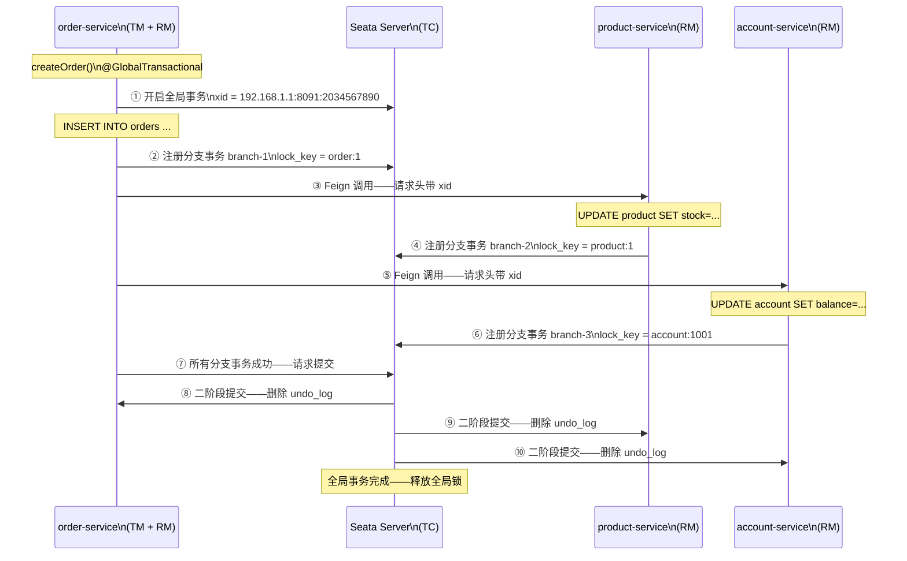

# Seata AT 模式

> 📖 <strong>前置阅读</strong>：本文假设读者已理解分布式事务的核心问题（多数据库操作一致性）和 BASE 最终一致性概念。如果还不熟悉，建议先阅读 [<strong>分布式事务本质——CAP、BASE 与四大方案</strong>]()。

## 一、⚡ Seata AT 一句话——你写你的 SQL——它自动生成反向 SQL

回想 XA 2PC 的问题——锁住数据库行等协调者——性能黑洞。Seata AT 是怎么解决的？

```
XA 2PC 的做法（性能黑洞）：
  ① Prepare：执行 SQL——不提交——锁住行
  ② 等协调者——这期间这些行都是锁着的——其他事务不能动
  ③ Commit/Rollback：提交或回滚——释放锁

Seata AT 的做法（攒反向 SQL——事后再补）：
  ① 一阶段：执行 SQL——立即提交——释放锁——同时记录 undo_log（反向 SQL）
  ② 如果全局事务成功：删掉 undo_log——完事
  ③ 如果全局事务失败：根据 undo_log 执行反向 SQL——把数据改回去
```

<strong>核心区别：XA 是锁住行等结果——Seata 是先把活干了——记下 undo_log——失败了逆向执行。</strong>

## 二、🏗️ Seata 架构——TC / TM / RM 三角

```mermaid
flowchart LR
    TM["TM（Transaction Manager）\n全局事务管理者\n-- 标注 @GlobalTransactional"]
    RM1["RM（Resource Manager）\norder-service\n-- 操作 order 数据库"]
    RM2["RM（Resource Manager）\nproduct-service\n-- 操作 product 数据库"]
    RM3["RM（Resource Manager）\naccount-service\n-- 操作 account 数据库"]
    TC["TC（Transaction Coordinator）\nSeata Server\n-- 协调全局事务——管理全局锁"]

    TM -->|"① 开启全局事务"| TC
    TM -->|"② 调用 order-service"| RM1
    RM1 -->|"③ 一阶段：执行业务 SQL + 记录 undo_log + 向 TC 注册分支事务"| TC
    TM -->|"④ 调用 product-service"| RM2
    RM2 -->|"⑤ 一阶段：执行业务 SQL + 记录 undo_log + 注册分支事务"| TC
    TM -->|"⑥ 调用 account-service"| RM3
    RM3 -->|"⑦ 一阶段：执行业务 SQL + 记录 undo_log + 注册分支事务"| TC
    
    TM -->|"⑧ 全局事务成功 → 通知 TC 提交"| TC
    TC -->|"⑨ 二阶段：通知所有 RM 删除 undo_log"| RM1
    TC -->|"⑨ 通知所有 RM 删除 undo_log"| RM2
    TC -->|"⑨ 通知所有 RM 删除 undo_log"| RM3


classDef style_TM fill:#431407,stroke:#ea580c,stroke-width:2px,color:#fed7aa;
classDef style_TC fill:#450a0a,stroke:#dc2626,stroke-width:2px,color:#fecaca;
class TM style_TM;
class TC style_TC;```

| 角色 | 全称 | 作用 | 在哪里 |
|------|------|------|------|
| <strong>TC</strong> | Transaction Coordinator | 协调全局事务——管理全局锁——决定提交还是回滚 | Seata Server——独立部署 |
| <strong>TM</strong> | Transaction Manager | 定义全局事务边界——标 `@GlobalTransactional` 的方法 | 发起方服务（order-service） |
| <strong>RM</strong> | Resource Manager | 管理分支事务——执行 undo_log 记录——向 TC 注册 | 每个参与方服务（product/account） |

## 三、🔍 undo_log 的核心原理——Seata AT 的灵魂

### 3.1 undo_log 表结构

```sql
-- 每个参与分布式事务的数据库都需要一张 undo_log 表
-- Seata 提供了建表 SQL——直接执行即可

CREATE TABLE undo_log (
    id            BIGINT(20)   NOT NULL AUTO_INCREMENT,
    branch_id     BIGINT(20)   NOT NULL COMMENT '分支事务 ID',
    xid           VARCHAR(100) NOT NULL COMMENT '全局事务 ID',
    context       VARCHAR(128) NOT NULL COMMENT '上下文',
    rollback_info LONGBLOB     NOT NULL COMMENT '回滚信息——记录前置镜像和后置镜像',
    log_status    INT(11)      NOT NULL COMMENT '状态：0-正常 1-全局事务已完成',
    log_created   DATETIME     NOT NULL,
    log_modified  DATETIME     NOT NULL,
    PRIMARY KEY (id),
    UNIQUE KEY ux_undo_log (xid, branch_id)
) ENGINE=InnoDB DEFAULT CHARSET=utf8;
```

### 3.2 undo_log 的工作原理——前置镜像 + 后置镜像

```
以"扣库存"为例——product 服务执行：UPDATE product SET stock = stock - 5 WHERE id = 1

一阶段——执行 SQL + 记录 undo_log：
  ① Seata 拦截 SQL——先查一下当前数据：
     SELECT stock FROM product WHERE id = 1  →  stock = 10
  
  ② 执行你的业务 SQL：
     UPDATE product SET stock = stock - 5 WHERE id = 1  →  stock = 5  (后置镜像)
  
  ③ 立即提交——不锁行——释放数据库锁
  
  ④ 记录 undo_log：
     前置镜像：stock = 10  （SQL 执行前的值）
     后置镜像：stock = 5   （SQL 执行后的值）
     反向 SQL：UPDATE product SET stock = 10 WHERE id = 1
  
  ⑤ 向 TC 注册：我的分支事务完成了——xid=xxx——undo_log 已记录

二阶段——提交：
  全局事务成功 → TC 通知所有 RM 提交 → 删掉 undo_log 记录 → 完事

二阶段——回滚：
  全局事务失败 → TC 通知所有 RM 回滚 → 读 undo_log 中的反向 SQL → 执行：
     UPDATE product SET stock = 10 WHERE id = 1
  然后把数据改回去了 → 删掉 undo_log 记录
```

<strong>关键——为什么 AT 比 XA 快</strong>：

| 维度 | XA 2PC | Seata AT |
|------|------|------|
| <strong>一阶段是否提交</strong> | 不提交——锁住行 | 提交——释放锁 |
| <strong>锁的持有时间</strong> | 从一阶段到二阶段——全过程 | 只有一阶段执行的那一刻 |
| <strong>二阶段回滚</strong> | 数据库自己回滚 | Seata 执行反向 SQL |
| <strong>并发能力</strong> | 极差——全锁 | 好——一阶段后锁就释放了 |

### 3.3 全局锁——写隔离——防止数据中途被改

```
问题：AT 一阶段就提交了——释放了本地数据库锁——别的请求可能在这期间修改了数据

场景：
  请求 A（全局事务 xid-a）：扣库存 10 → stock 变成 5 → 提交——释放锁
  请求 B（全局事务 xid-b）：扣库存 3 → stock 变成 2 → 提交——释放锁
  请求 A 的回滚——执行反向 SQL：UPDATE SET stock = 10
  → 请求 B 扣的 3 被覆盖了——库存变成 10——实际应该只有 2 个库存了

Seata 的全局锁解决这个问题：

  请求 A 一阶段执行前：
    ① Seata 向 TC 申请全局锁——锁住 product 表的 id=1 行
    ② 执行 UPDATE——提交——释放本地数据库锁——但全局锁还在

  请求 B 一阶段执行前：
    ③ Seata 向 TC 申请全局锁——锁住 product 表的 id=1 行
    ④ TC 检查——xid-a 已经锁了 product.id=1
    ⑤ 请求 B 等待——轮询重试——直到 xid-a 释放全局锁

  请求 A 二阶段（提交或回滚）完成后：
    ⑥ TC 释放全局锁——请求 B 获得全局锁——继续执行

结论：
  本地锁（数据库行锁）只在一阶段执行瞬间持有——释放快——不影响并发
  全局锁（Seata 管理的）在整个全局事务期间持有——但只防"同一行"的写冲突
  读操作不受全局锁限制——比 XA 的全行锁好得多
```

## 四、🔧 Seata Server 搭建——Docker Compose

### 4.1 Seata Server——用 Nacos 做注册中心 + MySQL 做存储

```yaml
# docker-compose.yml——加到已有的基础设施中
version: '3.8'
services:

  seata-server:
    image: seataio/seata-server:1.8.0
    container_name: seata-server
    ports:
      - "7091:7091"   # Seata Web 控制台
      - "8091:8091"   # Seata 服务端口——client 连接这个
    environment:
      - SEATA_PORT=8091
      - STORE_MODE=db
      # 注册中心——Nacos
      - SEATA_CONFIG_REGISTRY_TYPE=nacos
      - SEATA_CONFIG_REGISTRY_NACOS_SERVER-ADDR=nacos:8848
      - SEATA_CONFIG_REGISTRY_NACOS_NAMESPACE=
      - SEATA_CONFIG_REGISTRY_NACOS_GROUP=SEATA_GROUP
      # 配置中心——Nacos
      - SEATA_CONFIG_CONFIG_TYPE=nacos
      - SEATA_CONFIG_CONFIG_NACOS_SERVER-ADDR=nacos:8848
      - SEATA_CONFIG_CONFIG_NACOS_NAMESPACE=
      - SEATA_CONFIG_CONFIG_NACOS_GROUP=SEATA_GROUP
      # 存储——MySQL
      - SEATA_STORE_DB_DATASOURCE=druid
      - SEATA_STORE_DB_DB-TYPE=mysql
      - SEATA_STORE_DB_DRIVER-CLASS-NAME=com.mysql.cj.jdbc.Driver
      - SEATA_STORE_DB_URL=jdbc:mysql://mysql:3306/seata?useUnicode=true&characterEncoding=utf8&serverTimezone=Asia/Shanghai
      - SEATA_STORE_DB_USER=root
      - SEATA_STORE_DB_PASSWORD=root123
    depends_on:
      - nacos
      - mysql
```

```sql
-- Seata Server 需要的数据库表——在 MySQL 中执行
CREATE DATABASE IF NOT EXISTS seata;
USE seata;

-- 全局事务表
CREATE TABLE global_table (
    xid         VARCHAR(128) NOT NULL,
    transaction_id BIGINT,
    status      TINYINT NOT NULL,
    application_id VARCHAR(32),
    transaction_service_group VARCHAR(32),
    transaction_name VARCHAR(128),
    timeout     INT,
    begin_time  BIGINT,
    application_data VARCHAR(2000),
    gmt_create  DATETIME,
    gmt_modified DATETIME,
    PRIMARY KEY (xid),
    KEY idx_status_gmt_modified (status, gmt_modified),
    KEY idx_transaction_id (transaction_id)
) ENGINE=InnoDB DEFAULT CHARSET=utf8;

-- 分支事务表
CREATE TABLE branch_table (
    branch_id   BIGINT NOT NULL,
    xid         VARCHAR(128) NOT NULL,
    transaction_id BIGINT,
    resource_group_id VARCHAR(32),
    resource_id VARCHAR(256),
    lock_key    VARCHAR(128),
    branch_type VARCHAR(8),
    status      TINYINT,
    client_id   VARCHAR(64),
    application_data VARCHAR(2000),
    gmt_create  DATETIME,
    gmt_modified DATETIME,
    PRIMARY KEY (branch_id),
    KEY idx_xid (xid)
) ENGINE=InnoDB DEFAULT CHARSET=utf8;

-- 全局锁表
CREATE TABLE lock_table (
    row_key     VARCHAR(128) NOT NULL,
    xid         VARCHAR(128),
    transaction_id BIGINT,
    branch_id   BIGINT,
    resource_id VARCHAR(256),
    table_name  VARCHAR(32),
    pk          VARCHAR(36),
    status      TINYINT NOT NULL DEFAULT 0,
    gmt_create  DATETIME,
    gmt_modified DATETIME,
    PRIMARY KEY (row_key),
    KEY idx_status (status),
    KEY idx_branch_id (branch_id),
    KEY idx_xid_and_branch_id (xid, branch_id)
) ENGINE=InnoDB DEFAULT CHARSET=utf8;
```

```bash
# 验证 Seata Server 启动成功
curl http://localhost:7091

# 在 Nacos 中查看——服务列表应该出现 serverAddr
# http://localhost:8848/nacos → 服务列表 → 搜索 seata-server
```

## 五、📝 微服务集成 Seata——完整代码

### 5.1 每个服务加依赖 + 配置 + undo_log 表

```xml
<!-- 每个服务的 pom.xml——加 Seata 依赖 -->
<dependency>
    <groupId>com.alibaba.cloud</groupId>
    <artifactId>spring-cloud-starter-alibaba-seata</artifactId>
</dependency>
<!-- 排除自带的 Seata 版本——用我们自己指定的 -->
<!-- spring-cloud-alibaba 会自动引入 seata-spring-boot-starter -->
```

```yaml
# 每个服务的 application.yml
spring:
  cloud:
    alibaba:
      seata:
        tx-service-group: default_tx_group   # ← 事务分组——和 Seata Server 中的配置对应

seata:
  registry:
    type: nacos
    nacos:
      server-addr: nacos:8848
      group: SEATA_GROUP
      namespace: ""
      application: seata-server
  tx-service-group: default_tx_group
  service:
    vgroup-mapping:
      default_tx_group: default
```

```sql
-- ⚠️ 每个参与分布式事务的数据库都需要创建 undo_log 表
-- 在 order-service 的数据库中：
USE order_db;
CREATE TABLE undo_log ( ... );  -- 同上

-- 在 product-service 的数据库中：
USE product_db;
CREATE TABLE undo_log ( ... );

-- 在 account-service 的数据库中：
USE account_db;
CREATE TABLE undo_log ( ... );
```

### 5.2 order-service——TM（全局事务发起方）

```java
// ===== Application Service——加 @GlobalTransactional =====
@Service
public class OrderApplicationService {

    @Autowired
    private OrderRepository orderRepository;
    @Autowired
    private ProductClient productClient;    // Feign——product-service
    @Autowired
    private AccountClient accountClient;    // Feign——account-service

    @GlobalTransactional(                    // ← ← ← 核心注解——定义全局事务边界
        name = "create-order",               // 全局事务名——显示在 Seata 控制台
        timeoutMills = 60000,                // 超时时间——60 秒
        rollbackFor = Exception.class        // 任何异常都回滚
    )
    public Order createOrder(CreateOrderRequest request) {
        // ① 创建订单——本地事务——RM 自动处理
        Order order = Order.create(
            request.getUserId(),
            request.getDeliveryAddress(),
            request.getItems()
        );
        orderRepository.save(order);  // 一阶段：执行 INSERT + 记录 undo_log + 注册分支事务

        // ② 扣库存——远程调用 product-service
        try {
            productClient.deductStock(request.getItems());
            // 一阶段：product-service 执行 UPDATE + 记录 undo_log + 注册分支事务
        } catch (Exception e) {
            // 抛异常——TM 感知——触发全局回滚
            throw new BusinessException("扣库存失败——订单回滚", e);
        }

        // ③ 扣余额——远程调用 account-service
        try {
            accountClient.deductBalance(request.getUserId(), order.getTotalAmount());
            // 一阶段：account-service 执行 UPDATE + 记录 undo_log + 注册分支事务
        } catch (Exception e) {
            // 抛异常——TM 感知——触发全局回滚
            throw new BusinessException("扣余额失败——订单回滚", e);
        }

        // ④ 所有分支事务成功——TM 通知 TC 提交全局事务
        // 二阶段各 RM 删除 undo_log

        return order;
    }
    // 如果方法中任何地方抛异常——Seata 自动回滚所有分支事务
}
```

### 5.3 product-service——RM（分支事务参与方）

```java
// ===== product-service——被调方——不需要 @GlobalTransactional =====
// Seata 自动通过 Feign 传播全局事务上下文（xid）

@Service
public class ProductService {

    @Autowired
    private ProductMapper productMapper;

    // 不需要加 @GlobalTransactional——Seata Agent 自动拦截
    // 通过 Feign 请求头中传播的 xid——自动加入全局事务
    @Transactional  // ← 本地事务——Seata 会拦截并增强
    public void deductStock(List<OrderItemDto> items) {
        for (OrderItemDto item : items) {
            Product product = productMapper.selectById(item.getProductId());
            if (product == null) {
                throw new BusinessException("商品不存在——ID：" + item.getProductId());
            }
            if (product.getStock() < item.getQuantity()) {
                throw new BusinessException("库存不足——商品：" + product.getName());
            }

            // 扣库存
            product.setStock(product.getStock() - item.getQuantity());
            productMapper.updateById(product);

            // Seata 自动拦截这个 UPDATE：
            // ① 执行前：SELECT 得到前置镜像（stock=100）
            // ② 执行 UPDATE——提交
            // ③ 记录 undo_log：前置镜像 stock=100 ——后置镜像 stock=95
            // ④ 向 TC 注册分支事务
        }
    }
}
```

```java
// ===== Feign 接口——Seata 自动传播 xid =====
@FeignClient(name = "product-service")
public interface ProductClient {

    @PostMapping("/api/products/deduct-stock")
    void deductStock(@RequestBody List<OrderItemDto> items);
    // Seata 拦截 Feign 调用——把 xid 放入请求头——传播到 product-service
}
```

### 5.4 account-service——RM（另一个分支事务参与方）

```java
@Service
public class AccountService {

    @Autowired
    private AccountMapper accountMapper;

    @Transactional
    public void deductBalance(Long userId, BigDecimal amount) {
        Account account = accountMapper.selectByUserId(userId);
        if (account == null) {
            throw new BusinessException("账户不存在——userId：" + userId);
        }
        if (account.getBalance().compareTo(amount) < 0) {
            throw new BusinessException("余额不足");
        }

        account.setBalance(account.getBalance().subtract(amount));
        accountMapper.updateById(account);

        // Seata 自动拦截——记录 undo_log——注册分支事务
    }
}
```

### 5.5 全局事务的完整流转——从代码到数据库



## 六、⚠️ AT 模式的三个限制

### 限制一：只支持关系型数据库——不支持 Redis/MongoDB/ES

```
AT 依赖数据库事务（ACID）和 undo_log 表——只有关系型数据库有这些
如果你的操作涉及 Redis 缓存更新、MongoDB 写入、ES 索引更新——AT 管不了

解决方案：
  → 涉及非关系型数据库的操作——用 TCC 或 Saga
  → 或者在 AT 的基础上——缓存操作放在一阶段之后——失败了手工补偿
```

### 限制二：只支持单条 INSERT/UPDATE/DELETE——不支持复杂 SQL

```
AT 需要解析 SQL——生成前置镜像和后置镜像——然后生成反向 SQL

支持的：
  INSERT INTO orders VALUES (...)
  UPDATE product SET stock = stock - 5 WHERE id = 1
  DELETE FROM cart WHERE user_id = 1001

不支持的：
  UPDATE product SET stock = (SELECT ... FROM ... WHERE ...)  ← 子查询——Seata 解析不了
  UPDATE ... JOIN ... ON ...                                  ← 多表联查
  INSERT INTO ... SELECT ... FROM ...                         ← INSERT SELECT 语法
```

### 限制三：性能开销——5% 到 15%

```
AT 模式的开销来自：
  ① 一阶段额外执行 SELECT 获取前置镜像——每个写操作多一条 SELECT
  ② undo_log 的 INSERT——每个写操作多一条 INSERT
  ③ 全局锁的申请和释放——和 TC 的网络交互
  ④ Feign 请求需要传播 xid——多一个请求头

实际测试——QPS 1000 的场景：
  不加 Seata：avg RT = 50ms
  加 Seata AT：avg RT = 53ms  ← 仅增加 3ms——可以接受
  
  瓶颈不在 Seata——在业务逻辑和数据库本身
```

> ⚠️ 新手提示：AT 模式只保证"一阶段的写操作能自动回滚"——不保证"一阶段之后调用第三方 API 失败的回滚"。例如：扣库存成功了——然后调用短信 API 发送——短信 API 超时——Seata 回滚了库存——但短信已经发出去了——收不回来。所以——第三方 API 不要放在 AT 事务中——放在事务成功后异步调用。

## 🎯 总结

1. <strong>Seata AT = 一阶段执行 SQL + 记录 undo_log + 提交释放锁——二阶段成功删 undo_log / 失败执行反向 SQL</strong>：和 XA 最大的区别是一阶段就提交——锁持有时间极短——性能好得多。undo_log 记录前置镜像（SQL 执行前的值）和后置镜像（SQL 执行后的值）——失败时根据前置镜像生成反向 SQL 还原。

2. <strong>全局锁解决写冲突——读操作不受限</strong>：本地数据库锁在一阶段执行瞬间释放——全局锁（Seata TC 管理）在整个全局事务期间持有——防止其他全局事务修改同一行数据。读操作完全不受全局锁影响——比 XA 的全行锁好得多。

3. <strong>集成阶段——每个数据库建 undo_log 表、每个服务加 Seata 依赖、TM 加 @GlobalTransactional、RM 不需要额外注解</strong>：Feign 请求自动传播 xid——RM 的 @Transactional 被 Seata 拦截增强——无需手动处理分布式事务上下文。

4. <strong>AT 的局限——只支持关系型数据库、不支持复杂 SQL、第三方 API 不要放在事务中</strong>：Redis/MongoDB/ES 操作需要 TCC 或 Saga，子查询和多表联查 AT 解析不了，短信/邮件/推送放在事务成功后异步调用——收回不了。

> 📖 <strong>下一步阅读</strong>：AT 模式要求操作都是数据库写操作——如果你的操作涉及"调第三方 API 发优惠券"——失败了不能自动回滚——需要手动补偿。继续阅读 [<strong>TCC + Saga——补偿型事务</strong>]()。
