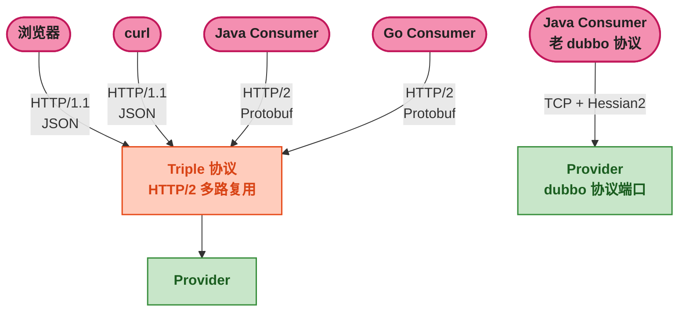
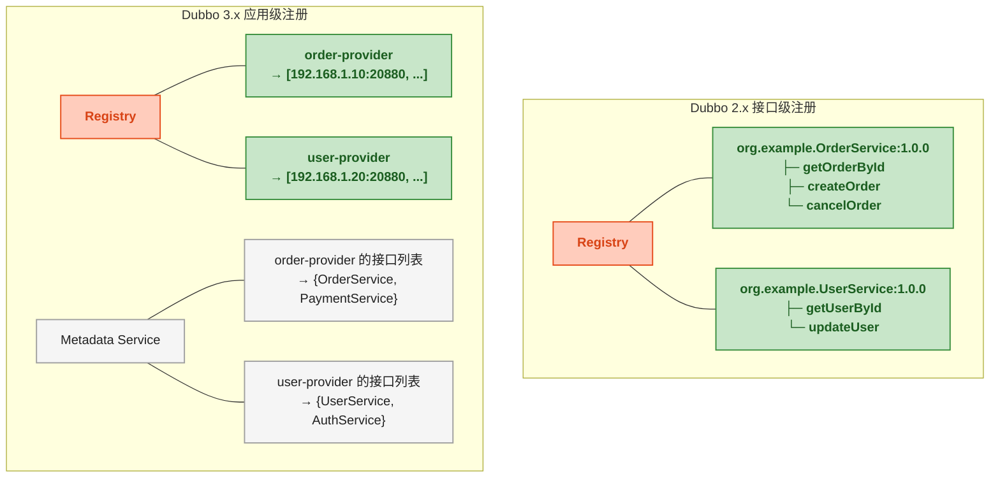

# Dubbo 3.x 新特性：Triple 协议与应用级服务发现

> 📖 <strong>前置阅读</strong>：本文假设读者已掌握 Dubbo 的基本 RPC 开发、注册中心使用（Nacos）和 dubbo 协议。如果还不熟悉，建议先阅读 [<strong>Dubbo 核心架构与 RPC 模型</strong>]() 和 [<strong>注册中心：Nacos 与 Zookeeper</strong>]()。

## 一、⚡ 问题切入：dubbo 协议有什么不够用的？

第一篇说了 dubbo 协议的优点——TCP 长连接 + Hessian2 二进制序列化，性能极佳。但它的设计产生于 2011 年：

| dubbo 协议的局限 | 为什么是问题 |
|------|------|
| <strong>私有二进制协议</strong> | 浏览器和 curl 调不了——非 HTTP，无法穿透通用 HTTP 网关 |
| <strong>Java 中心</strong> | 协议体是 Java 特有的——Go/Node.js/Python 客户端需要单独实现协议栈 |
| <strong>服务网格不友好</strong> | Istio/Envoy 基于 HTTP/1.1 和 HTTP/2 做流量治理——私有协议无法被 Sidecar 理解 |
| <strong>接口级服务发现</strong> | 注册中心存储的是接口粒度数据（`org.example.OrderService:getOrderById`）——微服务有几百个接口时，注册数据爆炸 |

Dubbo 3.x 的两大革新直接解决这些问题：

1. <strong>Triple 协议</strong>——基于 HTTP/2 + Protobuf，解决私有协议问题
2. <strong>应用级服务发现</strong>——从接口粒度改为应用粒度，解决注册数据爆炸

## 二、Triple 协议 —— HTTP/2 能力 + RPC 性能

### 2.1 Triple 协议的本质

Triple 协议 = <strong>将 gRPC 的传输协议（HTTP/2 + Protobuf）搬到 Dubbo 上</strong>，同时保留 Dubbo 的服务治理能力（注册中心、负载均衡、集群容错）。

```
dubbo 协议：    Dubbo RPC  → TCP 长连接 + Hessian2
Triple 协议：   Dubbo RPC  → HTTP/2 + Protobuf（兼容 JSON/Hessian2）
gRPC：          gRPC 调用  → HTTP/2 + Protobuf

Triple 约等于 Dubbo 的治理 + gRPC 的传输协议
```



### 2.2 Triple 协议的核心优势

| 特性 | dubbo 协议 | Triple 协议 |
|------|:---:|:---:|
| <strong>传输层</strong> | TCP 长连接（私有帧格式） | HTTP/2（标准帧格式） |
| <strong>序列化</strong> | Hessian2 | Protobuf（默认），兼容 Hessian2、JSON |
| <strong>浏览器/curl 访问</strong> | ✗ | ✓——HTTP/2 向下兼容 HTTP/1.1 |
| <strong>跨语言</strong> | 需要该语言的 Dubbo SDK | 任何支持 HTTP/2 + Protobuf 的语言 |
| <strong>网关穿透</strong> | 需要专门的协议转换 | 标准 Nginx/Envoy 直接代理 |
| <strong>服务网格</strong> | Sidecar 不理解私有协议 | Sidecar 天然理解 HTTP/2 |
| <strong>多路复用</strong> | 单连接多请求（私有实现） | HTTP/2 Stream（标准实现） |
| <strong>服务治理</strong> | 完整 | 完整——继承 Dubbo 的所有治理能力 |

### 2.3 Triple 协议配置

```yaml
# Provider——暴露 Triple 协议
dubbo:
  protocol:
    name: triple
    port: 30880
```

```java
// Provider 实现——接口和逻辑完全不变
@DubboService
public class OrderServiceImpl implements OrderService {
    // 和 dubbo 协议时完全一样——不需要改一行代码
}
```

```java
// Consumer——引用 Triple 协议的服务
@DubboReference
private OrderService orderService;
// 调用方代码也不变——Dubbo 自动识别协议
```

<strong>和 dubbo 协议的 API 完全兼容</strong>——接口定义、`@DubboService`、`@DubboReference` 全部不变。唯一变化的是一行 yml 配置：`dubbo.protocol.name: triple`。

### 2.4 用 curl 直接调用 Triple 服务

Triple 协议最直观的优势——<strong>可以用 curl 直接调</strong>：

```bash
# 1. 启动 Provider——监听 Triple 协议 30880 端口
# 2. 确认 Provider 在运行

# 3. 用 curl 直接调用——无需 Java Consumer！
curl -X POST http://localhost:30880/org.example.api.OrderService/getOrderById \
  -H "Content-Type: application/json" \
  -d '{
    "orderId": 10001
  }'

# 返回：
# {"orderId":10001,"userId":2001,"productName":"iPhone 15","amount":6999.00}
```

这个能力意味着：
- <strong>测试</strong>：不需要写 Consumer 代码——curl + JSON 就能验证 Provider
- <strong>调试</strong>：浏览器 + Postman 直接发请求看返回
- <strong>跨语言</strong>：Go/Node.js 用标准 HTTP Client 就能调（JSON 模式），用 gRPC Client 调性能更好（Protobuf 模式）

### 2.5 Protobuf —— Triple 的高性能模式

上面的 curl 例子用的是 JSON 模式（方便调试）。生产环境推荐 Protobuf——体量更小、解析更快：

```protobuf
// order.proto
syntax = "proto3";

option java_package = "org.example.api";
option java_multiple_files = true;

message Order {
  int64 order_id = 1;
  int64 user_id = 2;
  string product_name = 3;
  string amount = 4;  // BigDecimal 用字符串传输
}

message GetOrderRequest {
  int64 order_id = 1;
}

service OrderService {
  rpc getOrderById(GetOrderRequest) returns (Order);
}
```

```java
// Java 接口——基于 protobuf 生成的类
public interface OrderService {
    // 方法名和 proto 中的 rpc 方法名一致
    Order getOrderById(GetOrderRequest request);
}

// Provider 实现不变
// Consumer 调用不变
```

| 序列化模式 | 适用场景 | curl 可调？ |
|------|------|:---:|
| JSON | 调试、跨语言快速集成 | ✓ |
| Protobuf | 生产环境——最高性能 | 需要用 grpcurl 等工具 |

### 2.6 同时暴露 dubbo 和 triple 两个端口

老系统迁移时——新 Consumer 用 Triple，老 Consumer 继续用 dubbo 协议：

```yaml
dubbo:
  protocols:
    dubbo-legacy:
      id: dubbo
      name: dubbo
      port: 20880       # 老 Consumer 继续用这个端口
    triple-new:
      id: triple
      name: triple
      port: 30880       # 新 Consumer 迁移到这个端口
```

同一个 Provider 同时监听 20880 和 30880——<strong>两套协议、一个服务实现、零代码改动</strong>。

## 三、应用级服务发现 —— 注册粒度从接口到应用

### 3.1 接口级服务发现的"注册爆炸"

Dubbo 2.x 的注册模型是<strong>接口级</strong>——每个接口方法作为独立条目注册到 Registry：

```
一个 Provider 应用有 20 个接口，每个接口有 5 个方法
  → 注册中心存了 100 条服务信息

100 个 Provider 实例（水平扩展）
  → 注册中心存了 10000 条服务信息

Consumer 订阅 10 个服务
  → 每次从注册中心拉取 100 × 10 = 1000 条地址信息
```

当微服务规模到几百个时，注册中心的数据量和推送频率成为瓶颈。

### 3.2 应用级服务发现的模型

Dubbo 3.x 引入<strong>应用级服务发现</strong>——注册粒度从"接口"变为"应用"：

```
接口级（Dubbo 2.x）：
  Registry 存储：providers:org.example.OrderService:getOrderById
                 providers:org.example.OrderService:createOrder
                 providers:org.example.UserService:getUserById
                 ...（每个接口方法一条）

应用级（Dubbo 3.x）：
  Registry 存储：order-provider → [192.168.1.10:20880, 192.168.1.11:20880]
                 user-provider → [192.168.1.20:20880, 192.168.1.21:20880]
                 ...（每个应用一条）
  
  接口的详细信息（方法列表、参数类型等）存在<strong>元数据服务</strong>中
```



### 3.3 注册数据量对比

```
场景：1 个订单系统有 5 个接口，每个接口 3 个方法，部署 100 个实例

接口级（Dubbo 2.x）：
  Registry 数据量 = 100 实例 × 5 接口 × 3 方法 = 1500 条
  Consumer 每次拉取 = 100 实例 × 5 接口 = 500 条地址

应用级（Dubbo 3.x）：
  Registry 数据量 = 100 条（每个实例一条）
  Consumer 每次拉取 = 100 条地址
  （接口方法信息通过元数据服务拿）

数据量减少 15 倍
```

### 3.4 配置应用级服务发现

```yaml
dubbo:
  application:
    name: order-provider
    register-mode: instance    # instance = 应用级, interface = 接口级（默认兼容）, all = 双注册
  registry:
    address: nacos://localhost:8848
```

| register-mode | 行为 | 使用场景 |
|------|------|------|
| `interface` | 接口级注册（Dubbo 2.x 方式） | 兼容 Dubbo 2.x Consumer |
| `instance` | 应用级注册（Dubbo 3.x 新方式） | 全部 Consumer 都是 Dubbo 3.x |
| `all`（默认） | 双注册——同时注册接口级和应用级 | <strong>过渡期</strong>——Consumer 有 2.x 也有 3.x |

```yaml
# 过渡期推荐配置——双注册
dubbo:
  application:
    register-mode: all
  registry:
    address: nacos://localhost:8848
  metadata-report:
    address: nacos://localhost:8848   # 元数据服务也走 Nacos
```

> ⚠️ 新手提示：Dubbo 3.x 默认 `register-mode: all`——同时注册接口级和应用级。这意味着启动一个 Dubbo 3.x Provider，Nacos 里会看到<strong>两条注册信息</strong>（一条接口级、一条应用级）。全量迁移到 3.x 后可以切到 `instance`。

## 四、Dubbo 3.x 其他值得关注的特性

| 特性 | 含义 | 什么时候用 |
|------|------|------|
| <strong>云原生</strong> | 支持 Kubernetes 作为注册中心（不用 Nacos/ZK） | 在 K8s 上部署时——用 K8s Service 做服务发现 |
| <strong>AOT 编译</strong> | 支持 Spring Native / GraalVM 编译为原生二进制 | 需要快速启动和低内存占用的场景 |
| <strong>Mesh 模式</strong> | Dubbo 可以跑在 Istio Sidecar 后面——Sidecar 做流量管理 | 公司已有 Service Mesh 基础设施 |
| <strong>Reactive</strong> | 支持 Reactor / RxJava 响应式调用 | 需要非阻塞 RPC——和高性能网关配合 |

## 五、Dubbo 2.x 迁移到 3.x 的检查清单

| # | 检查项 | 操作 |
|:--:|------|------|
| 1 | `dubbo.version` 从 2.7.x 升级到 3.3.x | 改 POM——3.x 向后兼容 2.7 的 API |
| 2 | `dubbo.protocol.name` 固定为 `dubbo` 还是切 `triple` | 先保持 `dubbo`——协议不变就无风险。后续逐步开 `triple` |
| 3 | `register-mode` 设为 `all`（默认） | 双注册——2.x Consumer 和 3.x Consumer 都能发现 |
| 4 | 元数据服务配 `metadata-report.address` | 应用级服务发现需要元数据服务——通常指向同一个 Nacos |
| 5 | 序列化保持一致 | Hessian2 不变——2.x 和 3.x 的默认序列化器相同 |
| 6 | Consumer 先升级还是 Provider 先升级 | <strong>先升级 Provider 再升级 Consumer</strong>——因为 3.x Provider 同时做了接口级注册，2.x Consumer 不受影响 |
| 7 | 验证——接口级和应用级两条注册信息都在 Nacos 中可见 | Nacos 控制台 → 服务列表 → 看到 `providers:org.example.OrderService:::xxx` 和 `order-provider` |

## 🎯 总结

1. <strong>Triple 协议 = Dubbo 治理 + gRPC 传输</strong>：基于 HTTP/2 + Protobuf，同时兼容 JSON（curl 可调）。用一行 yml 切换——接口和业务代码完全不变。同一服务可以同时暴露 dubbo 和 triple 两个端口——兼容老 Consumer。

2. <strong>应用级服务发现解决注册爆炸</strong>：注册粒度从"接口方法"改为"应用"——100 实例 × 5 接口 × 3 方法 = 1500 条减少到 100 条。接口方法信息存元数据服务——Consumer 在调用时才获取。

3. <strong>迁移策略：先开双注册，再切协议</strong>：`register-mode: all`（兼容 2.x Consumer）→ Consumer 全量升 3.x → `register-mode: instance`（关闭接口级注册）。协议迁移独立：先保持 dubbo 协议 → 逐步切 triple。

4. <strong>Triple 协议让 Dubbo 真正走出了 Java 生态</strong>：浏览器、curl、gRPC 客户端都能调用——这就是 HTTP/2 标准化的力量。

> 📖 <strong>下一步阅读</strong>：所有功能都玩明白了。最后一步——生产环境部署。多协议多注册中心怎么配？Dubbo Admin 看哪些指标？JVM 怎么调？继续阅读 [<strong>生产环境部署与调优</strong>]()。
