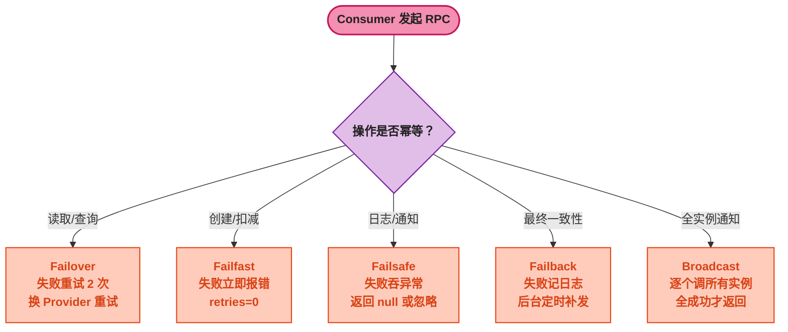
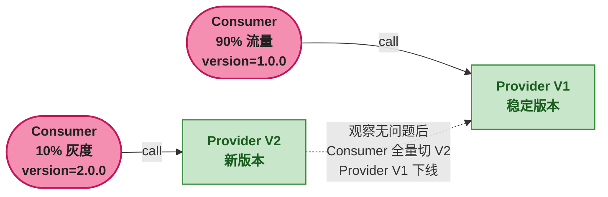

# Dubbo 集群容错、负载均衡与异步调用

> 📖 <strong>前置阅读</strong>：本文假设读者已掌握 SpringBoot Dubbo 的基本 RPC 操作（`@DubboService` / `@DubboReference`）。如果还不熟悉，建议先阅读 [<strong>SpringBoot Dubbo 全操作指南</strong>]()。

## 一、⚡ 问题切入：RPC 调用失败了怎么办？

上一篇文章的 `@DubboReference` 默认配置了三件事：

1. Provider 有多个实例时——<strong>随机选一个</strong>（负载均衡）
2. 调用失败时——<strong>自动重试 2 次</strong>（集群容错）
3. 调用超过 1 秒——<strong>抛超时异常</strong>

默认策略覆盖了 80% 的场景，但剩下的 20% 需要精确控制——这就是 Dubbo 服务治理的核心：<strong>集群容错（怎么处理失败）、负载均衡（怎么选择节点）、调用模式（同步还是异步）</strong>。

## 二、集群容错 —— 失败了怎么办

### 2.1 六种集群容错策略

Dubbo 的 `Cluster` 接口定义了容错行为。Consumer 侧配置：

| 策略 | 配置值 | 行为 | 适用场景 |
|------|------|------|------|
| <strong>Failover</strong>（默认） | `failover` | 失败后自动切换其他 Provider 重试，默认重试 2 次（共 3 次调用） | 幂等的读操作 |
| <strong>Failfast</strong> | `failfast` | 失败后立即报错——不重试 | <strong>非幂等写操作</strong>（创建订单、扣库存） |
| <strong>Failsafe</strong> | `failsafe` | 失败后吞掉异常——返回 null / 忽略错误 | 非关键操作（日志、通知） |
| <strong>Failback</strong> | `failback` | 失败后记录到后台线程——定时重试 | 最终一致性场景（数据同步） |
| <strong>Forking</strong> | `forking` | 同时调用所有 Provider——取第一个成功返回的 | 高可用低延迟，但浪费资源 |
| <strong>Broadcast</strong> | `broadcast` | 逐个调用所有 Provider——任何一个失败就报错 | 通知所有实例（缓存刷新、配置更新） |

```java
// 消费端配置集群容错策略
@DubboReference(
    cluster = "failfast",    // 写操作——不重试
    retries = 0              // 即使 Failover 模式，也可以设 retries=0 关掉重试
)
private OrderService orderService;
```

### 2.2 Failover 原理与幂等陷阱

Failover 是默认策略——它的逻辑是：

```
Consumer 调用 Provider-A → 超时/异常
                         ↓
Consumer 自动换 Provider-B → 成功 → 返回结果
                         ↓
       Provider-B 处理了这次请求
       但 Provider-A 可能也处理了——只是返回超时了！
```

这就是 Dubbo 的<strong>重复调用陷阱</strong>：

```java
// 需求：创建订单——只能成功一次
@DubboReference(
    cluster = "failover",  // 默认——危险！
    retries = 2            // 默认——更危险！
)
private OrderService orderService;

// 调用 createOrder(10001, "iPhone", 6999)
// 场景：Provider-A 处理成功但 Consumer 超时
//   → Consumer 认为失败 → 重试到 Provider-B
//   → Provider-B 又创建了一次 → 同一个订单创建了两条！
```

<strong>正确配置</strong>：

```java
// 非幂等写操作——必须关掉重试
@DubboReference(
    cluster = "failfast",  // 失败立即报错——不重试
    retries = 0
)
private OrderService orderService;
```



### 2.3 Failback 的适用场景

```java
// 数据同步——必须最终一致但不要求实时
// 场景：订单创建后异步同步到数据仓库
@DubboReference(
    cluster = "failback",
    retries = 5,           // 后台重试 5 次
    timeout = 1000          // 每次调用 1s 超时
)
private DataWarehouseSyncService syncService;
```

Failback 的行为：
```
调用失败 → 记录到后台线程的失败列表 → 立即返回（不阻塞主线程）
后台线程 → 每隔一段时间重试 → 5 次后仍然失败 → 丢弃
```

## 三、负载均衡 —— 多 Provider 怎么选

### 3.1 七种负载均衡策略

| 策略 | 配置值 | 算法 | 适用场景 |
|------|------|------|------|
| <strong>Random</strong>（默认） | `random` | 随机 + 权重——响应快的 Provider 权重高 | 通用场景 |
| <strong>RoundRobin</strong> | `roundrobin` | 轮询 + 权重——按顺序分配 | 各 Provider 性能相同 |
| <strong>LeastActive</strong> | `leastactive` | 选当前活跃调用数最少的 Provider | Provider 处理耗时差异大 |
| <strong>ShortestResponse</strong> | `shortestresponse` | 选响应时间最短 + 活跃数最少的 Provider | 综合考虑延迟和负载 |
| <strong>ConsistentHash</strong> | `consistenthash` | 一致性哈希——同一个参数值永远到同一个 Provider | 需要请求粘性的场景 |
| <strong>P2C</strong>（3.2+） | `p2c` | Power of Two Choice——随机选两个，挑负载低的 | 大规模集群的近似最优 |
| <strong>Adaptive</strong>（3.2+） | `adaptive` | 自适应——根据实时性能数据动态选 Provider | 自动优化场景 |

```yaml
# yml 中全局配置
dubbo:
  consumer:
    loadbalance: leastactive  # 全局默认
```

```java
// 注解中局部覆盖
@DubboReference(loadbalance = "consistenthash")
private OrderService orderService;
```

### 3.2 权重的含义

每个策略都支持<strong>权重</strong>——权重越高，分配到的流量越多。权重可以在 Provider 端配置：

```yaml
# Provider 端——这台机器配置高，权重设大
dubbo:
  provider:
    weight: 200    # 默认 100——这台机器分 2 倍流量
```

```
三个 Provider 实例，权重分别为 100, 200, 100：

Random 策略（按权重随机）：
    Provider-1 (权重 100) → 25% 请求
    Provider-2 (权重 200) → 50% 请求
    Provider-3 (权重 100) → 25% 请求
```

### 3.3 一致性哈希 —— 需要"请求粘性"时

```java
// 场景：订单服务缓存了部分数据——同一个 orderId 永远路由到同一个 Provider
@DubboReference(
    loadbalance = "consistenthash",
    parameters = {"hash.arguments", "long[]"}  // 按 orderId 参数哈希
)
private OrderService orderService;
```

<strong>一致性哈希在新增 Provider 时的行为</strong>：

```
正常状态（三个 Provider 节点）：
    orderId=10001 → hash → Provider-1
    orderId=10002 → hash → Provider-2
    orderId=10003 → hash → Provider-3

新增 Provider-4：
    orderId=10001 → hash → Provider-1  (不变)
    orderId=10002 → hash → Provider-2  (不变)
    orderId=10003 → hash → Provider-4  (变了！)

只有 1/3 的请求换了 Provider——不是全量重新分配
```

### 3.4 P2C（Power of Two Choice）

Dubbo 3.2+ 的新策略——比 Random 更智能，比 LeastActive 开销更低：

```
P2C 算法（每次请求）：
    1. 从所有 Provider 中随机选 2 个
    2. 比较这 2 个的活跃调用数
    3. 选择活跃调用数少的那个

为什么高效：不需要维护全局的"最少活跃"状态——只要随机 2 个比一下
```

```java
@DubboReference(loadbalance = "p2c")
private OrderService orderService;  // Dubbo 3.2+
```

## 四、服务分组与版本隔离

### 4.1 服务分组 —— 同一接口不同业务场景

```java
// Provider——南方机房
@DubboService(group = "south")
public class OrderServiceImpl implements OrderService { ... }

// Provider——北方机房
@DubboService(group = "north")
public class OrderServiceImpl implements OrderService { ... }

// Consumer——南方用户
@DubboReference(group = "south")
private OrderService orderService;
```

分组可以用于：
- <strong>同机房调用</strong>：`group = "cn-south"` / `group = "cn-north"`
- <strong>流量隔离</strong>：`group = "normal"` / `group = "vip"`
- <strong>灰度发布</strong>：`group = "stable"` / `group = "canary"`

### 4.2 服务版本 —— 灰度发布和向后兼容

```java
// Provider V1——老版本（稳定）
@DubboService(version = "1.0.0")
public class OrderServiceV1Impl implements OrderService {
    // 老方法：只返回订单基本信息
    public Order getOrderById(Long orderId) { ... }
}

// Provider V2——新版本（灰度）
@DubboService(version = "2.0.0")
public class OrderServiceV2Impl implements OrderService {
    // 新方法：返回订单 + 关联物流信息
    public Order getOrderById(Long orderId) {
        Order order = ...;
        order.setLogistics(logisticsService.getByOrderId(orderId)); // 新功能
        return order;
    }
}

// Consumer——灰度用户（逐渐从 V1 切到 V2）
@DubboReference(version = "2.0.0")  // 切到 V2
private OrderService orderService;
```



## 五、异步调用 —— 不阻塞当前线程的 RPC

### 5.1 三种异步调用方式

| 方式 | 配置 | 适用场景 |
|------|------|------|
| <strong>CompletableFuture 直接返回</strong> | 接口方法返回 `CompletableFuture<T>` | 需要组合多个 RPC 调用 |
| <strong>async=true</strong> | `@DubboReference(async=true)` + `RpcContext.getCompletableFuture()` | 老代码改造——接口不改 |
| <strong>回调</strong> | `@DubboReference(async=true)` + `RpcContext.getCompletableFuture().whenComplete()` | 需要通知的异步处理 |

### 5.2 方式一：CompletableFuture（推荐）

```java
// 接口定义——返回 CompletableFuture
public interface OrderService {
    CompletableFuture<Order> getOrderById(Long orderId);
}

// Provider 实现——和同步方法一样写
@DubboService
public class OrderServiceImpl implements OrderService {
    @Override
    public CompletableFuture<Order> getOrderById(Long orderId) {
        // Dubbo 自动把返回值包装成 CompletableFuture
        return CompletableFuture.completedFuture(
                orderDB.get(orderId));
    }
}

// Consumer 调用——组合多个 RPC 调用
@RestController
public class OrderController {

    @DubboReference
    private OrderService orderService;    // 异步接口

    @DubboReference
    private LogisticsService logisticsService;  // 另一个异步接口

    @GetMapping("/order-detail/{orderId}")
    public CompletableFuture<OrderDetail> getOrderDetail(@PathVariable Long orderId) {
        // 同时发起两个 RPC 调用——不阻塞
        CompletableFuture<Order> orderFuture = orderService.getOrderById(orderId);
        CompletableFuture<Logistics> logisticsFuture = logisticsService.getByOrderId(orderId);

        // 组合两个结果——等两个都返回后才处理
        return orderFuture.thenCombine(logisticsFuture, (order, logistics) -> {
            OrderDetail detail = new OrderDetail();
            detail.setOrder(order);
            detail.setLogistics(logistics);
            return detail;
        });
    }
}
```

<strong>这个写法的威力</strong>——两个 RPC 调用<strong>同时发出</strong>，总耗时 = max(查询订单耗时, 查询物流耗时)，而不是传统同步写法中的顺序等待（耗时 = 订单耗时 + 物流耗时）。

### 5.3 方式二：async=true 不改接口

```java
// 接口定义——仍然是同步签名
public interface OrderService {
    Order getOrderById(Long orderId);  // 注意：返回类型是 Order，不是 CompletableFuture
}

// Consumer——不改接口，通过 async=true 异步调用
@DubboReference(async = true)
private OrderService orderService;

public void processOrder() {
    // 发起调用——此时不阻塞
    Order order = orderService.getOrderById(10001L);
    // 注意：此时 order 为 null！因为 async=true，调用立即返回

    // 获取真正的结果——阻塞等待
    CompletableFuture<Order> future =
            RpcContext.getServiceContext().getCompletableFuture();
    Order realOrder = future.join();  // 阻塞直到拿到结果
}
```

> ⚠️ 新手提示：`async=true` 模式中，方法的返回值<strong>不是真实的执行结果</strong>——调用后立即返回 null 或空对象。必须通过 `RpcContext.getCompletableFuture()` 拿 Future 再获取结果。这个设计很反直觉——除非是改造遗留代码，否则直接用接口返回 `CompletableFuture` 更安全。

## 六、参数校验 —— 在 Provider 端拦截非法请求

### 6.1 内置验证过滤器

Dubbo 支持 JSR 303 Bean Validation——在 Provider 端自动校验参数：

```java
// API 模块——在接口上声明约束
public interface OrderService {

    Order getOrderById(
        @NotNull(message = "orderId 不能为空")
        @Min(value = 1, message = "orderId 必须大于 0")
        Long orderId
    );

    Order createOrder(
        @NotNull(message = "userId 不能为空") Long userId,
        @NotBlank(message = "商品名不能为空") String productName,
        @NotNull(message = "金额不能为空")
        @DecimalMin(value = "0.01", message = "金额必须大于 0")
        BigDecimal amount
    );
}
```

```java
// Provider 实现——不用改任何代码
@DubboService(validation = "true")  // ← 开启参数校验
public class OrderServiceImpl implements OrderService {
    // 实现不变——Dubbo 在方法执行前自动校验参数
}

// 子模块需要加依赖
// <dependency>
//     <groupId>jakarta.validation</groupId>
//     <artifactId>jakarta.validation-api</artifactId>
// </dependency>
// <dependency>
//     <groupId>org.hibernate.validator</groupId>
//     <artifactId>hibernate-validator</artifactId>
// </dependency>
```

当 Consumer 传入非法参数时，Provider 端的`调用链路`变为：

```
Consumer 发请求 → Dubbo Provider 收到 → 校验参数 → 不通过 → 抛 ValidationException
                                                     → Consumer 收到异常（Failfast / Failover）
```

## 七、本地存根（Stub）—— Consumer 端预处理

```java
// 场景：Consumer 在 RPC 调用前做一些本地预处理
// 如——记录日志、校验参数、降级兜底

// 本地存根——实现了和远程服务相同的接口
public class OrderServiceStub implements OrderService {

    private final OrderService orderService;  // Dubbo 自动注入远程代理

    public OrderServiceStub(OrderService orderService) {
        this.orderService = orderService;  // 构造器注入——Dubbo 的要求
    }

    @Override
    public Order getOrderById(Long orderId) {
        // RPC 调用前的本地预处理
        if (orderId == null || orderId <= 0) {
            throw new IllegalArgumentException("orderId 不合法: " + orderId);
        }
        System.out.printf("[Stub] 即将远程调用: getOrderById(%d)%n", orderId);

        try {
            return orderService.getOrderById(orderId);  // 真正的 RPC 调用
        } catch (Exception e) {
            // 降级兜底
            System.err.println("[Stub] RPC 调用失败，返回降级数据");
            return new Order(orderId, "UNKNOWN", BigDecimal.ZERO);
        }
    }
}
```

```java
// Consumer 端——指定本地存根
@DubboReference(stub = "org.example.consumer.OrderServiceStub")
private OrderService orderService;
```

## 🎯 总结

1. <strong>集群容错六种策略，核心两个</strong>：`failover`（默认，幂等读用）+ `failfast`（非幂等写用——关重试）。其他四种策略只在特定场景使用——`failsafe`（日志通知）、`failback`（最终一致性）、`broadcast`（全实例通知）、`forking`（高可用）。

2. <strong>负载均衡先 random 后 advanced</strong>：默认 `random` 权重随机覆盖 80% 场景。3.2+ 的 `p2c`（随机两个挑负载低的）是对 LeastActive 的性能优化版本。`consistenthash` 用于需要请求粘性的场景。

3. <strong>异步调用首选 CompletableFuture 接口</strong>：方法直接返回 `CompletableFuture<T>`——调用方可以用 `thenCombine`、`thenCompose` 组合多个 RPC 调用，总耗时 = max(各调用耗时)。不要用 `async=true` 模式——容易误读返回的 null 值。

4. <strong>版本号做灰度，分组做隔离</strong>：`version` 用于向后兼容的升级（V1 → V2 灰度），`group` 用于同接口不同业务场景（同机房调用、流量隔离）。

> 📖 <strong>下一步阅读</strong>：服务治理的核心能力搞定了。但"注册中心"到底是怎么工作的？Nacos 和 Zookeeper 选哪个？怎么用 Nacos 做配置中心？继续阅读 [<strong>注册中心：Nacos 与 Zookeeper</strong>]()。
