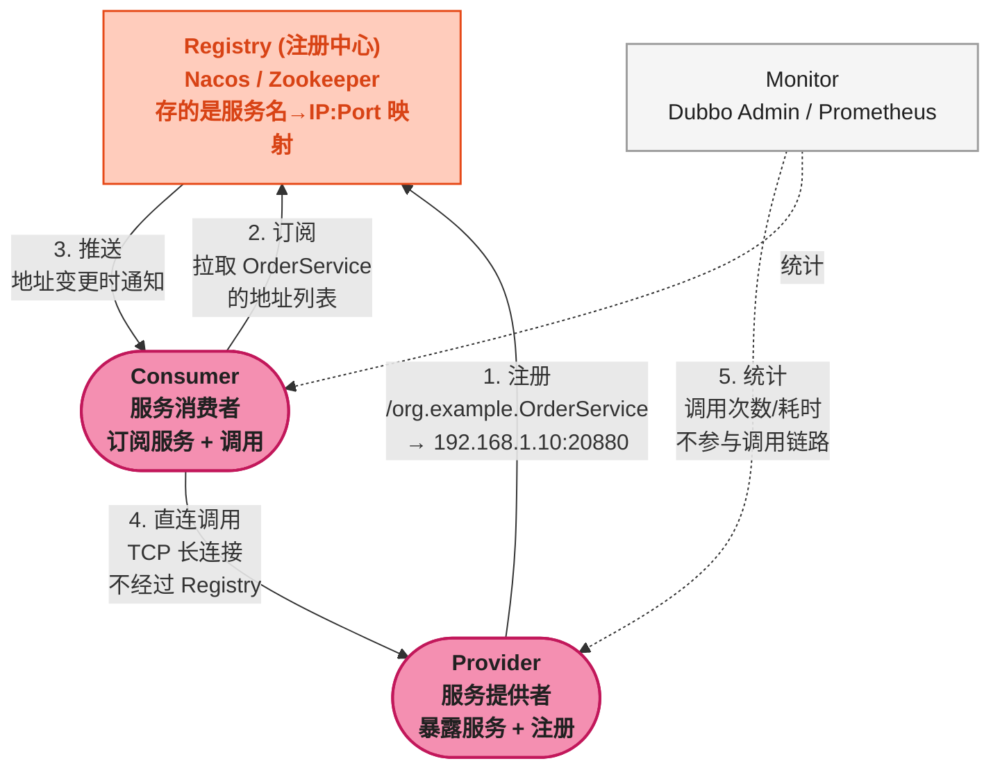

# Dubbo 核心架构

> 📖 <strong>前置阅读</strong>：本文假设读者理解基本的网络通信概念（TCP/IP、HTTP、序列化）。不需要预先了解 RPC——本文从零讲起。

## 一、⚡ 问题切入：HTTP REST 调用有什么"不够用"的？

互联网公司典型的微服务架构中，服务间通信最常见的方式是 HTTP REST：

```
订单服务 (OrderService)       →     商品服务 (ProductService)
GET /api/products/10001        →     返回 JSON {"id": 10001, "name": "iPhone", "stock": 50}
POST /api/orders               →     返回 JSON {"orderId": 20001, "status": "created"}
```

这套方案在<strong>服务数量少、调用量低</strong>时完全够用。但当公司扩张到几十个微服务、每秒上万次调用时，REST 的短板就暴露了：

| 痛点 | REST 的具体表现 |
|------|------|
| <strong>连接开销</strong> | 每次请求都需要建 TCP 连接（HTTP/1.1 支持复用但仍是短连接语义）——高并发时 CPU 和内存吃紧 |
| <strong>序列化冗余</strong> | JSON 文本格式——字段名重复传输，体量大、解析慢。对比二进制序列化，JSON 的带宽占用高出 3~10 倍 |
| <strong>弱类型契约</strong> | 没有强类型接口定义——调用方靠"文档"或"口头约定"知道参数和返回值类型。商品服务改了字段名，订单服务的代码编译通过、运行时崩 |
| <strong>路由单一</strong> | URL 路由——无法按业务特性做灰度发布、权重分配、同机房优先路由 |
| <strong>缺乏治理</strong> | 没有内置的负载均衡、熔断、限流——需要额外引入 Spring Cloud、Sentinel 等组件 |

这时候再看 Dubbo 的设计思路——<strong>不是把 HTTP 做得更好，而是用另一套协议和模型来替代 HTTP</strong>：

```
HTTP REST:  调用方 → 解析 URL → JSON 序列化 → HTTP 传输 → 反序列化 → 被调方
Dubbo RPC:  调用方 → 调用接口方法 → 二进制序列化 → TCP 长连接 → 反序列化 → 被调方
```

<strong>最关键的区别</strong>：REST 是"对资源的操作"，RPC 是"对方法的调用"。前者关注 URL + HTTP Method，后者关注 Interface + Method。

## 二、🧬 RPC 是什么：像调用本地方法一样调用远程方法

### 2.1 RPC 的核心思想

RPC（Remote Procedure Call）的目标是一句话——<strong>让远程方法调用看起来和本地方法调用一样</strong>。

```java
// 本地方法调用——你每天都在写
Order order = orderService.getOrderById(10001L);

// RPC 远程方法调用——看起来一模一样！
Order order = orderService.getOrderById(10001L);
// 区别是：orderService 不是一个普通的 Bean，而是一个远程代理对象
// 实际执行的是：序列化参数 → 网络传输 → 商品服务执行 → 序列化结果 → 返回
```

RPC 框架的工作就是<strong>把这行代码背后的所有网络操作透明化</strong>：



```mermaid
flowchart LR
    classDef startEnd fill:#F48FB1,stroke:#C2185B,stroke-width:2px,color:#212121,font-weight:bold;
    classDef process fill:#F5F5F5,stroke:#9E9E9E,stroke-width:1.5px,color:#212121;
    classDef data fill:#C8E6C9,stroke:#388E3C,stroke-width:1.5px,color:#1B5E20,font-weight:bold;
    classDef highlight fill:#FFCCBC,stroke:#E64A19,stroke-width:1.5px,color:#D84315,font-weight:bold;

    CONSUMER([调用方<br/>orderService.getOrderById 10001]) --> PROXY["RPC 代理层<br/>拦截方法调用"]
    PROXY --> SERIAL["序列化<br/>方法名 + 参数 → 二进制"]
    SERIAL --> NET["网络传输<br/>TCP 长连接"]
    NET --> DESERIAL["反序列化<br/>二进制 → 方法名 + 参数"]
    DESERIAL --> PROVIDER["服务提供方<br/>执行 getOrderById 10001"]
    PROVIDER --> RESULT[返回结果<br/>二进制 → Order 对象]
    RESULT --> CONSUMER

    class CONSUMER,PROVIDER startEnd;
    class PROXY highlight;
    class SERIAL,DESERIAL,NET,RESULT process;
```

### 2.2 RPC vs REST 本质对比

| 维度 | REST | RPC (Dubbo) |
|------|------|------|
| <strong>抽象模型</strong> | 资源（Resource）——URL 标识 | 方法（Method）——接口+方法标识 |
| <strong>协议</strong> | HTTP/1.1 文本协议 | TCP 长连接 + 二进制协议 |
| <strong>序列化</strong> | JSON / XML（文本，体量大） | Hessian2 / Protobuf（二进制，体量小） |
| <strong>连接模型</strong> | 短连接（每次请求建连，或复用连接池） | 长连接（Provider-Consumer 保活） |
| <strong>接口契约</strong> | 弱类型——靠文档约定 | 强类型——Java Interface 即契约 |
| <strong>服务治理</strong> | 外部组件（Spring Cloud、K8s） | 内置——负载均衡、容错、路由原生支持 |
| <strong>适用场景</strong> | 跨语言、对外 API、前后端通信 | <strong>Java 微服务内部通信、高吞吐低延迟</strong> |

> ⚠️ 新手提示：RPC 和 REST 不是互斥的。很多公司的架构是——<strong>对外暴露 REST API（给前端/第三方），内部服务间用 RPC（给微服务）</strong>。Dubbo 3.x 的 Triple 协议甚至支持浏览器直接访问——因为它基于 HTTP/2。

## 三、🗺️ Dubbo 核心架构：五大角色

### 3.1 三角架构：Registry-Provider-Consumer

Dubbo 的架构可以概括为<strong>一个 Registry、两种角色、一个 Monitor</strong>：



<strong>逐角色解释</strong>：

| 角色 | 职责 | 架构中的位置 |
|------|------|------|
| <strong>Registry（注册中心）</strong> | 存储"服务名 → 提供者地址列表"的映射关系。提供者启动时注册，消费者启动时订阅。地址变更时推送通知 | 控制面——<strong>只在启动和变更时通信，不参与运行时调用</strong> |
| <strong>Provider（服务提供者）</strong> | 暴露服务接口的实现，在指定端口上监听 RPC 请求。启动时向 Registry 注册自己 | 数据面——实际执行业务逻辑 |
| <strong>Consumer（服务消费者）</strong> | 调用远程服务。通过 Registry 发现 Provider 地址，建立 TCP 长连接直接调用 | 数据面——发起调用的入口 |
| <strong>Monitor（监控中心）</strong> | 收集调用次数、耗时、成功率等统计信息。不参与调用链路——挂了不影响业务 | 旁路——只管统计 |
| <strong>Container（容器）</strong> | 服务的运行环境——Spring 容器、Java 进程。Dubbo 文档列了这个角色，但 Spring 时代基本不关注 | — |

<strong>关键点</strong>：Registry 只在<strong>服务发现阶段</strong>起作用——Consumer 拿到 Provider 地址列表后，<strong>直连调用，不经过 Registry</strong>。这和消息队列完全不同——MQ 的 Broker 是消息必经之路，Dubbo 的 Registry 是"通讯录"，不是"中转站"。

### 3.2 Dubbo 和 RabbitMQ/RocketMQ/Kafka 的架构差异

搞过前面三个 MQ 的读者，这里有一个重要的思维转换：

| 架构特征 | 消息中间件（MQ） | Dubbo RPC |
|------|------|------|
| <strong>中心节点</strong> | Broker——所有消息必须经过 | Registry——只在服务发现时用 |
| <strong>运行时通信</strong> | Producer → Broker → Consumer | Consumer → Provider <strong>直连</strong> |
| <strong>中心节点挂了</strong> | 整个系统瘫痪 | 已发现的地址不受影响——Consumer 拿缓存地址继续调 |
| <strong>数据流</strong> | 异步——消息堆积在 Broker | 同步/异步——RPC 请求-响应 |
| <strong>持久化</strong> | Broker 持久化消息到磁盘 | 不持久化——RPC 是内存中的调用 |

> ⚠️ 新手提示：这是从 MQ 转到 RPC 最需要理解的区别。MQ 的 Broker 是"中介"——每笔交易都经手。Dubbo 的 Registry 是"黄页"——查完号码直接打，不通过黄页转接。Registry 宕机时，Consumer 用本地缓存的服务地址<strong>不受影响</strong>，只有新服务上下线时才感知不到。

## 四、Dubbo 的核心工作流程

### 4.1 一次远程调用的完整链路

```
Consumer 调用 orderService.getOrderById(10001)

① 代理拦截
   ↓   Consumer 持有的 orderService 是一个代理对象（Proxy）
   ↓   方法调用被代理拦截——进入 Dubbo 框架逻辑

② 服务发现
   ↓   从本地缓存的服务列表中获取 Provider 地址
   ↓   如果没有缓存 → 从 Registry 拉取

③ 负载均衡
   ↓   有三个 Provider 实例：192.168.1.10:20880, 192.168.1.11:20880, 192.168.1.12:20880
   ↓   根据负载均衡策略选一个——默认随机加权

④ 协议编码
   ↓   接口名（org.example.OrderService）
   ↓   方法名（getOrderById）
   ↓   参数类型（Long.class）
   ↓   参数值（10001L）
   ↓   → Hessian2 二进制序列化

⑤ 网络传输
   ↓   Netty TCP 长连接 → 发送到选中的 Provider

⑥ 协议解码
   ↓   Provider 收到二进制数据 → 反序列化
   ↓   → 接口名、方法名、参数类型、参数值

⑦ 反射调用
   ↓   根据接口名找到实现类 → 反射调用 getOrderById(10001L)
   ↓   拿到返回值 Order{id=10001, name="iPhone", price=6999}

⑧ 返回结果
   ↓   序列化返回值 → TCP → Consumer 反序列化 → 返回给调用方

⑨ 调用结束
   ↓   Consumer 拿到 Order 对象——就像本地方法返回的一样
```

整个链路中，<strong>Proxy（代理）</strong>是最关键的环节——它让"远程调用"对业务代码完全透明。

### 4.2 服务治理三要素

Dubbo 的名字来源于"服务治理"。服务治理指什么？三件事：

| 治理要素 | 解决的问题 | Dubbo 实现 |
|------|------|------|
| <strong>服务发现</strong> | Consumer 怎么知道 Provider 在哪？ | Registry——注册 + 订阅 + 推送 |
| <strong>负载均衡</strong> | 多个 Provider 怎么选？ | 内置七种策略——随机、轮询、最少活跃调用等 |
| <strong>容错</strong> | 调用失败了怎么办？ | 内置六种策略——Failover（默认重试）、Failfast、Failsafe 等 |

这三件事加起来就是 Dubbo 的核心价值——让开发者从"怎么调远程服务"的底层细节中解放出来。

## 五、🔧 Docker 安装（Nacos + Dubbo Admin）

### 5.1 Nacos 注册中心

Dubbo 支持多种注册中心（Nacos、Zookeeper、Redis、Consul）。3.x 推荐 Nacos——它同时做<strong>注册中心 + 配置中心</strong>：

```bash
# 单机 Nacos（内置 Derby 数据库）
docker run -d --name nacos \
  -e MODE=standalone \
  -p 8848:8848 \
  -p 9848:9848 \
  nacos/nacos-server:v2.3.0
```

访问 `http://localhost:8848/nacos`，用户名/密码：`nacos/nacos`。服务注册后可以在"服务列表"中看到。

### 5.2 Dubbo Admin 管理控制台

```bash
docker run -d --name dubbo-admin \
  -p 8081:8080 \
  -e admin.registry.address=nacos://localhost:8848 \
  -e admin.config-center=nacos://localhost:8848 \
  apache/dubbo-admin:latest
```

访问 `http://localhost:8081`，可以看到服务列表、调用关系、流量统计。

## 六、👋 第一条远程调用（纯 Dubbo + Spring 原生）

Dubbo 不依赖 SpringBoot——它最初就是为 Spring 设计的。下面用原生 Spring XML 搭一个最简示例。

### 6.1 定义公共接口（API 模块）

```java
// dubbo-api/src/main/java/org/example/api/Order.java
@Data
@NoArgsConstructor
@AllArgsConstructor
public class Order implements Serializable {
    private Long orderId;
    private String productName;
    private BigDecimal amount;
}

// dubbo-api/src/main/java/org/example/api/OrderService.java
public interface OrderService {
    /**
     * 根据订单 ID 查询订单
     */
    Order getOrderById(Long orderId);
}
```

<strong>公共接口是 Dubbo 的契约</strong>——Provider 实现它，Consumer 通过它调用。两者共享同一个 API 模块（JAR）。

### 6.2 Provider（服务提供者）

```java
// dubbo-provider/src/main/java/org/example/provider/OrderServiceImpl.java
public class OrderServiceImpl implements OrderService {

    @Override
    public Order getOrderById(Long orderId) {
        // 模拟从数据库查询
        System.out.printf("[Provider] 收到请求: orderId=%d%n", orderId);
        return new Order(orderId, "iPhone 15", new BigDecimal("6999.00"));
    }
}
```

Provider 的 Spring XML 配置：

```xml
<!-- dubbo-provider/src/main/resources/dubbo-provider.xml -->
<beans xmlns="http://www.springframework.org/schema/beans"
       xmlns:dubbo="http://dubbo.apache.org/schema/dubbo"
       xmlns:xsi="http://www.w3.org/2001/XMLSchema-instance"
       xsi:schemaLocation="http://www.springframework.org/schema/beans
           http://www.springframework.org/schema/beans/spring-beans.xsd
           http://dubbo.apache.org/schema/dubbo
           http://dubbo.apache.org/schema/dubbo/dubbo.xsd">

    <!-- ① 服务名称——全局唯一 -->
    <dubbo:application name="order-provider"/>

    <!-- ② 注册中心——Nacos -->
    <dubbo:registry address="nacos://localhost:8848"/>

    <!-- ③ 协议——dubbo 协议，监听 20880 端口 -->
    <dubbo:protocol name="dubbo" port="20880"/>

    <!-- ④ 暴露服务——将 OrderServiceImpl 注册为 OrderService 的提供者 -->
    <dubbo:service interface="org.example.api.OrderService"
                   ref="orderService"/>

    <!-- ⑤ 服务实现 Bean -->
    <bean id="orderService" class="org.example.provider.OrderServiceImpl"/>
</beans>
```

```java
public class ProviderApp {
    public static void main(String[] args) throws IOException {
        ClassPathXmlApplicationContext context =
                new ClassPathXmlApplicationContext("dubbo-provider.xml");
        context.start();
        System.out.println("Provider 已启动，按任意键退出...");
        System.in.read();  // 阻塞——不让进程退出
    }
}
```

### 6.3 Consumer（服务消费者）

Consumer 的 Spring XML 配置：

```xml
<!-- dubbo-consumer/src/main/resources/dubbo-consumer.xml -->
<beans xmlns="http://www.springframework.org/schema/beans"
       xmlns:dubbo="http://dubbo.apache.org/schema/dubbo"
       xmlns:xsi="http://www.w3.org/2001/XMLSchema-instance"
       xsi:schemaLocation="http://www.springframework.org/schema/beans
           http://www.springframework.org/schema/beans/spring-beans.xsd
           http://dubbo.apache.org/schema/dubbo
           http://dubbo.apache.org/schema/dubbo/dubbo.xsd">

    <!-- ① Consumer 应用名 -->
    <dubbo:application name="order-consumer"/>

    <!-- ② 注册中心——和 Provider 同一个 -->
    <dubbo:registry address="nacos://localhost:8848"/>

    <!-- ③ 引用远程服务——创建 OrderService 的代理对象 -->
    <dubbo:reference id="orderService"
                     interface="org.example.api.OrderService"/>
</beans>
```

```java
public class ConsumerApp {
    public static void main(String[] args) {
        ClassPathXmlApplicationContext context =
                new ClassPathXmlApplicationContext("dubbo-consumer.xml");
        context.start();

        // 从 Spring 容器获取 OrderService 的代理对象
        // 注意：Consumer 没有 OrderServiceImpl！
        // 这个 Bean 是 Dubbo 生成的代理——调用它的方法会走 RPC 链路
        OrderService orderService = context.getBean(OrderService.class);

        // 调用远程方法——看起来和本地方法一样
        Order order = orderService.getOrderById(10001L);

        System.out.printf("[Consumer] 收到结果: orderId=%d, product=%s, amount=%s%n",
                order.getOrderId(), order.getProductName(), order.getAmount());
        // 输出：[Consumer] 收到结果: orderId=10001, product=iPhone 15, amount=6999.00
    }
}
```

<strong>逐行解释 Consumer 发生了什么</strong>：

| 步骤 | XML / 代码 | Dubbo 背后做了什么 |
|------|------|------|
| `dubbo:reference` | 声明引用远程服务 | Dubbo 向 Nacos 查询 `OrderService` 的提供者地址列表 → 拿到 `192.168.1.10:20880` |
| `context.getBean(OrderService.class)` | 拿到 Bean | Dubbo 返回一个<strong>动态代理对象</strong>——实现了 `OrderService` 接口 |
| `orderService.getOrderById(10001L)` | 调用方法 | 代理拦截 → Hessian2 序列化 → TCP 发送到 20880 → Provider 执行 → 返回结果反序列化 |

### 6.4 依赖

```xml
<dependency>
    <groupId>org.apache.dubbo</groupId>
    <artifactId>dubbo</artifactId>
    <version>3.3.0</version>
</dependency>
<dependency>
    <groupId>com.alibaba.nacos</groupId>
    <artifactId>nacos-client</artifactId>
    <version>2.3.0</version>
</dependency>
<!-- Dubbo 默认用 Hessian2 序列化，不需要额外依赖 -->
```

### 6.5 验证

```bash
# 1. 确认 Nacos 在运行
curl http://localhost:8848/nacos/v1/console/health/liveness

# 2. 启动 Provider
mvn -pl dubbo-provider exec:java
# 输出：Provider 已启动

# 3. 在 Nacos 管理页面确认服务已注册
# http://localhost:8848/nacos → 服务列表 → 看到 order-provider → 详情中有 org.example.api.OrderService

# 4. 启动 Consumer
mvn -pl dubbo-consumer exec:java
# Provider 控制台输出：[Provider] 收到请求: orderId=10001
# Consumer 控制台输出：[Consumer] 收到结果: orderId=10001, product=iPhone 15, amount=6999.00
```

## 🎯 总结

1. <strong>RPC 的核心目标</strong>：像调用本地方法一样调用远程方法。代理层拦截方法调用、序列化参数、网络传输、反射执行——整个过程对业务代码透明。

2. <strong>Dubbo 三角架构</strong>：Registry（服务发现）+ Provider（服务暴露）+ Consumer（服务调用）。Registry 是"黄页"不是"中介"——运行时直连，不经过 Registry。

3. <strong>REST vs RPC 的选择</strong>：对外 API 用 REST（跨语言、浏览器友好），Java 微服务内部通信用 RPC（二进制、长连接、强契约）。不是互斥，是互补。

4. <strong>Dubbo 3.x 的推荐栈</strong>：Nacos（注册中心）+ Dubbo 协议（TCP 长连接 + Hessian2）+ Triple 协议（HTTP/2 + Protobuf，下一篇展开）。

Docker Nacos + Dubbo Admin + 原生 Spring XML 的第一条远程调用已跑通。下一篇用 SpringBoot 替代这套 XML 配置。

> 📖 <strong>下一步阅读</strong>：原生 Dubbo + Spring XML 的模式跑通了，但真实项目用 SpringBoot。继续阅读 [<strong>SpringBoot Dubbo 全操作指南</strong>]()——用 `@DubboService` 和 `@DubboReference` 两个注解替代所有 XML。
