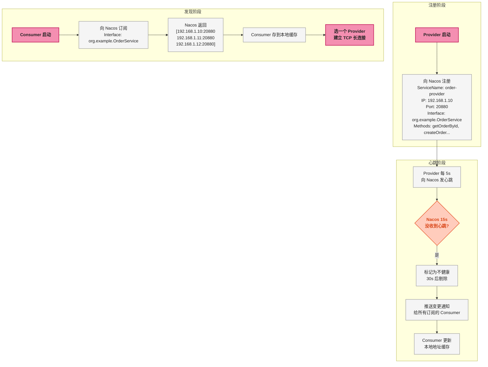

# Dubbo 注册中心：Nacos 与 Zookeeper

> 📖 <strong>前置阅读</strong>：本文假设读者已掌握 Dubbo 的基本 RPC 开发和集群容错配置。如果还不熟悉，建议先阅读 [<strong>SpringBoot Dubbo 全操作指南</strong>]() 和 [<strong>集群容错与负载均衡</strong>]()。

## 一、⚡ 问题切入：Registry 到底是什么？

前面三篇反复提到"注册中心"——Provider 向它注册，Consumer 从它订阅。但注册中心不只是一个"存地址的地方"：

| 注册中心的职责 | 具体行为 |
|------|------|
| <strong>服务注册</strong> | Provider 启动时把"IP:Port + 接口名 + 元数据"写入 Registry |
| <strong>服务发现</strong> | Consumer 启动时从 Registry 拉取"接口名 → 地址列表"的映射 |
| <strong>健康检查</strong> | 检测 Provider 是否存活——不存活就剔除 |
| <strong>变更推送</strong> | Provider 地址列表变化时，主动通知 Consumer |
| <strong>配置管理</strong>（Nacos） | 动态下发配置——不需要重启应用 |

<strong>关键点</strong>：Registry 只在<strong>服务发现阶段</strong>起作用。Consumer 拿到 Provider 地址后——<strong>直连调用，不经过 Registry</strong>。这是和 MQ 的 Broker 最本质的区别。

## 二、服务注册与发现的全链路

### 2.1 详细流程



### 2.2 注册中心的存储结构

以 Nacos 为例，注册的数据长这样：

```
Namespace: public (默认)
  └── Group: DEFAULT_GROUP
       └── Service: providers:org.example.OrderService:::
              ├── Instance: 192.168.1.10:20880
              │    ├── metadata: {dubbo.metadata.revision=xxx, ...}
              │    ├── weight: 100
              │    ├── healthy: true
              │    └── enabled: true
              ├── Instance: 192.168.1.11:20880
              └── Instance: 192.168.1.12:20880
```

<strong>这里的层级关系</strong>：

| 层级 | 含义 | Dubbo 中的应用 |
|------|------|------|
| Namespace | 租户隔离——不同环境用不同 Namespace | `dev` / `test` / `prod` |
| Group | 同环境内的进一步分组 | `DEFAULT_GROUP`（Dubbo 默认） |
| Service | 服务名——包含接口名 + 版本 + 分组 | `providers:org.example.OrderService:::1.0.0` |
| Instance | 具体的 Provider 实例 | IP + Port + 元数据 |

### 2.3 本地地址缓存 —— Registry 宕机的底气

Consumer 拿到 Provider 地址列表后——<strong>缓存到本地内存 + 磁盘文件</strong>：

```
缓存的存储位置（默认）：
  ~/.dubbo/dubbo-registry-{applicationName}-{registryAddress}.cache

文件内容示例：
  org.example.OrderService=192.168.1.10:20880,192.168.1.11:20880

Registry 宕机时：
  Consumer 用缓存文件中的地址继续调用——不受影响
  只有新 Provider 上线 / 老 Provider 下线时才感知不到
```

这就是 Dubbo 说"Registry 挂了不影响调用"的原因——<strong>本地缓存兜底</strong>。

```yaml
# 缓存文件路径可以自定义
dubbo:
  registry:
    address: nacos://localhost:8848
    file: /data/dubbo/cache/registry-cache
```

## 三、Nacos vs Zookeeper 选型

### 3.1 本质区别

| 维度 | Nacos | Zookeeper |
|------|------|------|
| <strong>定位</strong> | 注册中心 + 配置中心——一体化 | 分布式协调服务——CP 强一致性 |
| <strong>CAP</strong> | AP（优先可用性）——可选择 CP | CP（优先一致性）——不可动摇 |
| <strong>一致性协议</strong> | Distro（AP 模式）+ Raft（CP 模式） | ZAB（类似 Raft） |
| <strong>健康检查</strong> | 客户端心跳 + 服务端主动探测（TCP/HTTP/MySQL） | 客户端 TCP 长连接——断开即剔除 |
| <strong>配置管理</strong> | 原生支持——实时推送 | 不支持——需要额外组件 |
| <strong>多数据中心</strong> | 原生支持 | 不原生支持 |
| <strong>运维复杂度</strong> | 低——单机即可（开发环境） | 中——至少 3 台才能用（奇数个） |
| <strong>Dubbo 3.x 推荐</strong> | ✅ 首选 | ✅ 兼容——存量迁移 |

### 3.2 Nacos 的 AP vs CP 模式

```yaml
# AP 模式（默认）——优先可用性
# 网络分区时：各分区的 Nacos 节点独立工作——可能出现短暂不一致
# 适用场景：一般微服务——容忍几秒的注册信息不一致
dubbo:
  registry:
    address: nacos://localhost:8848

# CP 模式——优先一致性
# 网络分区时：只有 Leader 能写——牺牲可用性保证一致
# 适用场景：支付、金融——不能有"某个节点看到的地址列表和别的节点不一样"
dubbo:
  registry:
    address: nacos://localhost:8848?nacos.cp=true
```

### 3.3 Zookeeper 在 Dubbo 中的使用

```yaml
# Zookeeper 作为注册中心
dubbo:
  registry:
    address: zookeeper://192.168.1.10:2181?backup=192.168.1.11:2181,192.168.1.12:2181
```

Zookeeper 的存储结构：

```
/dubbo
  └── /org.example.OrderService
       └── /providers
            ├── /dubbo%3A%2F%2F192.168.1.10%3A20880...  (临时节点)
            ├── /dubbo%3A%2F%2F192.168.1.11%3A20880...
            └── /dubbo%3A%2F%2F192.168.1.12%3A20880...
       └── /consumers
            ├── /consumer%3A%2F%2F192.168.1.20...
            └── /consumer%3A%2F%2F192.168.1.21...
```

ZK 使用<strong>临时节点</strong>做健康检查——Provider 和 ZK 之间是一个 TCP 长连接。连接断开 → 临时节点自动删除 → Consumer 收到变更通知 → 从地址列表中移除。

### 3.4 选型建议

```
Nacos（推荐）：
  - Dubbo 3.x 的默认和推荐注册中心
  - 同时需要注册中心 + 配置中心 → Nacos 一个搞定
  - AP 模式满足大多数微服务场景

Zookeeper（兼容）：
  - 公司已有 ZK 集群——不想多运维一套系统
  - 需要强一致性（CP 模式）
  - Dubbo 2.x 的老项目——ZK 是默认注册中心
```

## 四、配置中心 —— Nacos 的第二个身份

### 4.1 为什么需要配置中心

微服务有几十个实例——改一个超时时间，逐个改 yml 然后重启？Nacos 配置中心解决这个问题：

```yaml
# 把 timeout 从 yml 移到 Nacos 配置中心
# Nacos 中发布配置变更 → 所有 Dubbo 实例实时生效 → 不需要重启
```

### 4.2 SpringBoot 集成 Nacos 配置中心

```xml
<!-- 额外依赖——Nacos 配置中心 -->
<dependency>
    <groupId>com.alibaba.nacos</groupId>
    <artifactId>nacos-spring-context</artifactId>
    <version>2.3.0</version>
</dependency>
```

```yaml
# application.yml——保持连接信息等不变配置
dubbo:
  application:
    name: order-provider
  registry:
    address: nacos://localhost:8848
  protocol:
    name: dubbo
    port: 20880

# Nacos 配置中心连接信息
nacos:
  config:
    server-addr: localhost:8848
    namespace: dev              # 命名空间——隔离不同环境
    group: DEFAULT_GROUP
    data-id: dubbo-order-provider-config  # 配置文件的 dataId
```

在 Nacos 控制台创建配置（`http://localhost:8848/nacos`）：
- Data ID: `dubbo-order-provider-config`
- Group: `DEFAULT_GROUP`
- 配置内容:

```yaml
# Nacos 中的动态配置
dubbo:
  provider:
    timeout: 5000           # RPC 调用超时——5s
    retries: 1              # 重试 1 次
    loadbalance: leastactive  # 负载均衡策略
    actives: 200            # 最大并发调用数
```

修改 Nacos 中的 `timeout: 3000` → 所有 Provider 实例实时生效 → Consumer 下次调用就在 3 秒内超时。

### 4.3 什么配置放 Nacos、什么配置留 yml

| 放 Nacos（动态） | 留 yml（静态） |
|------|------|
| 超时时间 `timeout` | 注册中心地址 `registry.address` |
| 重试次数 `retries` | 协议端口 `protocol.port` |
| 负载均衡策略 `loadbalance` | 应用名称 `application.name` |
| 并发限制 `actives` | 序列化方式 `serialization` |
| 线程池大小 | 协议名称 `protocol.name` |
| 限流阈值 | Nacos 连接信息 |

<strong>原则</strong>：运行时可能需要调整的值放 Nacos，连接基础设施的值留 yml。

## 五、多注册中心

### 5.1 什么时候需要多注册中心

| 场景 | 示例 |
|------|------|
| <strong>双活部署</strong> | 两个数据中心各有一个 Nacos 集群——注册到离自己最近的 |
| <strong>注册中心迁移</strong> | 从 Zookeeper 迁移到 Nacos——过渡期双注册 |
| <strong>跨环境调用</strong> | Consumer 在 `dev` 环境，需要同时调 `dev` 和 `test` 的 Provider |
| <strong>消费者跨注册中心</strong> | 订单服务需要调商品服务（Nacos A）和支付服务（Nacos B） |

### 5.2 双注册中心配置

```yaml
dubbo:
  registries:
    beijing:
      address: nacos://nacos-bj.internal:8848
      default: true           # 默认注册中心——Provider 向这里注册
    shanghai:
      address: nacos://nacos-sh.internal:8848
```

```java
// Provider——同时注册到两个注册中心
@DubboService(registry = {"beijing", "shanghai"})
public class OrderServiceImpl implements OrderService { ... }

// Consumer——只从北京注册中心订阅（优先同机房）
@DubboReference(registry = "beijing")
private OrderService orderService;

// Consumer——从上海注册中心订阅另一个服务
@DubboReference(registry = "shanghai")
private PaymentService paymentService;
```

### 5.3 从 Zookeeper 迁移到 Nacos 的过渡方案

```yaml
# 过渡期——Consumer 同时订阅两个注册中心
dubbo:
  registries:
    zk-legacy:
      address: zookeeper://zk.internal:2181
    nacos-new:
      address: nacos://nacos.internal:8848
      default: true
```

```java
// Provider 从 ZK → Nacos 迁移过程：
// 第一阶段：老 Provider 只注册到 ZK，新 Provider 只注册到 Nacos
// 第二阶段：Consumer 同时订阅 ZK 和 Nacos——合并两个地址列表
// 第三阶段：Consumer 切到只订阅 Nacos → 老 Provider 下线
@DubboReference(registry = {"zk-legacy", "nacos-new"})
private OrderService orderService;
```

## 六、常见故障与排查

| 故障 | 现象 | 排查 |
|------|------|------|
| <strong>Consumer 报 No provider available</strong> | 启动时报错（`check=true`）或调用时报错（`check=false`） | ① Nacos 服务列表中 Provider 是否存在 ② Provider 是否和 Consumer 在同一个 Namespace ③ `version` 或 `group` 是否匹配 |
| <strong>Provider 已注册但 Consumer 列表里没有</strong> | Nacos 里看得到 Provider，但 Consumer 调不到 | ① 检查 `dubbo.registry.address` 是否和 Nacos 控制台中看到的地址一致 ② Consumer 缓存没刷新——删掉 `~/.dubbo/` 下的缓存文件 |
| <strong>注册中心宕机后 Consumer 报错</strong> | 本来正常，Nacos 宕机后就调不通 | Consumer 的本地缓存文件被清理了——删掉后重启时 Registry 不可用就无法发现服务。保留缓存文件 |
| <strong>Provider 频繁上下线</strong> | Nacos 服务列表里 Provider 反复出现/消失 | ① Provider 的心跳是否稳定——检查网络 ② `nacos.naming.clean.empty-service.interval` 是否太短 ③ GC 停顿超 15s 导致心跳丢失 |
| <strong>Nacos 1.x 升级到 2.x 后 Dubbo 连不上</strong> | Dubbo 3.x + Nacos 2.x 需要 gRPC 端口 | Nacos 2.x 新增了 gRPC 端口（默认偏移 1000，即 9848）——Dubbo 需要这个端口。确认 `-p 9848:9848` 已映射 |

## 🎯 总结

1. <strong>Registry 是"黄页"，不是"中转站"</strong>：Provider 注册、Consumer 发现——之后直连调用。Registry 宕机不影响已有连接的调用（本地缓存兜底），只影响新服务的发现和变更通知。

2. <strong>Nacos 是 Dubbo 3.x 的首选</strong>：同时做注册中心 + 配置中心——一个组件替代 Zookeeper + Apollo/Spring Cloud Config。AP 模式默认满足大多数场景，CP 模式可选。

3. <strong>配置中心让参数动态生效</strong>：`timeout`、`retries`、`loadbalance` 等运维参数放在 Nacos 控制台——修改后实时生效，不需要重启应用。但连接性参数（端口、注册中心地址）留在 yml。

4. <strong>多注册中心用于过渡和双活</strong>：同时注册到多个注册中心——支持从 ZK 迁移到 Nacos、跨数据中心双活、跨环境调用。

> 📖 <strong>下一步阅读</strong>：注册中心的底层搞清楚了。接下来是 Dubbo 3.x 的两大革新——Triple 协议（HTTP/2 + Protobuf）和应用级服务发现。继续阅读 [<strong>Dubbo 3.x 新特性</strong>]()。
