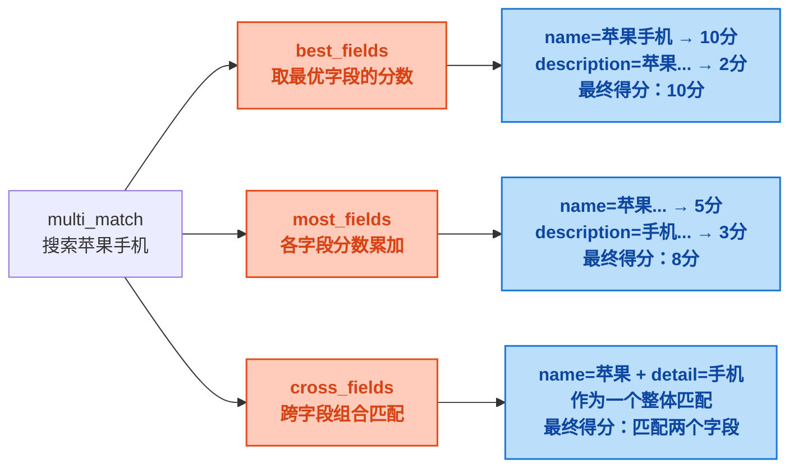
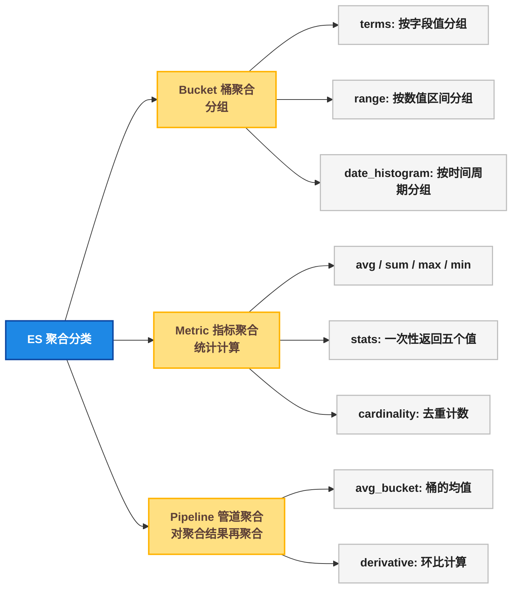

# ES 高级搜索

> 📖 <strong>前置阅读</strong>：本文是 ES 系列的<strong>进阶篇</strong>，假设读者已经掌握了 ES 核心概念（倒排索引、分词器、Mapping）和 SpringBoot 的基本操作。如果还没有，建议先阅读前两篇：
> - [<strong>Elasticsearch 核心概念：倒排索引、分词器与 REST API 全解析</strong>]() —— 介绍篇
> - [<strong>SpringBoot Elasticsearch 全操作指南</strong>]() —— 实战篇

## 一、⚡ 问题切入：搜索结果不够准怎么办？

前面两篇学完，你已经可以搭建一个"能搜"的商品搜索功能了。但用户搜"苹果手机"时，排名第一的可能是"苹果水果礼盒"——因为倒排索引中"苹果"这个词也出现了。

问题出在几个地方：
- 用户搜"苹果手机"时，<strong>商品名包含"苹果手机"这四个字的应该排在最前面</strong>，但基础 `match` 查询没有考虑字段匹配的完整度
- 商品<strong>标题</strong>命中的权重应该比<strong>描述</strong>命中的权重更高，但基础查询一视同仁
- 用户期望<strong>按销量和评分来影响排序</strong>，而不仅仅是文本相关性
- 输入"苹果手鸡"应该能<strong>自动纠错</strong>成"苹果手机"

本篇要解决的问题就是：<strong>怎么让搜索结果更准、排序更合理、用户体验更接近 Google 搜索</strong>。

## 二、🔍 全文搜索再深入

### 2.1 multi_match —— 多字段搜索

第一篇的 `match` 查询只搜一个字段。实际产品中，搜索词可能同时匹配商品名、品牌名、描述等多个字段——用户输入"华为手机"，应该既搜 `name` 也搜 `description`，甚至搜 `brand`。

`multi_match` 就是为此而生的。它有三种模式，差异在于<strong>多字段之间如何计算和合并相关性分数</strong>：



<strong>best_fields（默认模式）</strong>：搜索词在所有字段中分别执行匹配，取<strong>分数最高的那个字段</strong>作为最终得分。适合"搜索词大概率完整出现在某一个字段中"的场景——比如用户搜完整商品名。

```bash
GET /product/_search
{
  "query": {
    "multi_match": {
      "query": "华为Mate60",
      "fields": ["name^3", "brand", "description"],
      "type": "best_fields"
    }
  }
}
```

`name^3` 中的 `^3` 是<strong>字段权重（boost）</strong>——商品名命中的权重是品牌名的 3 倍。这样即使品牌也是"华为"，匹配到商品名的文档分数更高。

```java
// Java 代码
NativeQuery query = NativeQuery.builder()
    .withQuery(QueryBuilders.multiMatch()
        .query("华为Mate60")
        .fields(Map.of(
            "name", 3.0f,
            "brand", 1.0f,
            "description", 1.0f
        ))
        .build())
    .build();
```

<strong>most_fields</strong>：每个字段分别算分，然后<strong>累加</strong>。适合"搜索词可能分散在不同字段中"的场景。

```bash
# 搜"华为 拍照"——"华为"出现在品牌字段，"拍照"出现在描述字段
# best_fields 只能拿到一个字段的分（要么 5 分，要么 3 分）
# most_fields 把两个字段的分加起来（5 + 3 = 8 分）
{
  "query": {
    "multi_match": {
      "query": "华为 拍照",
      "fields": ["name^2", "brand", "description"],
      "type": "most_fields"
    }
  }
}
```

<strong>cross_fields</strong>：把多个字段当作一个大的"虚拟字段"来对待。搜索词被分词后，每个 Term 分别去不同字段中查找。适合<strong>人名搜索</strong>（"张三"的姓和名可能在不同字段中）、<strong>地址搜索</strong>等场景。

```bash
# 用户搜索"张三 北京" → "张三"在 name 字段，"北京"在 city 字段
{
  "query": {
    "multi_match": {
      "query": "张三 北京",
      "fields": ["name", "city", "company"],
      "type": "cross_fields",
      "operator": "and"           # 要求所有 Term 都匹配
    }
  }
}
```

<strong>三种模式选型表</strong>：

| 模式 | 算法 | 适用场景 | 注意 |
|------|------|----------|------|
| `best_fields` | 取最高分字段 | 搜索词完整出现在一个字段（商品名搜索） | 字段权重 `^N` 很重要 |
| `most_fields` | 各字段分数累加 | 搜索词分散在多字段（综合搜索） | 需要考虑字段长度对分数的影响 |
| `cross_fields` | Term 中心化计分 | 跨字段匹配（人名、地址） | 字段的 analyzer 需兼容 |

### 2.2 match_phrase —— 短语匹配

用户搜"华为手机"时，普通 `match` 查询只要文档包含"华为"和"手机"两个词就算命中——哪怕两个词分别在文档头和文档尾。`match_phrase` 要求这两个词<strong>相邻出现且顺序一致</strong>。

```bash
# match：只要求文档包含"华为"和"手机"，位置不限
# 匹配：doc1="华为旗舰手机"  doc2="手机壳适用于华为"...  都会命中

# match_phrase：要求"华为"和"手机"相邻，且顺序一致
# 匹配：doc1="华为手机"      位置的词："华为"(pos0) "手机"(pos1)
# 不匹配：doc2="手机壳适用于华为" — 因为"手机"在"华为"前面
GET /product/_search
{
  "query": {
    "match_phrase": {
      "name": "华为手机"
    }
  }
}
```

`slop` 参数控制允许词条之间的<strong>间隔</strong>。`slop: 1` 表示允许两个词之间隔一个词：

```bash
# slop: 0（默认）：只匹配"华为手机"
# slop: 1：匹配"华为Mate60手机"（"华为"和"手机"之间隔了一个"Mate60"）
# slop: 2：匹配"华为最新款手机"（"华为"和"手机"之间隔了"最新款"）
GET /product/_search
{
  "query": {
    "match_phrase": {
      "name": {
        "query": "华为手机",
        "slop": 2
      }
    }
  }
}
```

`slop` 越大，召回率越高但精确度越低。一般建议 `slop` 不超过 2-3。

```java
// Java 代码
NativeQuery query = NativeQuery.builder()
    .withQuery(QueryBuilders.matchPhrase()
        .field("name")
        .query("华为手机")
        .slop(2)
        .build())
    .build();
```

### 2.3 query_string —— 类 Google 搜索语法

`query_string` 允许用户在搜索框里使用类似 Google 的搜索语法——AND / OR / NOT / 括号 / 通配符：

```bash
# 搜索包含"华为"和"手机"但不包含"二手"的商品
GET /product/_search
{
  "query": {
    "query_string": {
      "query": "(华为 OR 小米) AND 手机 NOT 二手",
      "fields": ["name", "description"]
    }
  }
}
```

支持的语法：

| 语法 | 示例 | 含义 |
|------|------|------|
| `AND` / `OR` | `华为 AND 手机` | 两者都包含 / 任一包含 |
| `NOT` / `-` | `手机 NOT 二手` | 排除包含"二手"的 |
| `"短语"` | `"华为手机"` | 短语精确匹配 |
| `*` / `?` | `华*` / `手?` | 通配符 |
| `field:value` | `brand:华为` | 指定字段搜索 |
| `()` 分组 | `(华为 OR 小米) AND 手机` | 逻辑分组 |
| `~` 模糊 | `苹果~` | 模糊搜索（纠错） |

> ⚠️ 新手提示：`query_string` 虽然强大，但<strong>性能开销大</strong>。通配符搜索（`*`）不做分词，需要遍历 Term Dictionary 做前缀匹配。如果用户直接输入 `*手机*` 这种前后通配的表达式，ES 会遍历所有 Term，查询极慢。生产环境建议<strong>限制用户的搜索语法</strong>，或者用 `query_string` 的 `analyze_wildcard: true` 参数把通配符也分词处理。

### 2.4 fuzzy 模糊查询 —— 拼写纠错

用户输入"iphone"（少了一个 n）时，普通 `match` 查不到任何关于"iphone"的结果。`fuzzy` 查询通过<strong>编辑距离（Levenshtein Distance）</strong>容忍一定程度的拼写错误：

```bash
# 搜索"iphone"，自动匹配"iphone"、"iphone"附近的词
GET /product/_search
{
  "query": {
    "fuzzy": {
      "name": {
        "value": "iphone",
        "fuzziness": "AUTO"
      }
    }
  }
}
```

`fuzziness` 参数控制允许的编辑距离：
- `AUTO`（推荐）：自动根据 Term 长度调整。3 字母以下不纠错（太短不具可区分性），3-5 字母允许 1 个编辑距离，5 字母以上允许 2 个
- `1`：固定允许 1 个编辑距离
- `2`：固定允许 2 个编辑距离

编辑距离的定义：<strong>将一个字符串变成另一个字符串所需的最少单字符编辑操作次数</strong>（插入、删除、替换）。`"iphone" → "iphone"` 需要 1 次（插入 `n`），编辑距离 = 1。

```java
// Java 代码
NativeQuery query = NativeQuery.builder()
    .withQuery(QueryBuilders.fuzzy()
        .field("name")
        .value("iphone")
        .fuzziness("AUTO")
        .build())
    .build();
```

`fuzzy` 可以做在 `match` 查询中作为参数：

```bash
GET /product/_search
{
  "query": {
    "match": {
      "name": {
        "query": "iphone",
        "fuzziness": "AUTO"
      }
    }
  }
}
```

## 三、🧱 Bool Query 组合查询 —— 搜索的乐高积木

### 3.1 四种子句

`bool` 查询是 ES 查询体系的<strong>核心骨架</strong>——所有复杂搜索都是 `bool` 查询的不同组合。它由四种子句构成：

```
bool = must（必须满足 + 参与算分）
     + filter（必须满足 + 不参与算分 + 走缓存）
     + should（满足的越多分越高）
     + must_not（必须不满足）
```

```bash
GET /product/_search
{
  "query": {
    "bool": {
      "must": [
        { "match": { "name": "手机" } }
      ],
      "filter": [
        { "term": { "category": "手机" } },
        { "range": { "price": { "gte": 3000, "lte": 8000 } } }
      ],
      "should": [
        { "match": { "name": "华为" } },
        { "match": { "description": "5G" } }
      ],
      "must_not": [
        { "term": { "brand": "二手" } }
      ],
      "minimum_should_match": 1
    }
  }
}
```

### 3.2 must vs filter 的核心区别

这是 ES 搜索性能优化的第一个分水岭：

| | must | filter |
|------|------|--------|
| **相关性评分** | 参与计算 `_score` | 不计算，分数为 0 |
| **结果缓存** | 不缓存（与搜索词相关） | <strong>LRU Query Cache</strong> 自动缓存 |
| **性能** | 每次查询都要重新算分 | 命中缓存后几乎是零开销 |
| **典型场景** | 搜索关键词 | 状态筛选、分类筛选、价格区间、日期范围 |

`filter` 的缓存机制：ES 把相同的 filter 条件对应的文档 ID 集合（BitSet）缓存起来。下一次执行相同 filter 时直接返回缓存结果，<strong>不需要再查倒排索引</strong>。对于不变的过滤条件（如分类、状态、价格区间），一律用 filter。

```java
NativeQuery query = NativeQuery.builder()
    .withQuery(QueryBuilders.bool()
        .must(QueryBuilders.match().field("name").query("手机").build())
        .filter(QueryBuilders.term().field("brand").value("华为").build())
        .filter(QueryBuilders.range().field("price").gte(3000.0).lte(8000.0).build())
        .build())
    .build();
```

### 3.3 should 与 minimum_should_match

`should` 是<strong>加分项</strong>——满足的 should 条件越多，文档的 `_score` 越高，但不满足也不影响命中。

<strong>当 bool 查询中没有 must 和 filter 时</strong>，`should` 的行为会发生变化：至少有一个 should 条件必须满足（即 `minimum_should_match` 默认为 1）。有 must 或 filter 时，should 变成纯粹的加分项。

```bash
# 场景：搜索"手机"，把"5G"和"拍照"作为加分项
# 包含"5G"的+2分，包含"拍照"的+1分，两者都包含的+3分
GET /product/_search
{
  "query": {
    "bool": {
      "must": [
        { "match": { "name": "手机" } }
      ],
      "should": [
        { "match": { "description": { "query": "5G", "boost": 2 } } },
        { "match": { "description": { "query": "拍照", "boost": 1 } } }
      ]
    }
  }
}
```

### 3.4 bool 查询的综合示例

一个完整的商品搜索条件组合：

```bash
# 搜索逻辑：
# - 必须包含"手机"（全文搜索）
# - 必须是上架状态、价格在 3000-8000
# - 如果包含"5G"或"拍照"加分（should）
# - 排除二手
# - 相关性优先，销量次之
GET /product/_search
{
  "query": {
    "bool": {
      "must":      [{ "match": { "name": "手机" } }],
      "filter":    [
        { "term": { "status": "上架" } },
        { "range": { "price": { "gte": 3000, "lte": 8000 } } }
      ],
      "should":    [
        { "match": { "description": "5G" } },
        { "match": { "description": "拍照" } }
      ],
      "must_not":  [{ "term": { "category": "二手" } }],
      "minimum_should_match": 0
    }
  },
  "sort": [
    { "_score": { "order": "desc" } },
    { "soldCount": { "order": "desc" } }
  ],
  "from": 0, "size": 10
}
```

## 四、📊 聚合分析 —— ES 的 GROUP BY

### 4.1 聚合分类全景

聚合是 ES 在搜索之外最强大的分析能力。共三大类：



### 4.2 Bucket 聚合 —— 分组

<strong>terms 聚合</strong>：按字段值分组（等价 SQL 的 `GROUP BY`）

```bash
# 统计每个品牌的商品数量
# SQL: SELECT brand, COUNT(*) FROM product GROUP BY brand
GET /product/_search
{
  "size": 0,                # 不返回文档，只返回聚合结果
  "aggs": {
    "brand_count": {
      "terms": {
        "field": "brand",
        "size": 10           # 返回前 10 个品牌
      }
    }
  }
}
# 返回：
# "buckets": [
#   { "key": "华为", "doc_count": 150 },
#   { "key": "小米", "doc_count": 120 },
#   { "key": "苹果", "doc_count": 80 },
#   ...
# ]
```

> ⚠️ 新手提示：聚合的 `field` 必须是 <strong>keyword 类型</strong>。对 text 字段做 terms 聚合会直接报错。如果需要对 text 字段做聚合，用它的 `.keyword` 子字段（ES 自动创建的）：`"field": "name.keyword"`。

<strong>range 聚合</strong>：按数值区间分组

```bash
# 按价格区间统计商品数
GET /product/_search
{
  "size": 0,
  "aggs": {
    "price_ranges": {
      "range": {
        "field": "price",
        "ranges": [
          { "key": "0-1000", "to": 1000 },
          { "key": "1000-3000", "from": 1000, "to": 3000 },
          { "key": "3000-5000", "from": 3000, "to": 5000 },
          { "key": "5000以上", "from": 5000 }
        ]
      }
    }
  }
}
```

<strong>date_histogram 聚合</strong>：按时间周期分组

```bash
# 统计每月新增商品数
GET /product/_search
{
  "size": 0,
  "aggs": {
    "monthly_new": {
      "date_histogram": {
        "field": "createTime",
        "calendar_interval": "month",   # year / quarter / month / week / day / hour
        "format": "yyyy-MM"             # 返回的 key 格式
      }
    }
  }
}
```

### 4.3 Metric 聚合 —— 统计计算

```bash
# 同时计算价格的最大值、最小值、平均值、总和、数量
GET /product/_search
{
  "size": 0,
  "aggs": {
    "price_stats": {
      "stats": {                # 一次返回 count/min/max/avg/sum
        "field": "price"
      }
    }
  }
}
# 返回：
# "price_stats": {
#   "count": 5000,
#   "min": 99.0,
#   "max": 12999.0,
#   "avg": 3247.5,
#   "sum": 16237500.0
# }
```

单独计算某个指标：只需用 `avg`/`sum`/`max`/`min` 替换 `stats`。

`cardinality` 聚合：<strong>去重计数</strong>（等价 SQL 的 `COUNT(DISTINCT)`）：

```bash
# 统计有多少个不同品牌
# SQL: SELECT COUNT(DISTINCT brand) FROM product
GET /product/_search
{
  "size": 0,
  "aggs": {
    "brand_count": {
      "cardinality": {
        "field": "brand"
      }
    }
  }
}
```

> ⚠️ 新手提示：`cardinality` 使用的是 <strong>HyperLogLog++ 算法</strong>，不是精确计数。当基数在几千以内时误差很小（< 2%），基数越大误差越大。如果必须精确，用 terms 聚合然后数 bucket 数量（但内存开销大）。

### 4.4 嵌套聚合 —— 两层分组

电商筛选页最常见的需求：先按分类分组，每个分类下再按品牌分组，同时计算每个品牌的价格区间。

```bash
GET /product/_search
{
  "size": 0,
  "aggs": {
    "by_category": {                      # 第一层：按分类分组
      "terms": { "field": "category", "size": 10 },
      "aggs": {
        "by_brand": {                     # 第二层：每个分类下按品牌分组
          "terms": { "field": "brand", "size": 20 },
          "aggs": {
            "avg_price": {                # 第三层：每个品牌的均价
              "avg": { "field": "price" }
            },
            "price_range": {              # 第三层：每个品牌的价格区间统计
              "stats": { "field": "price" }
            }
          }
        }
      }
    }
  }
}
```

这个嵌套结构翻译成人话：
- 第一层：把商品按分类分桶 → "手机"这个桶里有 3000 个商品，"电脑"这个桶里有 1500 个商品
- 第二层：在"手机"这个桶里再按品牌分桶 → "华为"150 个，"小米"120 个
- 第三层：对"手机 → 华为"这个桶算均价和价格统计

```java
// Java 代码：嵌套聚合
NativeQuery query = NativeQuery.builder()
    .withQuery(QueryBuilders.matchAll().build())
    .withAggregation("by_category",
        AggregationBuilders.terms().field("category").build())
    .withAggregation("by_brand",
        AggregationBuilders.terms().field("brand").build())
    .withAggregation("avg_price",
        AggregationBuilders.avg().field("price").build())
    .withMaxResults(0)
    .build();
```

### 4.5 Pipeline 聚合 —— 对聚合结果再聚合

Bucket 和 Metric 是对原始文档的聚合，Pipeline 聚合是对<strong>聚合的结果</strong>再计算。

```bash
# 每个月新增商品数 → 计算环比（这个月比上个月多了多少）
GET /product/_search
{
  "size": 0,
  "aggs": {
    "monthly": {
      "date_histogram": {
        "field": "createTime",
        "calendar_interval": "month"
      },
      "aggs": {
        "total_sales": { "sum": { "field": "soldCount" } },
        "sales_diff": {                    # Pipeline：计算环比
          "derivative": {
            "buckets_path": "total_sales"  # 引用同一个嵌套层级的结果
          }
        }
      }
    }
  }
}
```

## 五、✨ 高亮（Highlight）

第二篇简单提过高亮，这里深入两点：高亮器选型和自定义标签处理。

### 5.1 三种高亮器

| 高亮器 | 原理 | 性能 | 适用场景 |
|--------|------|:---:|---------|
| `unified`（默认） | 在内存中重新分词匹配 | 中 | 所有场景，推荐 |
| `fvh`（Fast Vector） | 需要 `term_vector: with_positions_offsets` | 高 | 大文本（> 1MB），需要在 Mapping 中预配 |
| `plain` | 实时重分词 | 低 | 已废弃，仅少量场景使用 |

默认用 `unified` 就行。只有当字段特别大（如文章正文几 MB）且高亮查询频繁时，才考虑用 `fvh`。`fvh` 需要在 Mapping 中预先配置：

```bash
"description": {
  "type": "text",
  "term_vector": "with_positions_offsets"   # fvh 的必要条件
}
```

### 5.2 常用高亮配置

```bash
GET /product/_search
{
  "query": { "match": { "name": "华为手机" } },
  "highlight": {
    "pre_tags": ["<strong>"],
    "post_tags": ["</strong>"],
    "fields": {
      "name": {
        "fragment_size": 50,         # 高亮片段的长度（字符数）
        "number_of_fragments": 1     # 返回几个片段
      },
      "description": {
        "fragment_size": 100,
        "number_of_fragments": 2
      }
    }
  }
}
```

### 5.3 Java 代码完整示例

```java
// 搜索 + 高亮
NativeQuery query = NativeQuery.builder()
    .withQuery(QueryBuilders.match()
        .field("name")
        .query("华为手机")
        .build())
    .withHighlightQuery(new HighlightQuery(
        new Highlight(new HighlightParameters.Builder()
            .withPreTags("<strong>")
            .withPostTags("</strong>")
            .build()),
        List.of(
            new HighlightField("name",
                HighlightFieldParameters.builder()
                    .withFragmentSize(50)
                    .withNumberOfFragments(1)
                    .build()),
            new HighlightField("description",
                HighlightFieldParameters.builder()
                    .withFragmentSize(100)
                    .withNumberOfFragments(2)
                    .build())
        )))
    .build();

SearchHits<Product> hits = restTemplate.search(query, Product.class);
for (SearchHit<Product> hit : hits.getSearchHits()) {
    Product product = hit.getContent();

    // 从高亮结果中提取
    Map<String, List<String>> highlights = hit.getHighlightFields();
    if (highlights.containsKey("name")) {
        String hlName = highlights.get("name").get(0);
        // 前端直接 innerHTML 渲染 hlName（已是 "<strong>华为</strong>手机"）
    }
}
```

## 六、📐 相关性算分 —— 理解搜索结果为什么这么排

### 6.1 TF-IDF 到 BM25

ES 默认使用 <strong>BM25</strong> 算法计算文档与查询之间的相关性分数 `_score`。BM25 是 TF-IDF 的改进版，ES 5.0 开始成为默认算法。

<strong>TF（Term Frequency，词频）</strong>：一个词在文档中出现的次数。出现次数越多，相关性越高。

但 TF 有个问题——如果一篇文档里"手机"出现了 100 次，另一篇出现了 5 次，第一篇真的比第二篇相关 20 倍吗？显然不是。BM25 引入了<strong>TF 饱和度</strong>——出现 5 次之后，继续增加对分数的影响越来越小：

```
TF-IDF：  score ∝ TF × IDF       （出现 100 次 = 100 倍的分数）
BM25：   score ∝ TF/(k1 + TF) × IDF   （TF 越大，增量递减，趋近于 1）
```

控制 TF 饱和度的参数是 `k1`（默认 1.2），越大 TF 的影响越大。

<strong>IDF（Inverse Document Frequency，逆文档频率）</strong>：一个词在总文档集中出现的文档数越少，这个词的区分度越高。

```
IDF = log(1 + (N - n + 0.5) / (n + 0.5))

N: 总文档数
n: 包含该词的文档数
```

- "的"在几乎所有文档中都出现 → n ≈ N → IDF ≈ 0 → 这个词对分数几乎没贡献
- "麒麟9000S"只在 3 个文档中出现 → n = 3 → IDF 很高 → 这个词是强区分信号

<strong>Field Length Norm（字段长度归一化）</strong>：同一个词在短文档中出现比在长文档中出现更有价值。一篇 10 个字的产品名里出现"手机"比一篇 1000 字的描述里出现"手机"更重要。BM25 用参数 `b`（默认 0.75）控制长度归一化的程度——越大越惩罚长文档。

### 6.2 `_explain` API —— 看每一项分数怎么来的

```bash
GET /product/_explain/1
{
  "query": { "match": { "name": "华为手机" } }
}
```

返回结果详细列出：
- 每个 Term（"华为"、"手机"）的 TF、IDF、字段长度归一化值
- 每个 Term 的 boost（字段权重）
- 最终 BM25 公式的计算过程和结果

看 `_explain` 的输出比看任何 BM25 公式解释都管用。

### 6.3 影响算分的实用技巧

<strong>boost 权重</strong>：给某些字段或查询条件加权

```bash
# 商品名匹配权重 ×3，品牌匹配权重 ×2
GET /product/_search
{
  "query": {
    "bool": {
      "should": [
        { "match": { "name": { "query": "华为", "boost": 3 } } },
        { "match": { "brand": { "query": "华为", "boost": 2 } } }
      ]
    }
  }
}
```

<strong>function_score —— 用业务指标影响排序</strong>

这是实际项目中最常用的算分技巧：搜索结果不仅要文本相关，还要<strong>综合销量、评分、上架时间等业务指标</strong>。

```bash
GET /product/_search
{
  "query": {
    "function_score": {
      "query": { "match": { "name": "手机" } },
      "functions": [
        {
          "field_value_factor": {
            "field": "soldCount",        # 销量越高分数越高
            "factor": 0.001,             # 销量影响系数（调到合理范围）
            "modifier": "log1p"          # 用 log 平滑（避免爆款分数碾压）
          }
        },
        {
          "field_value_factor": {
            "field": "score",            # 评分越高分数越高
            "factor": 0.1
          }
        }
      ],
      "boost_mode": "multiply",          # function 的分数和原始 _score 相乘
      "score_mode": "sum"                # 多个 function 之间的分数相加
    }
  }
}
```

`field_value_factor` 公式：`new_score = old_score * (1 + factor * log(1 + field_value))`（`modifier: log1p`）

`modifier` 的选项：
- `none`（默认）：直接乘，销量 10 万的商品分数是销量 100 的 1000 倍——不推荐
- `log1p`：取对数，`log(1 + 100000) ≈ 11.5`，`log(1 + 100) ≈ 4.6`，差距缩减到 2.5 倍——推荐
- `sqrt`：开方，差距在 31 倍——适中
- `reciprocal`：倒数，越小分越高——用于惩罚

```java
// Java 代码
NativeQuery query = NativeQuery.builder()
    .withQuery(QueryBuilders.functionScore()
        .query(QueryBuilders.match().field("name").query("手机").build())
        .functions(
            new FunctionScore.Builder()
                .fieldValueFactor(fvf -> fvf
                    .field("soldCount")
                    .factor(0.001)
                    .modifier(FieldValueFactorModifier.Log1p))
                .build(),
            new FunctionScore.Builder()
                .fieldValueFactor(fvf -> fvf
                    .field("score")
                    .factor(0.1)
                    .modifier(FieldValueFactorModifier.None))
                .build()
        )
        .boostMode(FunctionBoostMode.Multiply)
        .scoreMode(FunctionScoreMode.Sum)
        .build())
    .build();
```

## 七、💡 搜索建议（Suggest）

### 7.1 term suggest —— 词条级纠错

用户输入"苹狗手鸡"，ES 在倒排索引中找不到这些 Term，`term` suggest 会返回相近的、实际存在的 Term：

```bash
GET /product/_search
{
  "suggest": {
    "name_suggest": {
      "text": "苹狗手鸡",
      "term": {
        "field": "name",
        "suggest_mode": "popular"    # 推荐出现频率更高的 Term
      }
    }
  }
}
# 返回：
# "options": [
#   { "text": "苹果", "score": 0.8 },
#   { "text": "手机", "score": 0.75 }
# ]
```

`suggest_mode` 控制推荐策略：
- `missing`：只为索引中不存在的 Term 推荐（默认）
- `popular`：推荐出现频率更高的 Term
- `always`：始终推荐

### 7.2 phrase suggest —— 短语级纠错

`term` suggest 是逐词纠错，`phrase` suggest 则考虑<strong>整个短语的上下文</strong>，纠错更准确：

```bash
GET /product/_search
{
  "suggest": {
    "name_suggest": {
      "text": "华尾手鸡",
      "phrase": {
        "field": "name",
        "size": 1,
        "gram_size": 2,                 # n-gram 大小
        "max_errors": 2,                # 最多纠错几个词
        "direct_generator": [{           # 候选词生成器
          "field": "name",
          "suggest_mode": "popular"
        }]
      }
    }
  }
}
# 返回：{ "text": "华为手机", "score": 0.85 }
```

### 7.3 completion suggest —— 搜索自动补全

用户在搜索框输入"苹果"时，自动提示"苹果手机"、"苹果电脑"、"苹果耳机"——这就是 completion suggest 的典型场景。

<strong>completion 需要特殊的 Mapping</strong>：

```bash
PUT /product_suggest
{
  "mappings": {
    "properties": {
      "suggest_name": {                  # 专门用于自动补全的字段
        "type": "completion"
      }
    }
  }
}

# 写入数据时，给 suggest 字段赋值
POST /product_suggest/_doc/1
{
  "name": "苹果iPhone16",
  "suggest_name": {
    "input": ["苹果", "苹果手机", "iPhone16", "apple"],
    "weight": 100                        # 权重——越热门越靠前
  }
}
```

搜索自动补全：

```bash
GET /product_suggest/_search
{
  "suggest": {
    "name_complete": {
      "prefix": "苹果",                  # 用户输入的前缀
      "completion": {
        "field": "suggest_name",
        "size": 5,
        "skip_duplicates": true
      }
    }
  }
}
# 返回：["苹果iPhone16", "苹果MacBook Pro", "苹果AirPods", "苹果iPad", "苹果Watch"]
```

## 八、🎯 总结

本文从"搜索结果不够准"的问题出发，逐层深入了 ES 高级搜索的六个核心能力：

1. <strong>multi_match</strong>：多字段搜索的三种模式——best_fields（取最优字段）、most_fields（字段分数累加）、cross_fields（跨字段匹配）。字段权重 `^N` 是控制排序的关键。

2. <strong>bool 组合查询</strong>：ES 查询的骨架。must 参与算分但慢，filter 不参与算分但走缓存快。性能优化的第一原则：<strong>能放 filter 的不要放 must</strong>。

3. <strong>聚合分析</strong>：terms 分组、range 分区间、date_histogram 分时间、stats 统计、cardinality 去重计数、嵌套聚合（分组后再分组）、pipeline 聚合（对聚合结果再计算）。

4. <strong>高亮</strong>：unified 高亮器适合绝大多数场景，fvh 适合大文本。高亮结果通过 `highlightFields` 从 `SearchHit` 中提取。

5. <strong>BM25 相关性算分</strong>：TF 饱和度 + IDF 逆文档频率 + 字段长度归一化。`_explain` API 是理解评分细节的最佳工具。`function_score` 用业务指标（销量、评分）影响排序。

6. <strong>搜索建议</strong>：term suggest（词条纠错）、phrase suggest（短语纠错，考虑上下文）、completion suggest（搜索自动补全，需特殊 Mapping）。

> 📖 <strong>下一步阅读</strong>：搜索能写好了、聚合能用了，下一步是在生产环境里扛住压力——索引怎么设计、批量写入怎么优化、深分页怎么解决。继续阅读 [<strong>Elasticsearch 生产调优与索引设计</strong>]()，掌握分片策略、批量写入调优、深分页解决方案和性能排查技巧。
