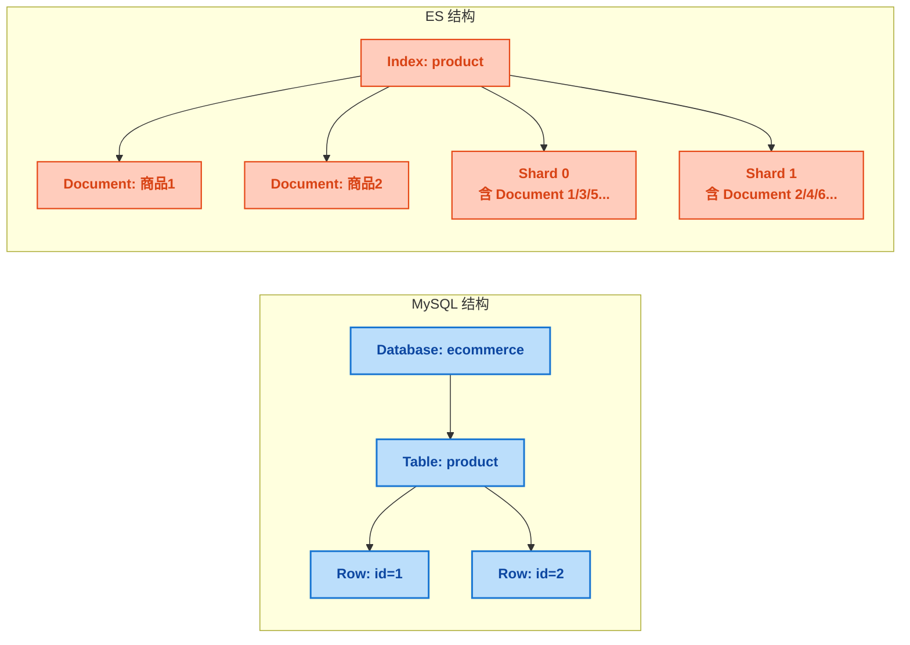
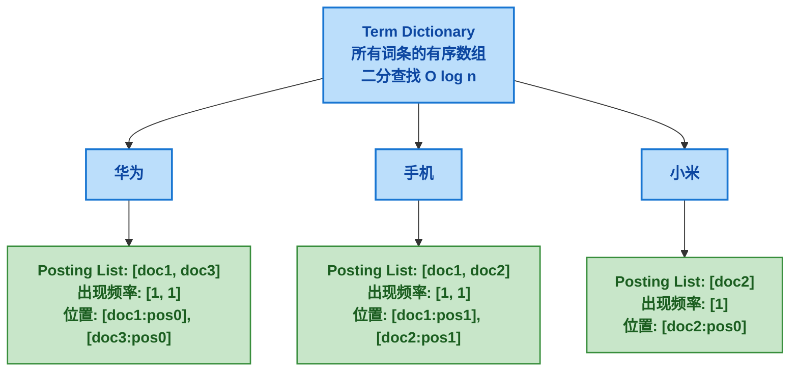
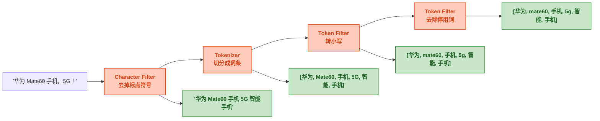
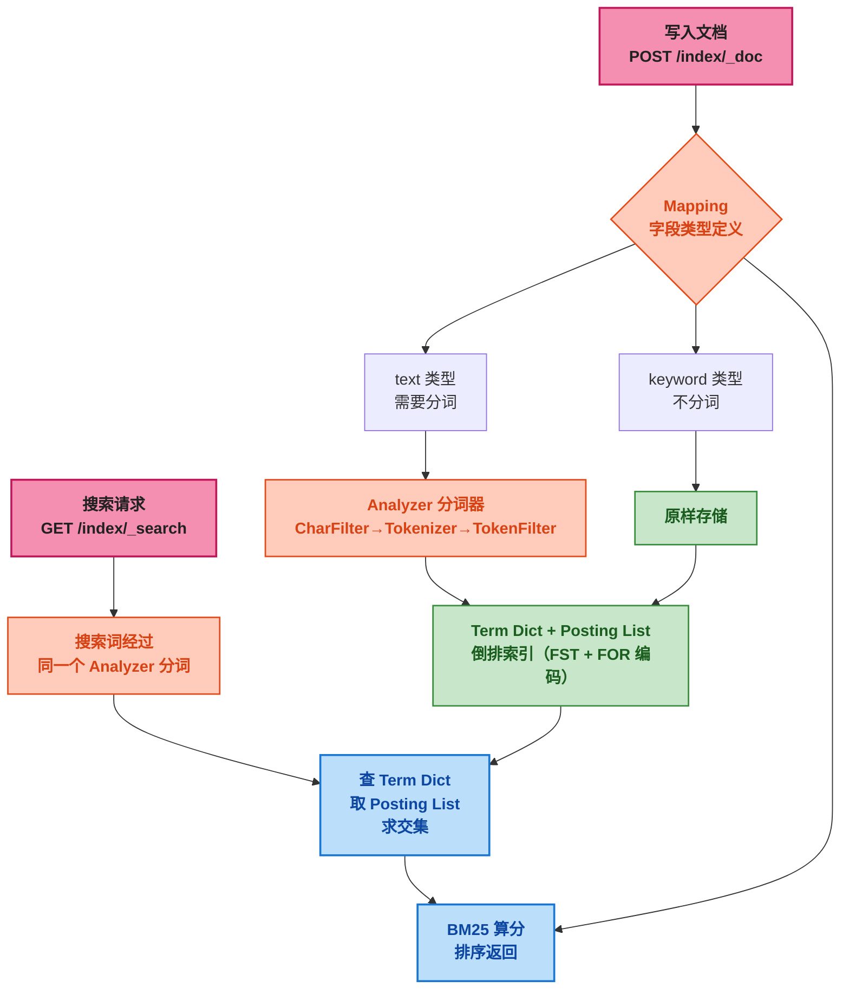

# Elasticsearch 核心概念：倒排索引、分词器与 REST API 全解析

## 一、⚡ 问题切入：MySQL 模糊搜索为什么不行？

先看一个日常开发中最常见的搜索场景。用户在电商平台的搜索框里输入"华为手机"，后端需要从商品表中查出匹配的商品。你第一反应肯定是写这样一条 SQL：

```sql
SELECT * FROM product WHERE name LIKE '%华为手机%';
```

这看起来没问题。但产品经理走过来跟你说："搜索结果要把<strong>完全匹配</strong>的放在最前面，然后按<strong>销量排序</strong>，还要展示<strong>分类筛选</strong>和<strong>品牌聚合</strong>。"你看着手里的 SQL，表情逐渐僵硬。

MySQL `LIKE '%keyword%'` 有一个致命伤：<strong>前置通配符导致索引失效</strong>。B+Tree 索引遵循最左前缀匹配原则，`%` 一上来就破坏了索引的有序性，数据库只能全表扫描。500 万商品数据，一条 `LIKE` 查询耗时 3 秒以上——用户体验直接爆炸。

这不是加个索引能解决的问题。MySQL 是为<strong>精确匹配</strong>和<strong>范围查询</strong>设计的，不是为<strong>人类自然语言的模糊搜索</strong>设计的。用户不会输入精确的字段值，他们会打错字（"苹果手鸡"），用近义词（"笔记本" vs "笔记本电脑"），甚至用拼音（"huawei shouji"）。

全文搜索引擎就是为这个问题而生的。看一组实际数据：

```bash
# MySQL LIKE：2.8 秒（500 万数据）
mysql> SELECT * FROM product WHERE name LIKE '%华为手机%';
500 rows in set (2.812 sec)

# Elasticsearch match：0.015 秒（同量级数据，3 节点集群）
GET /product/_search
{
  "query": { "match": { "name": "华为手机" } }
}
# 返回：500 条结果，耗时 15ms，按相关性排序
```

接近 <strong>200 倍</strong> 的延迟差距。而且 ES 返回的结果自带<strong>相关性评分</strong>——包含"华为手机"这四个字且连在一起出现的商品分数最高，只包含"手机"的排在后面，只包含"华为"的更靠后。这就是 ES 作为<strong>搜索引擎</strong>存在的核心价值。

MySQL 和 ES 不是替代关系，是互补关系。<strong>MySQL 管存储，ES 管搜索</strong>。数据写入 MySQL，同步到 ES 建索引，搜索走 ES，拿到 ID 后回 MySQL 查详情。

## 二、🧬 ES 是什么：基于 Lucene 的分布式搜索引擎

### 2.1 定义

Elasticsearch 是一个<strong>基于 Lucene 的、分布式、RESTful 风格的搜索引擎</strong>。每一个词都是核心特征：

| 特征 | 含义 |
|------|------|
| **基于 Lucene** | Lucene 是 Apache 开源的全文检索引擎库，负责索引的创建、查询、分词、打分的底层实现。ES 把 Lucene 包装成分布式服务 |
| **分布式** | 数据自动分片（Shard）分布到多个节点，支持横向扩展。新增节点时数据自动重新分布 |
| **RESTful** | 所有操作通过 HTTP API 完成，GET/POST/PUT/DELETE 对应查/增/改/删。请求体和返回体都是 JSON |
| **搜索引擎** | 核心功能是全文检索 + 相关性排序，不是关系型数据库。没有 JOIN，没有事务 |

Lucene 和 ES 的关系可以用一句话概括：<strong>Lucene 是最难的搜索引擎库，ES 把它变成了最简单好用的搜索引擎</strong>。直接用 Lucene 写 Java 代码做搜索，光建索引的代码就要上百行，ES 一个 `PUT` 请求搞定。

### 2.2 核心概念速查：对比 MySQL 学 ES

ES 的很多概念跟关系型数据库有对应关系，先建立这个映射能快速建立直觉：

| ES | MySQL | 说明 |
|------|------|------|
| **Index（索引）** | Database / Table | 一个业务的文档集合。比如商品搜索系统可以建一个 `product` 索引 |
| **Document（文档）** | Row | 索引中的一条数据。ES 以 JSON 格式存储 |
| **Field（字段）** | Column | 文档中的一个属性 |
| **Mapping（映射）** | Schema（DDL） | 定义字段类型、分析器、索引选项 |
| **Shard（分片）** | 分表 | 一个 Index 的数据可以切分成多个 Shard 分布在多台机器上 |
| **Replica（副本）** | 主从复制 | 每个 Shard 的冗余拷贝，提供高可用和负载分担 |
| **Node（节点）** | 实例 | 一个 ES 进程，可以属于一个或多个分片 |
| **Cluster（集群）** | 数据库集群 | 由一个或多个 Node 组成，对外提供统一的索引和搜索服务 |

不同于 MySQL 的"Database → Table → Row"三层结构，ES 是<strong>扁平</strong>的：一个 Index 直接包含 Document，没有 Database 的概念。多业务的隔离通过创建不同的 Index 来实现。



<strong>ES 的 Index 承担了 MySQL 中 Database 和 Table 两个角色</strong>。一个 Index 就对应一个搜索场景：商品搜索建 `product` Index，文章搜索建 `article` Index，日志搜索建 `log` Index。每个 Index 独立管理自己的 Mapping 和 Setting。

## 三、🗂️ 倒排索引 —— ES 快的根本原因

### 3.1 什么是倒排索引

MySQL 的 B+Tree 是<strong>正排索引</strong>：根据主键 ID / 索引字段的值找到这一行数据的完整内容。ID → 数据，这是"正着排"。

ES 用<strong>倒排索引（Inverted Index）</strong>：把文档内容切分成一个个词条（Term），记录"哪个词出现在哪些文档中"。Term → 文档 ID 列表，这是"倒着排"。

直接看图：

```
数据：
  doc1 = "华为手机很好用"
  doc2 = "小米手机也不错"
  doc3 = "华为路由器信号强"

正排索引（MySQL B+Tree）：
  doc1 → "华为手机很好用"
  doc2 → "小米手机也不错"
  doc3 → "华为路由器信号强"

倒排索引（ES Lucene）：
  华为 → [doc1, doc3]
  手机 → [doc1, doc2]
  很好用 → [doc1]
  小米 → [doc2]
  不错 → [doc2]
  路由器 → [doc3]
  信号 → [doc3]
  强 → [doc3]
```

当用户搜索"华为手机"时，ES 在倒排索引中查找 Term "华为" → `[doc1, doc3]`，Term "手机" → `[doc1, doc2]`。<strong>取交集 + 按相关性排序</strong>，得到 `[doc1, doc2, doc3]`。整个过程不需要扫描文档内容，只需查询 Term Dictionary。

### 3.2 倒排索引的内部结构

倒排索引不是简单的一个 HashMap。Lucene 内部的倒排索引由三个核心数据结构组成：



<strong>Term Dictionary（词条字典）</strong>：所有文档中出现过的所有词条，按字典序排序存储，支持二分查找 O(log n)。ES 用 FST（Finite State Transducer，有限状态转换器）存储 Term Dictionary，本质是一个<strong>前缀共享的有向无环图</strong>，极致压缩内存占用。

<strong>Posting List（倒排列表）</strong>：每个 Term 对应的文档 ID 列表，记录了这个词出现在哪些文档中、出现频率、出现位置。Posting List 是查询时取交集的核心数据结构。Lucene 使用 <strong>Frame of Reference（FOR）编码</strong>压缩文档 ID 列表，将 ID 数值转为差值存储来节省空间——`[100, 103, 107]` 变成 `[100, 3, 4]`，需要的字节数更少。

<strong>Term Frequency + Position（词频 + 位置信息）</strong>：记录每个文档中该 Term 出了几次，每次出现在哪个位置。词频用于相关性算分（一个词在一篇文档中出现越多通常越相关），位置信息用于短语匹配（"华为"和"手机"是否相邻出现）。

### 3.3 为什么倒排索引这么快？

举个具体的数据计算。500 万商品，每个商品名约 15 个汉字，总共 7500 万个 Term 索引条目。每个条目平均 8 个字节存储，索引总大小约 600MB——<strong>完全可以全部装进内存（OS Page Cache）</strong>。

搜索"华为手机"的流程：
1. 分词：`华为手机` → `["华为", "手机"]`（ik_smart 分词）
2. 查 Term Dictionary：二分查找 "华为" O(log n) ≈ 26 次比较（7500 万条目，log2 ≈ 26）
3. 取 Posting List：`[doc1, doc3, doc5981, ...]` （假设 3 万个匹配）
4. 查 Term Dictionary：二分查找 "手机" O(log n) ≈ 26 次比较
5. 取 Posting List：`[doc1, doc2, doc1201, ...]` （假设 8 万个匹配）
6. 两个 Posing List <strong>取交集（merge）</strong>：因为 Posting List 自身是有序的，取交集只需一次双指针遍历 O(m+n)，不需要哈希计算
7. 对交集结果计算 BM25 相关性分数，排序返回

这一切全在内存里完成。MySQL 在这段时间里还在磁盘上走 B+Tree。

实际上 Lucene 还用了<strong>跳表（Skip List）</strong>加速长 Posting List 的合并——在两个有序列表中快速跳过不可能匹配的文档 ID 区间。同时用<strong>BitSet / Roaring Bitmap</strong>处理 Filter 条件的结果缓存。

### 3.4 用 `_explain` API 验证倒排索引的匹配过程

ES 提供 `_explain` API，可以查看一次查询具体命中了哪些 Term、每个 Term 的评分细节：

```bash
# 先写入一个文档
POST /product/_doc/1
{
  "name": "华为Mate60手机 5G 智能手机",
  "price": 6999
}

# 用 _explain 查看搜索过程
GET /product/_explain/1
{
  "query": {
    "match": { "name": "华为手机" }
  }
}
```

返回值会详细列出 `"华为"` 和 `"手机"` 两个 Term 分别在哪出现了几次、位置在哪里、各自的 BM25 分数。也许多跑几个查询、多看看 `_explain` 的返回值，是理解倒排索引最直接的方式——<strong>看一百遍概念不如 `_explain` 跑一遍</strong>。

## 四、✂️ 分词器（Analyzer）：把句子变成词条

### 4.1 分词器的工作流程

倒排索引的"词条"不是凭空产生的。把一段文本变成一个个词条的过程叫<strong>分词（Tokenization）</strong>，负责这个工作的组件叫<strong>分词器（Analyzer）</strong>。

ES 的每个 `text` 类型字段都要指定一个 Analyzer。Analyzer 的处理分三步：

```
原始文本："华为 Mate60 手机，5G 智能手机！"

Step 1: Character Filter（字符过滤器）
  把 "！" 去掉，把 "，" 去掉
  → "华为 Mate60 手机 5G 智能手机"

Step 2: Tokenizer（分词器）
  把句子切成词条
  → ["华为", "Mate60", "手机", "5G", "智能", "手机"]
  
Step 3: Token Filter（词条过滤器）
  把 "手机" 转小写、把无意义词干掉（如英文的 "a", "the"）
  → ["华为", "mate60", "手机", "5g", "智能", "手机"]
```

这三步的产物就是倒排索引中的 Term。当用户搜索时，搜索词也经过同样的 Analyzer 处理，然后去倒排索引中查匹配。



### 4.2 用 `_analyze` API 看分词效果

ES 提供了 `_analyze` API 来测试分词效果。这是学习 Analyzer 最直接的工具：

```bash
# 用 standard 分词器（ES 默认，英文友好，中文不行）
POST /_analyze
{
  "analyzer": "standard",
  "text": "华为Mate60手机"
}
# 返回：["华", "为", "mate60", "手", "机"]
# standard 分词器把中文按单字拆开——这对中文搜索来说毫无意义

# 用 ik_smart 分词器（粗粒度分词）
POST /_analyze
{
  "analyzer": "ik_smart",
  "text": "华为Mate60手机"
}
# 返回：["华为", "Mate60", "手机"]

# 用 ik_max_word 分词器（细粒度分词，尽可能多切词）
POST /_analyze
{
  "analyzer": "ik_max_word",
  "text": "华为Mate60手机"
}
# 返回：["华为", "Mate60", "手机", "Mate", "60"]
```

`ik_smart` 和 `ik_max_word` 的差异：
- <strong>ik_smart</strong>：粗粒度，一个词只切一次。"华为Mate60手机" → 3 个词条。适合搜索时用（搜索词的分词）
- <strong>ik_max_word</strong>：细粒度，穷举所有可能的词。"华为Mate60手机" → 5 个词条。适合索引时用（让数据尽可能多地被搜索命中）

同一个字段可以设置<strong>不同的索引分词器和搜索分词器</strong>——Mapping 中 `analyzer` 指定索引时的分词器，`search_analyzer` 指定搜索时的分词器。这是 ES 分词策略的核心配置，后面第四篇会详细讲。

### 4.3 常用分词器速查

| 分词器 | 类型 | 适用场景 | 示例输入 → 输出 |
|--------|------|----------|----------------|
| `standard` | ES 内置 | 英文通用，中文按字拆分 | "Hello World" → `["hello", "world"]` |
| `ik_smart` | IK 插件 | 中文粗粒度分词 | "华为手机" → `["华为", "手机"]` |
| `ik_max_word` | IK 插件 | 中文细粒度分词 | "华为手机" → `["华为", "手机", "华为手机"]` |
| `pinyin` | Pinyin 插件 | 拼音搜索 | "华为" → `["huawei", "hua", "wei"]` |
| `keyword` | ES 内置 | 不分词，整个字段作为一个词条 | "华为手机" → `["华为手机"]` |

> ⚠️ 新手提示：安装 IK 分词器需要下载与 ES 版本<strong>完全一致</strong>的插件包，放到 ES 的 `plugins/ik` 目录下，然后重启 ES。版本不匹配会导致 ES 启动失败。

## 五、📐 Mapping —— 定义字段要怎么索引

### 5.1 Mapping 是什么

MySQL 建表时需要写 `CREATE TABLE` 定义每个字段的类型：

```sql
CREATE TABLE product (
    id BIGINT PRIMARY KEY,
    name VARCHAR(200),
    price DECIMAL(10, 2),
    create_time DATETIME,
    FULLTEXT INDEX ft_name(name)   -- MySQL 也支持全文索引，但功能很弱
);
```

ES 建 Index 时也需要类似的字段类型定义——叫 <strong>Mapping</strong>。但 Mapping 比 MySQL 的 Schema 更精细：不光定义字段的类型，还要定义这个字段<strong>要不要分词、用什么分词器、要不要建索引、要不要存原始值</strong>。

```bash
PUT /product
{
  "mappings": {
    "properties": {
      "name":       { "type": "text", "analyzer": "ik_max_word" },
      "category":   { "type": "keyword" },
      "price":      { "type": "double" },
      "stock":      { "type": "integer" },
      "createTime": { "type": "date", "format": "yyyy-MM-dd HH:mm:ss" }
    }
  }
}
```

### 5.2 text vs keyword —— 最容易搞混的两个类型

这是新手踩得最多的坑，单独拿出来讲。

<strong>text 类型</strong>：会被分词，用于全文搜索。字段值经过 Analyzer 处理后生成一堆 Term 存入倒排索引。用户搜"手机"能匹配到名称里包含"手机"的产品。<strong>text 字段不能用来排序或精确聚合</strong>（会报错："Fielddata is disabled on text fields"）。

<strong>keyword 类型</strong>：不会被分词，整个字符串作为一个 Term 原样存储。适合精确匹配——状态字段（"上架"/"下架"）、分类字段（"手机"/"电脑"）、邮箱、标签。keyword 字段可以用来排序和聚合。

直接看对比：

```bash
# text 字段：分词后索引
# 文档：name = "华为手机"
# 倒排索引：华为→[doc1], 手机→[doc1]
# 搜索 "手机" → 命中
# 搜索 "huawei" → 命中（如果装了 pinyin 分词器）

# keyword 字段：整个字符串索引
# 文档：category = "手机"
# 倒排索引：手机→[doc1]   （注意：key 是"手机"，不是"手"+"机"）
# 搜索 "手机" → 命中
# 搜索 "手" → 不命中
```

用的时候一个简单的判断规则：<strong>这个字段需不需要按包含关系搜索？</strong>
- 需要 → text（商品名、文章正文、描述文字）
- 不需要 → keyword（分类、标签、状态、ID、邮箱）

### 5.3 数值与日期类型

ES 的数值类型直接对应 Java 的基本类型：

| ES 类型 | Java 类型 | 取值范围 | 场景 |
|---------|----------|---------|------|
| `integer` | int | -2³¹ ~ 2³¹-1 | 库存、年龄、数量 |
| `long` | long | -2⁶³ ~ 2⁶³-1 | 时间戳、大 ID |
| `float` | float | 32 位单精度 | 评分 |
| `double` | double | 64 位双精度 | 价格、金额 |
| `short` | short | -32768 ~ 32767 | 小数值 |
| `byte` | byte | -128 ~ 127 | 小标记 |

日期类型需要注意格式配置：

```bash
# 多种日期格式兼容的配置
"createTime": {
  "type": "date",
  "format": "yyyy-MM-dd HH:mm:ss||yyyy-MM-dd||epoch_millis"
}
# || 分隔符表示"或"——多个格式任选其一
# epoch_millis 表示支持毫秒级时间戳
```

### 5.4 Dynamic Mapping —— 自动推断的陷阱

如果你不事先定义 Mapping 就直接写入文档，ES 会自动推断字段类型：

```bash
# 没有事先建 Mapping，直接写文档
POST /product/_doc/1
{
  "name": "华为手机",
  "price": 6999,
  "tags": ["5G", "拍照"]
}

# ES 自动生成的 Mapping：
# name: text + keyword（ES 自动为 text 字段创建一个 .keyword 子字段）
# price: float（ES 默认推断为 float，不是 double）
# tags: text + keyword
```

看起来很方便？但对型要求严格的生产环境是<strong>灾难</strong>：
- `price` 被推断为 `float` 而不是 `double`，小数精度不够
- `createTime` 如果第一次写入是 `"2024-01-15"` 会被推断为 `date`，如果后面有人写了 `"2024/01/15"` 这个格式就会报错
- 如果有人不小心写了一个数字类型的字符串进来（比如 name 字段写了个 `"12345"`），ES 可能会把 text 类型改成 long，导致后续写入字符串时直接报错

生产环境建议的配置：

```bash
PUT /product
{
  "mappings": {
    "dynamic": "strict",    # 严格模式：写入未定义字段直接报错
    "properties": {
      "name": { "type": "text", "analyzer": "ik_max_word" },
      "price": { "type": "double" }
    }
  }
}
```

`dynamic` 有三种取值：
- `true`（默认）：自动推断，不报错
- `strict`：严格模式，写入未定义字段抛异常
- `false`：不报错也不索引，数据存 `_source` 中但不可搜索

## 六、📡 REST API 基础 CRUD

ES 的所有操作都是 HTTP REST API。不需要安装客户端，用 curl 或 Kibana Dev Tools 就能操作。

### 6.1 创建索引（带 Mapping）

```bash
PUT /product
{
  "settings": {
    "number_of_shards": 3,      # 3 个主分片
    "number_of_replicas": 1     # 每个主分片 1 个副本
  },
  "mappings": {
    "dynamic": "strict",
    "properties": {
      "name": {
        "type": "text",
        "analyzer": "ik_max_word",
        "search_analyzer": "ik_smart"
      },
      "brand":       { "type": "keyword" },
      "category":    { "type": "keyword" },
      "price":       { "type": "double" },
      "stock":       { "type": "integer" },
      "soldCount":   { "type": "integer" },
      "score":       { "type": "float" },
      "createTime":  { "type": "date", "format": "yyyy-MM-dd HH:mm:ss" },
      "description": { "type": "text", "analyzer": "ik_max_word" }
    }
  }
}

# 返回：{ "acknowledged": true, "shards_acknowledged": true }
```

### 6.2 写入文档

```bash
# 单个写入——指定 ID
POST /product/_doc/1
{
  "name": "华为Mate60 Pro",
  "brand": "华为",
  "category": "手机",
  "price": 6999,
  "stock": 500,
  "soldCount": 12800,
  "score": 4.8,
  "createTime": "2024-01-15 10:30:00",
  "description": "搭载麒麟9000S芯片，支持5G网络，卫星通信功能"
}

# 不指定 ID（ES 自动生成）
POST /product/_doc
{
  "name": "华为Pura70",
  "brand": "华为",
  "category": "手机",
  "price": 5999,
  "stock": 320,
  "soldCount": 8900,
  "score": 4.6,
  "createTime": "2024-06-01 09:00:00",
  "description": "超聚光伸缩摄像头，可变光圈"
}
```

> ⚠️ 新手提示：`POST /index/_doc`（不指定 ID）每次都是新增。`POST /index/_doc/1`（指定 ID）——ID 已存在时<strong>覆盖</strong>原文档，不存在时新增。这和 Redis 的 `SET` 命令行为一致：不存在新增，存在覆盖。

### 6.3 查询文档

```bash
# 按 ID 查询
GET /product/_doc/1
# 返回：
# {
#   "_index": "product",
#   "_id": "1",
#   "_version": 1,
#   "_source": { 所有字段的值都在这里 }
# }

# 检查文档是否存在（HEAD 请求，没有返回体，只看 HTTP 状态码）
HEAD /product/_doc/1
# 200 OK → 存在
# 404 Not Found → 不存在

# 批量按 ID 查询
GET /product/_mget
{
  "ids": ["1", "2", "3"]
}
```

### 6.4 更新文档

```bash
# 部分更新（只更新指定字段）
POST /product/_update/1
{
  "doc": {
    "price": 6499,
    "stock": 480
  }
}

# 注意：ES 的更新本质是"删除旧文档 + 写入新文档"。
# 在内部，ES 先从 _source 中取出旧文档 → 合并更新 → 标记旧文档为删除 → 写新文档 → 后台合并段时真正物理删除
```

### 6.5 删除文档

```bash
# 按 ID 删除
DELETE /product/_doc/1

# 条件删除（根据查询结果删除）
POST /product/_delete_by_query
{
  "query": {
    "term": { "brand": "华为" }
  }
}
# 注意：_delete_by_query 是 O(n) 操作，大量数据时可能阻塞。
# 生产环境建议用异步 Delete By Query + Task API 管理
```

### 6.6 删除索引

```bash
# 删除整个索引——不可逆，生产环境请三思
DELETE /product

# 删除前先检查
GET /_cat/indices/product?v
# 确认无误后再 DELETE
```

### 6.7 常用辅助 API

```bash
# 查看所有索引
GET /_cat/indices?v

# 查看索引的 Mapping
GET /product/_mapping

# 查看索引的 Setting
GET /product/_settings

# 查看某个字段的 Mapping
GET /product/_mapping/field/name

# 手动刷新索引（让最近写入的数据立即可搜索，默认每 1 秒自动刷新）
POST /product/_refresh
```

## 七、🔍 基础搜索入门

### 7.1 match 查询 —— 先分词再匹配

`match` 查询是全文搜索的主力。ES 对搜索词进行分词后，去倒排索引中查找每个 Term，最后取交集、算分、排序。

```bash
# 单字段 match 查询
GET /product/_search
{
  "query": {
    "match": {
      "name": "华为手机"
    }
  }
}
# ES 实际执行的逻辑：
# 1. 用 ik_smart 分词 "华为手机" → ["华为", "手机"]
# 2. 查找 Term "华为" 的 Posting List → [doc1, doc2, doc5, ...]
# 3. 查找 Term "手机" 的 Posting List → [doc1, doc3, doc4, ...]
# 4. 合并 + BM25 算分
# 5. 按分数降序返回前 10 条
```

### 7.2 term 查询 —— 精确匹配，不分词

`term` 查询不做分词，直接把输入值当做一个完整的 Term 去倒排索引中找。只能用于<strong>keyword 类型字段</strong>或<strong>不会被分词的场景</strong>。

```bash
# 精确查品牌=华为
GET /product/_search
{
  "query": {
    "term": {
      "brand": "华为"
    }
  }
}

# 常见错误——对 text 字段用 term 查询：
GET /product/_search
{
  "query": {
    "term": { "name": "华为手机" }
  }
}
# 会查出 0 条结果！因为 name 是 text 类型，倒排索引里存的是 ["华为", "手机"]，
# 没有 "华为手机" 这个 Term
```

> ⚠️ 新手提示：<strong>text 字段用 match，keyword 字段用 term</strong>。搞反了要么查不到，要么搜不准。如果对 text 字段必须做精确匹配，可以用 `name.keyword` 子字段（ES 自动为 text 字段创建一个 keyword 子字段）。

### 7.3 range 查询 —— 数值范围过滤

```bash
# 价格 5000 ~ 8000
GET /product/_search
{
  "query": {
    "range": {
      "price": {
        "gte": 5000,
        "lte": 8000
      }
    }
  }
}

# 操作符：gt(>) / gte(>=) / lt(<) / lte(<=)
```

### 7.4 bool 查询 —— 组合条件

`bool` 是 ES 中最强大的查询，没有之一。把多个查询条件像<strong>乐高积木</strong>一样拼在一起：

```bash
GET /product/_search
{
  "query": {
    "bool": {
      "must": [                           # 必须满足（参与算分）
        { "match": { "name": "手机" } }
      ],
      "filter": [                         # 必须满足（不参与算分，走缓存）
        { "term": { "brand": "华为" } },
        { "range": { "price": { "gte": 3000, "lte": 8000 } } }
      ],
      "must_not": [                       # 必须不满足
        { "term": { "category": "二手" } }
      ],
      "should": [                         # 加分项（满足的越多分越高）
        { "match": { "description": "卫星通信" } }
      ]
    }
  },
  "sort": [
    { "score": { "order": "desc" } },     # 相关性优先
    { "soldCount": { "order": "desc" } }  # 销量次优先
  ],
  "from": 0,
  "size": 10
}
```

`must` 和 `filter` 的区别是高频面试题，也是实际使用中最常见的性能边界：
- <strong>must</strong>：参与相关性评分计算，影响 `_score`
- <strong>filter</strong>：不参与评分，但结果会被 <strong>LRU Query Cache</strong> 缓存，下次同样条件直接返回缓存

经验法则：<strong>"有没有都好"的条件用 must（影响排序），"必须满足"的条件用 filter（性能更好）</strong>。品牌筛选、价格区间、日期范围这些纯过滤条件一律放 filter。

## 八、🧭 ES 核心概念全景图

到这里，已经覆盖了 ES 最核心的三个概念——倒排索引、分词器、Mapping——以及 REST API 的基本操作。用一张全景图总结它们之间的关系：



## 九、🎯 总结

本文从一个 `LIKE '%keyword%'` 的性能困境出发，逐步拆解了 Elasticsearch 的三大核心概念：

1. <strong>倒排索引</strong>：Term → Document List 的映射结构，是 ES 全文搜索比 MySQL LIKE 快 200 倍的根本原因。Lucene 用 FST 存储 Term Dictionary（前缀共享压缩），用 FOR 编码压缩 Posting List（差值存储）。

2. <strong>分词器</strong>：Character Filter → Tokenizer → Token Filter 的三步流水线，将文本变成倒排索引中的 Term。IK 分词器提供 `ik_smart`（粗粒度）和 `ik_max_word`（细粒度）两种模式，分别适用于搜索时和索引时。

3. <strong>Mapping</strong>：定义每个字段的类型和索引方式。`text` 字段被分词用于全文搜索，`keyword` 字段原样存储用于精确匹配和聚合。生产环境建议 `dynamic: strict` 严格控制字段类型。

4. <strong>REST API 基础操作</strong>：索引创建、文档 CRUD、match / term / range / bool 四种基本查询。所有操作都是 HTTP + JSON，不需要额外安装客户端。

理解 ES 的关键不是记住所有 API 参数，而是理解 <strong>"我写进去的数据经过了怎样的处理变成倒排索引中的 Term，搜索时 ES 又是如何利用倒排索引在几十毫秒内找到相关文档的"</strong>。脑子里有了这张图，后面所有的高级查询、聚合分析、性能优化都建立在这个基础上。

> 📖 <strong>下一步阅读</strong>：掌握了 ES 的核心概念和 REST API 后，下一步是在 SpringBoot 项目中使用 Java 代码操作 ES。继续阅读 [<strong>SpringBoot Elasticsearch 全操作指南</strong>]()，一篇覆盖 ElasticsearchRestTemplate / Spring Data ES Repository / 搜索 / 聚合 / 高亮的完整实战教程。
