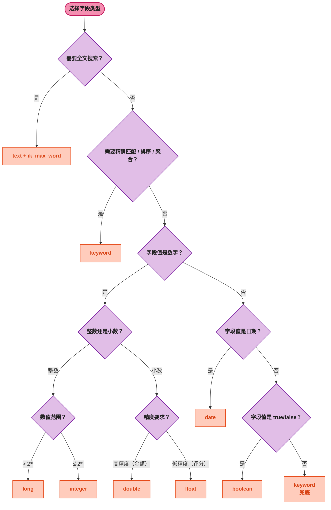
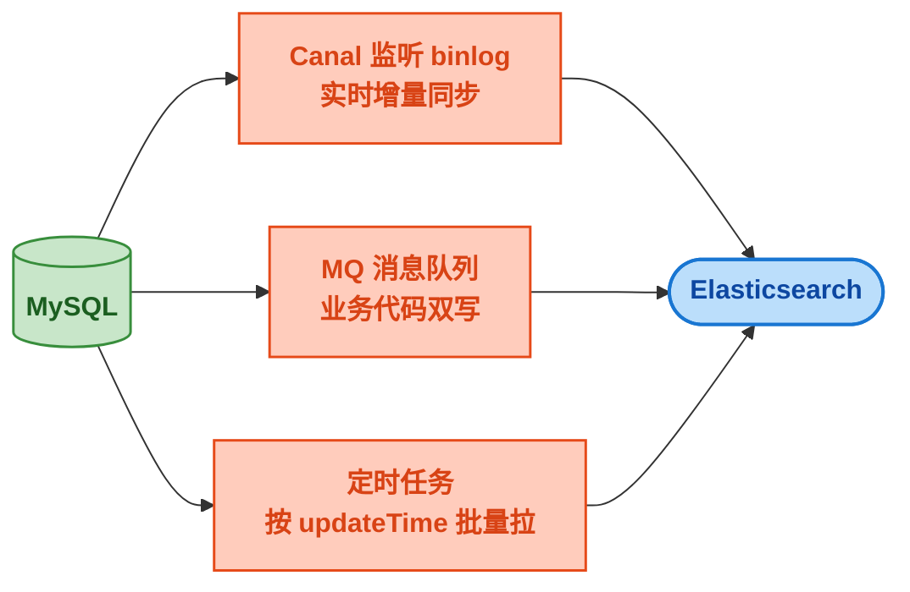

# Elasticsearch 生产调优与索引设计

> 📖 <strong>前置阅读</strong>：本文是 ES 系列的<strong>生产调优篇</strong>，假设读者已经掌握了 ES 核心概念、SpringBoot 操作和高级搜索聚合。如果还没有，建议先阅读前三篇：
> - [<strong>Elasticsearch 核心概念：倒排索引、分词器与 REST API 全解析</strong>]() —— 介绍篇
> - [<strong>SpringBoot Elasticsearch 全操作指南</strong>]() —— 实战篇
> - [<strong>ES 高级搜索与聚合分析</strong>]() —— 进阶篇

## 一、⚡ 问题切入：搜索怎么越来越慢了？

商品从 10 万增加到 500 万，搜索响应时间从原来的 50ms 涨到了 2 秒。用户开始投诉"搜索好慢"，产品经理开始质疑"ES 不是很快吗"。

你打开监控面板，发现：
- 搜索 P99 延迟 2.3 秒
- ES 堆内存使用率 85%
- 磁盘 IO 等待时间飙升
- GC 频率从每小时 2 次变成了每 5 分钟 1 次

问题出在哪？不一定是数据量大就一定慢。500 万数据对 ES 来说远没到上限——一个设计良好的 3 节点集群处理几亿数据都没问题。<strong>慢的往往是索引设计不合理、查询写得不高效、分页方式用错了</strong>。

本篇要解决的问题：<strong>怎么设计索引让 500 万数据搜索保持在 100ms 以内，以及遇到性能问题时从哪下手排查</strong>。

## 二、🗂️ 索引设计最佳实践

### 2.1 分片数设计 —— 不是越多越好

ES 把一个 Index 的数据切分成多个<strong>分片（Shard）</strong>分布在不同节点上。每个分片本质上是一个独立的 <strong>Lucene 实例</strong>——有自己的倒排索引、段文件、内存开销。

分片数量是在<strong>创建 Index 时一次性确定</strong>的，之后无法修改。改分片数只能 reindex（重建新索引+数据迁移）。

<strong>分片不是越多越好</strong>。假设 500 万商品数据，你设了 20 个分片——每个分片只有 25 万条数据，但 20 个 Lucene 实例个个要占内存、占文件句柄、占 JVM 堆。CPU 压力可能比数据压力更大。

<strong>分片数计算公式</strong>：

```
单分片建议容量 = 30GB ~ 50GB（经验值，根据 JVM 堆内存调整）
分片数 = 总数据量 / 单分片建议容量

或者按文档数：
单分片建议文档数 = 1 亿 ~ 2 亿（取决于文档大小）
分片数 = 总文档数 / 单分片建议文档数
```

对于大多数业务场景：
- <strong>500 万文档、每文档 2KB</strong>：总数据约 10GB → 1 个分片足够，最多 2 个分片（防止单节点故障）
- <strong>5000 万文档、每文档 1KB</strong>：总数据约 50GB → 2-3 个分片
- <strong>日志类数据、每天 1 亿条</strong>：建议按天建索引（`log-2024.01.15`），每个索引 2-3 个分片

```bash
# 创建索引时指定分片数和副本数
PUT /product
{
  "settings": {
    "number_of_shards": 3,
    "number_of_replicas": 1
  },
  "mappings": { ... }
}
```

> ⚠️ 新手提示：很多人拿到 ES 第一件事就是创建很多分片，觉得"分片多=性能好"。实际上每个分片都是一个 Lucene 实例，分片太多=浪费内存和文件句柄。<strong>小数据量（< 50GB）用 1-2 个分片</strong>就是最佳方案。

### 2.2 副本数设计 —— 高可用与写入性能的权衡

副本（Replica）是主分片的完整拷贝。副本的核心价值：
- <strong>高可用</strong>：主分片所在的节点挂了，副本可以顶上
- <strong>分担读负载</strong>：搜索请求可以发到主分片或副本分片

但副本数直接关联<strong>写入性能</strong>——一次写入需要主分片完成后同步到所有副本分片才算写入成功。1 个副本 = 1 次同步，2 个副本 = 2 次同步。

```
写入延迟 ≈ 主分片写入延迟 × (1 + 副本数)

副本数 = 1：延迟 ×2，有备份
副本数 = 2：延迟 ×3，更安全但更慢
```

一般建议：<strong>1 个副本</strong>（有备份即可）。如果查询压力特别大，可以临时增加副本数分担读负载（副本可以动态增加，分片不能）。

```bash
# 动态修改副本数（不需要 reindex）
PUT /product/_settings
{
  "number_of_replicas": 2
}
```

### 2.3 Mapping 设计原则

<strong>dynamic 策略 —— 生产环境建议 strict</strong>

```bash
PUT /product
{
  "mappings": {
    "dynamic": "strict",            # 写入未定义字段直接报错
    "properties": {
      "name": { "type": "text", "analyzer": "ik_max_word" },
      "price": { "type": "double" }
    }
  }
}
```

`dynamic: true`（默认）会让 ES 自动推断字段类型。某个程序员不小心把 price 写成了 `"6999元"`，ES 可能会把它推断为 text 类型，后续写入 `6999`（数字）就会报类型冲突。这在多人协作的项目里几乎一定会发生。

`dynamic` 三种取值：

| 值 | 行为 | 适用场景 |
|------|------|---------|
| `true`（默认） | 自动推断，不报错 | 开发环境、日志类不可控数据 |
| `strict` | 写入未定义字段抛异常 | <strong>生产环境推荐</strong> |
| `false` | 不报错也不索引，存在 `_source` 中 | 特殊场景（需要保留但不需要搜索的字段） |

<strong>text 字段的 analyzer 和 search_analyzer</strong>

索引时和搜索时可以用<strong>不同的分词器</strong>：

```bash
"name": {
  "type": "text",
  "analyzer": "ik_max_word",        # 索引时：细粒度分词（更多词条=更高召回率）
  "search_analyzer": "ik_smart"     # 搜索时：粗粒度分词（更准匹配=更高精确率）
}
```

索引时用 `ik_max_word`：把"华为手机"切成 `["华为", "手机", "华为手机"]`，让文档能被更多搜索词命中。
搜索时用 `ik_smart`：把"华为手机"切成 `["华为", "手机"]`，只查两个核心词，避免"华为手机"作为一个整体导致召回不足。

<strong>禁用不需要索引的字段</strong>

如果某个字段<strong>只需要原样存着，不需要搜索</strong>，就关掉它的索引：

```bash
"largeDescription": {
  "type": "text",
  "index": false                    # 不需要搜索，只保留在 _source 中
}
```

省掉这个字段的倒排索引 = 省内存 + 省写入时间。商品详情大段 HTML、文章原始 Markdown 等不需要搜索的字段都该关掉。

### 2.4 字段类型选择决策树



## 三、⚡ 批量操作：Bulk API

### 3.1 为什么需要批量写入

逐条 `save()` 写入 10 万条数据：
- 10 万次 HTTP 请求
- 每次请求的网络 RTT 假设 1ms → 单网络耗时就 100 秒
- 每次请求 ES 都要 refresh segment、fsync translog

批量写入同样的 10 万条数据（每批 2000 条）：
- 50 次 HTTP 请求
- 网络耗时 50ms
- ES 内部批量 commit，减少 refresh 次数

### 3.2 BulkProcessor —— 开箱即用的批量写入

Spring Data ES 的 `bulkIndex` 是同步批量。对于持续的高吞吐写入场景（如 MySQL binlog 实时同步），需要异步的批量处理器。

ES 8.x 的 Java Client 提供了 `BulkIngester`：

```java
import co.elastic.clients.elasticsearch.ElasticsearchClient;
import co.elastic.clients.elasticsearch.core.BulkRequest;
import co.elastic.clients.elasticsearch.core.bulk.BulkOperation;
import jakarta.annotation.PreDestroy;

@Component
public class ProductBulkIngester {

    private final ElasticsearchClient esClient;
    private final BulkIngester<Product> bulkIngester;

    public ProductBulkIngester(ElasticsearchClient esClient) {
        this.esClient = esClient;

        this.bulkIngester = BulkIngester.of(builder -> builder
            .client(esClient)
            .maxOperations(2000)              // 每批最多 2000 条
            .maxSize(10 * 1024 * 1024)        // 每批最多 10MB
            .maxConcurrentRequests(3)         // 最多 3 个并发批量请求
            .flushInterval(5, TimeUnit.SECONDS) // 即使不满 2000 条，每 5 秒也执行一次
            .globalSettings(settings -> settings
                .index("product"))
            .listener(new BulkIngesterListener<Product>() {
                @Override
                public void beforeBulk(long executionId, BulkRequest request,
                                       List<Product> items) {
                    System.out.println("准备写入 " + items.size() + " 条");
                }

                @Override
                public void afterBulk(long executionId, BulkRequest request,
                                      List<Product> items, BulkResponse response) {
                    if (response.errors()) {
                        // 有失败的文档，需要重试
                        response.items().forEach(item -> {
                            if (item.error() != null) {
                                System.err.println("写入失败: " + item.id()
                                    + " | 原因: " + item.error().reason());
                            }
                        });
                    }
                }
            })
            .build());
    }

    public void add(Product product) {
        bulkIngester.add(BulkOperation.of(op -> op
            .index(idx -> idx
                .id(product.getId())
                .document(product))));
    }

    @PreDestroy
    public void close() {
        bulkIngester.close();  // 应用关闭时等待剩余数据写完
    }
}
```

调用方只需 `bulkIngester.add(product)`——不用关心批次大小、什么时候发送、失败了怎么办。

### 3.3 MySQL → ES 数据同步方案

从 MySQL 同步数据到 ES 有三种方案：



| 方案 | 实时性 | 复杂度 | 适用场景 |
|------|:---:|:---:|------|
| Canal 监听 binlog | 秒级 | 高 | 数据量大、实时性要求高 |
| MQ 双写 | 近实时 | 中 | 业务可控、需要处理事务 |
| 定时任务批量拉 | 分钟级 | 低 | 实时性要求不高、小数据量 |

定时任务批量拉的代码在第二篇已经写过了，这里补充 Canal 的核心思路：

```
MySQL binlog → Canal Server 解析 → 发到 MQ (Kafka/RocketMQ) → ES 消费写入
```

Canal 把自己伪装成 MySQL 的 Slave 节点，从 MySQL 主节点同步 binlog，解析出 INSERT/UPDATE/DELETE 事件，然后推送到 MQ。ES 侧写一个消费者监听 MQ，拿到变更事件后更新 ES 中的文档。

## 四、🔍 搜索性能优化

### 4.1 filter 和 must 再强调一次

这个知识点在前面的文章里反复提过，但因为<strong>太重要</strong>了，这里再强调一次：

```bash
# 不推荐：所有条件都放 must
{
  "bool": {
    "must": [
      { "match": { "name": "手机" } },
      { "term": { "brand": "华为" } },      # 算分用不到，浪费 CPU
      { "range": { "price": { "gte": 3000 } } }  # 算分用不到，浪费 CPU
    ]
  }
}

# 推荐：算分的放 must，过滤的放 filter
{
  "bool": {
    "must": [
      { "match": { "name": "手机" } }
    ],
    "filter": [
      { "term": { "brand": "华为" } },        # 走 LRU Query Cache
      { "range": { "price": { "gte": 3000 } } } # 走 LRU Query Cache
    ]
  }
}
```

一个快速自查：<strong>问自己，这个条件要不要影响搜索结果的排序？</strong>
- 要影响排序 → must（但不能太多，2-3 个为宜）
- 只是筛选条件 → filter

### 4.2 深分页问题 —— 这是 ES 最经典的坑

这是线上 ES 性能问题排名第一的原因。

<strong>问题本质</strong>：`from + size` 翻页时，ES 需要从<strong>每个分片</strong>取出 `from + size` 条数据，汇总到协调节点排序后，<strong>丢弃前 from 条</strong>，返回 size 条。

```
假设 3 个分片，查询 from=10000, size=10：
协调节点从每个分片取 10010 条 → 共 30030 条
排序后丢弃前 10000 条 → 返回 10 条
ES 实际处理了 30030 条数据，但用户只看到了 10 条
```

直接限制 `from + size ≤ 10000`：

```bash
PUT /product/_settings
{
  "index.max_result_window": 10000
}
# from + size 超过 10000 时直接报错，防止有人翻到第 10001 页拖垮集群
```

这个限制只是止血，真正解决问题需要替代方案：

<strong>方案一：search_after —— 游标式翻页（推荐）</strong>

```bash
# 第 1 页
GET /product/_search
{
  "query": { "match": { "name": "手机" } },
  "sort": [
    { "soldCount": "desc" },
    { "_id": "asc" }               # 必须有 tiebreaker（保证排序唯一）
  ],
  "size": 10
}
# 记录最后一条的 sort 值：[8000, "abc123"]

# 第 2 页（基于上一页最后一条的 sort 值）
GET /product/_search
{
  "query": { "match": { "name": "手机" } },
  "sort": [
    { "soldCount": "desc" },
    { "_id": "asc" }
  ],
  "size": 10,
  "search_after": [8000, "abc123"]   # 从这条之后开始
}
```

`search_after` 的原理：不再是"跳过前 N 条"，而是<strong>从上一页的最后一条之后开始取</strong>。和 MySQL 的游标分页（`WHERE id > lastId LIMIT 10`）一个思路。

优点：翻到第 1000 页和第 1 页的查询耗时几乎一样。
缺点：<strong>不能跳页</strong>——没法直接从第 1 页跳到第 5 页。

```java
// Java 代码：search_after
public List<Product> searchAfter(String keyword, int size, Object[] lastSortValues) {
    NativeQuery query = NativeQuery.builder()
        .withQuery(QueryBuilders.match().field("name").query(keyword).build())
        .withSort(Sort.by(
            new Sort.Order(Sort.Direction.DESC, "soldCount"),
            new Sort.Order(Sort.Direction.ASC, "_id")))
        .withPage(Pageable.ofSize(size))   // 不传 page 索引，只传 size
        .build();

    // 如果有上一页的最后一条 sort 值
    if (lastSortValues != null) {
        query.setSearchAfter(List.of(lastSortValues));
    }

    SearchHits<Product> hits = restTemplate.search(query, Product.class);
    List<Product> products = hits.stream()
        .map(SearchHit::getContent)
        .toList();

    // 记录最后一条的 sort 值，给下一页用
    if (!hits.isEmpty()) {
        SearchHit<Product> lastHit = hits.getSearchHits().get(hits.size() - 1);
        // lastHit.getSortValues() 就是这页最后一条的 sort 值
    }
    return products;
}
```

<strong>方案二：scroll —— 快照式遍历（适合数据导出）</strong>

`scroll` 在查询开始时创建一个<strong>数据快照</strong>，后续翻页在这个快照上操作，不受索引变更影响。

```bash
# 初始化 scroll（保持 2 分钟有效）
POST /product/_search?scroll=2m
{
  "query": { "match": { "name": "手机" } },
  "size": 1000
}
# 返回：{ "_scroll_id": "DXF1ZXJ5QW...", "hits": {...} }

# 后续翻页（使用 scroll_id）
POST /_search/scroll
{
  "scroll": "2m",
  "scroll_id": "DXF1ZXJ5QW..."
}

# 用完后清理 scroll
DELETE /_search/scroll
{
  "scroll_id": "DXF1ZXJ5QW..."
}
```

`scroll` 不适合实时搜索——<strong>快照期间新增/修改的数据不可见</strong>。只适合数据导出、全量 reindex 等批处理场景。

<strong>方案三：PIT（Point in Time）—— scroll 的轻量级替代</strong>

ES 7.10+ 引入，不需要创建完整快照，比 scroll 更轻量：

```bash
# 创建 PIT（保持 5 分钟）
POST /product/_pit?keep_alive=5m
# 返回：{ "id": "pit_id_xxx" }

# 使用 PIT 搜索
GET /_search
{
  "size": 100,
  "pit": {
    "id": "pit_id_xxx",
    "keep_alive": "5m"
  },
  "sort": [{ "_shard_doc": "asc" }],    # PIT 需要 _shard_doc 排序
  "search_after": [0]
}

# 删除 PIT
DELETE /_pit
{ "id": "pit_id_xxx" }
```

<strong>四种分页方案对比表</strong>：

| 方案 | 适用场景 | 跳页 | 性能 | 数据一致性 |
|------|---------|:---:|------|:---:|
| `from + size` | 浅分页（前 100 页） | 支持 | 越深越差 | 实时 |
| `search_after` | 无限翻页（APP/Web） | <strong>不支持</strong> | 始终优秀 | 实时 |
| `scroll` | 数据导出、全量遍历 | 不支持 | 稳定 | 快照时点 |
| `PIT` | 数据导出 + 搜索混合 | 不支持 | 稳定 | PIT 时点 |

> ⚠️ 新手提示：90% 的"ES 搜索很慢"问题，最后都是一查发现有人用 `from=10000, size=20` 在做分页。所以遇到性能问题，先检查有没有深分页——这比任何优化都见效。

### 4.3 查询性能排查工具

<strong>Profile API —— 分析每次搜索的耗时分布</strong>

```bash
GET /product/_search
{
  "profile": true,                  # 开启性能分析
  "query": {
    "bool": {
      "must": [{ "match": { "name": "手机" } }],
      "filter": [{ "term": { "brand": "华为" } }]
    }
  }
}
# 返回结果会详细列出每个查询阶段（query / rewrite / advance / match 等）的耗时和遍历文档数
```

看 Profile 输出的几个关键指标：
- `time`：该查询子句的耗时
- `next_doc`：遍历了多少文档
- `score`：算了多少次分
- `create_weight`：查询计划构建耗时

如果看到某个 bool 子句的 `next_doc` 数量特别大（几百万），说明有子查询在扫描大量文档——可能需要加 filter 来缩小范围。

<strong>慢查询日志</strong>

```bash
# 在 ES 配置中开启慢查询日志（也可以在单个 Index 级别设置）
PUT /product/_settings
{
  "index.search.slowlog.threshold.query.warn": "200ms",   # 超过 200ms 输出 WARN
  "index.search.slowlog.threshold.query.info": "100ms",   # 超过 100ms 输出 INFO
  "index.search.slowlog.threshold.fetch.warn": "100ms",   # fetch 阶段超过 100ms 输出 WARN
  "index.indexing.slowlog.threshold.index.warn": "200ms"  # 写入超过 200ms 输出 WARN
}
```

慢查询日志会输出完整的查询 DSL 和执行耗时，方便定位问题。

<strong>索引和分片状态检查</strong>

```bash
# 查看索引状态
GET /_cat/indices?v&s=store.size:desc
# 输出：index | docs.count | store.size | pri.store.size

# 查看分片分布（看有没有不均匀的）
GET /_cat/shards?v&s=store:desc
# 输出：index | shard | prirep | state | docs | store | node

# 查看节点级别搜索统计
GET /_nodes/stats/indices/search
# 输出：query_total / query_time_in_millis / fetch_total / fetch_time_in_millis
```

重点看 `_cat/indices` 的 `store.size`——如果某个分片比其它分片大好几倍，说明数据分布不均匀，可能需要 reindex 调整分片数。

### 4.4 其他搜索优化技巧

<strong>减少不作搜索的字段返回</strong>

```bash
GET /product/_search
{
  "_source": ["name", "price", "soldCount"],   # 只返回需要的字段
  "query": { "match": { "name": "手机" } }
}
```

商品详情的大段 HTML、图片 URL 列表这些字段通过 `_source` 过滤掉，每页 20 条就能省几 MB 的传输量。

<strong>routing —— 指定分片搜索</strong>

如果某个搜索总是带着固定的过滤条件（如按租户 ID 隔离），可以用 routing 把搜索限定在特定分片上：

```bash
# 写入时带上 routing
POST /product/_doc/1?routing=tenant_001
{ "name": "...", "tenantId": "tenant_001" }

# 搜索时也可以带 routing（只查 tenant_001 的分片）
GET /product/_search?routing=tenant_001
{
  "query": { "match": { "name": "手机" } }
}
```

本来要查 3 个分片，加上 routing 可能只用查 1 个分片，查询范围直接缩减到 1/3。

<strong>聚合用 keyword，不走分词</strong>

这点反复强调过：text 字段不能用于聚合。如果用 text 的 `.keyword` 子字段做聚合，需要在 Mapping 时确保这个子字段被正确创建。

## 五、🏗️ 实际案例：电商商品搜索的 ES 设计

用一个完整的"电商商品搜索系统"案例，把前四篇的知识串起来。

### 设计约束

- 500 万商品，日均搜索 50 万次
- 要求搜索响应时间 P99 < 100ms
- 商品信息持续更新（MySQL → ES 实时同步）
- 支持搜索词联想（completion suggest）、多条件筛选、排序切换、分类/品牌聚合

### 索引设计

```bash
PUT /product
{
  "settings": {
    "number_of_shards": 3,              # 500 万 × 2KB ≈ 10GB → 3 个分片足够
    "number_of_replicas": 1,            # 1 个副本保证高可用
    "refresh_interval": "5s",           # 调大 refresh 间隔，降低写入压力
    "index.search.slowlog.threshold.query.warn": "200ms",
    "index.search.slowlog.threshold.fetch.info": "100ms"
  },
  "mappings": {
    "dynamic": "strict",                # 生产环境 strict
    "properties": {
      "name": {
        "type": "text",
        "analyzer": "ik_max_word",
        "search_analyzer": "ik_smart",
        "fields": {
          "keyword": { "type": "keyword" }          # 精确匹配和排序用
        }
      },
      "brand":      { "type": "keyword" },
      "category":   { "type": "keyword" },
      "price":      { "type": "double" },
      "stock":      { "type": "integer" },
      "soldCount":  { "type": "integer" },
      "score":      { "type": "float" },
      "status":     { "type": "keyword" },          # "上架"/"下架"
      "createTime": { "type": "date", "format": "yyyy-MM-dd HH:mm:ss" },
      "description": {
        "type": "text",
        "analyzer": "ik_max_word",
        "search_analyzer": "ik_smart"
      },
      "detailHtml": { "type": "text", "index": false },  # 不需要搜索
      "imageUrls":  { "type": "keyword", "index": false }  # 不需要搜索

      # 自动补全专用字段
      "suggestName": {
        "type": "completion"
      }
    }
  }
}
```

### 写入策略

```java
@Component
public class ProductSyncService {

    // Canal 监听 MySQL binlog → RocketMQ → 这里消费
    @RocketMQMessageListener(topic = "product_change", consumerGroup = "es_sync")
    public class ProductChangeConsumer implements RocketMQListener<ProductChangeEvent> {

        @Autowired
        private ElasticsearchRestTemplate restTemplate;
        @Autowired
        private ProductBulkIngester bulkIngester;

        @Override
        public void onMessage(ProductChangeEvent event) {
            switch (event.getType()) {
                case "INSERT":
                case "UPDATE":
                    Product product = convertToProduct(event);
                    bulkIngester.add(product);          // 走 BulkIngester 异步批量写入
                    break;
                case "DELETE":
                    restTemplate.delete(event.getProductId(), Product.class);
                    break;
            }
        }
    }
}
```

Canal 本身不负责写入 ES——它只负责把 MySQL binlog 事件发到 MQ。<strong>ES 同步消费者自己处理写入逻辑</strong>，这样写错了可以回退到 MQ 重试。

### 搜索设计

```java
@Service
public class ProductSearchService {

    private static final double FUNCTION_SCORE_FACTOR = 0.001;
    private static final double SCORE_FACTOR = 0.1;
    private static final int DEFAULT_PAGE_SIZE = 20;

    @Autowired
    private ElasticsearchRestTemplate restTemplate;

    /**
     * 商品搜索核心方法
     *
     * @param keyword        搜索关键词
     * @param brand          品牌筛选（可选）
     * @param category       分类筛选（可选）
     * @param minPrice       最低价（可选）
     * @param maxPrice       最高价（可选）
     * @param sortBy         排序方式（score/soldCount/price）
     * @param sortOrder      升序/降序
     * @param page           页码（0 开始）
     * @param lastSortValues 上一页最后一条的 sort 值（search_after 用）
     */
    public SearchResult search(String keyword, String brand, String category,
                                Double minPrice, Double maxPrice,
                                String sortBy, Sort.Direction sortOrder,
                                int page, Object[] lastSortValues) {

        // 1. 构建 bool 查询：must 只有搜索词，其他全放 filter
        BoolQuery.Builder boolQuery = QueryBuilders.bool();

        if (keyword != null && !keyword.isEmpty()) {
            boolQuery.must(QueryBuilders.multiMatch()
                .query(keyword)
                .fields(Map.of(
                    "name", 3.0f,        // 商品名权重最高
                    "brand", 1.5f,       // 品牌名次之
                    "description", 1.0f  // 描述权重最低
                ))
                .build());
        }

        if (brand != null) {
            boolQuery.filter(QueryBuilders.term()
                .field("brand").value(brand).build());
        }
        if (category != null) {
            boolQuery.filter(QueryBuilders.term()
                .field("category").value(category).build());
        }
        if (minPrice != null || maxPrice != null) {
            boolQuery.filter(QueryBuilders.range()
                .field("price")
                .gte(minPrice != null ? minPrice : 0.0)
                .lte(maxPrice != null ? maxPrice : Double.MAX_VALUE)
                .build());
        }
        // 只搜上架商品
        boolQuery.filter(QueryBuilders.term()
            .field("status").value("上架").build());

        // 2. function_score：综合销量和评分
        FunctionScoreQuery fsQuery = QueryBuilders.functionScore()
            .query(boolQuery.build())
            .functions(
                new FunctionScore.Builder()
                    .fieldValueFactor(fvf -> fvf
                        .field("soldCount")
                        .factor(FUNCTION_SCORE_FACTOR)
                        .modifier(FieldValueFactorModifier.Log1p))
                    .build(),
                new FunctionScore.Builder()
                    .fieldValueFactor(fvf -> fvf
                        .field("score")
                        .factor(SCORE_FACTOR)
                        .modifier(FieldValueFactorModifier.None))
                    .build()
            )
            .boostMode(FunctionBoostMode.Multiply)
            .scoreMode(FunctionScoreMode.Sum)
            .build();

        // 3. 排序
        Sort sort;
        if (keyword != null && ("score".equals(sortBy) || sortBy == null)) {
            // 有搜索词时默认按相关性排序（search_after 不能用 _score 做唯一排序）
            sort = Sort.by(
                new Sort.Order(Sort.Direction.DESC, "_score"),
                new Sort.Order(Sort.Direction.DESC, "_id"));
        } else {
            // 指定了业务字段排序
            Sort.Direction dir = sortOrder != null ? sortOrder
                : Sort.Direction.DESC;
            sort = Sort.by(
                new Sort.Order(dir, sortBy != null ? sortBy : "soldCount"),
                new Sort.Order(Sort.Direction.ASC, "_id"));
        }

        // 4. 构建查询
        NativeQuery query = NativeQuery.builder()
            .withQuery(fsQuery)
            .withAggregation("brand_agg",
                AggregationBuilders.terms().field("brand").build())
            .withAggregation("category_agg",
                AggregationBuilders.terms().field("category").build())
            .withHighlightQuery(new HighlightQuery(
                new Highlight(new HighlightParameters.Builder()
                    .withPreTags("<strong>")
                    .withPostTags("</strong>")
                    .build()),
                List.of(new HighlightField("name",
                    HighlightFieldParameters.builder()
                        .withFragmentSize(50)
                        .withNumberOfFragments(1)
                        .build()))))
            .withSort(sort)
            .withSourceFilter(new FetchSourceFilter(
                new String[]{"name", "brand", "category", "price",
                             "soldCount", "score", "createTime"},
                new String[]{}))
            .withPage(Pageable.ofSize(DEFAULT_PAGE_SIZE))
            .build();

        if (lastSortValues != null) {
            query.setSearchAfter(List.of(lastSortValues));
        }

        // 5. 执行搜索
        SearchHits<Product> hits = restTemplate.search(query, Product.class);

        // 6. 组装结果
        SearchResult result = new SearchResult();
        result.setTotal(hits.getTotalHits());

        List<ProductVO> products = new ArrayList<>();
        for (SearchHit<Product> hit : hits.getSearchHits()) {
            ProductVO vo = ProductVO.from(hit.getContent());
            List<String> hl = hit.getHighlightField("name");
            if (hl != null && !hl.isEmpty()) {
                vo.setHighlightName(hl.get(0));
            }
            // 记录 sort 值，给 search_after 用
            vo.setSortValues(hit.getSortValues().toArray());
            products.add(vo);
        }
        result.setProducts(products);

        // 7. 解析聚合结果（品牌、分类）—— 省略，在前面的聚合章节已讲过
        // parseAggregation("brand_agg", agg -> result.addBrand(agg.getKey(), agg.getDocCount()));
        // parseAggregation("category_agg", agg -> result.addCategory(agg.getKey(), agg.getDocCount()));

        return result;
    }
}
```

### 优化总结

这 8 条优化是 500 万商品搜索从 2 秒优化到 < 100ms 的核心手段：

| # | 优化措施 | 效果 | 应用位置 |
|---|---------|------|---------|
| 1 | 分片数 3，不过度分片 | 减少 Lucene 实例内存开销 | 索引 Settings |
| 2 | filter 替代 must 做筛选 | 走 LRU Query Cache | bool 查询 |
| 3 | function_score 综合销量评分 | 用户体验更好的排序结果 | 查询构建 |
| 4 | search_after 替代 from+size | 深分页性能从秒级降到毫秒级 | 翻页方式 |
| 5 | `_source` 过滤不需要的字段 | 减少网络传输量 50%+ | source filter |
| 6 | `dynamic: strict` | 防止字段爆炸导致 mapping 膨胀 | Mapping |
| 7 | 调整 `refresh_interval` 到 5s | 降低写入压力，秒级写入 QPS 提升 | 索引 Settings |
| 8 | 慢查询日志 + Profile API | 有问题时快速定位 | 运维 |

## 六、📋 ES 搜索性能自查清单

遇到 ES 性能问题时，按这个清单逐条排查：

1. <strong>检查是否有深分页</strong>：`from` + `size` 是否超过 5000？超过 → 改用 `search_after`
2. <strong>检查 filter 和 must</strong>：不需要参与算分的条件是不是都放在 filter 里了？
3. <strong>检查 Mapping</strong>：text 字段有没有被当 keyword 用（term 查 text 字段返回空）？keyword 字段有没有被当 text 用（match 查 keyword 字段不做分词）？
4. <strong>检查聚合字段类型</strong>：聚合的字段是 keyword 吗？不是 → 改用 `.keyword` 子字段
5. <strong>检查分片分布</strong>：`GET /_cat/shards` 看有没有分片大小严重不均匀（某个分片比其他大 3 倍以上）
6. <strong>检查堆内存</strong>：`GET /_cat/nodes?v&h=heap.percent` 看是否超过 80%（接近则可能频繁 GC）
7. <strong>检查慢查询日志</strong>：`GET /product/_settings` 看慢查询阈值，ES 日志中找 SLOW 关键词
8. <strong>Profile 分析慢查询</strong>：`GET /product/_search { "profile": true, ... }` 看每个子查询的耗时
9. <strong>检查 refresh 频率</strong>：写入压力大时是否 `refresh_interval` 太低（默认 1s）？考虑调到 5s 甚至 30s
10. <strong>检查是否需要 reindex</strong>：分片数是否合理？Mapping 是否需要调整（如改字段类型）？需要改 → 建新索引 + reindex + 别名切换

## 七、🎯 总结

本文从"搜索怎么越来越慢"的性能困境出发，覆盖了 ES 生产调优的 6 个核心方向：

1. <strong>分片与副本设计</strong>：分片不是越多越好——一个分片是一个 Lucene 实例。小数据量（< 50GB）用 1-2 个分片。副本默认 1 个，查询压力大再临时增加。分片数不可改（需 reindex），副本数可动态调整。

2. <strong>Mapping 设计原则</strong>：生产环境 `dynamic: strict`。analyzer 和 search_analyzer 可以不同（索引 ik_max_word，搜索 ik_smart）。不需要搜索的字段关掉 `index: false`。

3. <strong>批量写入</strong>：BulkIngester 是生产环境持续写入的最佳选择——异步、自动分批、自动重试。bulkIndex 适合一次性批量导入。

4. <strong>深分页解决方案</strong>：`from + size` 不适合深分页。`search_after` 用在用户连续翻页场景，`scroll` 用在全量数据导出场景，`PIT` 是更轻量的替代。

5. <strong>性能排查工具</strong>：Profile API 分析单次查询耗时分布，慢查询日志捕获长期慢查询，`_cat` API 检查集群整体状态。

6. <strong>电商搜索系统完整案例</strong>：500 万商品从索引设计到写入策略到搜索实现到 8 条优化措施的完整方案。

<strong>ES 四篇系列到这里就全部结束了</strong>。从第一篇讲"什么是倒排索引"，到第四篇能独立设计 500 万级商品搜索系统——这就是一个人从零开始学会 Elasticsearch 的完整路径。

剩下的事情就是：把文中的代码拷到项目里跑起来，多看 `_explain` 和 Profile 的输出，多踩几个坑，慢慢就熟了。
