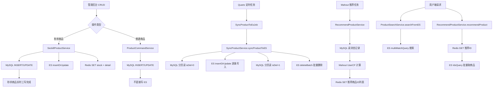

# SpringBoot Elasticsearch 全操作指南

> 📖 <strong>前置阅读</strong>：本文假设读者已了解 ES 的倒排索引、分词器、Mapping 和 REST API 基础操作。如果还不熟悉，建议先阅读 [<strong>Elasticsearch 核心概念：倒排索引、分词器与 REST API 全解析</strong>]()。

本文按照"<strong>先搞懂操作 → 教程版完整实现 → 生产版四种模式 → 验证排错</strong>"的顺序组织。如果你只想快速上手 `ElasticsearchRestTemplate` 的 CRUD 和搜索，读完 Part 1 后直接看 Part 2 即可；如果你想理解真实项目中 ES 是怎么承载搜索、同步、秒杀、推荐四种场景的，需要完整读完。

<strong>关于版本</strong>：Part 2 教程版使用 Spring Boot 3.x + 新版 `ElasticsearchClient`（`spring-boot-starter-data-elasticsearch` 自动配置）；Part 3 生产版使用 Spring Boot 2.7.x + `RestHighLevelClient`（手动创建 Bean）。两个版本不能混用——读者根据自己的 Spring Boot 版本选择对应的代码。

---

# Part 1：先搞懂要做什么

---

## 一、目标说明

这篇文章的目标很明确：让读者在<strong>一篇文章</strong>内学会 SpringBoot 项目中所有常用的 ES 操作，读完就能直接写到项目里。

具体来说，读完这篇文章会掌握：

- 用 <strong>@Document</strong> 和 <strong>@Field</strong> 注解定义 ES 映射
- 用 <strong>ElasticsearchRestTemplate</strong> 执行 CRUD、搜索、聚合、高亮
- 用 <strong>Spring Data ES Repository</strong> 做声明式查询
- <strong>批量写入</strong>、<strong>条件删除</strong> 和 <strong>真实场景串联</strong>
- 一个完整的"商品搜索"功能从零到一的完整代码

## 二、前置条件

| 前置项 | 具体要求 | 验证命令 |
|--------|----------|----------|
| JDK | 17+（文中用 17，8+ 均兼容） | `java -version` |
| Maven | 3.6+ | `mvn -v` |
| SpringBoot | 3.x（文中用 3.2.0） | `mvn dependency:tree \| grep spring-boot` |
| Elasticsearch | 8.x（7.x 也兼容文中大部分操作，需调整配置） | `curl -u elastic http://localhost:9200` |
| 前置知识 | SpringBoot 基础、ES 核心概念（倒排索引、分词器、Mapping） | — |

---

# Part 2：教程版 —— 从零掌握 ES 全部操作

下面每一节都给出了完整的、可运行的代码。整个教程版使用同一个技术栈：Spring Boot 3.x + `spring-boot-starter-data-elasticsearch`，通过 `ElasticsearchRestTemplate` 操作 ES。

---

## 三、环境搭建

### 安装 Elasticsearch 8.x

ES 8.x 默认开启<strong>安全认证</strong>（用户名 `elastic`，密码在首次启动时自动生成）。推荐用 Docker：

```bash
# 创建网络
docker network create elastic

# 启动 ES 8.x（单节点，适合开发）
docker run -d --name es8 \
  --net elastic \
  -p 9200:9200 \
  -e "discovery.type=single-node" \
  -e "xpack.security.enabled=true" \
  -e "ELASTIC_PASSWORD=changeme" \
  docker.elastic.co/elasticsearch/elasticsearch:8.15.0

# 安装 IK 中文分词器
docker exec -it es8 /usr/share/elasticsearch/bin/elasticsearch-plugin install \
  https://get.infini.cloud/elasticsearch/analysis-ik/8.15.0
docker restart es8

# 验证
curl -u elastic:changeme -k https://localhost:9200
```

### 创建 SpringBoot 项目

`pom.xml` 添加依赖：

```xml
<dependency>
    <groupId>org.springframework.boot</groupId>
    <artifactId>spring-boot-starter-data-elasticsearch</artifactId>
</dependency>
<dependency>
    <groupId>org.springframework.boot</groupId>
    <artifactId>spring-boot-starter-web</artifactId>
</dependency>
<dependency>
    <groupId>org.projectlombok</groupId>
    <artifactId>lombok</artifactId>
    <optional>true</optional>
</dependency>
```

`application.yml` 配置连接：

```yaml
spring:
  elasticsearch:
    uris: https://localhost:9200
    username: elastic
    password: changeme
    connection-timeout: 3s
    socket-timeout: 60s
```

Spring Boot 3.x 的 `ElasticsearchConfiguration` 会自动读取这些配置、创建好客户端 bean，不需要手动写 `@Bean`。

连接问题排错：

| 错误信息 | 原因 | 解决 |
|----------|------|------|
| `Connection refused` | ES 没启动或端口不对 | `curl localhost:9200` 确认 |
| `unable to find valid certification path` | 自签名证书验证失败 | 开发环境可临时关闭 SSL 校验 |
| `authentication required` | 用户名密码不对 | 确认 `application.yml` 中的凭据 |
| `NoNodeAvailableException` | 所有节点都连不上 | 逐个 `curl` 各节点 9200 端口 |

---

## 四、教程版完整实现

### 4.1 Entity 映射 —— 用注解定义 ES 文档结构

第一篇里用 REST API 写 Mapping：

```bash
PUT /product { "mappings": { "properties": { "name": { "type": "text" } } } }
```

在 Java 里等价于给实体类加注解：

```java
import org.springframework.data.annotation.Id;
import org.springframework.data.elasticsearch.annotations.*;

@Data
@Document(indexName = "product")
public class Product {

    @Id
    private String id;                        // ES 文档 ID

    @Field(type = FieldType.Text,
           analyzer = "ik_max_word",
           searchAnalyzer = "ik_smart")
    private String name;                      // 商品名 —— 分词后全文搜索

    @Field(type = FieldType.Keyword)
    private String brand;                     // 品牌 —— 精确匹配

    @Field(type = FieldType.Keyword)
    private String category;                  // 分类 —— 精确匹配

    @Field(type = FieldType.Double)
    private Double price;                     // 价格 —— 数值范围过滤

    @Field(type = FieldType.Integer)
    private Integer stock;                    // 库存

    @Field(type = FieldType.Integer)
    private Integer soldCount;                // 销量 —— 排序

    @Field(type = FieldType.Float)
    private Float score;                      // 评分 —— 排序

    @Field(type = FieldType.Date,
           format = DateFormat.custom,
           pattern = "yyyy-MM-dd HH:mm:ss")
    @JsonFormat(pattern = "yyyy-MM-dd HH:mm:ss")
    private LocalDateTime createTime;

    @Field(type = FieldType.Text, analyzer = "ik_max_word")
    private String description;               // 描述 —— 全文搜索
}
```

<strong>核心注解速查</strong>：

| 注解 | 作用 | 对应 REST API |
|------|------|--------------|
| `@Document(indexName)` | 指定 Index 名称 | `PUT /product` |
| `@Id` | 标记文档 ID 字段 | `_id` |
| `@Field(type, analyzer)` | 字段类型和分词器 | Mapping `properties` 中的字段定义 |
| `@Setting` | 索引级配置（分片数、副本数） | `PUT /product { "settings": {...} }` |

<strong>FieldType 速查表</strong>：

| FieldType | ES 类型 | 是否分词 | 场景 |
|-----------|--------|:---:|------|
| `Text` | text | 是 | 商品名、文章正文、描述 |
| `Keyword` | keyword | 否 | 品牌、分类、标签、状态、邮箱 |
| `Integer` | integer | — | 库存、年龄、数量 |
| `Long` | long | — | 大 ID、时间戳 |
| `Double` | double | — | 价格、金额 |
| `Float` | float | — | 评分 |
| `Date` | date | — | 时间字段 |
| `Boolean` | boolean | — | 是否上架、是否删除 |

关于 `text` vs `keyword` 的选型再强调一次：<strong>需要按部分匹配搜索的字段用 Text，只需要精确匹配或排序聚合的字段用 Keyword</strong>。商品名必须是 Text（用户搜"手机"要能命中"华为手机"），品牌用 Keyword（用户筛选"华为"品牌是精确匹配，不需要分词）。

### 4.2 ElasticsearchRestTemplate —— 核心操作类

`ElasticsearchRestTemplate` 是 Spring Data ES 提供的最核心操作类（对标 `RedisTemplate`）。所有 CRUD、搜索、聚合操作都通过它执行。

<strong>4.2.1 索引操作</strong>

```java
@Autowired
private ElasticsearchRestTemplate restTemplate;

// 创建索引（根据 Product 类的注解自动生成 Mapping）
boolean created = restTemplate.indexOps(Product.class).create();

// 检查索引是否存在
boolean exists = restTemplate.indexOps(Product.class).exists();

// 删除索引
restTemplate.indexOps(Product.class).delete();

// 手动写入 Mapping
restTemplate.indexOps(Product.class).putMapping();
```

> ⚠️ 新手提示：`restTemplate.indexOps(Product.class).create()` 会根据 `@Document` 和 `@Field` 注解<strong>自动生成 Mapping 和 Setting</strong>。但如果 ES 中已有同名 Index 且 Mapping 不一致，创建会失败——需要先 `delete()` 再 `create()`。

<strong>4.2.2 文档 CRUD</strong>

```java
// === 新增 / 全量覆盖 ===
Product product = new Product();
product.setId("1");
product.setName("华为Mate60 Pro");
product.setBrand("华为");
product.setCategory("手机");
product.setPrice(6999.0);
product.setStock(500);
product.setSoldCount(12800);
product.setScore(4.8f);
product.setCreateTime(LocalDateTime.of(2024, 1, 15, 10, 30, 0));
product.setDescription("搭载麒麟9000S芯片，支持5G网络");

restTemplate.save(product);   // ID 存在则覆盖，不存在则新增

// === 按 ID 查询 ===
Product found = restTemplate.get("1", Product.class);

// === 按 ID 删除 ===
restTemplate.delete("1", Product.class);
```

> ⚠️ 新手提示：`save()` 是<strong>全量覆盖</strong>，不是部分更新。如果从 JSON 反序列化过来的对象缺少某些字段，save 后这些字段就没了。正确的部分更新方式：先 `get` 查到完整对象，修改字段后再 `save`。

<strong>4.2.3 搜索查询 —— NativeQuery + QueryBuilders</strong>

Spring Data ES 的查询构建从 `NativeQuery` 开始，用 `QueryBuilders` 创建各种查询条件。Java 代码的 QueryBuilder 跟 REST DSL 一一对应——<strong>你写过的 DSL 都能找到对应的 Java Builder 方法</strong>。

```java
import org.springframework.data.elasticsearch.core.ElasticsearchRestTemplate;
import org.springframework.data.elasticsearch.core.SearchHits;
import org.springframework.data.elasticsearch.core.query.NativeQuery;
import org.springframework.data.elasticsearch.core.query.QueryBuilders;

// === match 查询：商品名搜"华为手机" ===
NativeQuery query = NativeQuery.builder()
    .withQuery(QueryBuilders.match()
        .field("name")
        .query("华为手机")
        .build())
    .build();

SearchHits<Product> hits = restTemplate.search(query, Product.class);
hits.forEach(hit -> {
    Product p = hit.getContent();
    float score = hit.getScore();     // 相关性分数
    System.out.println(p.getName() + " | score: " + score);
});
```

<strong>term 精确匹配</strong>：

```java
NativeQuery query = NativeQuery.builder()
    .withQuery(QueryBuilders.term().field("brand").value("华为").build())
    .build();
```

<strong>range 数值范围</strong>：

```java
NativeQuery query = NativeQuery.builder()
    .withQuery(QueryBuilders.range().field("price").gte(3000.0).lte(8000.0).build())
    .build();
```

<strong>bool 组合查询</strong>：

```java
// 搜"手机" + 品牌=华为 + 价格 3000~8000，按销量降序
NativeQuery query = NativeQuery.builder()
    .withQuery(QueryBuilders.bool()
        .must(QueryBuilders.match().field("name").query("手机").build())
        .filter(QueryBuilders.term().field("brand").value("华为").build())
        .filter(QueryBuilders.range().field("price").gte(3000.0).lte(8000.0).build())
        .build())
    .withSort(Sort.by(new Sort.Order(Sort.Direction.DESC, "soldCount")))
    .withPage(Pageable.ofSize(10).withPage(0))
    .build();
```

<strong>分页与排序</strong>：

```java
NativeQuery query = NativeQuery.builder()
    .withQuery(QueryBuilders.matchAll().build())
    .withSort(Sort.by(new Sort.Order(Sort.Direction.DESC, "soldCount")))
    .withPage(Pageable.ofSize(10).withPage(0))
    .build();

SearchHits<Product> hits = restTemplate.search(query, Product.class);
System.out.println("总命中数: " + hits.getTotalHits());
```

<strong>4.2.4 高亮（Highlight）</strong>

```java
NativeQuery query = NativeQuery.builder()
    .withQuery(QueryBuilders.match().field("name").query("华为手机").build())
    .withHighlightQuery(
        new HighlightQuery(
            new Highlight(
                new HighlightParameters.Builder()
                    .withPreTags("<strong>")
                    .withPostTags("</strong>")
                    .build()),
            List.of(new HighlightField("name"))
        ))
    .build();

SearchHits<Product> hits = restTemplate.search(query, Product.class);
hits.forEach(hit -> {
    List<String> highlightName = hit.getHighlightField("name");
    if (highlightName != null && !highlightName.isEmpty()) {
        System.out.println("高亮: " + highlightName.get(0));
        // 输出：高亮: <strong>华为</strong>Mate60 <strong>手机</strong>
    }
});
```

<strong>4.2.5 聚合查询</strong>

```java
// 按品牌分组统计商品数量
NativeQuery query = NativeQuery.builder()
    .withQuery(QueryBuilders.matchAll().build())
    .withAggregation("brand_stats",
        AggregationBuilders.terms().field("brand").build())
    .withMaxResults(0)   // 不返回文档，只返回聚合结果
    .build();

// 按价格字段求 stats（一次返回 count/min/max/avg/sum 五个值）
query = NativeQuery.builder()
    .withQuery(QueryBuilders.matchAll().build())
    .withAggregation("price_stats",
        AggregationBuilders.stats().field("price").build())
    .withMaxResults(0)
    .build();
```

<strong>嵌套聚合</strong>：先按品牌分组，每个品牌下再按分类分组：

```java
NativeQuery query = NativeQuery.builder()
    .withQuery(QueryBuilders.matchAll().build())
    .withAggregation("by_brand",
        AggregationBuilders.terms().field("brand").build())
    .withSubAggregation("by_brand", "by_category",
        AggregationBuilders.terms().field("category").build())
    .withMaxResults(0)
    .build();
```

### 4.3 Spring Data ES Repository —— 声明式查询

对于<strong>简单查询</strong>，Spring Data ES 提供了类似 JPA 的 Repository 接口——方法名即查询。

```java
@Repository
public interface ProductRepository extends ElasticsearchRepository<Product, String> {

    List<Product> findByBrand(String brand);
    List<Product> findByCategoryAndBrand(String category, String brand);
    List<Product> findByPriceBetween(Double from, Double to);
    List<Product> findByCategoryOrderBySoldCountDesc(String category);
    Page<Product> findByBrand(String brand, Pageable pageable);
}
```

<strong>方法命名规则</strong>：

| 方法名片段 | 含义 | 等效 DSL |
|-----------|------|---------|
| `findBy` / `searchBy` | 查询 | term: { brand: "xxx" } |
| `And` / `Or` | 与 / 或 | bool must |
| `Between` | 区间 | range: { gte, lte } |
| `OrderByXxxDesc` | 按某字段降序 | sort: { soldCount: desc } |
| `LessThan` / `GreaterThan` | 小于 / 大于 | range: { lt } / { gt } |
| `In` | IN 查询 | terms: { brand: [...] } |

Repository 的局限：只支持<strong>精确匹配 + 简单范围</strong>的查询，不支持 match 分词搜索、不支持 bool 组合查询、不支持聚合。需要复杂查询时用 <strong>@Query 注解</strong>直接手写 DSL：

```java
@Repository
public interface ProductRepository extends ElasticsearchRepository<Product, String> {

    @Query("{\"match\": {\"name\": {\"query\": \"?0\"}}}")
    List<Product> searchByName(String keyword);

    @Query("{\"bool\": {" +
           "  \"must\": [{\"match\": {\"name\": \"?0\"}}]," +
           "  \"filter\": [{\"term\": {\"brand\": \"?1\"}}]" +
           "}}")
    List<Product> searchByNameAndBrand(String keyword, String brand);
}
```

<strong>Repository vs ElasticsearchRestTemplate 怎么选？</strong>

| 维度 | Repository | ElasticsearchRestTemplate |
|------|:---:|:---:|
| 简单精确查询 | 方法名搞定，简洁 | 需要手动 build Query |
| 复杂查询（bool / 聚合） | 需 `@Query` 手写 DSL | API 构建，类型安全 |
| 推荐场景 | 简单 CRUD + 精确查 | 全文搜索 + 聚合 + 自定义排序 + 高亮 |

### 4.4 批量写入（Bulk）

批量写入 1000 条数据，逐条 `save()` 就是 1000 次网络往返。ES 提供了 Bulk API：

```java
List<Product> products = generateProducts(1000);

List<IndexQuery> queries = products.stream()
    .map(p -> new IndexQueryBuilder()
        .withId(p.getId())
        .withObject(p)
        .build())
    .toList();

restTemplate.bulkIndex(queries, Product.class);   // 一次网络请求
```

> ⚠️ 新手提示：批量写入单批建议 <strong>2000 ~ 5000 条，单批总大小 5 ~ 15MB</strong>。太大容易 OOM 或者 ES 端 reject，太小网络开销划不来。

### 4.5 条件删除

```java
NativeQuery query = NativeQuery.builder()
    .withQuery(QueryBuilders.term().field("brand").value("华为").build())
    .build();

restTemplate.delete(query, Product.class);
```

### 4.6 教程版小结

到这里，你已经掌握了 Spring Data ES 的全部基础操作。核心公式是：

```
ElasticsearchRestTemplate 负责执行 → NativeQuery 负责描述查询 → @Document 负责映射结果
```

<strong>教程版的问题</strong>——也是你必须继续读 Part 3 的原因：

| 问题 | 后果 |
|------|------|
| `@Document(indexName = "product")` 硬编码索引名 | 多环境切换索引不方便 |
| `save()` 自动写入 `_class` 字段 | 索引污染，Entity 重命名后反序列化失败 |
| 只用 `NativeQuery` 构建查询 | 复杂搜索（多字段匹配 + 多维度排序）难以表达 |
| 没有数据同步机制 | MySQL 数据变更后 ES 索引不会自动更新 |
| Entity 字段用标准类型 | 排序字段需要针对性优化（Keyword vs Integer） |

这 5 个问题，正是 Part 3 要逐一解决的。

---

# Part 3：生产版 —— 真实项目中的 ES 实战模式

Part 2 教了 ES 怎么操作。Part 3 回答另一个问题：<strong>ES 在真实项目中是怎么用的？</strong>

答案是四种截然不同的模式——<strong>普通商品搜索、批量定时同步、秒杀实时三写、推荐引擎</strong>。在讲模式之前，先介绍生产版的基础设施：连接配置、Entity 设计、EsTemplate 封装。

> 以下代码均来自真实 mall 商城项目 `mall_server`，包路径 `com.mall`。该项目基于 <strong>Spring Boot 2.7.x + RestHighLevelClient</strong>——和 Part 2 的 Spring Boot 3.x + ElasticsearchClient 是两套不同的技术栈。每个代码块都是完整的、可直接参考的。

---

## 五、生产版 ES 连接配置

### 5.1 application.yml

Spring Boot 2.7.x 不支持 `spring.elasticsearch.uris` 自动配置，需要手动创建 `RestHighLevelClient` Bean。

```yaml
# application-dev.yml（开发环境）
spring:
  elasticsearch:
    host: 117.72.88.11
    port: 9200
    username: elastic
    password: susan123

# application-prod.yml（生产环境——敏感信息走环境变量）
spring:
  elasticsearch:
    host: ${ES_HOST}
    port: ${ES_PORT:9200}
    username: ${ES_USER}
    password: ${ES_PASSWORD}
```

> ⚠️ 新手提示：dev 直接写 IP 和密码很方便，但生产环境必须用环境变量 `${ES_HOST}` 注入——配置文件是提交到 Git 的，密码写死在文件里等于公开。

### 5.2 EsConfig —— 手动创建 RestHighLevelClient

```java
package com.mall.service.config;

@Configuration
public class EsConfig {

    @Value("${spring.elasticsearch.host:}")
    private String host;

    @Value("${spring.elasticsearch.port:9200}")
    private int port;

    @Value("${spring.elasticsearch.username:}")
    private String username;

    @Value("${spring.elasticsearch.password:}")
    private String password;

    @Bean
    public RestHighLevelClient restHighLevelClient() {
        RestClientBuilder clientBuilder = RestClient
            .builder(Arrays.stream(host.split(","))          // ① 支持多节点集群：逗号分隔
                .map(s -> new HttpHost(s, port))
                .toArray(HttpHost[]::new));
        if (StringUtils.hasText(username)) {
            CredentialsProvider credentialsProvider = new BasicCredentialsProvider();
            credentialsProvider.setCredentials(AuthScope.ANY,
                new UsernamePasswordCredentials(username, password));
            clientBuilder.setHttpClientConfigCallback(
                httpClientBuilder -> httpClientBuilder
                    .setDefaultCredentialsProvider(credentialsProvider));
                                                              // ② Basic Auth 认证
        }
        return new RestHighLevelClient(clientBuilder);
    }
}
```

<strong>两个设计决策</strong>：

<strong>① 为什么不是 `spring.elasticsearch.uris`？</strong> Spring Boot 3.x 的自动配置走的是新版 `ElasticsearchClient`，Spring Boot 2.7.x 不支持。项目跑在 2.7.x 上，只能用自定义属性手动组装 `HttpHost`。

<strong>② 为什么不直接用 Spring Data ES 的 `ElasticsearchRestTemplate`？</strong> Spring Data ES 在 2.7.x 确实提供了模板类，但项目选择绕过——原因见下一节。

---

## 六、生产版 Entity 设计

### 6.1 ES 文档基类 —— EsBaseEntity

```java
package com.mall.common.entity;

@Data
@AllArgsConstructor
@NoArgsConstructor
public class EsBaseEntity implements Serializable {
    private String id;                    // ES 文档 _id
    private Map<String, Object> data;     // 通用兜底容器
}
```

`data` 字段是一个防御性设计——当 JSON 里有 `@Field` 注解没覆盖到的字段时，FastJSON 会把它们塞进 `data` Map 里，不会丢数据。MySQL 表加字段后，即使忘记更新 ES Entity，同步也不会报错。

### 6.2 商品搜索文档 —— ProductVO

```java
package com.mall.domain.mall.entity.web;

@Document(indexName = "#{businessConfig.productEsIndexName}")  // ① SpEL 动态解析索引名
@Data
@AllArgsConstructor
@NoArgsConstructor
public class ProductVO extends EsBaseEntity {

    private Long categoryId;
    private String name;
    private String model;
    private Integer quantity;
    private Integer remainQuantity;

    @Field(type = FieldType.Keyword)
    private String price;                // ② BigDecimal → String，Keyword 类型

    private String cover;
    private Integer productType;

    @Field(type = FieldType.Keyword)
    private String saleQuantity;         // ② Integer → String，Keyword 类型

    private String commentCount;

    @Field(type = FieldType.Keyword)
    private String positiveRating;       // ② 好评率，Keyword 类型

    private String totalAmount;
}
```

<strong>三个与教程版不同的设计决策</strong>：

<strong>① 为什么索引名用 SpEL `#{businessConfig.productEsIndexName}`？</strong>

`@Document(indexName = "product")` 是硬编码。项目有两个 ES 索引——`product-es-index-v1`（普通商品）和 `seckill-product-es-index-v1`（秒杀商品），名称定义在配置类中：

```java
package com.mall.service.config;

@Data
@Component
@ConfigurationProperties(prefix = "mall.api")
public class BusinessConfig {
    private String productEsIndexName = "product-es-index-v1";
    private String seckillProductEsIndexName = "seckill-product-es-index-v1";
}
```

SpEL `#{businessConfig.productEsIndexName}` 让索引名从配置中心动态读取——切换索引版本（如 `product-es-index-v2`）时只需改配置，不用改代码。

<strong>② 为什么 `price`、`saleQuantity`、`positiveRating` 用 `Keyword` 而不是 `Integer` / `Double`？</strong>

这是项目里最重要的 ES 优化之一——<strong>这三个字段不是用来做范围过滤的，而是用来排序的</strong>。来看真实搜索代码里的排序：

```java
searchSourceBuilder.sort(SortBuilders.fieldSort("saleQuantity.keyword").order(SortOrder.DESC));
searchSourceBuilder.sort(SortBuilders.fieldSort("positiveRating.keyword").order(SortOrder.DESC));
searchSourceBuilder.sort(SortBuilders.fieldSort("price.keyword").order(SortOrder.DESC));
```

ES 里 `Keyword` 类型的排序比 `Integer` / `Double` 更快——不需要解析数值，直接按字典序比较字节。而且项目里这些字段是从 `BigDecimal` / `Integer` 转成 `String` 存的，前端不需要在 ES 层做范围过滤（范围过滤在业务层用 MySQL 做了），所以<strong>转成 Keyword、省掉数值解析开销</strong>。

<strong>③ 为什么继承 `EsBaseEntity` 而不是直接实现？</strong> `EsBaseEntity` 是项目中所有 ES 文档的公共父类，统一管理 `_id` 和 `data` 兜底字段——确保所有 ES Entity 都有一致的 `id` 字段和防御性的 `data` 容器。

---

## 七、生产版 EsTemplate 封装

### 7.1 为什么不直接用 ElasticsearchRestTemplate？

Spring Data ES 的 `MappingElasticsearchConverter` 会自动给每个文档加上 `_class` 字段（存 Java 全限定类名）。这有两个问题：一是 `_class` 字段污染索引、占存储空间；二是当 Entity 类重命名或移动包时，旧数据的 `_class` 值对不上，反序列化直接报错。

项目选择 <strong>`RestHighLevelClient` 原生 API + `FastJSON` 手动序列化</strong>——完全控制 JSON 结构，不产生任何元数据字段。

### 7.2 EsTemplate 完整代码

```java
package com.mall.service.es;

@Component
@Slf4j
public class EsTemplate {

    @Autowired
    private RestHighLevelClient restHighLevelClient;

    /**
     * 写入 / 更新（upsert）——单条也用 BulkRequest 包装
     */
    public boolean insertOrUpdate(String indexName, EsBaseEntity esBaseEntity) {
        BulkRequest bulkRequest = new BulkRequest();
        IndexRequest request = new IndexRequest(indexName);
        request.id(esBaseEntity.getId());
        request.source(JSON.toJSONString(esBaseEntity), XContentType.JSON);
        bulkRequest.add(request);
        try {
            BulkResponse response = restHighLevelClient.bulk(bulkRequest, RequestOptions.DEFAULT);
            return response.status().equals(RestStatus.OK);
        } catch (IOException e) {
            log.error("写入ES失败，原因：", e);
            throw new BusinessException("写入ES失败");
        }
    }

    /**
     * 批量删除
     */
    public <T> boolean deleteBatch(String indexName, Collection<T> idList) throws IOException {
        BulkRequest request = new BulkRequest();
        idList.forEach(item -> request.add(new DeleteRequest(indexName, item.toString())));
        BulkResponse bulkResponse = restHighLevelClient.bulk(request, RequestOptions.DEFAULT);
        boolean flag = true;
        for (BulkItemResponse response : bulkResponse) {
            if (response.isFailed()) {
                flag = false;
                BulkItemResponse.Failure failure = response.getFailure();
                log.error(failure.getMessage(), failure.getCause());
            }
        }
        return flag;
    }

    /**
     * 搜索（带总数）
     */
    public <T> List<T> search(String idxName, SearchSourceBuilder builder,
                               Class<T> aClass, ResponsePageEntity responsePageEntity)
            throws IOException {
        SearchRequest request = new SearchRequest(idxName);
        request.source(builder);
        SearchResponse response = restHighLevelClient.search(request, RequestOptions.DEFAULT);
        SearchHit[] hits = response.getHits().getHits();
        responsePageEntity.setTotalCount((int) response.getHits().getTotalHits().value);
        return Arrays.stream(hits)
            .map(hit -> JSON.parseObject(hit.getSourceAsString(), aClass))
            .collect(Collectors.toList());
    }

    /**
     * 搜索（不带总数）
     */
    public <T> List<T> search(String idxName, SearchSourceBuilder builder, Class<T> aClass)
            throws IOException {
        SearchRequest request = new SearchRequest(idxName);
        request.source(builder);
        SearchResponse response = restHighLevelClient.search(request, RequestOptions.DEFAULT);
        SearchHit[] hits = response.getHits().getHits();
        return Arrays.stream(hits)
            .map(hit -> JSON.parseObject(hit.getSourceAsString(), aClass))
            .collect(Collectors.toList());
    }
}
```

<strong>单条写入为什么也用 `BulkRequest`？</strong> 不是为了批量——Bulk API 的响应粒度更细：每条 `BulkItemResponse` 都有独立的成功/失败标记和错误信息。单条 `IndexRequest` 调用失败时只知道"失败了"，不知道具体原因。`BulkItemResponse.isFailed()` 能精确定位<strong>哪一条数据写入失败、失败原因是什么</strong>。

---

## 八、模式一：普通商品搜索（实时查询）

### 8.1 搜索实现 —— ProductSearchService.searchFromES()

用户端发起搜索请求，ES 执行 `multiMatchQuery` + 多维度排序：

```java
package com.mall.service.mall;

@Slf4j
@Service
public class ProductSearchService {

    @Autowired
    private EsTemplate esTemplate;
    @Autowired
    private BusinessConfig businessConfig;

    public ResponsePageEntity<ProductVO> searchFromES(ProductConditionVO productQuery) {
        try {
            SearchSourceBuilder searchSourceBuilder = new SearchSourceBuilder();
            searchSourceBuilder.from(productQuery.getPageBegin());
            searchSourceBuilder.size(productQuery.getPageSize());

            // ① 分类筛选：matchQuery 精确匹配 categoryId
            if (Objects.nonNull(productQuery.getCategoryId())) {
                searchSourceBuilder.query(
                    QueryBuilders.matchQuery("categoryId", productQuery.getCategoryId()));
            }

            // ② 关键词搜索：multiMatchQuery 同时在 name 和 model 两个字段搜
            if (StringUtils.hasLength(productQuery.getKeyword())) {
                searchSourceBuilder.query(
                    QueryBuilders.multiMatchQuery(productQuery.getKeyword(), "name", "model"));
            }

            // ③ 多维度排序策略
            setTypeCondition(productQuery, searchSourceBuilder);

            ResponsePageEntity responsePageEntity = ResponsePageEntity.buildEmpty(productQuery);
            List<ProductVO> productEntities = esTemplate.search(
                businessConfig.getProductEsIndexName(), searchSourceBuilder,
                ProductVO.class, responsePageEntity);
            return ResponsePageEntity.build(productQuery,
                responsePageEntity.getTotalCount(), productEntities);
        } catch (IOException e) {
            log.error("从ES中查询商品失败，原因：", e);
            return ResponsePageEntity.buildEmpty(productQuery);
        }
    }

    private void setTypeCondition(ProductConditionVO productQuery,
                                   SearchSourceBuilder searchSourceBuilder) {
        switch (productQuery.getType()) {
            case 1:  // 综合排序：销量↓ + 好评率↓ + 价格↓
                sortByComprehensive(searchSourceBuilder);
                break;
            case 2:  // 按销量排序
                sortBySaleQuantity(searchSourceBuilder);
                break;
            case 3:  // 按价格排序
                sortByPrice(searchSourceBuilder);
                break;
        }
    }

    private void sortByComprehensive(SearchSourceBuilder searchSourceBuilder) {
        searchSourceBuilder.sort(
            SortBuilders.fieldSort("saleQuantity.keyword").order(SortOrder.DESC));
        searchSourceBuilder.sort(
            SortBuilders.fieldSort("positiveRating.keyword").order(SortOrder.DESC));
        searchSourceBuilder.sort(
            SortBuilders.fieldSort("price.keyword").order(SortOrder.DESC));
    }
}
```

<strong>三个优化决策</strong>：

<strong>① 为什么用 `multiMatchQuery` 而不是分别写 match？</strong> 商品搜索的输入是一个字符串——用户可能在搜商品名（"华为Mate60"）也可能在搜型号（"Mate60 Pro"）。`multiMatchQuery` 一次搜索同时命中 `name` 和 `model` 两个字段，ES 内部自动算加权分。

<strong>② 为什么排序字段后面都加 `.keyword`？</strong> `price`、`saleQuantity`、`positiveRating` 全是 `Keyword` 类型——`SortBuilders.fieldSort("saleQuantity")` 对 text 字段排序会报错，必须指定 `.keyword` 子字段。

<strong>③ 为什么用 `SearchSourceBuilder`（原生 ES API）而不是 `NativeQuery`？</strong> `EsTemplate.search()` 接收的就是原生 `SearchSourceBuilder`——它直接透传给 `RestHighLevelClient`，不经过 Spring Data 的任何转换。<strong>少一层封装就少一层序列化开销</strong>。

---

## 九、模式二：普通商品批量同步（定时任务）

普通商品的 ES 索引<strong>不是实时更新的</strong>——商品新增/修改/删除后，MySQL 立即生效，但 ES 要等到下一个定时任务跑完才同步。这是 mall 项目里<strong>最"重"的 ES 操作</strong>。

### 9.1 SyncProductService 完整代码

```java
package com.mall.service.es;

@Slf4j
@Service
public class SyncProductService {
    private static final BigDecimal ONE_HUNDRED = new BigDecimal(100);

    @Autowired
    private ProductService productService;
    @Autowired
    private EsTemplate esTemplate;
    @Autowired
    private BusinessConfig businessConfig;
    @Autowired
    private ProductCommentMapper productCommentMapper;
    @Autowired
    private TradeItemService tradeItemService;
    @Autowired
    private ProductConvertMapper productConvertMapper;

    public void syncProductToES() {
        handleInsertOrUpdate();    // ① 同步活跃商品
        handleDelete();            // ② 清理已删除商品
    }

    // ============ ① 同步活跃商品 ============
    private void handleInsertOrUpdate() {
        ProductQuery productQuery = new ProductQuery();
        productQuery.setPageSize(500);     // 每批 500 条，避免 OOM
        productQuery.setIsDel(0);
        ResponsePageEntity<ProductEntity> page = productService.searchByPage(productQuery);

        while (CollectionUtils.isNotEmpty(page.getData())) {
            saveData(page.getData());
            productQuery.setPageNo(productQuery.getPageNo() + 1);
            page = productService.searchByPage(productQuery);
        }
    }

    private void saveData(List<ProductEntity> productEntities) {
        List<ProductVO> dataList = productEntities.stream()
            .map(x -> productConvertMapper.toProductVO(x))   // MapStruct 转换
            .collect(Collectors.toList());

        for (ProductVO productVO : dataList) {
            statSaleCount(productVO);          // 从订单表统计实时销量
            statPositiveRating(productVO);     // 从评价表统计好评率
            esTemplate.insertOrUpdate(         // 逐条 upsert 到 ES
                businessConfig.getProductEsIndexName(), productVO);
        }
    }

    // ============ ② 清理已删除商品 ============
    private void handleDelete() {
        ProductQuery productQuery = new ProductQuery();
        productQuery.setPageSize(500);
        productQuery.setIsDel(1);              // 查软删除的商品
        ResponsePageEntity<ProductEntity> page = productService.searchByPage(productQuery);

        while (CollectionUtils.isNotEmpty(page.getData())) {
            List<Long> idList = page.getData().stream()
                .map(ProductEntity::getId).collect(Collectors.toList());
            try {
                esTemplate.deleteBatch(        // 从 ES 中清除
                    businessConfig.getProductEsIndexName(), idList);
            } catch (IOException e) {
                log.error("删除ES中的商品失败，原因：", e);
            }
            productQuery.setPageNo(productQuery.getPageNo() + 1);
            page = productService.searchByPage(productQuery);
        }
    }
}
```

### 9.2 三个值得注意的设计

<strong>① 为什么逐条写入而不是 `batchInsert` 批量？</strong>

`statSaleCount()` 和 `statPositiveRating()` 需要<strong>逐条计算</strong>销量和好评率——每条商品都要分别查订单表和评价表。批量写入意味着要先批量查出所有商品的统计数据，内存开销太大。逐条处理虽然多了网络往返，但<strong>内存可控、失败可重试单条</strong>。

<strong>② 为什么同步要分 `isDel=0` 和 `isDel=1` 两趟？</strong>

MySQL 里删除是软删除（`isDel=1`），数据还在。但 ES 索引不需要保留已删除的商品——`isDel=0` → ES upsert，`isDel=1` → ES delete。这样 ES 索引只包含<strong>当前在售</strong>的商品。

<strong>③ 为什么销量和好评率不在 MySQL 写入时就计算好？</strong>

销量来自订单表，好评率来自评价表——这两个是实时变化的数据。选择<strong>在 ES 同步任务里实时计算</strong>——每次定时任务跑的时候去查最新的订单和评价数据。代价是同步任务变重了，好处是 ES 数据始终是准的。

### 9.3 ProductConvertMapper —— Entity 转换

同步时需要把 MySQL 的 `ProductEntity` 转成 ES 的 `ProductVO`：

```java
package com.mall.service.mapper;

@Mapper(componentModel = "spring", unmappedTargetPolicy = ReportingPolicy.IGNORE)
public interface ProductConvertMapper {

    @Mappings({
        @Mapping(source = "id", target = "id", qualifiedByName = "longToString"),
        @Mapping(source = "price", target = "price", qualifiedByName = "bigDecimalToString"),
        @Mapping(source = "coverUrl", target = "cover")
    })
    ProductVO toProductVO(ProductEntity entity);

    @Named("longToString")
    default String longToString(Long value) {
        return value != null ? String.valueOf(value) : null;
    }

    @Named("bigDecimalToString")
    default String bigDecimalToString(BigDecimal value) {
        return value != null ? value.toString() : null;
    }
}
```

同步任务通过 Quartz 动态定时任务触发——cron 表达式存在 `common_job` 表中，运营可以在后台随时调整同步频率。

---

## 十、模式三：秒杀商品实时三写（DB + ES + Redis）

秒杀商品和普通商品不一样——<strong>秒杀是高并发场景，数据必须实时准确</strong>。所以秒杀商品的新增/修改不走定时任务，而是写 MySQL 的同时<strong>立即同步 ES 和 Redis</strong>：

### 10.1 新增秒杀商品

```java
// SeckillProductService.insert()
public void insert(SeckillProductEntity seckillProductEntity) {
    checkParam(seckillProductEntity);
    seckillProductMapper.insert(seckillProductEntity);    // ① MySQL
    syncToESAndRedis(seckillProductEntity);                // ② ES + Redis
}

private void syncToESAndRedis(SeckillProductEntity entity) {
    // 查商品封面图（MySQL）
    List<ProductPhotoEntity> photos = productPhotoMapper.searchByCondition(query);
    ESSeckillProductEntity esEntity = seckillConvertMapper.toESEntity(entity);

    if (CollectionUtils.isNotEmpty(photos)) {
        photos.stream()
            .filter(x -> PhotoTypeEnum.COVER.getValue().equals(x.getType()))
            .findAny().ifPresent(p -> esEntity.setCover(p.getUrl()));
    }

    esTemplate.insertOrUpdate(                                  // ②-1 写入 ES
        businessConfig.getSeckillProductEsIndexName(), esEntity);
    redisUtil.increment(getSeckillProductStockKey(esEntity.getId()),   // ②-2 Redis 库存
        esEntity.getWithHoldQuantity());
    redisUtil.set(getSeckillProductDetailKey(esEntity.getId()),        // ②-3 Redis 详情
        JSON.toJSONString(seckillDetailEntity));
}
```

### 10.2 删除秒杀商品

```java
// SeckillProductService.deleteByIds()
return transactionTemplate.execute((status -> {
    int count = seckillProductMapper.deleteByIds(ids, entity);       // ① MySQL
    // TODO: 后续优化 —— 将 ES 删除和 Redis 清除迁移到 MQ 消费者中
    esTemplate.deleteBatch(                                          // ② ES
        businessConfig.getSeckillProductEsIndexName(), ids);
    for (Long id : ids) {
        redisUtil.del(getSeckillProductDetailKey(id.toString()));    // ③ Redis
    }
    return count;
}));
```

> ⚠️ 写过的都懂——代码里有个 `TODO`。理想情况下 ES 和 Redis 的清除不应该阻塞数据库事务——接到删除请求 → 删 MySQL → 发 MQ 消息 → 异步清 ES 和 Redis。但在事务里同步清也有好处：<strong>三者强一致，不会出现"MySQL 已删但 ES 还能搜到"的窗口</strong>。

---

## 十一、模式四：推荐引擎（Mahout → Redis → ES IdsQuery）

mall 项目基于 Mahout 的 User-Based CF（协同过滤）实现了简单的商品推荐。流程分两步：

<strong>Step 1：离线计算</strong>——定时任务从 MySQL 读取用户浏览记录 → Mahout 计算用户相似度 → 给每个用户推荐 N 个商品 ID → 存入 Redis。

<strong>Step 2：在线查询</strong>——用户访问首页时，从 Redis 取出推荐的商品 ID 列表 → 用 ES `IdsQuery` 批量取完整商品文档：

```java
public List<ProductVO> recommendProduct() {
    JwtUserEntity user = FillUserUtil.getCurrentUserInfoOrNull();
    if (user == null) return Collections.emptyList();

    String json = redisUtil.get("userRecommendProduct:" + user.getId());
    List<Long> productIdList = JSONUtil.toList(json, Long.class);

    SearchSourceBuilder searchSourceBuilder = new SearchSourceBuilder();
    IdsQueryBuilder idsQueryBuilder = QueryBuilders.idsQuery();
    idsQueryBuilder.addIds(
        productIdList.stream().map(String::valueOf).toArray(String[]::new));
    searchSourceBuilder.query(idsQueryBuilder);

    return esTemplate.search(
        businessConfig.getProductEsIndexName(), searchSourceBuilder, ProductVO.class);
}
```

<strong>为什么推荐用 `IdsQuery` 而不是 `multiMatchQuery`？</strong> Mahout 已经算好了推荐给用户的具体是哪些商品，输出的是<strong>精确的商品 ID 列表</strong>。`IdsQuery` 直接按 `_id` 批量取文档——ES 内部走 `GET /_doc/id` 级别的索引查找，比全文搜索快一个数量级。

---

## 十二、四种模式对照

| 模式 | 数据流向 | 同步时机 | 一致性 | 适用场景 |
|------|------|:---:|:---:|------|
| 普通商品搜索 | MySQL → 定时任务 → ES → 用户 | 定时（分钟级） | 最终一致 | 搜索框、商品列表 |
| 批量同步 | MySQL ⇄ ES 双向对比 | 定时（可配置） | 最终一致 | 商品上下架、全量刷新 |
| 秒杀三写 | MySQL + ES + Redis 同一事务 | 实时 | 强一致（尽力） | 秒杀商品上架 |
| 推荐引擎 | MySQL → Mahout → Redis → ES | 离线计算 | Redis 缓存为准 | 首页推荐、猜你喜欢 |

<strong>数据流全景</strong>：



---

# Part 4：验证与排错

---

## 十三、常见问题排查表

| 现象 | 可能原因 | 排查方法 |
|------|----------|----------|
| 搜索结果为空 | text 字段用了 term 查询 | 改 match 查询，或检查分词结果：`/_analyze` |
| 聚合结果不对 | 对 text 字段做了聚合 | 聚合用 keyword 类型字段或 `.keyword` 子字段 |
| 写入后查不到 | refresh 间隔未到（默认 1s） | 等待 1s 后重试，或手动 `POST /index/_refresh` |
| `document missing` 异常 | ID 写错了或文档已被删除 | 先用 `HEAD /index/_doc/id` 确认存在 |
| 连接超时 | ES 地址或端口配错 | `curl -u elastic:pass http://es:9200` 确认连通 |
| `SSLHandshakeException` | ES 8.x 自签名证书 | 开发环境临时关闭 SSL 校验 |
| 批量写入很慢 | 单批太大 / ES 负载过高 | 减小批次到 2000 条，检查 ES 的 `_cat/thread_pool` |
| Repository 方法不生效 | 方法名不符合命名规则 | 检查方法名中字段名是否与 Entity 一致 |
| 定时任务跑了但 ES 数据还是旧的 | `insertOrUpdate` 逐条写入失败但异常被吞了 | 检查 `EsTemplate.insertOrUpdate()` 日志 |
| FastJSON 反序列化字段为 null | ES 中存的字段名（snake_case）和 Java 类属性名（camelCase）不一致 | 统一用 `@Field` 注解显式指定，或用 `@JSONField(name = "xxx")` |
| 秒杀搜索能查到已删除的商品 | `deleteByIds` 中的 ES 删除被 try-catch 吞了 | 检查 `SeckillProductService.deleteByIds()` 的异常处理 |
| `RestHighLevelClient` 编译警告：deprecated | ES 7.15+ 标记为废弃，ES 8.x 已移除 | 迁移到新版 `ElasticsearchClient`，Spring Boot 3.x + `spring-boot-starter-data-elasticsearch` 已自动切换 |

---

## 十四、总结

<strong>这篇覆盖的全部内容</strong>：

- <strong>ES 连接配置</strong>：Spring Boot 3.x 自动配置 + Spring Boot 2.7.x 手动 `RestHighLevelClient` Bean 创建（多节点 + Basic Auth）
- <strong>@Document / @Field 注解</strong>：用 Java 注解定义 ES Mapping，含真实项目中的 `ProductVO` + `EsBaseEntity` + SpEL 动态索引名
- <strong>ElasticsearchRestTemplate</strong>：索引 CRUD、文档 CRUD、match/term/range/bool 搜索、高亮、聚合
- <strong>真实项目 EsTemplate 封装</strong>：`RestHighLevelClient` + `FastJSON` 手动序列化，`BulkRequest` 单条 upsert，`deleteBatch` 批量删除
- <strong>BusinessConfig 配置类</strong>：SpEL 动态索引名背后的配置中心
- <strong>真实搜索优化</strong>：`multiMatchQuery` 多字段匹配 + `SortBuilders.fieldSort` 多维度排序 + `Keyword` 类型排序优化
- <strong>ProductConvertMapper</strong>：MapStruct 转换 MySQL Entity → ES VO（`longToString` / `bigDecimalToString`）
- <strong>四种 ES 数据流转模式</strong>：普通商品搜索 | 批量定时同步（MySQL→ES） | 秒杀实时三写（MySQL+ES+Redis） | 推荐引擎（Mahout→Redis→ES IdsQuery）

<strong>下一步建议</strong>：

1. 把文中的示例代码拷到项目里跑一遍，改改参数看看效果
2. 继续阅读 [<strong>ES 高级搜索与聚合分析</strong>]()，掌握 multi_match 多字段搜索、bool 查询深入、聚合分析进阶、相关性算分原理和搜索建议
3. 在 Kibana Dev Tools 里多跑 `_explain`，理解每次搜索的评分细节

把 ES 用好是后端开发的基本功——大部分项目的搜索框背后都是它。
