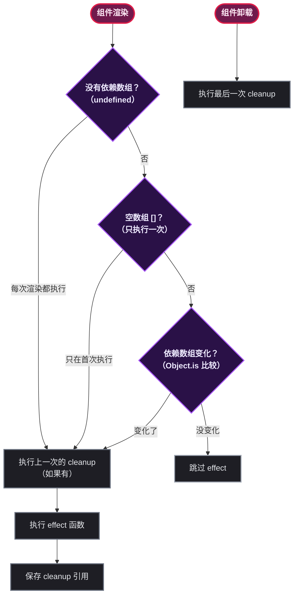
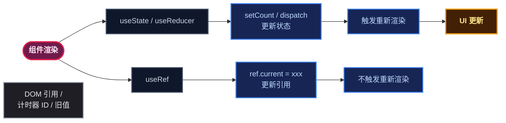
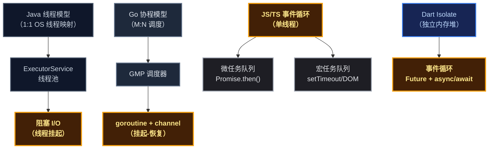
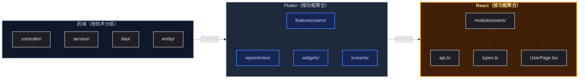

# 从 Java/Go 到 React，顺便拉 Flutter 垫背

## 一、前言：为什么后端程序员学 React 想骂人？

某后端组有天接了个需求：用 React + TypeScript 写个管理后台。组里人均三年 Spring Boot 或 Go Gin 经验，前端认知停留在 jQuery 版本。一开始想的是"TS 不就是带类型的 JS 嘛，有类型就不慌"——结果打开第一个 React 教程就傻了：函数组件、Hooks、闭包陷阱、依赖数组、JSX 里嵌逻辑……这哪是前端，这分明是另一个世界。

后端思维高度固化：类继承、接口实现、线程阻塞、强类型、反射——这些概念在 Spring 和 Go 里是护城河，在 React 里是全都没用的东西。类？函数组件不需要。接口？TS 的结构化类型不需要显式 implements。线程？JS 单线程事件循环，根本没有多线程。

Flutter 被拉进来做"中间翻译器"：Dart 语法像 Java，但框架思维像 React。先写 Flutter 再写 React，会发现很多映射：Widget 树 >= 虚拟 DOM，setState >= useState，initState/dispose >= useEffect。把 Flutter 当"桥梁"，Java/Go 当"起点"，React 就没那么陌生。

为什么不直接对比？因为 Java 和 TS 差距太大——标称类型 vs 结构类型，多线程阻塞 vs 单线程事件循环。中间垫一个 Flutter（标称类型 + 单线程异步 + 声明式 UI），过渡就平滑了。

## 二、六大"反后端直觉"的 TS 语法（React 前端视角）

### 2.1 联合类型 `|` 和 交叉类型 `&`

后端反射：Java interface 多实现、Go struct 组合——都是为了"兼有多种能力"。Flutter 没有联合类型，用 `sealed class `（3.0 引入）替代。

TS 的 `|` 表示"或"——满足一个就行；`&` 表示"且"——必须全部满足。折磨点：**TS 是结构类型**，不是 Java/Go/Dart 的标称类型。TS 只看形状，不名字。

React 场景：Button 组件的 Props 用联合类型表达变体，用交叉类型合并 Props。

代码示例：Java interface 多实现 vs TS 交叉类型

```java
// Java：接口多实现
interface Flyable { void fly(); }
interface Swimmable { void swim(); }
class Duck implements Flyable, Swimmable {
    public void fly() { System.out.println("飞"); }
    public void swim() { System.out.println("游"); }
}
```

```dart
// Dart：混入实现交叉效果
mixin Flyable { void fly() => print('飞'); }
mixin Swimmable { void swim() => print('游'); }
class Duck with Flyable, Swimmable {}
```

```typescript
// TS：交叉类型——不需要类，只需要形状
type Flyable = { fly: () => void };
type Swimmable = { swim: () => void };
type Duck = Flyable & Swimmable;
const duck: Duck = { fly: () => console.log('飞'), swim: () => console.log('游') };
```

代码示例：Dart sealed class 模拟联合类型 vs TS 字面量联合

```dart
// Dart：sealed class
sealed class Status {}
class Pending extends Status {}
class Approved extends Status { final String reviewer; Approved(this.reviewer); }
class Rejected extends Status { final String reason; Rejected(this.reason); }
```

```typescript
// TS：字面量联合类型——一行搞定
type Status = 'pending' | 'approved' | 'rejected';
```

```go
// Go：用 iota 枚举手动映射
type Status int
const ( Pending Status = iota; Approved; Rejected )
func (s Status) String() string {
    switch s { case Pending: return "pending"; case Approved: return "approved"; case Rejected: return "rejected"; default: return "unknown"; }
}
```

React 场景：Button 组件用联合类型和交叉类型

```typescript
interface BaseButtonProps { children: React.ReactNode; disabled?: boolean; onClick?: () => void; }
type ButtonVariant = 'primary' | 'secondary' | 'text';
type ButtonProps = BaseButtonProps & { variant: ButtonVariant; size?: 'small' | 'medium' | 'large'; };

const Button = ({ variant, size = 'medium', children, ...rest }: ButtonProps) => (
    <button className={ ` btn btn-${variant} btn-${size}`} {...rest}>{children}</button>
);
```

### 2.2 泛型 `<T = 默认类型>`

后端反射：Java `<T>` 不能设默认类型；Go 1.18 支持泛型但不支持默认值；Dart 同样不支持。三者都要求调用者显式指定类型参数。

TS 独有能力：泛型可以有默认类型 `<T = Record<string, unknown>>`。调用者不传就用默认值，传了就精确推导。TS 还会**自动推断**——猜错了得用 `as` 强制告诉它。

React 场景： ` useState<User>()` 显式传泛型使 state 精确；通用组件 `Select<T>` 的 Props 用泛型绑定选项类型。

代码示例：Java/Go/Dart 的泛型约束 vs TS 泛型默认值

```java
// Java：不能设默认类型
public <T extends Comparable<T>> T max(T a, T b) { return a.compareTo(b) > 0 ? a : b; }
```

```go
// Go 1.18+：同样无默认类型
func Max[T comparable](a, b T) T { return a }
```

```dart
// Dart：无默认类型
T max<T extends Comparable<T>>(T a, T b) => a.compareTo(b) > 0 ? a : b;
```

```typescript
// TS：泛型默认类型——Java/Go/Dart 做不到
function createStore<T = Record<string, unknown>>(initial?: T) {
    let state: T = initial ?? {} as T;
    return { getState: () => state, setState: (next: Partial<T>) => { state = { ...state, ...next }; } };
}
```

React 场景： ` useState` 和通用组件

```typescript
function UserProfile() {
    const [user, setUser] = useState<User | null>(null); // 显式泛型
}

interface SelectProps<T> { options: T[]; value: T | null; onChange: (value: T) => void; getLabel: (option: T) => string; }
function Select<T>({ options, value, onChange, getLabel }: SelectProps<T>) {
    return <select onChange={e => onChange(options[Number(e.target.value)])}>
        {options.map((opt, i) => <option key={i} value={i}>{getLabel(opt)}</option>)}
    </select>;
}
```

### 2.3 unknown vs any

后端反射：Java `Object `、Go `interface{}`、Dart `dynamic `——都能接任何值后直接强转。

TS 里 `any` = "放弃检查"， ` unknown` = "放弃检查但必须先守卫"。拿到 `unknown` 后**必须做类型守卫**才能用。

折磨点：Java/Go/Dart 没人逼你写 type guard，TS 的 unknown 强制你在"写守卫"和"偷懒用 any"之间选择。

React 场景：API 响应的 catch 块中 error 是 `unknown `，必须守卫才能读 `message `。

```java
// Java：Object 直接强转
Object obj = someApi();
if (obj instanceof String) { String s = (String) obj; System.out.println(s.length()); }
```

```go
// Go：interface{} type switch
var obj interface{} = someApi()
switch v := obj.(type) { case string: fmt.Println(len(v)); case int: fmt.Println(v); }
```

```dart
// Dart：dynamic 随意调
dynamic obj = someApi();
print(obj.length); // 编译不报错，运行时可能崩
```

```typescript
// TS：unknown 必须守卫
const obj: unknown = someApi();
if (typeof obj === 'string') { console.log(obj.length); }
if (obj instanceof Array) { console.log(obj.length); }
function isUser(obj: unknown): obj is { id: number; name: string } {
    return typeof obj === 'object' && obj !== null && 'id' in obj && 'name' in obj;
}
```

React 场景：API 请求的 error 处理

```typescript
async function fetchData() {
    try {
        return await (await fetch('/api/users')).json();
    } catch (error: unknown) {
        if (error instanceof Error) { console.error(error.message); }
        else if (typeof error === 'string') { console.error(error); }
        else { console.error('未知错误'); }
    }
}
```

### 2.4 类型定义：interface vs type

后端反射：Java `interface `、Go `struct `、Dart `class `——定义了一个名字代表一个类型。

TS 定义类型的工具有两个： ` interface` 和 `type `。面试必问、社区圣战话题。

**interface**：可扩展（extends）、声明合并（同名自动合并）、性能更好。**type**：灵活——能表示联合类型、元组、工具类型（Pick/Omit/Partial）。

折磨点：到底用哪个？——社区共识：**能用 interface 就用 interface，需要联合/元组/工具类型时用 type**。

React 场景：Props 用 interface，组件状态和联合类型用 type。

```java
// Java：interface 定义契约
interface Drawable { void draw(); }
interface Resizable { void resize(double factor); }
class Shape implements Drawable, Resizable { /* ... */ }
```

```go
// Go：struct 定义数据结构
type Drawable interface { Draw() }
type Shape struct { /* ... */ }
```

```dart
// Dart：class 和 typedef
class Drawable { void draw() {} }
typedef JsonMap = Map<String, dynamic>;
```

```typescript
// TS：interface 可扩展 + 声明合并
interface Animal { name: string; age: number; }
interface Dog extends Animal { breed: string; }
interface Dog { owner?: string; } // 同名合并

// type 灵活
type Status = 'active' | 'inactive';        // 联合类型
type Pair<T> = [T, T];                       // 元组
type PartialDog = Partial<Dog>;              // 全变可选
```

React 场景：Props 用 interface，状态用 type

```typescript
interface UserCardProps { user: { id: number; name: string; avatar?: string; }; onFollow?: () => void; }
type UserState = { loading: boolean; error: string | null; data: User | null; };

function UserCard({ user, onFollow }: UserCardProps) {
    const [state, setState] = useState<UserState>({ loading: false, error: null, data: null });
}
```

### 2.5 函数类型注解

后端反射：Java 函数式接口（`@FunctionalInterface `）、Go 函数签名、Dart 的 `Function` 类型。

TS 的函数类型注解长得像箭头函数但其实是类型：`(value: unknown, row: T) => ReactNode `。读法口诀：**从右往左读**——先看返回值再看参数。

折磨点：看到 `=>` 就想起 Lambda 表达式，但 TS 里这表示"函数类型"而不是实现。

React 场景：Table 的 render 函数类型、事件回调类型、自定义 Hook 返回类型。

```java
// Java：函数式接口
@FunctionalInterface interface Transformer<T, R> { R transform(T input); }
Transformer<String, Integer> len = s -> s.length();
```

```go
// Go：函数签名类型
type Transformer func(string) int
var lenFn Transformer = func(s string) int { return len(s) }
```

```dart
// Dart：Function 类型
typedef Transformer = int Function(String input);
int lenFn(String s) => s.length;
```

```typescript
// TS：箭头函数类型（是类型，不是实现）
type Transformer = (input: string) => number;
const lenFn: Transformer = (s) => s.length;
```

React 场景：Table 的 render 函数、事件回调、自定义 Hook

```typescript
interface Column<T> {
    title: string;
    dataIndex: keyof T;
    render?: (value: unknown, record: T, index: number) => React.ReactNode; // 从右往左读
}

interface ButtonProps {
    onClick?: (event: React.MouseEvent<HTMLButtonElement>) => void; // 读法："接收 MouseEvent，什么都不返回"
}

function useToggle(initial = false): [boolean, () => void] {
    const [value, setValue] = useState(initial);
    const toggle = useCallback(() => setValue(v => !v), []);
    return [value, toggle];
}
```

### 2.6 数组/对象类型：Record 和对象数组

后端反射：Java `Map<K,V>`、Go `map[K]V `、Dart `Map<K,V>`——键值对集合。

TS 的 `Record<K, V>` 相当于 Java 的 `Map<String, String>`——一个键为 string、值为 string 的映射。但 `Record` 是**类型层面的**，运行时还是普通 JS 对象。

TS 的 `{ value: string; label: string }[]` 是"对象数组"。折磨点：套两层括号——第一眼以为是代码块。

React 场景：下拉选项的数组类型、表格列配置数组、枚举到中文的映射。

```java
// Java：Map 接口
Map<String, String> statusMap = new HashMap<>();
statusMap.put("pending", "待审"); statusMap.put("approved", "已通过");
```

```go
// Go：map
statusMap := map[string]string{ "pending": "待审", "approved": "已通过" }
```

```dart
// Dart：Map
final statusMap = <String, String>{ 'pending': '待审', 'approved': '已通过' };
```

```typescript
// TS：Record 类型
const statusMap: Record<string, string> = { pending: '待审', approved: '已通过' };

// 精确限定 key
type StatusKey = 'pending' | 'approved' | 'rejected';
const statusMap2: Record<StatusKey, string> = { pending: '待审', approved: '已通过', rejected: '已驳回' };
```

React 场景：下拉选项数组、列配置数组

```typescript
interface SelectOption { value: string; label: string; }
const statusOptions: SelectOption[] = [
    { value: 'pending', label: '待审' }, { value: 'approved', label: '已通过' }, { value: 'rejected', label: '已驳回' },
];

interface Column<T> { title: string; dataIndex: keyof T; width?: number; render?: (value: unknown, record: T) => React.ReactNode; }
const columns: Column<User>[] = [
    { title: 'ID', dataIndex: 'id', width: 80 },
    { title: '姓名', dataIndex: 'name' },
    { title: '操作', dataIndex: 'id', render: (_, record) => <button onClick={() => handleEdit(record)}>编辑</button> },
];
```

## 三、React 核心 Hooks（后端 + Flutter 视角）

### 3.1 useState = 带"自动重绘"的成员变量

后端反射：Java private field / Go struct field 改了不会触发 UI 重绘；Flutter 的 `setState(() { _count++; })` 触发 `build()`。

React： ` const [count, setCount] = useState(0)`。 ` count` 是当前快照， ` setCount` 更新状态并触发重新渲染。

折磨点： ` setCount` 是**异步批处理**的——连续调两次 `setCount(count + 1)`，两次拿到的值相同。要用 `setCount(prev => prev + 1)` 函数形式。Flutter 的 `setState` 之后立刻读 `_count` 也是旧值。

```java
// Java：成员变量，改了不重绘
public class Counter { private int count = 0; public void increment() { count++; } }
```

```go
// Go：struct field，改了不重绘
type Counter struct { count int }
func (c *Counter) Increment() { c.count++ }
```

```dart
// Flutter：setState 触发重绘
class _CounterState extends State<CounterWidget> {
    int _count = 0;
    void _increment() { setState(() { _count++; }); print(_count); } // 旧值——异步调度
    @override Widget build(BuildContext context) => Text('Count: $_count');
}
```

```typescript
// React：useState 自动重渲染
function Counter() {
    const [count, setCount] = useState(0);
    const increment = () => {
        setCount(prev => prev + 1); // 函数形式，避免闭包陷阱
        console.log(count); // 仍然是旧值
    };
    return <div><p>Count: {count}</p><button onClick={increment}>+1</button></div>;
}
```

### 3.2 useEffect = 生命周期钩子

后端反射：Java `@PostConstruct` / `@PreDestroy `、Go `init()`、Flutter `initState()` / `dispose()`。

React `useEffect(() => {}, [])` —— `[]` 空依赖 = 挂载时执行一次； ` return () => {}` = 卸载前执行。

折磨点：**依赖数组**。Flutter 和 Java 没这个概念。漏写依赖 → 无限循环死机；漏更新 → 闭包过期取旧值。这是后端程序员翻车率最高的事故。

useEffect 的完整流程图：



```java
// Java：@PostConstruct / @PreDestroy
@Component
public class DataLoader {
    @PostConstruct public void init() { System.out.println("加载数据"); }
    @PreDestroy public void cleanup() { System.out.println("清理资源"); }
}
```

```go
// Go：init() 函数
var dataCache map[string]string
func init() { dataCache = make(map[string]string); println("包初始化"); }
```

```dart
// Flutter：initState / dispose
class _DataWidgetState extends State<DataWidget> {
    @override void initState() { super.initState(); fetchData(); }
    @override void dispose() { subscription.cancel(); super.dispose(); }
}
```

```typescript
// React：useEffect 统一生命周期
function DataWidget({ userId }: { userId: number }) {
    useEffect(() => {
        fetchData(userId);
        return () => { console.log('清理：取消订阅'); };
    }, [userId]);
    return <div>...</div>;
}
```

### 3.3 useContext = 全局变量 / 线程局部存储

后端反射：Java 静态变量全局共享，Go `context.Context` 沿调用链传递。

Flutter 对照： ` Provider.of<T>(context)` 或 `InheritedWidget `——上层放数据下层任取。

React 的 `createContext` + `useContext `：组件树顶层放 Provider，下层任何组件直接拿。

折磨点：Provider 包多了层级深——`<A><B><C>...</C></B></A>`。但比 `@Autowired` 注入二十个 Bean 还是清爽多了。

```java
// Java：静态变量共享
public class AppContext { public static User currentUser; public static String theme = "light"; }
```

```go
// Go：context.Context 传递
func Handler(w http.ResponseWriter, r *http.Request) {
    ctx := context.WithValue(r.Context(), "user", currentUser)
    nextHandler(ctx)
}
func nextHandler(ctx context.Context) { user := ctx.Value("user").(User); }
```

```dart
// Flutter：Provider 共享
void main() { runApp(ChangeNotifierProvider.value( value: UserProvider(), child: MyApp() )); }
// 子组件：final userProvider = Provider.of<UserProvider>(context);
```

```typescript
// React：createContext + useContext
const ThemeContext = createContext('light');
const UserContext = createContext<User | null>(null);

function App() {
    const [theme] = useState('light');
    return (
        <ThemeContext.Provider value={theme}>
            <UserContext.Provider value={{ id: 1, name: 'Alice' }}>
                <MainLayout />
            </UserContext.Provider>
        </ThemeContext.Provider>
    );
}

function UserAvatar() {
    const theme = useContext(ThemeContext);
    const user = useContext(UserContext);
    return <div className={ ` avatar-${theme}`}>{user?.name}</div>;
}
```

### 3.4 useReducer = 复杂状态的"状态机"

后端反射：Java 状态模式、Go FSM（switch-case）。

Flutter 对照：BLoC / Cubit—— ` emit(state)` 和 `dispatch(action)` 思路如出一辙。

React `useReducer `： ` const [state, dispatch] = useReducer(reducer, initialState)`。reducer 是纯函数 `(state, action) => newState `。

折磨点：比 `useState` 多写一个 reducer，但状态变更逻辑集中不散落。后端看到 reducer 会想起 Command 模式或事件溯源。

```java
// Java：状态模式 switch
enum Action { INCREMENT, DECREMENT, RESET }
class CounterFSM { int dispatch(Action a) { switch (a) { case INCREMENT: return ++count; case DECREMENT: return --count; case RESET: return count=0; default: return count; } } int count=0; }
```

```go
// Go：状态机
func reducer(state int, action Action) int {
    switch action { case Inc: return state+1; case Dec: return state-1; case Reset: return 0; default: return state; }
}
```

```dart
// Flutter：Cubit
class CounterCubit extends Cubit<int> {
    CounterCubit() : super(0);
    void increment() => emit(state + 1);
    void decrement() => emit(state - 1);
}
```

```typescript
// React：useReducer
type Action = { type: 'increment' } | { type: 'decrement' } | { type: 'reset' };
function reducer(state: number, action: Action): number {
    switch (action.type) { case 'increment': return state + 1; case 'decrement': return state - 1; case 'reset': return 0; }
}

function CounterWithReducer() {
    const [count, dispatch] = useReducer(reducer, 0);
    return <div><p>Count: {count}</p><button onClick={() => dispatch({ type: 'increment' })}>+</button>
        <button onClick={() => dispatch({ type: 'decrement' })}>-</button>
        <button onClick={() => dispatch({ type: 'reset' })}>重置</button></div>;
}
```

### 3.5 useRef = 不触发重绘的"成员变量"

后端反射：Java private field / Go struct field——改了不触发 UI 通知。

Flutter 对照：普通成员变量赋值不触发 `build()`，只有 `setState` 才会。

React `useRef `：`{ current: initialValue }`。**改 `.current` 不触发重渲染**。适合存 DOM 引用、计时器 ID、前一个值。

折磨点： ` ref.current` 改了 UI 不会变。ref 和 state 的区分要花一阵子适应。

三兄弟对比图：



```java
// Java：私有字段存 Timer
public class TimerComponent { private Timer timer; public void start() { timer = new Timer(); } public void stop() { if (timer != null) timer.cancel(); } }
```

```go
// Go：struct field 存 ticker
type TimerComponent struct { ticker *time.Ticker; done chan bool }
func (tc *TimerComponent) Start() { tc.ticker = time.NewTicker(time.Second); }
```

```dart
// Flutter：成员变量存 Timer
class _TimerState extends State<TimerWidget> {
    Timer? _timer;
    void start() { _timer = Timer.periodic(Duration(seconds: 1), (_) { setState(() {}); }); }
    @override void dispose() { _timer?.cancel(); super.dispose(); }
}
```

```typescript
// React：useRef 存计时器 ID 和 DOM 引用
function Timer() {
    const [count, setCount] = useState(0);
    const timerRef = useRef<number | null>(null);
    const inputRef = useRef<HTMLInputElement>(null);

    const start = () => { timerRef.current = window.setInterval(() => setCount(p => p + 1), 1000); };
    const stop = () => { if (timerRef.current !== null) { clearInterval(timerRef.current); timerRef.current = null; } };
    const focus = () => inputRef.current?.focus();

    return <div><p>Count: {count}</p><button onClick={start}>开始</button><button onClick={stop}>停止</button>
        <input ref={inputRef} /><button onClick={focus}>聚焦</button></div>;
}
```

## 四、React 异步编程（后端视角）

### 4.1 后端异步模型

Java： ` Thread` / `ExecutorService` / `CompletableFuture `。异步是多线程的——每个 `supplyAsync()` 默认用 ForkJoinPool 线程。Java 21 虚拟线程降低开销但本质仍是 OS 线程调度。

Go：goroutine + channel。goroutine 是语言层面轻量级协程，由 Go runtime 调度。 ` go func()` 启动协程，channel 通信。每个 I/O 操作在 goroutine 里挂起而非阻塞线程。

共同点：两者都能利用多核 CPU 真正并行。区别是 Java 1:1 线程映射 vs Go M:N 调度。

### 4.2 Flutter/Dart 异步模型

Dart 的 `Future` + `async/await` 和 JS/TS 一模一样。单线程事件循环——一个 isolate 的主线程跑事件循环，异步靠"挂起-恢复"实现。真正并行用 `Isolate `（独立内存堆，SendPort 通信）。

### 4.3 React/TS 异步模型

JS/TS 同样是单线程事件循环。 ` async/await` 编译成 `Promise.then()` 链。没有多线程、没有协程——只有"挂起-恢复"。真正并行通过 `Web Worker `（不共享内存，消息传递通信，和 Dart Isolate 设计一致）。

异步模型对比图：



### 4.4 并发控制

- `Promise.all` = 并行等所有完成（类似 Java `CompletableFuture.allOf `、Go `sync.WaitGroup `、Dart `Future.wait `）
- `Promise.race` = 竞速（Go 用 select + channel，Dart 用 `Future.any `）
- `Promise.allSettled` = 容错版本，不管成败全等

折磨点：JS/TS/Dart 都是单线程。后端习惯"开线程解决问题"，到 TS 发现没线程可开——CPU 密集型不丢 Worker 会卡死 UI。

代码示例：并行请求

```java
// Java：CompletableFuture.allOf
CompletableFuture<User> uf = CompletableFuture.supplyAsync(() -> fetchUser(1));
CompletableFuture<Settings> sf = CompletableFuture.supplyAsync(() -> fetchSettings(1));
CompletableFuture.allOf(uf, sf).join();
```

```go
// Go：goroutine + sync.WaitGroup
var wg sync.WaitGroup; var user User; var settings Settings
wg.Add(2)
go func() { defer wg.Done(); user = fetchUser(1); }()
go func() { defer wg.Done(); settings = fetchSettings(1); }()
wg.Wait()
```

```dart
// Dart：Future.wait() 并行
final results = await Future.wait([fetchUser(1), fetchSettings(1)]);
```

```typescript
// TS：Promise.all() 并行
const [user, settings] = await Promise.all([fetchUser(1), fetchSettings(1)]);
```

### 4.5 映射表

- `CompletableFuture` → `Promise` → `Future `（Flutter）
- Java 21 VT → `async/await` → Flutter `async/await`
- Go goroutine → `async/await `（但单线程）

## 五、React 项目标准结构（Feature-First）

### 5.1 核心目录

React 后台按"功能"组织，非"技术分层"：

```
src/
├── api/                  → 全局 API 配置（axios 实例、拦截器）
├── layouts/              → 页面布局（侧边栏、顶栏、路由出口）
├── modules/              → 功能模块（按业务划分）
│   ├── users/
│   │   ├── api.ts        → 用户模块 API
│   │   ├── types.ts      → 用户模块类型
│   │   └── UserPage.tsx  → 用户页面
│   ├── orders/
│   │   ├── api.ts
│   │   ├── types.ts
│   │   └── OrderPage.tsx
│   └── dashboard/
│           └── ...
├── router/               → 路由配置
└── shared/               → 全局共享
    ├── components/       → 通用 UI 组件
    ├── hooks/            → 通用 Hook
    ├── utils/            → 工具函数
    └── stores/           → 全局状态
```

每个 `modules/xxx/` 就是一个独立功能边界。改用户需求，只改 `modules/users/`。

### 5.2 Flutter 等价结构

| React | Flutter |
|-------|--------|
| `modules/users/api.ts` | `lib/features/users/repositories/user_repository.dart` |
| `modules/users/types.ts` | `lib/features/users/models/user.dart` |
| `modules/users/UserPage.tsx` | `lib/features/users/screens/user_screen.dart` |
| `shared/components/` | `lib/shared/widgets/` |
| `shared/hooks/` | `lib/shared/extensions/` |

Dart 代码迁移到 React，只需把 `features/` 改名为 `modules/`，`.dart` 变 `.ts` / `.tsx `。

### 5.3 与后端分层架构对比

后端（Java/Go）按**技术职责**划分：

```
src/main/java/com/example/
├── controller/  → UserController.java, OrderController.java
├── service/     → UserService.java, OrderService.java
├── dao/         → UserDao.java, OrderDao.java
└── entity/      → User.java, Order.java
```

改一个用户功能要改 4 层——文件散落在 4 个目录。React 把所有用户相关文件放一个目录。思维转变：从**按技术职责切分**到**按业务功能聚合**。

项目结构映射图：



## 六、三大认知升级

### 6.1 从"名类型"到"结构类型"

Java/Go/Dart 标称类型：名字不同就不是同一个类型，哪怕字段一模一样也不能互换。

TS 结构化类型：只看**形状**（Shape），结构匹配就兼容。不需要 `extends `、 ` implements `、一堆 DTO 复制粘贴。

```typescript
interface ApiResponse { id: number; name: string; email: string; }
function UserCard(user: ApiResponse) { return <div>{user.name} ({user.email})</div>; }
```

### 6.2 从"阻塞"到"挂起"

Java 阻塞线程： ` InputStream.read()` 让线程阻塞。Go goroutine 挂起而非阻塞 OS 线程。Flutter/Dart： ` await future` 挂起当前函数，事件循环处理其他任务。TS/JS 同理。

区别：Java 阻塞是**线程阻塞**；TS/Dart 的 await 是**协程挂起**（线程没闲着，在跑其他任务）。

意义：不用开一堆线程。 ` Promise.all` 一次发 N 个请求，单线程搞定。后端调优线程池大小，前端不需要。

### 6.3 从"类优先"到"函数优先"

Java 万物皆对象：class 是一切单位。React 组件就是函数——没有 this、没有 constructor、没有 @ 注解。

自定义 Hook 是函数，工具方法是函数，页面是函数，一切皆函数。

```java
// Java：类优先
@RestController
public class UserController {
    @GetMapping("/{id}")
    public ResponseEntity<User> get(@PathVariable Long id) { return ResponseEntity.ok(userService.findById(id)); }
}
```

```typescript
// React：函数优先
const UserPage: React.FC<{ id: number }> = ({ id }) => {
    const [user, setUser] = useState<User | null>(null);
    useEffect(() => { fetchUser(id).then(setUser); }, [id]);
    return user ? <UserCard user={user} /> : <Spinner />;
};
```

## 七、完整对照表

### 7.1 语法层面

| 概念 | Java | Go | Dart/Flutter | TypeScript |
|------|------|----|-------------|------------|
| 泛型默认值 | 不支持 | 不支持 | 不支持 | `<T = Default>` |
| 联合类型 | 无 | 无 | `sealed class` | `type = A \| B` |
| 交叉类型 | 多实现 | struct 组合 | `with` 混入 | `type = A & B` |
| any 类型 | `Object` | `interface{}` | `dynamic` | `any` / `unknown` |
| interface vs type | 只有 interface | 只有 interface | interface + typedef | 两个都有 |
| 函数类型注解 | `@FunctionalInterface` | `type Handler func` | `typedef Fn = R Function(P)` | `(p: P) => R` |
| 类型系统 | 标称 | 标称 | 标称 | 结构 |
| key-value | `Map<K,V>` | `map[K]V` | `Map<K,V>` | `Record<K,V>` |
| 可选链 | 无 | 无 | `?.` | `?.` |
| 空值合并 | `Optional.orElse` | 无 | `??` | `??` |

### 7.2 框架层面

| 概念 | Java Spring | Go Gin | Flutter | React |
|------|------------|--------|---------|-------|
| 入口 | `@Controller` | `Handler` | `Widget build()` | 函数组件 |
| 状态 | 成员变量 | struct field | `_xxx + setState` | `useState` |
| 复杂状态 | 状态模式/FSM | switch-case | BLoC/Cubit | `useReducer` |
| 生命周期 | `@PostConstruct` | `init()` | `initState` / `dispose` | `useEffect + []` |
| 作用域共享 | 静态变量 | `context.Context` | `Provider.of<T>()` | `createContext + useContext` |
| 不触发 UI 的变量 | 私有字段 | struct field | 普通成员变量 | `useRef` |
| 视图更新 | 无（手动） | 无（手动） | `setState` → `build()` | `setCount` → 重渲染 |
| 依赖注入 | `@Autowired` | 手动传参 | 构造参数 | Props 传参 |
| 路由 | `@RequestMapping` | `router.GET` | `Navigator.push` | `react-router` |
| 项目结构 | 按技术分层 | 按技术分层 | 按功能（features/） | 按功能（modules/） |

### 7.3 异步层面

| 概念 | Java | Go | Flutter/Dart | TypeScript |
|------|------|----|-------------|------------|
| 异步链 | `CompletableFuture` | goroutine/channel | `Future` | `Promise` |
| 同步写法 | 无 | 无 | `async/await` | `async/await` |
| 并行 | `ExecutorService` | `go` 关键字 | `Isolate` | `Web Worker` |
| 并发聚合（全等） | `allOf` + `join` | `sync.WaitGroup` | `Future.wait()` | `Promise.all()` |
| 并发聚合（竞速） | 无直接等价 | `select` + channel | `Future.any()` | `Promise.race()` |
| 并发聚合（容错） | 手动处理 | `errgroup` | 手动 catch | `Promise.allSettled()` |
| 执行模型 | 多线程阻塞 | M:N 协程 | 单线程事件循环 | 单线程事件循环 |
| 异常处理 | `try-catch` | `defer+recover` | `try-catch` | `try-catch` + unknown |

## 八、给后端程序员的实战建议

**不要用"类"去套 React 组件。** React 组件是函数，不是 class。没有 this、没有 constructor、没有 extends。

**把 useEffect 当成"生命周期钩子"。** `[]` = 挂载（ ` initState` / `@PostConstruct `）； ` return` = 卸载（ ` dispose `）；有依赖 = 依赖变化时重新执行。依赖数组写错了就无限循环，写漏了就闭包过期。

**把 unknown 当成"带检查的 Object"。** 拿到 `unknown` 先 `typeof` / `instanceof` 守卫再使用。多打两行代码换来运行时安全。

**把泛型当成"能设默认值的泛型"。** `createStore<T>`、 ` useState<T>`、 ` Column<T>` 都可以不传 T 直接用—— ` Record<string, unknown>` 兜底。

**先写能跑的代码，再谈优化。** 先写一个巨大的组件跑通，再一步步拆分、抽 Hook。Flutter 也一样：先写 StatefulWidget 跑通，再抽 StatelessWidget。

**用 Flutter 当"中间翻译器"。** 如果仍然觉得 React 难理解，先写一口 Flutter。Dart 语法像 Java，声明式 UI 和 React 一样。先走楼梯再上台阶。

## 九、结语：你不是在学新语言，你是在学另一种方言

后端和前端之间的鸿沟没有想象的那么大。

Java 的 `interface` 和 TS 的交叉类型 `&` 解决同一个问题：如何组合多种能力。Go 的 `goroutine` 和 JS 的 `Promise.all` 解决同一个问题：如何让多件事同时做。Flutter 的 `setState` 和 React 的 `useState` 解决同一个问题：数据变了 UI 怎么跟着变。

差异是"模型"的差异，不是"能力"的差异：
- 标称类型 vs 结构类型——都能保证类型安全
- 多线程阻塞 vs 单线程事件循环——都能处理高并发
- 类优先 vs 函数优先——都能组织代码

Flutter 在这个学习路径中就是"中间语言"：Dart 语法和 Java 相似度 80%，Flutter 声明式 UI 和 React 相似度 90%。先写 Flutter 建立"声明式 UI + 单线程异步"的认知模型，再平移映射到 React。每一步变化都控制在 50% 以内——而不是从 Java 直接跳到 React 的 200% 变化。

骂完了，写代码去。
