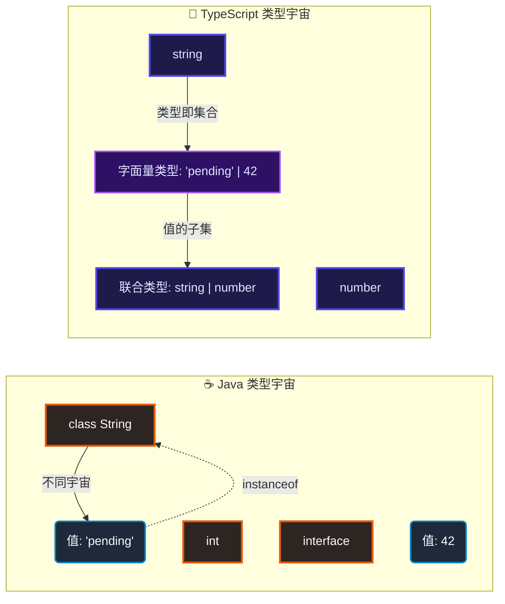
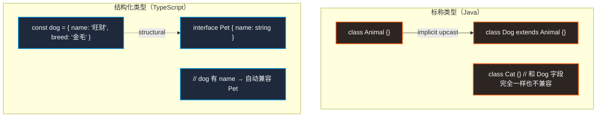
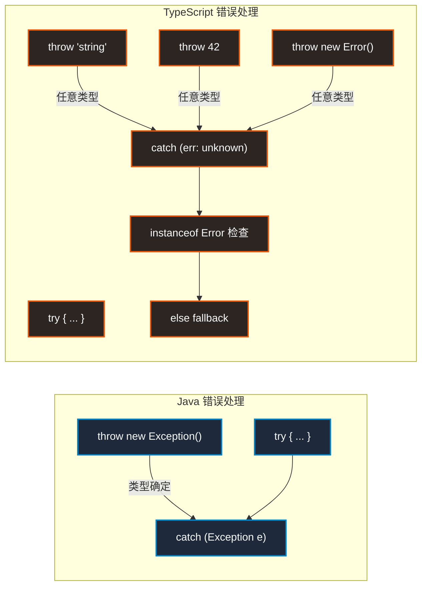
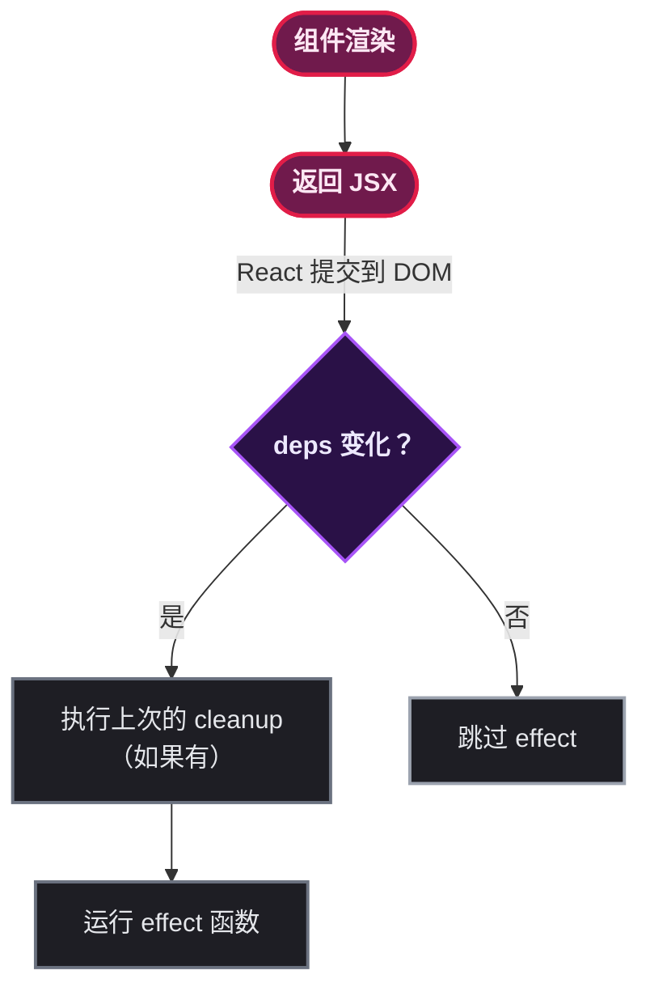

# Java 到 TypeScript 的语法移植，每一步都在流血泪

某后端组有一天突然接了个需求：用 React + TypeScript 写个管理后台。组里人均三年 Spring Boot 经验，前端认知停留在 jQuery 版本 —— 于是灾难开始了。

读这篇文章的 Java 后端，大概率也会经历同样的过程。TypeScript 看起来像 Java —— 有类型、有 class、有 interface —— 但**只是看起来像**。实际写起来处处是坑，而且很多坑不是因为 TS 难，而是因为 Java 的经验在这套体系里**不再是优势，反而是诅咒**。

这篇文章不讲怎么建项目、不讲脚手架，只说一件事：**Java 开发者学 TS + React，最痛苦的那几个断层在哪里，以及怎么跨过去。**

> ⚠️ 新手提示：这篇文章默认读者理解 Java 8+ 语法（泛型、Stream、Lambda、Optional、CompletableFuture），但对 TS 和 React 零基础。代码对比统一 Java 版在上 / TS 版在下。

## 类型系统：看似一样，底层完全两码事

先上一个最迷惑的例子。

```java
// Java：方法参数声明类型
public String greet(String name) {
    return "Hello, " + name;
}
```

```typescript
// TypeScript：同样有类型注解
function greet(name: string): string {
    return `Hello, ${name}` ;
}
```

看着差不多对吧？一旦深入就会遇到 Java 根本没有的东西。

### 基本类型：你以为的"类型"不是你以为的

Java 的基本类型和 TS 的类型注解只是**长得像**，语义完全不同：

| 维度 | Java | TypeScript |
|------|------|-----------|
| 类型系统 | 标称类型系统（Nominal） | 结构化类型系统（Structural） |
| 运行期类型 | 存在（instanceof、反射） | **不存在**（编译后被完全擦除） |
| 基本类型和包装类 | int/Integer 分开 | `number` 统一，没有包装类概念 |
| 空值 | null 是任何引用类型的子类型 | `null` `undefined` 是单独的类型 |
| 数组 | `int[]` 协变数组 | `number[]` 同，但多了元组 `[string, number]` |

> ⚠️ 新手提示：Java 的 `int` 不是对象，不能调方法；TS 的 `number` **是对象**， `(123).toString()` 合法。而且 TS 里没有 `int` `float` `double` 的区分 —— 全部是 `number` ，因为 JS 底层只有 64 位浮点数。

`string `同理：Java 的` String `和 TS 的` string `区别更大。TS 的` string ` 是**字面量类型也能赋值**的：

```typescript
// TypeScript：字面量类型是一种类型
type Status = "pending" | "approved" | "rejected";

const s: Status = "pending"; // OK
const s2: Status = "cancelled"; // ❌ TS2322: Type '"cancelled"' is not assignable to type 'Status'
```

Java 程序员第一次看到这个会懵： `"pending"` 不是字符串值吗？它怎么还能当类型用？

**这就是 TS 和 Java 的第一个观念断层**：Java 的类型和值是**两个宇宙**；TS 的类型可以**精确到一个具体的值**。



Java 程序员看到这个图应该理解一件事：Java 的**类型是一个类的声明**，TS 的**类型是一个值的集合**。这个差异是所有后续痛苦的根源。

### 泛型：擦除 vs 保留，但更难的是结构化类型

Java 泛型是编译时擦除的，TS 泛型也是编译时擦除的 —— 这一点两者倒是一样苦。但 TS 的泛型有 Java 没有的杀手级能力：**条件类型 + infer**。

```java
// Java：泛型最多绑个上界
public <T extends Comparable<T>> T max(T a, T b) {
    return a.compareTo(b) > 0 ? a : b;
}
```

```typescript
// TypeScript：条件类型 + infer——Java 写不出来
// 提取 Promise<T> 里的 T
type Unwrap<T> = T extends Promise<infer U> ? U : T;

type A = Unwrap<Promise<string>>;  // string
type B = Unwrap<number>;           // number

// 真实场景：从函数类型提取返回值类型
type Return<T> = T extends (...args: any[]) => infer R ? R : never;

function fetchUser(id: number) {
    return { id, name: "Alice" };
}
type User = Return<typeof fetchUser>;  // { id: number; name: string }
```

这个 `infer` 在 Java 里没有对应物。一个 Java 开发者第一次看到 `T extends ... infer U ? U : T` 会以为这是哪门子黑魔法 —— 但它就是 TS 类型系统最核心的"模式匹配"机制。

> 📌 前置知识： `infer` 只能用在条件类型的 `extends` 子句中，用来"抓取"一个泛型参数的内部类型。它在 React 的类型定义里随处可见 —— `useState` 的类型推导、 `Promise.all` 的展开、组件 Props 的提取，全都依赖它。

更颠覆认知的是**结构化类型**：Java 里 `User` 和 `Admin` 是两个 class，哪怕字段一模一样也不能互相赋值。TS 呢？**只要结构一样就是同一个类型。**

```typescript
// TypeScript：结构化类型——看结构不看名字
interface User {
    id: number;
    name: string;
}

interface Admin {
    id: number;
    name: string;
    role: string;
}

const u: User = { id: 1, name: "Alice" };
const a: Admin = { id: 2, name: "Bob", role: "admin" };

let user: User = a;  // ✅ OK！Admin 包含 User 的所有字段
```

Java 程序员看到这个会浑身难受 —— `Admin` 给 `User` 赋值怎么不报错？因为 TS 只看 **结构兼容性**： `Admin` 有 `id` 和 `name` ，所以它就是 `User` 的子类型。不需要 `extends` 、不需要 `implements` 、不需要任何继承声明。



### interface vs type：这不是选择题，是两个时代的设计

Java 8+ 的 interface 有 default 方法，TS 的 interface 也可以有可选成员和只读成员。但 TS 有一个 Java 完全没有的概念：** `type` 别名和联合类型交叉类型**。

```typescript
// TypeScript：type 能做到 interface 做不到的事

// 联合类型——Java 完全没有对应物
type Result<T> = Success<T> | ErrorResult;
// type 的交叉类型——相当于继承多个接口
type A = { a: string };
type B = { b: number };
type C = A & B;  // { a: string; b: number }

// type 可以映射——interface 不行
type Readonly<T> = {
    readonly [K in keyof T]: T[K]
};
type User = { id: number; name: string };
type ReadonlyUser = Readonly<User>;
// → { readonly id: number; readonly name: string }
```

这个 `[K in keyof T]` 映射类型是 Java 完全做不到的。它相当于在类型层面写了一个 **forEach 循环**：遍历 T 的所有属性，每个都变成 readonly。

后面写 React 组件的时候， `Partial<T>` 、 `Pick<T, K>` 、 `Omit<T, K>` 这些内置工具类型大量使用映射类型。Java 开发者需要用注解处理器或者代码生成器才能做到的事，TS 直接用类型语法就解决了。

## 函数：从方法到一等公民

Java 8 引入了 Lambda 和方法引用，让函数不再必须挂在一个类上。但 TS 里的函数是**真正的一等公民** —— 可以独立存在、可以作为任何函数的参数和返回值、可以有自己独立的泛型。

### 箭头函数和 this 陷阱

```java
// Java：Lambda 就是匿名内部类的语法糖
button.addActionListener(e -> {
    // 这里 this 指向 ActionListener... 不，是外部类
    // Lambda 里的 this 和外部作用域的 this 相同
    this.handleClick(e);
});
```

```typescript
// TypeScript：箭头函数的 this 从定义位置捕获
class Component {
    private count = 0;

    // ❌ 普通函数：this 在调用时决定
    handleClickBad() {
        this.count++;  // 如果作为回调被调用，this 可能是 undefined！
    }

    // ✅ 箭头函数：this 在定义时固定
    handleClickGood = () => {
        this.count++;  // 永远指向 Component 实例
    }

    render() {
        // 作为回调传递时：
        return <button onClick={this.handleClickBad}>-1</button>;  // ❌ this 丢了
        return <button onClick={this.handleClickGood}>+1</button>; // ✅
    }
}
```

这个坑是所有 Java 转 TS 的人必踩的。Java 的 Lambda 里 `this` 指向外部类实例 —— 所以 Java 开发者天然觉得"回调里的 `this` 就是外面的 `this` "。TS 的**普通函数**的 `this` 在调用时才决定，作为回调传出去就丢了；**箭头函数**的 `this` 在定义时就固定了。

> 📌 前置知识：Java 里没有"定义时绑定 this"的概念 —— `this` 永远由 JVM 在调用时根据 receivership 决定。箭头函数的"词法 this"来自 ES6 规范，本质是闭包捕获外层上下文的 this 值。

### 函数重载：Java 是真的重载，TS 是骗你的

```java
// Java：真正的多态重载——参数类型不同就是不同方法
class Parser {
    public int parse(String input) {
        return Integer.parseInt(input);
    }
    public int parse(byte[] input) {
        return Integer.parseInt(new String(input));
    }
    public double parse(String input, int radix) {
        return Integer.parseInt(input, radix);
    }
}
```

```typescript
// TypeScript：重载是"声明"，实现只有一个
function parse(input: string): number;
function parse(input: number): string;
function parse(input: string | number): string | number {
    if (typeof input === "string") {
        return parseInt(input);
    } else {
        return String(input);
    }
}
```

TS 的重载**不生成不同的方法签名** —— 编译后只有一个函数。前面那些 `function parse(xxx): yyy;` 只是"声明签名"，告诉 IDE：「这个函数有多种调用方式」。实际运行时靠 `typeof` 判断。

这对 Java 开发者来说很反直觉：重载不是多态，是类型层面的**文档约束**。

## 面向对象：形似神不似的东西最坑

Java 程序员看到 TS 的 `class` 会很亲切 —— 但写几行就发现哪都不对。

```java
// Java：标准的 OOP
public abstract class BaseService {
    protected final String appName;

    public BaseService(String appName) {
        this.appName = appName;
    }

    protected void log(String msg) {
        System.out.println("[" + appName + "] " + msg);
    }

    public abstract void execute();
}

public class UserService extends BaseService {
    public UserService() {
        super("user-service");
    }

    @Override
    public void execute() {
        log("executing...");
    }
}
```

```typescript
// TypeScript：看着像 class，但很多地方不一样
abstract class BaseService {
    // protected 可以写，但不支持 package-private
    protected readonly appName: string;

    constructor(appName: string) {
        this.appName = appName;
    }

    // 默认是 public，不需要写
    protected log(msg: string): void {
        console.log( `[${this.appName}] ${msg}` );
    }

    abstract execute(): void;
}

class UserService extends BaseService {
    constructor() {
        super("user-service");
        // ❌ 这里不能访问 this —— super() 之后才能用！
    }

    execute(): void {
        this.log("executing...");
    }
}
```

几个要命的区别：

| 特性 | Java | TypeScript |
|------|------|-----------|
| 构造函数 | 方法名和类名相同，可重载 | `constructor` 关键字，只能有一个 |
| 调用父构造器 | `super()` 必须是第一行（隐式） | `super()` 必须是第一行（显式），**之后才能用 `this` ** |
| 访问修饰符 | `public` `protected` `private` `default` | `public` `protected` `private` （无 default） |
| abstract | 类和方法都标 abstract | 同 Java |
| static | 属于类, this 不能访问 | 同 Java, 但 `static` 不能和 `abstract` 共存 |
| 字段初始化 | 声明时初始化或在构造器中 | **可以在构造器参数中直接声明** |

最后一点特别有用：

```typescript
// TypeScript：构造器参数自动声明字段
class UserService extends BaseService {
    // Java 要写：
    // private final UserRepository repo;
    // public UserService(UserRepository repo) {
    //     this.repo = repo;
    // }

    constructor(private repo: UserRepository) {
        super("user-service");
    }
    // 👆 等价于声明了 private repo: UserRepository 字段并赋值
}
```

这个语法糖在 Spring Boot 的 `@RequiredArgsConstructor` 注入满天飞的项目里特别像回事 —— 只不过 TS 不需要 Lombok。

### readonly ≠ final

Java 的 `final` 字段一旦初始化就不能被修改引用，但对象本身可以修改。

TS 的 `readonly` 也类似，但有一个 Java 没有的能力：**可以修饰数组和元组的内部元素**

```typescript
// TypeScript：readonly 可以深入到内部
const list: readonly number[] = [1, 2, 3];
list.push(4);    // ❌ 属性 'push' 不存在于 'readonly number[]'
list[0] = 0;     // ❌ readonly 不能赋值

// 对应 Java 的 List.of() —— 不可变列表
List<Integer> list = List.of(1, 2, 3);
list.add(4);     // ❌ UnsupportedOperationException
// 但 Java 编译时检查不了，运行时才抛
```

## 异步编程：CompletableFuture 的 JS 亲戚其实更自然

Java 8+ 的 `CompletableFuture` 是 Java 向函数式异步迈出的一大步。但 TS 的 `Promise` / `async/await` **更原生、更常见**——在 TS 里几乎所有 IO 操作都返回 Promise，不用额外包装。

### Promise：去掉 Future.get() 的阻塞

```java
// Java：CompletableFuture 链式调用
CompletableFuture.supplyAsync(() -> fetchUser(1))
    .thenApply(user -> user.getName())
    .thenAccept(name -> System.out.println(name))
    .exceptionally(err -> {
        log.error("Failed", err);
        return null;
    });
// 如果不用链式，就要 .get() 阻塞当前线程
```

```typescript
// TypeScript：Promise 链式——没有阻塞
fetchUser(1)
    .then(user => user.name)
    .then(name => console.log(name))
    .catch(err => console.error("Failed", err));
```

链式调用看着差不多。真正的差异在 **错误处理** 和 **await** 上。

### async/await：比 Java 的 CompletableFuture 优雅在哪里

```java
// Java：多个 CompletableFuture 串行——回调地狱的变体
CompletableFuture.supplyAsync(() -> fetchUser(1))
    .thenCompose(user ->
        CompletableFuture.supplyAsync(() -> fetchOrders(user.getId()))
    )
    .thenCompose(orders ->
        CompletableFuture.supplyAsync(() -> calculateTotal(orders))
    )
    .thenAccept(total -> System.out.println(total));

// 或者用 thenCompose 嵌套——很快就难看了
```

```typescript
// TypeScript：async/await 让异步代码像同步
async function getTotal(userId: number): Promise<number> {
    const user = await fetchUser(userId);
    const orders = await fetchOrders(user.id);
    const total = await calculateTotal(orders);
    return total;
}
// 阅读顺序 = 执行顺序，没有嵌套
```

Java 后来也加了 `CompletableFuture` 搭配 `thenCompose` 但始终没有语言层面的 `await` 关键字 —— 这是 TS/JS 在异步体验上最碾压 Java 的地方。

但注意：**TS 的 await 默认是串行的**，如果需要并行需要用 `Promise.all` ：

```typescript
// TypeScript：并行——用 Promise.all 显式声明
const [user, settings] = await Promise.all([
    fetchUser(1),
    fetchSettings(1),
]);
// user 和 settings 的请求**同时发起**
```

```java
// Java：并行——用 allOf 显式声明
CompletableFuture<User> userFuture = CompletableFuture.supplyAsync(() -> fetchUser(1));
CompletableFuture<Settings> settingsFuture = CompletableFuture.supplyAsync(() -> fetchSettings(1));
CompletableFuture.allOf(userFuture, settingsFuture).join();
User user = userFuture.get();
Settings settings = settingsFuture.get();
```

两者的并行写法几乎等价。但 Java 需要先声明 Future 变量再去 get，TS 直接用解构赋值一把搞定。

### 错误处理：异常还是那个异常，但多了 catch

```java
// Java：try-catch 包裹所有
public User getUserSafely(int id) {
    try {
        return fetchUser(id)
            .get(5, TimeUnit.SECONDS);
    } catch (InterruptedException | ExecutionException | TimeoutException e) {
        log.error("Failed to fetch user", e);
        return User.defaultUser();
    }
}
```

```typescript
// TypeScript：async/await + try-catch
async function getUserSafely(id: number): Promise<User> {
    try {
        return await fetchUser(id);
    } catch (err) {
        // err 是 unknown 类型！不能直接调 getMessage()
        console.error("Failed to fetch user", err);
        return User.defaultUser();
    }
}
```

关键区别：TS 的 `catch` 捕获的 `err` 类型是 `unknown` （TS 4.0+），不能直接调 `.getMessage()` 或 `.message` ，必须先做类型收窄：

```typescript
catch (err: unknown) {
    if (err instanceof Error) {
        console.error(err.message);
    } else {
        console.error("Unknown error", err);
    }
}
```

这个 `unknown` 是 TS 相比 Java `catch (Throwable e)` 更安全的设计 —— 不会因为 catch 到非 Error 类型的东西就崩掉。但在 Java 开发者看来简直是多此一举： `err` 还能是啥？

实际上在 JS 里 `throw` 可以抛任何东西 —— 字符串、数字、 `null` 、甚至一个对象 `{ code: 500 }` 。TS 的 `unknown` 是在帮读者处理这个残酷的现实。



## 空安全：Optional → 可选链，但 TS 版更舒服

Java 8 引入 `Optional` 是为了根治 `NullPointerException` 。TS 则有 `?.` （可选链）和 `??` （空值合并），比 Optional 更简洁。

```java
// Java：Optional 链式操作
public String getCityName(User user) {
    return Optional.ofNullable(user)
        .map(User::getAddress)
        .map(Address::getCity)
        .map(City::getName)
        .orElse("未知城市");
}
```

```typescript
// TypeScript：可选链 + 空值合并
function getCityName(user: User | null | undefined): string {
    return user?.address?.city?.name ?? "未知城市";
}
```

可选链 `?.` 的效果：如果中间的某一步是 `null` 或 `undefined` ，整个表达式短路返回 `undefined` ，不会抛 `TypeError` 。

```typescript
// 更多用法
const x = obj?.prop;        // === obj !== null ? obj.prop : undefined
const y = arr?.[0];          // 数组可选访问
const z = func?.();          // 函数可选调用

// 空值合并：?? 只针对 null/undefined，不针对 falsy
const value = 0 ?? 42;       // 0  ——不是 null/undefined
const value2 = null ?? 42;   // 42 ——null 触发默认值
```

这个 `??` 和 Java 的 `Optional.orElse` 区别很大：TS 只有 `?.` 短路才有必要用 `??` ，而 Java 的 `Optional` 要颠来倒去地 `map().orElse()` 。

但有一件事 TS 不如 Java：**Java 的 Optional 是 monad，可以 flatMap；TS 的 `?.` 只是语法糖，嵌套对象路径一旦超过 3 层依然可读性下降。**

## 集合操作：Stream API → Array 方法的翻译对照表

Java 8 的 Stream API 和 TS 的数组方法 `map` `filter` `reduce` 本质是同一个东西：**集合上的函数式变换**。但写法完全不同。

```java
// Java：Stream 操作
List<Order> orders = getOrders();
List<String> result = orders.stream()
    .filter(o -> o.getAmount() > 100)
    .map(Order::getCustomerName)
    .distinct()
    .sorted()
    .collect(Collectors.toList());
```

```typescript
// TypeScript：数组方法
const orders = getOrders();
const result = orders
    .filter(o => o.amount > 100)
    .map(o => o.customerName)
    .filter((v, i, a) => a.indexOf(v) === i)  // distinct——没有原生去重
    .sort();
```

| Java Stream | TypeScript Array | 区别 |
|-------------|-----------------|------|
| `.stream()` | 直接 `.filter()` | TS 数组本身就是可 Stream 的 |
| `.map(Function)` | `.map(fn)` | 几乎一样 |
| `.filter(Predicate)` | `.filter(fn)` | 几乎一样 |
| `.distinct()` | 没有原生方法 | 用 `Set` 或 `indexOf` 手写 |
| `.sorted()` | `.sort()` | 但 sort 默认按**字典序**排序！ `[1, 10, 2]` |
| `.collect(Collectors.toList())` | 数组方法返回新数组 | 不需要收集，本身返回新数组 |
| `.flatMap()` | `.flatMap()` | TS 的 flatMap 自动铺平一层 |
| `.reduce(accumulator, initial)` | `.reduce(fn, initial)` | 几乎一样 |

### 特别警告：sort 的字典序陷阱

```java
// Java：sort 按数字升序
List<Integer> nums = Arrays.asList(1, 10, 2, 20);
nums.sort(Comparator.naturalOrder());
// → [1, 2, 10, 20]
```

```typescript
// TypeScript：sort 默认按**字符串字典序**！
const nums = [1, 10, 2, 20];
nums.sort();
// → [1, 10, 2, 20] ❌❌❌ 期望是 [1, 2, 10, 20]
// 因为 '10' < '2'（字典序 '1' < '2'）

// 必须传比较函数！
nums.sort((a, b) => a - b);
// → [1, 2, 10, 20] ✅
```

这个坑 Java 开发者永远不会踩到，因为 Java 的 `sort` **默认按自然顺序**（数字就是升序），而 JS/TS 的 `sort` **默认转字符串排序**。接手 TS 项目第一个月必被这个坑一次。

## React 组件：从 OOP 到函数式的范式翻转

前面说了这么多语法差异，都只是为这一章做铺垫。**React 是 Java 后端转到 TS 时最大的认知障碍** —— 不是因为 React 难，而是因为 Java 的 MVC + OOP 经验和 React 的函数式组件 + Hooks 是**完全相反的设计哲学**。

### 组件即函数——不是 class

```java
// Java（Spring MVC）：Controller 是一个 class
@RestController
@RequestMapping("/users")
public class UserController {
    private final UserService userService;

    public UserController(UserService userService) {
        this.userService = userService;
    }

    @GetMapping("/{id}")
    public ResponseEntity<User> getUser(@PathVariable Long id) {
        return ResponseEntity.ok(userService.findById(id));
    }
}
```

```typescript
// React：组件是一个函数——不是 class
const UserPage: React.FC<{ userId: number }> = ({ userId }) => {
    const [user, setUser] = useState<User | null>(null);
    const [loading, setLoading] = useState(true);

    useEffect(() => {
        fetchUser(userId)
            .then(setUser)
            .finally(() => setLoading(false));
    }, [userId]);

    if (loading) return <Spinner />;
    if (!user) return <ErrorPage />;
    return <UserDetail user={user} />;
};
```

对比 Spring Controller 和 React 组件的几个核心差异：

| 维度 | Spring Controller | React Component |
|------|-----------------|-----------------|
| 形态 | class，有状态字段 | **纯函数**（但有 Hooks） |
| 输入 | URL 参数 + HTTP 请求 | Props（类似于方法参数） |
| 输出 | ResponseEntity | JSX（HTML 描述） |
| 生命周期 | `@PostConstruct` `@PreDestroy` | `useEffect` 依赖项控制 |
| 状态管理 | class 字段 + DB | `useState` + `useReducer` |
| 复用 | Service 层的依赖注入 | 自定义 Hooks / 组件组合 |

### Props 类型定义——你的第一个 TypeScript 实战

React 组件的 `Props` 就是函数的入参类型。这里 TS 的能力就完全体现出来了：

```typescript
// 基础 Props
interface UserCardProps {
    user: User;
    showEmail?: boolean;        // 可选 prop
    onDelete?: (id: number) => void;  // 回调 prop —— 类似事件监听器
}

// 泛型 Props——高阶组件里的常见模式
interface ListProps<T> {
    items: T[];
    renderItem: (item: T) => React.ReactNode;  // render prop —— 类似策略模式
    keyExtractor: (item: T) => string;
}

function List<T>({ items, renderItem, keyExtractor }: ListProps<T>) {
    return (
        <ul>
            {items.map(item => (
                <li key={keyExtractor(item)}>{renderItem(item)}</li>
            ))}
        </ul>
    );
}
```

Spring 的后端看到 `ListProps<T>` 可能会想起 `List<Order>` —— 但这里的 T 不是在运行时被擦除，而是在编译时推导的：

```typescript
// 调用时 TS 自动推导 T 为 Order
<List
    items={orders}
    renderItem={(order) => <div>{order.orderNo}</div>}
    keyExtractor={(order) => order.id}
/>
```

> ⚠️ 新手提示： `React.FC<Props>` 是"函数组件"的老写法，新项目更倾向于直接写 `function Component({ prop }: Props)` 或 `const Component = ({ prop }: Props)` 。 `React.FC` 默认加了 `children` 的类型，有时候这不是你想要的。

### useState：从成员变量到 Hook 的转变

Java 的 class 字段就是状态：

```java
public class UserController {
    // 这是状态——但每个请求进来都 new 一个 controller
    private int requestCount = 0;

    @GetMapping("/count")
    public int getCount() {
        return ++requestCount;  // 线程安全的？并不是
    }
}
```

React 的 `useState` 则完全不同：

```typescript
function Counter() {
    const [count, setCount] = useState(0);

    return (
        <div>
            <p>Count: {count}</p>
            <button onClick={() => setCount(count + 1)}>+1</button>
        </div>
    );
}
```

这里读者需要理解三个关键概念：

1. ** `count` 不是字段，它是一个"快照"** —— 每次渲染都是独立的 `count` 值
2. ** `setCount` 触发重新渲染** —— 类似 Java 的 `notifyObservers()`
3. **状态更新是异步批处理的** —— 类似 React 的 batched updates，Java 的 `flush()` 操作

```typescript
// 一个经典陷阱——"闭包过期"
function Counter() {
    const [count, setCount] = useState(0);

    function handleClick() {
        setCount(count + 1);  // 假设 count=3，setCount(4) ✅
        setCount(count + 1);  // 还是 setCount(4) ❌ ——count 还是 3！
        // 应该写成：
        // setCount(prev => prev + 1);
    }
}
```

Java 开发者看到这个会困惑： `count` 不是变量吗？为什么第二次 `setCount` 拿到的 `count` 还是旧值？

因为 React 的 `count` 不是"当前的变量值"，而是**该次渲染捕获的快照**。 `handleClick` 闭包捕获的是**创建它那次渲染的 count 值**。

### useEffect：生命周期？副作用？都是它

Spring 里想"组件挂载时加载数据"：

```java
@Component
public class UserService {
    @PostConstruct
    public void init() {
        // 启动时执行一次
    }

    @EventListener(ApplicationReadyEvent.class)
    public void onReady() {
        // 应用就绪后执行
    }
}
```

React 里等价的做法：

```typescript
function UserPage({ userId }: { userId: number }) {
    const [user, setUser] = useState<User | null>(null);

    // 等价于 @PostConstruct + 参数变化时重新调用
    useEffect(() => {
        fetchUser(userId).then(setUser);
    }, [userId]);  // <--- 依赖数组，是 useEffect 的核心

    return <div>{user?.name}</div>;
}
```

`useEffect `的依赖数组` [userId] `是 React 比` @PostConstruct `更精准的地方 —— **只有依赖变化时才重新执行**。Java 开发者如果要在参数变化时重新拉取数据，要在 controller 里自己写判断或者用 Spring Cache 的` @CacheEvict `—— React 的` useEffect ` 把这个模式标准化了。

Mermaid 图说明 useEffect 的流程：



### 自定义 Hooks：比工具类更纯的复用方式

Java 里的复用靠工具类和方法：

```java
public class DateUtils {
    public static String formatTimeAgo(LocalDateTime time) {
        Duration duration = Duration.between(time, LocalDateTime.now());
        if (duration.toMinutes() < 1) return "刚刚";
        if (duration.toHours() < 1) return duration.toMinutes() + "分钟前";
        if (duration.toDays() < 1) return duration.toHours() + "小时前";
        return duration.toDays() + "天前";
    }
}
```

TS React 里对应的 Hooks 版：

```typescript
// 自定义 Hook —— 以 use 开头的函数
function useTimeAgo(time: Date): string {
    const [now, setNow] = useState(new Date());

    // 每秒更新一次"当前时间"
    useEffect(() => {
        const timer = setInterval(() => setNow(new Date()), 1000);
        return () => clearInterval(timer);  // cleanup——组件卸载时清理
    }, []);

    const diff = now.getTime() - time.getTime();
    if (diff < 60_000) return "刚刚";
    if (diff < 3_600_000) return `${Math.floor(diff / 60_000)}分钟前` ;
    if (diff < 86_400_000) return `${Math.floor(diff / 3_600_000)}小时前` ;
    return `${Math.floor(diff / 86_400_000)}天前` ;
}

// 使用——就像用 useState 一样
function Comment({ time }: { time: Date }) {
    const timeAgo = useTimeAgo(time);
    return <span>{timeAgo}</span>;
}
```

Hook 的精髓：它**不是注入进来的，也不是继承来的** —— 它就是函数调用。但因为这个函数内部调用了 `useState` 和 `useEffect` ，它才叫 Hook。普通的纯函数不能叫 Hook。

> ⚠️ 新手提示：自定义 Hook 必须以 `use` 开头（ `useTimeAgo` ），这**不是可选的** —— React ESLint 规则要求，否则无法做 Hook 的规则检查。而且 Hook 不能在条件语句里用、不能放在循环里、不能放在 `return` 之后 —— 这些"Hook 调用规则"比 Java 方法的任何约束都严苛。

### JSX：在 HTML 里写逻辑

Java 后端最熟悉的视图层是 Thymeleaf、FreeMarker 或者 JSP：

```html
<!-- Thymeleaf：模板是 HTML + 属性 -->
<div th:each="user : ${users}">
    <p th:text="${user.name}">name</p>
    <p th:if="${user.active}">Active</p>
</div>
```

React 的 JSX 则是在 JS/TS 里写 HTML：

```typescript
// JSX：逻辑和视图在同一语言里
function UserList({ users }: { users: User[] }) {
    return (
        <div>
            {users.map(user => (
                <div key={user.id}>
                    <p>{user.name}</p>
                    {user.active && <p className="active-badge">Active</p>}
                    {/* 👆 短路求值：user.active 为 true 时才显示 */}
                </div>
            ))}
        </div>
    );
}
```

Java 开发者看完这个会倒吸一口凉气：**逻辑和视图不分层了**？Spring 后端花了多少年从 JSP 迁到 Thymeleaf 不就是为了把逻辑从模板里分离出来吗？

但 React 的观点恰恰相反：**逻辑和视图本来就不应该分开**—— `user.active && <p>` 比 `th:if="${user.active}"` 更直观，因为它在同一作用域里，不需要在 controller 里塞一个 `model.addAttribute("showActive", ...)` 。

## 模块系统：package vs import

Java 里文件路径决定包名—— `com.example.service.UserService` 必须在 `com/example/service/UserService.java` 。

TS 则不同：**文件名就是模块名，导入路径就是文件路径。**

```java
// Java：package 声明
package com.example.service;

import com.example.model.User;
import com.example.repository.UserRepository;

@Service
public class UserService {
    private final UserRepository repo;
    public UserService(UserRepository repo) {
        this.repo = repo;
    }
}
```

```typescript
// TypeScript：没有 package 声明，路径即身份
// 文件：services/UserService.ts
import { User } from "../models/User";
import { UserRepository } from "../repositories/UserRepository";

export class UserService {
    constructor(private repo: UserRepository) {}
}
```

这里的几个关键差异：

1. ** `export` 是显式的** —— 不像 Java 默认所有 public class 对外可见，TS 要主动 `export` 才导出
2. **默认导出 vs 命名导出** —— `export default` 和 `export { ... }` 的区别
3. **路径是相对路径** —— `../models/User` 而不是 `com.example.model.User`

```typescript
// 命名导出——导入时必须用花括号
export interface User { ... }
// 使用：import { User } from "./types";

// 默认导出——导入时可以任意起名
export default function Button() { ... }
// 使用：import MyButton from "./Button";
//        import Btn from "./Button";  // 也行！

// 混合导出也是允许的
export { User, UserService };
export default UserController;
```

## 日常开发中的常用方法对照

以下高频操作对照表，Java 后端写 TS 时可以直接翻译：

| 场景 | Java | TypeScript |
|------|------|-----------|
| 取数组第一个（安全） | `list.stream().findFirst().orElse(null)` | `arr[0] ?? null` |
| 判断字符串非空 | `!str.isEmpty()` / `StringUtils.isNotBlank(str)` | `str.length > 0` 或 `str.trim().length > 0` |
| 默认值 | `Optional.ofNullable(x).orElse(defaultV)` | `x ?? defaultV` |
| 三元运算 | `a > b ? a : b` | 完全一样 `a > b ? a : b` |
| 字符串拼接 | `String.join(",", list)` | `arr.join(",")` |
| 打日志 | `log.info("user: {}", user)` | `console.log("user:", user)` |
| 判空（多重） | `Optional.ofNullable(a).map(x->x.b).orElse(null)` | `a?.b?.c ?? defaultValue` |
| Map 遍历 | `map.forEach((k,v) -> ...)` | `map.forEach((k, v) => ...)` **完全一样** |
| 列表转数组 | `list.toArray(new String[0])` | `arr.map(...)` 本身就是数组 |
| 去重 | `list.stream().distinct().collect(toList())` | `[...new Set(arr)]` |
| 分组 | `list.stream().collect(groupingBy(Function))` | `Object.groupBy(arr, fn)` （ES2024）或 `reduce` 手写 |

## 总结

从 Java 到 TypeScript 的迁移，如果用一句话概括：

> **Java 相信"名字"，TypeScript 相信"结构"。**
>
> Java 说：你是 `User` 的实例，所以你有 `id` 和 `name` 。
> TypeScript 说：你有 `id` 和 `name` ，所以你自动成为 `User` 。

这个认知差异渗透到了类型系统、泛型、面向对象和模块的每一个角落。Java 开发者在 TS 里最痛苦的时刻，往往就是**试图用名字思维去理解结构世界**的时刻。

几个实战建议：

1. **不要在 TS 里写 Java 风格的代码** —— 不要每个文件都写 class，不要见到变量就 private，能用函数别用 class
2. **拥抱结构化类型** —— 接口不用主动标记 `implements` ，只要结构匹配就行
3. **把 Hooks 理解成"有状态的函数调用"**，而不是"组件的方法"
4. **用到 React 时：Props 是参数，State 是闭包变量，Effect 是副作用声明**
5. **TypeScript 的类型系统不是你想象的那种"编译期安全"** —— 它只能保证你写的类型正确，不能保证运行时数据正确，因为 **TS 类型在编译后不存在**

最后送读者一句话：写 TypeScript 的时候，**放下你作为 Java 程序员的骄傲** —— 从头学一个东西不丢人。用 Java 的方式写 TS 只会写出又慢又丑的代码，学 TS 的方式写 TS，两周后就回不去了。

---

**占位提醒：**
- 无需要替换的图片或视频占位。
- 如果阅读量高，后续可以补充一个「从 Spring Boot 迁移到 Next.js」的番外篇。
