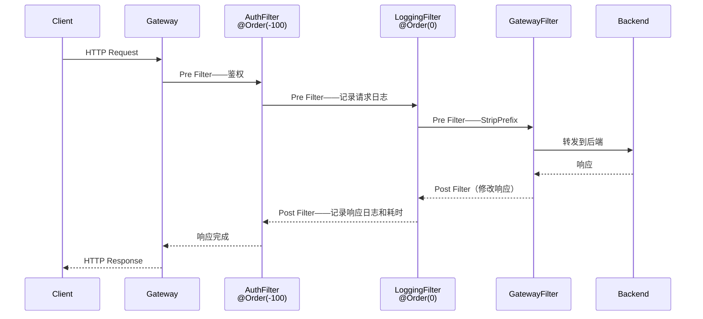

# GatewayFilter 与 GlobalFilter 全操作

> 📖 <strong>前置阅读</strong>：本文假设读者已掌握 Route 和 Predicate 的配置方式。如果还不熟悉，建议先阅读 [<strong>Spring Cloud Gateway 核心概念与快速上手</strong>]() 和 [<strong>Predicate 与路由规则全解</strong>]()。

## 一、⚡ 路由转发了——但在转发前后你还想做很多事

Predicate 决定了请求走哪条路——但路上你还要做很多事：

```
请求 → 网关 → 后端 —— 转发过程中：
  ① 把 /api/users/1 转成 /1（去掉前缀）
  ② 自动加上 Header（X-Request-Id、X-Source）
  ③ 限制每个 IP 每秒只能调 10 次
  ④ 请求失败时自动重试 3 次
  ⑤ 把用户信息写入 Header（后端不用自己解析 JWT）
  ⑥ 后端 3 次失败后熔断——直接降级返回
```

这些全都靠 <strong>Filter</strong> 实现。Gateway 的 Filter 分两种——<strong>GatewayFilter</strong>（针对特定路由）和 <strong>GlobalFilter</strong>（针对所有路由）。

## 二、🧩 Filter 的执行模型——Pre Filter 和 Post Filter

一个 Filter 可以在两个阶段做事：

```java
public class DemoFilter implements GatewayFilter {
    @Override
    public Mono<Void> filter(ServerWebExchange exchange, GatewayFilterChain chain) {
        // ===== Pre Filter：转发到后端之前执行 =====
        System.out.println("① 请求进来了——做鉴权、限流、加 Header");

        return chain.filter(exchange)  // ← 转发到后端（或者说交给下一个 Filter）
                .then(Mono.fromRunnable(() -> {
                    // ===== Post Filter：后端返回后执行 =====
                    System.out.println("⑤ 后端响应了——做日志、修改响应体");
                }));
    }
}
```

```
时间线：
  ① Pre Filter（鉴权）
  ② 下一个 Filter 的 Pre（限流）
  ③ 转发到后端
  ④ 后端返回响应
  ⑤ 当前 Filter 的 Post（修改响应）
  ⑥ 上一个 Filter 的 Post（记录日志）
```

这个链式结构是 WebFlux 的 `Mono.then()` 实现的——不是阻塞等待，而是注册回调。

## 三、📦 内置 GatewayFilter —— 不需要写一行代码

Spring Cloud Gateway 提供了 <strong>20+ 个内置 Filter</strong>——在 yml 的 `filters` 下直接配置。以下按使用频率排列：

### 3.1 StripPrefix —— 去掉路径前缀（最常用）

```yaml
filters:
  - StripPrefix=1        # 去掉前 1 段：/api/users/1 → /1
  - StripPrefix=2        # 去掉前 2 段：/gateway/api/users/1 → /users/1
```

```bash
# 请求：/api/users/v2/profile/me → StripPrefix=2 → /v2/profile/me（去掉了 api 和 users）
```

### 3.2 PrefixPath —— 添加路径前缀

```yaml
filters:
  - PrefixPath=/api      # 在路径前面加 /api
```

```bash
# 请求：/users/1 → PrefixPath=/api → /api/users/1
```

### 3.3 AddRequestHeader —— 添加请求头

<strong>最实用的 Filter</strong>——网关鉴权后把用户信息写入 Header，后端直接用：

```yaml
filters:
  # 固定值
  - AddRequestHeader=X-Source, gateway
  # 多 Header
  - AddRequestHeader=X-Request-Id, #{UUID}      # 也可以用 UUID
  - AddRequestHeader=X-User-Id, 从JWT解析的用户ID # 示例（固定值）
```

```java
// 后端 Controller 中直接拿——不需要自己解析 JWT
@GetMapping("/{id}")
public User getUser(@PathVariable Long id,
                    @RequestHeader("X-User-Id") Long userId,
                    @RequestHeader("X-Source") String source) {
    // userId 已经在网关解析过——后端信任网关
    System.out.println("请求来自: " + source + ", 用户: " + userId);
    return userService.getUser(id);
}
```

### 3.4 AddRequestParameter —— 添加查询参数

```yaml
filters:
  - AddRequestParameter=source, gateway
  - AddRequestParameter=version, v2
```

```bash
# 请求：/api/users?name=张三
# 加上 Parameter 后：/api/users?name=张三&source=gateway&version=v2
```

### 3.5 AddResponseHeader —— 添加响应头

```yaml
filters:
  - AddResponseHeader=X-Response-Time, %{now}    # 或者用自定义 Filter 动态计算
  - AddResponseHeader=X-Powered-By, Spring-Cloud-Gateway
```

### 3.6 RemoveRequestHeader / RemoveResponseHeader —— 删除头

```yaml
filters:
  - RemoveRequestHeader=X-Internal-Token   # 删除内部 Token——防止泄漏给后端
  - RemoveResponseHeader=X-Powered-By      # 隐藏技术栈信息
```

### 3.7 SetRequestHeader / SetResponseHeader —— 覆盖头

和 Add 的区别：<strong>Set 会覆盖已有的值，Add 不会</strong>：

```yaml
filters:
  - SetRequestHeader=X-Version, v2
  # 如果请求本来就有 X-Version:v1——Set 后变成 v2
  # 如果用 Add——X-Version 会变成两个值：v1, v2
```

### 3.8 RewritePath —— 正则替换路径（比 StripPrefix 强大）

```yaml
filters:
  # 把 /api/users/{userId}/orders/{orderId} → /orders/{orderId}?userId={userId}
  - RewritePath=/api/users/(?<userId>.*)/orders/(?<orderId>.*),
                /orders/$\{orderId}?userId=$\{userId}
```

```bash
# 请求：/api/users/123/orders/456
# 转换后：/orders/456?userId=123
```

### 3.9 RedirectTo —— 重定向

```yaml
filters:
  - RedirectTo=302, https://new-api.example.com  # 永久重定向？用 301
```

### 3.10 SetStatus —— 设置响应状态码

```yaml
filters:
  - SetStatus=401        # 直接返回 401——搭配自定义 Filter 做鉴权拒绝
```

### 3.11 Retry —— 自动重试

```yaml
filters:
  - name: Retry
    args:
      retries: 3                     # 重试 3 次
      statuses: BAD_GATEWAY, SERVICE_UNAVAILABLE, GATEWAY_TIMEOUT  # 只有这些状态码才重试
      methods: GET                   # 只重试 GET——POST 不重试（非幂等）
      backoff:
        firstBackoff: 100ms          # 第一次重试等待 100ms
        maxBackoff: 1000ms           # 最大等待 1000ms
        factor: 2                    # 退避倍数——100ms → 200ms → 400ms
        basedOnPreviousValue: true
```

> ⚠️ 新手提示：重试只对<strong>幂等</strong>操作安全——GET 可以重试，POST/PUT/DELETE 不要重试。如果创建订单的 POST 重试了 3 次——用户被扣了 3 次钱。

### 3.12 RequestRateLimiter —— 限流

依赖 Redis——令牌桶算法实现：

```yaml
filters:
  - name: RequestRateLimiter
    args:
      redis-rate-limiter.replenishRate: 10     # 每秒补充 10 个令牌
      redis-rate-limiter.burstCapacity: 20     # 桶容量 20——允许瞬时突发
      key-resolver: "#{@ipKeyResolver}"        # 限流的 key——按 IP 还是按用户
```

```java
// 限流的 Key Resolver——按 IP 限流
@Bean
public KeyResolver ipKeyResolver() {
    return exchange -> Mono.just(
            exchange.getRequest().getRemoteAddress()
                    .getAddress().getHostAddress());
}

// 按用户限流——从 Header 中拿 userId
@Bean
public KeyResolver userKeyResolver() {
    return exchange -> Mono.just(
            exchange.getRequest().getHeaders()
                    .getFirst("X-User-Id"));
}
```

### 3.13 CircuitBreaker —— 熔断

集成 Resilience4j——后端连续失败时熔断：

```yaml
filters:
  - name: CircuitBreaker
    args:
      name: userServiceCB            # 熔断器名称
      fallbackUri: forward:/fallback/users  # 熔断后的降级地址
```

```java
// 降级接口——当后端不可用时返回默认响应
@RestController
public class FallbackController {

    @RequestMapping("/fallback/users")
    public Mono<Map<String, Object>> userFallback() {
        return Mono.just(Map.of(
                "error", "服务暂时不可用",
                "message", "请稍后重试"
        ));
    }
}
```

### 3.14 内置 Filter 速查表

| Filter | 作用 | 配置示例 |
|------|------|------|
| `StripPrefix` | 去掉路径前缀 | `StripPrefix=1` |
| `PrefixPath` | 添加路径前缀 | `PrefixPath=/api` |
| `AddRequestHeader` | 添加请求头 | `AddRequestHeader=X-Source, gateway` |
| `AddRequestParameter` | 添加查询参数 | `AddRequestParameter=version, v2` |
| `AddResponseHeader` | 添加响应头 | `AddResponseHeader=X-Time, now` |
| `RemoveRequestHeader` | 删除请求头 | `RemoveRequestHeader=X-Token` |
| `RemoveResponseHeader` | 删除响应头 | `RemoveResponseHeader=X-Powered-By` |
| `SetRequestHeader` | 覆盖请求头 | `SetRequestHeader=X-Version, v2` |
| `SetResponseHeader` | 覆盖响应头 | `SetResponseHeader=Cache-Control, no-cache` |
| `RewritePath` | 正则替换路径 | `RewritePath=/api/(?<seg>.*), /$\{seg}` |
| `RedirectTo` | 重定向 | `RedirectTo=302, https://new.example.com` |
| `SetStatus` | 设置状态码 | `SetStatus=401` |
| `Retry` | 失败重试 | `Retry=3` |
| `RequestRateLimiter` | 限流（Redis 令牌桶） | 见上面示例 |
| `CircuitBreaker` | 熔断（Resilience4j） | 见上面示例 |
| `RequestSize` | 限制请求体大小 | `RequestSize=5MB` |
| `SaveSession` | 保存 WebSession | `SaveSession` |
| `MapRequestHeader` | Header 映射改名 | 把 A 映射成 B |
| `DedupeResponseHeader` | 去重响应头 | 合并重复的 Header |

## 四、🏭 自定义 GatewayFilter Factory —— 可复用的 Filter

内置 Filter 已经很多了——但总要写自定义逻辑（比如打印请求耗时）。<strong>用 Factory 模式</strong>——可以像内置 Filter 一样在 yml 中配置：

```java
// ① 自定义 GatewayFilter Factory——名字后缀必须是 GatewayFilterFactory
@Component
public class LoggingGatewayFilterFactory
        extends AbstractGatewayFilterFactory<LoggingGatewayFilterFactory.Config> {

    public LoggingGatewayFilterFactory() {
        super(Config.class);
    }

    @Override
    public GatewayFilter apply(Config config) {
        return (exchange, chain) -> {
            long startTime = System.currentTimeMillis();

            // Pre Filter——记录请求
            if (config.isLogRequest()) {
                System.out.println("请求: " + exchange.getRequest().getMethod()
                        + " " + exchange.getRequest().getURI());
            }

            return chain.filter(exchange)
                    .then(Mono.fromRunnable(() -> {
                        // Post Filter——记录耗时
                        if (config.isLogResponse()) {
                            long duration = System.currentTimeMillis() - startTime;
                            System.out.println("响应: " +
                                    exchange.getResponse().getStatusCode()
                                    + " 耗时: " + duration + "ms");
                        }
                    }));
        };
    }

    // ② 配置类——yml 中可以设置这些参数
    @Data
    public static class Config {
        private boolean logRequest = true;    // 默认 true
        private boolean logResponse = true;   // 默认 true
    }
}
```

```yaml
# yml 中使用——和内置 Filter 一样的写法
# 注意：类名 LoggingGatewayFilterFactory → 配置名 Logging
filters:
  - Logging=true, true         # 对应 Config 的两个字段：logRequest, logResponse
```

<strong>命名规则</strong>：如果你的类叫 `XxxGatewayFilterFactory`——在 yml 中就用 `Xxx`。

### 另一种写法——更灵活的配置

如果参数多——用 key=value 的形式更清晰：

```java
@Component
public class AuthGatewayFilterFactory
        extends AbstractGatewayFilterFactory<AuthGatewayFilterFactory.Config> {

    public AuthGatewayFilterFactory() {
        super(Config.class);
    }

    @Override
    public List<String> shortcutFieldOrder() {
        // yml 中 Auth=admin, /api/admin/** → admin 是 role，/api/admin/** 是 excludePath
        return Arrays.asList("role", "excludePath");
    }

    @Override
    public GatewayFilter apply(Config config) {
        return (exchange, chain) -> {
            // 检查是否在排除路径中——不需要鉴权
            String path = exchange.getRequest().getURI().getPath();
            if (path.startsWith(config.getExcludePath())) {
                return chain.filter(exchange);  // 跳过鉴权
            }

            // 检查用户角色
            String userRole = exchange.getRequest()
                    .getHeaders().getFirst("X-User-Role");
            if (!config.getRole().equals(userRole)) {
                exchange.getResponse().setStatusCode(HttpStatus.FORBIDDEN);
                return exchange.getResponse().setComplete();
            }

            return chain.filter(exchange);
        };
    }

    @Data
    public static class Config {
        private String role;           // 要求的角色
        private String excludePath;    // 排除的路径
    }
}
```

```yaml
# 使用
filters:
  - Auth=admin, /api/public    # role=admin, excludePath=/api/public
```

## 五、🌐 GlobalFilter —— 对所有路由生效

GlobalFilter 不需要在路由配置中引用——<strong>自动对所有请求生效</strong>：

```java
// 全局鉴权 GlobalFilter——不需要在每个 Route 中配置
@Component
@Order(-1)  // 数字越小越优先——-1 很靠前
public class GlobalAuthFilter implements GlobalFilter {

    // 白名单——不需要鉴权的路径
    private static final List<String> WHITE_LIST = List.of(
            "/api/public/login",
            "/api/public/register",
            "/api/public/health"
    );

    @Override
    public Mono<Void> filter(ServerWebExchange exchange, GatewayFilterChain chain) {

        String path = exchange.getRequest().getURI().getPath();

        // 白名单——直接放行
        if (WHITE_LIST.stream().anyMatch(path::startsWith)) {
            return chain.filter(exchange);
        }

        // 提取 Token
        String token = exchange.getRequest()
                .getHeaders().getFirst("Authorization");

        if (token == null || !token.startsWith("Bearer ")) {
            // 没有 Token——直接返回 401
            exchange.getResponse().setStatusCode(HttpStatus.UNAUTHORIZED);
            exchange.getResponse().getHeaders()
                    .setContentType(MediaType.APPLICATION_JSON);
            return exchange.getResponse().setComplete();
        }

        try {
            String jwt = token.substring(7);
            // 验证 JWT——提取用户信息
            Claims claims = Jwts.parser()
                    .setSigningKey(SECRET_KEY)
                    .parseClaimsJws(jwt)
                    .getBody();

            // 把用户信息写入请求头——后端直接用
            exchange.getRequest().mutate()
                    .header("X-User-Id", String.valueOf(claims.get("userId")))
                    .header("X-User-Name", claims.get("userName", String.class))
                    .header("X-User-Role", claims.get("role", String.class));

            return chain.filter(exchange);

        } catch (JwtException e) {
            exchange.getResponse().setStatusCode(HttpStatus.UNAUTHORIZED);
            return exchange.getResponse().setComplete();
        }
    }
}
```

## 六、📊 Filter 执行顺序——`@Order` 和链式调用

### 6.1 执行顺序的层次结构

Gateway 的 Filter 有三层：

```
第一层：GlobalFilter（按 @Order 排序——数字越小越先执行）
     ↓
第二层：Route 专属 GatewayFilter（yml 中 filters 配置的顺序）
     ↓
第三层：转发到后端
     ↓
响应返回——Filter 按相反顺序执行 Post 阶段
```

### 6.2 `@Order` 控制 GlobalFilter 的执行顺序

Gateway 内置了几个 GlobalFilter——它们的 `@Order` 值决定了执行时机：

| GlobalFilter | `@Order` | 说明 |
|------|:---:|------|
| `NettyWriteResponseFilter` | `-1` | 最后执行——把响应写回客户端 |
| `ForwardRoutingFilter` | `-2` | 处理 forward:// 转发 |
| `LoadBalancerClientFilter` | `10100` | 处理 lb:// 协议——从注册中心取实例 |
| `NettyRoutingFilter` | `2147483647` | 最低优先级——兜底转发 |

<strong>自定义 GlobalFilter 的 `@Order` 范围建议</strong>：

```java
// 鉴权——最早执行（在路由之前就拦截）
@Order(-100)  // 最前面——鉴权不过直接拒绝
public class GlobalAuthFilter implements GlobalFilter { ... }

// 日志——在鉴权之后，转发之前
@Order(0)     // 中等优先级
public class GlobalLoggingFilter implements GlobalFilter { ... }

// 限流——在鉴权之后，比较靠前
@Order(10)
public class GlobalRateLimitFilter implements GlobalFilter { ... }
```

### 6.3 完整执行时序



## 七、🔧 请求体修改——读 Body 要小心

有时需要在 Filter 中读取请求体（比如做签名校验）。<strong>但 Gateway 中 Body 只能读一次</strong>——读了之后后端就拿不到了：

```java
@Component
public class BodyCachingFilter implements GlobalFilter, Ordered {

    @Override
    public Mono<Void> filter(ServerWebExchange exchange, GatewayFilterChain chain) {
        // 用 cache() 缓存请求体——让多个 Filter 都能读
        return ServerWebExchangeUtils.cacheRequestBody(exchange, (serverHttpRequest) -> {
            // 读 Body
            String body = exchange.getAttribute(
                    ServerWebExchangeUtils.CACHED_REQUEST_BODY_ATTR);
            System.out.println("请求体: " + body);
            return chain.filter(exchange);
        });
    }

    @Override
    public int getOrder() { return Ordered.HIGHEST_PRECEDENCE; }
}
```

```yaml
# 同时需要配置——读取 Body 时用 CachedBody 模式
spring:
  cloud:
    gateway:
      routes:
        - id: body-route
          uri: lb://backend
          predicates:
            - Path=/api/body/**
          metadata:
            response-timeout: 3000
            connect-timeout: 1000
```

## 🎯 总结

1. <strong>Filter 分两种——GatewayFilter（路由专属）和 GlobalFilter（全局生效）</strong>。GatewayFilter 在 yml 的 `filters` 下配置，GlobalFilter 实现接口后自动生效。

2. <strong>Pre Filter 在转发前执行，Post Filter 在转发后执行</strong>——用 `chain.filter(exchange).then()` 注册 Post 回调。鉴权、限流、改 Header 在 Pre；记录耗时、修改响应体在 Post。

3. <strong>自定义 GatewayFilter Factory 命名必须后缀 `GatewayFilterFactory`</strong>——这样在 yml 中就能像内置 Filter 一样配置。自定义 GlobalFilter 用 `@Order` 控制执行顺序。

4. <strong>Filter 的执行顺序是 `@Order`（GlobalFilter）→ yml 顺序（GatewayFilter）→ 转发到后端</strong>——Post 阶段相反。

> 📖 <strong>下一步阅读</strong>：Filter 怎么用都搞清楚了——但生产环境还需要 Redis 限流、Resilience4j 熔断、Prometheus 监控、Docker 部署。继续阅读 [<strong>生产实战——鉴权、限流、熔断与部署</strong>]()。
