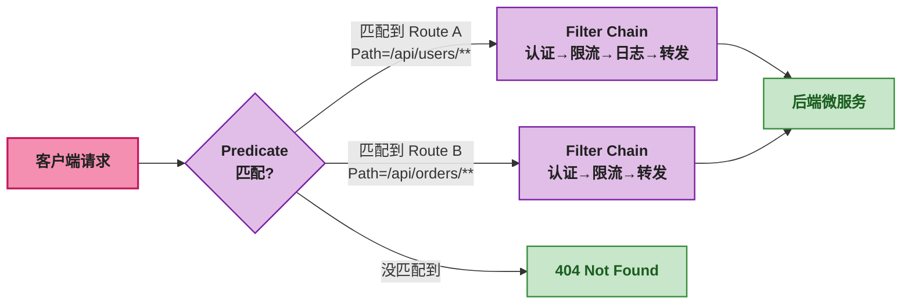

# Spring Cloud Gateway 核心概念与快速上手

## 一、⚡ 微服务上线后——前端疯了

你有 3 个微服务——用户服务在 8081、订单服务在 8082、商品服务在 8083。后端调得挺好——gRPC/Dubbo/REST 各种 RPC 全上了。

然后前端来找你：<strong>"我要调三个不同的端口？那用户登录后 Token 怎么统一校验？跨域怎么配？万一商品服务挂了——我是直接给用户看 500 错误还是给个降级提示？"</strong>

这些问题都不是前端该解决的——它们应该在一个统一的<strong>入口网关</strong>里处理：

```
没有网关：
  浏览器 → 直接调 8081（用户服务）
  浏览器 → 直接调 8082（订单服务）
  浏览器 → 直接调 8083（商品服务）
  → 三个端口、三次鉴权、三次跨域——前端疯了

有了网关：
  浏览器 → 网关 :8080 → /api/users/** 转给 8081
                       → /api/orders/** 转给 8082
                       → /api/products/** 转给 8083
  → 一个端口、一次鉴权、一处跨域——前端只认识网关
```

<strong>API 网关就是系统的"大门"</strong>——所有外部请求都从这一个门进来，由它统一做鉴权、限流、路由、日志、降级。后端服务只关心业务逻辑——不管安全和流量控制。

## 二、🤔 选型：为什么是 Spring Cloud Gateway？

Java 生态中做网关有一堆选择——先搞清楚 Spring Cloud Gateway 在其中的位置：

| 网关 | 底层 | 编程模型 | 适用场景 |
|------|------|------|------|
| <strong>Spring Cloud Gateway</strong> | WebFlux + Netty | 响应式——非阻塞 I/O | <strong>Spring 微服务体系——首选</strong> |
| Zuul 1.x | Tomcat + Servlet | 阻塞——一个请求一个线程 | 已停止维护——不推荐新项目 |
| Zuul 2.x | Netty | 异步——但生态不成熟 | 几乎没人用 |
| Nginx + Lua (OpenResty) | Nginx C 内核 | 同步——Lua 脚本 | 性能极高——但开发门槛高 |
| Kong | OpenResty | Lua + 插件 | API 管理平台——适合需要 API 管理的场景 |

<strong>Spring Cloud Gateway 碾压 Zuul 1.x 的根本原因是"非阻塞"</strong>：

```
Zuul 1.x（阻塞——Tomcat Servlet）：
  一个请求进来 → 分配一个线程 → 转发到后端 → 线程等响应 → 返回客户端
  如果后端慢了 2 秒——这个线程就白白等 2 秒
  1000 个并发 = 1000 个线程（200 个 Tomcat 默认最大线程数 + 排队 800 个）

Spring Cloud Gateway（非阻塞——Netty）：
  一个请求进来 → 分配给一个连接 → 转发到后端 → 连接注册回调 → 去处理其他请求
  后端返回了 → 回调被触发 → 返回客户端
  1000 个并发 = 只需要几个线程（CPU 核心数 x 2）
```

<strong>一句话：Zuul 1.x 的线程在"等"，Spring Cloud Gateway 的线程在"干活"。</strong>

## 三、🧩 核心三要素：Route / Predicate / Filter

Spring Cloud Gateway 的设计只有三个核心概念——Route、Predicate、Filter。它们的关系一句话：

```
Route（路由） = Predicate（断言/匹配条件） + Filter（过滤器/处理逻辑）

一个请求进来了：
  ① 拿请求的路径/Header/参数去匹配 Predicate
  ② 匹配上了 → 确定走哪个 Route
  ③ 经过一系列 Filter 的处理 → 转发到后端服务
```



### 3.1 Route —— 路由：把请求引向正确的后端

Route 是网关的基本单元——它定义了一条转发规则：

```yaml
# application.yml——一条完整的路由配置
spring:
  cloud:
    gateway:
      routes:
        - id: user-service                # ① 路由 ID——唯一标识
          uri: http://localhost:8081       # ② 目标 URI——请求最终发到这里
          predicates:                      # ③ Predicate——匹配条件的集合
            - Path=/api/users/**           #    路径匹配——/api/users/xxx 开头的请求
          filters:                         # ④ Filter——处理规则
            - StripPrefix=1                #    转发前去掉前 1 段——/api/users/xxx → /xxx
```

<strong>这条路由在干什么？</strong>

```
客户端请求：GET http://gateway:8080/api/users/1
  → Predicate Path=/api/users/** 匹配成功 → 这条 Route 选中
  → Filter StripPrefix=1：去掉 /api/users → 变成 /1
  → 转发到 uri http://localhost:8081/1
  → user-service 收到 GET /1 → 返回用户信息
```

### 3.2 Predicate —— 断言：决定请求走哪条路

Predicate 就是匹配条件——和 Java 8 的 `Predicate<ServerWebExchange>` 一样，返回 `true` 就匹配。Spring Cloud Gateway 内置了 12 种 Predicate：

| Predicate | 配置示例 | 匹配的请求 |
|------|------|------|
| `Path` | `Path=/api/users/**` | 路径匹配——支持 Ant 风格通配符 |
| `Host` | `Host=**.example.com` | 域名匹配——`api.example.com` 或 `order.example.com` |
| `Header` | `Header=X-API-Key, \d+` | 请求头匹配——Header + 值正则 |
| `Method` | `Method=GET,POST` | HTTP 方法匹配 |
| `Query` | `Query=token, .+` | 查询参数匹配——参数名 + 值正则 |
| `Cookie` | `Cookie=sessionId, [a-z]+` | Cookie 匹配 |
| `RemoteAddr` | `RemoteAddr=192.168.1.0/24` | 客户端 IP 匹配 |
| `Weight` | `Weight=group1, 8` | 按权重分发——灰度发布 |
| `Before` | `Before=2024-12-31T23:59:59+08:00` | 在指定时间之前生效 |
| `After` | `After=2024-01-01T00:00:00+08:00` | 在指定时间之后生效 |
| `Between` | `Between=开始时间, 结束时间` | 在时间段内生效 |
| `XForwardedRemoteAddr` | `XForwardedRemoteAddr=10.0.0.0/8` | 经过代理时用 X-Forwarded-For 判断 IP |

<strong>Predicate 之间是 AND 关系</strong>——一条 Route 可以有多个 Predicate，必须全部满足才算匹配：

```yaml
- id: user-service-v2
  uri: http://localhost:8082
  predicates:
    - Path=/api/users/**           # 路径匹配
    - Header=X-Version, v2         # 且——Header 中 X-Version = v2
    - Method=GET                   # 且——只匹配 GET 请求
  # 三个条件同时满足 → 请求被路由到此
```

### 3.3 Filter —— 过滤器：在请求转发的过程中"搞事情"

Filter 在请求转发的整个生命周期中起作用——它可以在转发<strong>之前</strong>和转发<strong>之后</strong>插入逻辑：

```java
// 一个典型的 GatewayFilter 执行流程
public class LoggingFilter implements GatewayFilter {
    @Override
    public Mono<Void> filter(ServerWebExchange exchange, GatewayFilterChain chain) {
        // ① 转发之前——Pre Filter：记录请求日志
        System.out.println("收到请求: " + exchange.getRequest().getURI());

        // ② 转发——调用下一个 Filter 或最终转发到后端
        return chain.filter(exchange)
                .then(Mono.fromRunnable(() -> {
                    // ③ 转发之后——Post Filter：记录响应日志
                    System.out.println("响应状态: " +
                            exchange.getResponse().getStatusCode());
                }));
    }
}
```

<strong>Filter 分两种——GlobalFilter 和 GatewayFilter</strong>：

| 类型 | 作用范围 | 使用方式 | 典型场景 |
|------|------|------|------|
| <strong>GatewayFilter</strong> | 作用于<strong>特定路由</strong> | 在 yml 的 `filters` 下配置 | StripPrefix、AddRequestHeader、限流、重试 |
| <strong>GlobalFilter</strong> | 作用于<strong>所有路由</strong> | 实现 `GlobalFilter` 接口，自动生效 | 全局鉴权、全局日志、全局跨域 |

## 四、🔧 第一个 Spring Cloud Gateway 项目

### 4.1 依赖

```xml
<dependencies>
    <!-- Spring Cloud Gateway 核心 -->
    <dependency>
        <groupId>org.springframework.cloud</groupId>
        <artifactId>spring-cloud-starter-gateway</artifactId>
    </dependency>

    <!-- 服务发现——Gateway 从 Nacos 发现后端服务 -->
    <dependency>
        <groupId>com.alibaba.cloud</groupId>
        <artifactId>spring-cloud-starter-alibaba-nacos-discovery</artifactId>
    </dependency>

    <!-- 注意：千万不要引入 spring-boot-starter-web！
         Gateway 基于 WebFlux——不是 Servlet -->
</dependencies>
```

> ⚠️ 新手提示：Spring Cloud Gateway 依赖 `spring-boot-starter-webflux`——它和 `spring-boot-starter-web`（Spring MVC）<strong>不兼容</strong>。如果你在项目中同时引了 `starter-web`——网关启动时会报 "Spring MVC found on classpath" 错误。

### 4.2 最简单的网关配置

```yaml
# application.yml
server:
  port: 8080

spring:
  application:
    name: api-gateway
  cloud:
    gateway:
      routes:
        # 路由 1——转发用户服务
        - id: user-service
          uri: http://localhost:8081
          predicates:
            - Path=/api/users/**
          filters:
            - StripPrefix=1          # /api/users/1 → 转发到 http://localhost:8081/1

        # 路由 2——转发订单服务
        - id: order-service
          uri: http://localhost:8082
          predicates:
            - Path=/api/orders/**
          filters:
            - StripPrefix=1
```

### 4.3 启动并验证

```bash
# 启动网关（端口 8080）和两个后端服务（8081、8082）

# 测试——浏览器访问网关的地址
curl http://localhost:8080/api/users/1
# 网关收到请求 → Predicate 匹配到 user-service Route
# → StripPrefix=1 去掉 /api/users → 转发到 http://localhost:8081/1
# → 用户服务返回用户信息

curl http://localhost:8080/api/orders/100
# 网关收到请求 → Predicate 匹配到 order-service Route
# → StripPrefix=1 去掉 /api/orders → 转发到 http://localhost:8082/100
# → 订单服务返回订单信息
```

### 4.4 Java DSL —— 用代码定义路由

除了 yml 配置，也可以<strong>用 Java 代码定义路由</strong>——适合需要动态路由或复杂逻辑的场景：

```java
@Configuration
public class GatewayRouteConfig {

    @Bean
    public RouteLocator customRoutes(RouteLocatorBuilder builder) {
        return builder.routes()
                // 路由 1——用户服务
                .route("user-service", r -> r
                        .path("/api/users/**")        // Predicate：路径匹配
                        .filters(f -> f
                                .stripPrefix(1)        // Filter：去掉前 1 段
                                .addRequestHeader("X-Source", "gateway")) // Filter：加请求头
                        .uri("http://localhost:8081")) // 目标 URI

                // 路由 2——订单服务
                .route("order-service", r -> r
                        .path("/api/orders/**")
                        .filters(f -> f.stripPrefix(1))
                        .uri("http://localhost:8082"))

                .build();
    }
}
```

### 4.5 结合 Nacos 服务发现——不需要写死 IP

上面的配置把后端地址写死了——`uri: http://localhost:8081`。微服务环境下，后端地址是动态的（Pod 重启后 IP 变了）。把 Gateway 和 Nacos 结合——按服务名路由：

```yaml
spring:
  cloud:
    gateway:
      discovery:
        locator:
          enabled: true            # 开启服务发现自动路由
          lower-case-service-id: true  # 服务名转小写
      routes:
        - id: user-service
          uri: lb://user-service   # ← lb:// = Load Balance——从 Nacos 查到实例列表
          predicates:
            - Path=/api/users/**
          filters:
            - StripPrefix=1

        - id: order-service
          uri: lb://order-service
          predicates:
            - Path=/api/orders/**
          filters:
            - StripPrefix=1
```

`lb://` 前缀告诉 Gateway：<strong>去 Nacos 查 `user-service` 的所有实例，用负载均衡选一个转发</strong>。不需要知道 IP——后端扩容缩容网关自动感知。

## 五、👀 WebFlux 和 Netty —— 为什么 Gateway 不是 Tomcat？

Spring Cloud Gateway 底层是 WebFlux + Netty，不是 Spring MVC + Tomcat。这意味着：

| 组件 | Spring MVC (Tomcat) | Spring Cloud Gateway (Netty) |
|------|:---:|:---:|
| <strong>线程模型</strong> | 一个请求分配一个线程——请求量 = 线程数 | 少量 EventLoop 线程——与 CPU 核心数挂钩 |
| <strong>适用场景</strong> | 业务逻辑复杂——需要查数据库、调 RPC | <strong>网络转发——高并发低延迟</strong> |
| <strong>默认线程数</strong> | 200（Tomcat 默认） | CPU 核数 x 2（Netty EventLoop） |
| <strong>Spring Security</strong> | 基于 Servlet Filter | 基于 WebFilter——Servlet API 不能用 |

<strong>Gateway 不做业务逻辑——它只做转发</strong>。转发是 I/O 密集型操作——等待网络响应。Netty 的非阻塞模型正是为此设计的——几千个并发连接只需要几十个线程。

```java
// ⚠️ 在 Gateway 中写业务逻辑 = 反模式
// ❌ 不要在 Filter 中查数据库
// ❌ 不要在 Filter 中做复杂计算
// ✅ Filter 只做：鉴权、限流、日志、Header 操作、路由转发
```

## 六、⚖️ Spring Cloud Gateway vs Nginx vs Kong

| 维度 | Spring Cloud Gateway | Nginx | Kong |
|------|:---:|:---:|:---:|
| <strong>技术栈</strong> | Java——WebFlux + Netty | C 语言——Nginx 核心 | Lua（基于 OpenResty） |
| <strong>Java 生态整合</strong> | ✅ Nacos/Sentinel/Spring Security 天然集成 | 需要额外开发（Lua 脚本来做服务发现） | 需要额外插件 |
| <strong>性能</strong> | 高——Netty 非阻塞 | <strong>极高</strong>——C 语言 | 高——OpenResty |
| <strong>动态路由</strong> | ✅——代码中动态修改 RouteLocator | 需要 reload（nginx -s reload）或 Lua 脚本 | ✅——Admin API |
| <strong>学习曲线</strong> | 低——Java 开发者直接上手 | <strong>高</strong>——Nginx 配置 + Lua 脚本 | 中——REST API 管理 |
| <strong>适合谁</strong> | <strong>Java 团队——Spring 微服务体系</strong> | 基础设施团队——通用反向代理 | 需要 API 管理平台的团队 |

<strong>常见搭配</strong>：Nginx 在最外层——做 TLS 终结和静态资源——Gateway 在 Nginx 后面做应用层路由（鉴权、限流、灰度）。两层网关各干各的。

## 🎯 总结

1. <strong>API 网关是系统的统一入口</strong>——所有外部请求都从它进来。前端只认识网关，不认识后端服务。鉴权、限流、日志、降级——后端不关心，网关统一做。

2. <strong>Route / Predicate / Filter 是理解 Gateway 的三把钥匙</strong>：Route 定义"转发到哪"，Predicate 决定"请求走哪条路由"，Filter 在转发过程中"搞事情（加 Header、去掉前缀、鉴权、限流）"。

3. <strong>Gateway 用 WebFlux + Netty——不是 Tomcat</strong>：非阻塞 I/O 让几千个并发只需要几十个线程。别在 Filter 中写业务逻辑——它只做转发。

4. <strong>lb:// 协议让 Gateway 和服务发现无缝整合</strong>：写死 IP 是过去式——`uri: lb://user-service` 让 Gateway 自己从 Nacos 查实例列表。

> 📖 <strong>下一步阅读</strong>：Predicate 是路由的"匹配引擎"——Path 只是冰山一角。Host、Header、Query、Cookie、Weight 每种 Predicate 怎么用？多个 Predicate 怎么组合？动态路由怎么实现？继续阅读 [<strong>Predicate 与路由规则全解</strong>]()。
