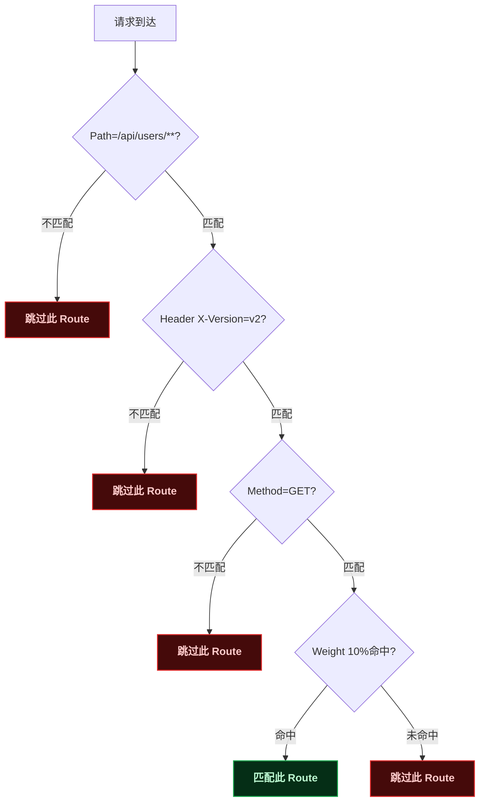

# Predicate 与路由规则

> 📖 <strong>前置阅读</strong>：本文假设读者已理解 Route/Predicate/Filter 三要素和 Gateway 的基本用法。如果还不熟悉，建议先阅读 [<strong>Spring Cloud Gateway 核心概念与快速上手</strong>]()。

## 一、⚡ Path 匹配太简单了——直到你遇到了这些需求

上一篇用 `Path=/api/users/**` 把请求按路径转发——基本路由够用了。但真实场景远不止于此：

```
需求 1：灰度发布——10% 的流量走 v2 版本，90% 走 v1
需求 2：内网用户走内网地址，外网用户走外网地址
需求 3：大促活动只在 12 月 1 日到 12 月 12 日生效——过期自动关闭
需求 4：带特定 Header（X-Tenant=alibaba）的请求路由到专门的集群
需求 5：GET 请求走缓存集群，POST/PUT/DELETE 走主集群
```

这些需求全都靠 Predicate 实现。Predicate 不只有 Path——Spring Cloud Gateway 内置了 <strong>12 种 Predicate Factory</strong>。

## 二、📖 记住 Predicate 的命名规则

Spring Cloud Gateway 的 Predicate 在配置时有一个命名转换：

```
Java 类名：            CookieRoutePredicateFactory
  ↓ 去掉 "RoutePredicateFactory" 后缀
配置名：              Cookie=xxx
```

<strong>所有 Predicate 都是这个规则</strong>：`HeaderRoutePredicateFactory` → `Header`，`QueryRoutePredicateFactory` → `Query`。知道这个后——看到一个配置名就能找到对应的源码。

| Java 类名 | 配置 key | 参数格式 |
|------|------|------|
| `PathRoutePredicateFactory` | `Path` | `Path=/api/users/**` |
| `HostRoutePredicateFactory` | `Host` | `Host=**.example.com` |
| `HeaderRoutePredicateFactory` | `Header` | `Header=X-API-Key, \d+` |
| `MethodRoutePredicateFactory` | `Method` | `Method=GET,POST` |
| `QueryRoutePredicateFactory` | `Query` | `Query=token, .+` |
| `CookieRoutePredicateFactory` | `Cookie` | `Cookie=sessionId, [a-z]+` |
| `RemoteAddrRoutePredicateFactory` | `RemoteAddr` | `RemoteAddr=192.168.1.0/24` |
| `WeightRoutePredicateFactory` | `Weight` | `Weight=group1, 8` |
| `BeforeRoutePredicateFactory` | `Before` | `Before=2024-12-31T23:59:59+08:00` |
| `AfterRoutePredicateFactory` | `After` | `After=2024-01-01T00:00:00+08:00` |
| `BetweenRoutePredicateFactory` | `Between` | `Between=时间1, 时间2` |
| `XForwardedRemoteAddrRoutePredicateFactory` | `XForwardedRemoteAddr` | `XForwardedRemoteAddr=10.0.0.0/8` |

## 三、🧬 每种 Predicate 拆开讲

### 3.1 Path —— 路径匹配（最常用）

```yaml
predicates:
  - Path=/api/users/**            # /api/users/ 开头的所有请求
  - Path=/api/orders/{orderId}    # /api/orders/123（orderId 是路径变量——Filter 中可以拿到）
  - Path=/api/users/*/profile     # /api/users/1/profile —— * 匹配单段
```

Ant 风格通配符规则：

| 通配符 | 匹配范围 | 示例 |
|------|------|------|
| `*` | 匹配<strong>单段</strong>——不跨 `/` | `/api/*/profile` → `/api/users/profile` ✅ `/api/users/1/profile` ❌ |
| `**` | 匹配<strong>多段</strong>——跨 `/` | `/api/**` → `/api/users` ✅ `/api/users/1/profile` ✅ |
| `?` | 匹配<strong>单个字符</strong> | `/api/users/?` → `/api/users/1` ✅ `/api/users/12` ❌ |

### 3.2 Host —— 域名匹配

同一个 Gateway 监听多个域名——根据 `Host` 头分流转发：

```yaml
routes:
  # api.example.com → 用户接口
  - id: user-api
    uri: lb://user-service
    predicates:
      - Host=api.example.com

  # admin.example.com → 管理后台接口
  - id: admin-api
    uri: lb://admin-service
    predicates:
      - Host=admin.example.com

  # 所有子域名——*.example.com
  - id: all-subdomains
    uri: lb://default-service
    predicates:
      - Host=**.example.com
```

```bash
# 验证
curl -H "Host: api.example.com" http://gateway:8080/users/1
# → 匹配 user-api Route → 转发到 user-service

curl -H "Host: admin.example.com" http://gateway:8080/users/1
# → 匹配 admin-api Route → 转发到 admin-service
```

### 3.3 Header —— 请求头匹配

根据 Header 的值做分流——灰度、多租户、API 版本控制：

```yaml
routes:
  # Header X-Version=v2 → 灰度集群
  - id: user-service-v2
    uri: lb://user-service-v2
    predicates:
      - Path=/api/users/**
      - Header=X-Version, v2           # Header 名=值正则

  # Header X-Tenant=alibaba → 阿里专属集群
  - id: tenant-alibaba
    uri: lb://tenant-alibaba-cluster
    predicates:
      - Header=X-Tenant, alibaba       # 精确匹配

  # 只要有 X-Tenant Header——不管是什么值
  - id: any-tenant
    uri: lb://multi-tenant-service
    predicates:
      - Header=X-Tenant                # 不写正则——只要 Header 存在就匹配
```

```bash
curl -H "X-Version: v2" http://gateway:8080/api/users/1
# → 匹配 user-service-v2 Route

curl -H "X-Tenant: alibaba" http://gateway:8080/api/users/1
# → 匹配 tenant-alibaba Route

curl -H "X-Tenant: tencent" http://gateway:8080/api/users/1
# → 匹配 any-tenant Route（Header 存在但值不匹配 alibaba 正则——走到 any-tenant）
```

> ⚠️ 新手提示：两个 Header 匹配规则一条是精确值、一条是"存在即匹配"——如果请求同时满足会怎么样？Gateway 按 Route 的定义顺序匹配——<strong>谁先定义谁先生效</strong>。所以要把精确匹配的 Route 写在前面。

### 3.4 Method —— HTTP 方法匹配

读写分离——GET 请求走读库集群，写操作走主库集群：

```yaml
routes:
  # 读操作——走只读副本
  - id: read-cluster
    uri: lb://user-service-read
    predicates:
      - Path=/api/users/**
      - Method=GET

  # 写操作——走主库
  - id: write-cluster
    uri: lb://user-service-write
    predicates:
      - Path=/api/users/**
      - Method=POST,PUT,DELETE
```

### 3.5 Query —— 查询参数匹配

根据 URL 中的查询参数路由：

```yaml
routes:
  # 带 ?token=xxx 的请求——放行
  - id: with-token
    uri: lb://user-service
    predicates:
      - Query=token                    # 只要有 token 参数——不管值

  # ?token= 后面必须是非空值
  - id: with-token-value
    uri: lb://user-service
    predicates:
      - Query=token, .+               # token 参数值不能为空（正则 .+ = 至少一个字符）

  # ?debug=true → 调试模式——转发到专门的调试服务
  - id: debug-mode
    uri: lb://debug-service
    predicates:
      - Query=debug, true
```

### 3.6 Cookie —— Cookie 匹配

```yaml
routes:
  # 有 sessionId Cookie 的请求——已登录用户
  - id: authenticated-users
    uri: lb://user-service
    predicates:
      - Cookie=sessionId, [A-Za-z0-9]+  # sessionId 的值必须是字母数字

  # 有 JSessionID Cookie——不管值是什么
  - id: jsession
    uri: lb://user-service
    predicates:
      - Cookie=JSessionID
```

### 3.7 RemoteAddr —— 客户端 IP 匹配

内网请求和外网请求走不同的集群：

```yaml
routes:
  # 内网 IP 段——走内网集群（如果前端误调了外网网关——也正确路由）
  - id: internal-network
    uri: lb://internal-cluster
    predicates:
      - RemoteAddr=10.0.0.0/8         # 10.x.x.x
      - RemoteAddr=172.16.0.0/12      # 172.16.x.x ~ 172.31.x.x
      - RemoteAddr=192.168.0.0/16     # 192.168.x.x

  # 其他所有 IP——走公网集群
  - id: external-network
    uri: lb://external-cluster
    predicates:
      - Path=/**
```

### 3.8 Weight —— 按权重分发（灰度发布核心）

<strong>这是实现灰度发布的关键 Predicate</strong>——同一组内按权重分配流量：

```yaml
routes:
  # 灰度组 group-user——v1 走 90% 流量
  - id: user-service-v1
    uri: lb://user-service-v1
    predicates:
      - Path=/api/users/**
      - Weight=group-user, 90         # 组名=灰度组, 权重=90

  # 灰度组 group-user——v2 走 10% 流量
  - id: user-service-v2
    uri: lb://user-service-v2
    predicates:
      - Path=/api/users/**
      - Weight=group-user, 10         # 组名必须一样——Gateway 才知道它们是一组的
```

<strong>Weight 的工作原理</strong>：同一个 `group` 中的 Route 共享 100% 的流量权重。Gateway 根据权重随机分配——不是轮询，是大数定律（请求量足够大时——v1: v2 ≈ 9:1）：

```bash
# 灰度验证——发 100 个请求看分布
for i in $(seq 1 100); do
  curl -s http://gateway:8080/api/users/1 | grep "version"
done
# 输出约 90 次 "v1"，10 次 "v2"
```

### 3.9 时间路由 —— Before / After / Between

大促活动定时上线——不需要凌晨手动改配置：

```yaml
routes:
  # 黑五大促路由——仅在 12 月 1 日 00:00 到 12 月 12 日 23:59 生效
  - id: black-friday
    uri: lb://promotion-service
    predicates:
      - Path=/api/promotions/**
      - Between=2024-12-01T00:00:00+08:00, 2024-12-12T23:59:59+08:00

  # 新版本迁移——2025 年 1 月 1 日之后全部切到 v2
  - id: user-service-v2-migration
    uri: lb://user-service-v2
    predicates:
      - Path=/api/users/**
      - After=2025-01-01T00:00:00+08:00

  # 旧版本——2025 年 1 月 1 日之前生效，之后自动失效
  - id: user-service-v1-legacy
    uri: lb://user-service-v1
    predicates:
      - Path=/api/users/**
      - Before=2025-01-01T00:00:00+08:00
```

### 3.10 XForwardedRemoteAddr —— 经过代理后的真实 IP

如果 Gateway 前面还有一层 Nginx/CDN——客户端 IP 在 `X-Forwarded-For` Header 中：

```yaml
predicates:
  # 真实客户端 IP（经过 Nginx 代理后）——不是 Nginx 的 IP
  - XForwardedRemoteAddr=192.168.1.0/24
```

### 3.11 多个 Predicate 组合 —— 全部是 AND

一条 Route 中所有 Predicate <strong>必须全部满足</strong>：

```yaml
# 这条 Route 同时要求：
#  ① 路径是 /api/users/**
#  ② Header 中 X-Version=v2
#  ③ 只匹配 GET 请求
#  ④ 灰度流量占 10%
- id: user-service-v2-canary
  uri: lb://user-service-v2
  predicates:
    - Path=/api/users/**
    - Header=X-Version, v2
    - Method=GET
    - Weight=group-user-v2, 10
```



## 四、🔄 yml 配置 vs Java DSL vs 动态路由

Spring Cloud Gateway 提供<strong>三种方式定义路由</strong>——各有各的适用场景：

| 方式 | 修改是否重启 | 适用场景 | 复杂逻辑 |
|------|:---:|------|:---:|
| <strong>yml 配置</strong> | 需要重启 | 固定路由——路径转发、Host 转发 | ❌ 不适合 |
| <strong>Java DSL</strong> | 需要重启 | 需要编程判断——如从数据库读路由配置 | ✅ 适合 |
| <strong>动态路由（Nacos）</strong> | <strong>不需要重启</strong> | 微服务上线/下线频繁——路由随服务发现自动更新 | ❌ 只支持 lb:// 路由 |

### 4.1 Java DSL —— 用代码定义路由

当 yml 难以表达复杂逻辑时——用 Java DSL：

```java
@Configuration
public class DynamicRouteConfig {

    @Bean
    public RouteLocator routeLocator(RouteLocatorBuilder builder) {
        return builder.routes()
                // 示例 1：根据请求参数动态选择目标
                .route("dynamic-user", r -> r
                        .predicate(exchange -> {
                            // Java 8 Predicate——可以写任意逻辑
                            String tenant = exchange.getRequest()
                                    .getHeaders().getFirst("X-Tenant");
                            return tenant != null && !tenant.isEmpty();
                        })
                        .filters(f -> f.addRequestHeader("X-Routed-By", "dynamic"))
                        .uri("lb://user-service"))

                // 示例 2：从数据库读路由配置
                .route("db-route", r -> r
                        .path("/api/dynamic/**")
                        .filters(f -> f.filter(new GatewayFilter() {
                            @Override
                            public Mono<Void> filter(ServerWebExchange exchange,
                                                     GatewayFilterChain chain) {
                                // 查 Redis——获取真实后端地址
                                String target = getTargetFromRedis(exchange.getRequest());
                                // 修改请求的目标地址
                                exchange.getAttributes().put("targetUri", target);
                                return chain.filter(exchange);
                            }
                        }))
                        .uri("lb://default-service"))
                .build();
    }

    private String getTargetFromRedis(ServerHttpRequest request) {
        // 从 Redis 或数据库查出真正的后端地址
        return "http://backend:8080";
    }
}
```

### 4.2 动态路由 —— 结合 Nacos 自动发现

只要配上 `lb://` 和 Nacos，路由自动感知服务上下线：

```yaml
spring:
  cloud:
    gateway:
      discovery:
        locator:
          enabled: true            # 核心开关——开启后自动为每个 Nacos 服务创建路由
          lower-case-service-id: true

# 开启后——Nacos 中有 user-service 服务时
# Gateway 自动创建路由：
#   Path=/user-service/** → lb://user-service
#   不需要你手动写 Route——全自动
```

```bash
# Nacos 中新注册了一个 payment-service
# Gateway 自动生效——不需要改配置、不需要重启
curl http://gateway:8080/payment-service/api/pay/order/100
# 自动转发到 payment-service
```

也可以<strong>手动维护路由 + 动态刷新</strong>——当需要用 Nacos Config 管理路由配置时：

```java
// 监听 Nacos Config 中的路由配置变化——动态更新 RouteLocator
@Component
public class DynamicRouteRefresher {

    @Autowired
    private RouteDefinitionWriter routeDefinitionWriter;

    // 当 Nacos Config 中 gateway-routes.json 变化时——自动刷新路由
    @NacosConfigListener(dataId = "gateway-routes.json")
    public void onRouteChange(String config) {
        // 解析 JSON 配置 → 更新 RouteDefinition
        List<RouteDefinition> routes = parseJson(config);
        // 删除旧路由 + 添加新路由——不需要重启
        updateRoutes(routes);
    }

    private void updateRoutes(List<RouteDefinition> routes) {
        // 通过 RouteDefinitionWriter 动态增删路由——无需重启 Gateway
        // ...
    }
}
```

## 五、🔍 路由匹配优先级——当多个 Route 都匹配时

Gateway 的匹配规则：<strong>按定义顺序匹配——谁先匹配到谁先生效</strong>。后面的 Route 即使也能匹配到——也不会执行。

```yaml
routes:
  # ① 精确匹配——/api/users/v2 优先匹配这个
  - id: user-v2
    uri: lb://user-service-v2
    predicates:
      - Path=/api/users/v2/**

  # ② 通用匹配——其他 /api/users/** 都匹配这个
  #    /api/users/v2/1 不会走到这里——因为上面的 Route 已经匹配了
  - id: user-v1
    uri: lb://user-service-v1
    predicates:
      - Path=/api/users/**
```

<strong>Rule of thumb</strong>：精确的 Route 写在上面，宽泛的 Route 写在下面。和 Nginx `location` 的匹配逻辑一样。

## 六、🐛 Predicate 调试——怎么知道请求走了哪条 Route？

```yaml
# 开启 Gateway 的 debug 日志——看路由匹配过程
logging:
  level:
    reactor.netty: DEBUG
    org.springframework.cloud.gateway: TRACE  # ← 打印 Route 匹配的详细过程
```

日志输出示例：

```
# TRACE 日志——可以看到每个 Predicate 的匹配结果
Route user-service-v2 predicate [Path /api/users/**] matches: true
Route user-service-v2 predicate [Header X-Version: v2] matches: false
  → 跳过 user-service-v2
Route user-service-v1 predicate [Path /api/users/**] matches: true
  → 匹配 user-service-v1
```

## 🎯 总结

1. <strong>12 种 Predicate = 12 种路由策略</strong>：Path（路径）、Host（域名）、Header（请求头）、Method（HTTP 方法）、Query（查询参数）、Cookie、RemoteAddr（IP）、Weight（权重/灰度）、Before/After/Between（时间）、XForwardedRemoteAddr（代理后的真实 IP）。

2. <strong>Weight 是灰度发布的核心</strong>：同一个 `group` 中按权重分流量——`Weight=group1, 10` 拿 10% 流量。不是轮询——是概率分配，请求量越大越接近权重比例。

3. <strong>多个 Predicate 是 AND 关系</strong>：全部满足才算匹配。精确 Route 写上面，宽泛 Route 写下面。

4. <strong>三种定义方式按场景选</strong>：固定路由用 yml、复杂逻辑用 Java DSL、微服务频繁上下线用 Nacos 自动发现（lb:// + discovery.locator.enabled=true）。

> 📖 <strong>下一步阅读</strong>：路由规则搞定了——但请求转发过程中你还想做更多事：自动加 Header、去掉路径前缀、限流、重试、熔断。这些都是 Filter 的活——继续阅读 [<strong>GatewayFilter 与 GlobalFilter 全操作</strong>]()。
