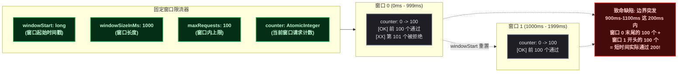
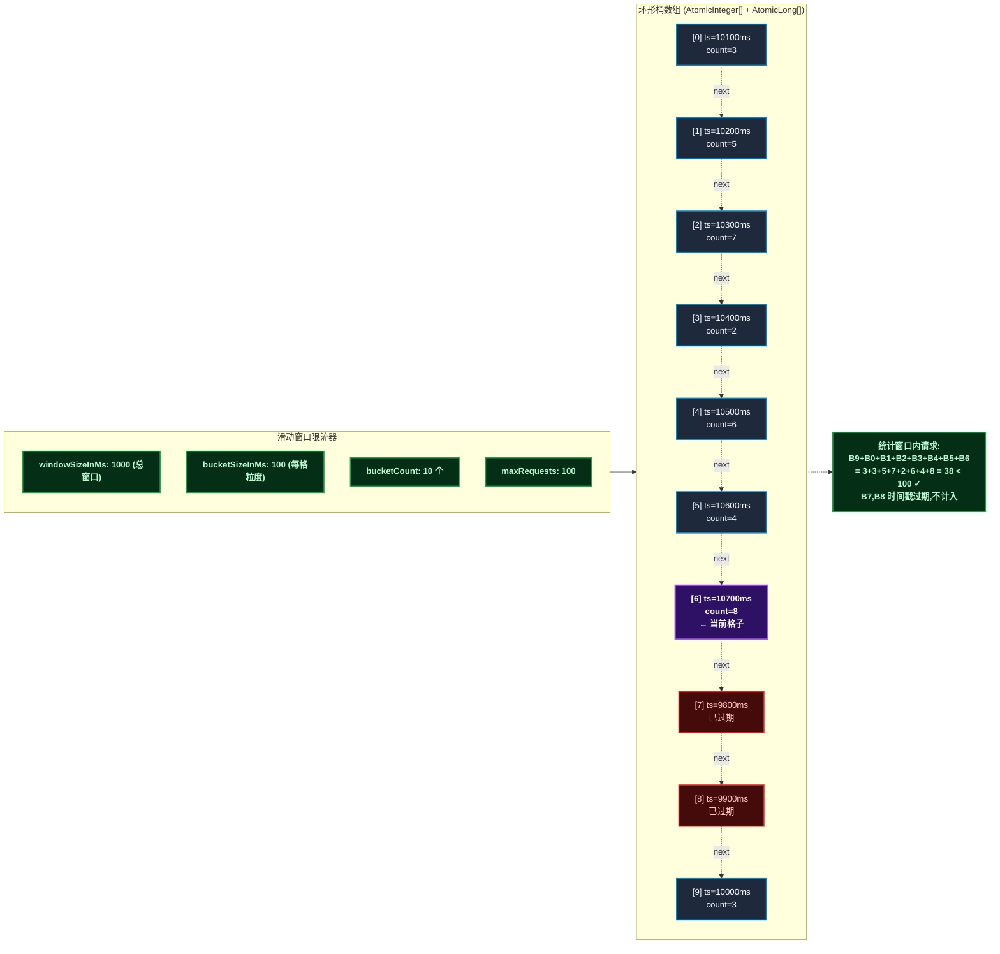
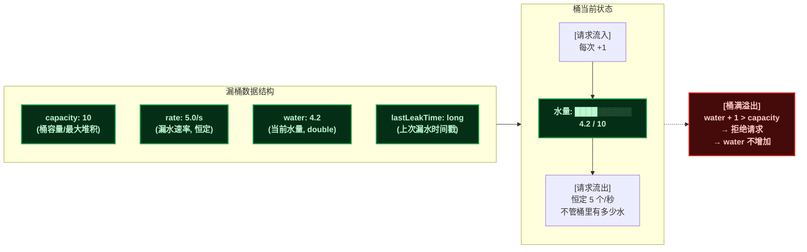
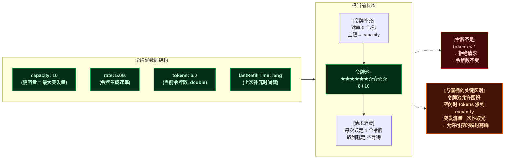
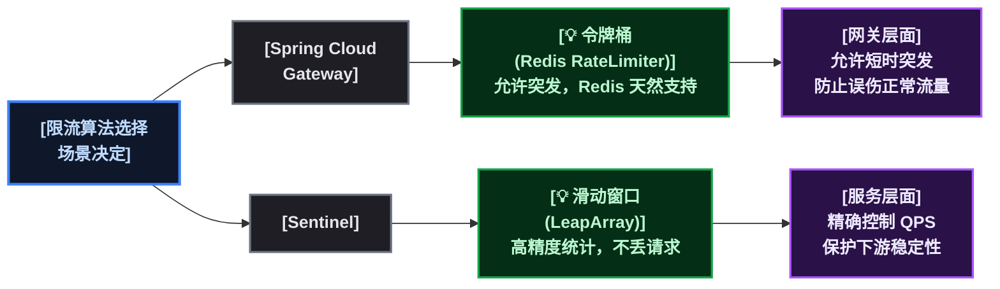

# 在 Gateway 里手写四种限流算法

## 目标说明

网关是流量的咽喉，限流是网关最重要的能力之一。这篇文章的目标很明确：

1. <strong>理解四种主流限流算法的核心逻辑</strong>：固定窗口、滑动窗口、漏桶、令牌桶
2. <strong>每种算法都能写出来并跑通</strong>，不只是看概念
3. <strong>集成到 Spring Cloud Gateway 中</strong>，作为自定义 GatewayFilter 使用
4. <strong>了解生产级方案</strong>：Redis + Lua 分布式限流

读完这篇文章，读者应该能回答："为什么 Sentinel 选滑动窗口、Gateway 选令牌桶？"以及"如果让你自己写一个限流过滤器，你怎么写？"

## 前置条件

开始之前，确保环境满足以下条件：

| 依赖 | 版本要求 | 用途 |
|------|---------|------|
| JDK | 11+ | 运行 Spring Boot 应用 |
| Spring Boot | 2.7.x | 基础框架 |
| Spring Cloud | 2021.0.x | Gateway 依赖 |
| Spring Cloud Gateway | 3.1.x | 网关核心 |
| Redis（可选） | 6.0+ | 分布式限流 |
| JMeter（可选） | 5.5+ | 压测验证 |

验证命令：

```bash
java -version                   # 应输出 11 或更高
mvn -version                    # 确认 Maven 可用
redis-cli ping                  # 如果做分布式限流，确认 Redis 连通
```

> ⚠️ 新手提示：本文的代码可以在一个独立的 Spring Boot 项目中运行，不需要完整的微服务集群。只要一个 Gateway 项目 + 一个后端服务即可验证。

## 环境搭建

先用 Spring Initializr 创建项目，或者直接复制以下 `pom.xml` ：

```xml
<!-- pom.xml -->
<parent>
    <groupId>org.springframework.boot</groupId>
    <artifactId>spring-boot-starter-parent</artifactId>
    <version>2.7.12</version>
</parent>

<properties>
    <java.version>11</java.version>
    <spring-cloud.version>2021.0.7</spring-cloud.version>
</properties>

<dependencies>
    <!-- Gateway 核心 -->
    <dependency>
        <groupId>org.springframework.cloud</groupId>
        <artifactId>spring-cloud-starter-gateway</artifactId>
    </dependency>

    <!-- Redis 依赖（分布式限流需要） -->
    <dependency>
        <groupId>org.springframework.boot</groupId>
        <artifactId>spring-boot-starter-data-redis-reactive</artifactId>
    </dependency>
</dependencies>
```

启动类与路由配置：

```java
@SpringBootApplication
public class GatewayApplication {
    public static void main(String[] args) {
        SpringApplication.run(GatewayApplication.class, args);
    }
}
```

```yaml
# application.yml
server:
  port: 8080
spring:
  cloud:
    gateway:
      routes:
        - id: backend-route
          uri: http://localhost:9090   # 后端服务地址
          predicates:
            - Path=/api/**
```

后端可以用一个简单的 Controller 模拟：

```java
@RestController
public class BackendController {
    @GetMapping("/api/hello")
    public String hello() {
        return "OK";
    }
}
```

启动后端（端口 9090）和网关（端口 8080） ， `curl http://localhost:8080/api/hello` 返回 `OK` 说明基础环境就绪。

## 分步实践

### 第1步：固定窗口 —— 最简单也最危险

<strong>思路</strong>：把时间切成固定大小的窗口（比如 1 秒），每个窗口内维护一个计数器。请求来了计数器 +1，超过阈值就拒绝。窗口结束时计数器清零。



<strong>核心代码</strong>：

```java
public class FixedWindowRateLimiter {
    // 窗口大小：1 秒
    private final long windowSizeInMs;
    // 每个窗口允许的最大请求数
    private final int maxRequests;
    // 当前窗口的起始时间
    private long windowStart;
    // 当前窗口的计数器
    private final AtomicInteger counter;

    public FixedWindowRateLimiter(long windowSizeInMs, int maxRequests) {
        this.windowSizeInMs = windowSizeInMs;
        this.maxRequests = maxRequests;
        this.windowStart = System.currentTimeMillis();
        this.counter = new AtomicInteger(0);
    }

    public synchronized boolean tryAcquire() {
        long now = System.currentTimeMillis();
        // 进入新窗口 → 重置
        if (now - windowStart > windowSizeInMs) {
            windowStart = now;
            counter.set(0);
        }
        // 判断是否超阈值
        return counter.incrementAndGet() <= maxRequests;
    }
}
```

<strong>为什么要加 `synchronized` ？</strong> `windowStart` 和 `counter.set(0)` 不是原子操作。如果没有锁，线程 A 看到老窗口、线程 B 同时重置了窗口，线程 A 的 `incrementAndGet` 可能基于一个半路被清空的计数器。这个细节是固定窗口实现最容易踩的坑。

<strong>致命缺陷</strong> ：假设阈值 100/秒。在 0.9 秒到 1.1 秒之间，横跨两个窗口，实际可以通过 200 个请求——这就是 <strong>边界突发问题</strong> 。生产环境别用固定窗口，知道它有多坑就够了。

### 第2步：滑动窗口 —— 加一层时间精度

<strong>思路</strong>：把大窗口再切分成若干小格子（比如 1 秒窗口切成 10 个 100ms 的小格子）。每次计算时，把当前时间点往前推一个窗口大小的范围，统计这段时间内的请求总数。



<strong>核心代码</strong>：

```java
public class SlidingWindowRateLimiter {
    // 窗口总大小（ms）
    private final long windowSizeInMs;
    // 每个小格子的大小（ms）
    private final long bucketSizeInMs;
    // 最大 QPS
    private final int maxRequests;
    // 小格子数量
    private final int bucketCount;
    // 每个小格子的计数器
    private final AtomicInteger[] buckets;
    // 每个小格子的时间戳
    private final AtomicLong[] bucketTimestamps;

    public SlidingWindowRateLimiter(long windowSizeInMs,
                                     long bucketSizeInMs,
                                     int maxRequests) {
        this.windowSizeInMs = windowSizeInMs;
        this.bucketSizeInMs = bucketSizeInMs;
        this.maxRequests = maxRequests;
        this.bucketCount = (int) (windowSizeInMs / bucketSizeInMs);
        this.buckets = new AtomicInteger[bucketCount];
        this.bucketTimestamps = new AtomicLong[bucketCount];
        for (int i = 0; i < bucketCount; i++) {
            buckets[i] = new AtomicInteger(0);
            bucketTimestamps[i] = new AtomicLong(0);
        }
    }

    public boolean tryAcquire() {
        long now = System.currentTimeMillis();
        int currentBucket = (int) ((now / bucketSizeInMs) % bucketCount);
        long bucketStart = now - (now % bucketSizeInMs);

        // 如果当前格子已过期，重置它
        long oldTimestamp = bucketTimestamps[currentBucket].get();
        if (bucketStart != oldTimestamp) {
            bucketTimestamps[currentBucket].set(bucketStart);
            buckets[currentBucket].set(0);
        }

        // 统计所有未过期格子的计数
        long windowStart = now - windowSizeInMs;
        int total = 0;
        for (int i = 0; i < bucketCount; i++) {
            if (bucketTimestamps[i].get() > windowStart) {
                total += buckets[i].get();
            }
        }

        if (total < maxRequests) {
            buckets[currentBucket].incrementAndGet();
            return true;
        }
        return false;
    }
}
```

<strong>滑动窗口 vs 固定窗口的核心区别</strong>：固定窗口的边界是死的（0ms→999ms 是一个窗口），滑动窗口的边界是活的（"从现在往前推 1 秒"）。这消除了边界突发问题。

<strong>代价</strong>：每次请求都要遍历所有小格子求和，时间复杂度 O(k)，k = 小格子数量。格子越多精度越高，但计算开销也越大。

> ⚠️ 新手提示：上面的实现里 `synchronized` 去掉了，但问题也来了——多个线程可能同时重置同一个格子。生产环境建议用 `AtomicLong#compareAndSet` 做 CAS 更新，或者干脆用 Redis+Lua 把统计放到单线程的 Redis 里。

### 第3步：漏桶 —— 匀速才是王道

<strong>思路</strong>：请求像水一样倒入桶里，桶底以固定速率漏水（处理请求）。如果桶满了（请求堆积超过桶容量），新请求直接拒绝。不管你流量多猛，出去的永远是匀速。



<strong>核心代码</strong>：

```java
public class LeakyBucketRateLimiter {
    // 桶容量（最多堆积多少请求）
    private final long capacity;
    // 漏水速率（每秒处理多少个请求）
    private final double rate;
    // 当前水量
    private double water;
    // 上次漏水时间
    private long lastLeakTime;

    public LeakyBucketRateLimiter(long capacity, double rate) {
        this.capacity = capacity;
        this.rate = rate;
        this.water = 0;
        this.lastLeakTime = System.currentTimeMillis();
    }

    public synchronized boolean tryAcquire() {
        long now = System.currentTimeMillis();
        // 计算从上次漏水到现在漏了多少
        long elapsed = now - lastLeakTime;
        double leaks = (elapsed / 1000.0) * rate;
        water = Math.max(0, water - leaks);
        lastLeakTime = now;

        // 判断桶是否还有空间
        if (water + 1 <= capacity) {
            water += 1;
            return true;
        }
        return false;
    }
}
```

<strong>漏桶的核心特点</strong> ：出来的流量是 <strong>绝对平滑</strong> 的，速率固定不变。这适合保护下游处理能力固定不变的场景（比如数据库连接池只有 10 个连接，下游每秒最多处理 50 个请求）。

<strong>但漏桶有个问题</strong>：它不允许"突发"。就算下游空闲了很久，上游突然来一波流量，漏桶还是按固定速率放行，多余的堆积在桶里或直接拒绝。这在线上的表现就是：接口明明不忙，但请求就是被限了。

### 第4步：令牌桶 —— 允许突发，但要有上限

<strong>思路</strong>：以固定速率往桶里放令牌，桶有最大容量。请求来了要先拿到令牌才能通过。如果令牌攒了一桶（比如下游空闲了很久），突发流量可以一次性把令牌取光，实现"可控的突发"。



<strong>核心代码</strong>：

```java
public class TokenBucketRateLimiter {
    // 桶容量（最大令牌数 = 允许的最大突发）
    private final long capacity;
    // 令牌生成速率（个/秒）
    private final double rate;
    // 当前令牌数
    private double tokens;
    // 上次补充令牌的时间
    private long lastRefillTime;

    public TokenBucketRateLimiter(long capacity, double rate) {
        this.capacity = capacity;
        this.rate = rate;
        this.tokens = capacity;  // 初始满桶
        this.lastRefillTime = System.currentTimeMillis();
    }

    public synchronized boolean tryAcquire() {
        long now = System.currentTimeMillis();
        // 计算新产生的令牌
        long elapsed = now - lastRefillTime;
        double newTokens = (elapsed / 1000.0) * rate;
        tokens = Math.min(capacity, tokens + newTokens);
        lastRefillTime = now;

        // 尝试取令牌
        if (tokens >= 1) {
            tokens -= 1;
            return true;
        }
        return false;
    }
}
```

<strong>令牌桶 vs 漏桶的区别</strong>：漏桶限制的是"出去的速率"（不管你进来的多猛，出去都是匀速），令牌桶限制的是"平均速率"但允许突发（攒下来的令牌可以一次性花光）。事实上，两者在数学上是等价的——把 `capacity` 设为 1，令牌桶就退化成了漏桶的效果。

### 第5步：集成到 Spring Cloud Gateway

上面四个算法都是"内存版"实现——计数器存在 JVM 堆里，网关重启就没了、多实例不共享。先说怎么集成，再说怎么用 Redis 解决分布式的坑。

Spring Cloud Gateway 提供了 `GatewayFilterFactory` 扩展点，实现它即可插入自定义逻辑：

```java
// 1. 定义配置类 —— 让用户可以在 yaml 里配置限流参数
@ConfigurationProperties("my.rate-limiter")
public class TokenBucketFilterConfig {
    private long capacity = 100;   // 默认桶容量
    private double rate = 10;      // 默认速率 10 QPS
    // getter / setter
}

// 2. 实现 GatewayFilterFactory
@Component
public class TokenBucketGatewayFilterFactory
        extends AbstractGatewayFilterFactory<TokenBucketFilterConfig> {

    private final TokenBucketRateLimiter limiter;

    public TokenBucketGatewayFilterFactory() {
        super(TokenBucketFilterConfig.class);
        // 默认 10 QPS，最大突发 50
        this.limiter = new TokenBucketRateLimiter(50, 10.0);
    }

    @Override
    public GatewayFilter apply(TokenBucketFilterConfig config) {
        return (exchange, chain) -> {
            if (limiter.tryAcquire()) {
                return chain.filter(exchange);
            }
            // 被限流：返回 429 Too Many Requests
            exchange.getResponse().setStatusCode(HttpStatus.TOO_MANY_REQUESTS);
            return exchange.getResponse().setComplete();
        };
    }
}
```

```yaml
# application.yml —— 使用自定义过滤器
spring:
  cloud:
    gateway:
      routes:
        - id: rate-limited-route
          uri: http://localhost:9090
          predicates:
            - Path=/api/**
          filters:
            - TokenBucket   # 自定义过滤器名 = 类名前缀
```

> 📌 前置知识 ： `TokenBucketGatewayFilterFactory` 这个类名被 Gateway 按约定解析——前缀 `TokenBucket` 就是 yaml 里的 filter 名。这是 Spring Cloud Gateway 的命名约定 ： `XxxGatewayFilterFactory` → filter 名为 `Xxx` 。

### 第6步：Redis + Lua 分布式限流

单机限流在网关多实例场景下基本没用——每个实例独立计数，限流形同虚设。生产环境必须用 <strong>集中式计数器</strong> ，Redis 是最常见的选择。

下面的 Lua 脚本实现了 <strong>滑动窗口</strong> ——把每个请求的时间戳存入 Redis 的 sorted set，统计窗口内的元素个数：

```lua
-- sliding_window_rate_limit.lua
-- KEYS[1]: 限流的 key（如 rate:limit:/api/hello）
-- ARGV[1]: 窗口大小（ms）
-- ARGV[2]: 最大请求数
-- ARGV[3]: 当前时间戳（ms）

local key = KEYS[1]
local window = tonumber(ARGV[1])   -- 窗口大小
local max_req = tonumber(ARGV[2])  -- 最大请求数
local now = tonumber(ARGV[3])      -- 当前时间

-- 1. 删除窗口外的过期数据
local window_start = now - window
redis.call('ZREMRANGEBYSCORE', key, 0, window_start)

-- 2. 统计窗口内的请求数
local count = redis.call('ZCARD', key)

-- 3. 判断是否超限
if count < max_req then
    -- 允许通过：把当前时间戳加入 sorted set，设置过期时间
    redis.call('ZADD', key, now, now .. '_' .. math.random())
    redis.call('PEXPIRE', key, window)
    return 1  -- 通过
else
    return 0  -- 拒绝
end
```

<strong>为什么用 Lua？</strong> `ZREMRANGEBYSCORE` → `ZCARD` → `ZADD` 这三步必须是原子的。如果用 Java 分三次调用 Redis，中间可能插入其他请求的写操作导致计数不准。Lua 脚本在 Redis 里原子执行，保证了"检查 + 计数 + 写入"的原子性。

Java 侧调用：

```java
@Component
public class RedisSlidingWindowRateLimiter {

    private final RedisScript<Long> script;
    private final StringRedisTemplate redisTemplate;

    public RedisSlidingWindowRateLimiter(
            StringRedisTemplate redisTemplate) {
        this.redisTemplate = redisTemplate;
        // 从 classpath 加载 Lua 脚本
        this.script = RedisScript.of(
            new ClassPathResource("scripts/sliding_window_rate_limit.lua"),
            Long.class
        );
    }

    public boolean tryAcquire(String key,
                               long windowInMs,
                               int maxRequests) {
        Long result = redisTemplate.execute(
            script,
            List.of(key),
            String.valueOf(windowInMs),
            String.valueOf(maxRequests),
            String.valueOf(System.currentTimeMillis())
        );
        return Long.valueOf(1).equals(result);
    }
}
```

Gateway 集成版——每次请求按"路由 ID"或"用户 ID"做 Key 隔离：

```java
@Component
public class RedisRateLimitGatewayFilterFactory
        extends AbstractGatewayFilterFactory<Object> {

    @Autowired
    private RedisSlidingWindowRateLimiter rateLimiter;

    @Override
    public GatewayFilter apply(Object config) {
        return (exchange, chain) -> {
            String key = "rate:limit:"
                + exchange.getRequest().getURI().getPath();

            if (rateLimiter.tryAcquire(key, 1000, 10)) {
                return chain.filter(exchange);
            }

            exchange.getResponse()
                .setStatusCode(HttpStatus.TOO_MANY_REQUESTS);
            return exchange.getResponse().setComplete();
        };
    }
}
```

> 📌 前置知识：Gateway 也提供了开箱即用的 `RequestRateLimiterGatewayFilterFactory` ，基于 Redis 的令牌桶实现。如果你的需求只是"限制每个用户的 QPS"，直接用内置的就好，不需要自己写。但如果你需要滑动窗口精度或者漏桶的匀速效果，本文的自定义方案更灵活。

## 部署验证

分别用四种限流器，配置 `maxRequests=10, window=1s` ，用 JMeter 或 wrk 压测验证：

```bash
# wrk 压测命令：10 线程、100 连接、持续 10 秒
wrk -t10 -c100 -d10s http://localhost:8080/api/hello

# 预期输出（被限流后）：
#  Non-2xx or 3xx responses: ~90%   ← 被 429 拒绝
#  2xx responses:            ~10%   ← 真正通过的（~10/s）
```

也可以直接用 `curl` 脚本快速验证：

```bash
for i in {1..20}; do
  curl -s -o /dev/null -w "%{http_code}\n" http://localhost:8080/api/hello
done
# 输出：前 10 个 200，后 10 个 429
```

## 原理简述

### 为什么 Gateway 默认选令牌桶，Sentinel 选滑动窗口



<strong>Gateway 的位置决定了它的选型</strong>：它在流量入口，面对的是各种突发峰值（秒杀、整点活动）。如果用漏桶，瞬间峰值会大量丢失正常请求。令牌桶允许"攒令牌"的机制正好适配这种场景——平时流量低时令牌攒在桶里，峰值来了可以短期扛住。

<strong>Sentinel 的位置不同</strong> ：它通常部署在服务端口，关注的是 <strong>精确实时统计</strong> 和 <strong>细粒度控制</strong> （链路限流、热点参数限流）。滑动窗口的高精度统计能力更适合它的需求。至于"突发"——Sentinel 的 WarmUp 效果提供了另一种维度的流量整形。

### 选型指南

| 场景 | 推荐算法 | 原因 |
|------|---------|------|
| API 网关入口限流 | 令牌桶 | 允许突发，Redis 生态成熟 |
| 消息队列消费限速 | 漏桶 | 消费速率固定，保护下游 |
| 服务接口精确 QPS 控制 | 滑动窗口 | 精度高，统计准确 |
| 登录次数限制 | 固定窗口 | 需求简单，时钟窗口语义一致 |

## 总结与下一步

1. <strong>四种算法不是越复杂越好</strong> ——固定窗口最粗糙但实现最简单，令牌桶最灵活但需要理解"突发"的概念。理解每种算法的 <strong>代价和适用边界</strong> 比背代码更重要。

2. <strong>单机限流用内存版就行</strong>——代码几十行，没有外部依赖。但网关多实例场景必须上 Redis：Lua 脚本保证原子性，sorted set 实现滑动窗口。

3. <strong>生产环境优先用内置方案</strong>：Gateway 的 `RequestRateLimiter` 已经解决了 80% 的限流需求。只有需要特定算法（如漏桶的绝对匀速、滑动窗口的高精度）时才自己写。

> 📖 <strong>下一篇</strong>：限流是"主动控制"，但服务异常（超时、报错）需要另一种思路——[<strong>Sentinel 熔断降级规则</strong>]() 提供了慢调用比例和异常比例的自动熔断能力。
