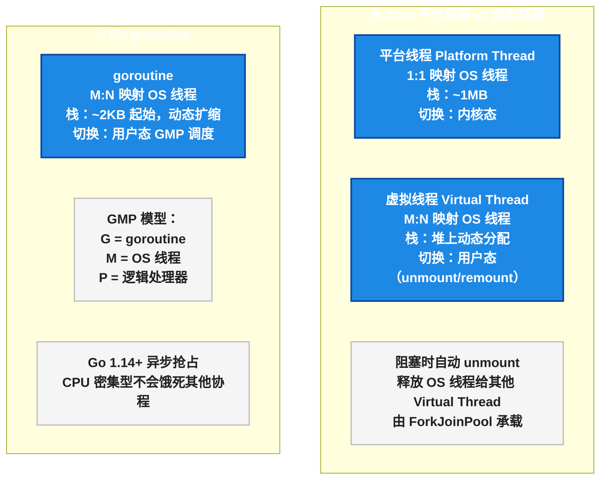
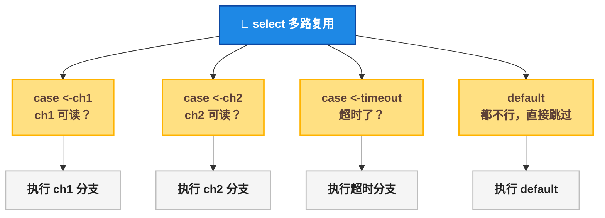
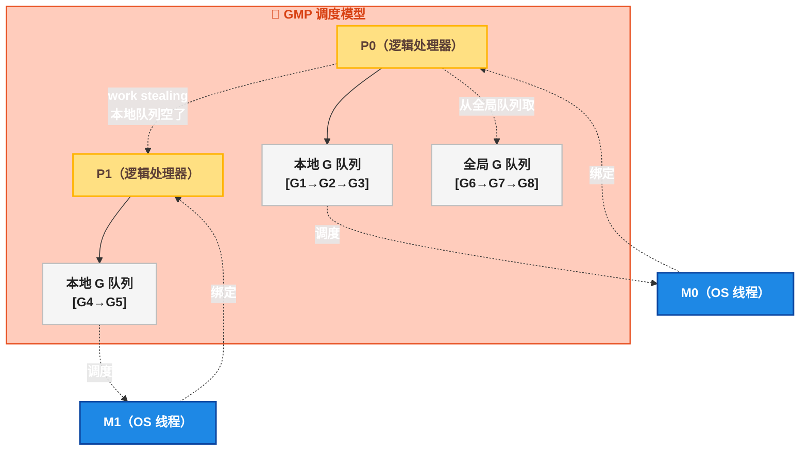

写了 5 年 Java 并发，你手上的工具大概是这样的：

```java
// Java —— 线程池 + Future + BlockingQueue
var executor = Executors.newFixedThreadPool(10);
var future = executor.submit(() -> {
    return remoteService.query();
});
try {
    var result = future.get(5, TimeUnit.SECONDS);
} catch (TimeoutException e) {
    future.cancel(true);
}
```

现在看 Go 的等价写法：

```go
// Go —— goroutine + channel + select
func queryWithTimeout() {
    ch := make(chan string, 1)
    go func() {
        ch <- remoteService.Query()
    }()
    select {
    case result := <-ch:
        fmt.Println(result)
    case <-time.After(5 * time.Second):
        fmt.Println("超时了")
    }
}
```

没有 `Executor` ，没有 `Future` ，没有 `BlockingQueue` 。 `go` 关键字一写，协程就启动了。 `chan` 一建，数据就在协程间流动。 <strong>这是 Go 语言最独特的基因</strong> 。

> 📌 前置知识：本文假定读者了解 Java 线程基础（Thread/Runnable/Executor）和基本的并发概念（竞态条件、互斥锁）。Go 版本为 1.22。

## 线程 vs 协程 vs 有栈协程：先搞清楚"轻量"是什么意思

在深入 goroutine 之前，先理清"线程""协程""有栈协程"这三个概念——它们是理解 goroutine 为什么"轻量"的基础。

<div style="max-width:700px;font-family:sans-serif;font-size:14px;line-height:1.6">

<div style="margin-bottom:24px">
<div style="background:#1E88E5;color:#FFFFFF;padding:10px 16px;font-weight:bold;font-size:16px">🐹 三种并发执行体的关系</div>
<div style="border:2px solid #1E88E5;padding:16px">

<div style="margin-bottom:16px">
<div style="background:#FFE082;color:#5D4037;padding:8px 12px;font-weight:bold;border-left:4px solid #FFB300">操作系统线程（OS Thread）</div>
<div style="padding:8px 12px;background:#F5F5F5;border:1px solid #BDBDBD;border-top:0">
<strong>调度者</strong>：操作系统内核<br/>
<strong>栈大小</strong>：固定 ~1MB（Linux 默认 8MB 虚拟空间）<br/>
<strong>切换成本</strong>：用户态 ↔ 内核态上下文切换，约 1 ~ 10μs<br/>
<strong>创建数量</strong>：几百到几千（受内存和调度开销限制）<br/>
<strong>代表</strong>：Java 的 <code>java.lang.Thread</code>，映射到 OS 线程（1:1）
</div>
</div>

<div style="margin-bottom:16px">
<div style="background:#E1BEE7;color:#4A148C;padding:8px 12px;font-weight:bold;border-left:4px solid #7B1FA2">无栈协程（Stackless Coroutine）</div>
<div style="padding:8px 12px;background:#F5F5F5;border:1px solid #BDBDBD;border-top:0">
<strong>调度者</strong>：编译器/状态机（用户态）<br/>
<strong>栈大小</strong>：无独立栈，局部变量存储在堆上的状态对象中<br/>
<strong>切换成本</strong>：函数返回+状态机跳转，约几十 ns<br/>
<strong>限制</strong>：不能在嵌套函数调用中挂起（只能平层 await）<br/>
<strong>代表</strong>：JavaScript async/await、Kotlin suspend、Rust async
</div>
</div>

<div style="margin-bottom:16px">
<div style="background:#C8E6C9;color:#1B5E20;padding:8px 12px;font-weight:bold;border-left:4px solid #388E3C">有栈协程（Stackful Coroutine）<strong>（← Goroutine 在此）</strong></div>
<div style="padding:8px 12px;background:#F5F5F5;border:1px solid #BDBDBD;border-top:0">
<strong>调度者</strong>：Go 运行时（用户态 GMP 调度器）<br/>
<strong>栈大小</strong>：初始 ~2KB，动态扩缩容（最大可达 1GB）<br/>
<strong>切换成本</strong>：用户态寄存器保存/恢复，约 200ns<br/>
<strong>创建数量</strong>：轻松几十万到百万<br/>
<strong>关键能力</strong>：可在嵌套函数调用深处挂起和恢复（有自己的栈）<br/>
<strong>代表</strong>：Go goroutine、Java Virtual Thread（Project Loom）
</div>
</div>

<div style="margin-bottom:16px">
<div style="background:#FFCCBC;color:#BF360C;padding:8px 12px;font-weight:bold;border-left:4px solid #E64A19">Java 虚拟线程（Virtual Thread，Java 21+）</div>
<div style="padding:8px 12px;background:#F5F5F5;border:1px solid #BDBDBD;border-top:0">
<strong>调度者</strong>：JVM（用户态 ForkJoinPool 调度）<br/>
<strong>栈大小</strong>：初始 ~200 字节（堆上存储，按需分配）<br/>
<strong>切换成本</strong>：用户态，约 200ns ~ 1μs<br/>
<strong>与 goroutine 本质区别</strong>：Virtual Thread 绑在 OS 线程上执行，遇到阻塞操作时才 unmount；goroutine 在 GMP 模型中由 Go 运行时主动抢占调度
</div>
</div>

</div>
</div>

</div>

关键结论：<strong>goroutine 和 Java 21 的 Virtual Thread 本质上都是"有栈协程"——M:N 调度（M 个协程映射到 N 个 OS 线程），用户态切换，初始内存极小</strong> 。但它们的调度模型有本质区别：



## Goroutine 快速入门： `go` 关键字就够了

Go 启动协程只需要在函数调用前加 `go` ：

```go
// Go —— 启动 10000 个 goroutine
for i := 0; i < 10000; i++ {
    go func(n int) {
        time.Sleep(1 * time.Second)
        fmt.Println(n)
    }(i)
}
```

对比 Java 创建 10000 个线程——如果不加线程池，直接 `new Thread()` 会导致内存爆炸（每个线程 1MB 栈，10000 个 = 10GB）。即使用线程池，最多也就几百个线程并行。

10000 个 goroutine 占多少内存？初始每个 2KB 栈 × 10000 = 约 20MB。 <strong>这还是极端情况，正常情况下 goroutine 用完就回收了</strong> 。

```java
// Java —— 创建大量线程 ≈ 自爆
// 10000 个线程 × 1MB 栈 = 约 10GB 内存
// 只能用线程池限制：
var executor = Executors.newFixedThreadPool(100);
for (int i = 0; i < 10000; i++) {
    final int n = i;
    executor.submit(() -> {
        Thread.sleep(1000);
        System.out.println(n);
        return null;
    });
}
```

> ⚠️ 新手提示： `go func(n int) { ... }(i)` 里的 `(i)` 是把 `i` 作为参数传给匿名函数。如果直接引用外层的 `i` （闭包），所有 goroutine 看到的可能是同一个值（Go 1.22 之前循环变量共享地址的经典坑，1.22 已修复）。

## Channel：goroutine 之间的"管道"

Java 里线程间通信靠共享变量 + 锁，或者 `BlockingQueue` 。Go 靠 channel。

```go
// Go —— 创建和使用 channel
ch := make(chan int)      // 无缓冲 channel（同步）
ch := make(chan int, 10)  // 有缓冲 channel（缓冲 10 个）

// 发送
ch <- 42

// 接收
value := <-ch

// 关闭（发送方关闭，接收方可以检测到关闭）
close(ch)
```

### 无缓冲 vs 有缓冲

<div style="max-width:700px">
<div style="display:flex;gap:16px">
<div style="flex:1;border:2px solid #E64A19;border-radius:8px;overflow:hidden">
<div style="background:#E64A19;color:#FFFFFF;padding:8px 12px;font-weight:bold">无缓冲（同步）</div>
<div style="padding:12px;background:#FFF3E0">
<code>ch := make(chan int)</code><br/><br/>
<strong>发送方</strong> 阻塞直到 <strong>接收方</strong> 就绪<br/>
<strong>接收方</strong> 阻塞直到 <strong>发送方</strong> 发送<br/><br/>
<span style="color:#388E3C">✅ 保证同步，不需要额外通知</span>
</div>
</div>
<div style="flex:1;border:2px solid #388E3C;border-radius:8px;overflow:hidden">
<div style="background:#388E3C;color:#FFFFFF;padding:8px 12px;font-weight:bold">有缓冲（异步）</div>
<div style="padding:12px;background:#E8F5E9">
<code>ch := make(chan int, 10)</code><br/><br/>
<strong>发送方</strong> 缓冲未满时不阻塞<br/>
<strong>接收方</strong> 缓冲为空时阻塞<br/><br/>
<span style="color:#E64A19">⚠️ 类似 Java BlockingQueue（10）= LinkedBlockingQueue（10）</span>
</div>
</div>
</div>
</div>

### 常见 Channel 模式

**模式 1：Worker Pool（工作池）**

```go
func workerPool() {
    jobs := make(chan int, 100)
    results := make(chan int, 100)

    // 启动 3 个 worker goroutine
    for w := 0; w < 3; w++ {
        go func(id int) {
            for job := range jobs { // range 会一直读直到 channel 关闭
                results <- job * 2
            }
        }(w)
    }

    // 发送 5 个任务
    for j := 0; j < 5; j++ {
        jobs <- j
    }
    close(jobs) // 关闭 jobs，workers 的 range 循环退出

    // 收集结果
    for i := 0; i < 5; i++ {
        <-results
    }
}
```

对比 Java 的 `ExecutorService` + `CompletionService` 写法——同样的逻辑，Go 只需要 channel 和 `go` 关键字。

**模式 2：Fan-Out / Fan-In（扇出/扇入）**

```go
func fanOutFanIn() {
    input := make(chan int)
    
    // Fan-Out：一个输入 → 多个 worker
    outputs := make([]chan int, 3)
    for i := 0; i < 3; i++ {
        outputs[i] = make(chan int)
        go func(id int, out chan int) {
            for v := range input {
                out <- v * v
            }
            close(out)
        }(i, outputs[i])
    }
    
    // Fan-In：多个 worker 输出 → 一个结果 channel
    result := merge(outputs...)
    // merge 函数启动 goroutine 把多个 channel 汇总到一个
}
```

## Select：多路复用，Go 的"epoll 语法糖"

`select` 是 Go 并发最精妙的设计之一——<strong>同时监听多个 channel，哪个先就绪就执行哪个</strong>：

```go
select {
case msg1 := <-ch1:
    fmt.Println("ch1 就绪:", msg1)
case msg2 := <-ch2:
    fmt.Println("ch2 就绪:", msg2)
case <-time.After(3 * time.Second):
    fmt.Println("超时 3 秒")
default:
    fmt.Println("都没就绪，不阻塞")
}
```

Java 里实现同等功能需要用 `CompletableFuture.anyOf()` 或者轮询 `BlockingQueue.poll(timeout)` ：

```java
// Java —— 多路复用 ≈ CompletableFuture.anyOf
var f1 = CompletableFuture.supplyAsync(() -> service1.query());
var f2 = CompletableFuture.supplyAsync(() -> service2.query());
var result = CompletableFuture.anyOf(f1, f2)
        .get(3, TimeUnit.SECONDS);
```

`select` 的几个关键细节：

-  分支</strong>：如果所有 case 都没就绪，不阻塞，直接走 default
-  超时</strong>：最常用的超时控制模式
- <strong>随机公平</strong>：多个 case 同时就绪时随机选一个，防止某个 case 被饿死



## GMP 调度器：goroutine 为什么能跑百万并发

goroutine 的调度由 Go 运行时的 <strong>GMP 模型</strong> 负责：

| 组件 | 全称 | 含义 |
|------|------|------|
| <strong>G</strong> | Goroutine | 一个 goroutine，包含栈、指令指针、状态 |
| <strong>M</strong> | Machine | 一个 OS 线程，goroutine 运行在 M 之上 |
| <strong>P</strong> | Processor | 逻辑处理器，持有 G 的本地运行队列，数量由 `GOMAXPROCS` 决定 |



核心机制：

- <strong>GOMAXPROCS</strong> ：决定 P 的数量，默认等于 CPU 核心数。一个 P 同一时刻只能运行一个 G（在一个 M 上）
- <strong>Work Stealing</strong>：一个 P 的本地队列空了，会从其他 P 的队列"偷"一半的 G 过来
- <strong>抢占调度</strong>（Go 1.14+）：goroutine 运行超过 10ms 会被强制抢占，确保 CPU 密集型任务不会饿死其他协程
- <strong>阻塞处理</strong>：G 进行系统调用（如读文件）导致 M 阻塞时，P 会 <strong>换一个 M</strong> 继续调度其他 G。旧的 M 等系统调用返回后再把 G 放回队列

> ⚠️ 新手提示： `GOMAXPROCS` 不是越大越好。设置成 CPU 核数即可——过多的 P 会导致更多的上下文切换，反而降低吞吐。

## CSP 模型 vs Java 并发工具的对应关系

<strong>CSP（Communicating Sequential Processes，通信顺序进程）</strong> 是 Go 并发的理论基础。核心思想：<strong>不要通过共享内存来通信，而要通过通信来共享内存</strong> 。

| Go CSP 概念 | Java 对应 | 关键差异 |
|-------------|----------|----------|
| `go func()` | `new Thread(runnable).start()` / `executor.submit()` | goroutine 比线程轻量 1000 倍 |
| `chan` （无缓冲） | `SynchronousQueue` | 语法层面支持，不需要 `import java.util.concurrent` |
| `chan` （有缓冲） | `LinkedBlockingQueue` / `ArrayBlockingQueue` | Go 的 chan 可以关闭，接收方可以检测关闭 |
| `select` | `CompletableFuture.anyOf()` + `poll(timeout)` | Go 的 select 是语言内置，不需要嵌套回调 |
| `close(chan)` | 无直接对应 | Go 中关闭 channel 是广播信号，通知所有接收方 |
| `sync.Mutex` | `synchronized` / `ReentrantLock` | Go 中锁是最后的备选方案，优先 channel |
| `sync.WaitGroup` | `CountDownLatch` | 语义完全一致 |
| `context.Context` | 无直接对应 | Go 中传递取消信号、超时、截止时间的标准方式 |

几个值得注意的差异：

**1. Channel 可以关闭，BlockingQueue 不能**

```go
ch := make(chan int, 3)
ch <- 1
ch <- 2
close(ch) // 关闭后不能再发送，但可以继续接收
for v := range ch {
    fmt.Println(v) // 1, 2 —— 接收完所有缓冲数据后 range 自动退出
}
```

Java 的 `BlockingQueue` 没有"关闭"的概念——要通知消费者"没了"，需要额外发一个 poison pill（毒丸）信号。

<strong>2.</strong> `sync.Mutex` 更像 `synchronized` 而非 `ReentrantLock`

Go 的 `sync.Mutex` <strong>不可重入</strong>！同一个 goroutine 不能多次 Lock 同一个 Mutex，会导致死锁。这和 Java 的 `ReentrantLock` 不一样。Go 的设计理念是：如果你需要重入锁，说明你的设计有问题。

**3. `context.Context` 是 Go 独有的并发控制原语**

```go
func queryWithContext(ctx context.Context, url string) error {
    req, _ := http.NewRequestWithContext(ctx, "GET", url, nil)
    resp, err := http.DefaultClient.Do(req)
    // 如果 ctx 被取消或超时，请求会自动中断
    return err
}

ctx, cancel := context.WithTimeout(context.Background(), 5*time.Second)
defer cancel()
queryWithContext(ctx, "https://example.com")
```

`Context` 传递取消信号、超时、截止时间——沿着调用链向下传播。Java 里实现类似功能需要 `Future.cancel()` + `Thread.interrupt()` ，但这两个机制都不保证一定能中断任务。Go 的 Context 是 <strong>协作式的</strong>——被调用方需要主动检查 `ctx.Done()` ，但调用方可以确定地发出取消信号。

## Java Virtual Thread vs Goroutine：深度对比

Java 21 的 Virtual Thread（虚拟线程）和 goroutine 在"轻量级用户态线程"这个概念上非常接近，但实现路径完全不同：

| 维度 | Java Virtual Thread（Java 21） | Go Goroutine |
|------|------|-----|
| 引入时间 | 2023 年（Java 21，正式 GA） | 2009 年（Go 1.0 就内置） |
| 栈管理 | 堆上分配，按需扩展，初始约 200 字节 | 初始 2KB，动态扩缩 |
| 调度模型 | M:N，由 ForkJoinPool 承载 | M:N，GMP 调度器，有 Work Stealing |
| 阻塞处理 | 自动 unmount OS 线程，释放给其他 VT | G 阻塞时 P 换 M 继续工作 |
| 抢占 | 协作式（synchronized/monitor 持有时不释放） | 异步抢占（Go 1.14+，10ms 时间片） |
| API 改动 | 几乎不需要改动—— `new Thread()` → `Thread.startVirtualThread()` | 语言内置 `go` 关键字 |
| 生态成熟度 | 较新，很多库还在适配（synchronized pinning 问题） | 15 年生态，完全成熟 |

最大的差异在于 <strong>抢占时机</strong> 。Java Virtual Thread 在遇到 `synchronized` 块或 JNI 调用时 <strong>不能 unmount</strong>，会导致 OS 线程被 pin（固定）。Go 的 goroutine 在 Go 1.14 之后有了异步抢占，即使是在 CPU 密集型循环中也能被调度器中断。

```go
// Go —— 这个死循环不会占着 OS 线程不放
go func() {
    for {
        // 1.14+ 后会被 GMP 调度器强制抢占
        calculatePi() // CPU 密集型
    }
}()
```

```java
// Java —— Virtual Thread 在 CPU 密集型循环中可能不释放 OS 线程
Thread.startVirtualThread(() -> {
    while (true) {
        calculatePi(); // synchronized 内会 pin 住 OS 线程
    }
});
```

## 总结

从 Java 线程池到 Go 的 goroutine，核心转变不是语法，而是 <strong>思维模型</strong>：

- Java 的世界观：线程是稀缺资源，线程池控制并发数， `BlockingQueue` 传递数据， `Future` 等待结果
- Go 的世界观：goroutine 便宜得像不要钱，channel 传递数据顺便同步，select 多路复用轻松超时控制

| 场景 | Java 方案 | Go 方案 |
|------|----------|---------|
| 启动并发任务 | `executor.submit(task)` | `go task()` |
| 等待结果 | `future.get(timeout)` | `<-ch` + `time.After` |
| 多路复用 | `CompletableFuture.anyOf` | `select` |
| 超时控制 | `future.get(timeout)` | `select { case <-ch: case <-time.After: }` |
| 取消任务 | `future.cancel(true)` （不保证） | `context.CancelFunc()` （协作式） |
| 线程/协程同步 | `CountDownLatch` | `sync.WaitGroup` |
| 互斥锁 | `synchronized` / `ReentrantLock` | `sync.Mutex` （不可重入！） |
| 生产者-消费者 | `BlockingQueue` | `chan` （可关闭，range 遍历） |

一句话：<strong>Java 并发靠 `java.util.concurrent` 包，Go 并发靠语言关键字（go/chan/select）</strong> 。前者是库的胜利，后者是语言设计的胜利。

> 📖 <strong>下一步阅读</strong>：goroutine 跑起来了，但真正的挑战是网络——[Go 网络编程与 IO 模型]()。net/http 怎么比 Netty 还快？netpoll 到底是什么？Go 的 IO 多路复用和 Java NIO 有什么本质区别？下一篇讲清楚。

---

<details><summary>参考资源</summary>

- Go 并发官方文档: [Concurrency - A Tour of Go](https://go.dev/tour/concurrency/1)
- GMP 调度器源码: [Go Runtime Scheduler](https://go.dev/src/runtime/proc.go)
- Go 1.14 抢占调度: [Go 1.14 Release Notes - Preemptive scheduler](https://go.dev/doc/go1.14#runtime)
- JEP 444 Virtual Threads: [Virtual Threads](https://openjdk.org/jeps/444)
- Go Memory Model: [The Go Memory Model](https://go.dev/ref/mem)

</details>
