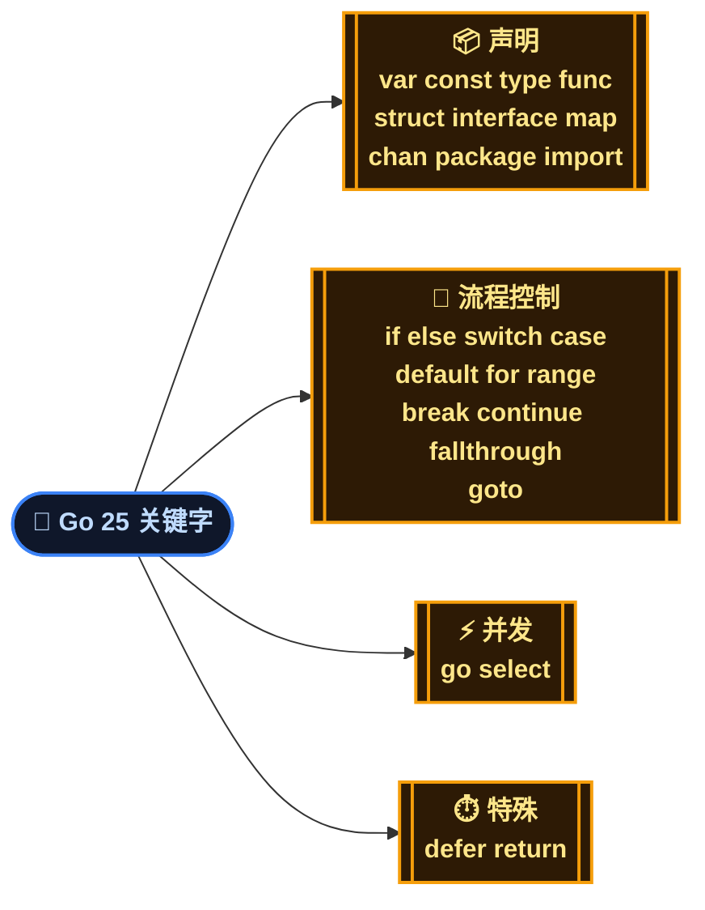
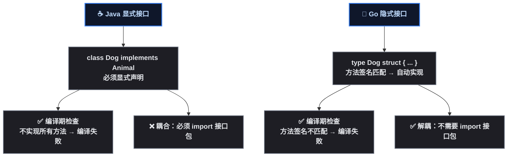
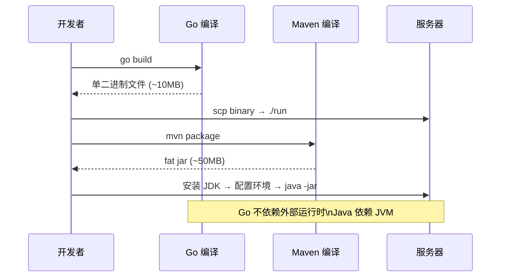

# Go 是怎么来的？

第一次打开 `.go` 文件的 Java 程序员，通常会愣住。

```go
type Handler struct {
    db *sql.DB
}

func (h *Handler) ServeHTTP(w http.ResponseWriter, r *http.Request) {
    users, err := h.queryUsers(r.Context())
    if err != nil {
        http.Error(w, err.Error(), http.StatusInternalServerError)
        return
    }
    json.NewEncoder(w).Encode(users)
}
```

脑子里弹出一串问题：<strong>class 在哪？构造函数在哪？try-catch 在哪？implements 在哪？为什么 err 是个返回值？</strong>

这很正常。写了 5 年 Spring Boot，习惯了 `@Autowired` 、 `@Transactional` 、 `try-catch-finally` 之后，Go 看起来像删掉了 90% 语法的 Java。但这不是残缺，是刻意的——Go 的设计哲学就是 <strong>少即是多</strong> 。

## 诞生：三个大佬对 C++ 的"不满"

2007 年，Google 的三个工程师——<strong>Robert Griesemer</strong>（Google V8 引擎参与者）、 <strong>Rob Pike</strong>（Unix 元老，Plan 9 作者）、 <strong>Ken Thompson</strong>（Unix 之父，B 语言/C 语言设计者）——在等 C++ 编译的时候，决定搞点事情。

那时候 Google 的核心基础设施用 C++ 写的，编译一个服务动辄几十分钟。C++ 语言本身不断膨胀（C++11 标准文档 1300+ 页），依赖管理靠头文件复制，并发编程到处是互斥锁和条件变量的坑。

这三位的目标很明确：

- <strong>编译要快</strong>——不能比泡杯咖啡的时间还长
- <strong>并发要简单</strong>——不能每次都和互斥锁死磕
- <strong>依赖要清爽</strong>——不能靠 `#include` 到处复制头文件
- <strong>语法要克制</strong>——不能什么都往里加

2009 年 11 月 10 日，Go 正式开源。2012 年发布 Go 1.0，承诺 <strong>向后兼容</strong>——至今依然坚守。

> 📌 前置知识：Go 1.x 的兼容承诺意味着用 Go 1.0 写的代码，在 Go 1.22 下依然可以编译运行。这对企业项目来说是巨大的安心——不像某些语言，大版本升级等于重写。

## 设计哲学：三个"反直觉"的核心原则

### 1. 少即是多（Less is More）

Go 1.22 只有 <strong>25 个关键字</strong> 。对比一下：Java 17 有 51 个关键字，C++ 有 95 个。



关键字少意味着 <strong>做同一件事的方式通常只有一种</strong> 。Java 里格式化字符串至少有 `+` 、 `StringBuilder` 、 `String.format` 、 `MessageFormat` 四种方式——Go 里基本就是 `fmt.Sprintf` 。不是 Go 简陋，而是"够用就好"。

### 2. 组合优于继承（Composition over Inheritance）

Go 没有 `class` ，没有 `extends` ，没有 `implements` 。这对于 Java 程序员来说几乎是世界观的冲击。

```go
// Go 的结构体嵌入 = Java 的组合，但更简洁
type Reader struct {
    buf []byte
}

func (r *Reader) Read(p []byte) (n int, err error) {
    // 实现读取逻辑
    return
}

type Writer struct {
    buf []byte
}

func (w *Writer) Write(p []byte) (n int, err error) {
    // 实现写入逻辑
    return
}

// ReadWriter "继承"了 Reader 和 Writer 的方法
type ReadWriter struct {
    *Reader   // 嵌入指针
    *Writer   // 嵌入指针
}

// ReadWriter 自动拥有了 Read() 和 Write() 方法
// 不需要写任何转发代码
```

这段代码展示了 Go 的 <strong>结构体嵌入（struct embedding）</strong> ——ReadWriter 嵌入了 Reader 和 Writer 的指针，就自动"继承"了它们的所有方法。这比 Java 的继承和委托模式轻量得多：

| 方式 | Java | Go |
|------|------|-----|
| 复用父类行为 | `class Dog extends Animal` | `type Dog struct { Animal }` |
| 复用接口契约 | `class A implements B, C` | 隐式实现，无需声明 |
| 委托 | 手写 `b.foo()` 转发方法 | 嵌入字段自动代理 |
| 多继承 | 不允许（接口除外） | 嵌入多个 struct 即可 |
| 运行时代理 | 动态代理 `Proxy.newProxyInstance` | embed 编译期确定 |

> ⚠️ 新手提示：嵌入不是继承。 `ReadWriter` 不能当作 `Reader` 传给需要 `Reader` 的函数——除非函数接受的是接口类型。这正是下一节要讲的隐式接口。

### 3. 隐式接口（Implicit Interface）——鸭子类型的静态实现

Java 的接口是 <strong>显式声明</strong> 的： `class UserService implements IUserService` 。编译器检查你是否实现了所有方法。

Go 的接口是 <strong>隐式满足</strong> 的：只要你的类型有接口里定义的那些方法，你就自动实现了这个接口。不需要写 `implements` ，甚至不需要 import 接口所在的包。

```go
// 定义一个接口
type Reader interface {
    Read(p []byte) (n int, err error)
}

// 任何有 Read 方法的类型都自动实现了 Reader
type MyBuffer struct {
    data []byte
}

func (b *MyBuffer) Read(p []byte) (n int, err error) {
    n = copy(p, b.data)
    return n, nil
}

// 可以直接把 *MyBuffer 传给接受 Reader 的函数
func process(r Reader) {
    buf := make([]byte, 1024)
    r.Read(buf)
}

// 完全不需要 type MyBuffer implements Reader
```



这个设计的妙处：<strong>生产者不依赖接口，消费者定义接口</strong> 。一个包里的类型不需要知道外部定义了哪些接口，只要方法签名碰巧匹配，就能在任何地方被使用。这跟 Java 的依赖反转（DIP, Dependency Inversion Principle，依赖倒置原则）完全是两种思路——Go 把"接口属于谁"这个问题的答案从"属于生产者"变成了"属于消费者"。

## Go 1.22 关键特性

写这个系列时 Go 最新稳定版是 <strong>Go 1.22</strong>（2024 年 2 月发布）。几个重要的变化：

| 特性 | 说明 |
|------|------|
| `for` 循环变量语义修复 | 循环变量不再共享同一内存地址——历史上坑了最多新手的 bug 终于修复 |
| `range int` | `for i := range 10` 直接遍历 0 ~ 9，不需要手写三段式 for |
| 增强路由模式 | `net/http` 标准库支持 `GET /user/{id}` 这种 RESTful 路由，不再必须用第三方路由器 |
| `math/rand/v2` | 随机数 API 重写，更好的性能，更合理的命名 |
| `go vet` 增强 | 更多静态分析检查 |
| 实验性: `range func` | 函数迭代器（需 `GOEXPERIMENT=rangefunc` ） |

> 📌 前置知识：Go 每 6 个月发布一个大版本（2 月和 8 月）。每个版本都向后兼容 Go 1.0。Go 1.22 已于 2024 年 2 月发布。

## 与 Java 世界观的根本差异

用一张表快速对比两种语言的哲学差异：

| 维度 | Java | Go |
|------|------|-----|
| 核心理念 | 面向对象、继承、多态 | 简洁、组合、并发 |
| 关键字数量 | ~51 | 25 |
| 类型层次 | class + interface + abstract | struct + interface |
| 继承 | `extends` 单继承 + 接口多实现 | 无继承，struct 嵌入 |
| 接口 | 显式 `implements` | 隐式满足（鸭子类型） |
| 异常 | `try-catch-finally` + checked exception | 返回值 `error` ， `defer` + `recover` |
| 泛型 | 2004 年 Java 5 引入 | 2022 年 Go 1.18 引入 |
| 注解 | `@Annotation` 运行时反射 | 结构体 tag（ `json:"name"` ）编译期处理 |
| 依赖注入 | 框架（Spring DI） | 手动构造 + 接口 |
| 访问控制 | `public/private/protected` | 首字母大小写 |
| 并发模型 | 线程 + 锁 + Executor 框架 | goroutine + channel + select |
| 编译产物 | `.class` → JVM 字节码 | 静态二进制（无运行时依赖） |
| 运行时 | JVM（JIT、GC、类加载） | 编译进二进制的轻量运行时 |
| 包管理 | Maven/Gradle + 中央仓库 | Go Modules（ `go mod` ） |

最核心的区别可以用一句话概括：<strong>Java 用"显式"换取安全，Go 用"隐式"换取简洁</strong> 。

## Go 的运行时 vs JVM：一个前置概览

部署一个 Spring Boot 应用，需要在服务器上装 JDK，配置 `JAVA_HOME` ，上传 50MB 的 fat jar，然后等 JVM 预热——JIT（Just-In-Time Compilation，即时编译）把热点代码编译成本地指令，类加载器按需加载几千个类。

部署一个 Go 服务，只需要一个二进制文件。 `go build` 把代码和运行时（GC、调度器）全部编译进去，复制到服务器直接运行，不依赖任何外部环境。启动速度是毫秒级，不是秒级。



具体的运行时对比（GC 算法、反射机制、内存布局）会在本系列第 6 篇详细展开。

## CSP 并发：Go 最独特的基因

Java 并发模型的演进路径： `synchronized` → `Lock` + `Condition` → `Executor` 框架 → `CompletableFuture` → 虚拟线程（Virtual Thread, Java 21）。

Go 完全不同。Go 从第一天起就内置了 <strong>CSP（Communicating Sequential Processes，通信顺序进程）</strong> 模型，核心是两个概念：

- <strong>goroutine</strong>：轻量级协程，一个 Go 程序可以轻松跑几十万个 goroutine
- <strong>channel</strong>：goroutine 之间的通信管道

```go
func main() {
    ch := make(chan string)
    
    // 启动一个 goroutine
    go func() {
        time.Sleep(1 * time.Second)
        ch <- "任务完成"  // 通过 channel 发送结果
    }()
    
    // 主 goroutine 等待接收
    result := <-ch
    fmt.Println(result)
}
```

> <strong>不要通过共享内存来通信，而要通过通信来共享内存。</strong>

这是 Go 的官方格言。在 Java 里，多个线程访问共享变量，加锁保护；Go 里，把数据通过 channel 发给另一个 goroutine，谁持有数据谁就有权操作。这在第 3 篇并发编程里会详细展开，包括和 Java 虚拟线程的对比。

## 总结

Go 不是"更好的 Java"，它是 <strong>另一种编程世界观</strong>：

- 25 个关键字替代 51 个——"做一件事只有一种方法"
- 隐式接口替代显式声明——"消费者拥有接口"
- 组合嵌入替代继承层次——"扁平优于纵深"
- goroutine + channel 替代线程池 + 锁——"通信优于共享"
- 单二进制部署替代 JVM 运行时——"编译完就能跑"

> 📖 <strong>下一步阅读</strong>：理解了"为什么 Go 没有 class"，下一篇直接上手写代码——[Java vs Go 语法快速对比]()。变量怎么声明、函数怎么定义、error 怎么处理、循环怎么写、struct 怎么替代 class——全是代码对比例子，看完就能写 Go。

---

<details><summary>参考资源</summary>

- Go 官方博客: [Frequently Asked Questions](https://go.dev/doc/faq)
- Go 1.22 发布说明: [Go 1.22 Release Notes](https://go.dev/doc/go1.22)
- Rob Pike 演讲: [Concurrency is not Parallelism](https://go.dev/blog/waza-talk)
- Go 语言规范: [The Go Programming Language Specification](https://go.dev/ref/spec)
- Go Modules 参考: [Go Modules Reference](https://go.dev/ref/mod)

</details>
