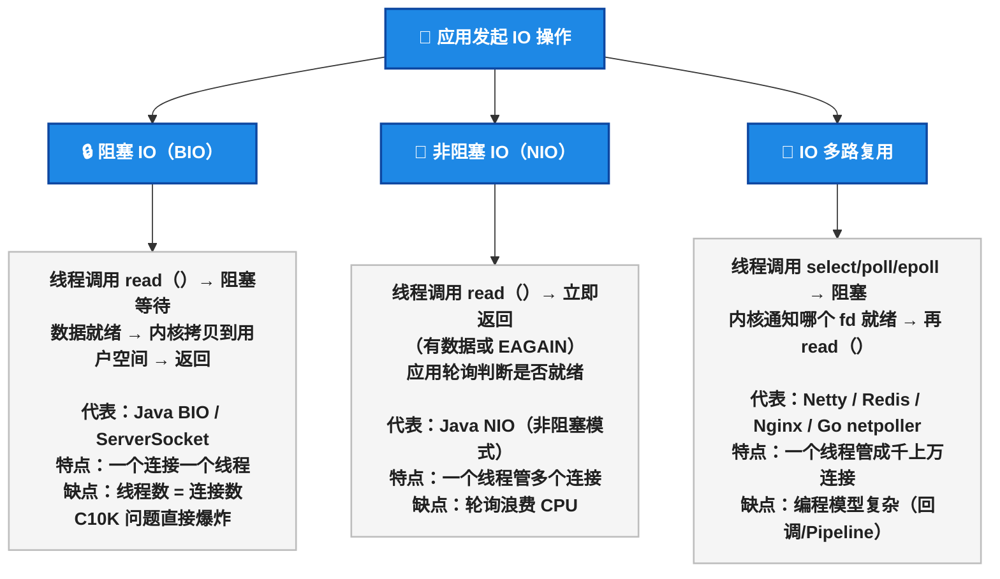
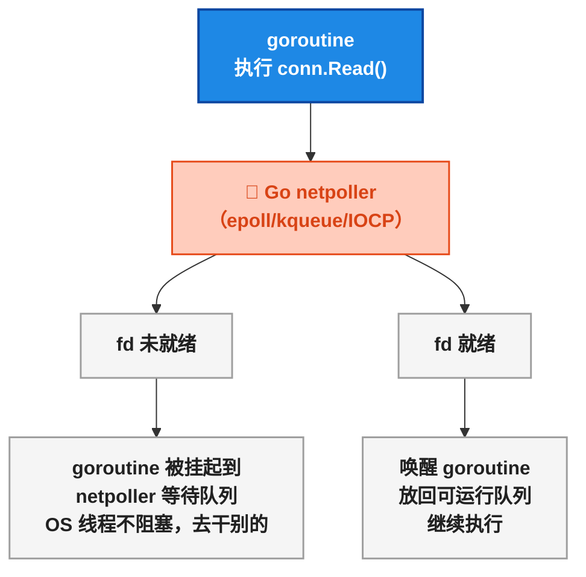
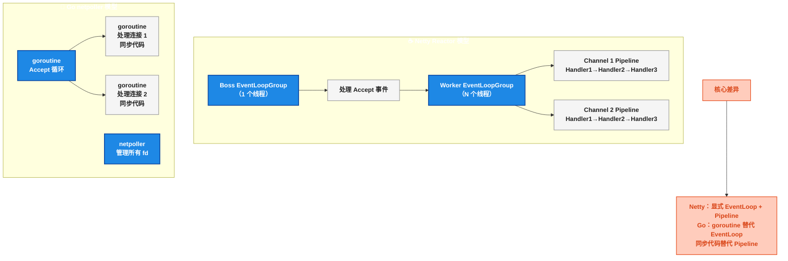

# Go 网络编程

Java 程序员写网络服务，技术栈大概是这样的：

```java
// Java —— Netty 写一个 HTTP 服务
EventLoopGroup bossGroup = new NioEventLoopGroup(1);
EventLoopGroup workerGroup = new NioEventLoopGroup();
try {
    ServerBootstrap b = new ServerBootstrap();
    b.group(bossGroup, workerGroup)
     .channel(NioServerSocketChannel.class)
     .childHandler(new ChannelInitializer<SocketChannel>() {
         @Override
         protected void initChannel(SocketChannel ch) {
             ch.pipeline()
               .addLast(new HttpServerCodec())
               .addLast(new HttpObjectAggregator(65536))
               .addLast(new SimpleChannelInboundHandler<FullHttpRequest>() {
                   @Override
                   protected void channelRead0(ChannelHandlerContext ctx, FullHttpRequest req) {
                       // 业务逻辑...
                   }
               });
         }
     });
    b.bind(8080).sync().channel().closeFuture().sync();
} finally {
    bossGroup.shutdownGracefully();
    workerGroup.shutdownGracefully();
}
```

配置 EventLoopGroup、Channel Pipeline、Codec、Handler……对于一个简单的 HTTP 服务，一半代码在处理 Netty 的样板。

现在看 Go：

```go
// Go —— net/http 写一个 HTTP 服务
package main

import (
    "encoding/json"
    "net/http"
)

func handler(w http.ResponseWriter, r *http.Request) {
    json.NewEncoder(w).Encode(map[string]string{"status": "ok"})
}

func main() {
    http.HandleFunc("/api", handler)
    http.ListenAndServe(":8080", nil)
}
```

没有 EventLoopGroup，没有 Pipeline，没有 Channel。 `http.HandleFunc` + `http.ListenAndServe` 就完事了。背后 Go 做了多少事？这就是本文要讲的内容。

> 📌 前置知识：本文假定读者了解 Java NIO 的基本概念（Channel/Buffer/Selector）或 Netty 的使用经验。Go 版本为 1.22。

## 三种 IO 模型：必须搞清楚的基础

在理解 Go 的 netpoller 之前，先厘清三种 IO 模型——这是所有高性能网络框架的底层基础。



| 维度 | 阻塞 IO（BIO） | 非阻塞 IO（NIO） | IO 多路复用 |
|------|:---:|:---:|:---:|
| 线程模型 | 一个线程一个连接 | 一个线程轮询多个连接 | 一个线程由内核通知就绪 |
| 连接数 | 几百 | 几千（轮询开销大） | 几十万 |
| CPU 消耗 | 低（阻塞时不消耗） | 高（忙轮询） | 低（事件驱动） |
| 编程复杂度 | 低 | 中 | 高 |
| Java 代表 | `ServerSocket` （BIO） | `SocketChannel` （非阻塞模式） | Netty / `Selector` |
| Go 代表 | — | — | netpoller（封装成同步写法） |

<strong>IO 多路复用的本质</strong>：操作系统内核帮你盯着一堆连接，哪个有数据了就通知你。你不用自己轮询。Linux 的 epoll、macOS 的 kqueue、Windows 的 IOCP 都是这个机制。

## Go 的秘密武器：netpoller

Go 没有像 Netty 那样让开发者显式使用 epoll/kqueue。Go 在运行时层面集成了一个 <strong>netpoller（网络轮询器）</strong>，把所有网络 IO 都通过 IO 多路复用管理起来。



关键流程：

1. goroutine 调用 `conn.Read()`
2. Go 运行时执行系统调用，如果 fd 没有数据（返回 EAGAIN），把该 goroutine <strong>挂起到 netpoller</strong>
3. 当前 OS 线程 <strong>不被阻塞</strong> ，继续调度其他 goroutine
4. netpoller 在后台监听 epoll/kqueue 事件
5. 当 fd 就绪，netpoller 把对应的 goroutine<strong>唤醒</strong>，放回可运行队列
6. goroutine 从 `conn.Read()` 返回，就像什么都没发生过一样

> 从 goroutine 视角看， `conn.Read()` 就是一个普通的阻塞调用——但底层却是异步 IO 多路复用。这就是 Go 的"同步编程、异步执行"。

### 对比 Netty 的 Reactor 模型



Netty 的 Reactor 模式用有限的 EventLoop 线程 + Pipeline 处理海量连接；Go 用 <strong>每个连接一个 goroutine + netpoller 管理所有 fd</strong> 。goroutine 便宜到可以每个连接分配一个，代码写成同步的，底层是异步的。

## net/http 标准库：开箱即用的高性能 HTTP

Go 标准库自带的 `net/http` 已经可以应对绝大多数场景。几个核心组件：

### Server：一个生产级 HTTP 服务器

```go
srv := &http.Server{
    Addr:         ":8080",
    Handler:      mux,
    ReadTimeout:  5 * time.Second,
    WriteTimeout: 10 * time.Second,
    IdleTimeout:  120 * time.Second,
}
srv.ListenAndServe()
```

`ReadTimeout` 、 `WriteTimeout` 、 `IdleTimeout` 三个超时一定要设置——否则慢客户端会一直占用连接（Slowloris 攻击）。

### ServeMux：Go 1.22 的路由升级

Go 1.22 之前， `http.ServeMux` 只支持简单的路径匹配。1.22 终于支持了 <strong>RESTful 路由</strong>：

```go
// Go 1.22 —— 原生 RESTful 路由
mux := http.NewServeMux()
mux.HandleFunc("GET /users/{id}", getUser)
mux.HandleFunc("POST /users", createUser)
mux.HandleFunc("DELETE /users/{id}", deleteUser)

// 之前的写法（Go 1.21 及更早）
mux.HandleFunc("/users/", usersHandler) // 只能前缀匹配，自己解析路径参数
```

> ⚠️ 新手提示：Go 1.22 的 `{id}` 路由变量通过 `r.PathValue("id")` 获取。和 Spring MVC 的 `@PathVariable("id")` 类似，但不需要注解。

### Handler 接口：Go 的"Controller"

```go
// Handler 接口 —— 整个 net/http 的基石
type Handler interface {
    ServeHTTP(ResponseWriter, *Request)
}

// 实现一个 Handler
type UserHandler struct {
    service *UserService
}

func (h *UserHandler) ServeHTTP(w http.ResponseWriter, r *http.Request) {
    user, err := h.service.GetUser(r.PathValue("id"))
    if err != nil {
        http.Error(w, err.Error(), http.StatusInternalServerError)
        return
    }
    json.NewEncoder(w).Encode(user)
}
```

对比 Java Servlet 的 `doGet/doPost` + `HttpServletRequest/HttpServletResponse` ——Go 的 Handler 接口简单得多，没有 Servlet 容器那一层抽象。

### Middleware：中间件模式

Go 没有 Servlet Filter 的概念，中间件就是一个包装 Handler 的函数：

```go
// 中间件：记录请求日志
func loggingMiddleware(next http.Handler) http.Handler {
    return http.HandlerFunc(func(w http.ResponseWriter, r *http.Request) {
        start := time.Now()
        next.ServeHTTP(w, r)
        log.Printf("%s %s %v", r.Method, r.URL.Path, time.Since(start))
    })
}

// 中间件：认证检查
func authMiddleware(next http.Handler) http.Handler {
    return http.HandlerFunc(func(w http.ResponseWriter, r *http.Request) {
        token := r.Header.Get("Authorization")
        if token == "" {
            http.Error(w, "unauthorized", http.StatusUnauthorized)
            return
        }
        next.ServeHTTP(w, r)
    })
}

// 链式包装
handler := loggingMiddleware(authMiddleware(mux))
```

Java Servlet Filter 通过 `doFilter(ServletRequest, ServletResponse, FilterChain)` 的 `chain.doFilter()` 传递——Go 的中间件模式本质上是一层函数包装，不依赖任何框架。两种方式都能实现相同的效果，Go 的版本更简洁，不需要实现特定接口。

## Go net/http vs Java 网络框架对比

| 维度 | Go net/http | Java Servlet | Java Netty |
|------|:---:|:---:|:---:|
| 定位 | 标准库 | Jakarta EE 规范 | 第三方网络框架 |
| IO 模型 | netpoller 自动管理 | Servlet 容器封装 | Reactor + Pipeline |
| 编程模型 | 同步代码 + goroutine | 同步代码 + 线程池 | 异步回调 + EventLoop |
| 每连接资源 | 1 个 goroutine（~2KB 栈） | 1 个线程（~1MB 栈） | 1 个 Channel + Pipeline |
| 依赖 | 无（标准库） | Servlet 容器（Tomcat/Jetty） | Netty + 编解码器 |
| 路由 | Go 1.22 支持 RESTful | `@RequestMapping` / `@GetMapping` | 需要额外路由库 |
| 中间件 | Handler 函数包装 | Filter 接口 | `ChannelHandler` |
| HTTP/2 | 标准库支持（ `h2c` ） | Servlet 容器支持 | 需要额外 Codec |
| 适用场景 | 绝大多数 HTTP 服务 | Spring Boot Web | 高性能网关/代理 |

几个值得展开的点：

**1. Go 的 net/http 性能并不比 Netty 差**

对于大多数场景，Go net/http + goroutine 的吞吐量和 Netty 在同一量级。Netty 的优势在 <strong>极致优化</strong> 的零拷贝、自定义协议场景。日常业务 HTTP 服务，Go 的标准库已经够了——不需要引入第三方依赖。

**2. Go 没有"Servlet 容器"的概念**

Java 的 HTTP 服务必须部署在 Servlet 容器（Tomcat/Jetty/Undertow）里，Spring Boot 帮你内嵌了容器。Go 编译出来的二进制自带 HTTP 服务器—— `http.ListenAndServe` 启动的就是一个 <strong>生产级 HTTP 服务器</strong> 。

**3. 连接池管理方式不同**

Java 的数据库连接池（HikariCP）、HTTP 连接池（Apache HttpClient）都独立于 JDK。Go 标准库自带连接池： `net/http` 的 `Transport` 管理 HTTP 连接池， `database/sql` 管理数据库连接池。不需要引入第三方库。

## 日常开发中的常用方法

`net/http` 几个最高频使用的 API：

| 方法 | 说明 | Java 对应 |
|------|------|----------|
| `http.Get(url)` | 发送 GET 请求 | `RestTemplate.getForObject()` |
| `http.Post(url, contentType, body)` | 发送 POST 请求 | `RestTemplate.postForObject()` |
| `http.NewRequestWithContext(ctx, method, url, body)` | 带超时的请求 | `RestTemplate` + `@Timeout` |
| `http.HandleFunc(pattern, handler)` | 注册路由 | `@GetMapping` |
| `http.ListenAndServe(addr, handler)` | 启动服务器 | Tomcat 启动 |
| `json.NewEncoder(w).Encode(v)` | JSON 响应 | `@ResponseBody` + Jackson |
| `json.NewDecoder(r.Body).Decode(&v)` | JSON 请求体解析 | `@RequestBody` + Jackson |
| `r.URL.Query().Get("key")` | 获取 query 参数 | `@RequestParam` |
| `r.PathValue("id")` | 获取路径参数（1.22+） | `@PathVariable` |
| `http.Error(w, msg, code)` | 返回错误响应 | `ResponseEntity.status(400).body(msg)` |

## 总结

Go 的网络编程哲学和 Java 完全不同：

- <strong>Netty</strong>：显式管理 EventLoop、Pipeline、Handler，追求极致的零拷贝和自定义协议
- <strong>Go net/http</strong>：goroutine + netpoller，同步代码，异步执行，标准库就是生产级

两者殊途同归——底层都是 IO 多路复用，区别在于 <strong>编程模型的抽象层</strong> 。Netty 让你看到 Reactor；Go 把 netpoller 藏起来了，你只看到 `conn.Read()` 。

| 场景 | Java 选型 | Go 选型 |
|------|----------|---------|
| 普通 HTTP API | Spring Boot Web | `net/http` + `http.ServeMux` |
| 高性能 REST | Spring Boot WebFlux | `net/http` 就够了 |
| 自定义协议 | Netty | 自己封装 TCP 或第三方库 |
| WebSocket | Spring WebSocket / Netty | `gorilla/websocket` 或 `nhooyr.io/websocket` |
| HTTP 客户端 | `RestTemplate` / `WebClient` | `net/http` Client |
| 反向代理/网关 | Netty + 自研 | `net/http/httputil.ReverseProxy` |

> 📖 <strong>下一步阅读</strong>：HTTP 服务写好了，下一步是整个 Web 开发技术栈——[Go Web 开发全栈]()。Gin 的作者是谁？go-zero 的设计思想是什么？Spring Boot 的依赖注入在 Go 里怎么搞？gRPC 怎么替代 OpenFeign？下一篇讲清楚。

---

<details><summary>参考资源</summary>

- Go net/http 官方文档: [Package net/http](https://pkg.go.dev/net/http)
- Go 1.22 路由增强: [Go 1.22 Routing Enhancements](https://go.dev/blog/routing-enhancements)
- Go netpoller 设计: [Go Runtime Scheduler - netpoller](https://go.dev/src/runtime/netpoll.go)
- The C10K problem: [C10K Problem](http://www.kegel.com/c10k.html)

</details>
