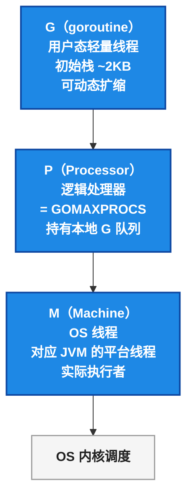
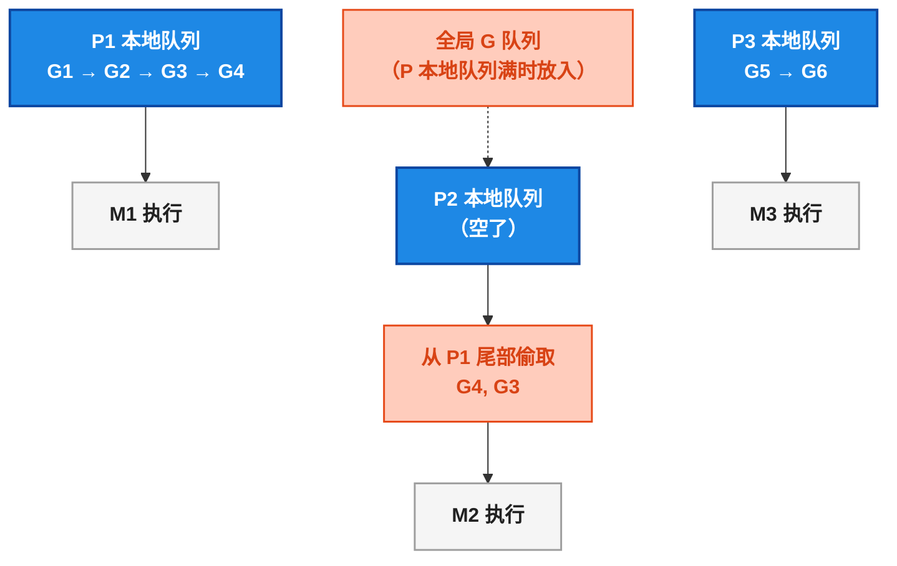
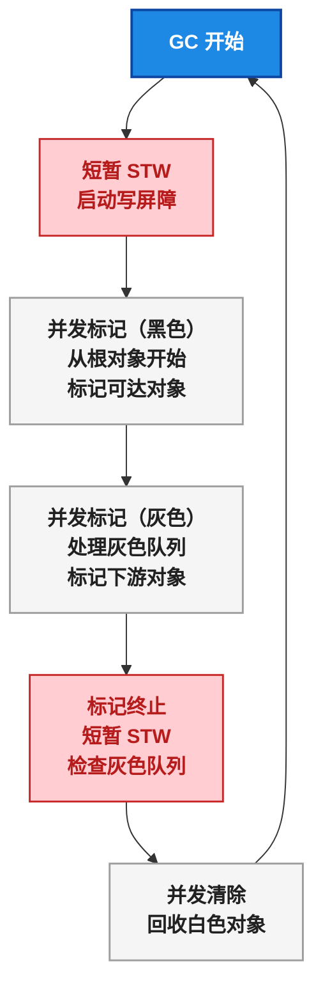
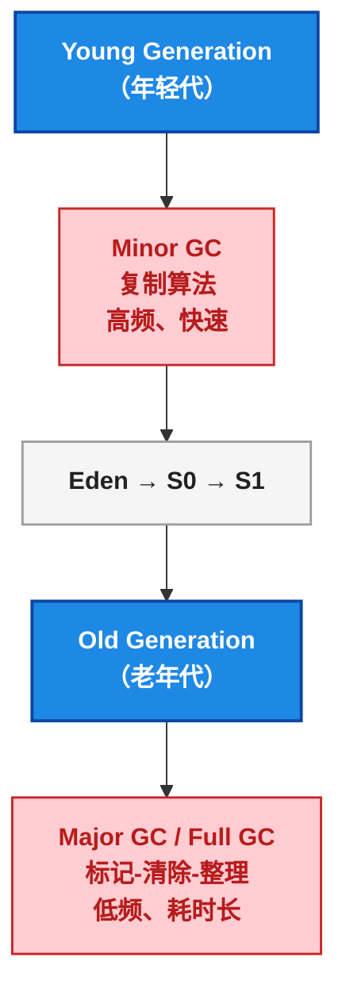
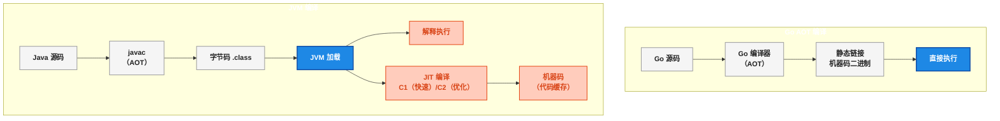
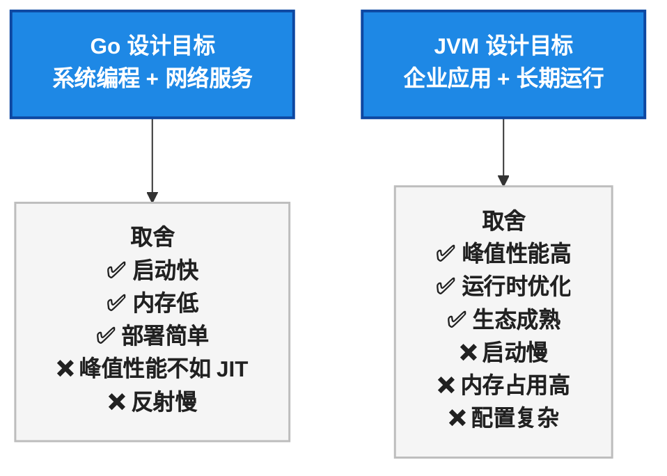

一个 JVM 调优经验丰富的开发者第一次部署 Go 服务，看到监控数据时的反应：

> 这进程怎么只占 4MB？ `-Xmx` 在哪设置？GC 日志怎么看？

接着打开 `top` ，看到 Go 服务起了几千个 goroutine，内存和 CPU 都低得离谱。而旁边跑了类似流量的 Spring Boot 服务， `-Xmx512m` 、GC 日志一大堆。

这不是魔法，是 Go runtime 和 JVM 的设计哲学完全不同。本文把两个运行时的核心差异讲清楚。

> 📌 前置知识：本文假定读者了解 JVM 的基本运行时概念（堆/栈/GC/类加载/JIT）和 Go 的 goroutine 基础知识。Go 版本为 1.22，对比 JVM HotSpot 17/21。

## 进程内存：4MB vs 512MB 的真相

| 维度 | Go | JVM（HotSpot） |
|------|-----|-----------------|
| 最小内存 | ~2-4MB | ~50-200MB（含堆 + 元空间） |
| 内存控制 | 自动，`GOGC` 环境变量 | `-Xmx` / `-Xms` + 大量 JVM 参数 |
| 启动时间 | 毫秒级（AOT 编译） | 秒级（类加载 + 解释执行 + JIT 预热） |
| 部署产物 | 单一静态二进制（~10-20MB） | JAR（需要 JRE/JDK 运行时） |
| 内存占用大头 | goroutine 栈 + 堆 + GC 元数据 | 堆 + 类元数据 + JIT 代码缓存 + 线程栈 |


Go 进程启动时内存低的原因很简单： <strong>AOT 编译</strong> 出来的二进制是纯机器码，不需要 JVM 那样的类加载、JIT 编译缓存、庞大的运行时元数据。Go 运行时嵌入在每个编译好的二进制中，体积很小。

## Goroutine 调度器：GMP 模型 vs JVM 线程

Go 的并发模型是本系列第三篇的重点，这里从 <strong>运行时对比</strong> 的角度看 GMP 和 JVM 线程的差异。

### GMP 三要素



| 概念 | Go GMP | JVM 对应 |
|------|--------|---------|
| G（goroutine） | 用户态轻量线程，~2KB 初始栈 | Virtual Thread（Java 21） |
| M（Machine） | OS 线程，执行 G | Platform Thread |
| P（Processor） | 逻辑处理器，= `GOMAXPROCS` | —（JVM 没有对应概念） |
| 调度者 | Go runtime（用户态） | OS 内核（抢占式调度） |
| 栈大小 | ~2KB 初始，可变 | Platform Thread ~1MB，Virtual Thread 可变 |

### 关键机制：工作窃取

当某个 P 的本地 G 队列空了，它会从 <strong>其他 P 的队列尾部偷一半 G</strong> 过来执行：



<strong>工作窃取</strong> 让所有 P 都保持忙碌，避免出现某些线程闲着、某些线程忙不过来的情况。JVM 的 ForkJoinPool 也用了类似机制。

### 异步抢占

Go 1.14 之前，goroutine 只在 <strong>函数调用边界</strong> 检查是否被抢占（协作式调度）。如果一个 goroutine 在执行死循环但没有函数调用（比如纯计算循环），它会一直霸占 M，其他 G 得不到执行。

Go 1.14 引入了 <strong>基于信号的异步抢占</strong> ：runtime 通过 `SIGURG` 信号打断长时间运行的 goroutine，强制检查抢占标志。

| 调度维度 | Go（1.14+） | JVM |
|---------|------------|-----|
| 调度层级 | 用户态（GMP） | 内核态（OS 线程调度） |
| 抢占方式 | 信号异步抢占 | OS 时间片抢占 |
| 上下文切换成本 | 用户态，~几十 ns | 内核态，~µs 级 |
| 每连接模型 | 1 连接 1 goroutine | 1 连接 1 Platform Thread（或 Virtual Thread） |
| 阻塞处理 | goroutine 挂起，M 复用 | 线程阻塞（或 VT unmount） |

> ⚠️ 新手提示：Java 21 的 Virtual Thread 在概念上和 goroutine 很像——都是用户态调度的轻量线程。但底层的实现差异很大：VT 依赖 JVM 的 Continuation，goroutine 是 runtime 原生支持的。VT 在 `synchronized` 块内会 pin 住 Platform Thread，goroutine 没有这个问题。

## GC 对比：Go 三色标记 vs JVM 分代收集

Go GC 和 JVM GC 的设计目标完全不同：

- <strong>Go GC</strong> ：低延迟优先，STW（Stop The World）时间控制在 <strong>毫秒级</strong> ，吞吐量可以牺牲
- <strong>JVM GC</strong>：吞吐量优先（Parallel GC）或低延迟优先（G1/ZGC），通过分代 + 多种算法平衡

### Go 三色标记 + 写屏障

Go 使用 <strong>并发三色标记 + 写屏障</strong> ，没有分代（Go 1.22 仍然没有分代 GC）：



<strong>三色标记</strong> 的含义：

| 颜色 | 含义 |
|------|------|
| 白色 | 尚未访问，GC 结束后被回收 |
| 灰色 | 已访问，但其引用的子对象未全部扫描 |
| 黑色 | 已访问，且所有子对象已扫描 |

<strong>写屏障</strong> 的作用：并发标记期间，程序可能修改对象引用（比如把黑色对象指向新的白色对象），写屏障捕获这种变更，避免活跃对象被错误回收。

### JVM 分代收集



### Go GC vs JVM GC 对比

| 维度 | Go GC | JVM Parallel GC | JVM G1 GC | JVM ZGC |
|------|:---:|:---:|:---:|:---:|
| 算法 | 并发三色标记 + 清除 | 分代 + 标记-复制/整理 | 分代 + 分区增量 | 并发标记 + 染色指针 |
| 分代 | 无 | 有（Young/Old） | 有 | 无（逻辑分区） |
| STW 目标 | <1ms（典型 0.1-0.5ms） | 几十到几百 ms | <10ms | <1ms |
| 内存开销 | 低（写屏障 + 少量元数据） | 中等 | 高（Remember Set） | 高（染色指针） |
| 配置复杂度 | `GOGC` 一个参数 | 几十个 JVM 参数 | 几十个 JVM 参数 | 中等 |
| 碎片处理 | 无（依赖 TCMalloc） | 有（整理） | 有（整理） | 有 |
| 适用场景 | 低延迟 API 服务 | 批处理/后端计算 | 通用低延迟服务 | 超低延迟 + 大堆 |

<strong>Go GC 值得关注的几点</strong>：

1. <strong>没有分代</strong>——Go 的设计假设是"大多数对象都在栈上分配"，堆上的短命对象不如 Java 多。逃逸分析把对象尽量放在栈上，堆压力本来就小。
2. GC 触发阈值 `GOGC` ——默认 100，表示堆增长到上次 GC 后的 2 倍时触发下一次 GC。设置为 200 可以减少 GC 频率（用更多内存换吞吐），设置为 50 可以降低内存峰值。
3. <strong>GC 辅助（GC Assist）</strong>——如果 goroutine 分配内存太快导致 GC 跟不上，goroutine 会被强制参与 GC 标记工作，"谁制造垃圾谁帮忙打扫"。

## 内存分配：栈 vs 堆的权衡

| 维度 | Go | JVM |
|------|-----|-----|
| 分配方式 | 优先栈分配（逃逸分析）<br/>大对象/逃逸对象走堆 | 所有对象都在堆上<br/>（JIT 逃逸分析可栈上分配标量） |
| 栈管理 | 动态扩缩（copying stack） | 固定大小（-Xss）或 Virtual Thread 动态 |
| 堆管理 | TCMalloc 风格（多 size class） | TLAB + 分代堆 |


<strong>Go 逃逸分析</strong> 是减少堆分配的核心机制。编译器在编译时判断一个变量是否"逃逸"出了当前函数的作用域，如果没有逃逸就分配在栈上（函数返回时自动释放，不需要 GC）。

```go
// 构建时加 -gcflags="-m" 查看逃逸分析结果
// go build -gcflags="-m" main.go

func foo() *int {
    x := 42
    return &x  // x 逃逸到堆（返回了指针）
}

func bar() int {
    y := 100
    return y   // y 没有逃逸（分配在栈上）
}
```

> ⚠️ 新手提示：Java 程序员习惯性地 `new` 对象，在 Go 里别担心—— `new` 和 `&T{}` 不一定分配在堆上。Go 编译器会根据逃逸分析自动决定。上面的 `foo()` 返回了局部变量的指针，在 C 里是 UB，在 Go 里编译器自动把这个变量放到堆上。

## 反射对比：Go reflect vs Java Reflection

反射是运行时操作类型信息的能力。两种语言都支持，但设计风格截然不同。

### Java 反射：功能强大

```java
// Java 反射 —— 功能丰富
Class<?> clazz = Class.forName("com.example.User");
Object instance = clazz.getDeclaredConstructor().newInstance();

// 获取注解
GetMapping anno = method.getAnnotation(GetMapping.class);
// 修改 private 字段
Field field = clazz.getDeclaredField("name");
field.setAccessible(true);
field.set(instance, "张三");
// 动态代理
UserService proxy = (UserService) Proxy.newProxyInstance(...);
```

### Go 反射：API 精简

```go
// Go 反射 —— API 少而精
import "reflect"

type User struct {
    Name string `json:"name"`
    Age  int    `json:"age"`
}

u := User{Name: "张三", Age: 30}
t := reflect.TypeOf(u)
v := reflect.ValueOf(u)

// 遍历字段
for i := 0; i < t.NumField(); i++ {
    field := t.Field(i)
    value := v.Field(i)
    tag := field.Tag.Get("json")
    fmt.Printf("%s (%s): %v\n", field.Name, tag, value)
}

// 修改值（需要传入指针）
pv := reflect.ValueOf(&u).Elem()
pv.FieldByName("Name").SetString("李四")
```

### 差异总结

| 维度 | Java Reflection | Go reflect |
|------|:---:|:---:|
| API 复杂度 | 丰富（Class/Method/Field/Annotation/Proxy） | 精简（Type/Value/StructField） |
| 修改访问控制 | 支持（ `setAccessible(true)` 突破 private） | 不支持（大写公开、小写私有，<strong>反射也破不了</strong>） |
| 动态代理 | 内置 `Proxy.newProxyInstance()` | 无（没有运行时代理机制） |
| 注解/标签 | 运行时注解（可通过反射读取） | 结构体 Tag（编译期，仅反射读取） |
| 性能 | 中等（有 JIT 优化） | 较慢（纯解释式，无 JIT） |
| 核心用途 | Spring DI、AOP、ORM、序列化 | 序列化、ORM、代码生成器 |

<strong>Go 反射性能差的原因</strong>：Go 是 AOT 编译，反射调用无法享受编译期优化。 `reflect.Value.Call()` 本质上是在运行时解析参数、构造调用、执行函数指针——完全是解释执行。而 JVM 的反射经过 JIT 优化后可以接近直接调用的性能。

<strong>Go 社区的哲学</strong>：尽量在编译期解决问题，用代码生成（go generate）代替运行时反射。JSON 序列化库从 `encoding/json` （反射）迁移到如 `sonic` （编译期生成）能获得 3-10 倍的性能提升。

## 编译模型：AOT vs JIT



| 维度 | Go AOT | JVM JIT |
|------|--------|---------|
| 编译时机 | 编译时一次性完成 | 运行时动态编译热点代码 |
| 启动速度 | 极快（直接执行机器码） | 慢（类加载 + 解释 + 预热） |
| 峰值性能 | 中等（静态优化，无运行时反馈） | 高（根据运行时数据做激进优化） |
| 内联 | 编译时静态内联 | 运行时动态内联（可跨虚方法） |
| 去优化 | 不支持 | 支持（deoptimization，可回退） |
| 二进制体积 | ~10-20MB（含运行时） | JAR 很小（几 MB），但需要 JRE |
| 跨平台 | 交叉编译一个命令 | 字节码一次编译到处运行 |

<strong>JIT 的最大优势</strong>：根据实际运行数据做优化。比如一个虚方法在运行时只调用了一个实现，JIT 可以做单态内联（monomorphic inline）。Go 的接口方法调用无法享受这种优化。

<strong>Go AOT 的最大优势</strong>：启动即巅峰，不需要预热。对于短命容器/Pod、Serverless 函数，Go 的冷启动速度是 JVM 难以匹敌的。

## 元空间 vs 运行时元数据

JVM 有一个让很多开发者困惑的东西——<strong>元空间（Metaspace）</strong>。它在堆外，存类定义、方法描述、常量池等。Java 8 之后取代了永久代。

Go 没有元空间的概念。<strong>Go 的类型信息在编译后内化到二进制中</strong>：每个类型编译成 `runtime._type` 结构体，接口值存一个指向类型信息的指针。这部分元数据很小，就在进程的 data 段——不需要设置 `-XX:MaxMetaspaceSize` 。

## 配置对照表

| 配置目的 | JVM 参数 | Go 配置 |
|---------|---------|--------|
| 初始堆大小 | `-Xms512m` | 无（自动从 OS 申请） |
| 最大堆大小 | `-Xmx2g` | `GOMEMLIMIT=2GiB`（Go 1.19+） |
| GC 调节 | `-XX:+UseG1GC` / `-XX:+UseZGC` | `GOGC=100`（默认） |
| 并发线程数 | `-XX:ParallelGCThreads=N` | `GOMAXPROCS`（默认 CPU 核数） |
| 线程栈大小 | `-Xss1m`（默认 ~1MB） | goroutine 自动扩缩（初始 ~2KB） |
| 元空间 | `-XX:MaxMetaspaceSize=256m` | 无（类型信息在 data 段） |
| GC 日志 | `-Xlog:gc*` | `GODEBUG=gctrace=1` |
| Profile | JFR / Async Profiler / Arthas | `net/http/pprof` + `go tool pprof` |


## 总结

Go 运行时和 JVM 的差异，根子上的原因是 <strong>设计目标不同</strong> ：



| 场景 | Go 优势 | JVM 优势 |
|------|---------|---------|
| Serverless / 短命容器 | 毫秒级冷启动 | 预热时间长 |
| 高并发 API 服务 | goroutine 开销极低 | Virtual Thread 起步晚 |
| 内存敏感场景 | 4MB 起步内存 | 通常 256MB+ |
| CPU 密集计算 | 中等（AOT 静态优化） | 高（JIT 热点优化 + SIMD） |
| 长期运行的批处理 | GC 可能频繁 | G1/ZGC 优化成熟 |
| 需要动态代理/AOP | 不支持（编译期方案） | 运行时反射/动态代理成熟 |

Go 的运行时哲学是 <strong>"够用就好"</strong> ——够快的 GC、够轻的调度、够少的配置。JVM 的哲学是 <strong>"给你一切"</strong> ——你可以调 GC、调 JIT、调堆、调线程、调一切。哪个更好？看场景。

---

<details><summary>参考资源</summary>

- Go Runtime Source: [runtime/netpoll.go](https://go.dev/src/runtime/netpoll.go)
- Go GC Guide: [A Guide to the Go Garbage Collector](https://tip.golang.org/doc/gc-guide)
- Go Memory Model: [The Go Memory Model](https://go.dev/ref/mem)
- Go Reflection: [The Laws of Reflection](https://go.dev/blog/laws-of-reflection)
- JVM G1 GC: [Garbage-First Garbage Collector](https://docs.oracle.com/en/java/javase/17/gctuning/garbage-first-garbage-collector.html)
- JVM ZGC: [The Z Garbage Collector](https://wiki.openjdk.org/display/zgc)
- JVM JIT: [Java JIT Compiler Overview](https://docs.oracle.com/en/java/javase/17/vm/java-hotspot-virtual-machine-performance-enhancements.html)

</details>
