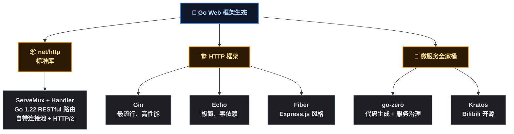
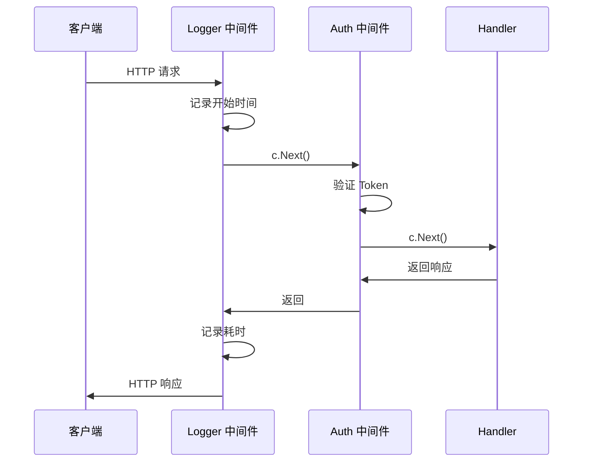
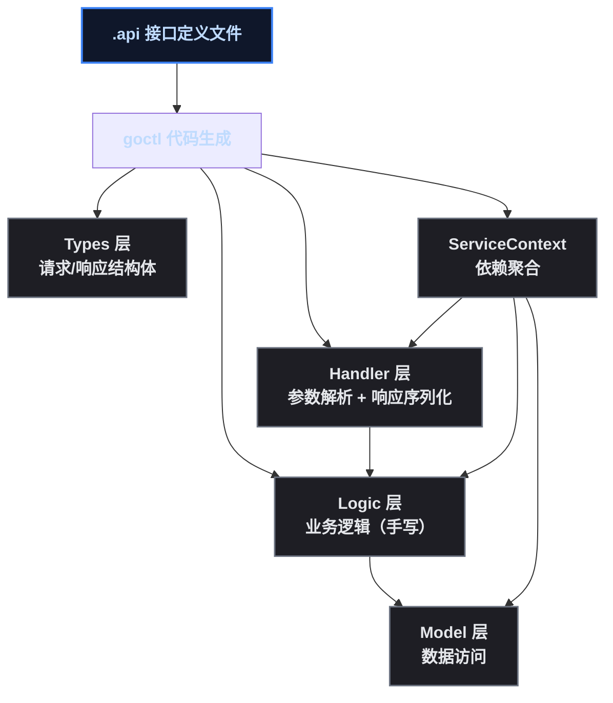
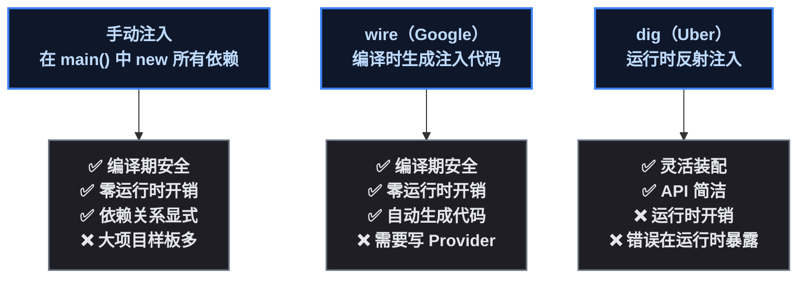

# Go Web 开发：从 Gin 到微服务

一个 Spring Boot 程序员打开 Go 的 Web 项目，看到的是这样的代码：

```go
// 这是什么？Controller 在哪？@Autowired 在哪？
func main() {
    db, _ := sql.Open("mysql", "user:pass@/dbname")
    repo := NewUserRepo(db)
    svc := NewUserService(repo)
    handler := NewUserHandler(svc)

    r := gin.Default()
    r.GET("/users/:id", handler.GetUser)
    r.Run(":8080")
}
```

没有 `@Controller` 、没有 `@Service` 、没有 `@Autowired` 、没有 `application.yml` 。依赖是一个个手动拼起来的，路由是函数式注册的，连配置文件都得自己选库来读。

习惯 Spring Boot 全家桶的开发者，第一次面对 Go 的 Web 生态，大概有两类困惑：

1. **框架选型**：Gin、Echo、Fiber、Iris、go-zero、Kratos……每个都说自己性能好，到底该用哪个？
2. **组织方式**：没有注解驱动的 DI、没有 AOP、没有 Filter 接口——同样的需求在 Go 里怎么写？

本文用 Spring Boot/Spring Cloud 的对应视角，把 Go Web 开发的技术栈讲清楚。

> 📌 前置知识：本文假定读者熟悉 Spring Boot 的基本概念（IoC/DI、MVC、Filter/Interceptor）和 Spring Cloud 微服务组件（Nacos、Gateway、OpenFeign）。Go 版本为 1.22，Gin 为 v1.9，go-zero 为 v1.6。

## Go Web 框架生态：百花齐放 vs 一家独大

Java 的 Web 框架生态是 Spring Boot 一家独大。Go 则完全不同——标准库 `net/http` 已经可以写生产级 HTTP 服务，第三方框架在标准库之上提供更方便的 API。



| 框架 | 定位 | Java 对应 | 核心作者/维护方 | GitHub Stars |
|------|------|----------|-----------------|:---:|
| `net/http` | 标准库 HTTP | Servlet API | Go 团队 | — |
| Gin | 高性能 HTTP 框架 | Spring Boot Web | @manucorporat 发起、社区维护 | 75k+ |
| Echo | 极简 HTTP 框架 | Spring Boot Web（轻量） | LabStack | 28k+ |
| go-zero | 微服务全家桶 | Spring Cloud Alibaba | Kevin Wan（万俊峰） | 28k+ |
| Kratos | 微服务框架 | Spring Cloud | Bilibili | 22k+ |

<strong>选型建议</strong>：写单体 API 服务用 Gin；搞微服务全家桶用 go-zero。这两个组合能覆盖绝大多数业务场景。

## Gin：Go 的 Spring Boot Web

Gin 是 Go 生态中使用最广泛的 HTTP 框架。设计哲学：<strong>轻量、高性能、API 友好</strong>。它不追求 Spring Boot 那样的全栈能力，只做好一件事——HTTP 请求的处理。

> ⚠️ 新手提示：Gin 不是一个"框架"（Framework），更像一个"库"（Library）。没有 IoC 容器，没有 ORM 集成，没有配置管理——这些由你自行选型组合。

### 路由与 Handler：@GetMapping 变成函数调用

```go
// Go Gin —— 函数式路由注册
package main

import "github.com/gin-gonic/gin"

func main() {
    r := gin.Default()

    r.GET("/users/:id", func(c *gin.Context) {
        id := c.Param("id")
        c.JSON(200, gin.H{"id": id, "name": "张三"})
    })

    r.POST("/users", func(c *gin.Context) {
        var body struct {
            Name string `json:"name"`
        }
        c.ShouldBindJSON(&body)
        c.JSON(201, gin.H{"created": body.Name})
    })

    r.Run(":8080")
}
```

```java
// Java Spring Boot —— 注解驱动
@RestController
public class UserController {

    @GetMapping("/users/{id}")
    public Map<String, String> getUser(@PathVariable String id) {
        return Map.of("id", id, "name", "张三");
    }

    @PostMapping("/users")
    public Map<String, String> createUser(@RequestBody User body) {
        return Map.of("created", body.getName());
    }
}
```

关键差异：

- <strong>Gin 用 `c *gin.Context` 承载请求/响应</strong>，类似 Spring MVC 的 `HttpServletRequest` + `HttpServletResponse` 二合一
- <strong>路由注册是函数调用</strong>，不是注解扫描——这意味着路由在编译期确定，不需要类路径扫描
- <strong>参数绑定用 `c.Param()` / `c.ShouldBindJSON()`</strong>，不需要 `@PathVariable` / `@RequestBody` 注解

### 路由分组：@RequestMapping 的 Go 写法

```go
// Gin 路由分组 —— 类似 @RequestMapping("/api/v1")
v1 := r.Group("/api/v1")
{
    v1.GET("/users", listUsers)
    v1.POST("/users", createUser)
    v1.GET("/users/:id", getUser)
    v1.PUT("/users/:id", updateUser)
    v1.DELETE("/users/:id", deleteUser)
}

// 分组可以嵌套
admin := v1.Group("/admin", authMiddleware())
{
    admin.GET("/dashboard", dashboardHandler)
}
```

路由分组解决了两个问题： <strong>路径前缀共享</strong> 和 <strong>中间件批量绑定</strong> 。Spring Boot 里用 `@RequestMapping("/api/v1")` 在类上 + `@GetMapping` 在方法上；Gin 用 `r.Group()` + 函数注册。

### 中间件：Filter + Interceptor 二合一

Java Servlet 有两个拦截概念—— `Filter` （容器级，处理请求/响应）和 `Interceptor` （框架级，处理 Handler 前后）。Go 没有这种区分，<strong>中间件就是一个函数</strong>：

```go
// Gin 中间件 = Java Filter + Interceptor
func AuthMiddleware() gin.HandlerFunc {
    return func(c *gin.Context) {
        token := c.GetHeader("Authorization")
        if token == "" {
            c.JSON(401, gin.H{"error": "unauthorized"})
            c.Abort()  // 终止后续处理，类似 filterChain 不继续
            return
        }
        // 验证 token，把用户信息放入 context
        c.Set("userId", extractUserId(token))
        c.Next()  // 继续下一个中间件 → Handler
    }
}

// 使用
r := gin.Default()
r.Use(AuthMiddleware())           // 全局中间件
v1 := r.Group("/api", Logger())  // 分组中间件
r.GET("/user/:id", Auth(), handler)  // 单路由中间件
```

```java
// Java Filter —— 对比
@Component
public class AuthFilter implements Filter {
    @Override
    public void doFilter(ServletRequest req, ServletResponse res, FilterChain chain) {
        String token = ((HttpServletRequest) req).getHeader("Authorization");
        if (token == null) {
            ((HttpServletResponse) res).sendError(401);
            return;
        }
        chain.doFilter(req, res);  // 对应 c.Next()
    }
}
```

Gin 的中间件设计比 Java 简洁：<strong>没有接口定义，一个 `func(c *gin.Context)` 就是中间件</strong>。 `c.Next()` 等价于 `chain.doFilter()` ； `c.Abort()` 等价于不调用 `chain.doFilter()` 。



> ⚠️ 新手提示：Gin 中间件的执行顺序是 <strong>注册顺序</strong> ，不是 Spring Boot 的 `@Order` 注解控制。 `r.Use(A)` 再 `r.Use(B)` ，执行顺序就是 A → B → Handler → B → A。和 Filter Chain 一样的洋葱模型。

### Gin 的参数绑定与校验

```go
// Go Gin —— 参数绑定 + 校验
type CreateUserReq struct {
    Name  string `json:"name" binding:"required,min=2,max=50"`
    Email string `json:"email" binding:"required,email"`
    Age   int    `json:"age" binding:"gte=0,lte=150"`
}

func createUser(c *gin.Context) {
    var req CreateUserReq
    if err := c.ShouldBindJSON(&req); err != nil {
        c.JSON(400, gin.H{"error": err.Error()})
        return
    }
    // 参数已校验通过
    c.JSON(201, gin.H{"status": "ok"})
}
```

```java
// Java Spring Boot —— 验证
public record CreateUserReq(
    @NotBlank @Size(min=2, max=50) String name,
    @NotBlank @Email String email,
    @Min(0) @Max(150) int age
) {}

@PostMapping("/users")
public ResponseEntity<?> createUser(@Valid @RequestBody CreateUserReq req) {
    return ResponseEntity.status(201).body(Map.of("status", "ok"));
}
```

Gin 的 `binding` 标签等价于 Jakarta Validation 的注解。区别在于，Gin 的校验是 <strong>集成在框架内</strong> 的，不需要额外引入 `spring-boot-starter-validation` 。

## go-zero：Go 的 Spring Cloud Alibaba

如果只写单体 CRUD，Gin 足够。但微服务场景注册中心、配置管理、RPC 调用、限流熔断、网关路由——这些 Spring Cloud 提供的能力，在 Go 生态中由 <strong>go-zero</strong> 提供。

go-zero 作者 Kevin Wan（万俊峰），设计哲学：<strong>约定优于配置，代码生成驱动开发</strong>。和 Spring Cloud Alibaba 的对比一目了然：

| 能力 | Spring Cloud Alibaba | go-zero |
|------|---------------------|---------|
| 注册中心 | Nacos | etcd（内建集成） |
| 配置中心 | Nacos Config | 内建配置管理 |
| RPC 调用 | OpenFeign（HTTP + JSON） | gRPC（protobuf） |
| API 网关 | Spring Cloud Gateway | go-zero Gateway |
| 限流熔断 | Sentinel | 内建限流/熔断/降级 |
| 链路追踪 | SkyWalking | 支持 OpenTelemetry |
| 代码生成 | Spring Initializr | goctl（更彻底） |

### goctl：比 Spring Initializr 更激进的代码生成

Spring Initializr 帮你生成项目骨架（pom.xml + 启动类 + 目录结构）。goctl 更进一步——<strong>连 API Handler、Logic、Model 代码都帮你生成</strong>：

```bash
# 1. 写一个 .api 文件定义服务
cat <<EOF > user.api
type (
    GetUserReq {
        Id string `path:"id"`
    }
    GetUserRes {
        Id   string `json:"id"`
        Name string `json:"name"`
    }
)

service user-api {
    @handler getUser
    get /users/:id (GetUserReq) returns (GetUserRes)
}
EOF

# 2. 生成完整的 API 项目
goctl api go -api user.api -dir .
```

执行后生成的文件结构：

```
user-api/
├── etc/
│   └── user-api.yaml         # 配置文件
├── internal/
│   ├── config/
│   │   └── config.go         # 配置结构体
│   ├── handler/
│   │   └── getUserHandler.go # Handler（自动生成）
│   ├── logic/
│   │   └── getUserLogic.go   # 业务逻辑（在这里写代码）
│   ├── svc/
│   │   └── serviceContext.go # 服务上下文（依赖注入容器）
│   └── types/
│       └── types.go           # 请求/响应类型
├── user.go                    # main 入口
└── user.api                   # API 定义文件
```

对比 Spring Boot 的开发流程：

| 步骤 | Spring Boot | go-zero |
|------|------------|---------|
| 定义接口 | 写 Controller 类 + 注解 | 写 .api 文件 |
| 生成代码 | 只有骨架 | Handler + Logic + Types |
| 编写业务 | Service 层 | Logic 层（在生成的文件里填） |
| 依赖管理 | @Autowired 自动注入 | ServiceContext 手动管理 |
| 启动 | `mvn spring-boot:run` | `go run user.go` |



<strong>分层对应关系</strong>：

```html
<div style="max-width:700px;overflow-x:auto;">
<table style="border-collapse:collapse;width:100%;text-align:center;">
<tr style="background:#1E88E5;color:#FFFFFF;">
    <th style="padding:10px 16px;border:1px solid #0D47A1;">层次</th>
    <th style="padding:10px 16px;border:1px solid #0D47A1;">Spring Boot</th>
    <th style="padding:10px 16px;border:1px solid #0D47A1;">go-zero</th>
    <th style="padding:10px 16px;border:1px solid #0D47A1;">Gin（手动）</th>
</tr>
<tr style="background:#F5F5F5;">
    <td style="padding:10px 16px;border:1px solid #BDBDBD;">入口</td>
    <td style="padding:10px 16px;border:1px solid #BDBDBD;">Controller</td>
    <td style="padding:10px 16px;border:1px solid #BDBDBD;">Handler（生成）</td>
    <td style="padding:10px 16px;border:1px solid #BDBDBD;">Handler（手写）</td>
</tr>
<tr style="background:#F5F5F5;">
    <td style="padding:10px 16px;border:1px solid #BDBDBD;">业务</td>
    <td style="padding:10px 16px;border:1px solid #BDBDBD;">Service</td>
    <td style="padding:10px 16px;border:1px solid #BDBDBD;">Logic</td>
    <td style="padding:10px 16px;border:1px solid #BDBDBD;">Service（手动）</td>
</tr>
<tr style="background:#F5F5F5;">
    <td style="padding:10px 16px;border:1px solid #BDBDBD;">数据</td>
    <td style="padding:10px 16px;border:1px solid #BDBDBD;">Repository / Mapper</td>
    <td style="padding:10px 16px;border:1px solid #BDBDBD;">Model（生成）</td>
    <td style="padding:10px 16px;border:1px solid #BDBDBD;">Repository（手动）</td>
</tr>
<tr style="background:#F5F5F5;">
    <td style="padding:10px 16px;border:1px solid #BDBDBD;">依赖</td>
    <td style="padding:10px 16px;border:1px solid #BDBDBD;">@Autowired</td>
    <td style="padding:10px 16px;border:1px solid #BDBDBD;">ServiceContext</td>
    <td style="padding:10px 16px;border:1px solid #BDBDBD;">main 函数手动组装</td>
</tr>
</table>
</div>
```

## 依赖注入：没有 @Autowired 的日子

Go 没有 IoC 容器。没有 `@Autowired` ，没有 `@ComponentScan` ，没有 Bean 生命周期管理。<strong>Go 的依赖注入是手动的</strong>——在 `main()` 函数里把所有依赖拼起来：

```go
func main() {
    // 手动组装依赖 —— Go 的标准做法
    db, _ := sql.Open("mysql", dsn)
    userRepo := repository.NewUserRepo(db)
    orderRepo := repository.NewOrderRepo(db)
    userService := service.NewUserService(userRepo)
    orderService := service.NewOrderService(orderRepo, userService)
    userHandler := handler.NewUserHandler(userService)
    orderHandler := handler.NewOrderHandler(orderService)

    r := gin.Default()
    r.GET("/users/:id", userHandler.GetUser)
    r.GET("/orders/:id", orderHandler.GetOrder)
    r.Run(":8080")
}
```

看起来"low"，但有几个好处：

1. <strong>依赖关系显式可见</strong>——不需要猜 Spring 到底注入了哪个实现
2. <strong>编译期检查</strong>——拼错了编译不通过，不会运行时 NPE
3. <strong>零运行时开销</strong>——不依赖反射

当然，项目大了以后，手动管理几十个依赖确实烦。Go 社区提供了两种方案：

| 方案 | 原理 | 使用场景 |
|------|------|----------|
| 手动注入 | `main()` 函数里一个个 new | 所有项目，最推荐 |
| wire（Google） | 编译时生成注入代码 | 大型项目，想自动但有编译期保障 |
| dig（Uber） | 运行时反射注入 | 需要灵活装配的场景 |

```go
// wire（Google） —— 编译时依赖注入
//go:build wireinject
// +build wireinject

func InitializeApp() (*App, error) {
    wire.Build(
        repository.NewUserRepo,
        service.NewUserService,
        handler.NewUserHandler,
        NewRouter,
    )
    return &App{}, nil
}
// wire 会在编译期生成一个 wire_gen.go，里面就是上面的手动注入代码
```

<strong>wire 的本质</strong> ：不是运行时 IoC 容器，而是一个 <strong>代码生成器</strong> 。它分析你的 Provider 函数签名，生成和手写一样的高效注入代码。 <strong>零反射、零运行时开销</strong> 。这很 Go——需要自动化，但不接受运行时黑箱。



## 配置文件管理：没有 application.yml 怎么办

Spring Boot 用 `application.yml` + `@Value` 注解。Go 没有统一标准，社区主流方案是 <strong>Viper</strong>：

```go
// Go Viper —— 读取 YAML 配置
import "github.com/spf13/viper"

func init() {
    viper.SetConfigName("config")  // 文件名（不含后缀）
    viper.SetConfigType("yaml")    // 文件类型
    viper.AddConfigPath(".")       // 搜索路径
    viper.AutomaticEnv()           // 也读环境变量

    if err := viper.ReadInConfig(); err != nil {
        log.Fatal(err)
    }
}

func main() {
    dbHost := viper.GetString("database.host")
    dbPort := viper.GetInt("database.port")
    // ...
}
```

```yaml
# config.yaml
server:
  port: 8080

database:
  host: localhost
  port: 3306
  name: mydb
```

| 需求 | Spring Boot | Go |
|------|------------|-----|
| 读取 YAML | `@Value("${db.host}")` | `viper.GetString("database.host")` |
| 环境变量覆盖 | 自动 | `viper.AutomaticEnv()` |
| 配置热更新 | `@RefreshScope` | `viper.WatchConfig()` |
| 多环境 | `application-{profile}.yml` | 手动切换 config 文件名 |
| 类型安全绑定 | `@ConfigurationProperties` | `viper.Unmarshal(&config)` |

## gRPC：Go 的 OpenFeign 替代

Spring Cloud 中，微服务间 HTTP 调用用 OpenFeign（声明式 HTTP + JSON + Ribbon 负载均衡）。Go 生态中，<strong>微服务间通信的标准方案是 gRPC</strong>（protobuf + HTTP/2）：

```protobuf
// user.proto —— 协议定义（语言无关）
syntax = "proto3";

service UserService {
    rpc GetUser(GetUserReq) returns (GetUserRes);
    rpc CreateUser(CreateUserReq) returns (CreateUserRes);
}

message GetUserReq {
    string id = 1;
}

message GetUserRes {
    string id = 1;
    string name = 2;
}
```

```bash
# 生成 Go 代码
protoc --go_out=. --go-grpc_out=. user.proto
```

```go
// Go gRPC 客户端 —— 替代 OpenFeign
conn, _ := grpc.Dial("user-service:50051",
    grpc.WithTransportCredentials(insecure.NewCredentials()),
)
client := pb.NewUserServiceClient(conn)

// 调用远程服务（看起来像本地调用）
resp, err := client.GetUser(ctx, &pb.GetUserReq{Id: "123"})
```

```java
// Java OpenFeign —— 对比
@FeignClient(name = "user-service")
public interface UserServiceClient {
    @GetMapping("/users/{id}")
    UserResponse getUser(@PathVariable String id);
}
```

| 维度 | OpenFeign | gRPC |
|------|----------|------|
| 协议 | HTTP/1.1 + JSON | HTTP/2 + protobuf |
| 序列化 | JSON（文本） | protobuf（二进制） |
| 接口定义 | Java 接口 + 注解 | .proto 文件 |
| 代码生成 | 运行时动态代理 | 编译时生成 stubs |
| 负载均衡 | Ribbon / LoadBalancer | gRPC 内置 |
| 服务发现 | Nacos | etcd / Consul |
| 性能 | 中等 | 高（二进制 + 多路复用） |

> ⚠️ 新手提示：gRPC 默认不依赖注册中心，需要配合 etcd 或 Consul 做服务发现。go-zero 的 RPC 层在 gRPC 之上封装了 etcd 服务发现，开箱即用。

## ORM：MyBatis/JPA 的 Go 替代

| 方案 | 定位 | Java 对应 |
|------|------|----------|
| GORM | 全功能 ORM | JPA / Hibernate |
| sqlx | 轻量 SQL 封装 | MyBatis |
| ent | 代码生成 ORM | — |

```go
// GORM —— 最接近 JPA 的体验
type User struct {
    ID   uint   `gorm:"primaryKey"`
    Name string `gorm:"size:100"`
}

db.First(&user, "id = ?", id)
db.Where("name LIKE ?", "%张%").Find(&users)

// sqlx —— 手写 SQL，自动映射结构体（更 Go 的风格）
var users []User
db.Select(&users, "SELECT * FROM users WHERE name LIKE ?", "%张%")
```

## go mod vs Maven/Gradle 命令对照

| 操作 | Maven | Gradle | Go |
|------|-------|--------|-----|
| 初始化项目 | 手动创建 pom.xml | `gradle init` | `go mod init <module>` |
| 添加依赖 | 编辑 pom.xml | `build.gradle` + refresh | `go get <pkg>` |
| 下载所有依赖 | `mvn install` | `gradle build` | `go mod download` |
| 更新依赖版本 | `mvn versions:use-latest` | `gradle refresh` | `go get -u <pkg>` |
| 删除未使用依赖 | 手动 | 手动 | `go mod tidy` |
| 查看依赖树 | `mvn dependency:tree` | `gradle dependencies` | `go mod graph` |
| 构建 | `mvn package` | `gradle build` | `go build` |
| 运行测试 | `mvn test` | `gradle test` | `go test ./...` |
| 运行应用 | `mvn spring-boot:run` | `gradle bootRun` | `go run .` |
| 编译为可部署包 | `mvn package` （JAR） | `gradle build` （JAR） | `go build` （二进制） |
| 清理 | `mvn clean` | `gradle clean` | `go clean` |
| 锁版本 | `pom.xml` （明确版本） | `build.gradle` + lockfile | `go.sum` （自动生成） |
| 多模块 | `<modules>` | `settings.gradle` | `go.work` （Go 1.18+） |

关键差异：

- `go.sum` 是纯锁定文件，记录每个依赖的 SHA-256 校验和，确保构建可复现。类似 Maven 的 `pom.xml` 中明确写版本号 + SHA 校验
- `go mod tidy` 很智能——自动添加缺失依赖、删除未使用依赖。Maven/Gradle 做不到自动删除未使用的 `dependency`
- <strong>Go 没有中央仓库概念</strong>——依赖直接从 Git 仓库拉取（通过 proxy.golang.org 代理），不依赖 Nexus/Artifactory

## 技术栈对照总表

```html
<div style="max-width:700px;overflow-x:auto;">
<table style="border-collapse:collapse;width:100%;text-align:left;">
<tr style="background:#1E88E5;color:#FFFFFF;">
    <th style="padding:10px 16px;border:1px solid #0D47A1;">能力层</th>
    <th style="padding:10px 16px;border:1px solid #0D47A1;">Java 选型</th>
    <th style="padding:10px 16px;border:1px solid #0D47A1;">Go 选型</th>
</tr>
<tr style="background:#F5F5F5;">
    <td style="padding:10px 16px;border:1px solid #BDBDBD;">语言版本</td>
    <td style="padding:10px 16px;border:1px solid #BDBDBD;">Java 17/21 LTS</td>
    <td style="padding:10px 16px;border:1px solid #BDBDBD;">Go 1.22+</td>
</tr>
<tr style="background:#F5F5F5;">
    <td style="padding:10px 16px;border:1px solid #BDBDBD;">HTTP 框架</td>
    <td style="padding:10px 16px;border:1px solid #BDBDBD;">Spring Boot Web</td>
    <td style="padding:10px 16px;border:1px solid #BDBDBD;">Gin / Echo</td>
</tr>
<tr style="background:#F5F5F5;">
    <td style="padding:10px 16px;border:1px solid #BDBDBD;">微服务框架</td>
    <td style="padding:10px 16px;border:1px solid #BDBDBD;">Spring Cloud Alibaba</td>
    <td style="padding:10px 16px;border:1px solid #BDBDBD;">go-zero / Kratos</td>
</tr>
<tr style="background:#F5F5F5;">
    <td style="padding:10px 16px;border:1px solid #BDBDBD;">RPC 调用</td>
    <td style="padding:10px 16px;border:1px solid #BDBDBD;">OpenFeign（HTTP + JSON）</td>
    <td style="padding:10px 16px;border:1px solid #BDBDBD;">gRPC（protobuf）</td>
</tr>
<tr style="background:#F5F5F5;">
    <td style="padding:10px 16px;border:1px solid #BDBDBD;">注册中心</td>
    <td style="padding:10px 16px;border:1px solid #BDBDBD;">Nacos</td>
    <td style="padding:10px 16px;border:1px solid #BDBDBD;">etcd / Consul</td>
</tr>
<tr style="background:#F5F5F5;">
    <td style="padding:10px 16px;border:1px solid #BDBDBD;">配置中心</td>
    <td style="padding:10px 16px;border:1px solid #BDBDBD;">Nacos Config</td>
    <td style="padding:10px 16px;border:1px solid #BDBDBD;">Viper + etcd</td>
</tr>
<tr style="background:#F5F5F5;">
    <td style="padding:10px 16px;border:1px solid #BDBDBD;">API 网关</td>
    <td style="padding:10px 16px;border:1px solid #BDBDBD;">Spring Cloud Gateway</td>
    <td style="padding:10px 16px;border:1px solid #BDBDBD;">go-zero Gateway</td>
</tr>
<tr style="background:#F5F5F5;">
    <td style="padding:10px 16px;border:1px solid #BDBDBD;">限流熔断</td>
    <td style="padding:10px 16px;border:1px solid #BDBDBD;">Sentinel</td>
    <td style="padding:10px 16px;border:1px solid #BDBDBD;">go-zero 内置 / Sentinel Go</td>
</tr>
<tr style="background:#F5F5F5;">
    <td style="padding:10px 16px;border:1px solid #BDBDBD;">ORM</td>
    <td style="padding:10px 16px;border:1px solid #BDBDBD;">MyBatis / JPA</td>
    <td style="padding:10px 16px;border:1px solid #BDBDBD;">GORM / sqlx</td>
</tr>
<tr style="background:#F5F5F5;">
    <td style="padding:10px 16px;border:1px solid #BDBDBD;">依赖注入</td>
    <td style="padding:10px 16px;border:1px solid #BDBDBD;">@Autowired（IoC 容器）</td>
    <td style="padding:10px 16px;border:1px solid #BDBDBD;">手动 / wire（代码生成）</td>
</tr>
<tr style="background:#F5F5F5;">
    <td style="padding:10px 16px;border:1px solid #BDBDBD;">中间件</td>
    <td style="padding:10px 16px;border:1px solid #BDBDBD;">Filter + Interceptor</td>
    <td style="padding:10px 16px;border:1px solid #BDBDBD;">Middleware 函数</td>
</tr>
<tr style="background:#F5F5F5;">
    <td style="padding:10px 16px;border:1px solid #BDBDBD;">构建</td>
    <td style="padding:10px 16px;border:1px solid #BDBDBD;">Maven / Gradle</td>
    <td style="padding:10px 16px;border:1px solid #BDBDBD;">go mod</td>
</tr>
<tr style="background:#F5F5F5;">
    <td style="padding:10px 16px;border:1px solid #BDBDBD;">部署产物</td>
    <td style="padding:10px 16px;border:1px solid #BDBDBD;">JAR（需要 JVM）</td>
    <td style="padding:10px 16px;border:1px solid #BDBDBD;">静态二进制（~15MB）</td>
</tr>
</table>
</div>
```

## 总结

Go Web 开发的哲学和 Java 完全不同：

- <strong>Spring Boot</strong>：注解驱动、IoC 容器、约定优于配置、全家桶集成
- <strong>Gin</strong>：函数式路由、手动依赖注入、只做 HTTP、其余自行选型
- <strong>go-zero</strong>：代码生成驱动、约定优于配置、微服务全家桶

Go 没有"框架"的概念——第三方库在 `net/http` 标准库之上提供 API 便利，而不是替代它。这意味着你随时可以退回到标准库，不受框架约束。

| 场景 | Java 选型 | Go 选型 |
|------|----------|---------|
| 简单 CRUD API | Spring Boot + MyBatis | Gin + GORM |
| 微服务全家桶 | Spring Cloud Alibaba | go-zero |
| 高性能网关/代理 | Spring Cloud Gateway | go-zero Gateway / 自研 |
| RPC 调用 | OpenFeign | gRPC |
| 快速原型 | Spring Boot | Gin |
| 需要 DI + AOP | Spring Boot | 不适应 Go 风格（考虑是否选 Go） |

> 📖 <strong>下一步阅读</strong>：HTTP 框架和微服务选型搞定了，最后一篇深入运行时——[Go Runtime vs JVM]()。goroutine 怎么调度？Go GC 和 JVM GC 谁更合适？Go 的反射怎么用？JIT vs AOT 编译的差异在哪？下一篇讲清楚。

---

<details><summary>参考资源</summary>

- Gin 官方文档: [Gin Web Framework](https://gin-gonic.com/docs/)
- go-zero 官方文档: [go-zero Documentation](https://go-zero.dev/docs/)
- go-zero GitHub: [zeromicro/go-zero](https://github.com/zeromicro/go-zero)
- Google Wire: [google/wire](https://github.com/google/wire)
- Viper 配置库: [spf13/viper](https://github.com/spf13/viper)
- gRPC Go 教程: [gRPC Go Quick Start](https://grpc.io/docs/languages/go/quickstart/)
- GORM 文档: [GORM Guides](https://gorm.io/docs/)

</details>
