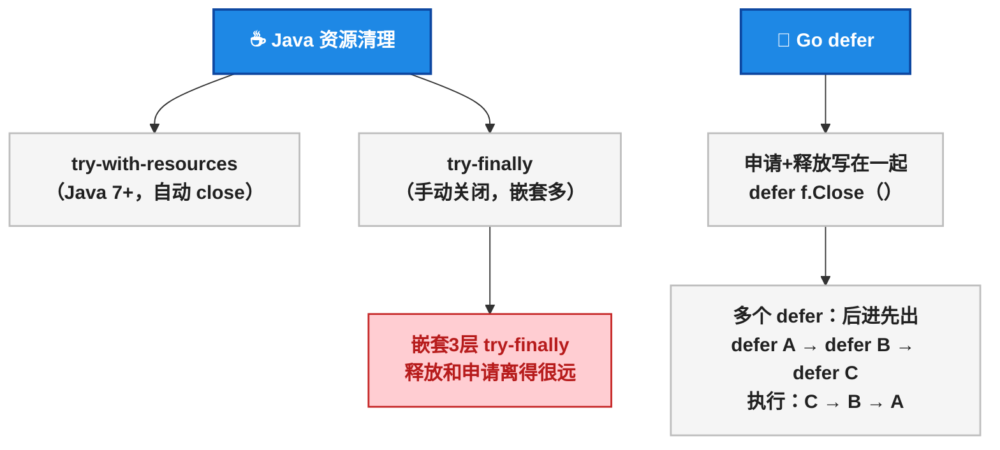
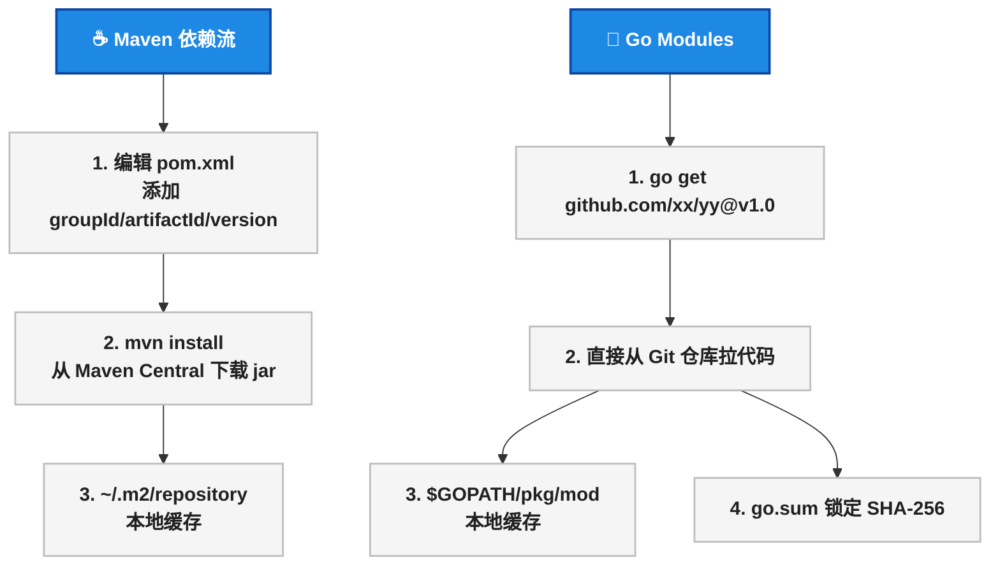

# Java vs Go：语法对比

打开 `.go` 文件，第一眼看到这些，脑子直接宕机：

```go
func getUser(id int) (*User, error) {
    if user, ok := cache.Load(id); ok {
        return user.(*User), nil
    }
    defer func() { metrics.Record("getUser") }()
    // ...
}
```

`:=` 是什么？ `*User` 和 `error` 为什么挤在返回值里？ `defer` 又是什么鬼？ `ok` 从哪冒出来的？

写了 5 年 Spring Boot，习惯了 `var user = new User()` 、 `try-catch-finally` 、 `public class` 之后，Go 的语法看起来像是故意反着来。这篇文章的目的就是一句话：<strong>把所有 Java 里习以为常的语法点，在 Go 里找到对应写法</strong> 。没有废话，全是代码对比。

> 📌 前置知识：本文假定读者有 Java 基础（Java 8+），了解基本的编程概念（变量、函数、循环、异常）。Go 版本为 1.22。

## 变量声明： `var` / `:=` 对比 Java 的类型声明

Java 声明变量的方式从"啰嗦"式进化到了 `var` ：

```java
// Java —— 三种写法，都在用
String name = "foo";           // 传统
var name = "foo";              // Java 10+ 类型推断
final String NAME = "foo";     // 常量
```

Go 只有两种，但多了关键特性——<strong>短变量声明</strong>：

```go
// Go —— 只有两种
var name string = "foo"        // 完整写法（较少用）
name := "foo"                  // 短变量声明，类型自动推断

// 常量
const NAME = "foo"             // Go 的 const，不是全大写也行

// 多变量声明
var x, y int = 1, 2
a, b := 3, 4
```

`:=` 是 Go 里使用频率最高的符号之一。它等价于 `var name = "foo"` 但更简洁。 <strong>`:=` 只能在函数内使用</strong>，包级别变量必须用 `var` 。

```go
package main

var globalVar = "包级别用 var"   // ✅

func main() {
    localVar := "函数内用 :="    // ✅
}
```

> ⚠️ 新手提示： `:=` 左边的变量如果已经声明过，会报编译错误。Go 不允许声明了变量却不使用——编译器直接拒绝。Java 里 `int x = 1;` 然后不用，只是一个 warning。

下面用一张表快速对照 Java 和 Go 的基本类型：

| 分类 | Java | Go |
|------|------|-----|
| 整数（有符号） | `int` （32 位）/ `long` （64 位） | `int` （平台相关，64 位机器 64 位）/ `int32` / `int64` |
| 整数（无符号） | 无 | `uint` / `uint32` / `uint64` |
| 浮点 | `float` （32 位）/ `double` （64 位） | `float32` / `float64` |
| 布尔 | `boolean` | `bool` |
| 字符串 | `String` （不可变，引用类型） | `string` （不可变，值类型行为） |
| 字节 | `byte` | `byte` （即 `uint8` ） |
| 字符 | `char` （16 位 Unicode） | `rune` （即 `int32` ，Unicode 码点） |
| 零值 | `null` | 每种类型有默认零值： `int` 是 `0` ， `string` 是 `""` ， `bool` 是 `false` ，指针是 `nil` |

> ⚠️ 新手提示：Go 的 `int` 大小取决于机器——64 位机器上就是 64 位。如果你存一个极大的数，在本地 Mac 上跑没问题，部署到 32 位 ARM 上就溢出。精确控制大小用 `int32` / `int64` 。

```mermaid
flowchart TD
    JavaVar["☕ Java 变量声明"] --> J1["显式类型：String s = \"hello\""]
    JavaVar --> J2["类型推断：var s = \"hello\"（Java 10+）"]
    JavaVar --> J3["常量：final String S = \"hello\""]
    
    GoVar["🐹 Go 变量声明"] --> G1["完整声明：var s string = \"hello\""]
    GoVar --> G2["短声明：s := \"hello\"（仅函数内）"]
    GoVar --> G3["常量：const S = \"hello\""]
    GoVar --> G4["多变量：a, b := 1, 2"]
    
    classDef root fill:#1E88E5,stroke:#0D47A1,stroke-width:2px,color:#FFFFFF,font-weight:bold
    classDef leaf fill:#F5F5F5,stroke:#BDBDBD,stroke-width:1.5px,color:#212121
    
    class JavaVar,GoVar root
    class J1,J2,J3,G1,G2,G3,G4 leaf
```

## 循环： `for` 统治一切

Java 里有 `for` （三段式）、 `for-each` （增强 for）、 `while` 、 `do-while` 、 `stream.forEach` 。Go 里 <strong>只有</strong> `for` ——它包揽了所有循环场景：

```java
// Java —— 五种循环
for (int i = 0; i < 10; i++) { }          // 三段式
for (var item : list) { }                  // for-each
while (condition) { }                      // while
do { } while (condition);                  // do-while
list.stream().forEach(item -> { });        // stream
```

```go
// Go —— 只有 for，全包了
for i := 0; i < 10; i++ { }               // 三段式（注意没有括号！）
for _, item := range list { }              // range 遍历 = Java for-each
for condition { }                          // while（连关键字都省了）
for { }                                    // 死循环
for i := range 10 { }                      // Go 1.22：遍历 0 ~ 9
```

Go 的三段式 `for` <strong>没有小括号</strong>，大括号 `{` 必须在同一行——这是硬性规定。

`range` 返回两个值：索引和元素。不需要索引用 `_` 丢弃（Go 不允许未使用的变量，但 `_` 除外）。

```go
// Go 1.22 新特性：range over int
for i := range 5 {
    fmt.Println(i) // 0 1 2 3 4
}
// 等价于 Java 的：
// for (int i = 0; i < 5; i++) { System.out.println(i); }
```

## 条件与 Switch：惊喜连连

### if —— 居然能带初始化语句

```java
// Java
int result = compute();
if (result > 0) {
    System.out.println(result);
}
```

```go
// Go —— if 可以带一个初始化语句
if result := compute(); result > 0 {
    fmt.Println(result)
}
// result 的作用域仅限于 if-else 块
```

这个特性在 Go 里非常常用——尤其是在处理 error 返回值的时候（后面会详细讲）。

### switch —— break 消失了

```java
// Java —— 每个 case 必须写 break，不然会穿透
switch (day) {
    case "MONDAY":
    case "TUESDAY":
        System.out.println("工作日");
        break;
    default:
        System.out.println("其他");
}
```

```go
// Go —— 自动 break，不需要手写
switch day {
case "MONDAY", "TUESDAY":    // 多值匹配
    fmt.Println("工作日")
default:
    fmt.Println("其他")
}
```

Go 的 switch 自动 break。如果需要 Java 的 fall-through 行为，显式写 `fallthrough` 关键字。而且 switch 后面可以没有表达式——直接替代一堆 if-else：

```go
// Go —— 无表达式 switch，等于一串 if-else
switch {
case score >= 90:
    grade = "A"
case score >= 80:
    grade = "B"
default:
    grade = "C"
}
```

## 函数：Go 最"反 Java 直觉"的地方

### 多返回值

Java 里函数只能返回一个值，要返回多个只能包装成对象。Go 原生支持多返回值：

```go
// Go —— 多返回值
func divide(a, b int) (int, error) {
    if b == 0 {
        return 0, errors.New("除数不能为 0")
    }
    return a / b, nil
}

result, err := divide(10, 2)
if err != nil {
    // 处理错误
}
```

对比 Java 的实现方式——要么抛异常，要么包装成 Result 对象：

```java
// Java —— 类似效果需要包装类或异常
public class DivisionResult {
    private final int result;
    private final String error;
    // constructor, getters...
}

// 或者直接抛异常
public static int divide(int a, int b) throws ArithmeticException {
    if (b == 0) throw new ArithmeticException("除数不能为 0");
    return a / b;
}
```

### 函数是一等公民

Go 里函数可以赋值给变量、作为参数传递、作为返回值：

```go
// Go —— 函数赋值给变量
add := func(a, b int) int {
    return a + b
}
result := add(3, 5) // 8

// Go —— 函数作为参数
func apply(nums []int, op func(int) int) []int {
    result := make([]int, len(nums))
    for i, v := range nums {
        result[i] = op(v)
    }
    return result
}

doubled := apply([]int{1, 2, 3}, func(n int) int { return n * 2 })
// doubled = [2, 4, 6]
```

Java 里类似的功能用 Lambda + `Function<T, R>` 接口实现：

```java
// Java —— Lambda 表达式（Java 8+）
Function<Integer, Integer> add = (a, b) -> a + b; // 编译错误！Function 只接受一个参数
BiFunction<Integer, Integer, Integer> add = (a, b) -> a + b;
var result = add.apply(3, 5); // 8
```

> ⚠️ 新手提示：Java 的 `Function<T, R>` 只接受一个参数，两个参数就得换 `BiFunction` ，三个参数得自己定义接口。Go 没有这个问题——函数签名是什么就是什么，不需要适配 `Function` 家族。

### defer：资源清理终极方案

Java 里清理资源用 `try-with-resources` （Java 7+）或 `try-finally` ：

```java
// Java —— try-with-resources
try (var reader = new BufferedReader(new FileReader("file.txt"))) {
    // 读取文件
} // 自动调用 close()

// Java —— 手动 finally
var conn = dataSource.getConnection();
try {
    // 操作数据库
} finally {
    conn.close();
}
```

Go 用 `defer` ——在函数返回前执行，而且 <strong>后进先出（LIFO, Last In First Out，后进先出）</strong>：

```go
// Go —— defer，资源申请和释放写在一起
func readFile(path string) error {
    f, err := os.Open(path)
    if err != nil {
        return err
    }
    defer f.Close() // 函数返回前一定执行

    // 读取文件...
    return nil
}
```

defer 的强大之处在于 <strong>先申请资源，紧接着写释放代码</strong>，它们挨在一起，不会忘记：

```go
func processDB() error {
    conn, err := db.Connect()
    if err != nil {
        return err
    }
    defer conn.Close()

    tx, err := conn.Begin()
    if err != nil {
        return err
    }
    defer tx.Rollback() // 如果 commit 了，Rollback 是 no-op

    // 执行 SQL...
    return tx.Commit()
}
```

对比 Java 里 `try-finally` 嵌套的情况——释放和申请离得很远。defer 的执行顺序是后进先出（像叠盘子），多个 defer 时按声明的 <strong>逆序</strong> 执行。



## 异常处理：最大的世界观冲击

这是 Java 程序员转 Go 最不适应的地方。先看一段代码对比：

```java
// Java —— 面向 try-catch 编程
public User getUser(Long id) {
    try {
        return userRepository.findById(id)
                .orElseThrow(() -> new NotFoundException("用户不存在"));
    } catch (NotFoundException e) {
        log.error("用户未找到: {}", id, e);
        throw e;
    } catch (DataAccessException e) {
        log.error("数据库异常", e);
        throw new ServiceException("查询用户失败", e);
    }
}
```

```go
// Go —— error 就是返回值
func (s *UserService) GetUser(id int64) (*User, error) {
    user, err := s.repo.FindByID(id)
    if err != nil {
        return nil, fmt.Errorf("查询用户失败: %w", err)
    }
    if user == nil {
        return nil, ErrNotFound
    }
    return user, nil
}
```

Go 没有 `try-catch-finally` ，没有 `throw` ，没有 `throws` 声明。 <strong>error 就是一个普通的返回值</strong> 。Go 的 `error` 本质上是一个接口：

```go
type error interface {
    Error() string
}
```

任何实现了 `Error() string` 方法的类型都可以作为 error 返回。这比 Java 的 `Throwable` 继承体系简单太多了。

下面是 Java 异常调用栈和 Go error 向上传播的对比：

<div style="display:flex;gap:20px;max-width:700px">
<div style="flex:1;border:2px solid #E64A19;border-radius:8px;padding:16px;background:#FFF3E0">
<div style="background:#1E88E5;color:#FFFFFF;padding:8px 12px;border-radius:4px 4px 0 0;font-weight:bold;text-align:center">☕ Java 异常链路</div>
<div style="padding:8px">
<div style="border:1px solid #BDBDBD;padding:8px;margin:4px 0;background:#F5F5F5">Controller → Service</div>
<div style="border:1px solid #BDBDBD;padding:8px;margin:4px 0;background:#F5F5F5;border-left:3px solid #E64A19">throws → ControllerAdvice</div>
<div style="border:1px solid #BDBDBD;padding:8px;margin:4px 0;background:#C8E6C9">Service → Repository</div>
<div style="border:1px solid #BDBDBD;padding:8px;margin:4px 0;background:#C8E6C9;border-left:3px solid #E64A19">throw new Exception ↻</div>
<div style="border:1px solid #BDBDBD;padding:8px;margin:4px 0;background:#C8E6C9;border-left:3px solid #E64A19">catch + log.error（）</div>
<div style="border:1px solid #BDBDBD;padding:8px;margin:4px 0;background:#F5F5F5">Repository → DB</div>
<div style="border:1px solid #BDBDBD;padding:8px;margin:4px 0;background:#F5F5F5;color:#C62828;font-weight:bold">❌ SQLException</div>
</div>
</div>
<div style="flex:1;border:2px solid #388E3C;border-radius:8px;padding:16px;background:#E8F5E9">
<div style="background:#1E88E5;color:#FFFFFF;padding:8px 12px;border-radius:4px 4px 0 0;font-weight:bold;text-align:center">🐹 Go Error 链路</div>
<div style="padding:8px">
<div style="border:1px solid #BDBDBD;padding:8px;margin:4px 0;background:#F5F5F5">Handler → Service</div>
<div style="border:1px solid #BDBDBD;padding:8px;margin:4px 0;background:#F5F5F5;border-left:3px solid #388E3C">if err != nil { return }</div>
<div style="border:1px solid #BDBDBD;padding:8px;margin:4px 0;background:#C8E6C9">Service → Repository</div>
<div style="border:1px solid #BDBDBD;padding:8px;margin:4px 0;background:#C8E6C9;border-left:3px solid #388E3C">if err != nil { return }</div>
<div style="border:1px solid #BDBDBD;padding:8px;margin:4px 0;background:#C8E6C9;border-left:3px solid #388E3C">fmt.Errorf("...: %w", err)</div>
<div style="border:1px solid #BDBDBD;padding:8px;margin:4px 0;background:#F5F5F5">Repository → DB</div>
<div style="border:1px solid #BDBDBD;padding:8px;margin:4px 0;background:#F5F5F5;color:#C62828;font-weight:bold">❌ sql.ErrNoRows</div>
</div>
</div>
</div>

关键差异：

- <strong>Java</strong>：异常打断正常控制流，沿着调用栈向上弹，谁 catch 谁处理。可能被中间某层的全局异常处理器截获，很难追踪。
- <strong>Go</strong>：error 就是返回值，每一层显式检查、显式传递、显式包装。调用链上一层一个 `if err != nil` ，没有隐藏的控制流。

### panic/recover —— 最后的保险

Go 也有类似异常的东西—— `panic` ，但它 <strong>不是用来处理业务错误的</strong>：

```go
// panic 用于真正的不可恢复错误
func mustCompileRegex(pattern string) *regexp.Regexp {
    re, err := regexp.Compile(pattern)
    if err != nil {
        panic(err) // 正则写错了，程序没法继续，直接挂
    }
    return re
}

// recover 只在 defer 里有效
func safeCall() {
    defer func() {
        if r := recover(); r != nil {
            fmt.Println("恢复自 panic:", r)
        }
    }()
    panic("出大事了") // 不会让程序崩溃
}
```

> ⚠️ 新手提示：Go 的 `panic` 不要当成 Java 的 `throw` 来用。业务错误用 `error` 返回值， `panic` 只给真正的不可恢复错误（数组越界、配置文件不存在等）。你写了一百次 `if err != nil` 很烦，但这正是 Go 的设计意图——<strong>错误处理是正常的控制流</strong>，不是"异常"。

## struct vs class：没有类的面向对象

Java 的世界观是 class。Go 的世界观是 struct。

```java
// Java —— class
public class User {
    private Long id;
    private String name;
    private int age;

    public User(Long id, String name, int age) {
        this.id = id;
        this.name = name;
        this.age = age;
    }

    public boolean isAdult() {
        return age >= 18;
    }
}

var user = new User(1L, "张三", 25);
System.out.println(user.isAdult());
```

```go
// Go —— struct
type User struct {
    ID   int64
    Name string
    age  int // 小写开头 = 包内私有
}

// 构造函数惯例：New + 类型名
func NewUser(id int64, name string, age int) *User {
    return &User{ID: id, Name: name, age: age}
}

// 方法绑定在 struct 上（receiver）
func (u *User) IsAdult() bool {
    return u.age >= 18
}

user := NewUser(1, "张三", 25)
fmt.Println(user.IsAdult())
```

几个关键差异：

| 概念 | Java | Go |
|------|------|-----|
| 类型定义 | `class` | `type xxx struct` |
| 构造 | `new Xxx()` / Builder 模式 | 惯例 `NewXxx()` 工厂函数 |
| 方法是类型的一部分 | 方法定义在类内部 | 方法通过 receiver 绑定在 struct 外部 |
| 访问控制 | `public` / `private` / `protected` | 首字母大小写（大写 = 公开） |
| this / self | `this` 关键字 | receiver 参数名（惯例用类型首字母小写） |
| 私有属性 | `private` | 小写开头 + 包级可见（同包内可见） |
| 继承 | `extends` | 无！用 struct 嵌入代替 |

### 访问控制：大写 = public

Go 的访问控制极其简单——<strong>首字母大写就是公开，小写就是包内私有</strong>：

```go
type User struct {
    ID   int64  // 大写 = 其他包可以访问
    Name string // 大写 = 公开
    age  int    // 小写 = 只在 user 包内可访问
}

func NewUser() *User { // 大写 = 公开函数
    return &User{}
}

func (u *User) validate() error { // 小写 = 包内方法
    // ...
}
```

没有 `protected` ，没有 `package-private` 关键字——<strong>所有小写开头的标识符在同一个包内互相可见</strong> 。

## 包管理与构建：从 Maven 到 Go Modules

Java 程序员最熟悉的两个命令大概是 `mvn clean install` 和 `mvn spring-boot:run` 。Go 的对等命令：

| 操作 | Maven | Gradle | Go |
|------|-------|--------|-----|
| 初始化项目 | 手写 pom.xml | `gradle init` | `go mod init github.com/user/project` |
| 添加依赖 | 编辑 pom.xml → `mvn install` | 编辑 build.gradle | `go get github.com/gin-gonic/gin@v1.9` |
| 下载所有依赖 | `mvn dependency:resolve` | `gradle build` | `go mod download` |
| 清理无用依赖 | 手动删 | 手动删 | `go mod tidy` |
| 编译 | `mvn compile` | `gradle compileJava` | `go build` |
| 运行测试 | `mvn test` | `gradle test` | `go test ./...` |
| 打包 | `mvn package` | `gradle build` | `go build -o app` |
| 依赖文件 | `pom.xml` | `build.gradle` | `go.mod` |
| 校验和锁定 | `pom.xml` 的 `<dependencyManagement>` | `gradle.lockfile` | `go.sum` |
| 查看依赖树 | `mvn dependency:tree` | `gradle dependencies` | `go mod graph` |

`go.mod` 相当于 `pom.xml` ，但 <strong>简洁到令人感动</strong>：

```
module github.com/example/myapp

go 1.22

require (
    github.com/gin-gonic/gin v1.9.1
    github.com/go-sql-driver/mysql v1.7.1
)
```

`go.sum` 记录了每个依赖的 SHA-256 哈希，确保你下载的代码和上次构建时一模一样——类似 Maven 的 `<dependencyManagement>` 锁定版本号的效果，但更安全（直接校验内容而非版本号）。

Go 没有中央仓库的概念——依赖直接从 Git 仓库拉。 `github.com/gin-gonic/gin` 既是一个 import 路径，也是真实的代码仓库地址。 <strong>不需要发布到 Maven Central</strong>，打个 tag 就发布了。



## 总结

下表覆盖了 Java 开发者最容易困惑的 Go 语法点：

| 场景 | Java | Go |
|------|------|-----|
| 变量声明 | `var name = "foo"` | `name := "foo"` |
| 常量 | `final String X = "x"` | `const X = "x"` |
| for 循环 | `for (int i=0; i<10; i++)` | `for i := 0; i < 10; i++` （无括号） |
| for-each | `for (var v : list)` | `for _, v := range list` |
| while | `while (cond)` | `for cond` |
| 死循环 | `while (true)` | `for {}` |
| switch | 每个 case 需 break | 自动 break， `fallthrough` 穿透 |
| 函数 | `public int add(int a, int b)` | `func add(a, b int) int` |
| 多返回值 | 需包装类或异常 | `func div(a,b int) (int, error)` |
| 资源清理 | `try-with-resources` / `finally` | `defer f.Close()` |
| 异常 | `try-catch-finally` | `if err != nil { return err }` |
| 类型定义 | `class User` | `type User struct` |
| 构造 | `new User(1L, "张三")` | `NewUser(1, "张三")` |
| 公开/私有 | `public` / `private` | 首字母大小写 |
| 依赖管理 | `pom.xml` + Maven Central | `go.mod` + 直接 Git 拉取 |

一句话总结：<strong>Go 的语法不是删了 Java 的东西，是用更少的关键字提供了同样的表达能力</strong> 。多返回值替代了 try-catch 和包装类，defer 替代了 finally 和 try-with-resources，首字母大小写替代了四个访问修饰符。

> 📖 <strong>下一步阅读</strong>：语法对比看完了，下一篇进入 Go 最核心的武器——[Go 并发编程：Goroutine、Channel 与 CSP 模型]()。goroutine 和 Java 虚拟线程到底差在哪？channel 如何替代你的 BlockingQueue？select 怎么写超时控制？用写了 5 年线程池的经验来理解 Go 并发。

---

<details><summary>参考资源</summary>

- Go 官方规范: [The Go Programming Language Specification](https://go.dev/ref/spec)
- Effective Go: [Effective Go](https://go.dev/doc/effective_go)
- Go Modules 参考: [Go Modules Reference](https://go.dev/ref/mod)
- Go 1.22 发布说明: [Go 1.22 Release Notes](https://go.dev/doc/go1.22)

</details>
