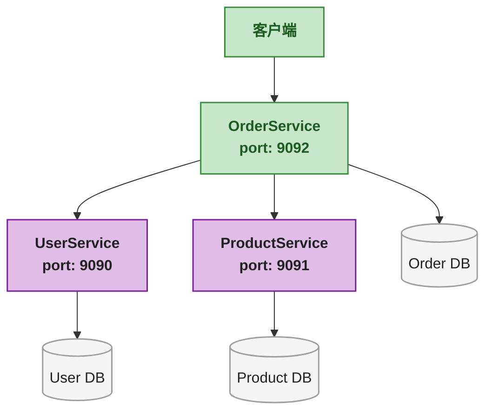
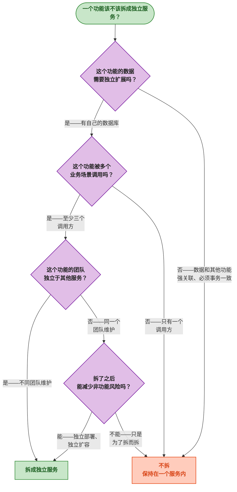

# 微服务拆分实战：以 proto 为契约

> 📖 <strong>前置阅读</strong>：本文假设读者已掌握 Protobuf 语法和 SpringBoot gRPC 的基本用法。如果还不熟悉，建议先阅读 [<strong>Protobuf 语法精讲与 gRPC 概念</strong>]() 和 [<strong>SpringBoot gRPC 全操作指南</strong>]()。

## 一、⚡ 微服务拆分后的第一个难题

你把这个巨大的 SpringBoot 单体应用拆成了三个微服务——订单服务、用户服务、商品服务。拆得很干净——各自有自己的数据库、各自独立部署。

然后你发现了一个问题：<strong>订单服务在创建订单时需要查用户信息、扣商品库存——这三个服务之间怎么通信？</strong>

```
创建订单的流程：
  OrderService → 查用户是否存在 → UserService
  OrderService → 查商品价格 + 库存 → ProductService
  OrderService → 创建订单 → 自己的数据库
```

REST 当然能做——但这里有一个更关键的问题：<strong>你怎么保证 OrderService 调 UserService 的参数格式不出错？</strong>

UserService 说它接收 `GET /users/{id}` 返回 `{"userId": 1, "userName": "张三"}`。OrderService 的开发者在代码里写了 `restTemplate.getForObject("/users/" + userId, UserDTO.class)` —— 但 UserDTO 的字段名是 `user_name` 还是 `userName`？谁说了算？

<strong>proto 文件就是"谁说了算"的答案——它就是服务之间的契约。</strong>

## 二、🧬 以 proto 为契约：核心思想

```
没有契约（REST 口头约定）：
  OrderService 开发者问 UserService 开发者："你的接口返回什么字段？"
  UserService 开发者："userName 和 userId"
  OrderService 写代码 → 字段名写成了 username → 运行时炸了

有契约（proto）：
  user.proto 里写死了 User 的字段和类型
  UserService 实现时 → 必须遵守
  OrderService 调用时 → 编译器帮你检查
  → 字段名不一致？编译都过不了——根本跑不起来
```

<strong>proto 是微服务之间的"合同"</strong>——双方签字画押，编译器当法官。谁不遵守谁编译不过。

相比于 REST 的 Swagger / OpenAPI 文档——proto 是<strong>强类型、编译期检查、多语言通用</strong>的接口定义。Swagger 文档可能和代码不一致——proto 不一致就是编译错误。

## 三、🏗️ 多服务项目的 Maven 结构

### 3.1 从单服务到多服务

前一篇文章的 `grpc-demo` 只有三个模块——`grpc-api`、`grpc-server`、`grpc-client`。在真正的微服务项目中，<strong>每个微服务都有自己的 proto 文件</strong>，同时还会有<strong>公共 proto</strong>被多个服务共享。

```
ecommerce-platform/                          # 父项目
├── pom.xml                                  # 父 POM——统一依赖版本
│
├── proto-common/                            # ① 公共 proto 模块——所有服务共享
│   ├── pom.xml
│   └── src/main/proto/common/
│       ├── common.proto                     # 公共消息类型
│       ├── error.proto                      # 统一错误模型
│       └── pagination.proto                 # 分页请求/响应
│
├── proto-user/                              # ② 用户服务的 proto——对外暴露的契约
│   ├── pom.xml
│   └── src/main/proto/
│       └── user_service.proto
│
├── proto-product/                           # ③ 商品服务的 proto
│   ├── pom.xml
│   └── src/main/proto/
│       └── product_service.proto
│
├── proto-order/                             # ④ 订单服务的 proto
│   ├── pom.xml
│   └── src/main/proto/
│       └── order_service.proto
│
├── user-service/                            # ⑤ 用户服务的实现
│   ├── pom.xml                              # 依赖 proto-common + proto-user
│   └── src/main/java/...
│
├── product-service/                         # ⑥ 商品服务的实现
│   ├── pom.xml                              # 依赖 proto-common + proto-product
│   └── src/main/java/...
│
└── order-service/                           # ⑦ 订单服务的实现
    ├── pom.xml                              # 依赖 proto-common + proto-order
    │                                        #          + proto-user（调用户）
    │                                        #          + proto-product（调商品）
    └── src/main/java/...
```

<strong>核心规则</strong>：

| 规则 | 说明 |
|------|------|
| <strong>每个服务有自己的 proto 模块</strong> | 只包含该服务对外暴露的 RPC 方法和相关 message |
| <strong>公共类型放 proto-common</strong> | 多个服务共用的 message、枚举、错误模型——放公共模块 |
| <strong>服务实现模块依赖它需要调用的 proto</strong> | OrderService 调 UserService → order-service 依赖 proto-user |
| <strong>proto 模块只包含 .proto 文件 + protobuf-maven-plugin</strong> | 编译后生成 Java 类——被其他模块引用 |

### 3.2 父 POM 统一版本

```xml
<!-- ecommerce-platform/pom.xml —— 父 POM -->
<groupId>com.example</groupId>
<artifactId>ecommerce-platform</artifactId>
<version>1.0.0</version>
<packaging>pom</packaging>

<modules>
    <module>proto-common</module>
    <module>proto-user</module>
    <module>proto-product</module>
    <module>proto-order</module>
    <module>user-service</module>
    <module>product-service</module>
    <module>order-service</module>
</modules>

<dependencyManagement>
    <dependencies>
        <!-- gRPC BOM——统一管理 gRPC 相关依赖的版本 -->
        <dependency>
            <groupId>io.grpc</groupId>
            <artifactId>grpc-bom</artifactId>
            <version>1.60.0</version>
            <type>pom</type>
            <scope>import</scope>
        </dependency>
        <!-- 自己的 proto 模块——统一版本 -->
        <dependency>
            <groupId>com.example</groupId>
            <artifactId>proto-common</artifactId>
            <version>${project.version}</version>
        </dependency>
        <dependency>
            <groupId>com.example</groupId>
            <artifactId>proto-user</artifactId>
            <version>${project.version}</version>
        </dependency>
        <dependency>
            <groupId>com.example</groupId>
            <artifactId>proto-product</artifactId>
            <version>${project.version}</version>
        </dependency>
        <dependency>
            <groupId>com.example</groupId>
            <artifactId>proto-order</artifactId>
            <version>${project.version}</version>
        </dependency>
    </dependencies>
</dependencyManagement>
```

### 3.3 公共 proto 模块

```xml
<!-- proto-common/pom.xml -->
<dependencies>
    <dependency>
        <groupId>io.grpc</groupId>
        <artifactId>grpc-protobuf</artifactId>
    </dependency>
    <dependency>
        <groupId>io.grpc</groupId>
        <artifactId>grpc-stub</artifactId>
    </dependency>
</dependencies>
```

```protobuf
// proto-common/src/main/proto/common/common.proto
syntax = "proto3";
package common;
option java_multiple_files = true;
option java_package = "com.example.common";

// 分页请求——所有列表查询都用这个
message PageRequest {
  int32 page = 1;       // 页码——从 1 开始
  int32 page_size = 2;  // 每页条数——默认 20
}

// 分页响应
message PageResponse {
  int32 total = 1;       // 总记录数
  int32 page = 2;        // 当前页码
  int32 page_size = 3;   // 每页条数
}

// 统一错误模型——所有服务返回错误都用这个
message ErrorInfo {
  string code = 1;       // 错误码——如 "USER_NOT_FOUND"
  string message = 2;    // 人类可读的错误信息
  map<string, string> details = 3; // 额外的错误详情
}
```

```protobuf
// proto-common/src/main/proto/common/pagination.proto
syntax = "proto3";
package common;
option java_multiple_files = true;
option java_package = "com.example.common";
```

> ⚠️ 新手提示：`java_package` 要写成和 Java 项目一致的包名。如果不写，生成的类会放到和 proto 的 `package` 声明一致的包下——但 proto 的 package 一般用的是 `common` 这种短名称，Java 端不好管理。

### 3.4 用户服务的 proto——一个完整的服务契约

```protobuf
// proto-user/src/main/proto/user_service.proto
syntax = "proto3";
package user;
option java_multiple_files = true;
option java_package = "com.example.user";

import "common/common.proto";

// ===== 数据模型 =====
message User {
  int64 user_id = 1;
  string user_name = 2;
  string email = 3;
  string phone = 4;
  int32 status = 5;  // 0=正常, 1=禁用, 2=已删除
  int64 created_at = 6; // 用 unix 毫秒时间戳
}

// ===== 请求/响应定义 =====
message GetUserRequest {
  int64 user_id = 1;
}

message BatchGetUserRequest {
  repeated int64 user_ids = 1;  // 批量查询——一次查多个用户
}

message BatchGetUserResponse {
  repeated User users = 1;      // 返回找到的用户列表
}

message ListUsersRequest {
  string keyword = 1;           // 搜索关键字
  common.PageRequest page = 2;  // 使用公共分页类型
}

message ListUsersResponse {
  repeated User users = 1;
  common.PageResponse page_info = 2;
}

// ===== RPC 方法定义 =====
// 这是 UserService 对外暴露的契约——所有调用方都看到的
service UserService {
  rpc GetUser(GetUserRequest) returns (User);
  rpc BatchGetUsers(BatchGetUserRequest) returns (BatchGetUserResponse);
  rpc ListUsers(ListUsersRequest) returns (ListUsersResponse);
}
```

### 3.5 商品服务的 proto

```protobuf
// proto-product/src/main/proto/product_service.proto
syntax = "proto3";
package product;
option java_multiple_files = true;
option java_package = "com.example.product";

import "common/common.proto";

message Product {
  int64 product_id = 1;
  string product_name = 2;
  int64 price_fen = 3;          // 金额用分——避免浮点精度问题
  int32 stock_quantity = 4;     // 库存数量
  int32 status = 5;             // 0=上架, 1=下架
}

message GetProductRequest {
  int64 product_id = 1;
}

message BatchGetProductRequest {
  repeated int64 product_ids = 1;
}

message BatchGetProductResponse {
  repeated Product products = 1;
}

// 扣减库存请求
message DeductStockRequest {
  int64 product_id = 1;
  int32 quantity = 2;          // 扣减数量——必须是正数
}

message DeductStockResponse {
  bool success = 1;
  string message = 2;          // 失败时的原因——如 "库存不足"
  int32 remaining_stock = 3;   // 扣减后的剩余库存
}

service ProductService {
  rpc GetProduct(GetProductRequest) returns (Product);
  rpc BatchGetProducts(BatchGetProductRequest) returns (BatchGetProductResponse);
  rpc DeductStock(DeductStockRequest) returns (DeductStockResponse);
}
```

### 3.6 订单服务的 proto

```protobuf
// proto-order/src/main/proto/order_service.proto
syntax = "proto3";
package order;
option java_multiple_files = true;
option java_package = "com.example.order";

import "common/common.proto";

message Order {
  int64 order_id = 1;
  int64 user_id = 2;
  string user_name = 3;        // 冗余的用户名——避免每次都去查 UserService
  repeated OrderItem items = 4;
  int64 total_amount_fen = 5;  // 订单总金额（分）
  int32 status = 6;            // 0=待支付, 1=已支付, 2=已取消
  int64 created_at = 7;
}

message OrderItem {
  int64 product_id = 1;
  string product_name = 2;     // 冗余的商品名——下单后即使商品改名也不影响
  int64 price_fen = 3;         // 下单时的价格——商品后续改价不影响已下订单
  int32 quantity = 4;
}

message CreateOrderRequest {
  int64 user_id = 1;
  repeated CreateOrderItem items = 2;
}

message CreateOrderItem {
  int64 product_id = 1;
  int32 quantity = 2;
}

message CreateOrderResponse {
  bool success = 1;
  string message = 2;
  Order order = 3;             // 创建成功时返回完整的订单信息
}

message GetOrderRequest {
  int64 order_id = 1;
}

message ListOrdersRequest {
  int64 user_id = 1;
  common.PageRequest page = 2;
}

message ListOrdersResponse {
  repeated Order orders = 1;
  common.PageResponse page_info = 2;
}

service OrderService {
  rpc CreateOrder(CreateOrderRequest) returns (CreateOrderResponse);
  rpc GetOrder(GetOrderRequest) returns (Order);
  rpc ListOrders(ListOrdersRequest) returns (ListOrdersResponse);
}
```

## 四、🔌 服务间调用：OrderService 怎么调 UserService 和 ProductService

### 4.1 order-service 的依赖

```xml
<!-- order-service/pom.xml -->
<dependencies>
    <!-- 自己的 proto——暴露给别人的 -->
    <dependency>
        <groupId>com.example</groupId>
        <artifactId>proto-order</artifactId>
    </dependency>
    <!-- 要调用的服务的 proto——作为客户端 -->
    <dependency>
        <groupId>com.example</groupId>
        <artifactId>proto-user</artifactId>
    </dependency>
    <dependency>
        <groupId>com.example</groupId>
        <artifactId>proto-product</artifactId>
    </dependency>
    <!-- 公共类型 -->
    <dependency>
        <groupId>com.example</groupId>
        <artifactId>proto-common</artifactId>
    </dependency>
    <!-- gRPC Server + Client starter——OrderService 既是 Server 也是 Client -->
    <dependency>
        <groupId>net.devh</groupId>
        <artifactId>grpc-server-spring-boot-starter</artifactId>
        <version>3.0.0.RELEASE</version>
    </dependency>
    <dependency>
        <groupId>net.devh</groupId>
        <artifactId>grpc-client-spring-boot-starter</artifactId>
        <version>3.0.0.RELEASE</version>
    </dependency>
</dependencies>
```

### 4.2 order-service 的配置

```yaml
# order-service/src/main/resources/application.yml
grpc:
  server:
    port: 9092                    # OrderService 自己的 gRPC 端口
  client:
    user-service:                 # 用户服务的 client
      address: static://localhost:9090
      negotiation-type: plaintext
    product-service:              # 商品服务的 client
      address: static://localhost:9091
      negotiation-type: plaintext

spring:
  application:
    name: order-service
server:
  port: 8082                      # REST Controller 端口（如果有）
```

### 4.3 订单创建——一个完整的跨服务调用实现

这是本文最核心的代码：OrderService 创建订单时，调 UserService 查用户、调 ProductService 查价格和扣库存。

```java
// order-service——@GrpcService 暴露订单服务 + @GrpcClient 调用别的服务
@GrpcService
public class OrderServiceImpl extends OrderServiceGrpc.OrderServiceImplBase {

    // 注入别的服务的 Stub
    @GrpcClient("user-service")
    private UserServiceGrpc.UserServiceBlockingStub userStub;

    @GrpcClient("product-service")
    private ProductServiceGrpc.ProductServiceBlockingStub productStub;

    // 订单数据——模拟数据库
    private final Map<Long, Order> orderDB = new ConcurrentHashMap<>();
    private final AtomicLong idGenerator = new AtomicLong(1);

    @Override
    public void createOrder(CreateOrderRequest request,
                            StreamObserver<CreateOrderResponse> responseObserver) {

        Long userId = request.getUserId();

        // ===== 第一步：调用户服务——查用户是否存在 =====
        User user;
        try {
            user = userStub
                    .withDeadlineAfter(3, TimeUnit.SECONDS)
                    .getUser(GetUserRequest.newBuilder()
                            .setUserId(userId)
                            .build());
        } catch (StatusRuntimeException e) {
            if (e.getStatus().getCode() == Status.Code.NOT_FOUND) {
                responseObserver.onNext(CreateOrderResponse.newBuilder()
                        .setSuccess(false)
                        .setMessage("用户不存在——userId: " + userId)
                        .build());
                responseObserver.onCompleted();
                return;
            }
            responseObserver.onError(e);
            return;
        }

        // ===== 第二步：批量查商品——拿到价格和名称 =====
        List<Long> productIds = request.getItemsList().stream()
                .map(CreateOrderItem::getProductId)
                .toList();

        Map<Long, Product> productMap;
        try {
            BatchGetProductResponse productResp = productStub
                    .withDeadlineAfter(3, TimeUnit.SECONDS)
                    .batchGetProducts(BatchGetProductRequest.newBuilder()
                            .addAllProductIds(productIds)
                            .build());
            // 转成 Map 方便下面查找
            productMap = productResp.getProductsList().stream()
                    .collect(Collectors.toMap(Product::getProductId, p -> p));
        } catch (StatusRuntimeException e) {
            responseObserver.onError(e);
            return;
        }

        // ===== 第三步：校验——商品是否存在、库存是否足够 =====
        long totalAmountFen = 0;
        List<OrderItem> orderItems = new ArrayList<>();

        for (CreateOrderItem item : request.getItemsList()) {
            Product product = productMap.get(item.getProductId());
            if (product == null) {
                responseObserver.onNext(CreateOrderResponse.newBuilder()
                        .setSuccess(false)
                        .setMessage("商品不存在——productId: " + item.getProductId())
                        .build());
                responseObserver.onCompleted();
                return;
            }
            if (product.getStockQuantity() < item.getQuantity()) {
                responseObserver.onNext(CreateOrderResponse.newBuilder()
                        .setSuccess(false)
                        .setMessage("库存不足——productId: " + item.getProductId()
                                + ", 剩余: " + product.getStockQuantity()
                                + ", 需要: " + item.getQuantity())
                        .build());
                responseObserver.onCompleted();
                return;
            }
            // 计算金额——下单时的价格冻结到订单中
            totalAmountFen += product.getPriceFen() * item.getQuantity();
            orderItems.add(OrderItem.newBuilder()
                    .setProductId(product.getProductId())
                    .setProductName(product.getProductName())
                    .setPriceFen(product.getPriceFen())
                    .setQuantity(item.getQuantity())
                    .build());
        }

        // ===== 第四步：扣减库存 =====
        for (CreateOrderItem item : request.getItemsList()) {
            DeductStockResponse deductResp = productStub
                    .deductStock(DeductStockRequest.newBuilder()
                            .setProductId(item.getProductId())
                            .setQuantity(item.getQuantity())
                            .build());
            if (!deductResp.getSuccess()) {
                responseObserver.onNext(CreateOrderResponse.newBuilder()
                        .setSuccess(false)
                        .setMessage("扣减库存失败: " + deductResp.getMessage())
                        .build());
                responseObserver.onCompleted();
                return;
            }
        }

        // ===== 第五步：创建订单 =====
        long orderId = idGenerator.getAndIncrement();
        Order order = Order.newBuilder()
                .setOrderId(orderId)
                .setUserId(userId)
                .setUserName(user.getUserName())  // 冗余用户名——订单独立可展示
                .addAllItems(orderItems)
                .setTotalAmountFen(totalAmountFen)
                .setStatus(0)  // 待支付
                .setCreatedAt(System.currentTimeMillis())
                .build();

        orderDB.put(orderId, order);

        responseObserver.onNext(CreateOrderResponse.newBuilder()
                .setSuccess(true)
                .setMessage("订单创建成功")
                .setOrder(order)
                .build());
        responseObserver.onCompleted();
    }
}
```

### 4.4 调用关系图



<strong>OrderService 在这个架构中是"编排者"</strong>——它自己不持有用户和商品的数据，但它知道调用谁去获取这些数据。这就是微服务的本质——每个服务拥有自己的数据，通过 RPC 协作完成业务。

## 五、🔄 DTO 与 Domain Entity 的转换

### 5.1 为什么需要转换

proto 编译生成的 Java 类是<strong>数据传输对象（DTO）</strong>——它们的唯一目的是在网络中传输。但你的业务代码中有自己的<strong>领域模型（Domain Entity）</strong>——它们可能：

- 有额外的方法（业务逻辑）
- 有不同的字段命名（proto 用 `user_name`，Java 用 `userName`）
- 有 proto 不支持的类型（如 `BigDecimal`、`LocalDateTime`）
- 有 JPA 注解

<strong>不要把 proto 生成的类直接当 Domain Entity 用——它们不是为这个设计的。</strong>

### 5.2 转换层实现

```java
// ===== Domain Entity =====
// user-service/src/main/java/.../domain/UserEntity.java
@Entity
@Table(name = "users")
public class UserEntity {

    @Id
    @GeneratedValue(strategy = GenerationType.IDENTITY)
    private Long id;               // 数据库主键

    @Column(name = "user_name")
    private String userName;

    @Column(name = "email")
    private String email;

    @Column(name = "phone")
    private String phone;

    @Column(name = "status")
    private Integer status;        // JPA 中 Integer 可以为 null——proto 不行

    @Column(name = "created_at")
    private LocalDateTime createdAt; // JPA 支持的 Java 类型

    // getter / setter 省略
}
```

```java
// ===== 转换器 =====
// user-service/src/main/java/.../converter/UserConverter.java
// 负责 proto DTO ↔ Domain Entity 的双向转换
@Component
public class UserConverter {

    // Domain → Proto（查询后返回给调用方）
    public User toProto(UserEntity entity) {
        if (entity == null) return null;
        return User.newBuilder()
                .setUserId(entity.getId())
                .setUserName(entity.getUserName())
                .setEmail(entity.getEmail() != null ? entity.getEmail() : "")
                .setPhone(entity.getPhone() != null ? entity.getPhone() : "")
                .setStatus(entity.getStatus() != null ? entity.getStatus() : 0)
                // proto 中没有 LocalDateTime——转成 unix 毫秒时间戳
                .setCreatedAt(entity.getCreatedAt() != null
                        ? entity.getCreatedAt().toInstant(ZoneOffset.UTC).toEpochMilli()
                        : 0)
                .build();
    }

    // Proto → Domain（接收调用方的请求后写入数据库）
    public UserEntity toDomain(GetUserRequest request) {
        // 这里只是查询——不需要创建 Entity
        return null; // 实际不这样用——只是示意
    }

    // 批量转换
    public List<User> toProtoList(List<UserEntity> entities) {
        return entities.stream()
                .map(this::toProto)
                .toList();
    }
}
```

```java
// ===== Service 层使用 Converter =====
// user-service/src/main/java/.../service/UserService.java
@Service
public class UserService {

    @Autowired
    private UserRepository userRepository;  // JPA Repository

    @Autowired
    private UserConverter userConverter;

    public User getUser(Long userId) {
        UserEntity entity = userRepository.findById(userId)
                .orElseThrow(() -> new RuntimeException("用户不存在"));
        return userConverter.toProto(entity);  // Domain → Proto
    }

    public BatchGetUserResponse batchGetUsers(List<Long> userIds) {
        List<UserEntity> entities = userRepository.findAllById(userIds);
        return BatchGetUserResponse.newBuilder()
                .addAllUsers(userConverter.toProtoList(entities))
                .build();
    }
}
```

```java
// ===== gRPC Service 层——薄薄的一层 =====
// user-service/src/main/java/.../grpc/UserGrpcService.java
@GrpcService
public class UserGrpcService extends UserServiceGrpc.UserServiceImplBase {

    @Autowired
    private UserService userService;

    @Override
    public void getUser(GetUserRequest request,
                        StreamObserver<User> responseObserver) {
        try {
            User user = userService.getUser(request.getUserId());
            responseObserver.onNext(user);
            responseObserver.onCompleted();
        } catch (RuntimeException e) {
            responseObserver.onError(
                Status.NOT_FOUND.withDescription(e.getMessage()).asRuntimeException());
        }
    }

    @Override
    public void batchGetUsers(BatchGetUserRequest request,
                              StreamObserver<BatchGetUserResponse> responseObserver) {
        BatchGetUserResponse response = userService.batchGetUsers(
                request.getUserIdsList());
        responseObserver.onNext(response);
        responseObserver.onCompleted();
    }
}
```

### 5.3 分层架构总览

```
gRPC 客户端调用
     ↓ 网络（Protobuf 二进制）
[gRPC Service 层]  ← 薄薄一层——只负责接收请求和返回响应
     ↓ 调用
[Application Service 层]  ← 业务逻辑——编排、校验、转换
     ↓ 调用
[Domain Entity + Repository]  ← JPA Entity、数据访问
     ↓
[数据库]
```

<strong>每一层干该干的事</strong>：gRPC 层只管收发 proto 消息，Service 层管业务逻辑和转换，Domain 层管数据和持久化。proto 生成的类不穿透到 Domain 层——这样才能在 proto 定义变化时，只改 Converter 而不用改动业务逻辑。

## 六、🌿 proto 版本管理——契约演化的正确姿势

### 6.1 问题：你想给 User 加一个 `avatar_url` 字段

```protobuf
message User {
  int64 user_id = 1;
  string user_name = 2;
  string email = 3;
  string phone = 4;
  int32 status = 5;
  int64 created_at = 6;
  string avatar_url = 7;  // ← 新增字段——用新编号 7
}
```

proto 新增字段是<strong>向后兼容的</strong>——旧客户端不传这个字段，新服务端拿到的是默认值（空字符串）。旧客户端不需要更新。

<strong>向后兼容规则</strong>：

| 操作 | 兼容性 | 说明 |
|------|:---:|------|
| 新增字段 | ✅ 兼容 | 旧客户端不传——服务端拿到默认值。编号必须是新的 |
| 删除字段 | ✅ 有条件兼容 | 必须把编号加入 `reserved`——防止后人复用 |
| 重命名字段 | ✅ 兼容 | proto 序列化只认编号不看字段名——改名不影响序列化 |
| 修改字段类型 | ❌ 不兼容 | 旧数据是 int64——新代码按 string 解析——崩 |
| 修改字段编号 | ❌ 不兼容 | 相当于删除字段 + 新增字段——数据错乱 |

### 6.2 删除字段的正确做法

```protobuf
message User {
  // 删掉 phone 字段——但保留编号 4
  reserved 4;              // 编号 4 永远不用
  reserved "phone";        // 字段名也保留——防止乱用

  int64 user_id = 1;
  string user_name = 2;
  string email = 3;
  // int32 status = 5;     // 保留但不再使用
  // reserved 5; 也可以
  int64 created_at = 6;
  string avatar_url = 7;
}
```

<strong>永远不要删掉一个字段只删了那行代码</strong>——必须同时 `reserved` 它的编号。否则三个月后——新同事加了个 `string phone = 4`，旧客户端发过来的数据中编号 4 是老格式——数据错乱。

### 6.3 proto 版本管理策略

```
方案一（推荐）：proto 文件和服务代码放在一起——按服务版本管理
  用户服务 v1.0 → proto-user 1.0
  用户服务 v1.1 → proto-user 1.1（只加了字段——兼容）
  用户服务 v2.0 → proto-user 2.0（有不兼容改动——Breaking Change）

方案二：proto 独立仓库——多语言项目的选择
  git@github.com:company/protos.git
  有 Java、Go、Python 各自生成代码
  → 通过 Git submodule 或单独的 artifact 仓库分发
```

对于大多数 Java 微服务项目——<strong>方案一就够用了</strong>。Proto 模块和 Service 模块在同一个 Maven 项目中——版本一致，改动同步。只有当你有多个语言的服务调用同一个 gRPC 服务时——独立 proto 仓库才有价值。

### 6.4 Breaking Change 怎么处理

当确实有不兼容的改动（比如把字段类型从 `int64` 改成 `string`）——<strong>必须新增一个 RPC 方法而不是修改旧的</strong>：

```protobuf
service UserService {
  // v1——返回 int64 类型的 userId
  rpc GetUser(GetUserRequest) returns (User);

  // v2——新增方法，UserV2 中使用 string 类型的 userId
  rpc GetUserV2(GetUserRequest) returns (UserV2);
}
// 两个方法同时存在——老客户端调 GetUser，新客户端调 GetUserV2
// 等所有老客户端都升级后——才删掉 GetUser（记得 reserved）
```

## 七、🧩 服务边界设计模式

### 7.1 什么时候该拆成一个独立的服务？

这是微服务拆分中最容易犯的错——<strong>过早拆分</strong>。拆得太碎——一个创建订单的流程调四个服务，其中一个挂了整个流程全挂。



### 7.2 订单和商品——一定要拆成两个服务吗？

回到我们的电商例子——订单服务调商品服务扣库存。这里有一个分布式事务问题：

```java
// ❌ 问题：创建订单和扣库存不在同一个数据库事务中
// ① 创建订单成功 → ② 扣库存 → ③ 扣库存失败 → ④ 订单已写入——回不来了
// 这就是分布式一致性问题——不在本文范围，但要知道它的存在
```

<strong>如果你的系统规模还小</strong>（日订单量 < 1000）——订单、商品、库存放在同一个服务里可能是更好的选择。不需要分布式事务、不需要 RPC 调用——一个数据库事务搞定。

<strong>Proto 契约可以先定义好</strong>——即使现在不拆，proto 文件提前定义好了接口，未来拆分时直接用。

### 7.3 数据冗余——不是坏事

注意 Order 中冗余了 `user_name` 和 `product_name`：

```protobuf
message Order {
  int64 order_id = 1;
  int64 user_id = 2;
  string user_name = 3;        // ← 冗余——UserService 里也有
  repeated OrderItem items = 4;
  // ...
}

message OrderItem {
  int64 product_id = 1;
  string product_name = 2;     // ← 冗余——ProductService 里也有
  int64 price_fen = 3;         // ← 下单时的价格快照
  int32 quantity = 4;
}
```

<strong>这是故意的</strong>。微服务中适当的数据冗余能显著减少跨服务调用：
- 展示订单详情时——不需要再调 UserService 和 ProductService
- 用户改名、商品改名——已下的订单不受影响（下单时已经快照了）
- 一个服务挂了——不影响其他服务展示已有数据

## 八、📋 微服务拆分 Checklist

| # | 检查项 | 为什么 |
|:--:|------|------|
| 1 | <strong>每个服务有独立的 proto 模块</strong> | proto 是契约——独立模块让调用方只依赖接口，不依赖实现 |
| 2 | <strong>公共类型放 proto-common</strong> | 分页、错误模型在多服务中复用——避免重复定义 |
| 3 | <strong>proto 生成的类只用于传输</strong> | DTO 和 Domain 分离——proto 变更不影响业务逻辑 |
| 4 | <strong>金额用 int64 存"分"</strong> | 避免浮点精度——proto 中没有 BigDecimal |
| 5 | <strong>时间用 int64 存 unix 毫秒时间戳</strong> | 跨语言一致——或者用 `google.protobuf.Timestamp` |
| 6 | <strong>删除字段必须先 reserved</strong> | 防止字段编号被复用导致数据错乱 |
| 7 | <strong>Data Transfer Object vs Domain Entity 之间有 Converter</strong> | 双向转换集中管理——不要让 proto 类渗透到业务逻辑 |
| 8 | <strong>gRPC Service 层要薄</strong> | 只负责参数提取和错误转换——业务逻辑放 Application Service |
| 9 | <strong>Breaking Change 用新方法而不是改旧方法</strong> | 兼容老客户端——V2 方法并行存在 |
| 10 | <strong>适当冗余数据——减少跨服务调用</strong> | 订单中冗余用户名和商品名——展示订单时不需要调其他服务 |

## 🎯 总结

1. <strong>proto 是微服务之间的契约</strong>：它比 Swagger 更可靠——字段不一致就是编译错误，不是运行时检测。每个服务一个 proto 模块——调用方只依赖它不需要知道实现。

2. <strong>分层要清楚</strong>：gRPC Service（薄层收发 proto 消息）→ Application Service（业务逻辑 + 转换）→ Domain Entity（数据 + 持久化）。proto 生成的类只停留在传输层——不穿透到业务逻辑中。

3. <strong>proto 版本管理靠规则</strong>：增字段和删字段（加 reserved）兼容，改类型和改编号不兼容。Breaking Change 用 V2 方法——不删旧方法。

4. <strong>不要为了拆而拆</strong>：订单量 < 1000 时——订单、商品、库存放在同一个服务中更合理。但 proto 可以先定义好——为未来的拆分做铺垫。

---

> 📖 <strong>下一步阅读</strong>：微服务内部的 gRPC 调通了——前端怎么调？浏览器不支持 gRPC 协议——需要一个 HTTP 网关把 gRPC 转成 RESTful JSON。生产环境还需要负载均衡、健康检查、TLS——继续阅读 [<strong>gRPC Gateway 与生产环境部署</strong>]()。
