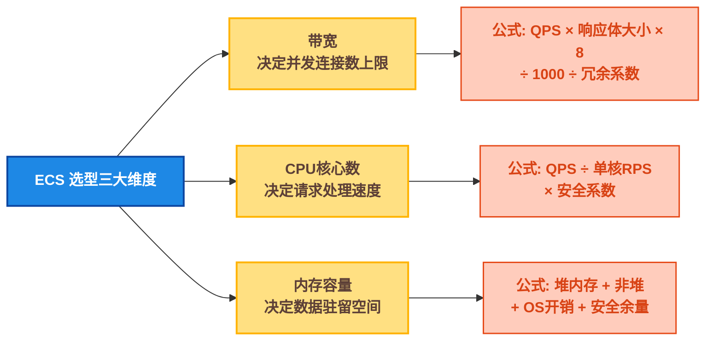
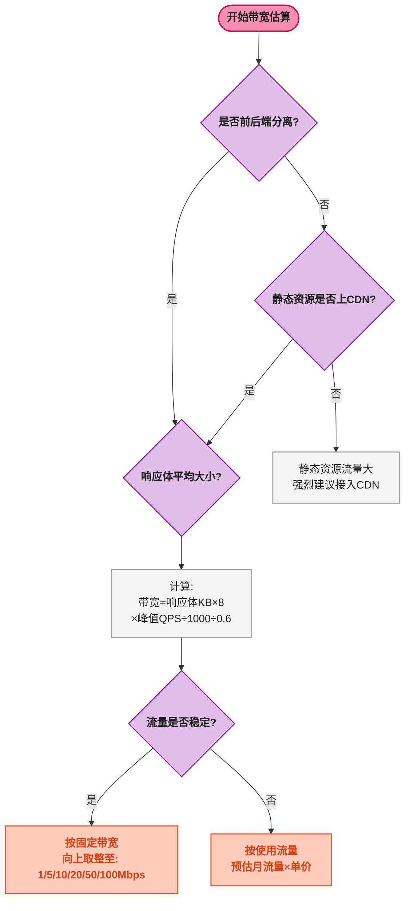
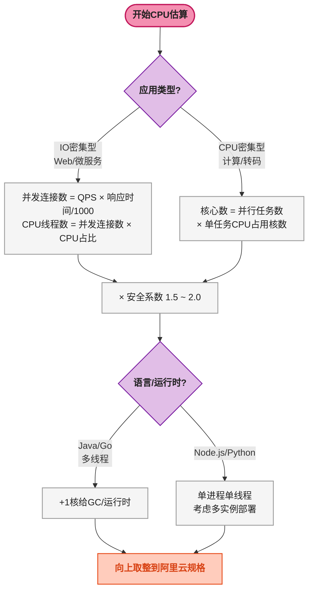
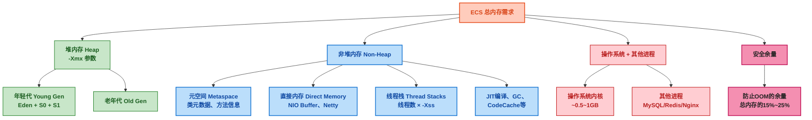
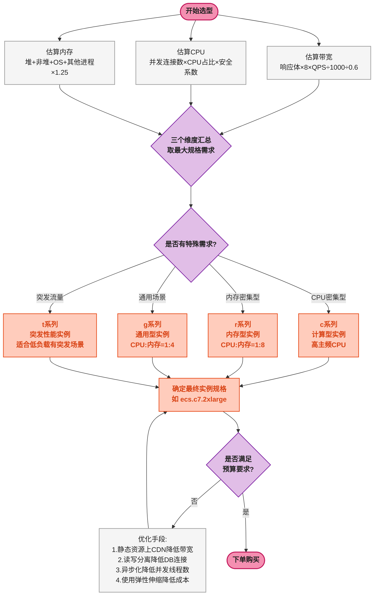

# ☁️ 云服务器选型实战：带宽、CPU、内存容量估算方法论 —— 以阿里云 ECS 为例

## 📌 一、问题切入：新项目上云，ECS 实例怎么选？

小张接到一个新项目——做一个面向 C 端用户的电商小程序后端，预计日均 UV 5 万，高峰期 QPS（每秒请求数）约 500 📊。技术栈是 Spring Boot + MySQL + Redis，全部部署在阿里云 ECS 上。

他打开阿里云 ECS 购买页面，面对几十种实例规格、上百个配置组合：

```
ecs.g7.large    2vCPU   8GB    最高 10Gbps
ecs.c7.xlarge   4vCPU   8GB    最高 12.5Gbps
ecs.r7.large    2vCPU   16GB   最高 10Gbps
ecs.g7.xlarge   4vCPU   16GB   最高 12.5Gbps
...
```

选低了——大促时服务崩掉 💥，用户投诉；选高了——老板看账单时脸色不好 😤。

服务器选型的本质是对 **三个核心维度** 的估算： **带宽（网络吞吐）** 、 **CPU（计算能力）** 、 **内存（数据缓存空间）** 。三个维度相互独立又彼此制约，高估任何一个都是浪费 💸，低估任何一个都是事故 🚨。本文将给出每个维度的 **可量化估算公式** ，结合阿里云 ECS 的具体实例规格，形成一套可复用的选型标准。

## 🔍 二、估算前置：三个维度的关系

选型之前，先明确三个维度分别决定什么：



| 维度 | 决定了什么 | 不足时的表现 | 过剩时的代价 |
|------|----------|------------|------------|
| **带宽** | 单位时间能传输多少数据 | 用户请求超时、静态资源加载慢 | 按量付费成本高（或固定带宽浪费） |
| **CPU** | 单位时间能处理多少请求 | 请求排队、响应变慢、线程池满 | 实例规格成本线性上升 |
| **内存** | 能同时缓存多少热数据 | 频繁 GC（Java）、OOM、Swap 拖慢性能 | 内存是最贵的云资源之一 |

**关键原则** ：三个维度中， **CPU 是瓶颈时加 CPU，内存是瓶颈时加内存，带宽是瓶颈时加带宽——不要用"升级实例规格"一刀切解决所有问题** ⚠️。例如 CPU 使用率 80% 但内存只用 30%，应该选择同规格下 CPU 更强内存更小的实例族（c 系列而非 g 系列），而不是无脑升到下一档。

## ⚙️ 三、带宽估算：从"页面大小 × 并发"出发

### ⚙️ 3.1 核心公式

带宽（Mbps）=（单个请求的响应体大小（KB）× 8 × 峰值 QPS）÷ 1000 ÷ 带宽冗余系数

其中：
- **× 8** ：1 Byte = 8 bit，带宽单位是 Mbps（Megabit per second），不是 MB/s（Megabyte per second）
- **÷ 1000** ：Mbps 中的 M 是 10³（1M = 1000K），不是 1024
- **带宽冗余系数** ：TCP/HTTP 协议头 + TLS 握手 + 重传开销 + 突发流量余量，通常取 **0.5 ~ 0.7**

### 🖥️ 3.2 推算实例

**场景：Spring Boot REST API 服务**

```yaml
#  典型 API 响应体（JSON）
{
  "code": 200,
  "data": {
    "product": { "name": "...", "price": 6999, "stock": 120 },
    "skus": [ { "id": 1, "spec": "..." }, ... ]  # 最多 5 个 SKU
  }
}
#  序列化后约 1.5 KB（含 HTTP Header 约 0.5 KB）
```

单次请求总传输量 ≈ 1.5 KB（响应体）+ 0.5 KB（HTTP Header）= 2 KB

```
预估峰值 QPS = 500
单请求传输量 = 2 KB = 16 Kbit
原始带宽需求 = 500 × 16 ÷ 1000 = 8 Mbps
冗余系数取 0.6：
实际带宽需求 = 8 ÷ 0.6 ≈ 14 Mbps
```

`14 Mbps` 是理论值。实际选型时取阿里云"固定带宽"档位中 **向上取整** 的最小规格——即 `20 Mbps`。

**场景：含静态资源的页面**

如果服务器直接返回 HTML 页面（非前后端分离），单页面体积可能达到 100 KB ~ 200 KB（含内联 CSS/JS），带宽需求会成倍膨胀：

```
单请求传输量 = 150 KB = 1200 Kbit
峰值 QPS = 500
原始带宽需求 = 500 × 1200 ÷ 1000 = 600 Mbps
```

600 Mbps 的固定带宽在阿里云上成本极高（约 5000 元/月以上）。此时必须引入 **CDN（内容分发网络）** + **Nginx 静态资源分离** ，将 HTML/JS/CSS/图片的带宽压力转移给 CDN，ECS 只承担 API 请求。

### 📡 3.3 阿里云带宽选型对比

| 带宽计费模式 | 计费方式 | 适用场景 | 价格参考（华东2，5Mbps） |
|------------|---------|---------|:---:|
| **按固定带宽** | 购买固定带宽上限，按小时/月付费 | 业务流量稳定、可预测 | ~40 元/月/Mbps |
| **按使用流量** | 按实际出方向流量付费（元/GB） | 流量波动大、不可预测 | ~0.8 元/GB |
| **突发性能实例** | 基准带宽 + 积分累积突发 | 长期低负载、偶有突发 | 与实例规格绑定 |



### 🧮 3.4 快速估算速查表

| 响应体大小 | 峰值 QPS 100 | 峰值 QPS 500 | 峰值 QPS 1000 | 峰值 QPS 5000 |
|:---------|:----------:|:----------:|:------------:|:------------:|
| 1 KB (纯 API JSON) | 2 Mbps | 8 Mbps | 15 Mbps | 70 Mbps |
| 5 KB (含少量数据的 API) | 8 Mbps | 35 Mbps | 70 Mbps | 350 Mbps |
| 50 KB (含图片 URL 列表) | 70 Mbps | 350 Mbps | 700 Mbps | 3.5 Gbps |
| 200 KB (完整 HTML 页面) | 270 Mbps | 1.3 Gbps | 2.7 Gbps | — |

> 注：带宽 = 响应体 × 8 × QPS ÷ 1000 ÷ 0.6，向上取整。

## 📊 四、CPU 核心数估算：从"请求处理模型"出发

### 📊 4.1 先判断请求类型

CPU 核心数的估算取决于你的应用是 **CPU 密集型（CPU-Bound）** 还是 **I/O 密集型（I/O-Bound）** ：

| 特性 | CPU 密集型 | I/O 密集型 |
|------|----------|----------|
| 典型操作 | 加解密、压缩、图像处理、复杂计算 | 数据库查询、RPC 调用、文件读写、网络请求 |
| 线程在做什么 | 持续占用 CPU 执行指令 | 大部分时间阻塞等待 I/O 完成 |
| 单核可处理并发 | 1 ~ 2 个请求（几乎不并发） | 几十到上百个请求（线程切换频繁） |
| 对 CPU 的需求 | 高主频、多核心都有效 | 多核心主要用于处理更多并发连接 |
| 典型 Java 项目 | 规则引擎、报表计算 | Web CRUD、微服务网关 |

绝大多数 Web 项目（Spring Boot 增删改查）属于 **I/O 密集型** ，线程大部分时间在等 MySQL/Redis/RPC 返回。真正的 CPU 密集型操作（如视频转码、图像识别）通常异步化或交由专门的 Worker 集群处理。

### ⚙️ 4.2 核心公式

**I/O 密集型（Web 服务）** ：

```
单核 RPS（每秒处理请求数）= 1000ms ÷ 平均响应时间 × (1 - IO等待比例)
建议核心数 = 峰值 QPS ÷ 单核 RPS × 安全系数
```

其中：
- **平均响应时间** ：从请求进来到返回响应的时间（含所有 DB/RPC/Redis 调用）
- **I/O 等待比例** ：线程在等待 I/O 的时间占比。Web 服务通常 70% ~ 90%，即只有 10% ~ 30% 时间在真正用 CPU
- **安全系数** ：防止 CPU 100% 时服务不可用，通常取 **1.5 ~ 2.0** ，使常态 CPU 使用率控制在 50% ~ 65%

### 🖥️ 4.3 推算实例

**场景：Spring Boot 电商 API 服务**

```
平均响应时间（含 DB 查询 + Redis 缓存 + JSON 序列化）：30ms
其中 CPU 实际计算时间：约 5ms（JSON 序列化/反序列化 + 业务逻辑）
I/O 等待时间：25ms（等 MySQL、等 Redis）
I/O 等待比例 = 25/30 ≈ 83%
单核 RPS = 1000 ÷ 30 × (1 - 0.83) = 33.3 × 0.17 ≈ 5.7 RPS

等等——这个结果说明单核每秒只能处理 5.7 个请求？这不对。
```

这里有一个关键误区需要澄清 💡： **I/O 密集型的并发不是"一个核同时跑多个请求"，而是"一个核交替跑多个请求，每个请求在等待 I/O 时出让 CPU"。**

Java 线程池模型中，Tomcat 默认 200 个工作线程 🧵。即使只有 2 个 CPU 核心，也可以同时承载 200 个并发请求——因为这 200 个线程中，同一时刻只有少数几个（比如 2 ~ 4 个）真正在 CPU 上执行，其余都在阻塞等待 I/O。

因此， **I/O 密集型的 CPU 估算应该用响应时间而非"单核 RPS"来计算** ：

```
并发连接数 ≈ (峰值 QPS × 平均响应时间 / 1000)  // Littles Law（利特尔法则）
CPU 核心数 ≈ 并发连接数 × CPU时间占比 × 安全系数
```

```
峰值 QPS = 500
平均响应时间 = 30ms
CPU 时间占比 = 17%（只有 17% 的时间线程在占用 CPU）

并发连接数 = 500 × 30 ÷ 1000 = 15
实际"在 CPU 上运行"的线程数 = 15 × 0.17 ≈ 3 个

取安全系数 2.0：
建议核心数 = 3 × 2.0 = 6 个

取安全系数 1.5（非核心业务）：
建议核心数 = 3 × 1.5 ≈ 5 个
```

所以在阿里云 ECS 上选择 **4vCPU** 或 **8vCPU** 的实例是合理的 ✅。4vCPU 够用但安全余量偏低（预期 CPU 使用率约 65%），8vCPU 更宽松（预期 CPU 使用率约 35%）。

### 🧮 4.4 线程池大小的经验公式

另一个实用的估算角度来自 **线程池配置** 。Java Web 项目中最大线程数直接决定了可承载的并发量：

```
最佳线程数 = CPU核心数 × 目标CPU利用率 × (1 + 等待时间/计算时间)
```

以 4 核心、目标 CPU 利用率 70% 为例：

```
等待时间（IO） = 25ms
计算时间（CPU） = 5ms
最佳线程数 = 4 × 0.7 × (1 + 25/5) = 2.8 × 6 = 16.8 ≈ 17

但 17 个线程对于 500 QPS、30ms 响应的服务来说远远不够。
校验：17 个线程 × (1000ms/30ms) = 567 RPS > 500 QPS ✓
```

Tomcat 默认最大线程数 200，对于大多数 Spring Boot Web 项目来说已足够。线程数远大于核心数并不会让 CPU 过载——因为线程大部分时间在等待 I/O，CPU 实际是空闲的。 **只有当线程在做 CPU 密集型计算时，线程数 > 核心数才会导致上下文切换开销显著增加** 。

### ⚙️ 4.5 CPU 选型结论速查

| 业务类型 | 峰值 QPS | 推荐核心数 | 阿里云实例族 |
|---------|:------:|:-------:|-----------|
| 内部管理系统 | < 50 | 2vCPU | c7/g7.large |
| 小型 Web 服务 | 50 ~ 200 | 2 ~ 4vCPU | g7.large ~ g7.xlarge |
| 中型电商/内容平台 | 200 ~ 1000 | 4 ~ 8vCPU | g7.xlarge ~ g7.2xlarge |
| 大型高并发平台 | 1000 ~ 5000 | 8 ~ 16vCPU | g7.2xlarge ~ g7.4xlarge |
| CPU 密集型（转码/计算） | — | 按任务粒度评估 | c7 系列（高主频） |



## 🛠️ 五、内存容量估算：最容易被低估的维度

### 🧠 5.1 内存的五个组成部分

服务器内存不是"堆内存大小 × 2"就能算对的 🚫。一台运行 Java 应用的 ECS，内存由以下部分组成：



### ⚙️ 5.2 核心公式

```
总内存 = 堆内存（-Xmx）
       + 元空间（Metaspace，默认无上限，建议设 -XX:MaxMetaspaceSize=256m ~ 512m）
       + 直接内存（NIO/Netty，默认等于 -Xmx，可通过 -XX:MaxDirectMemorySize 限制）
       + 线程栈（线程数 × -Xss，-Xss 默认 1MB，Web 服务 200 线程 = 200MB）
       + JIT/GC/CodeCache（固定约 200MB ~ 500MB）
       + 操作系统（固定 0.5GB ~ 1GB）
       + 其他进程（MySQL/Redis/Nginx，每个单独估算）
       + 安全余量（× 1.2 ~ 1.3）
```

### 🖥️ 5.3 推算实例

**场景：Spring Boot 电商服务（仅应用，不含 MySQL/Redis）**

```yaml
#  JVM 参数
-Xms2g -Xmx2g                                   # 堆内存 2GB
-XX:MaxMetaspaceSize=256m                        # 元空间 256MB
-XX:MaxDirectMemorySize=512m                     # 直接内存 512MB
-Xss1m                                           # 线程栈 1MB/线程

#  运行参数
Tomcat 线程池最大线程数：200
运行的服务/组件：Spring Boot Web + MyBatis + Redis Client（Lettuce Netty）
```

```
堆内存                2,048 MB
元空间                  256 MB
直接内存（Netty等）       512 MB
线程栈（200 × 1MB）      200 MB
JIT/GC/CodeCache       300 MB
操作系统                  800 MB
其他进程                   0 MB（独立部署）
安全余量（× 1.25）         —
──────────────────────────────
ECS最低内存 = (2048+256+512+200+300+800) × 1.25
            = 4,116 × 1.25
            = 5,145 MB ≈ 5 GB

取阿里云规格：8 GB（向上取整到标准规格）
```

注意 ⚠️：如果 MySQL/Redis 和 Java 应用部署 **在同一台 ECS** 上（小项目常见），需要额外加上：

```
Redis：2 ~ 4 GB（取决于缓存数据量）
MySQL：2 ~ 4 GB（InnoDB Buffer Pool 建议不小于 1GB）
总内存底线 = 5 GB + 2 GB(Redis) + 2 GB(MySQL) = 9 GB → 取 16 GB 实例
```

### 🧠 5.4 Java 堆内存的经验估算

堆内存大小取决于 **同时驻留在内存中的对象数量** ：

```
堆内存 = (活跃用户数 × 每用户Session对象大小)
       + (缓存数据量 × 缓存对象平均大小)
       + (单次请求产生的临时对象 × 并发请求数)
```

对于大多数 Spring Boot Web 项目，每个请求产生的临时对象约 50KB ~ 200KB（DTO、JSON 中间对象、MyBatis 映射对象等），这些对象在 Young GC 中被快速回收 ♻️，主要占用的是 Eden 区而非整个堆。

```
并发请求数 = QPS × 平均响应时间 / 1000 = 500 × 0.03 = 15
临时对象总量 = 15 × 200KB ≈ 3 MB

这 3MB 在 Eden 区中周转，Eden 区通常占堆的 1/3 ~ 1/2。
真正占用堆内存的是长期存活的对象：缓存、Session、单例Bean等。

典型 Spring Boot 项目（空项目启动后堆占用约 50 ~ 80MB）：
实际老年代占用 ≈ 项目启动基础 + 缓存数据 + 长期对象
如果无大量缓存数据，2GB 堆内存足够大多数中型Web服务。
```

### 🧠 5.5 内存选型速查表

| 部署模式 | 应用类型 | 推荐内存 | 阿里云实例 |
|---------|---------|:------:|-----------|
| 纯应用（DB/Redis 独立） | 小型 Web | 4 GB | ecs.g7.large (2v 8GB 中 8GB 偏大，可降) |
| 纯应用（DB/Redis 独立） | 中型 Web | 8 GB | ecs.g7.xlarge (4v 16GB) |
| 纯应用（DB/Redis 独立） | 大型 Web | 16 GB | ecs.g7.2xlarge (8v 32GB) |
| 应用 + Redis 同机 | 小型项目 | 8 GB | ecs.g7.xlarge (4v 16GB) |
| 应用 + Redis + MySQL 同机 | 小型项目 | 16 GB | ecs.g7.2xlarge (8v 32GB) |
| 纯 Redis 缓存 | — | 内存 = 数据量 × 1.5 ~ 2 | ecs.r7 系列（内存型） |
| 纯 MySQL | — | 内存 = 数据量 × 1.2 + 2GB(BP) | ecs.r7 系列（内存型） |

## 📋 六、综合选型决策流程

将三个维度的估算结果整合后，按以下流程确定最终实例规格：



## 🔧 七、阿里云 ECS 实例规格族速查

以下是开发中最常用的几个实例族，覆盖 80% 的项目场景：

### 🖥️ 7.1 通用型 g7 系列（最常用）

| 规格 | vCPU | 内存 | 网络带宽 | 参考价格（月/按量） | 适用 |
|------|:---:|:---:|:---:|:---:|------|
| ecs.g7.large | 2 | 8 GB | 最高 10 Gbps | ~300 元 | 小型API服务、测试环境 |
| ecs.g7.xlarge | 4 | 16 GB | 最高 12.5 Gbps | ~600 元 | 中型Web、微服务 |
| ecs.g7.2xlarge | 8 | 32 GB | 最高 15 Gbps | ~1200 元 | 中大型服务、含中间件 |
| ecs.g7.4xlarge | 16 | 64 GB | 最高 20 Gbps | ~2400 元 | 大型高并发服务 |

**CPU:内存 = 1:4** ，均衡型，覆盖大多数 Java Web 项目的理想比例。

### ⚙️ 7.2 计算型 c7 系列

| 规格 | vCPU | 内存 | 适用 |
|------|:---:|:---:|------|
| ecs.c7.large | 2 | 4 GB | 前端 Node.js、Go 服务 |
| ecs.c7.xlarge | 4 | 8 GB | 计算密集型 Java 服务 |
| ecs.c7.2xlarge | 8 | 16 GB | 规则引擎、报表服务 |

**CPU:内存 = 1:2** ，适合 CPU 密集、内存需求低的场景。

### 🧠 7.3 内存型 r7 系列

| 规格 | vCPU | 内存 | 适用 |
|------|:---:|:---:|------|
| ecs.r7.large | 2 | 16 GB | 小型 Redis / ES |
| ecs.r7.xlarge | 4 | 32 GB | 中型 Redis 集群 / MySQL |
| ecs.r7.2xlarge | 8 | 64 GB | 大型缓存 / 数据库 |

**CPU:内存 = 1:8** ，适合 Redis、MySQL、Elasticsearch 等重内存服务。

### 🔢 7.4 典型项目模板

| 项目规模 | 架构 | ECS 配置 |
|---------|------|---------|
| **小型项目** <br/>日均 UV < 1万<br/>QPS < 100 | 1 台 ECS：应用 + MySQL + Redis | g7.xlarge（4v 16GB）<br/>固定带宽 10Mbps |
| **中型项目** <br/>日均 UV 1 ~ 10 万<br/>QPS 100 ~ 500 | 3 台 ECS：<br/>1 × 应用 + 1 × MySQL + 1 × Redis | 应用：g7.xlarge（4v 16GB）<br/>MySQL：r7.xlarge（4v 32GB）<br/>Redis：r7.large（2v 16GB）<br/>带宽：20 ~ 30 Mbps |
| **大型项目** <br/>日均 UV 10 ~ 100 万<br/>QPS 500 ~ 2000 | 6+ 台 ECS：<br/>2 × 应用 + 2 × MySQL(主从) + 3 × Redis Cluster | 应用：g7.2xlarge（8v 32GB）× 2<br/>MySQL主：r7.2xlarge（8v 64GB）<br/>MySQL从：r7.xlarge（4v 32GB）<br/>Redis：r7.xlarge（4v 32GB）× 3<br/>带宽：50 Mbps + CDN |

## 📦 八、总结与速查公式卡

### ⚙️ 8.1 三个核心公式

| 维度 | 公式 | 关键参数 |
|------|------|---------|
| **带宽** | `响应体(KB) × 8 × 峰值 QPS ÷ 1000 ÷ 0.6` | 冗余系数 0.5 ~ 0.7 |
| **CPU** | `QPS × 响应时间(ms) ÷ 1000 × CPU时间占比 × 安全系数` | IO密集 CPU占比 0.1 ~ 0.3，安全系数 1.5 ~ 2.0 |
| **内存** | `(堆 + 元空间 + 直接内存 + 线程栈 + 其他进程) × 1.25` | 其他进程含 OS(~0.8G) + Redis + MySQL |

### 🖥️ 8.2 选型顺序

1. 📡 **先算带宽** ——这决定用户能不能访问到你的服务
2. ⚙️ **再算 CPU** ——这决定用户访问时响应快不快
3. 🧠 **最后算内存** ——这决定服务跑不跑得起来（OOM 是致命的）
4. 🎯 **三者的最大值** 决定实例规格——带宽不够加带宽，CPU 不够换计算型，内存不够换内存型

### ⚠️ 8.3 常见误区

| 误区 | 正确做法 |
|------|---------|
| 直接选最高配 | 先估算再选型，中小项目 4v16GB 已足够跑 500QPS |
| 忽视带宽 | 1Mbps 固定带宽只能承载约 60 个 2KB 请求/秒 |
| 堆内存设太大 | Java 堆 > 32GB 时指针压缩失效，实际可用内存反而降低 |
| 单机跑所有中间件 | 生产环境 MySQL/Redis 应独立部署，资源隔离 + 独立扩缩容 |
| 忽略非堆内存 | -Xmx 只是堆，实际 Java 进程占用 = 堆 + 非堆 + 线程栈 + Native，至少 × 1.5 |
