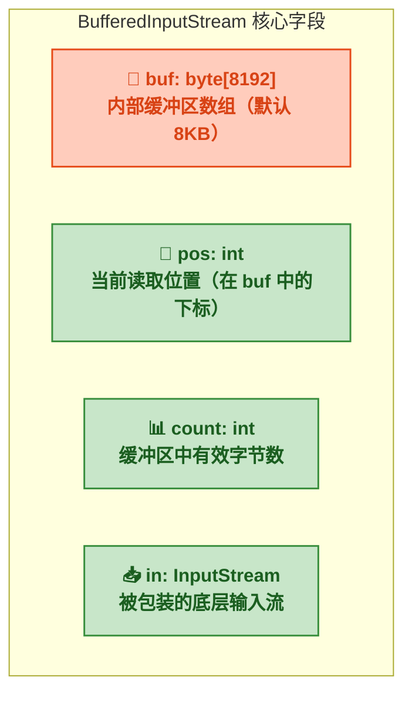
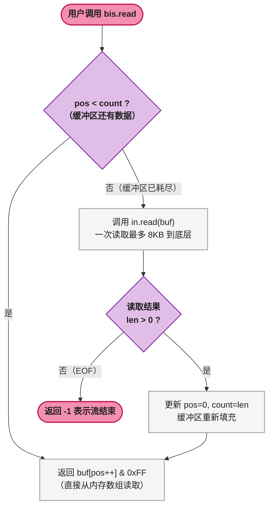
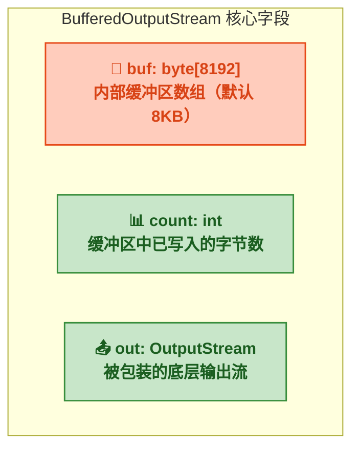
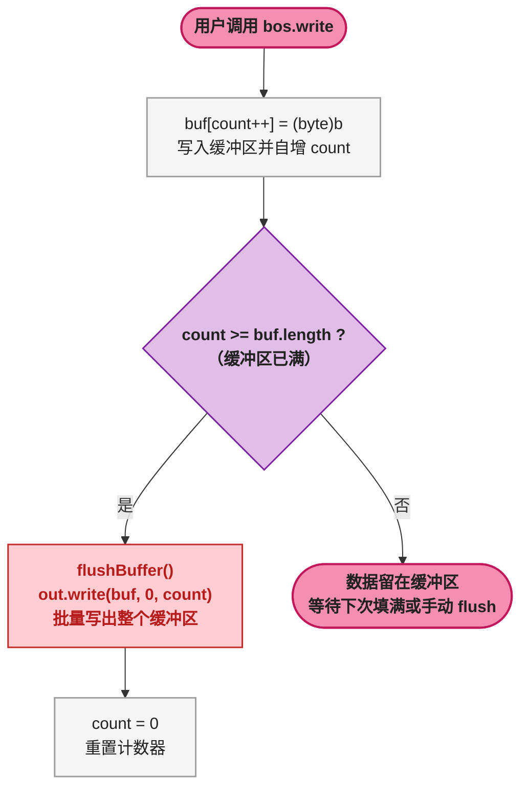
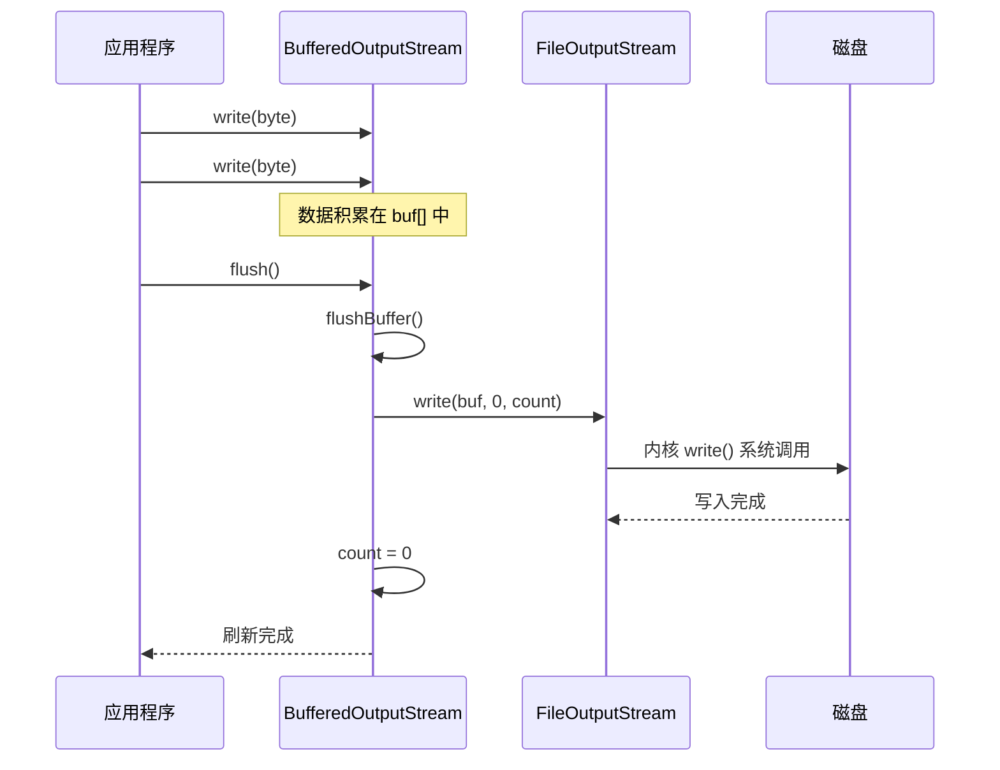
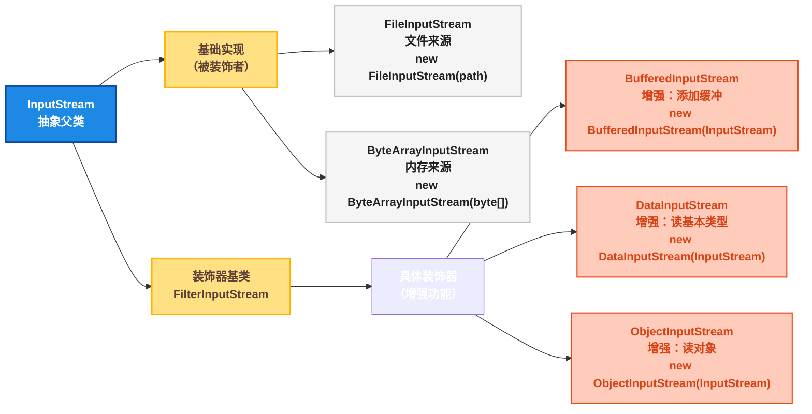
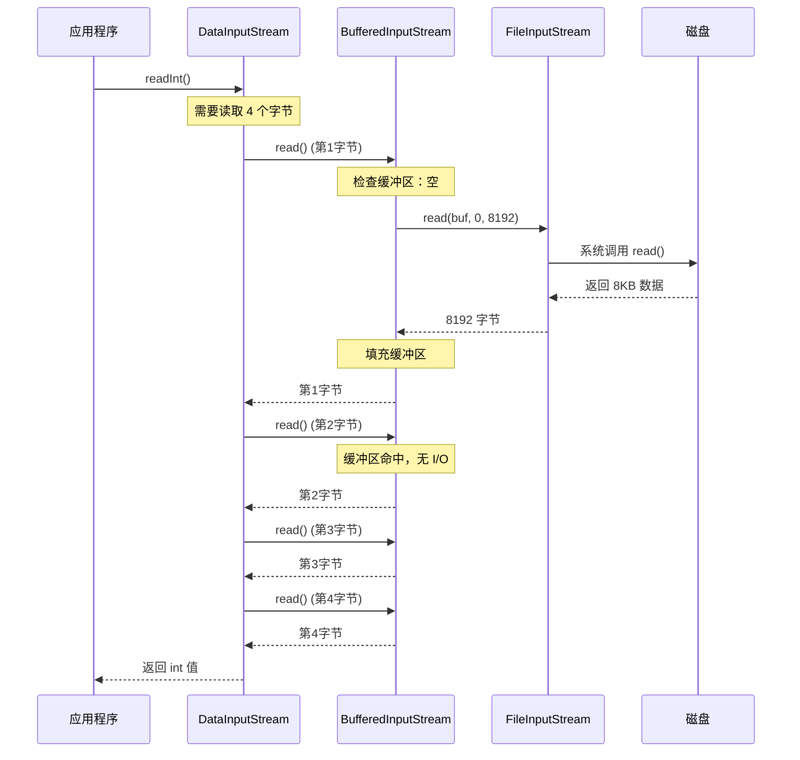
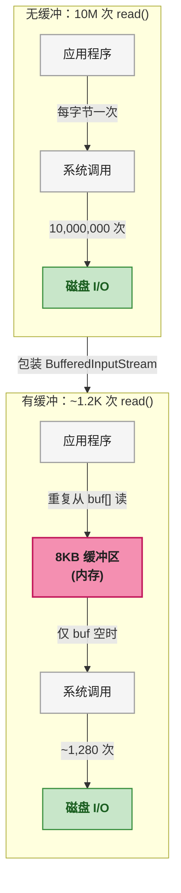

# Java IO 缓冲流与装饰器模式：从性能对比到设计模式全解析

## 1 ⚡ 问题切入：为什么单字节读取一个 10MB 文件要 30 秒？

先看一段能跑的代码。下面这段程序用 `FileInputStream` 的 `read()` 方法，一个字节一个字节地读取一个 **10MB** 的文件，并写入到另一个文件：

```java
// 无缓冲：单字节读取
try (FileInputStream fis = new FileInputStream("source_10mb.bin");
     FileOutputStream fos = new FileOutputStream("dest_10mb.bin")) {
    int b;
    while ((b = fis.read()) != -1) {   // 每次只读 1 字节
        fos.write(b);                   // 每次只写 1 字节
    }
}
```

在我的机器上（Windows 11，SSD），这段代码的运行耗时约为 **28,000 ms** （28 秒）。

现在再看另一段代码，功能完全一样，只是在外层各包了一个缓冲流：

```java
// 有缓冲：仍然单字节读取
try (BufferedInputStream bis = new BufferedInputStream(
            new FileInputStream("source_10mb.bin"));
     BufferedOutputStream bos = new BufferedOutputStream(
            new FileOutputStream("dest_10mb.bin"))) {
    int b;
    while ((b = bis.read()) != -1) {   // 仍然每次只读 1 字节
        bos.write(b);                   // 仍然每次只写 1 字节
    }
}
```

耗时：**约 150 ms** 。两者相差约 **180 倍** 。代码逻辑完全一样（都是循环内单字节读写），一行包的差别，性能天差地别。

**核心问题** ：为什么加一个缓冲流就能快 100 倍以上？这就是本篇要解答的内容。

## 2 💾 缓冲字节流：原理与对照实验

### 2.1 📥 BufferedInputStream（字节输入缓冲流）

**定义** ：`BufferedInputStream`（字节输入缓冲流）是一个包装在已有 `InputStream` 之外的流，内部维护一个 **8KB 的字节数组** （`buf`），将底层流的多次小数据量 `read()` 合并为少量的批量 `read()`，从而减少系统调用次数。

#### 2.1.1 🔢 内部数据结构



| 字段 | 类型 | 默认值 | 作用 |
|------|------|--------|------|
| `buf` | `byte[]` | `new byte[8192]` | 内部缓冲区，默认 8KB（8192 字节） |
| `pos` | `int` | `0` | 下一次 `read()` 将返回 `buf[pos]` |
| `count` | `int` | `0` | 当前缓冲区中有效数据的字节数 |
| `in` | `InputStream` | 构造时传入 | 被包装的底层输入流 |

`pos` 和 `count` 共同划定了一个有效数据窗口：`[pos, count)` 区间内的字节是可读取的，当 `pos >= count` 时表示缓冲区已耗尽，需要重新从底层流填充。

#### 2.1.2 🔄 `read()` 单字节读取流程



关键点：**只有缓冲区为空时才触发实际的磁盘 I/O** ，其余 `read()` 调用全部从内存数组 `buf` 中取，这就是性能差的根源。

#### 2.1.3 📋 JDK 源码佐证

以下截取自 OpenJDK 17 中 `BufferedInputStream.read()` 方法的关键逻辑：

```java
// java.io.BufferedInputStream
public synchronized int read() throws IOException {
    if (pos >= count) {                  // 条件1：缓冲区已耗尽
        fill();                          // 条件2：触发底层 read() 填充缓冲区
        if (pos >= count)                // 条件3：填充后仍为空 → 流已结束
            return -1;
    }
    return getBufIfOpen()[pos++] & 0xff; // 条件4：从内存数组取字节，pos++
}
```

- **条件1** （`pos >= count`）：判断缓冲区是否还有可读字节。这是性能的关键判断——如果 `pos < count`，直接走第 4 步，无系统调用
- **条件2** （`fill()`）：调用底层 `InputStream.read(byte[])` 一次性读满 8KB，这是一个系统调用（JVM 层面转换为操作系统 `read()` 系统调用）
- **条件3** ：`fill()` 返回后再次检查，如果底层流已读到末尾，`count` 仍等于 `pos`，返回 `-1`
- **条件4** ：`buf[pos++]` 是纯内存操作，返回无符号值（`& 0xff`，即 0 ~ 255）

再看 `fill()` 方法的源码：

```java
private void fill() throws IOException {
    byte[] buffer = getBufIfOpen();        // 获取内部缓冲区引用
    pos = 0;                               // 重置读取位置
    count = 0;                             // 重置有效数据计数
    int n = getInIfOpen().read(buffer, 0, buffer.length); // 底层流批量读取
    if (n > 0)
        count = n;                         // 设置有效字节数
}
```

`fill()` 的核心是一个带 `byte[]` 参数的 `read()` 调用——这个批量读取才是真正高效的磁盘 I/O。

#### 2.1.4 ⚡ 性能对比实验

| 读取方式 | 10MB 文件耗时 | 系统调用次数 | 说明 |
|---------|:---:|:---:|------|
| `FileInputStream.read()` 单字节 | ~28,000 ms | 约 10,000,000 次 | 每字节一次系统调用 |
| `BufferedInputStream.read()` 单字节 | ~150 ms | 约 1,220 次 | 每 8KB 一次系统调用 |

**核心公式** ：系统调用次数 ≈ `文件大小 / 缓冲区大小`。对于 10MB 文件，就是 `10,485,760 / 8192 ≈ 1280` 次（加上额外的边界处理）。

在操作系统中，每次 `read()` 系统调用都需要经历 **用户态 → 内核态** 的上下文切换（Context Switch），这是一项昂贵的操作：
- 保存当前线程的寄存器状态
- 切换到内核态执行文件系统代码
- 等待磁盘 I/O 完成（可能涉及磁盘寻道）
- 将数据从内核缓冲区复制到用户空间
- 恢复寄存器，切换回用户态

一次系统调用的耗时约 **1 ~ 10 微秒** （SSD 场景），1000 万次就是 **10 ~ 100 秒** 。缓冲流将 1000 万次系统调用减少到约 1280 次，这就是性能提升 100 倍以上的根本原因。

### 2.2 📤 BufferedOutputStream（字节输出缓冲流）

**定义** ：`BufferedOutputStream`（字节输出缓冲流）是一个包装在已有 `OutputStream` 之外的流，内部维护一个 **8KB 的字节数组**，`write()` 的数据先写入缓冲区，直到缓冲区满才真正调用底层流的 `write()` 将批量数据写出。

#### 2.2.1 🔢 内部数据结构



| 字段 | 类型 | 默认值 | 作用 |
|------|------|--------|------|
| `buf` | `byte[]` | `new byte[8192]` | 内部缓冲区，默认 8KB |
| `count` | `int` | `0` | 缓冲区中已缓存但尚未真正写出的字节数 |
| `out` | `OutputStream` | 构造时传入 | 被包装的底层输出流 |

#### 2.2.2 🔄 `write(int b)` 写入流程



#### 2.2.3 📋 JDK 源码佐证

```java
// java.io.BufferedOutputStream
public synchronized void write(int b) throws IOException {
    if (count >= buf.length) {   // 条件1：缓冲区已满
        flushBuffer();           // 条件2：将整个缓冲区刷新到底层流
    }
    buf[count++] = (byte)b;      // 条件3：将当前字节写入缓冲区
}
```

- **条件1** （`count >= buf.length`）：缓冲区满才触发实际写出。`write(int b)` 每次只写 1 字节到内存数组，写到第 8193 个字节时才触发第一次真正的磁盘 I/O
- **条件2** （`flushBuffer()`）：调用 `out.write(buf, 0, count)` 将整个缓冲区一次性写出
- **条件3** ：`buf[count++]` 是纯内存操作，仅当缓冲区满时才会因条件 1 触发 `flushBuffer()`

`flushBuffer()` 的源码：

```java
private void flushBuffer() throws IOException {
    if (count > 0) {
        out.write(buf, 0, count);   // 底层流一次性写出全部缓存数据
        count = 0;                   // 重置计数器
    }
}
```

#### 2.2.4 ⚠️ `flush()` —— 最容易忘记的方法

`BufferedOutputStream` 的 `flush()` 方法负责将缓冲区中残留的数据强制写出。如果程序结束时忘记调用 `flush()`（或没有 `close()` 流），缓冲区中最后一批不足 8KB 的数据将 **丢失** 。

```java
// 错误示例：最后一部分数据可能丢失
BufferedOutputStream bos = new BufferedOutputStream(
    new FileOutputStream("data.bin"));
bos.write(new byte[100]);       // 仅 100 字节，远未满 8KB
// 忘记 bos.flush() 或 bos.close() → 数据丢失！
```

```java
// 正确示例
try (BufferedOutputStream bos = new BufferedOutputStream(
        new FileOutputStream("data.bin"))) {
    bos.write(new byte[100]);
    bos.flush();                 // 显式刷新（try-with-resources 的 close() 也会自动 flush）
}
```

<span style="color:red">**核心规则**</span>：使用 `BufferedOutputStream` 时，必须确保在程序结束时调用 `flush()` 或 `close()`。`close()` 内部会自动调用 `flush()`，因此使用 try-with-resources（如上例）是最安全的做法。

#### 2.2.5 🔗 `flush()` 的调用链



## 3 📝 缓冲字符流：readLine() 与跨平台换行

缓冲字节流解决的是 **系统调用开销** 问题，而缓冲字符流在此基础上还解决了 **字符文本处理的便利性** 问题。

### 3.1 📖 BufferedReader（字符输入缓冲流）

**定义** ：`BufferedReader`（字符输入缓冲流）包装一个 `Reader`，内部同样维护一个字符数组缓冲区，并提供了 `readLine()` 方法——一次读取一整行文本。

#### 3.1.1 🔢 内部数据结构

| 字段 | 类型 | 默认值 | 作用 |
|------|------|--------|------|
| `cb` | `char[]` | `new char[8192]` | 内部字符缓冲区，默认 8KB（即 8192 个 `char`） |
| `nChars` | `int` | `0` | 缓冲区中有效字符数 |
| `nextChar` | `int` | `0` | 下一次 `read()` 将返回 `cb[nextChar]` |
| `in` | `Reader` | 构造时传入 | 被包装的底层字符流 |

结构与 `BufferedInputStream` 对应，只是 `byte[]` 换成了 `char[]`，`pos` / `count` 换成了 `nextChar` / `nChars`。

#### 3.1.2 🔍 `readLine()` 源码关键逻辑

```java
// java.io.BufferedReader
String readLine(boolean ignoreLF) throws IOException {
    StringBuilder s = null;
    int startChar;
    for (;;) {
        if (nextChar >= nChars)          // 缓冲区耗尽
            fill();                      // 重新从底层 Reader 填充
        if (nextChar >= nChars)          // 填充后仍空 → EOF
            return s != null ? s.toString() : null;

        // ... 逐字符扫描 \n 或 \r\n ...
        if (c == '\n') {                 // 遇到换行符
            return s.toString();         // 返回当前行字符串
        }
    }
}
```

核心逻辑：`readLine()` 循环从缓冲区读取字符，直到遇到 `\n`（LF）、`\r`（CR）或 `\r\n`（CR+LF），将之前积累的字符拼接为 `String` 返回。如果缓冲区耗尽，调用 `fill()` 重新填充。

#### 3.1.3 🛠️ 典型用法

```java
// 一行流式读取文本文件
try (BufferedReader br = new BufferedReader(new FileReader("a.txt"))) {
    String line;
    while ((line = br.readLine()) != null) {
        System.out.println(line);
    }
}
```

`BufferedReader` 本身没有读取文件的能力，必须包装一个 `FileReader`（或其他 `Reader`），这正是装饰器模式的体现。

### 3.2 ✍️ BufferedWriter（字符输出缓冲流）

**定义** ：`BufferedWriter`（字符输出缓冲流）包装一个 `Writer`，内部维护字符缓冲区，并提供 `newLine()` 方法实现跨平台换行。

#### 3.2.1 🔍 `newLine()` 源码

```java
// java.io.BufferedWriter
public void newLine() throws IOException {
    write(System.lineSeparator());   // 写入平台相关的换行符
}
```

`System.lineSeparator()` 返回的值：

| 操作系统 | 返回值 | 说明 |
|---------|--------|------|
| Windows | `\r\n` | CR + LF |
| Linux / macOS | `\n` | LF |
| 旧版 Mac（OS 9 及之前） | `\r` | CR |

#### 3.2.2 🛠️ 典型用法

```java
try (BufferedWriter bw = new BufferedWriter(new FileWriter("output.txt"))) {
    bw.write("第一行数据");
    bw.newLine();               // 跨平台换行，无需手动写 \n 或 \r\n
    bw.write("第二行数据");
    bw.newLine();
}
```

不使用 `newLine()` 时，初学者常见错误是硬编码 `\n`，这在 Windows 记事本中会导致所有文字挤在一行。

## 4 🎨 装饰器模式：Java IO 设计的核心思想

以上四种缓冲流都属于 **装饰器模式**（Decorator Pattern）在 Java IO 中的实现。本节重点讲解这个模式在 IO 中的具体使用方式。

### 4.1 📐 定义与结构

**定义** ：装饰器模式通过 **包装** （Wrap）的方式给已有对象附加额外功能，同时保持与原对象相同的接口类型。在 Java IO 中，缓冲流（装饰器）包装基础流（被装饰者），在不改变基础流接口的前提下，增强了性能或功能。



### 4.2 🔑 两个核心特征

**特征一：装饰器与被装饰者实现同一接口（或继承同一父类）**

`BufferedInputStream` 继承自 `FilterInputStream`，而 `FilterInputStream` 继承自 `InputStream`。`FileInputStream` 也继承自 `InputStream`。这意味着任何接收 `InputStream` 的地方，都可以传入 `BufferedInputStream`。

```java
// 方法签名只认 InputStream，不关心是否被装饰
public static void process(InputStream is) {
    // ...
}

// 三种调用都合法
process(new FileInputStream("a.txt"));                    // 原始流
process(new BufferedInputStream(new FileInputStream("a.txt")));  // 加了缓冲
process(new DataInputStream(new BufferedInputStream(          // 加了两层
    new FileInputStream("a.txt"))));
```

**特征二：构造器接收同类型的被装饰者**

```java
public BufferedInputStream(InputStream in) { ... }
public DataInputStream(InputStream in) { ... }
```

这使得装饰器可以 **链式嵌套** ，像套娃一样一层套一层，每层添加一种独立功能。

### 4.3 🔗 装饰器嵌套的运行流程

下面以 `DataInputStream` 套 `BufferedInputStream` 套 `FileInputStream` 为例，展示读取一个 `int` 值的完整调用链：



第 1 次 `read()` 触发磁盘 I/O，缓冲 8KB 后，后续 3 次 `read()` 全部在内存中完成。每一层只关心自己的职责：`DataInputStream` 负责将 4 个字节组装成 `int`，`BufferedInputStream` 负责缓冲，`FileInputStream` 负责与磁盘交互。

### 4.4 📊 对比：装饰器模式 vs 继承

如果不使用装饰器模式，而是用继承来实现"带缓冲的文件输入流"，需要创建 `BufferedFileInputStream` 类。如果再要"能读基本类型的缓冲文件输入流"，就要创建 `DataBufferedFileInputStream`。每增加一种功能组合，就要多一个类，这就是 **类爆炸** （组合数 = 基础流数 × 装饰器数）。

| 方案 | 类的数量（3 基础流 × 3 装饰器） | 可扩展性 |
|------|:---:|------|
| 继承（子类组合） | 最多 3 × 2³ = 24 个类 | 每增加一种功能，需要新增组合类 |
| 装饰器模式 | 3 + 3 = 6 个类 | 增加功能只需增加 1 个装饰器类 |

装饰器模式的核心优势是 **运行时组合** ：基础流和装饰器的组合是在 `new` 时决定的，不是在编译时写死的。

## 5 🛠️ 日常开发中的常用方法

| 方法 | 所属类 | 用途 | 频率 |
|------|--------|------|:---:|
| `new BufferedInputStream(InputStream)` | BufferedInputStream | 包装输入流，添加缓冲 | 高 |
| `new BufferedOutputStream(OutputStream)` | BufferedOutputStream | 包装输出流，添加缓冲 | 高 |
| `new BufferedReader(Reader)` | BufferedReader | 包装字符输入流，添加缓冲 | 高 |
| `new BufferedWriter(Writer)` | BufferedWriter | 包装字符输出流，添加缓冲 | 高 |
| `BufferedReader.readLine()` | BufferedReader | 一次读取一行文本 | 高 |
| `BufferedWriter.newLine()` | BufferedWriter | 写入跨平台换行符 | 高 |
| `BufferedOutputStream.flush()` | BufferedOutputStream | 强制刷新缓冲区 | 高 |
| `BufferedWriter.flush()` | BufferedWriter | 强制刷新字符缓冲区 | 中 |

### 5.1 📦 缓冲流的标准用法（善用嵌套）

```java
// 字节流：高效文件复制
try (BufferedInputStream bis = new BufferedInputStream(
            new FileInputStream("source.bin"));
     BufferedOutputStream bos = new BufferedOutputStream(
            new FileOutputStream("dest.bin"))) {
    byte[] buf = new byte[8192];
    int len;
    while ((len = bis.read(buf)) != -1) {
        bos.write(buf, 0, len);
    }
}
```

上述代码有两层缓冲：`BufferedInputStream` / `BufferedOutputStream` 自带 8KB 缓冲，同时手动使用的 `byte[8192]` 进一步减少了 JNI 调用层的开销。

### 5.2 📝 字符流：按行处理文本

```java
// 统计文件中包含特定关键词的行数
int count = 0;
try (BufferedReader br = new BufferedReader(new FileReader("log.txt"))) {
    String line;
    while ((line = br.readLine()) != null) {
        if (line.contains("ERROR")) {
            count++;
        }
    }
}
System.out.println("包含 ERROR 的行数：" + count);
```

### 5.3 ✍️ 缓冲写出：带换行的文本输出

```java
try (BufferedWriter bw = new BufferedWriter(new FileWriter("result.txt"))) {
    for (int i = 0; i < 1000; i++) {
        bw.write("第 " + i + " 行");
        bw.newLine();        // 跨平台换行，比硬编码 \n 更健壮
    }
}  // try-with-resources 自动调用 close() → flush()
```

### 5.4 🔤 缓冲流与字符编码

`FileReader` 和 `FileWriter` 使用平台默认编码（可通过 `System.getProperty("file.encoding")` 查看）。对于需要指定编码的场景，应使用 `InputStreamReader` / `OutputStreamWriter`：

```java
// 明确指定 UTF-8 编码
try (BufferedReader br = new BufferedReader(
            new InputStreamReader(
                new FileInputStream("data.txt"), StandardCharsets.UTF_8));
     BufferedWriter bw = new BufferedWriter(
            new OutputStreamWriter(
                new FileOutputStream("output.txt"), StandardCharsets.UTF_8))) {
    String line;
    while ((line = br.readLine()) != null) {
        bw.write(line);
        bw.newLine();
    }
}
```

这里的装饰器链为：`BufferedReader → InputStreamReader → FileInputStream`，是三层装饰器嵌套的典型场景。

### 5.5 🚀 Java 8+ 的 Files API：现代替代方案

在 Java 8 之后，`java.nio.file.Files` 提供了更简洁的读写方法，内部已自动使用缓冲：

```java
// 现代写法：一行读取所有行（小文件）
List<String> lines = Files.readAllLines(Path.of("a.txt"), StandardCharsets.UTF_8);

// 现代写法：流式读取（大文件）
try (Stream<String> stream = Files.lines(Path.of("a.txt"), StandardCharsets.UTF_8)) {
    stream.filter(line -> line.contains("ERROR"))
          .forEach(System.out::println);
}

// 现代写法：写入文件
Files.writeString(Path.of("output.txt"), "Hello World", StandardCharsets.UTF_8);
```

| 对比维度 | 传统 IO 缓冲流 | Java 8+ Files API |
|---------|---------------|-------------------|
| 代码量 | 5 ~ 8 行（需手动嵌套装饰器） | 1 ~ 3 行 |
| 缓冲机制 | 需显式包装 BufferedXxx | 内部自动缓冲 |
| 字符编码 | FileReader 用平台默认编码（不可配） | 显式传入 Charset，安全可控 |
| 适用场景 | 需要精细控制缓冲大小、流式链式加工 | 常规文件读写，代码简洁优先 |

**建议** ：日常开发优先使用 `Files` API；当需要复杂的流装饰器链（如 `DataInputStream` + `BufferedInputStream` + `GZIPInputStream`）时，回退到传统 IO 装饰器模式。

## 6 ⚠️ 实际开发中的场景与常见陷阱

### 6.1 🌐 场景一：网络流读取——`readLine()` 阻塞

`BufferedReader.readLine()` 在读取网络流（如 `Socket.getInputStream()`）时会 **阻塞** ，直到对方发送换行符或关闭连接。这在 HTTP 协议处理中非常常见：

```java
// 读取 HTTP 请求的第一行 "GET /index.html HTTP/1.1"
Socket socket = serverSocket.accept();
BufferedReader br = new BufferedReader(
    new InputStreamReader(socket.getInputStream()));
String requestLine = br.readLine();  // 阻塞等待 \r\n
```

### 6.2 📦 场景二：大文件复制——双缓冲

对于 GB 级文件复制，`BufferedInputStream` 默认 8KB 的缓冲区可能不够理想。可以通过构造参数指定更大的缓冲区：

```java
// 自定义缓冲区大小为 1MB（大文件场景）
int bufSize = 1024 * 1024;  // 1MB
try (BufferedInputStream bis = new BufferedInputStream(
            new FileInputStream("huge.bin"), bufSize);
     BufferedOutputStream bos = new BufferedOutputStream(
            new FileOutputStream("copy.bin"), bufSize)) {
    byte[] buf = new byte[bufSize];
    int len;
    while ((len = bis.read(buf)) != -1) {
        bos.write(buf, 0, len);
    }
}
```

### 6.3 🚨 常见陷阱清单

| 陷阱 | 后果 | 解决方案 |
|------|------|---------|
| 忘记调用 `flush()` | 最后一批数据丢失 | 使用 try-with-resources 或 finally 中 close() |
| `FileReader` 不可指定编码 | 非平台默认编码文件出现乱码 | 使用 `new InputStreamReader(new FileInputStream(path), charset)` |
| 缓冲流外又套一个缓冲流 | 两层缓冲开销，但通常影响可忽略 | 避免不必要的双重缓冲 |
| 只 `close()` 外层流，不 `close()` 内层流 | 外层 `close()` 会自动关闭内层流，无影响 | 只需关闭最外层流 |

## 7 🎯 完整总结

### 7.1 💡 缓冲流的本质



缓冲流的本质一句话概括：**用内存空间（8KB 数组）换系统调用次数，将"多次小数据量 I/O"合并为"少量大数据量 I/O"** 。

### 7.2 📊 四种缓冲流对比

| 特性 | BufferedInputStream | BufferedOutputStream | BufferedReader | BufferedWriter |
|------|:---:|:---:|:---:|:---:|
| 缓冲单位 | `byte[8192]` | `byte[8192]` | `char[8192]` | `char[8192]` |
| 包装类型 | `InputStream` | `OutputStream` | `Reader` | `Writer` |
| 缓冲写策略 | — | 满才写（或 flush） | — | 满才写（或 flush） |
| 杀手锏方法 | `read()` 单字节快 100 倍 | `flush()` 必须调用 | `readLine()` | `newLine()` |
| 数据丢失风险 | 无 | 未 flush 时最后一批可能丢失 | 无 | 未 flush 时最后一批可能丢失 |

### 7.3 🎨 装饰器模式核心要点

| 要点 | 说明 |
|------|------|
| **共同父类** | 装饰器和被装饰者继承同一抽象类（如 `InputStream`），保证类型兼容 |
| **构造器注入** | 装饰器通过构造器接收被装饰者，实现运行时组合 |
| **链式嵌套** | 多个装饰器可无限嵌套，每层添加一种独立功能 |
| **对客户端透明** | 使用方只看到抽象类型，不关心被装饰了几层 |
| **替代继承** | 用"组合 + 委托"替代继承，避免类爆炸 |

装饰器模式在 Java IO 中的应用遵循一个统一的套路——`new 装饰器(new 被装饰者(参数))`，这个套路在 `java.io` 包中反复出现，理解了它就理解了整个 Java IO 流体系的设计思想。

### 7.4 🌐 从 IO 到整个 Java 生态

装饰器模式不仅用于 `java.io`，在 `java.util.Collections`（如 `synchronizedList`、`unmodifiableList`）、Servlet Filter 链、Spring AOP 代理等场景中同样广泛使用。掌握了 Java IO 中的缓冲流与装饰器模式，就掌握了理解这些框架设计的一把通用钥匙。
