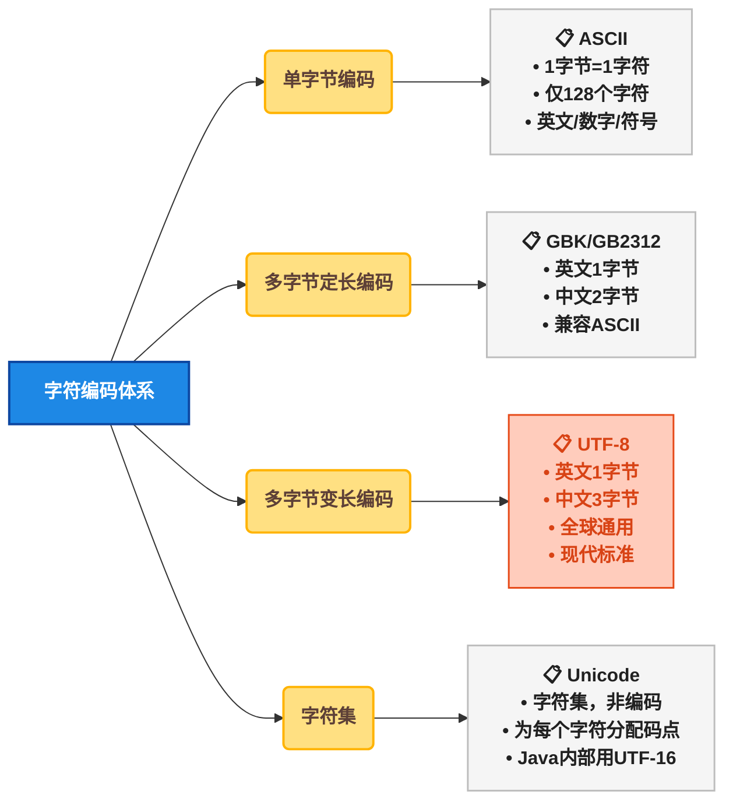
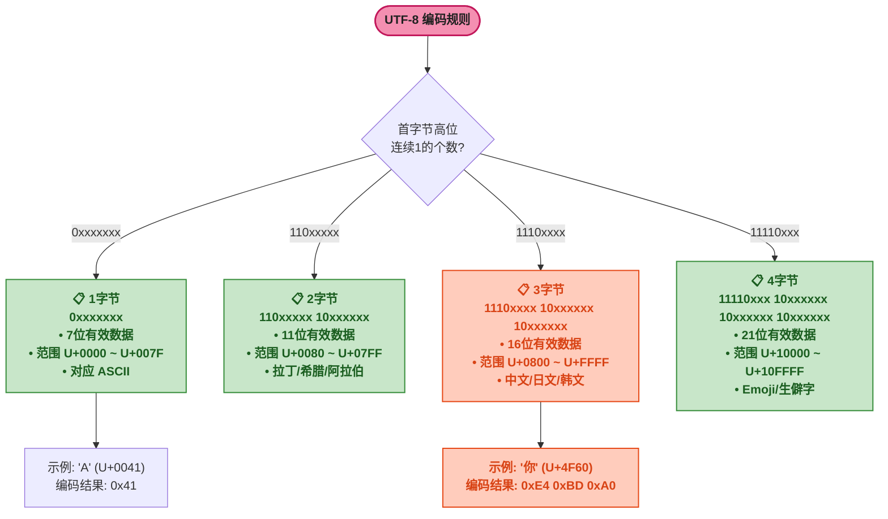
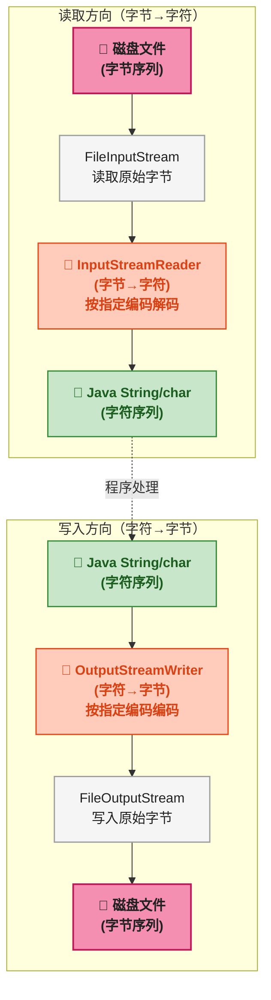
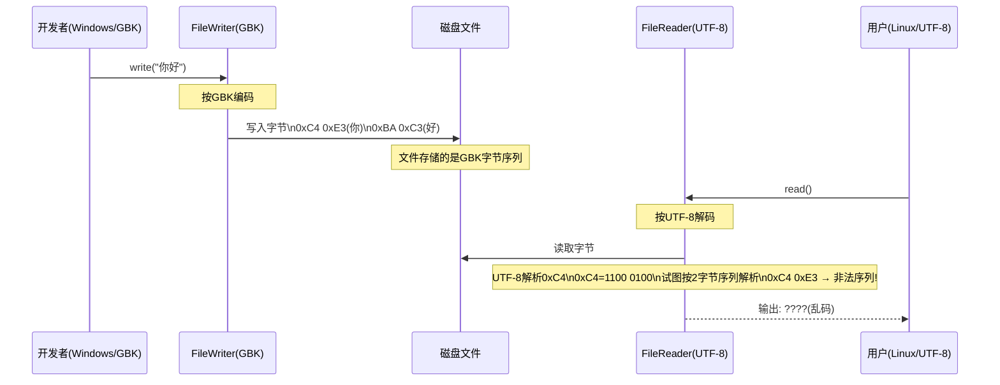
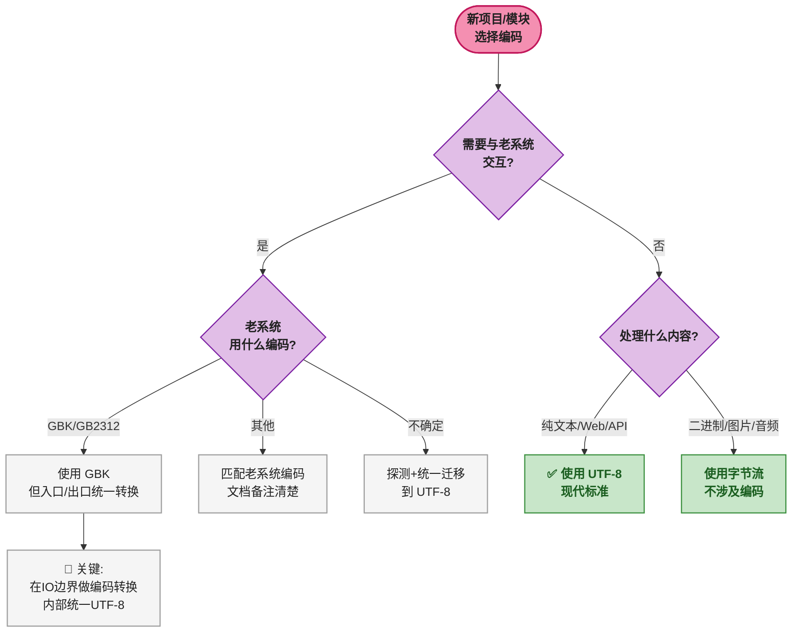

# Java IO 编码与桥接：字符集、编码转换与乱码解决方案全解析

## 1 ⚠️ 问题切入：一段乱码代码

先看一段在实际开发中经常遇到的代码。这段代码在不同操作系统上运行，结果 **完全不同** ：

```java
public class GarbledDemo {
    public static void main(String[] args) throws Exception {
        // 在 Windows 中文系统上运行（默认 GBK）
        try (FileWriter writer = new FileWriter("hello.txt")) {
            writer.write("你好，世界！");
        }

        // 在 Linux 服务器上读取（默认 UTF-8）
        try (FileReader reader = new FileReader("hello.txt")) {
            char[] buf = new char[1024];
            int len = reader.read(buf);
            System.out.println(new String(buf, 0, len));
            // 输出：你好，世界！  ← 正常
            // 还是：���← 乱码？
            // 取决于操作系统！
        }
    }
}
```

为什么同一段代码在不同环境下表现不同？因为 `FileReader` / `FileWriter` 使用 **JVM 默认编码** （通常是操作系统默认编码），而 Windows 中文版默认是 **GBK** ，Linux 默认是 **UTF-8** 。写入和读取时编码不一致，就会产生 **乱码** （Mojibake，指因字符编码不匹配导致的不可读字符）。

这篇博客的目标 ： **彻底理解字符编码原理，掌握桥接流，永远解决 Java IO 乱码问题** 。

## 2 🔤 编码基础：字符如何变成字节

### 2.1 🌐 编码体系总览

计算机存储和传输的是 **字节** （byte，8 位二进制），而人类读写的是 **字符** （character，如 `A`、`你`、`あ`）。**字符编码** （Character Encoding）就是字符与字节之间的 **映射规则** 。



**关键区分** ： **Unicode** 是 **字符集** （Character Set），定义"每个字符对应哪个编号（码点，Code Point）"。 **UTF-8** 、 **UTF-16** 是 **编码方式** （Encoding），定义"如何把码点转换成字节序列"。例如字符 `A` 的 Unicode 码点是 `U+0041`，UTF-8 编码为 `0x41`（1 字节），UTF-16 编码为 `0x00 0x41`（2 字节）。

### 2.2 📋 四种编码方式详解

| 编码 | 英文占用 | 中文占用 | 字符数 | 兼容 ASCII | 使用场景 |
|------|:---:|:---:|:---:|:---:|------|
| **ASCII** | 1 字节 | 不支持 | 128 | — | 纯英文老系统、网络协议头 |
| **GBK** | 1 字节 | 2 字节 | 约 2 万 | 是 | 国内 Windows 默认编码 |
| **GB2312** | 1 字节 | 2 字节 | 约 7 千 | 是 | GBK 的前身，已不推荐 |
| **UTF-8** | 1 字节 | 3 字节 | 100 万+ | 是 | Web 标准、Linux 默认、现代项目首选 |

#### 🔤 ASCII（American Standard Code for Information Interchange）

用 **7 位** （bit）表示一个字符，共 128 个字符（0 ~ 127）。包含英文字母、数字、标点符号和控制字符。**不能表示中文** 。

```java
// 验证 ASCII 编码
byte[] asciiBytes = "Hello".getBytes(StandardCharsets.US_ASCII);
System.out.println(asciiBytes.length);  // 5 —— 每个英文字母 1 字节
```

#### 🇨🇳 GBK（国标扩展）

GBK 是 GB2312 的扩展，**兼容 ASCII** （英文部分 1 字节），中文用 **2 字节** 表示。Windows 中文版默认使用 GBK。

```java
// 验证 GBK 编码
byte[] gbkBytes = "中国".getBytes("GBK");
System.out.println(gbkBytes.length);  // 4 —— 每中文字符 2 字节
```

**GBK 的关键特征** ：中文字节的高位（最高 bit）为 `1`，与 ASCII 的 `0` 区分。读取时，如果读到字节高位为 `1`，就知道需要再读 1 个字节拼成一个中文字符。

#### 🌍 UTF-8（Unicode Transformation Format - 8 bit）

UTF-8 是 **变长编码** （Variable-Length Encoding），用 1 ~ 4 个字节表示一个字符：



**UTF-8 的设计优势** ：
1. **兼容 ASCII** ：英文部分编码完全相同，老系统文本自动兼容
2. **无字节序问题** ：编码规则本身确定了字节顺序
3. **变长节省空间** ：英文 1 字节，中文 3 字节，不会像 UTF-16 那样对英文浪费空间

```java
// 验证 UTF-8 变长编码
byte[] utf8_en = "A".getBytes(StandardCharsets.UTF_8);
System.out.println(utf8_en.length);  // 1 —— 英文 1 字节

byte[] utf8_cn = "你".getBytes(StandardCharsets.UTF_8);
System.out.println(utf8_cn.length);  // 3 —— 中文 3 字节

byte[] utf8_emoji = "😀".getBytes(StandardCharsets.UTF_8);
System.out.println(utf8_emoji.length);  // 4 —— Emoji 4 字节
```

#### 🔣 Unicode 与 UTF-16

**Unicode** 是字符集，为全球所有字符分配唯一的 **码点** （Code Point），写作 `U+XXXX`。例如 `A` → `U+0041`，`你` → `U+4F60`。

Java 内部使用 **UTF-16** 编码存储 `char` 和 `String`。`char` 类型固定 2 字节（16 位），对于超出 BMP（Basic Multilingual Plane，基本多文种平面，码点范围 `U+0000` ~ `U+FFFF`）的字符（如 Emoji），需要用 **2 个 char** （代理对，Surrogate Pair）表示。

```java
// Java 内部使用 UTF-16
String s = "A你";
System.out.println(s.charAt(0));  // 'A' —— U+0041 (1个char)
System.out.println(s.charAt(1));  // '你' —— U+4F60 (1个char)

String emoji = "😀";
System.out.println(emoji.length());  // 2 —— Emoji 用2个char(代理对)
System.out.println(emoji.codePointCount(0, emoji.length()));  // 1 —— 实际1个字符
```

### 2.3 🏷️ 编码识别与 BOM

文件本身不存储"我是什么编码"这个信息。有些文件开头会有 **BOM** （Byte Order Mark，字节序标记），它是一个特殊字符 `U+FEFF`，用于标识编码方式：

| BOM 字节序列 | 对应编码 |
|-------------|---------|
| `EF BB BF` | UTF-8 |
| `FE FF` | UTF-16 BE（大端序） |
| `FF FE` | UTF-16 LE（小端序） |

<span style="color:red">**注意**</span> ：UTF-8 不需要 BOM （UTF-8 自身已确定字节序），但 Windows 上的记事本保存 UTF-8 文件时会自动加 BOM，可能导致程序读到的第一行开头多出不可见字符 ``。在 Java 中处理文件时要注意这个坑。

## 3 🌉 桥接流：字节与字符之间的桥梁

### 3.1 ❓ 为什么需要桥接流

Java IO 分为两大体系：

| 体系 | 基类 | 操作单位 | 适用场景 |
|------|------|:---:|------|
| 字节流 | `InputStream` / `OutputStream` | byte（8 位） | 图片、音频、视频、任意二进制 |
| 字符流 | `Reader` / `Writer` | char（16 位） | 文本文件 |

**磁盘和网络上存储/传输的都是字节** ，但 Java 程序中处理文本时用的是 **字符** 。桥接流的作用就是 **在字节与字符之间做转换** ，而转换的依据就是 **字符编码** 。



### 3.2 🔑 核心类：InputStreamReader 与 OutputStreamWriter

| 类 | 作用 | 构造器 |
|----|------|------|
| `InputStreamReader` | **字节 → 字符** （解码，Decode） | `new InputStreamReader(InputStream, Charset)` |
| `OutputStreamWriter` | **字符 → 字节** （编码，Encode） | `new OutputStreamWriter(OutputStream, Charset)` |

**正确打开方式** ：

```java
// 读取文件 —— 指定 UTF-8 解码
try (BufferedReader reader = new BufferedReader(
         new InputStreamReader(
         new FileInputStream("input.txt"), StandardCharsets.UTF_8))) {
    String line;
    while ((line = reader.readLine()) != null) {
        System.out.println(line);
    }
}

// 写入文件 —— 指定 UTF-8 编码
try (BufferedWriter writer = new BufferedWriter(
         new OutputStreamWriter(
         new FileOutputStream("output.txt"), StandardCharsets.UTF_8))) {
    writer.write("你好，世界！");
    writer.newLine();
}
```

**代码解读** ：
1. `FileInputStream` 从磁盘读取原始字节
2. `InputStreamReader` 按 `UTF-8` 规则将字节解码为字符
3. `BufferedReader` 增加缓冲，提供 `readLine()` 按行读取
4. 写入方向同理，方向相反

### 3.3 💀 FileReader / FileWriter 的致命缺陷

`FileReader` 和 `FileWriter` 是 `InputStreamReader` 和 `OutputStreamWriter` 的子类，它们的构造器 **不接受 Charset 参数** ，内部使用 `Charset.defaultCharset()`（JVM 默认编码）。

```java
// FileReader 源码截取（JDK 11）
public class FileReader extends InputStreamReader {
    public FileReader(String fileName) throws FileNotFoundException {
        super(new FileInputStream(fileName));  // 调用父类，不传 Charset
        // 父类 InputStreamReader 内部使用 Charset.defaultCharset()
    }
}
```

**源码解读** ：`FileReader` 的构造器调用父类 `InputStreamReader` 时没有传入 `Charset` 参数，导致使用 JVM 默认编码。不同操作系统的默认编码不同，这就造成了"同一段代码，不同环境不同结果"的问题。

<span style="color:red">**核心原则**</span> ：**永远不要使用 `FileReader` / `FileWriter`** 。用 `InputStreamReader` / `OutputStreamWriter` 替代，并显式指定字符集。即使你确定所有环境都是 UTF-8，显式指定也比依赖默认值更安全。

### 3.4 🔍 乱码产生的完整流程



**乱码产生的根本原因** ：写入时使用的编码（GBK）与读取时使用的编码（UTF-8）不一致。`0xC4 0xE3` 在 GBK 中是合法的中文编码（表示"你"），但 UTF-8 解析器看到 `0xC4`（二进制 `1100 0100`）时，以 `110` 开头的字节在 UTF-8 中表示"这是 2 字节序列的第一个字节"，它期望第二个字节也是 `10xxxxxx` 格式。如果匹配失败，UTF-8 解码器会输出 **替换字符** `�`（U+FFFD，Replacement Character）。

## 4 🧪 实战：制造乱码并修复

### 4.1 🔬 用 GBK 写入，用 UTF-8 读取——观察乱码

```java
import java.io.*;
import java.nio.charset.StandardCharsets;

public class MojibakeDemo {

    public static void main(String[] args) throws Exception {
        // ========== 第一步：用 GBK 编码写入文件 ==========
        try (OutputStreamWriter writer = new OutputStreamWriter(
                 new FileOutputStream("gbk-file.txt"), "GBK")) {
            writer.write("你好，Java IO 编码学习！");
            writer.write("\n第二行：Hello World");
        }
        System.out.println(">> 已用 GBK 编码写入文件");

        // ========== 第二步：查看文件原始字节 ==========
        System.out.print(">> 文件原始字节（十六进制）: ");
        try (FileInputStream fis = new FileInputStream("gbk-file.txt")) {
            byte[] bytes = fis.readAllBytes();
            for (byte b : bytes) {
                System.out.printf("%02X ", b);
            }
        }
        System.out.println();

        // ========== 第三步：用 UTF-8 错误读取 ==========
        System.out.println(">> 用 UTF-8 错误读取:");
        try (BufferedReader reader = new BufferedReader(
                 new InputStreamReader(
                 new FileInputStream("gbk-file.txt"), StandardCharsets.UTF_8))) {
            String line;
            while ((line = reader.readLine()) != null) {
                System.out.println("   乱码输出: " + line);
            }
        }

        // ========== 第四步：用 GBK 正确读取 ==========
        System.out.println(">> 用 GBK 正确读取:");
        try (BufferedReader reader = new BufferedReader(
                 new InputStreamReader(
                 new FileInputStream("gbk-file.txt"), Charset.forName("GBK")))) {
            String line;
            while ((line = reader.readLine()) != null) {
                System.out.println("   正确输出: " + line);
            }
        }
    }
}
```

**运行输出（预期）** ：

```
>> 已用 GBK 编码写入文件
>> 文件原始字节（十六进制）: C4 E3 BA C3 A3 AC 4A 61 76 61 ...
>> 用 UTF-8 错误读取:
   乱码输出: ���，Java IO 编码学习！
>> 用 GBK 正确读取:
   正确输出: 你好，Java IO 编码学习！
```

**分析** ：文件字节 `C4 E3` 在 GBK 中是"你"，但 UTF-8 解码器试图按 UTF-8 规则解析 `0xC4` 时发现这是非法序列，输出 `�`。

### 4.2 ✅ 修复：使用正确的编码读取

修复方法很简单——读取时指定与写入时相同的编码：

```java
// 写入时用的编码
String writeCharset = "GBK";

// 读取时必须用相同编码
try (BufferedReader reader = new BufferedReader(
         new InputStreamReader(
         new FileInputStream("gbk-file.txt"), writeCharset))) {
    // 正常读取
}
```

但这依赖于"你事先知道文件是什么编码"。在实际项目中，更可靠的做法是：

```java
// 方案一：全项目统一使用 UTF-8（推荐）
// 写入
try (OutputStreamWriter w = new OutputStreamWriter(
         new FileOutputStream("data.txt"), StandardCharsets.UTF_8)) {
    w.write("内容");
}

// 读取
try (BufferedReader r = new BufferedReader(
         new InputStreamReader(
         new FileInputStream("data.txt"), StandardCharsets.UTF_8))) {
    String line = r.readLine();
}
```

```java
// 方案二：通过 JVM 参数统一设置默认编码（Java 18+）
// java -Dfile.encoding=UTF-8 MainClass
// 注意：老项目慎用，可能影响依赖库行为
```

### 4.3 🔎 编码探测：当你不确定文件编码时

实际工作中可能遇到"不知道文件是什么编码"的情况。可以用第三方库或 JDK 方式探测：

```java
// 使用 JDK 内置方式尝试常见编码
public static String readWithAutoDetect(String filePath) throws IOException {
    // 按优先级尝试常见编码
    String[] charsets = {"UTF-8", "GBK", "GB2312", "ISO-8859-1"};
    for (String charset : charsets) {
        try (BufferedReader reader = new BufferedReader(
                 new InputStreamReader(
                 new FileInputStream(filePath), Charset.forName(charset)))) {
            String line = reader.readLine();
            if (line != null && !line.contains("�")) {  // 不含替换字符
                System.out.println("检测到编码: " + charset);
                // 需要重新读取完整内容，这里是示意
                return charset;
            }
        }
    }
    return "UTF-8";  // 默认回退
}
```

<span style="color:red">**注意**</span> ：这种探测方式不可靠（有些字节序列在多种编码下都能解码出不同结果）。**最佳实践始终是：在项目中统一使用 UTF-8，从根本上避免编码探测的需求** 。

## 5 🎯 最佳实践总结

### 5.1 📋 使用原则速查

| 场景 | ❌ 错误做法 | ✅ 正确做法 |
|------|-----------|-----------|
| 读文本文件 | `new FileReader("a.txt")` | `new InputStreamReader(new FileInputStream("a.txt"), StandardCharsets.UTF_8)` |
| 写文本文件 | `new FileWriter("b.txt")` | `new OutputStreamWriter(new FileOutputStream("b.txt"), StandardCharsets.UTF_8)` |
| 读二进制文件 | `new FileReader("a.jpg")` | `new FileInputStream("a.jpg")` |
| 写二进制文件 | `new FileWriter("b.jpg")` | `new FileOutputStream("b.jpg")` |
| 字符串转字节 | `str.getBytes()` | `str.getBytes(StandardCharsets.UTF_8)` |
| 字节转字符串 | `new String(bytes)` | `new String(bytes, StandardCharsets.UTF_8)` |

### 5.2 🌳 编码选择决策树



### 5.3 ⚖️ 三条铁律

1. **永远显式指定编码** ：不要依赖 `getBytes()`、`new String(bytes)`、`FileReader`、`FileWriter` 的默认行为。始终传入 `StandardCharsets.UTF_8` 或 `Charset.forName("GBK")`
2. **全项目统一编码** ：新项目 **全部使用 UTF-8** ，包括源代码文件（`.java`）、配置文件（`.xml`、`.yml`、`.properties`）、数据库连接、日志文件
3. **在 IO 边界做转换** ：只在读写文件/网络的地方做编码转换。程序内部全部用 `String` / `char`（内存中天然是 Unicode），不要在内部逻辑中反复编解码

### 5.4 ⚙️ 各组件编码配置速查

| 组件 | 配置项 | UTF-8 配置 |
|------|------|-----------|
| Maven | `pom.xml` | `<project.build.sourceEncoding>UTF-8</project.build.sourceEncoding>` |
| Gradle | `build.gradle` | `compileJava.options.encoding = 'UTF-8'` |
| Tomcat | `server.xml` | `URIEncoding="UTF-8"` |
| Spring Boot | `application.yml` | `server.servlet.encoding.charset: UTF-8` |
| MySQL | 连接串 | `jdbc:mysql://...?characterEncoding=utf-8` |
| JVM | 启动参数 | `-Dfile.encoding=UTF-8` |

## 6 🎯 总结

本文从一段乱码代码切入，讲解了以下核心内容：

1. **编码基础** ：ASCII（1 字节英文）、GBK（2 字节中文）、UTF-8（变长 1 ~ 4 字节）的本质区别，以及 Unicode 字符集与编码方式的关系
2. **桥接流原理** ：`InputStreamReader`（字节→字符，解码）和 `OutputStreamWriter`（字符→字节，编码）是解决乱码的核心工具
3. **乱码根因** ：写入和读取使用了不同的字符编码，导致解码器无法正确解析字节序列
4. **解决之道** ：永远显式指定编码，永远不用 `FileReader` / `FileWriter`，全项目统一 UTF-8

**核心认知** ：文件里存的是字节，没有"编码标签"。你用什么编码写入，就必须用什么编码读取。乱码不是文件坏了，是"翻译规则"用错了。
