# Java NIO：epoll 多路复用、Buffer 机制与单线程高并发全解析

## 1 ⚡ 问题切入：一个线程如何管理 10000 个连接？

在经典的 **BIO** （Blocking I/O，阻塞 I/O）模型下，每个 Socket 连接需要分配一个独立线程。当 `accept()` 返回一个新连接，就启动一个线程去 `read()` —— 这个线程在数据到达之前会一直阻塞，CPU 时间被白白浪费在线程上下文切换上。

```java
// 传统 BIO：一个连接一个线程（不可行）
ServerSocket server = new ServerSocket(8080);
while (true) {
    Socket client = server.accept();        // 阻塞等待连接
    new Thread(() -> {
        InputStream in = client.getInputStream();
        byte[] buf = new byte[1024];
        in.read(buf);                        // 阻塞等待数据
        // 处理数据...
    }).start();
}
```

**问题**：如果有 10,000 个连接，就需要 10,000 个线程。每个 Java 线程默认栈大小约 1MB，仅线程栈就消耗 10GB 内存，而且 CPU 绝大多数时间都在做线程切换而非真正处理数据。这就是著名的 **C10K 问题** （Client 10,000 Problem）。

**解决方案**：用一个线程同时监听多个连接的 I/O 事件，只有当某个连接真正有数据到达时才去处理它。这就是 **I/O 多路复用** （I/O Multiplexing，单个线程通过一个系统调用同时监听多个文件描述符的 I/O 事件）。

下面这张表对比了三种 I/O 模型的线程与连接关系：

| 模型 | 线程数 | 连接数 | 线程:连接 | 瓶颈 |
|------|:---:|:---:|:---:|------|
| BIO（阻塞 I/O） | 10,000 | 10,000 | 1:1 | 线程栈内存、上下文切换 |
| 线程池 BIO | 200 | 10,000 | 1:50 | 队列中等待的连接被饿死 |
| I/O 多路复用 | 1 | 10,000 | 1:10,000 | CPU 真正处理数据的能力 |

## 2 🌊 I/O 模型演进：从阻塞到多路复用

在深入 epoll 和 Java NIO 之前，先理解 I/O 模型是如何从简单到复杂一步步演进的。Linux 内核提供了五种 I/O 模型：

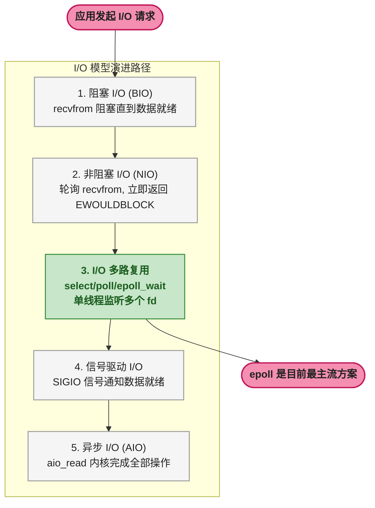

**五种 I/O 模型的核心区别**：

| 模型 | 发起方 | 阻塞点 | 数据拷贝 | 代表 API |
|------|-------|--------|---------|---------|
| 阻塞 I/O | 用户进程 | `recvfrom` 全程阻塞 | 内核→用户（阻塞） | `read()` / `recvfrom()` |
| 非阻塞 I/O | 用户进程 | 轮询阶段忙等 | 内核→用户（阻塞） | `recvfrom(MSG_DONTWAIT)` |
| I/O 多路复用 | 用户进程 | `select`/`epoll_wait` | 内核→用户（阻塞） | `select()` / `epoll_wait()` |
| 信号驱动 I/O | 内核信号 | 无（异步通知） | 内核→用户（阻塞） | `fcntl(F_SETFL, O_ASYNC)` |
| 异步 I/O | 内核 | 全程无阻塞 | 内核→用户（异步） | `aio_read()` |

I/O 多路复用是目前的工业主流方案。它的核心思想是：用一个线程调用 `epoll_wait()`（或 `select`/`poll`），同时阻塞监听多个文件描述符，当任一 fd 就绪时返回，然后逐个处理就绪的 fd。

`select` 和 `poll` 需要在每次调用时传入完整的 fd 集合，内核必须遍历整个集合才能找到就绪的 fd，时间复杂度是 **O(n)**。而 `epoll` 通过内核维护红黑树和就绪列表，将时间复杂度降到了 **O(1)**，这是质的区别。

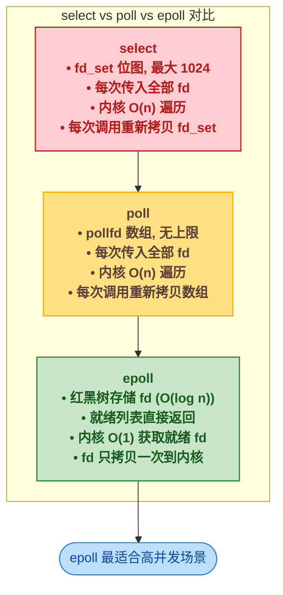

## 3 🐧 epoll 多路复用模型深度解析

### 3.1 🏗️ 整体架构

epoll 是 Linux 2.6 引入的 I/O 多路复用机制。它的设计思路是将"维护被监听的 fd 集合"和"等待 fd 就绪"两个操作分离。下面这张图展示了完整的 epoll 模型：


epoll 由三个系统调用组成：

| 系统调用 | 作用 | 对应内核操作 |
|---------|------|------------|
| `epoll_create()` | 创建一个 epoll 实例 | 分配 `struct eventpoll`，初始化红黑树根（`rbr`）和就绪列表头（`rdllist`） |
| `epoll_ctl(epfd, ADD, fd, ev)` | 向 epoll 实例注册/修改/删除一个 fd | 将 fd 包装为 `epitem` 插入红黑树，同时在 fd 对应的设备等待队列上注册回调函数 `ep_poll_callback` |
| `epoll_wait(epfd, events, maxevents, timeout)` | 等待 fd 就绪事件 | 检查就绪列表 `rdllist`，若不为空则拷贝就绪事件到用户空间；若为空则阻塞等待，直到有 fd 就绪或超时 |

### 3.2 🗂️ 核心数据结构

#### 3.2.1 📦 eventpoll（epoll 实例）

```c
// 源码位置: fs/eventpoll.c (Linux 内核)
struct eventpoll {
    spinlock_t        lock;         // 保护本结构的自旋锁
    struct mutex      mtx;          // 保护文件描述符的互斥锁
    wait_queue_head_t wq;           // epoll_wait 的等待队列
    wait_queue_head_t poll_wait;    // 被 poll 使用的等待队列
    struct list_head  rdllist;      // 就绪文件描述符链表（核心！）
    struct rb_root    rbr;          // 红黑树根节点（存储所有注册的 fd）
    struct epitem    *ovflist;      // 溢出链表
    struct user_struct *user;       // 创建本 epoll 的用户
};
```

**关键字段解释**：

- `rbr`：红黑树根节点。所有通过 `epoll_ctl(ADD)` 注册的 fd 都被包装成 `epitem` 结构，以 fd 为 key 插入这棵红黑树。红黑树保证插入、删除、查找的时间复杂度均为 **O(log n)**。
- `rdllist`：就绪链表头。当某个 fd 上的数据就绪时，内核回调函数 `ep_poll_callback` 将该 fd 对应的 `epitem` 挂入此链表。`epoll_wait` 直接检查此链表而不需要遍历红黑树，时间复杂度 **O(1)**。
- `wq`：等待队列。当用户进程调用 `epoll_wait` 且 `rdllist` 为空时，进程将自己挂在这个等待队列上进入睡眠，直到有事件就绪时被唤醒。

#### 3.2.2 🏷️ epitem（epoll 中的单个 fd 条目）

```c
// 源码位置: fs/eventpoll.c (Linux 内核)
struct epitem {
    union {
        struct rb_node     rbn;     // 红黑树节点（用于挂在 rbr 中）
        struct rcu_head     rcu;    // RCU 释放用
    };
    struct list_head    rdllink;     // 就绪链表节点（用于挂在 rdllist 中）
    struct epoll_filefd  ffd;        // {fd, file} 组合键
    int                  nwait;      // 等待队列数量
    struct list_head     pwqlist;    // poll 等待队列
    struct eventpoll    *ep;         // 所属的 eventpoll 实例
    struct epoll_event   event;      // 用户注册的事件类型
    struct list_head     fllink;     // 链接到文件的 epitem 链表
    wakeup_source_t     *ws;         // 唤醒源
};
```

**关键字段解释**：

- `rbn`：红黑树节点。`epitem` 通过这个字段挂入 `eventpoll.rbr` 红黑树。红黑树的 key 是 `ffd`（fd + file 指针），保证了同一 fd 不会重复注册。
- `rdllink`：就绪链表节点。当 fd 就绪时，`epitem` 通过这个字段挂入 `eventpoll.rdllist`。同一个 `epitem` 可以同时在红黑树和就绪链表中——红黑树负责"有哪些 fd 被注册"，就绪链表负责"哪些 fd 当前有数据可读"。
- `ffd`：文件描述符组合键。包含 fd 号和 `struct file *` 指针，两者组合作为红黑树的 key，防止同一 fd 被不同的 epoll 实例重复注册带来的混淆。
- `ep`：反向指针。指向所属的 `eventpoll`，回调函数通过此指针找到 `rdllist` 并将就绪的 `epitem` 加入其中。
- `event`：存储用户通过 `epoll_ctl` 注册的事件类型（`EPOLLIN`、`EPOLLOUT` 等）。

### 3.3 🔄 三个核心操作的流程

#### 3.3.1 🏗️ epoll_create：创建 epoll 实例

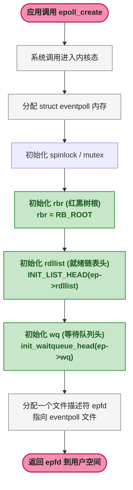

`epoll_create()` 的核心工作是分配并初始化一个 `struct eventpoll`，然后返回一个指向它的文件描述符（epfd）。后续所有 `epoll_ctl` 和 `epoll_wait` 操作都通过这个 epfd 找到对应的 `eventpoll` 实例。

#### 3.3.2 🌳 epoll_ctl(ADD)：注册 fd 到红黑树

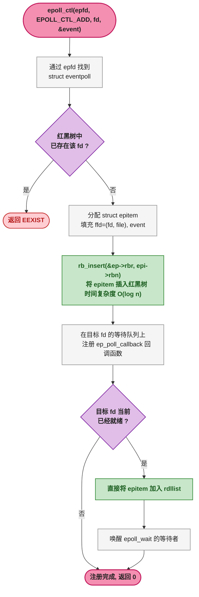

**`epoll_ctl(ADD)` 做两件关键事情**：

1. **将 fd 插入红黑树**：以 `{fd, file}` 为 key 插入 `eventpoll.rbr`。此后 `epoll_wait` 不再需要遍历所有 fd，只需要检查 `rdllist`。
2. **注册回调函数**：在目标 fd 的 `wait_queue` 上注册 `ep_poll_callback`。当这个 fd 上有数据到达时，内核会回调此函数，将对应的 `epitem` 从红黑树挂入 `rdllist`。

这是 epoll 与 select/poll 最本质的区别——select/poll 每次调用都必须传入全部 fd 集合，而 epoll 只在注册时拷贝一次 fd 到内核，且通过红黑树高效维护。

#### 3.3.3 ⏳ epoll_wait：获取就绪事件

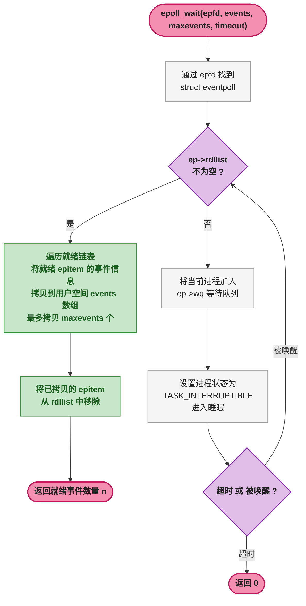

**`epoll_wait` 的关键特性**：

- 它只检查 `rdllist` 就绪链表，**不遍历红黑树**。无论注册了多少个 fd，`epoll_wait` 的时间复杂度都是 **O(1)**（相对于就绪事件的数量）。
- 如果 `rdllist` 为空，调用进程会挂在 `ep->wq` 上睡眠。当任何一个被监听的 fd 就绪时，`ep_poll_callback` 将该进程唤醒。
- 返回的事件只包含就绪的 fd，用户不需要自己判断哪个 fd 有数据。

### 3.4 📡 数据到达时发生了什么（完整的回调链路）

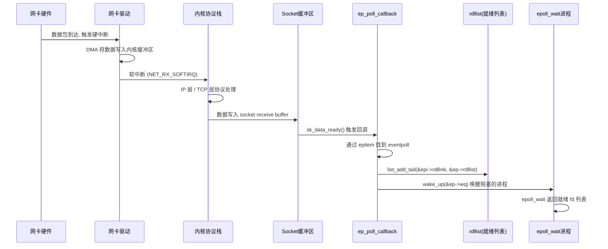

**关键步骤解释**：

1. **网卡收到数据包**：触发硬中断，DMA 将数据从网卡直接写入内核环形缓冲区（Ring Buffer），不占用 CPU。
2. **软中断处理**：内核协议栈在软中断上下文中处理 IP/TCP 协议，将数据写入 Socket 的接收缓冲区。
3. **回调触发**：Socket 缓冲区的 `sk_data_ready` 回调被调用。这正是 `epoll_ctl(ADD)` 注册的 `ep_poll_callback`。
4. **加入就绪列表**：`ep_poll_callback` 通过 `epitem->ep` 反向找到 `eventpoll`，然后调用 `list_add_tail` 将该 `epitem` 挂入 `rdllist`。这步只是链表操作，**不涉及红黑树的任何查找或修改**。
5. **唤醒等待进程**：调用 `wake_up(&ep->wq)` 唤醒在 `epoll_wait` 上阻塞的进程。进程被唤醒后，从 `rdllist` 中取出就绪事件返回给用户空间。

**红黑树与就绪列表的分工**：

| 结构 | 职责 | 操作 | 时间复杂度 |
|------|------|------|:---:|
| 红黑树 `rbr` | 维护所有注册的 fd（长期存储） | `epoll_ctl` 增删 | O(log n) |
| 就绪列表 `rdllist` | 维护当前就绪的 fd（临时存储） | 回调添加、`epoll_wait` 消费 | O(1) |

## 4 💻 epoll + I/O 多路复用 C 语言示例

在进入 Java NIO 之前，先用一段完整的 C 代码验证 epoll 的工作方式。这段代码创建一个 TCP 服务器，使用 epoll 在单线程中管理多个客户端连接。

```c
/*
 * epoll_echo_server.c
 *
 * 使用 epoll 实现单线程 Echo Server。
 * 目标：用 epoll + 非阻塞 I/O 让一个线程管理成千上万个连接。
 *
 * 编译: gcc -o epoll_echo_server epoll_echo_server.c
 * 运行: ./epoll_echo_server
 * 测试: 使用 telnet 或 nc 连接 8080 端口，输入任意文本后收到回显。
 */
#include <stdio.h>
#include <stdlib.h>
#include <string.h>
#include <unistd.h>
#include <errno.h>
#include <fcntl.h>
#include <netinet/in.h>
#include <sys/socket.h>
#include <sys/epoll.h>

#define MAX_EVENTS  1024    // 一次 epoll_wait 最多返回的事件数
#define PORT        8080
#define BUF_SIZE    4096

/*
 * 将 fd 设置为非阻塞模式。
 * 非阻塞是配合 epoll 的关键：
 * epoll 告诉我们 fd 可读，但只保证"至少 1 个字节可读"。
 * 如果用阻塞 read()，可能因为只读了 1 个字节而再次阻塞，
 * 阻塞整个事件循环，导致其他连接饿死。
 */
static void set_nonblocking(int fd) {
    int flags = fcntl(fd, F_GETFL, 0);
    fcntl(fd, F_SETFL, flags | O_NONBLOCK);
}

int main() {
    int listen_fd, epfd;
    struct sockaddr_in addr;
    struct epoll_event ev, events[MAX_EVENTS];

    /*
     * 步骤 1: epoll_create
     * 创建 epoll 实例，返回 epfd。
     * 内核分配 struct eventpoll，初始化 rbr 和 rdllist。
     */
    epfd = epoll_create(1);
    if (epfd == -1) {
        perror("epoll_create");
        exit(EXIT_FAILURE);
    }

    /*
     * 步骤 2: 创建监听 socket
     */
    listen_fd = socket(AF_INET, SOCK_STREAM, 0);
    set_nonblocking(listen_fd);

    memset(&addr, 0, sizeof(addr));
    addr.sin_family      = AF_INET;
    addr.sin_addr.s_addr = INADDR_ANY;
    addr.sin_port        = htons(PORT);
    bind(listen_fd, (struct sockaddr *)&addr, sizeof(addr));
    listen(listen_fd, SOMAXCONN);

    /*
     * 步骤 3: epoll_ctl(ADD)
     * 将 listen_fd 注册到 epoll 实例。
     * 内核将 listen_fd 包装为 epitem 插入 rbr 红黑树，
     * 同时在 listen_fd 的设备等待队列上注册 ep_poll_callback。
     */
    ev.events  = EPOLLIN;     // 监听可读事件（有连接到达）
    ev.data.fd = listen_fd;
    if (epoll_ctl(epfd, EPOLL_CTL_ADD, listen_fd, &ev) == -1) {
        perror("epoll_ctl: listen_fd");
        exit(EXIT_FAILURE);
    }

    printf("Epoll Echo Server listening on port %d (single thread)\n", PORT);

    /*
     * 步骤 4: 事件循环 —— 单线程管理所有连接
     */
    while (1) {
        /*
         * epoll_wait: 检查 rdllist 就绪列表。
         *  - 若 rdllist 非空 → 立即返回就绪事件
         *  - 若 rdllist 为空 → 当前线程阻塞在这里，
         *    直到有 fd 就绪（ep_poll_callback 唤醒）或超时
         */
        int nfds = epoll_wait(epfd, events, MAX_EVENTS, -1);
        if (nfds == -1) {
            perror("epoll_wait");
            break;
        }

        for (int i = 0; i < nfds; i++) {
            int ready_fd = events[i].data.fd;

            /*
             * 情况 A: 监听 socket 可读 → 有新连接到达
             */
            if (ready_fd == listen_fd) {
                while (1) {
                    struct sockaddr_in client_addr;
                    socklen_t client_len = sizeof(client_addr);
                    int client_fd = accept(listen_fd,
                        (struct sockaddr *)&client_addr, &client_len);
                    if (client_fd == -1) {
                        if (errno == EAGAIN || errno == EWOULDBLOCK) {
                            break; // 所有连接已处理完毕
                        }
                        perror("accept");
                        break;
                    }

                    set_nonblocking(client_fd);
                    ev.events  = EPOLLIN;      // 监听客户端可读
                    ev.data.fd = client_fd;

                    /*
                     * epoll_ctl(ADD): 将新客户端 fd 注册到 rbr。
                     * 这个 fd 被插入红黑树，同时注册回调。
                     * 后续这个 fd 上的数据到达时，
                     * ep_poll_callback 会将它加入 rdllist。
                     */
                    if (epoll_ctl(epfd, EPOLL_CTL_ADD, client_fd, &ev) == -1) {
                        perror("epoll_ctl: client_fd");
                        close(client_fd);
                    }
                }
            }
            /*
             * 情况 B: 客户端 socket 可读 → 有数据到达
             */
            else {
                char buf[BUF_SIZE];
                ssize_t count;

                /*
                 * 重要：用循环读取直到 EAGAIN。
                 * epoll 只保证 fd 可读（至少 1 字节），
                 * 但不保证"所有数据一次读完"。
                 * 如果不读到 EAGAIN，剩余数据可能永远不会触发
                 * 下一次 EPOLLIN 事件（取决于触发模式）。
                 */
                while (1) {
                    count = read(ready_fd, buf, sizeof(buf));
                    if (count == -1) {
                        if (errno == EAGAIN || errno == EWOULDBLOCK) {
                            break; // 本次数据已读完
                        }
                        perror("read");
                        goto close_conn;
                    }
                    if (count == 0) {
                        goto close_conn; // 客户端关闭连接
                    }
                    write(ready_fd, buf, count); // 回显
                }
                continue; // 跳过 close_conn

close_conn:
                /*
                 * epoll_ctl(DEL): 从 epoll 实例中移除 fd。
                 * 内核从 rbr 红黑树中删除该 epitem，
                 * 并注销回调函数。
                 *
                 * 注意：关闭连接前要先从 epoll 中移除，
                 * 否则内核在关闭 fd 后会自动删除注册，
                 * 但显式删除是更规范的做法。
                 */
                epoll_ctl(epfd, EPOLL_CTL_DEL, ready_fd, NULL);
                close(ready_fd);
            }
        }
    }

    close(listen_fd);
    close(epfd);
    return 0;
}
```

**这段代码揭示了 epoll 多路复用的核心模式**：

| 步骤 | 操作 | 内核行为 |
|:---:|------|---------|
| ① | `epoll_create` | 创建 `eventpoll`，初始化 `rbr` 和 `rdllist` |
| ② | `epoll_ctl(ADD)` | 将 fd 插入 `rbr` 红黑树，注册 `ep_poll_callback` |
| ③ | `epoll_wait` | 检查 `rdllist`，空则阻塞，有数据则返回 |
| ④ | 处理就绪 fd | `accept`（新连接）或 `read`/`write`（数据） |
| ⑤ | `epoll_ctl(DEL)` | 从 `rbr` 删除 fd，注销回调 |

**单线程管理 10,000 个连接的秘密就在这里**：线程阻塞在 `epoll_wait`（步骤 ③），只有当 `rdllist` 中有就绪 fd 时才被唤醒处理。CPU 只会花费时间在处理真正有数据到达的连接上，而不是在 10,000 个空闲连接上轮询。

## 5 ☕ Java NIO（多路复用）—— 第七阶段

前面用 C 语言验证了 epoll 的原理，现在进入 Java 世界的对应实现。

Java 的 I/O 模型经历了七个阶段的演进：BIO → 线程池 BIO → 非阻塞 I/O → NIO（Selector）→ NIO 2.0（AIO）→ Netty 封装 → 协程/响应式。**第七阶段——Java NIO 多路复用**——正是对 epoll 的面向对象封装，让 Java 开发者无需直接调用 C 系统调用即可享受 epoll 的高性能。

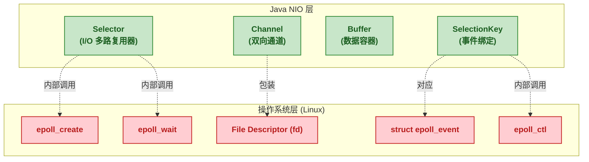

### 5.1 🧩 NIO 三大核心组件

Java NIO（`java.nio` 包，JDK 1.4+）围绕着三个核心组件构建：

| 组件 | 作用 | 重要方法 | 对应 epoll 概念 |
|------|------|---------|:---:|
| **Buffer** | 数据容器，所有 I/O 操作通过 Buffer 进行 | `flip()`, `clear()`, `compact()` | 用户空间内存缓冲区 |
| **Channel** | 双向通道，可同时读和写，必须非阻塞模式 | `read()`, `write()`, `register()` | 文件描述符（fd） |
| **Selector** | I/O 多路复用器，单线程管理多个 Channel | `select()`, `selectedKeys()` | `epoll_wait()` |

三者的协作关系如下：

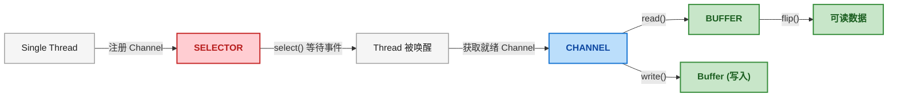

**Selector 是 epoll 的 Java 化身**。它内部封装了 `epoll_create`（构造时）、`epoll_ctl`（`register()` 时）、`epoll_wait`（`select()` 时）三个系统调用。在 Linux 2.6+ 上，Java NIO 的 `Selector.open()` 默认返回 `EPollSelectorImpl`，直接使用 epoll 机制。

```java
// Selector 内部的平台适配（简化示意）
// 源码位置: JDK src/java.base/linux/classes/sun/nio/ch/EPollSelectorImpl.java
class EPollSelectorImpl extends SelectorImpl {
    // 对应 epoll_create: 创建 epoll 实例
    EPollSelectorImpl(SelectorProvider sp) {
        super(sp);
        // native epoll_create
        this.epfd = EPoll.create();
    }

    // 对应 epoll_ctl: 注册/修改 fd
    void implRegister(SelectionKeyImpl ski) {
        // native epoll_ctl(epfd, EPOLL_CTL_ADD, fd, events)
        EPoll.ctl(epfd, EPOLL_CTL_ADD, fd, translate(ski.interestOps()));
    }

    // 对应 epoll_wait: 等待就绪事件
    protected int doSelect(long timeout) throws IOException {
        // native epoll_wait(epfd, events, maxevents, timeout)
        return EPoll.wait(epfd, pollArray, NUM_ENTRIES, timeout);
    }
}
```

### 5.2 🧠 Buffer 的难点（必须搞懂）

Buffer 是 Java NIO 中最容易出错的组件。它是一个可以写入和读取数据的**内存块**，通过三个关键属性管理读写位置。

#### 5.2.1 🔢 三个核心属性

| 属性 | 含义 | 写模式下的值 | 读模式下的值 |
|------|------|:---:|:---:|
| `capacity` | 总容量（分配后不变） | 固定值（如 1024） | 固定值 |
| `position` | 当前读/写指针位置 | 下一个要写入的位置 | 下一个要读取的位置 |
| `limit` | 上限位置 | `= capacity`（可写满） | `= 原 position`（只能读到之前写入的位置） |

用一张图来直观展示：

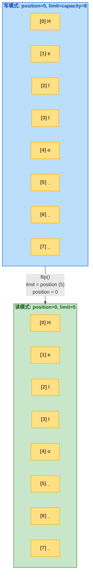

#### 5.2.2 🔑 三个关键操作

| 操作 | 作用 | 伪代码 | 使用场景 |
|------|------|--------|---------|
| `flip()` | 将 Buffer 从**写模式切换到读模式** | `limit = position; position = 0;` | Channel 读取数据到 Buffer 后，准备从 Buffer 中取出数据 |
| `clear()` | 将 Buffer 重置为**写模式** | `position = 0; limit = capacity;` | 准备向 Buffer 写入新数据（旧数据被丢弃） |
| `compact()` | 将未读数据移到开头，切换为**写模式** | `System.arraycopy(未读数据, 0, buffer, 0, remaining); position = remaining; limit = capacity;` | 已读了一部分数据但还有未读数据，需要继续写入新数据 |

源码角度验证 `flip()` 的实现：

```java
// java.nio.Buffer (JDK 源码)
public final Buffer flip() {
    limit = position;    // 你能读的最后一个位置=你写到的位置
    position = 0;        // 从头开始读
    mark = -1;           // 清除标记
    return this;
}

public final Buffer clear() {
    position = 0;        // 从头开始写
    limit = capacity;    // 可以写满整个 buffer
    mark = -1;
    return this;
}
```

`flip()` 的两个赋值解释：
- `limit = position`：之前 `write` 了多少个字节，现在就只能读多少个字节。这是防止读过头读到了"垃圾数据"。
- `position = 0`：从第一个字节开始读。

`clear()` 并不真正清除数据，只是重置指针。旧数据仍然在 Buffer 中，但会被新的写入覆盖。

#### 5.2.3 📦 compact() 的使用场景

`compact()` 是 Buffer 中最容易理解错的操作。它解决的是"读了一半想继续写"的情况：

```java
// 场景：从 Channel 读到 Buffer，处理了一部分数据，但还有剩余
ByteBuffer buffer = ByteBuffer.allocate(1024);
channel.read(buffer);   // buffer: [H][e][l][l][o][W][o][r][l][d] position=10

buffer.flip();          // 切换读模式: position=0, limit=10
byte[] header = new byte[5];
buffer.get(header);     // 读取 5 个字节 "Hello": position=5

// 现在 position=5，但后面还有 "World" 没读
// 如果调用 clear()，position 重置为 0，"World" 就会被丢弃
// 调用 compact()：把 "World" 移到开头，position=5，可以继续写入
buffer.compact();       // buffer: [W][o][r][l][d][W][o][r][l][d] position=5
                        //                  ^--- 这部分数据还在，但 position 指向可写位置
channel.read(buffer);   // 从 position=5 继续写入新数据
```

`compact()` 的源码逻辑：

```java
// java.nio.HeapByteBuffer (JDK 源码)
public ByteBuffer compact() {
    int pos = position();
    int rem = limit() - pos;
    // 将 position 到 limit 之间的未读数据复制到数组开头
    System.arraycopy(hb, ix(pos), hb, ix(0), rem);
    position(rem);       // position = 未读数据的长度
    limit(capacity());   // limit = capacity (写模式)
    return this;
}
```

### 5.3 ✍️ 手写 NIO EchoServer（必做）

下面是一个完整的 NIO Echo Server。这段代码将前面的 epoll C 示例用 Java 重写，展示了 Buffer、Channel、Selector 如何协同工作。

```java
import java.io.IOException;
import java.net.InetSocketAddress;
import java.nio.ByteBuffer;
import java.nio.channels.SelectionKey;
import java.nio.channels.Selector;
import java.nio.channels.ServerSocketChannel;
import java.nio.channels.SocketChannel;
import java.util.Iterator;
import java.util.Set;

/**
 * NIO EchoServer —— 单线程管理成千上万个连接。
 *
 * 对照关系：
 *   Selector.select()  →  epoll_wait()
 *   Channel.register() →  epoll_ctl(ADD)
 *   SelectionKey       →  epoll_event + epitem
 *   ByteBuffer         →  用户空间缓冲区
 */
public class NioEchoServer {
    private static final int PORT = 8080;
    private static final int BUF_SIZE = 1024;

    public static void main(String[] args) throws IOException {
        /*
         * 步骤 1: 创建 Selector
         * 在 Linux 上，Selector.open() 内部调用 epoll_create，
         * 返回 EPollSelectorImpl 实例。
         */
        Selector selector = Selector.open();

        /*
         * 步骤 2: 创建 ServerSocketChannel，绑定端口
         */
        ServerSocketChannel serverChannel = ServerSocketChannel.open();
        serverChannel.bind(new InetSocketAddress(PORT));

        /*
         * 步骤 3: 设为非阻塞模式
         * 这是关键！如果不设非阻塞，register() 会抛出
         * IllegalBlockingModeException。
         * 相当于 C 语言中的 fcntl(fd, F_SETFL, O_NONBLOCK)。
         */
        serverChannel.configureBlocking(false);

        /*
         * 步骤 4: 将 ServerSocketChannel 注册到 Selector
         * 内部调用 epoll_ctl(ADD, server_fd, EPOLLIN)。
         * OP_ACCEPT = 对 EPOLLIN 事件（有新连接到达）。
         */
        serverChannel.register(selector, SelectionKey.OP_ACCEPT);

        System.out.println("NIO EchoServer started on port " + PORT);

        /*
         * 步骤 5: 事件循环
         */
        while (true) {
            /*
             * selector.select() 内部调用 epoll_wait：
             *   - 若 rdllist 不为空 → 立即返回
             *   - 若 rdllist 为空 → 线程阻塞，直到有 fd 就绪
             *
             * 返回值是就绪的 Channel 数量。
             */
            int readyChannels = selector.select();
            if (readyChannels == 0) {
                continue; // 超时返回，无就绪事件
            }

            /*
             * selectedKeys() 返回就绪的 SelectionKey 集合。
             * 内部对应 epoll_wait 返回的 epoll_event 数组。
             */
            Set<SelectionKey> selectedKeys = selector.selectedKeys();
            Iterator<SelectionKey> keyIterator = selectedKeys.iterator();

            while (keyIterator.hasNext()) {
                SelectionKey key = keyIterator.next();

                // ─── 分支 1: 有新连接到达 ───
                if (key.isAcceptable()) {
                    ServerSocketChannel ssc = (ServerSocketChannel) key.channel();
                    SocketChannel clientChannel = ssc.accept();
                    clientChannel.configureBlocking(false);

                    /*
                     * 将新客户端 Channel 注册到 Selector，监听 OP_READ。
                     * 内部调用 epoll_ctl(ADD, client_fd, EPOLLIN)。
                     */
                    clientChannel.register(selector, SelectionKey.OP_READ);
                    System.out.println("New client: " + clientChannel.getRemoteAddress());
                }
                // ─── 分支 2: 客户端有数据到达 ───
                else if (key.isReadable()) {
                    SocketChannel clientChannel = (SocketChannel) key.channel();
                    ByteBuffer buffer = ByteBuffer.allocate(BUF_SIZE);

                    /*
                     * channel.read(buffer):
                     *   数据从内核 Socket 缓冲区 → 用户空间 ByteBuffer
                     *   position 前进 count 个字节
                     */
                    int bytesRead = clientChannel.read(buffer);

                    if (bytesRead == -1) {
                        // 客户端关闭连接
                        key.cancel();  // 内部调用 epoll_ctl(DEL)
                        clientChannel.close();
                        System.out.println("Client disconnected");
                        keyIterator.remove();
                        continue;
                    }

                    /*
                     * flip(): 写模式 → 读模式
                     *   limit = position (实际读到的字节数)
                     *   position = 0
                     */
                    buffer.flip();

                    /*
                     * channel.write(buffer):
                     *   数据从用户空间 ByteBuffer → 内核 Socket 缓冲区
                     *   position 前进 count 个字节
                     */
                    clientChannel.write(buffer); // 回显
                }

                /*
                 * 重要：必须手动移除已处理的 key。
                 * Selector 不会自动清除 selectedKeys 集合。
                 */
                keyIterator.remove();
            }
        }
    }
}
```

**这个 NIO EchoServer 与 C 版本的结构完全对应**：

| C epoll 版本 | Java NIO 版本 | 说明 |
|-------------|-------------|------|
| `epoll_create(1)` | `Selector.open()` | 创建多路复用器实例 |
| `epoll_ctl(ADD, fd, EPOLLIN)` | `channel.register(selector, OP_ACCEPT/OP_READ)` | 注册 fd 到多路复用器 |
| `epoll_wait()` | `selector.select()` | 阻塞等待 I/O 事件 |
| `events[i].data.fd` | `selector.selectedKeys()` | 获取就绪事件列表 |
| `read(fd, buf, size)` | `channel.read(buffer)` | 从内核读取数据 |
| `write(fd, buf, size)` | `channel.write(buffer)` | 向内核写入数据 |
| `fcntl(fd, F_SETFL, O_NONBLOCK)` | `channel.configureBlocking(false)` | 设为非阻塞模式 |
| `epoll_ctl(DEL, fd, NULL)` | `key.cancel()` | 取消 fd 的注册 |

### 5.4 🔗 底层对应关系

Java NIO 的三个核心组件与 Linux epoll 底层机制之间存在精确的映射关系：

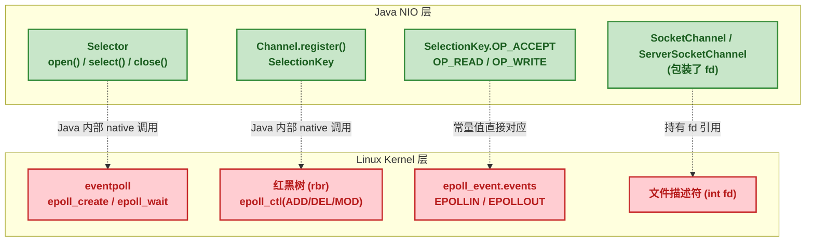

#### 5.4.1 🗺️ 事件常量映射

| Java NIO | Linux 底层 | 常量值 | 触发条件说明 |
|---------|-----------|:---:|---------|
| `SelectionKey.OP_ACCEPT` | `EPOLLIN` | `1 << 4` | 有新的客户端连接到达（仅 `ServerSocketChannel`） |
| `SelectionKey.OP_READ` | `EPOLLIN` | `1 << 0` | Socket 接收缓冲区中有数据可读 |
| `SelectionKey.OP_WRITE` | `EPOLLOUT` | `1 << 2` | Socket 发送缓冲区有空闲空间可写 |
| `SelectionKey.OP_CONNECT` | `EPOLLOUT` | `1 << 3` | 客户端连接建立完成（仅 `SocketChannel`） |

注意：`OP_ACCEPT` 和 `OP_READ` 在 Linux 底层都对应 `EPOLLIN` 事件，但 Java 层通过 Channel 类型区分——`ServerSocketChannel` 上的 `EPOLLIN` 意味着有新连接，`SocketChannel` 上的 `EPOLLIN` 意味着有数据可读。

#### 5.4.2 📋 核心方法映射

| Java NIO 方法 | Linux 系统调用 | 内核内部操作 |
|-------------|-------------|------------|
| `Selector.open()` | `epoll_create()` | 创建 `struct eventpoll`，初始化红黑树根 `rbr` 和就绪列表头 `rdllist` |
| `channel.register(sel, ops)` | `epoll_ctl(EPOLL_CTL_ADD)` | 分配 `epitem`，插入 `rbr` 红黑树，在 fd 等待队列注册 `ep_poll_callback` |
| `selector.select()` | `epoll_wait()` | 检查 `rdllist`，有就绪事件则拷贝到用户空间；无则阻塞在 `ep->wq` |
| `selector.selectedKeys()` | 遍历返回的 `epoll_event[]` | 从 `rdllist` 中取出就绪的 `epitem`，提取 `events` 和 `data.fd` |
| `key.cancel()` / `channel.close()` | `epoll_ctl(EPOLL_CTL_DEL)` | 从 `rbr` 红黑树中删除 `epitem`，注销回调函数 |

#### 5.4.3 🖥️ Selector 在不同平台的实现

Java NIO 的 `Selector` 在不同操作系统上底层会自动选择最优实现：

| 平台 | Selector 实现类 | 底层系统调用 | 特点 |
|------|:---:|---------|------|
| Linux (2.6+) | `EPollSelectorImpl` | `epoll` | O(1) 就绪事件获取，红黑树存储 fd |
| macOS / FreeBSD | `KQueueSelectorImpl` | `kqueue` | 与 epoll 类似的 BSD 多路复用机制 |
| Windows | `WindowsSelectorImpl` | `select` | Windows 使用 select 实现（性能最差） |
| 老的 Linux (2.4-) | `PollSelectorImpl` | `poll` | Linux 2.4 之前用 poll 替代 |

可以通过 JVM 参数强制指定 Selector 实现（通常不需要，仅供调试）：

```bash
# 强制使用 poll 实现（而非 epoll）
java -Djava.nio.channels.spi.SelectorProvider=sun.nio.ch.PollSelectorProvider ...
```

#### 5.4.4 ⚡ epoll 的两种触发模式在 NIO 中的体现

epoll 有两种事件触发模式，对应到 Java NIO 的行为差异：

| 触发模式 | epoll 标志 | Java NIO 对应行为 | 特点 |
|---------|----------|---------------|------|
| **水平触发** (Level-Triggered, LT) | 默认模式（`event.events`） | 每次 `select()` 都会报告就绪的 fd，直到数据被读完 | 安全但可能重复通知 |
| **边缘触发** (Edge-Triggered, ET) | `EPOLLET` 标志 | Java NIO 不使用 ET 模式 | 只在状态变化时通知一次，必须循环读到 `EAGAIN` |

Java NIO 的 `Selector` 默认使用 **水平触发**（LT）模式。这意味着如果读了一半数据就返回，下次 `select()` 仍会通知该 fd 可读。这比边缘触发更安全，不需要开发者保证"一次读完所有数据"，代价是可能多一次不必要的 `select()` 返回。

但在高性能场景中（如 Netty），边缘触发更高效。Netty 底层直接使用 JNI 调用原生 epoll，通过 `EPOLLET` 标志实现边缘触发模式。

## 6 🎯 总结

### 6.1 🗺️ 完整知识图谱

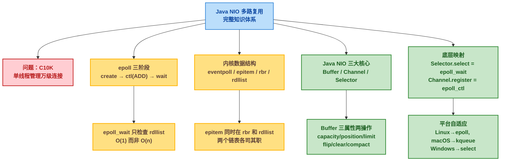

### 6.2 📊 核心要点总结表

| 层级 | 要点 | 关键知识 |
|------|------|---------|
| **问题驱动** | 为什么需要 I/O 多路复用？ | 传统 BIO 每个连接一个线程，C10K 问题下内存和 CPU 无法承受 |
| **epoll 原理** | epoll 为什么比 select/poll 快？ | select/poll 每次调用都传入全部 fd 并 **O(n)** 遍历；epoll 用红黑树维护 fd、就绪列表直接返回，获取事件 **O(1)** |
| **红黑树 (rbr)** | 红黑树存什么？ | 所有注册的 fd 被包装为 `epitem` 插入红黑树，只在 `epoll_ctl` 时变动，`epoll_wait` 不碰它 |
| **就绪列表 (rdllist)** | 就绪列表怎么用？ | 当 fd 数据就绪时，回调函数将对应 `epitem` 挂入 `rdllist`；`epoll_wait` 直接消费此列表 |
| **回调机制** | 谁触发回调？ | 网卡中断 → 协议栈 → Socket 缓冲区就绪 → `ep_poll_callback` → 加入 `rdllist` → 唤醒 `epoll_wait` |
| **Java Buffer** | 最容易出错的地方 | `flip()` 写转读（`limit=position, position=0`）；`clear()` 重置写模式；`compact()` 保留未读数据再写 |
| **Java Channel** | 为什么必须非阻塞？ | 阻塞模式下 `register()` 会抛异常；非阻塞 + Selector 才能实现一个线程管理多个 Channel |
| **Java Selector** | select() 内部是什么？ | Linux 上 `Selector.open()` 返回 `EPollSelectorImpl`，`select()` 内部调用 `epoll_wait` |
| **平台适配** | 不同 OS 怎么选？ | JVM 自动选择：Linux → epoll，macOS → kqueue，Windows → select（性能最差） |
| **触发模式** | LT 还是 ET？ | Java NIO 默认水平触发（LT），重复通知直到数据读完；Netty 通过 JNI 支持边缘触发（ET） |

### 6.3 🔄 从 C 到 Java 的完整对照

你在这篇文章中学到的知识，跨越了三个层次：

| 层次 | 内容 | 技能 |
|------|------|------|
| **内核层** | `eventpoll` / `epitem` / `rbr` / `rdllist` / `ep_poll_callback` | 理解 epoll 的内核实现原理 |
| **系统调用层** | `epoll_create` / `epoll_ctl` / `epoll_wait` | 能用 C 语言写出 epoll Echo Server |
| **Java NIO 层** | `Buffer` / `Channel` / `Selector` / `SelectionKey` | 能用 Java NIO 写出 Echo Server，理解底层映射 |

这三个层次是递进的：内核的数据结构设计（红黑树 + 就绪列表分离）决定了系统调用的高性能特性（O(1) 获取就绪事件），系统调用的语义被 JVM 封装为 Java NIO 的面相对象 API（Selector/Channel/Buffer）。当你在写 `selector.select()` 时，底层就是 `epoll_wait` 在检查 `rdllist` 并返回就绪事件——这就是从 C10K 问题到"单线程管理成千上万个连接"的完整技术链路。
