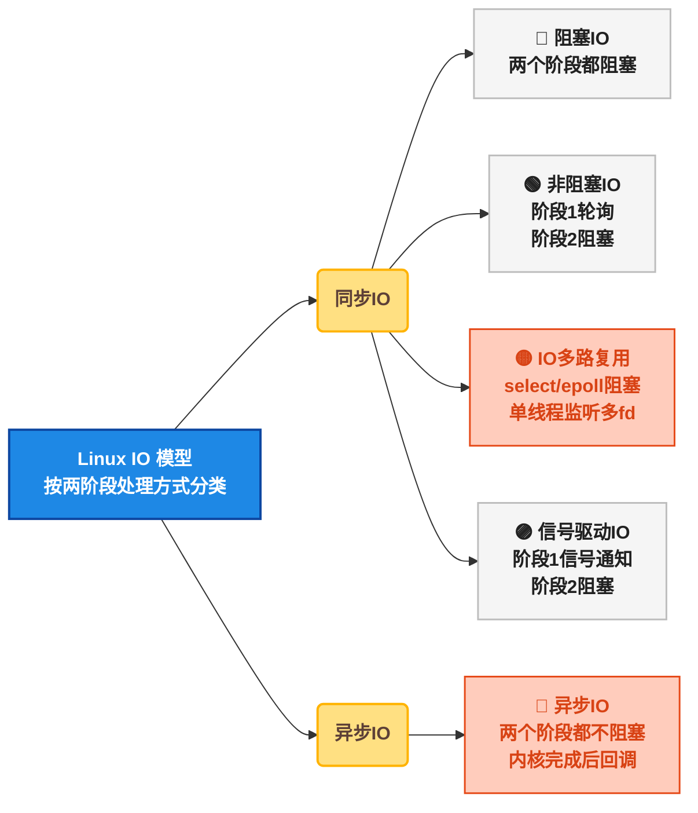
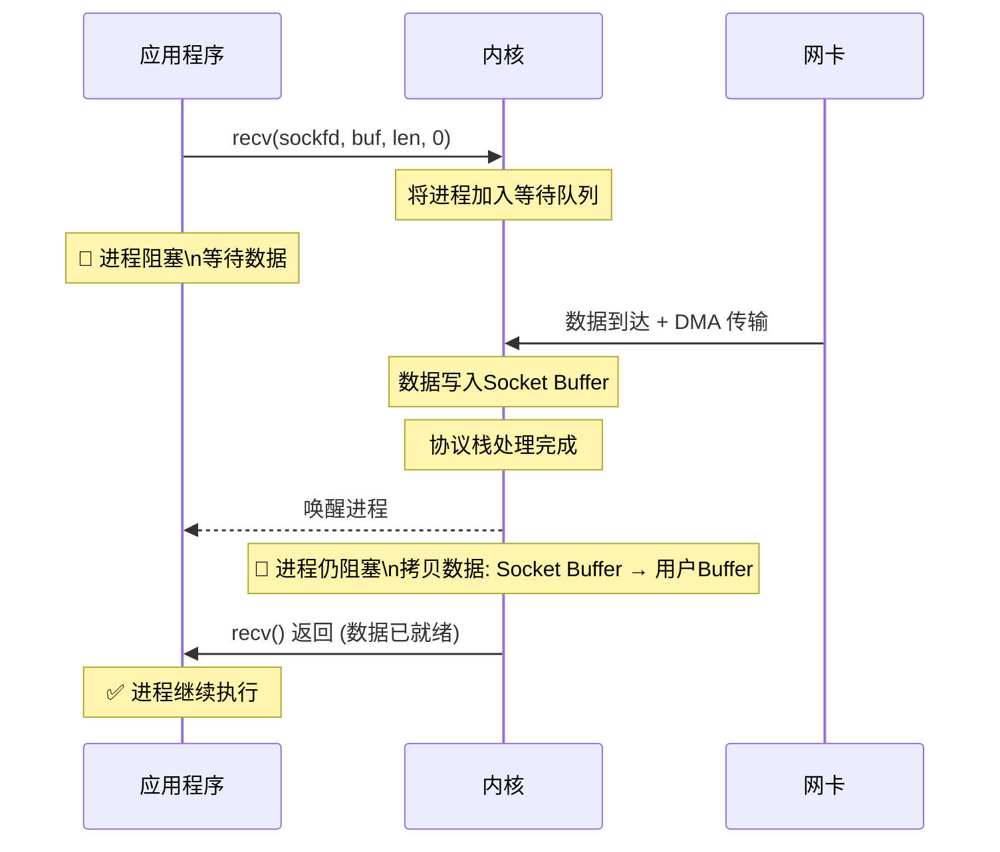
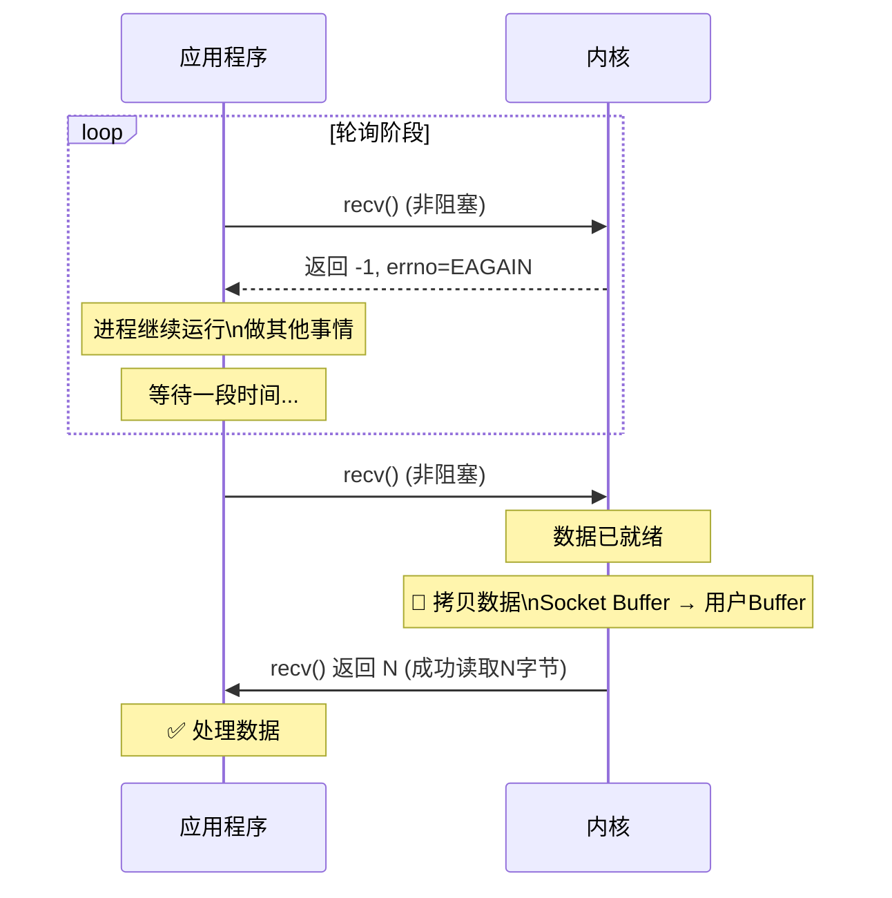
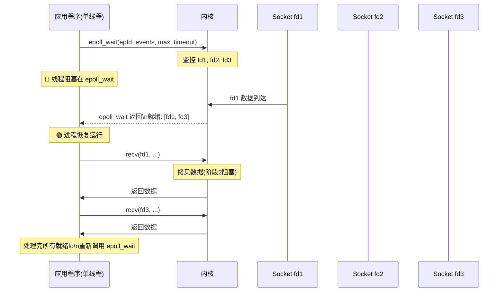
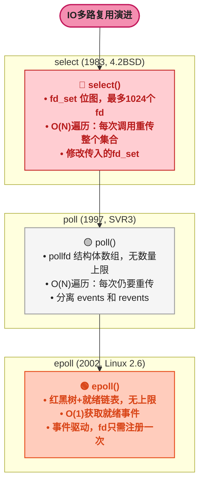
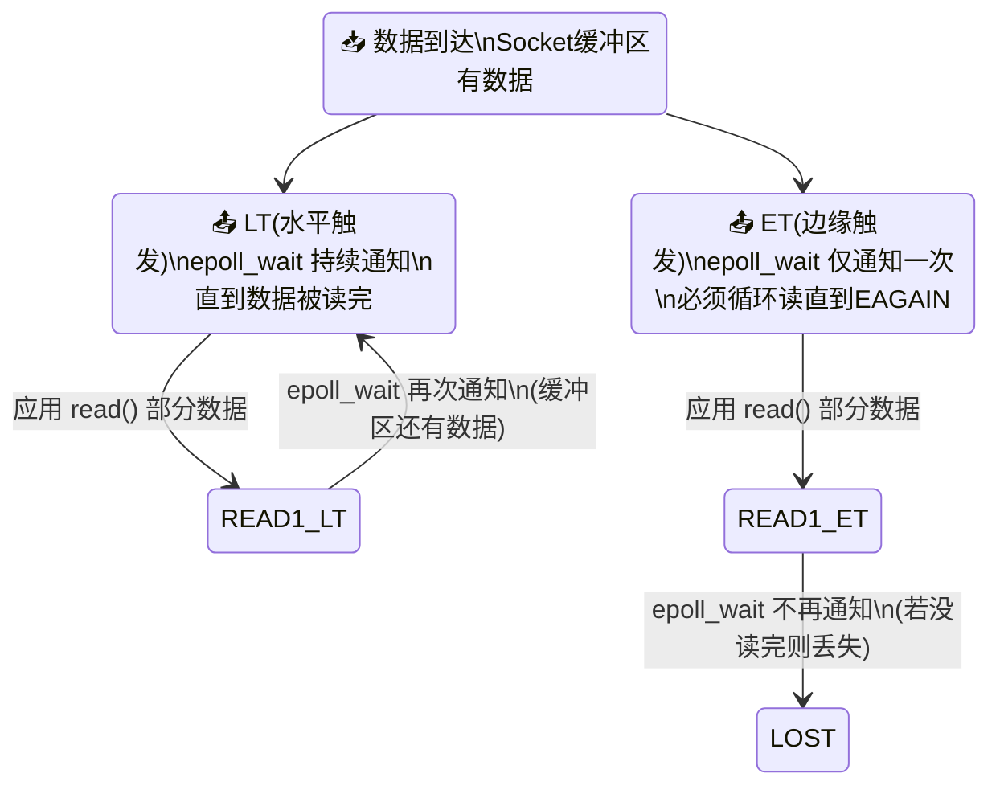
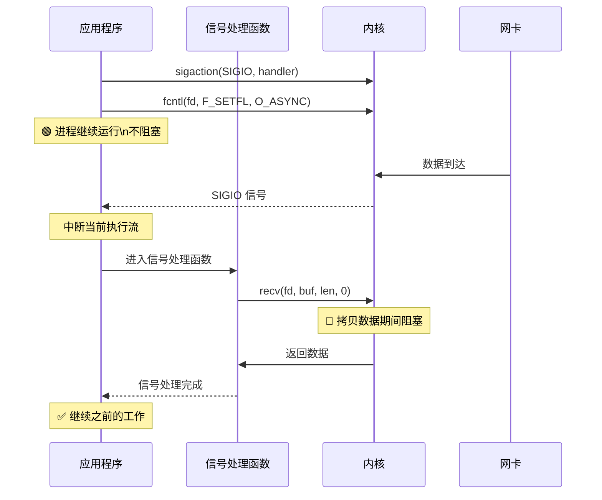
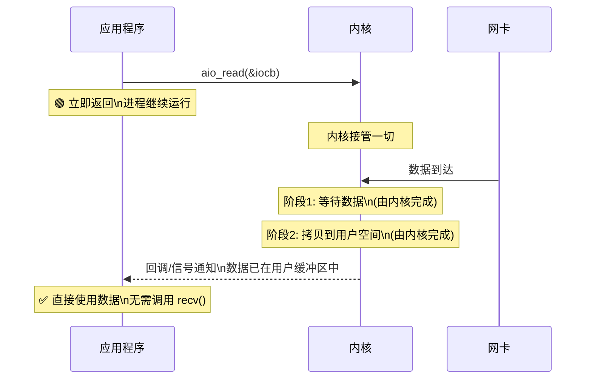
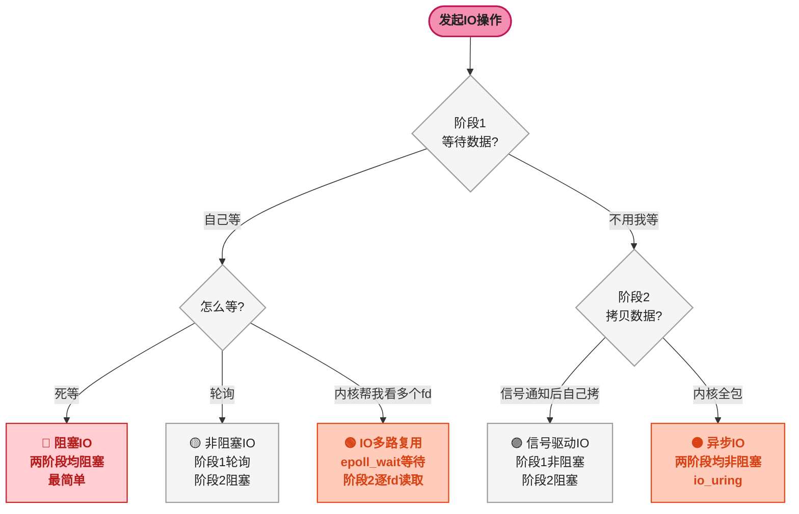

# Linux IO 模型：阻塞、非阻塞、多路复用与异步 IO 全解析

## 1 ⚡ 问题切入：一个后端开发者必须回答的问题

假设你在面试中被问到： **"一台 4 核 8GB 的服务器，为什么能支撑 10 万个并发连接？"**

答案的关键不在于 CPU 有多快、内存有多大，而在于 **IO 模型** 。如果每个连接用一个线程、每个线程做阻塞 IO，10 万连接就需要 10 万个线程——每个线程消耗约 1MB 栈空间，仅线程栈就占 100GB 内存，4 核 CPU 也根本无法调度这么多线程。

真正让高并发成为可能的，是 **非阻塞 IO** 和 **IO 多路复用** （I/O Multiplexing，单个线程同时监听多个 IO 事件）。Nginx、Redis、Netty 的高性能都建立在正确的 IO 模型选择之上。

这篇博客从操作系统层面讲解 Linux 五大 IO 模型，聚焦于"数据如何从网卡/磁盘到达你的程序"，为后续理解 Java NIO、Netty、Kafka 等框架打下理论基础。

## 2 💻 硬件架构：一次 IO 操作经历了什么

在讨论 IO 模型之前，必须先理解一次 IO 操作涉及哪些硬件组件以及数据如何流转。


如上图所示，一次典型的网络 IO 读取，数据经过以下路径：

| 步骤 | 操作 | 参与者 | 说明 |
|:---:|------|------|------|
| 1 | 网卡收到数据包 | NIC（网卡） | 硬件中断通知 CPU |
| 2 | DMA 拷贝到内核 | DMA 控制器 → Socket Buffer | 不经过 CPU，直接内存访问 |
| 3 | 内核协议栈处理 | TCP/IP 协议栈 | 解析 TCP 头、重组数据、校验 |
| 4 | CPU 拷贝到用户空间 | Socket Buffer → 用户 Buffer | CPU 执行 `copy_to_user()` |
| 5 | 应用程序读取 | 用户进程 | 从用户 Buffer 读取数据并处理 |

**两个核心概念** ：

- **DMA Copy** （Direct Memory Access，直接内存访问）：硬件设备直接将数据写入内存，不经过 CPU。发生时 CPU 可以做其他事情，仅在传输完成时收到一个中断
- **CPU Copy** ：CPU 执行指令将数据从内核缓冲区复制到用户缓冲区（`copy_to_user()` / `copy_from_user()`），CPU 被占用

整个 IO 过程可以分为 **两个阶段** ：

1. **等待数据** （Wait for Data）：等待网卡收到数据、DMA 传输完成、内核协议栈处理完毕
2. **拷贝数据** （Copy Data）：内核缓冲区 → 用户缓冲区（CPU Copy）

**五大 IO 模型的区别，本质上就是对这两个阶段的处理方式不同** 。

## 3 🗺️ Linux 五大 IO 模型总览



**同步与异步的区分标准** ： **同步 IO** 是指应用程序主动发起 IO 操作并等待（或轮询）其完成，在数据从内核缓冲区拷贝到用户缓冲区期间，应用程序线程参与其中。 **异步 IO** 是指应用程序发起 IO 操作后立即返回，内核完成所有工作（包括拷贝数据到用户空间），然后通知应用程序。

## 4 🔴 阻塞 IO（Blocking IO）

### 4.1 📖 原理

阻塞 IO 是最简单、最直观的模型。应用程序调用 `recv()`，内核在 **两个阶段都阻塞** ：

- 阶段 1（等待数据）：如果 Socket 缓冲区中没有数据，进程/线程被挂起，加入 **等待队列** （Wait Queue，内核数据结构 `wait_queue_head_t`，存储等待此事件的进程列表），直到数据到达后被唤醒
- 阶段 2（拷贝数据）：内核将数据从 Socket 缓冲区拷贝到用户缓冲区，进程/线程在这期间也是阻塞的



### 4.2 💻 C API 示例

```c
#include <sys/socket.h>
#include <unistd.h>

void blocking_io_example() {
    int sockfd = socket(AF_INET, SOCK_STREAM, 0);
    // ... connect to server ...

    char buf[4096];
    // 阻塞等待：没有数据就一直等，进程被挂起
    ssize_t n = recv(sockfd, buf, sizeof(buf), 0);
    // 只有收到数据或出错时才返回

    if (n > 0) {
        write(STDOUT_FILENO, buf, n); // 处理数据
    }
    close(sockfd);
}
```

**代码解读** ：`recv()` 默认是阻塞的（`flags=0` 表示阻塞模式）。如果 Socket 缓冲区为空，当前进程/线程会被操作系统挂起，直到数据到达。期间 **CPU 可以调度其他进程运行** ，这是阻塞 IO 唯一的性能红利——进程阻塞时不占 CPU。

### 4.3 ⚠️ 特点与瓶颈

| 优点 | 缺点 |
|------|------|
| 编程模型简单，代码易读 | 一个线程只能处理一个连接 |
| 进程阻塞时不占 CPU | 高并发时需要大量线程 |
| 适合连接数少的场景 | 线程切换开销大，内存消耗大 |

<span style="color:red">**后端开发者应该记住**</span> ：传统 Tomcat/BIO 模式就是阻塞 IO——每个请求分配一个线程，请求处理完之前线程一直被占用。当并发连接达到数千时，线程数爆炸，性能急剧下降。

## 5 🟡 非阻塞 IO（Non-Blocking IO）

### 5.1 📖 原理

通过 `fcntl()` 将 Socket 设为 **非阻塞模式** （`O_NONBLOCK`），`recv()` 的行为改变：

- 阶段 1（等待数据）： **立即返回** 。如果数据未就绪，返回 `-1` 且 `errno=EAGAIN`
- 阶段 2（拷贝数据）：如果数据就绪，仍然阻塞完成 CPU Copy

应用程序需要 **主动轮询** （Polling）：反复调用 `recv()` 检查数据是否就绪。



### 5.2 💻 C API 示例

```c
#include <fcntl.h>
#include <errno.h>

void nonblocking_io_example() {
    int sockfd = socket(AF_INET, SOCK_STREAM, 0);

    // 设置为非阻塞模式
    int flags = fcntl(sockfd, F_GETFL, 0);
    fcntl(sockfd, F_SETFL, flags | O_NONBLOCK);

    char buf[4096];
    while (1) {
        ssize_t n = recv(sockfd, buf, sizeof(buf), 0);

        if (n > 0) {
            // 成功读取到数据
            write(STDOUT_FILENO, buf, n);
            break;
        } else if (n == -1 && errno == EAGAIN) {
            // 数据未就绪，做一些其他事情
            // 然后继续轮询
            usleep(1000); // 等1ms再试
        } else {
            // 真正的错误
            break;
        }
    }
    close(sockfd);
}
```

**代码解读** ：设置 `O_NONBLOCK` 后，`recv()` 不再阻塞。数据未就绪时返回 `-1`，需要检查 `errno` 是否为 `EAGAIN` 或 `EWOULDBLOCK`（两者值相同）。如果是，说明只是暂时没有数据；如果是其他值，说明真的出错了。

### 5.3 ⚠️ 问题：轮询浪费 CPU

非阻塞 IO 的最大问题是 **忙轮询** （Busy Polling）：在数据未就绪期间，应用程序反复调用 `recv()`，虽然每次立即返回，但 **频繁的系统调用本身消耗 CPU** 。如果有 1000 个连接要做非阻塞检查，每轮询一遍就是 1000 次系统调用。

```c
// 用 strace 可以看到大量 EAGAIN 返回
// strace -e trace=recvfrom ./nonblocking_app 2>&1 | head -20
//
// recvfrom(3, 0x..., 4096, 0, ...) = -1 EAGAIN
// recvfrom(3, 0x..., 4096, 0, ...) = -1 EAGAIN
// recvfrom(3, 0x..., 4096, 0, ...) = -1 EAGAIN
// ... 大量无效调用 ...
```

这就引出了 IO 多路复用—— **让内核来帮忙检查哪些连接就绪，一次系统调用检查所有连接** 。

## 6 🟢 IO 多路复用（IO Multiplexing）

### 6.1 💡 核心思想

IO 多路复用的核心思想是： **用一个系统调用，让内核同时监控多个文件描述符（fd），当至少一个 fd 就绪时返回，应用程序再对有数据的 fd 做真正的 `read()` / `recv()`** 。



### 6.2 📈 select / poll / epoll 演进

Linux 提供了三种 IO 多路复用接口，按出现顺序分别是 select、poll、epoll：



### 6.3 📊 三者的核心区别

| 特性 | select | poll | epoll |
|------|--------|------|-------|
| **数据结构** | `fd_set` 位图（默认 1024 bits） | `struct pollfd[]` 数组 | 内核红黑树 + 就绪链表 |
| **fd 上限** | `FD_SETSIZE`（1024，可重编译） | 无上限（受系统限制） | 无上限（受系统限制） |
| **fd 注册** | 每次调用都传入全部 fd | 每次调用都传入全部 fd | 一次注册（`epoll_ctl`），持久有效 |
| **就绪查找** | O(N) 遍历所有 fd | O(N) 遍历所有 fd | O(1) 直接从就绪链表取 |
| **内核态数据结构** | 每次重新构建 | 每次重新构建 | 红黑树持久，事件驱动回调 |
| **触发方式** | 水平触发 | 水平触发 | 水平触发 + 边缘触发 |

### 6.4 💻 epoll API 示例

```c
#include <sys/epoll.h>

void epoll_example() {
    // 1. 创建 epoll 实例
    int epfd = epoll_create1(0);   // 返回 epoll 文件描述符

    // 2. 注册要监控的 fd
    struct epoll_event ev, events[64];
    ev.events = EPOLLIN;           // 监控可读事件（数据到达）
    ev.data.fd = sockfd;           // 关联的 fd
    epoll_ctl(epfd, EPOLL_CTL_ADD, sockfd, &ev);

    // 3. 事件循环
    while (1) {
        // 阻塞等待事件，timeout=-1 表示无限等待
        int nfds = epoll_wait(epfd, events, 64, -1);

        // 只处理就绪的 fd —— O(1) 级别
        for (int i = 0; i < nfds; i++) {
            if (events[i].events & EPOLLIN) {
                int fd = events[i].data.fd;
                char buf[4096];
                ssize_t n = recv(fd, buf, sizeof(buf), 0);
                if (n > 0) {
                    // 处理数据
                }
            }
        }
    }
    close(epfd);
}
```

**代码解读** ：

1. `epoll_create1(0)` 在内核中创建一个 `eventpoll` 对象，包含一棵 **红黑树** （`rbr`，存储注册的 fd）和一个 **就绪链表** （`rdllist`，存储就绪的事件）
2. `epoll_ctl(epfd, EPOLL_CTL_ADD, sockfd, &ev)` 将 fd 注册到红黑树中，同时向内核协议栈注册一个 **回调函数** （`ep_poll_callback`）——当数据到达时，内核自动将事件加入就绪链表
3. `epoll_wait()` 检查就绪链表，如果有事件直接返回。每次只传递发生事件的那几个 fd（`events` 数组），而不是全部 fd

**epoll 高性能的本质** ： **回调 + 就绪链表** 。fd 注册一次后永久有效，数据到达时由内核回调自动将事件加入就绪链表。`epoll_wait()` 不需要遍历所有监视的 fd，只需要检查就绪链表，真正的 O(1) 获取。

### 6.5 ⚡ 水平触发 vs 边缘触发



| 模式 | 行为 | 要求 | 适用场景 |
|------|------|------|------|
| **水平触发（LT，默认）** | 只要缓冲区有数据，`epoll_wait()` 就反复通知 | 可以一次只读部分数据 | 简单，不易出错 |
| **边缘触发（ET）** | 只在状态变化时（无数据→有数据）通知一次 | 必须循环读，直到 `EAGAIN`，fd 必须设为非阻塞 | 高性能，配合非阻塞 IO |

ET 模式必须用非阻塞 IO + 循环读取，代码更复杂但性能更高——减少了 `epoll_wait` 的调用次数。

## 7 🟣 信号驱动 IO（Signal-Driven IO）

### 7.1 📖 原理

通过 `sigaction()` + `fcntl(F_SETOWN)` + `fcntl(F_SETFL, O_ASYNC)` 设置。当 Socket 数据就绪时，内核发送 `SIGIO` 信号给进程。进程在 **信号处理函数** 中调用 `recv()` 读取数据。

- 阶段 1（等待数据）：进程继续运行，不阻塞。数据就绪时内核发信号
- 阶段 2（拷贝数据）：在信号处理函数中执行 `recv()` 时仍然阻塞



### 7.2 💻 C API 示例

```c
#include <signal.h>
#include <fcntl.h>

void sigio_handler(int signo) {
    char buf[4096];
    // 在信号处理函数中执行 recv (复杂且容易出错)
    ssize_t n = recv(global_sockfd, buf, sizeof(buf), 0);
    // ...
}

void signal_driven_io_example() {
    int sockfd = socket(AF_INET, SOCK_STREAM, 0);

    // 注册信号处理函数
    struct sigaction sa = { .sa_handler = sigio_handler };
    sigaction(SIGIO, &sa, NULL);

    // 设置 fd 的所有者（谁接收信号）
    fcntl(sockfd, F_SETOWN, getpid());

    // 启用异步通知
    int flags = fcntl(sockfd, F_GETFL, 0);
    fcntl(sockfd, F_SETFL, flags | O_ASYNC);

    // 进程继续做其他事情，数据到达时自动触发 sigio_handler
    while (1) {
        // 做其他工作...
    }
}
```

### 7.3 ⚠️ 为什么信号驱动 IO 很少用

1. **信号处理函数限制多** ：在信号处理函数中只能调用"异步信号安全"的函数（`recv()` 不是，使用它是一种灰色地带）
2. **信号不可靠** ：多个数据到达时信号可能合并，导致只触发一次
3. **无法知道是哪个 fd 就绪** ：需要遍历所有 fd 检查
4. **调试困难** ：信号的异步特性增加了程序的复杂性

JDK 的 NIO 框架没有采用信号驱动模型，而是使用了 IO 多路复用（`epoll` / `kqueue`）。

## 8 🔵 异步 IO（Asynchronous IO）

### 8.1 📖 原理

Linux 通过 `io_submit()` + `aio_read()` 实现真正的异步 IO。应用程序发起 IO 请求后 **立即返回** ，内核完成 **两个阶段** （等待数据 + 拷贝数据）后，通过 **回调** 或 **信号** 通知应用程序。

- 阶段 1 和阶段 2：内核全部完成， **应用程序完全不被阻塞**



### 8.2 💻 C API 示例

```c
#include <linux/aio_abi.h>
#include <sys/syscall.h>

void aio_example() {
    aio_context_t ctx = 0;
    // 1. 创建异步IO上下文
    syscall(SYS_io_setup, 128, &ctx);

    // 2. 准备读取缓冲区
    char buf[4096];
    struct iocb cb = {0};
    cb.aio_fildes = fd;          // 文件描述符
    cb.aio_lio_opcode = IOCB_CMD_PREAD;
    cb.aio_buf = (uint64_t)buf;  // 用户缓冲区地址
    cb.aio_nbytes = sizeof(buf);
    cb.aio_offset = 0;

    struct iocb *cbs[] = {&cb};
    // 3. 提交异步读请求 —— 立即返回！
    syscall(SYS_io_submit, ctx, 1, cbs);

    // 4. 进程继续做其他事情...
    // 做业务逻辑、处理其他请求等

    // 5. 查询是否完成（或设置回调/信号通知）
    struct io_event ev;
    syscall(SYS_io_getevents, ctx, 1, 1, &ev, NULL);
    // ev.res 包含实际读取的字节数
    // ev.obj->aio_buf 就是之前传入的 buf，数据已在其中
}
```

### 8.3 🔮 异步 IO 的现状

Linux 原生异步 IO（AIO） **只对 `O_DIRECT` 方式打开的文件有效** ，即绕过 Page Cache 的直接 IO。对于普通文件（使用 Page Cache 缓冲），AIO 实际上仍然是阻塞的。这使得 Linux 原生 AIO 的适用范围很窄（主要用在数据库直接读写裸设备）。

`io_uring`（Linux 5.1+, 2019）是新一代异步 IO 接口，通过 **共享内存环形队列** （Submission Queue + Completion Queue）实现真正的零拷贝异步 IO，比 AIO 更高效、更通用，是 Linux 异步 IO 的未来方向。

## 9 🎯 五大模型对比总结



| 模型 | 阶段1(等数据) | 阶段2(拷贝) | 关键系统调用 | 复杂度 | 并发能力 | 代表框架 |
|------|:---:|:---:|------|:---:|:---:|------|
| **阻塞IO** | 阻塞 | 阻塞 | `read/recv` | 低 | 低 | 传统Tomcat BIO |
| **非阻塞IO** | 轮询 | 阻塞 | `recv+fcntl` | 中 | 低 | 无（一般不单独用） |
| **多路复用** | select/epoll阻塞 | 逐fd阻塞 | `epoll_wait+recv` | 高 | 高 | Nginx、Redis、Netty |
| **信号驱动** | 非阻塞(信号) | 阻塞 | `sigaction+fcntl` | 极高 | 中 | 几乎不用 |
| **异步IO** | 非阻塞 | 非阻塞 | `aio_read/io_uring` | 极高 | 极高 | io_uring (下一代) |

### 9.1 📌 后端开发者应该记住的结论

1. **阻塞 IO** 只有一个线程一个连接的场景适合，高并发下不可行
2. **非阻塞 IO** 单独使用轮询成本高，需要配合多路复用
3. **IO 多路复用** 是现代高并发服务器的核心——一个线程可以管理数万个连接。epoll 的 O(1) 就绪查找是 Redis 单线程高性能的关键
4. **信号驱动 IO** 实际应用很少，主要在嵌入式或特殊场景
5. **异步 IO** （io_uring）是下一代方向，但目前主流框架仍基于 epoll 多路复用构建

### 9.2 ☕ 在 Java 中的对应

| Linux 模型 | Java 对应 |
|------|------|
| 阻塞 IO | `java.io`（传统 BIO），`InputStream.read()` 阻塞当前线程 |
| IO 多路复用（epoll） | `java.nio.channels.Selector`（NIO），底层在 Linux 上调用 `epoll_wait` |
| 异步 IO | `java.nio.channels.AsynchronousSocketChannel`（AIO, Java 7+），但在 Linux 上层是 epoll + 线程池模拟 |

Java NIO 的 `Selector` 封装了 `epoll`（Linux）/ `kqueue`（macOS）/ `IOCP`（Windows），为 Java 开发者提供了统一的 IO 多路复用 API。而 Netty 框架进一步封装了 NIO，提供了事件驱动的编程模型，是目前 Java 高性能网络编程的事实标准。
