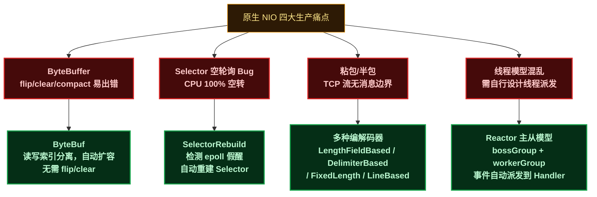
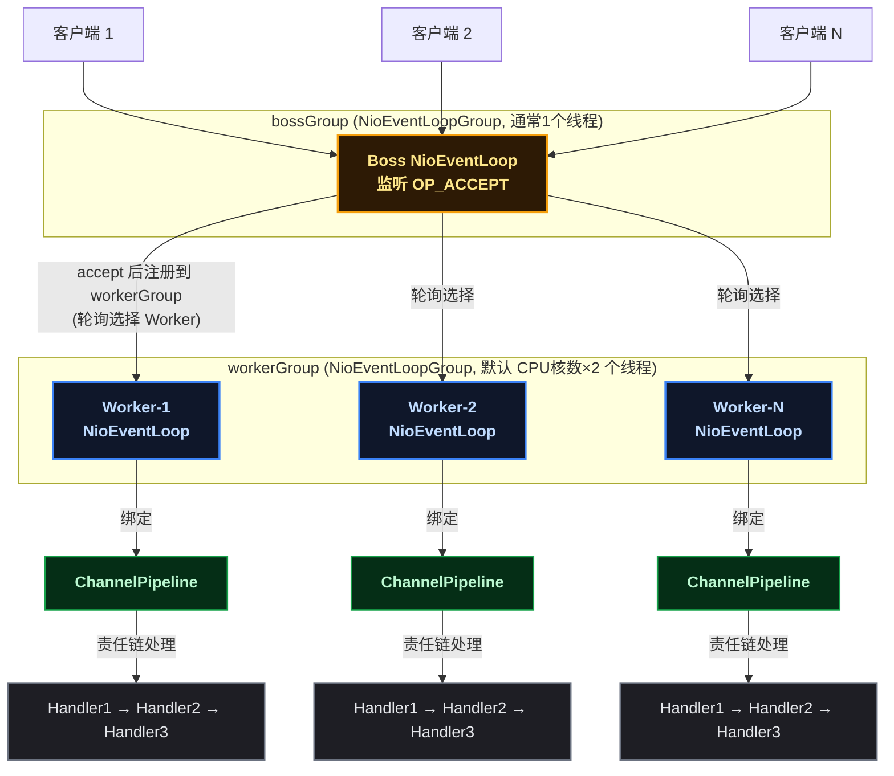
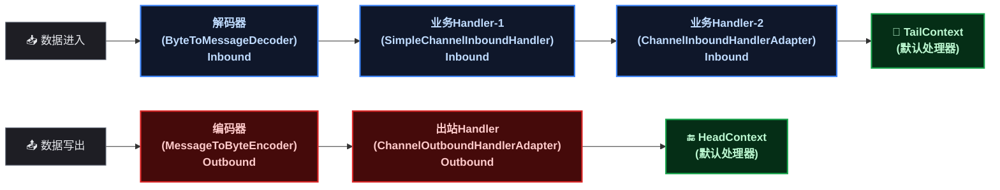
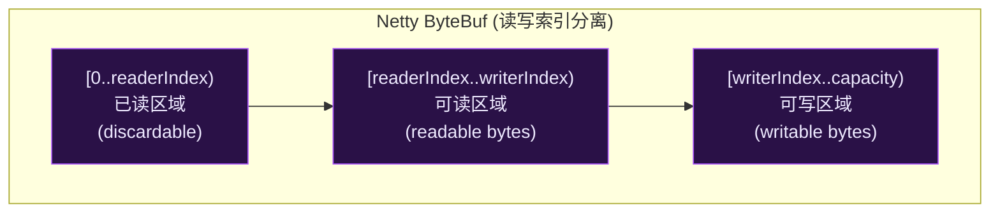
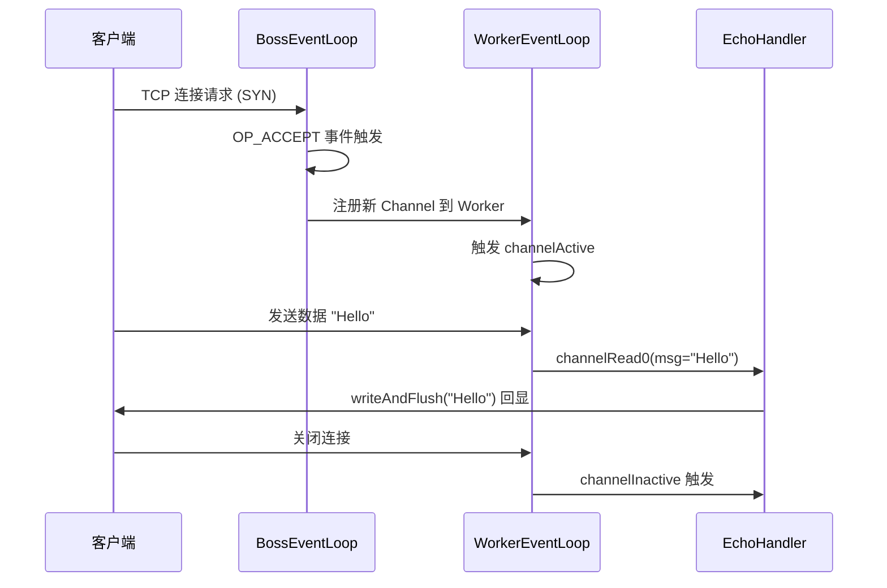

# Netty：Reactor 线程模型、Pipeline 责任链与四个必写示例全解析

## 1 ⚡ 问题切入：原生 NIO 能工作，但你敢上生产吗？

在上一篇 Java NIO 博客中，我们手写了一个 NIO EchoServer——单线程管理多个连接，Selector 封装 epoll。这段代码在演示环境中运行良好，但如果直接部署到生产环境，会遇到四个棘手问题：

```java
// 原生 NIO EchoServer 的核心循环（看似正确，实则隐患重重）
while (true) {
    selector.select();
    for (SelectionKey key : selector.selectedKeys()) {
        if (key.isAcceptable()) {
            SocketChannel client = ssc.accept();
            client.configureBlocking(false);
            client.register(selector, SelectionKey.OP_READ);
        } else if (key.isReadable()) {
            SocketChannel client = (SocketChannel) key.channel();
            ByteBuffer buf = ByteBuffer.allocate(1024);
            int len = client.read(buf);   // 问题1: 读到半包怎么办？
            buf.flip();                    // 问题2: 忘了 flip 直接炸
            client.write(buf);             // 问题3: 写不出去谁管？
            buf.clear();                   // 问题4: clear 还是 compact？
        }
        keyIterator.remove();
    }
}
```

**原生 NIO 的四大生产痛点**：

| 原生 NIO 问题 | 现象 | 严重后果 |
|-------------|------|---------|
| **ByteBuffer 操作复杂** | `flip()`/`clear()`/`compact()` 三个方法容易混淆，读模式写模式切换是高频 Bug 来源 | 数据错乱、缓冲区溢出、读到脏数据 |
| **Selector 空轮询 Bug** | Linux 下 `epoll_wait` 在特定内核版本可能返回 0，但 Java 的 `Selector.select()` 却返回了，导致 CPU 100% 空转 | 线上服务器 CPU 持续跑满，业务无响应 |
| **粘包/半包** | TCP 是流式协议，`read()` 一次读到的可能是半个包（半包），也可能一次读到两个包（粘包） | 业务数据解析错乱，消息边界丢失 |
| **线程模型需手写** | 原生 NIO 只提供 Selector 机制，线程如何分配、事件如何派发全部需要开发者自己设计 | 线程模型混乱，代码维护性差，扩展困难 |

这四个问题不是"会不会遇到"的问题，而是"什么时候遇到"的问题。**Netty**（`netty.io`，JBoss 开源的异步事件驱动网络应用框架）就是为解决这些问题而设计的。它在原生 NIO 之上构建了一套完整的网络编程基础设施，被 `gRPC`、`Dubbo`、`Elasticsearch`、`Cassandra` 等众多中间件用作底层通信框架。



## 2 🏗️ Reactor 线程模型：Netty 的骨架

### 2.1 ❓ 什么是 Reactor 模型

**Reactor**（反应器模式，一种事件驱动的并发模型）的核心思想是：由一个或多个线程专门负责监听 I/O 事件，事件到达后分发给对应的 Handler（处理器）处理。Netty 采用的是 **主从 Reactor 模型** （Main-Reactor / Sub-Reactor）：

- **bossGroup**（主 Reactor）：负责监听 TCP 连接请求（`OP_ACCEPT`），接受连接后注册到 workerGroup
- **workerGroup**（从 Reactor）：负责处理已建立连接上的 I/O 读写事件（`OP_READ`、`OP_WRITE`）



**关键设计细节**：

- 每个 `NioEventLoop` 内部绑定了一个 `Selector`（即一个 epoll 实例），一个线程驱动一个 Selector
- 一个 Channel（连接）从创建到销毁，始终绑定在同一个 `NioEventLoop` 上，保证了 **无锁串行化** （同一连接的所有事件由同一线程处理，无需加锁）
- Boss 线程通常只需 1 个（因为监听端口只需要处理 `accept`，开销极小）

### 2.2 🔍 EventLoop 的内部结构

```java
// Netty 源码简化示意: io.netty.channel.nio.NioEventLoop
public final class NioEventLoop extends SingleThreadEventLoop {
    // 每个 EventLoop 持有独立的 Selector (内部是 epoll 实例)
    private Selector selector;
    // 关联的线程
    private volatile Thread thread;
    // 任务队列：外部线程提交的任务存在这里
    private final Queue<Runnable> taskQueue;

    @Override
    protected void run() {
        for (;;) {
            // 1. select(): 检查就绪 Channel (底层 epoll_wait)
            selector.select(timeoutMillis);
            // 2. processSelectedKeys(): 处理 I/O 事件
            processSelectedKeys();
            // 3. runAllTasks(): 执行任务队列中的 Runnable
            runAllTasks();
        }
    }
}
```

每个 `NioEventLoop` 的核心循环分三步：`select` → `processSelectedKeys` → `runAllTasks`。这与我们上一篇博客中手写的 NIO 事件循环结构完全一致，但 Netty 在每一步都做了细致的工程化处理。

## 3 🧩 Netty 核心组件详解

以下七个组件按照学习顺序排列，由简到难：

### 3.1 🧵 EventLoopGroup（线程池组）

`EventLoopGroup` 是一组 `EventLoop` 的集合，对外提供统一的线程池接口。

| 组件 | 类型 | 默认线程数 | 职责 |
|------|------|:---:|------|
| `bossGroup` | `NioEventLoopGroup` | 1 | 监听端口，接受连接 |
| `workerGroup` | `NioEventLoopGroup` | `CPU核数 × 2` | 处理连接的读写事件 |

```java
// 创建两个 EventLoopGroup
EventLoopGroup bossGroup   = new NioEventLoopGroup(1);     // boss 组，1 个线程即可
EventLoopGroup workerGroup = new NioEventLoopGroup();      // worker 组，默认 CPU核数*2
```

**为什么 boss 只需要 1 个线程？** 一个服务端通常只监听少数几个端口，`accept()` 本身是轻量操作（只是从内核的 SYN 队列中取出已完成的连接），单个线程完全能够处理。Worker 的数量设为 CPU 核数的两倍，是为了充分利用多核——每个 Worker 线程负责多个 Channel，同一个 Channel 的所有操作串行化，避免锁竞争。

### 3.2 🚀 ServerBootstrap（启动引导器）

`ServerBootstrap` 是服务端的启动配置类，将所有组件组装在一起：

```java
ServerBootstrap bootstrap = new ServerBootstrap();
bootstrap.group(bossGroup, workerGroup)                          // ① 绑定两个线程组
         .channel(NioServerSocketChannel.class)                   // ② 指定 Channel 类型
         .option(ChannelOption.SO_BACKLOG, 128)                   // ③ TCP 参数
         .childOption(ChannelOption.SO_KEEPALIVE, true)           // ④ 客户端 Channel 参数
         .childHandler(new ChannelInitializer<SocketChannel>() {  // ⑤ 客户端 Channel 处理器
             @Override
             protected void initChannel(SocketChannel ch) {
                 // 添加 Handler 到 Pipeline
                 ch.pipeline().addLast(new MyHandler());
             }
         });

ChannelFuture future = bootstrap.bind(8080).sync();  // 绑定端口，启动服务
```

**`option()` 与 `childOption()` 的区别**：

| 方法 | 作用对象 | 示例 |
|------|---------|------|
| `option()` | Boss Channel（`NioServerSocketChannel`） | `SO_BACKLOG`（等待队列长度）、`SO_REUSEADDR` |
| `childOption()` | Worker Channel（`NioSocketChannel`） | `SO_KEEPALIVE`、`TCP_NODELAY` |

### 3.3 🔧 ChannelInitializer（通道初始化器）

`ChannelInitializer` 是一个特殊的 ChannelHandler，在 Channel 注册到 EventLoop 后、正式开始处理事件之前，执行一次初始化。**它只运行一次，初始化完成后自动从 Pipeline 中移除自己**。

```java
.childHandler(new ChannelInitializer<SocketChannel>() {
    @Override
    protected void initChannel(SocketChannel ch) {
        ChannelPipeline p = ch.pipeline();
        p.addLast(new StringDecoder());       // 解码: ByteBuf → String
        p.addLast(new StringEncoder());       // 编码: String → ByteBuf
        p.addLast(new MyBusinessHandler());   // 业务逻辑
    }
});
```

初始化顺序就是 Handler 在 Pipeline 中的顺序。上面代码中，数据进入时依次经过 `StringDecoder` → `MyBusinessHandler`，数据写出时依次经过 `StringEncoder` → `MyBusinessHandler`（出站顺序与入站相反）。

### 3.4 🔗 ChannelPipeline（责任链）

**ChannelPipeline**（通道管道，Handler 的容器，采用责任链模式）是每个 Channel 独享的一条 Handler 链，负责编排入站和出站的处理流程。



**Pipeline 的两条处理链**：

| 方向 | 触发方式 | 经过的 Handler 类型 | 处理顺序 |
|------|---------|-------------------|---------|
| **入站** (Inbound) | 数据从网络到达（`channelRead`） | `ChannelInboundHandler` | 从 Head → Tail，**正向**执行 |
| **出站** (Outbound) | 数据写出到网络（`write`） | `ChannelOutboundHandler` | 从 Tail → Head，**反向**执行 |

**关键规则**：Handler 通过 `addLast()` 添加到 Pipeline 后，入站事件按添加顺序执行，出站事件按添加的 **逆序** 执行。编解码器通常添加到业务 Handler 之前（入站先解码再处理，出站先处理再编码）。

### 3.5 🎯 ChannelHandler（业务处理器）

ChannelHandler 是开发者编写业务逻辑的地方。Netty 提供了几个常用的基类：

| 基类 | 处理方向 | 使用场景 |
|------|:---:|------|
| `ChannelInboundHandlerAdapter` | 入站 | 重写 `channelRead()` 处理数据，需要手动释放 ByteBuf |
| `SimpleChannelInboundHandler<T>` | 入站 | 泛型指定消息类型，**自动释放 ByteBuf**，推荐使用 |
| `ChannelOutboundHandlerAdapter` | 出站 | 重写 `write()` 拦截写出操作 |

```java
// 使用 SimpleChannelInboundHandler —— 最常用的业务 Handler 写法
public class EchoHandler extends SimpleChannelInboundHandler<ByteBuf> {
    @Override
    protected void channelRead0(ChannelHandlerContext ctx, ByteBuf msg) {
        // msg 是解码后的消息，方法结束后自动释放
        ctx.writeAndFlush(msg);  // 回显
    }

    @Override
    public void channelActive(ChannelHandlerContext ctx) {
        System.out.println("Client connected: " + ctx.channel().remoteAddress());
    }

    @Override
    public void channelInactive(ChannelHandlerContext ctx) {
        System.out.println("Client disconnected: " + ctx.channel().remoteAddress());
    }

    @Override
    public void exceptionCaught(ChannelHandlerContext ctx, Throwable cause) {
        cause.printStackTrace();
        ctx.close();  // 发生异常时关闭连接
    }
}
```

**`ChannelHandlerContext`**（Handler 上下文）是 Handler 与 Pipeline 之间的桥梁。通过 `ctx` 可以：
- `ctx.writeAndFlush(msg)`：从当前 Handler 向前一个出站 Handler 写出数据
- `ctx.channel()`：获取所属的 Channel
- `ctx.pipeline()`：获取所属的 Pipeline
- `ctx.fireChannelRead(msg)`：将事件传递给下一个入站 Handler

### 3.6 📦 ByteBuf（自动扩容的缓冲区）

ByteBuf 是 Netty 对 `java.nio.ByteBuffer` 的替代品，解决了原生 ByteBuffer 的三大痛点：



| 对比维度 | `java.nio.ByteBuffer` | `io.netty.buffer.ByteBuf` |
|---------|----------------------|--------------------------|
| **读写切换** | 需要 `flip()` 切换模式 | `readerIndex` / `writerIndex` 分离，无需 flip |
| **容量** | 固定 `capacity`，无法扩容 | `capacity` 自动扩容（默认最大 `Integer.MAX_VALUE`） |
| **索引** | 单一 `position` 指针 | `readerIndex`（读指针）+ `writerIndex`（写指针） |
| **引用计数** | 无，依赖 GC | `ReferenceCounted` 引用计数，可池化复用 |
| **池化** | 无 | `PooledByteBufAllocator` 池化，减少 GC 压力 |
| **零拷贝** | 无 | `CompositeByteBuf`、`Unpooled.wrappedBuffer()` |

**核心 API**：

```java
// 创建 ByteBuf
ByteBuf buf = Unpooled.buffer(256);         // 非池化，初始容量 256

// 写入（writerIndex 自动前进）
buf.writeInt(42);                           // 写入 int（4 字节）
buf.writeBytes("Hello".getBytes());         // 写入字节数组

// 读取（readerIndex 自动前进）
int value = buf.readInt();                  // 读取 int（如果可读字节不够抛异常）
byte[] bytes = new byte[buf.readableBytes()];
buf.readBytes(bytes);                       // 读取所有可读字节

// 查询（不移动指针）
buf.getByte(0);                             // 按绝对位置读取，不影响 readerIndex

// 标记与回退
buf.markReaderIndex();                      // 标记当前读位置
buf.resetReaderIndex();                     // 回退到标记的读位置

// 丢弃已读数据（compact）
buf.discardReadBytes();                     // 将可读区域移到开头，释放已读空间

// 引用计数
buf.retain();                               // 引用计数 +1
buf.release();                              // 引用计数 -1，归零后释放内存
```

### 3.7 🔐 编解码器

Netty 提供了丰富的编解码器，处理"字节 → 消息对象"和"消息对象 → 字节"的转换：

| 编解码器 | 类型 | 作用 |
|---------|:---:|------|
| `StringDecoder` | 入站 | `ByteBuf` → `String` |
| `StringEncoder` | 出站 | `String` → `ByteBuf` |
| `LengthFieldBasedFrameDecoder` | 入站 | 基于长度字段的粘包/半包解决器 |
| `DelimiterBasedFrameDecoder` | 入站 | 基于分隔符的粘包/半包解决器 |
| `FixedLengthFrameDecoder` | 入站 | 基于固定长度的粘包/半包解决器 |
| `LineBasedFrameDecoder` | 入站 | 基于换行符的粘包/半包解决器 |
| `ObjectDecoder` | 入站 | 反序列化 Java 对象 |
| `ObjectEncoder` | 出站 | 序列化 Java 对象 |

**粘包/半包解决方案的核心原理**：

```java
// LengthFieldBasedFrameDecoder 参数详解
new LengthFieldBasedFrameDecoder(
    1024 * 1024,   // maxFrameLength: 最大帧长度，超过则抛异常
    0,             // lengthFieldOffset: 长度字段偏移量（从第几个字节开始）
    4,             // lengthFieldLength: 长度字段占几个字节
    0,             // lengthAdjustment: 长度调整值
    4              // initialBytesToStrip: 解码后剥离前几个字节
);
```

这个解码器会先读取长度字段（第 0 ~ 3 字节的 int 值，表示 body 长度），然后等待后续数据到达直到凑齐完整的 body，最后将完整的一帧交给下一个 Handler。

## 4 ✍️ 四个必写示例

以下四个示例从简到难，覆盖 Netty 的核心使用场景。

### 4.1 📡 Echo 服务器（理解基本流程）

Echo 服务器是最简单的 Netty 程序——收到什么就回发什么。它展示了 Netty 的启动、Handler 注册、消息处理的完整骨架：

```java
import io.netty.bootstrap.ServerBootstrap;
import io.netty.buffer.ByteBuf;
import io.netty.channel.*;
import io.netty.channel.nio.NioEventLoopGroup;
import io.netty.channel.socket.SocketChannel;
import io.netty.channel.socket.nio.NioServerSocketChannel;

/**
 * Netty Echo Server —— 最简示例。
 * 启动后监听 8080 端口，收到任何数据原样返回。
 * 测试: telnet localhost 8080
 */
public class NettyEchoServer {
    private final int port;

    public NettyEchoServer(int port) {
        this.port = port;
    }

    public void start() throws InterruptedException {
        EventLoopGroup bossGroup   = new NioEventLoopGroup(1);
        EventLoopGroup workerGroup = new NioEventLoopGroup();

        try {
            ServerBootstrap b = new ServerBootstrap();
            b.group(bossGroup, workerGroup)
             .channel(NioServerSocketChannel.class)
             .childHandler(new ChannelInitializer<SocketChannel>() {
                 @Override
                 protected void initChannel(SocketChannel ch) {
                     ch.pipeline().addLast(new EchoHandler());
                 }
             });

            ChannelFuture f = b.bind(port).sync();
            System.out.println("Echo Server started on port " + port);
            f.channel().closeFuture().sync(); // 阻塞直到服务端关闭
        } finally {
            bossGroup.shutdownGracefully();
            workerGroup.shutdownGracefully();
        }
    }

    /** 业务 Handler：收到 ByteBuf 直接回写 */
    private static class EchoHandler extends SimpleChannelInboundHandler<ByteBuf> {
        @Override
        protected void channelRead0(ChannelHandlerContext ctx, ByteBuf msg) {
            // retain() 增加引用计数，确保 msg 在 writeAndFlush 完成前不被释放
            ctx.writeAndFlush(msg.retain());
        }

        @Override
        public void exceptionCaught(ChannelHandlerContext ctx, Throwable cause) {
            cause.printStackTrace();
            ctx.close();
        }
    }

    public static void main(String[] args) throws InterruptedException {
        new NettyEchoServer(8080).start();
    }
}
```

**Echo 服务器流程**：



### 4.2 ⏰ 时间服务器（理解编解码）

时间服务器演示了 `StringDecoder` / `StringEncoder` 编解码器的使用。客户端连接后，服务端写入当前时间字符串，客户端收到后打印并断开。

**服务端**：

```java
import io.netty.bootstrap.ServerBootstrap;
import io.netty.channel.*;
import io.netty.channel.nio.NioEventLoopGroup;
import io.netty.channel.socket.SocketChannel;
import io.netty.channel.socket.nio.NioServerSocketChannel;
import io.netty.handler.codec.string.StringDecoder;
import io.netty.handler.codec.string.StringEncoder;

import java.time.LocalDateTime;
import java.time.format.DateTimeFormatter;

/**
 * Netty Time Server —— 连接后返回当前时间字符串。
 * 测试: telnet localhost 8080
 */
public class NettyTimeServer {
    private final int port;

    public NettyTimeServer(int port) {
        this.port = port;
    }

    public void start() throws InterruptedException {
        EventLoopGroup bossGroup   = new NioEventLoopGroup(1);
        EventLoopGroup workerGroup = new NioEventLoopGroup();

        try {
            ServerBootstrap b = new ServerBootstrap();
            b.group(bossGroup, workerGroup)
             .channel(NioServerSocketChannel.class)
             .childHandler(new ChannelInitializer<SocketChannel>() {
                 @Override
                 protected void initChannel(SocketChannel ch) {
                     ChannelPipeline p = ch.pipeline();
                     // 解码器：ByteBuf → String（入站）
                     p.addLast(new StringDecoder());
                     // 编码器：String → ByteBuf（出站）
                     p.addLast(new StringEncoder());
                     // 业务 Handler（入站）：接收 String 类型消息
                     p.addLast(new TimeServerHandler());
                 }
             });

            ChannelFuture f = b.bind(port).sync();
            System.out.println("Time Server started on port " + port);
            f.channel().closeFuture().sync();
        } finally {
            bossGroup.shutdownGracefully();
            workerGroup.shutdownGracefully();
        }
    }

    /**
     * Handler 处理 String 消息（已由 StringDecoder 解码）。
     * 收到任意消息 → 返回当前时间字符串 → 关闭连接。
     */
    private static class TimeServerHandler extends SimpleChannelInboundHandler<String> {
        @Override
        protected void channelRead0(ChannelHandlerContext ctx, String msg) {
            String now = LocalDateTime.now()
                .format(DateTimeFormatter.ofPattern("yyyy-MM-dd HH:mm:ss"));
            ctx.writeAndFlush("Server Time: " + now + "\r\n");
            ctx.close(); // 发送时间后关闭连接
        }

        @Override
        public void exceptionCaught(ChannelHandlerContext ctx, Throwable cause) {
            cause.printStackTrace();
            ctx.close();
        }
    }

    public static void main(String[] args) throws InterruptedException {
        new NettyTimeServer(8080).start();
    }
}
```

**客户端**：

```java
import io.netty.bootstrap.Bootstrap;
import io.netty.channel.*;
import io.netty.channel.nio.NioEventLoopGroup;
import io.netty.channel.socket.SocketChannel;
import io.netty.channel.socket.nio.NioSocketChannel;
import io.netty.handler.codec.string.StringDecoder;
import io.netty.handler.codec.string.StringEncoder;

/**
 * Netty Time Client —— 连接服务器，接收时间字符串后打印。
 */
public class NettyTimeClient {
    private final String host;
    private final int port;

    public NettyTimeClient(String host, int port) {
        this.host = host;
        this.port = port;
    }

    public void start() throws InterruptedException {
        EventLoopGroup group = new NioEventLoopGroup();

        try {
            Bootstrap b = new Bootstrap();
            b.group(group)
             .channel(NioSocketChannel.class)
             .handler(new ChannelInitializer<SocketChannel>() {
                 @Override
                 protected void initChannel(SocketChannel ch) {
                     ch.pipeline().addLast(new StringDecoder());
                     ch.pipeline().addLast(new StringEncoder());
                     ch.pipeline().addLast(new TimeClientHandler());
                 }
             });

            ChannelFuture f = b.connect(host, port).sync();
            f.channel().closeFuture().sync();
        } finally {
            group.shutdownGracefully();
        }
    }

    /** 客户端 Handler：连接建立后不做操作，等待服务器发送时间 */
    private static class TimeClientHandler extends SimpleChannelInboundHandler<String> {
        @Override
        protected void channelRead0(ChannelHandlerContext ctx, String msg) {
            System.out.println("Received: " + msg);  // 打印服务器返回的时间
        }

        @Override
        public void exceptionCaught(ChannelHandlerContext ctx, Throwable cause) {
            cause.printStackTrace();
            ctx.close();
        }
    }

    public static void main(String[] args) throws InterruptedException {
        new NettyTimeClient("localhost", 8080).start();
    }
}
```

**关键学习点**：`StringDecoder` 和 `StringEncoder` 必须成对出现在服务端和客户端——解码器在入站方向（ByteBuf → String），编码器在出站方向（String → ByteBuf）。Handler 的泛型参数 `<String>` 表示收到的已经是解码后的字符串，不需要直接操作 ByteBuf。

### 4.3 💬 群聊系统（ChannelGroup 管理多连接）

群聊系统演示了 `ChannelGroup`（Netty 提供的 Channel 容器，可同时写多个 Channel）的使用——当一个客户端发送消息时，广播给所有其他客户端。

```java
import io.netty.bootstrap.ServerBootstrap;
import io.netty.channel.*;
import io.netty.channel.group.ChannelGroup;
import io.netty.channel.group.DefaultChannelGroup;
import io.netty.channel.nio.NioEventLoopGroup;
import io.netty.channel.socket.SocketChannel;
import io.netty.channel.socket.nio.NioServerSocketChannel;
import io.netty.handler.codec.string.StringDecoder;
import io.netty.handler.codec.string.StringEncoder;
import io.netty.util.concurrent.GlobalEventExecutor;

/**
 * Netty 群聊服务器 —— 任一客户端发送消息，广播给所有在线客户端。
 * 测试: 用多个 telnet 连接 8080，在其中输入文字，其他窗口都会收到。
 */
public class NettyChatServer {
    private final int port;

    public NettyChatServer(int port) {
        this.port = port;
    }

    public void start() throws InterruptedException {
        EventLoopGroup bossGroup   = new NioEventLoopGroup(1);
        EventLoopGroup workerGroup = new NioEventLoopGroup();

        try {
            ServerBootstrap b = new ServerBootstrap();
            b.group(bossGroup, workerGroup)
             .channel(NioServerSocketChannel.class)
             .childHandler(new ChannelInitializer<SocketChannel>() {
                 @Override
                 protected void initChannel(SocketChannel ch) {
                     ch.pipeline().addLast(new StringDecoder());
                     ch.pipeline().addLast(new StringEncoder());
                     ch.pipeline().addLast(new ChatHandler());
                 }
             });

            ChannelFuture f = b.bind(port).sync();
            System.out.println("Chat Server started on port " + port);
            f.channel().closeFuture().sync();
        } finally {
            bossGroup.shutdownGracefully();
            workerGroup.shutdownGracefully();
        }
    }

    /** 群聊 Handler：维护 ChannelGroup，实现消息广播 */
    private static class ChatHandler extends SimpleChannelInboundHandler<String> {
        // ChannelGroup 是线程安全的 Channel 集合
        private static final ChannelGroup channels =
            new DefaultChannelGroup(GlobalEventExecutor.INSTANCE);

        @Override
        public void channelActive(ChannelHandlerContext ctx) {
            Channel incoming = ctx.channel();
            // 广播上线消息给所有人（包括自己）
            channels.writeAndFlush("[SYSTEM] " + incoming.remoteAddress() + " joined.\r\n");
            channels.add(incoming); // 加入群组
        }

        @Override
        protected void channelRead0(ChannelHandlerContext ctx, String msg) {
            Channel sender = ctx.channel();
            // 广播消息给所有人（除发送者外）
            for (Channel ch : channels) {
                if (ch != sender) {
                    ch.writeAndFlush("[" + sender.remoteAddress() + "] " + msg + "\r\n");
                } else {
                    ch.writeAndFlush("[You] " + msg + "\r\n");
                }
            }
        }

        @Override
        public void channelInactive(ChannelHandlerContext ctx) {
            Channel leaving = ctx.channel();
            channels.remove(leaving); // 从群组移除
            channels.writeAndFlush("[SYSTEM] " + leaving.remoteAddress() + " left.\r\n");
        }

        @Override
        public void exceptionCaught(ChannelHandlerContext ctx, Throwable cause) {
            cause.printStackTrace();
            ctx.close();
        }
    }

    public static void main(String[] args) throws InterruptedException {
        new NettyChatServer(8080).start();
    }
}
```

**`ChannelGroup` 的底层实现**：内部使用 `ConcurrentMap<ChannelId, Channel>` 存储所有 Channel。`writeAndFlush()` 会遍历所有 Channel 并写入——这相当于同时发消息给成千上万个客户端，但每个 Channel 的写入仍在各自绑定的 EventLoop 线程中执行。

### 4.4 🌐 HTTP 服务器（处理请求响应）

HTTP 服务器演示了 Netty 内置的 HTTP 协议支持——解析 HTTP 请求，返回 HTTP 响应：

```java
import io.netty.bootstrap.ServerBootstrap;
import io.netty.buffer.Unpooled;
import io.netty.channel.*;
import io.netty.channel.nio.NioEventLoopGroup;
import io.netty.channel.socket.SocketChannel;
import io.netty.channel.socket.nio.NioServerSocketChannel;
import io.netty.handler.codec.http.*;
import io.netty.util.CharsetUtil;

import static io.netty.handler.codec.http.HttpHeaderNames.*;

/**
 * Netty HTTP Server —— 处理 GET 请求，返回 JSON 格式的 Hello World。
 * 浏览器访问: http://localhost:8080
 */
public class NettyHttpServer {
    private final int port;

    public NettyHttpServer(int port) {
        this.port = port;
    }

    public void start() throws InterruptedException {
        EventLoopGroup bossGroup   = new NioEventLoopGroup(1);
        EventLoopGroup workerGroup = new NioEventLoopGroup();

        try {
            ServerBootstrap b = new ServerBootstrap();
            b.group(bossGroup, workerGroup)
             .channel(NioServerSocketChannel.class)
             .childHandler(new ChannelInitializer<SocketChannel>() {
                 @Override
                 protected void initChannel(SocketChannel ch) {
                     ch.pipeline()
                       // HttpRequestDecoder: 将 HTTP 请求字节流解码为 HttpRequest 对象
                       .addLast(new HttpServerCodec())
                       // HttpObjectAggregator: 将 HTTP 消息的多个部分聚合成完整的 FullHttpRequest
                       .addLast(new HttpObjectAggregator(65536))
                       // 业务 Handler
                       .addLast(new HttpServerHandler());
                 }
             });

            ChannelFuture f = b.bind(port).sync();
            System.out.println("HTTP Server started on http://localhost:" + port);
            f.channel().closeFuture().sync();
        } finally {
            bossGroup.shutdownGracefully();
            workerGroup.shutdownGracefully();
        }
    }

    /** HTTP 请求处理器 */
    private static class HttpServerHandler extends SimpleChannelInboundHandler<FullHttpRequest> {

        @Override
        protected void channelRead0(ChannelHandlerContext ctx, FullHttpRequest request) {
            String uri = request.uri();

            // 构建响应内容
            String responseBody = "{\"message\": \"Hello from Netty\", \"uri\": \"" + uri + "\"}";

            // 构建 HTTP 响应
            FullHttpResponse response = new DefaultFullHttpResponse(
                HttpVersion.HTTP_1_1,
                HttpResponseStatus.OK,
                Unpooled.copiedBuffer(responseBody, CharsetUtil.UTF_8)
            );

            response.headers()
                .set(CONTENT_TYPE, "application/json; charset=UTF-8")
                .set(CONTENT_LENGTH, response.content().readableBytes());

            // 发送响应
            ctx.writeAndFlush(response)
               .addListener(ChannelFutureListener.CLOSE); // 发送完成后关闭连接
        }

        @Override
        public void exceptionCaught(ChannelHandlerContext ctx, Throwable cause) {
            cause.printStackTrace();
            ctx.close();
        }
    }

    public static void main(String[] args) throws InterruptedException {
        new NettyHttpServer(8080).start();
    }
}
```

**HTTP 处理的 Pipeline 组成**：

| Handler | 作用 | 为什么需要 |
|---------|------|---------|
| `HttpServerCodec` | `HttpRequestDecoder` + `HttpResponseEncoder` 的组合 | 将原始字节流编解码为 HTTP 协议对象 |
| `HttpObjectAggregator` | 将分块传输的 HTTP 消息聚合成一个完整的 `FullHttpRequest` | HTTP 请求可能被 TCP 拆成多段，需要聚合后才能取得完整的 header + body |
| 业务 Handler | 处理 `FullHttpRequest`，返回 `FullHttpResponse` | 实际的业务逻辑 |

这四个示例从 Echo（最简骨架）→ Time（编解码）→ Chat（ChannelGroup 广播）→ HTTP（协议支持），递进展示了 Netty 的主要使用方式。

## 5 🛡️ Netty 解决 Selector 空轮询 Bug 的源码机制

这是 Netty 最经典的 Bug 修复之一。在 JDK NIO 中，`Selector.select()` 在某些 Linux 内核版本上存在一个 Bug：即使没有 Channel 就绪，`select()` 也会返回（"假醒"），导致事件循环进入空转，CPU 飙至 100%。

```java
// Netty 源码简化示意: io.netty.channel.nio.NioEventLoop
// select() 的超时判断逻辑

long currentTimeNanos = System.nanoTime();
for (;;) {
    long timeoutMillis = delayNanos / 1000000L;
    if (timeoutMillis <= 0) {
        selector.selectNow();  // 无超时，非阻塞
        break;
    }
    // select(timeout) 返回了就绪的 Channel 数量
    int selectedKeys = selector.select(timeoutMillis);
    selectCnt++;  // select 操作计数

    if (selectedKeys != 0) {
        break;    // 正常：有 Channel 就绪
    }

    // 下面是 Netty 的"空轮询检测"逻辑
    long time = System.nanoTime();
    if (time - currentTimeNanos >= timeoutMillis) {
        selectCnt = 1;  // 正常：超时时间内确实没有事件，重置计数
    } else if (SELECTOR_AUTO_REBUILD_THRESHOLD > 0 &&
               selectCnt >= SELECTOR_AUTO_REBUILD_THRESHOLD) {
        // 检测到空轮询！select 返回了 0 个 Channel，但实际时间远小于超时时间
        logger.warn("Selector.select() returned prematurely {} times in a row; "
                    + "rebuilding Selector.", selectCnt);
        rebuildSelector();  // 重新创建 Selector
        selectCnt = 1;
        break;
    }
}
```

**空轮询检测的核心逻辑**：

1. 记录 `select()` 调用前的时间
2. `select(timeout)` 返回 0（没有就绪 Channel）
3. 检查实际耗时是否远小于 timeout。如果实际耗时 < timeout，说明是假醒
4. 连续假醒次数超过阈值（默认 512），则触发 **Selector 重建**——创建一个新的 Selector，把所有 Channel 重新注册上去，关闭旧的 Selector

这个机制保护了线上服务不被 JDK Bug 拖垮。

## 6 🎯 总结

### 6.1 🗺️ Netty 知识图谱

```mermaid
flowchart TD
    %% ==========================================
    %% 样式定义
    %% ==========================================
classDef root fill:#0f172a,stroke:#3b82f6,stroke-width:2px,color:#bfdbfe,font-weight:bold;
classDef branch fill:#2d1a05,stroke:#f59e0b,stroke-width:2px,color:#fde68a,font-weight:bold;
classDef leaf fill:#1e1e24,stroke:#6b7280,stroke-width:1.5px,color:#e5e7eb;
classDef highlight fill:#052e16,stroke:#16a34a,stroke-width:1.5px,color:#bbf7d0,font-weight:bold;

    %% ==========================================
    %% Netty 知识体系总览
    %% ==========================================
    ROOT["Netty 框架核心知识"]

    ROOT --> B1["1. 解决的问题"]
    B1 --> P1["ByteBuf 替代 ByteBuffer\n读写索引分离, 自动扩容"]
    B1 --> P2["Selector 空轮询检测\n自动重建 Selector"]
    B1 --> P3["粘包半包解决方案\nLengthFieldBased / DelimiterBased"]
    B1 --> P4["Reactor 线程模型\nbossGroup + workerGroup"]

    ROOT --> B2["2. 核心组件"]
    B2 --> C1["EventLoopGroup\nboss (accept) + worker (read/write)"]
    B2 --> C2["ServerBootstrap\n组装线程组 / Channel / Handler"]
    B2 --> C3["ChannelPipeline\n入站正向 / 出站反向 责任链"]
    B2 --> C4["ChannelHandler\nSimpleChannelInboundHandler (推荐)"]
    B2 --> C5["ByteBuf\nreaderIndex / writerIndex 分离"]
    B2 --> C6["编解码器\nStringDecoder / StringEncoder / HttpServerCodec"]

    ROOT --> B3["3. 四个示例"]
    B3 --> E1["Echo Server\n基本骨架, 启动流程"]
    B3 --> E2["Time Server\nString 编解码使用"]
    B3 --> E3["Chat Server\nChannelGroup 广播"]
    B3 --> E4["HTTP Server\nHttpServerCodec + 聚合器"]

    class ROOT root;
    class B1,B2,B3 branch;
    class P1,P2,P3,P4,C1,C2,C3,C4,C5,C6,E1,E2,E3,E4 leaf;
    class C3 highlight;
```



### 6.2 📊 原生 NIO vs Netty 核心 API 对照

| 操作 | 原生 NIO | Netty |
|------|---------|-------|
| 创建多路复用器 | `Selector.open()` | `new NioEventLoopGroup()` |
| 创建 Server Channel | `ServerSocketChannel.open()` | `new ServerBootstrap().channel(NioServerSocketChannel.class)` |
| 注册 Channel | `channel.register(selector, ops)` | `ServerBootstrap.childHandler()` |
| 等待事件 | `selector.select()` | 自动：`NioEventLoop.run()` 内部 |
| 处理就绪 Key | 遍历 `selectedKeys()` | 自动分发给 `ChannelHandler.channelRead0()` |
| 读取数据 | `channel.read(ByteBuffer)` | 自动解码后传入 `channelRead0(msg)` |
| 写出数据 | `channel.write(ByteBuffer)` | `ctx.writeAndFlush(msg)` |
| 关闭连接 | `channel.close()` + `key.cancel()` | `ctx.close()` |
| 缓冲区 | `ByteBuffer.flip()/clear()` | `ByteBuf` 自动管理索引 |

### 6.3 🏭 生产使用要点

| 注意事项 | 说明 |
|---------|------|
| **优雅关闭** | `bossGroup.shutdownGracefully()` + `workerGroup.shutdownGracefully()`，等待正在处理的任务完成 |
| **内存泄漏检测** | 开启 `ResourceLeakDetector.setLevel(PARANOID)` 跟踪 ByteBuf 泄漏 |
| **TCP 参数调优** | `SO_BACKLOG`（连接队列）、`TCP_NODELAY`（禁用 Nagle）、`SO_KEEPALIVE`（心跳检测） |
| **Handler 线程安全** | 同一个 Channel 的 Handler 始终在同一 EventLoop 线程执行，无需加锁；但不同 Channel 共享的状态需要注意线程安全 |
| **避免阻塞 EventLoop** | 不要在 `channelRead0` 中执行耗时操作（DB 查询、HTTP 调用），应提交到业务线程池 |
