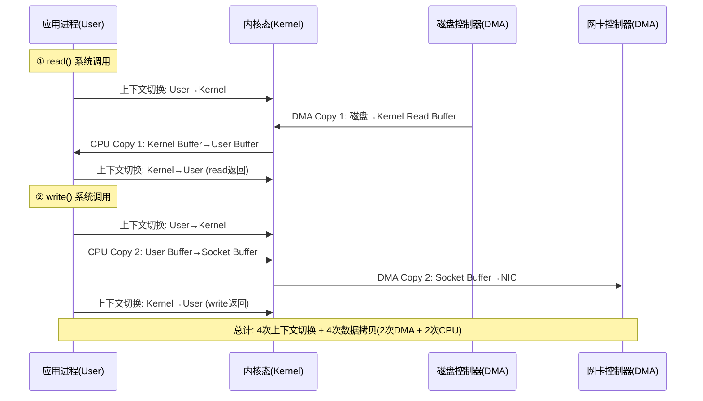
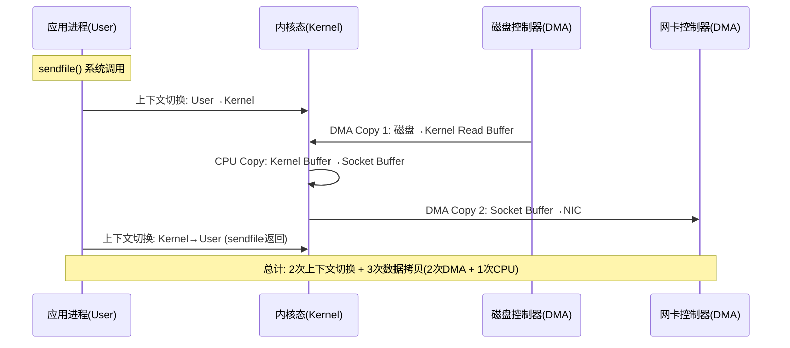
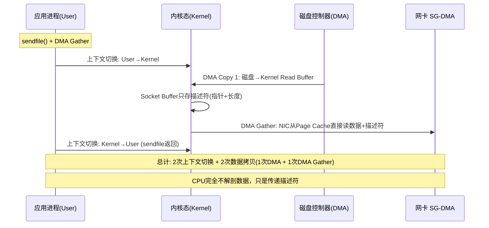

# NIO 性能调优：零拷贝、直接内存与线上问题排查全解析

## 1 ⚡ 问题切入：文件服务器 CPU 100%，网络带宽却没用满

一个典型的文件下载服务，使用传统 Java I/O 实现：

```java
// 传统文件传输：将磁盘文件发送给客户端
public static void sendFile(Socket socket, String filepath) throws IOException {
    FileInputStream fis = new FileInputStream(filepath);
    BufferedInputStream bis = new BufferedInputStream(fis);
    OutputStream os = socket.getOutputStream();

    byte[] buf = new byte[8192];
    int len;
    while ((len = bis.read(buf)) != -1) {
        os.write(buf, 0, len);  // 每次循环：内核→用户→内核→网卡
    }
    bis.close();
    fis.close();
}
```

这段代码能工作，但投入生产后出现异常现象：**4 核 CPU 全部 100%，但千兆网卡只用了 600Mbps**。理论上这台机器完全可以跑满千兆，为什么 CPU 先成了瓶颈？

答案在于 **数据拷贝次数**。每一次 `read()` + `write()` 循环，数据经历了 4 次跨总线拷贝和 4 次上下文切换，其中 2 次拷贝由 CPU 执行——CPU 在"搬运数据"而非"处理业务"。当文件传输量增大时，CPU 的所有时间都耗在 `memcpy` 上，根本没有余力处理其他请求。

这个问题在生产环境中极其常见。Kafka 在早期版本中频繁遇到，Netty 的文件传输功能就是为解决这个问题而优化的。核心解决方案是 **零拷贝** （Zero-Copy，让数据从磁盘到网卡的过程中，CPU 不参与数据搬运）。

## 2 🚀 零拷贝

### 2.1 ❓ 什么是零拷贝——从硬件数据流理解

"零拷贝"这个词容易引起误解。它不是说"完全没有拷贝"，而是"没有 **CPU 参与的拷贝**"。DMA（Direct Memory Access，直接内存访问）拷贝仍然存在，但 DMA 由硬件控制器（DMAC）完成，不消耗 CPU 周期。

在深入理解之前，先明确三个概念：

| 术语 | 含义 | 谁执行 | 消耗 CPU？ |
|------|------|:---:|:---:|
| **DMA Copy**（DMA 拷贝） | 硬件 DMA 控制器在设备与内存之间搬运数据 | 主板上的 DMAC 芯片 | **否**，CPU 可并行执行其他指令 |
| **CPU Copy**（CPU 拷贝） | CPU 执行 `memcpy` 类指令在内存区域间搬运数据 | CPU 核心 | **是**，占用 ALU 和总线带宽 |
| **DMA Gather Copy**（DMA 聚集拷贝） | NIC 的 DMA 引擎从多个不连续的物理内存页直接收集数据并发送 | 网卡上的 DMA 引擎 | **否**，且省去了一次额外的内核拷贝 |

下面这张图完整展示了传统 I/O 与零拷贝在硬件层面的数据流向差异：


### 2.2 🔴 传统 I/O 的数据搬运路径（4 拷贝 + 4 切换）

以文件下载为例，Java 调用 `read()` 然后 `write()` 的过程如下：



**为什么 CPU Copy 是瓶颈**：CPU 拷贝不仅仅是 `memcpy` 的执行时间，还包括：

1. **缓存污染**：拷贝的数据覆盖了 CPU L1/L2 缓存中的热数据（正在处理的业务数据），导致后续 cache miss 增加
2. **总线争用**：内存总线同时被 CPU 拷贝和 DMA 拷贝争抢，两者互相拖慢
3. **上下文切换**：4 次用户态/内核态切换，每次切换需要保存/恢复寄存器、刷新 TLB（Translation Lookaside Buffer，页表缓存）

### 2.3 🟢 sendfile 零拷贝（2 拷贝 + 2 切换）

Linux 2.1 引入了 `sendfile()` 系统调用，将 `read()` + `write()` 两步合并为一步：



从 4+4 降到 2+3，但仍然有 1 次 CPU 拷贝。Linux 2.4 引入 **DMA Scatter/Gather**（DMA 聚集/分散）进一步优化：



**DMA Gather 的关键**：Socket Buffer 中不再存数据本身，而是存一个 **描述符** （`{内存页地址, 偏移, 长度}` 三元组）。NIC 的 DMA 引擎读取描述符后，直接从 Page Cache（页缓存，内核中用于缓存磁盘数据的页面）的对应位置抓取数据并组装成网络包发出。

三种模式的完整对比：

| 模式 | CPU 拷贝 | DMA 拷贝 | 上下文切换 | 用户缓冲区参与？ |
|------|:---:|:---:|:---:|:---:|
| 传统 `read` + `write` | 2 | 2 | 4 | 是 |
| `sendfile`（无 gather） | 1 | 2 | 2 | 否 |
| `sendfile` + DMA Gather | 0 | 2（含 1 次 gather） | 2 | 否 |

**零拷贝的"零"指的是零次 CPU 拷贝**，不是零次 DMA 拷贝。磁盘到内存的数据搬运（DMA Copy）和网卡从内存抓取数据（DMA Gather Copy）都由硬件完成，CPU 全程不触摸数据。

### 2.4 ☕ Java 实现：FileChannel.transferTo()

Java NIO 通过 `FileChannel.transferTo()` 封装了操作系统的零拷贝能力。在 Linux 2.4+ 上，底层会调用 `sendfile64()` 系统调用：

```java
import java.io.FileInputStream;
import java.io.IOException;
import java.net.Socket;
import java.nio.channels.FileChannel;
import java.nio.channels.SocketChannel;

/**
 * 使用 FileChannel.transferTo() 实现零拷贝文件传输。
 *
 * 测试方法：
 *   Linux: strace -f -e trace=sendfile java ZeroCopyFileTransfer
 *   看到 sendfile64(...) = xxx 即证明使用了零拷贝
 */
public class ZeroCopyFileTransfer {
    public static void sendFile(Socket socket, String filepath) throws IOException {
        SocketChannel socketChannel = socket.getChannel();
        try (FileInputStream fis = new FileInputStream(filepath);
             FileChannel fileChannel = fis.getChannel()) {

            long position = 0;
            long size = fileChannel.size();

            /*
             * transferTo(position, count, target):
             *   position: 从文件的哪个位置开始传输
             *   count:    传输多少字节
             *   target:   目标 Channel（这里是 SocketChannel）
             *
             * 在 Linux 2.4+ 上，底层调用 sendfile64(fd, socket_fd, offset, count)
             * 在 Windows 上，底层调用 TransmitFile()
             * 在 macOS 上，底层调用 sendfile()
             */
            long bytesTransferred;
            while (position < size) {
                bytesTransferred = fileChannel.transferTo(
                    position,
                    size - position,
                    socketChannel
                );
                if (bytesTransferred <= 0) break;
                position += bytesTransferred;
            }
        }
    }
}
```

用 `strace` 验证底层确实调用了 `sendfile`：

```bash
# 启动 Java 程序后，找到进程 PID 并 trace
$ strace -e trace=sendfile -p <PID>

# 当有文件传输时，输出类似：
sendfile64(12, 10, NULL, 16777216) = 4194304
sendfile64(12, 10, NULL, 12582912) = 4194304
# fd=12 是文件描述符, fd=10 是 socket, 每次传输约4MB
```

**`transferTo` 的限制**：

| 限制 | 说明 | 解决办法 |
|------|------|---------|
| 单次传输上限 | `sendfile` 单次最多传输 `Integer.MAX_VALUE` 字节（约 2GB） | 循环调用直到全部传完 |
| 无法修改数据 | 数据直接从 Page Cache 到网卡，应用层无法添加 header/修改内容 | 用 `FileRegion`（Netty）在数据前添加 header |
| 仅限文件到 Socket | `transferTo` 的源必须是文件，目标是 Socket 或文件 | 其他场景使用 `DirectBuffer` 减少拷贝 |

### 2.5 🌐 Netty 中的零拷贝实现

Netty 在多个层面使用了零拷贝思想：

| Netty 特性 | 对应技术 | 原理 |
|-----------|---------|------|
| `FileRegion` | `transferTo()` | 将文件内容直接发送到网络，底层调用 `sendfile`，不经过用户空间 |
| `CompositeByteBuf` | 虚拟 buffer 合并 | 将多个 ByteBuf 合并为一个逻辑 ByteBuf，不实际拷贝数据 |
| `Unpooled.wrappedBuffer()` | 共享底层数组 | 多个 ByteBuf 共享同一块内存，零拷贝"拆分" |
| `ByteBuf.slice()` | 共享底层数组 | 切片操作不创建新的内存副本 |

```java
// Netty FileRegion 示例：零拷贝文件传输
import io.netty.channel.*;
import io.netty.channel.socket.SocketChannel;
import io.netty.handler.stream.ChunkedFile;

// 在 Handler 中使用 ChunkedFile（内部使用 FileRegion + transferTo）
ctx.write(new ChunkedFile(new java.io.RandomAccessFile("large_file.bin", "r")));
// ChunkedFile 内部会将文件分块，每块通过 FileRegion 零拷贝发送
```

## 3 🧠 直接内存

### 3.1 ❓ 为什么需要直接内存——数据的"过墙"问题

Java 的堆内存（Heap Memory）由 JVM 管理，但操作系统进行 I/O 操作时，数据必须位于 **堆外内存** （Off-Heap Memory，JVM 堆之外的内存区域）——因为 GC 可能移动对象，导致内存地址变化，而 I/O 操作需要物理地址稳定。

传统 I/O 使用堆内 `ByteBuffer` 时，JVM 会在 I/O 操作前临时分配一块堆外内存做"中转"：

```mermaid
flowchart TD
    %% ==========================================
    %% 样式定义
    %% ==========================================
classDef heap fill:#450a0a,stroke:#dc2626,stroke-width:2px,color:#fecaca,font-weight:bold;
classDef direct fill:#052e16,stroke:#16a34a,stroke-width:2px,color:#bbf7d0,font-weight:bold;
classDef io fill:#0f172a,stroke:#3b82f6,stroke-width:2px,color:#bfdbfe,font-weight:bold;
classDef label fill:#1e1e24,stroke:#6b7280,stroke-width:1px,color:#e5e7eb;

    %% ==========================================
    %% 堆内 vs 直接内存 I/O 路径
    %% ==========================================
    subgraph HEAP_PATH ["堆内 ByteBuffer 路径（多一次拷贝）"]
        direction LR
        H1["App writes to\nHeapByteBuffer"] --> H2["JVM allocates\nTemporary DirectBuffer"]
        H2 --> H3["memcpy: Heap→Direct"]
        H3 --> H4["Kernel I/O reads\nfrom Direct Buffer"]
    end

    subgraph DIRECT_PATH ["直接 ByteBuffer 路径（零次额外拷贝）"]
        direction LR
        D1["App writes to\nDirectByteBuffer"] --> D2["Kernel I/O reads\nfrom Direct Buffer"]
    end

    class H1,H2,H3,H4 heap;
    class D1,D2 direct;
```



| 对比维度 | `ByteBuffer.allocate(1024)` | `ByteBuffer.allocateDirect(1024)` |
|---------|---------------------------|----------------------------------|
| 内存位置 | JVM 堆内 | 堆外（Native Memory） |
| I/O 路径 | 堆内 → 临时堆外 → 内核（多一次拷贝） | 堆外 → 内核（直接） |
| GC 影响 | 受 GC 管理，可能被移动 | 不受 GC 管理，地址稳定 |
| 分配速度 | **快**（JVM 堆内分配，走 TLAB） | **慢**（系统调用 `malloc`） |
| 释放机制 | GC 自动回收 | `Cleaner` 虚引用回收，时机不确定 |
| 读写效率 | 需要 JNI 边界检查 | 底层可直接操作内存地址 |

**使用原则**：直接内存适合 **长期使用、频繁 I/O 的大缓冲区**（如 Netty 的读写缓冲区），因为分配虽然慢但避免了每次 I/O 的临时拷贝；堆内内存适合 **短期使用的小缓冲区**。

### 3.2 ⚙️ 直接内存的配置

```bash
# JVM 启动参数
-XX:MaxDirectMemorySize=512m    # 限制直接内存的最大值，默认等于 -Xmx
-XX:+DisableExplicitGC          # 禁止 System.gc() 触发 Full GC
                                # （会让 Netty 的 Cleaner 回收变慢）
```

直接内存的默认上限等于 `-Xmx`。如果超过这个限制，抛出 `OutOfMemoryError: Direct buffer memory`。可以用 JMX 监控直接内存使用量：

```java
// 监控直接内存使用情况
import java.lang.management.BufferPoolMXBean;
import java.lang.management.ManagementFactory;
import java.util.List;

List<BufferPoolMXBean> pools = ManagementFactory.getPlatformMXBeans(BufferPoolMXBean.class);
for (BufferPoolMXBean pool : pools) {
    System.out.println(pool.getName()
        + " count=" + pool.getCount()        // 当前分配的 Buffer 数量
        + " used=" + pool.getMemoryUsed()    // 已使用的字节数
        + " capacity=" + pool.getTotalCapacity()); // 总分配容量
}
```

### 3.3 📦 Netty 中的直接内存管理

Netty 默认使用 `PooledByteBufAllocator`，内部维护了直接内存的池化分配器，避免频繁的 `malloc` / `free`：

```java
// Netty 内存分配器选择
// 方式一：使用池化直接内存（默认，推荐）
Bootstrap b = new Bootstrap();
b.option(ChannelOption.ALLOCATOR, PooledByteBufAllocator.DEFAULT);

// 方式二：使用非池化堆内存（调试时用）
b.option(ChannelOption.ALLOCATOR, UnpooledByteBufAllocator.DEFAULT);

// 方式三：查看 Netty 内存泄漏检测（开发/测试环境）
// -Dio.netty.leakDetection.level=PARANOID
ResourceLeakDetector.setLevel(ResourceLeakDetector.Level.PARANOID);
```

`PooledByteBufAllocator` 的内存分配层次：

| 层次 | 说明 |
|------|------|
| **Arena** | 与线程绑定，减少锁竞争。数量 = CPU 核数 × 2 |
| **ChunkList** | 管理 Chunk 的列表，按使用率分级（qInit/q000/q025/q050/q075/q100） |
| **Chunk** | 16MB 的连续内存块（默认），是向操作系统申请的最小单位 |
| **Page** | 8KB（默认），Chunk 内的分配单位 |
| **SubPage** | 小于 Page 的分配单位，通过位图管理 |

## 4 🔧 常见问题排查

### 4.1 🔴 句柄泄露（Too many open files）

**现象**：服务运行几天后，突然所有连接被拒绝，日志中出现 `java.io.IOException: Too many open files`。

**原因**：每个 Socket 连接、每个打开的文件都占用一个文件描述符（File Descriptor，操作系统分配给进程的整数句柄）。如果连接关闭了但没有释放 fd，就会逐渐耗尽进程的 fd 配额。

**排查**：

```bash
# 1. 查看进程打开了多少文件描述符
lsof -p <PID> | wc -l

# 2. 按类型统计 fd
lsof -p <PID> | awk '{print $5}' | sort | uniq -c | sort -rn

# 3. 查看系统限制
ulimit -n    # 软限制（默认 1024）
ulimit -n 65535  # 临时增大

# 4. 查看哪个文件被打开最多次（从中推断泄漏源）
lsof -p <PID> | awk '{print $9}' | sort | uniq -c | sort -rn | head -20
```

**修复模式**：

```java
// 原始代码（句柄泄露）
ServerSocket server = new ServerSocket(8080);
while (true) {
    Socket client = server.accept();
    new Thread(() -> {
        InputStream in = client.getInputStream();
        // ... 处理中如果抛异常，client 和 in 永远不会关闭
    }).start();
}

// 修复后（确保关闭）
ServerSocket server = new ServerSocket(8080);
while (true) {
    Socket client = server.accept();
    new Thread(() -> {
        try (InputStream in = client.getInputStream();
             client) {  // try-with-resources 保证关闭
            // ... 处理
        } catch (IOException e) {
            // 日志记录
        }
    }).start();
}
```

**Netty 的保护机制**：Netty 的 `SimpleChannelInboundHandler` 自动释放消息（`channelRead0` 返回后自动调用 `ReferenceCountUtil.release()`）。但如果继承 `ChannelInboundHandlerAdapter`，必须手动释放：

```java
// SimpleChannelInboundHandler: 自动释放（推荐）
class SafeHandler extends SimpleChannelInboundHandler<ByteBuf> {
    @Override
    protected void channelRead0(ChannelHandlerContext ctx, ByteBuf msg) {
        // msg 在方法结束后自动被 release()，无需手动处理
        ctx.writeAndFlush(msg.retain());
    }
}

// ChannelInboundHandlerAdapter: 必须手动释放
class UnsafeHandler extends ChannelInboundHandlerAdapter {
    @Override
    public void channelRead(ChannelHandlerContext ctx, Object msg) {
        try {
            ByteBuf buf = (ByteBuf) msg;
            ctx.writeAndFlush(buf.retain());
        } finally {
            ReferenceCountUtil.release(msg);  // ← 必须手动释放！
        }
    }
}
```

### 4.2 🌀 NIO 空轮询（Selector Spinning Bug）

**现象**：线上服务 CPU 使用率突然飙到 100%，`jstack` 显示主线程一直在执行 `selector.select()`，但没有任何实际 I/O 处理。

**原因**：JDK NIO 在某些 Linux 内核版本上存在 Bug——`epoll_wait` 正常返回 0（超时，无就绪 fd），但 Java 的 `Selector.select()` 在内部计数错误下认为有事件发生，直接返回并进入下一次循环，形成 **无限空转**。

**排查**：

```bash
# 1. 查看 CPU 使用
top -H -p <PID>    # 找到 CPU 100% 的线程

# 2. jstack 看线程栈
jstack <PID> | grep -A 20 "CPU-consuming-thread-name"

# 典型堆栈：
"nioEventLoopGroup-2-1" #13 prio=10 ...
  at sun.nio.ch.EPollArrayWrapper.epollWait(Native Method)
  at sun.nio.ch.EPollSelectorImpl.doSelect(EPollSelectorImpl.java:93)
  at io.netty.channel.nio.NioEventLoop.select(NioEventLoop.java:813)
  at io.netty.channel.nio.NioEventLoop.run(NioEventLoop.java:460)
  # 反复出现在 select() → processSelectedKeys() → select() 循环中
  # 但 processSelectedKeys() 没有实际处理任何事件
```

**Netty 的修复**：Netty 在 `NioEventLoop` 中内建了空轮询检测与自动恢复机制：

```java
// Netty 空轮询检测简化版 (NioEventLoop.java)
long currentTimeNanos = System.nanoTime();
for (;;) {
    long timeoutMillis = ...;
    int selectedKeys = selector.select(timeoutMillis);
    selectCnt++;

    if (selectedKeys != 0) {
        break; // 正常：有 Channel 就绪
    }

    long time = System.nanoTime();
    if (time - currentTimeNanos >= timeoutMillis) {
        selectCnt = 1;  // 正常超时，重置计数
    } else if (SELECTOR_AUTO_REBUILD_THRESHOLD > 0 &&
               selectCnt >= SELECTOR_AUTO_REBUILD_THRESHOLD) {
        // 空轮询次数累计达到阈值(默认512)，触发重建 Selector
        rebuildSelector();  // ① 创建新 Selector ② 迁移所有 Channel ③ 关闭旧 Selector
        selectCnt = 1;
        break;
    }
}
```

**产生条件**：该 Bug 在 JDK 6u4 到 JDK 8 的特定内核版本上都会出现，尤其是在 `epoll_wait` 超时时间非常短（接近 0）时触发概率更高。升级 JDK 11+ 可以缓解，但 Netty 的防御机制更加可靠。

### 4.3 💥 直接内存溢出（Direct Buffer OOM）

**现象**：JVM 进程 `-Xmx` 只配了 2GB，堆内存才用了 500MB，却突然 OOM 进程崩溃。日志中出现：

```
java.lang.OutOfMemoryError: Direct buffer memory
```

或者（在 Netty 中更常见）：

```
io.netty.util.internal.OutOfDirectMemoryError: failed to allocate 16777216 byte(s)
of direct memory (used: 1073741824, max: 1073741824)
```

**原因**：直接内存（Direct Memory）不受 `-Xmx` 限制，默认上限等于 `-Xmx`。Netty 的读写缓冲区默认使用直接内存，高并发下大量 ByteBuf 未正确释放，导致直接内存耗尽。

**排查**：

```bash
# 1. 开启 Native Memory Tracking（会有 5%~10% 的性能开销，仅排查时使用）
java -XX:NativeMemoryTracking=detail -jar myapp.jar

# 2. 查看 Native Memory 使用详情
jcmd <PID> VM.native_memory summary

# 输出中关注 "Internal" 区域（包含 Direct Buffer）:
# Internal (reserved=1248MB, committed=1248MB)
#                   (malloc=1248MB #18382)
# 如果 Internal 远大于预期，说明 Direct Buffer 泄漏

# 3. Netty 自带泄漏检测（开发/测试环境）
-Dio.netty.leakDetection.level=PARANOID
# 日志会输出泄漏的 ByteBuf 的创建堆栈，精确定位泄漏位置
```

**Netty 泄漏检测输出示例**：

```
LEAK: ByteBuf.release() was not called before it's garbage-collected.
Recent access records:
#1:  io.netty.buffer.PooledByteBufAllocator.newDirectBuffer(...)
#2:  io.netty.handler.codec.ByteToMessageDecoder.channelRead(...)
#3:  com.example.MyHandler.channelRead(...MyHandler.java:42)
     ^--- 这里分配了 ByteBuf 但忘记 release
```

**预防措施**：

| 措施 | 说明 |
|------|------|
| 配置 `-XX:MaxDirectMemorySize` | 显式限制直接内存上限，避免无上限增长 |
| 使用 `SimpleChannelInboundHandler` | 自动释放消息，避免手动管理引用计数 |
| 开启泄漏检测 | 测试环境 `PARANOID` 级别，生产环境 `SIMPLE` 级别 |
| 配置池化分配器 | `PooledByteBufAllocator` 复用 ByteBuf，减少 allocate/free 频率 |
| 监控 `BufferPoolMXBean` | 定期打印直接内存使用量，建立告警 |

## 5 🎯 总结

```mermaid
flowchart TD
    %% ==========================================
    %% 样式定义
    %% ==========================================
classDef root fill:#0f172a,stroke:#3b82f6,stroke-width:2px,color:#bfdbfe,font-weight:bold;
classDef branch fill:#2d1a05,stroke:#f59e0b,stroke-width:2px,color:#fde68a,font-weight:bold;
classDef leaf fill:#1e1e24,stroke:#6b7280,stroke-width:1.5px,color:#e5e7eb;
classDef highlight fill:#052e16,stroke:#16a34a,stroke-width:1.5px,color:#bbf7d0,font-weight:bold;

    %% ==========================================
    %% NIO 性能调优知识体系
    %% ==========================================
    ROOT["NIO 性能调优三大支柱"]

    ROOT --> ZERO["零拷贝"]
    ROOT --> DIRECT["直接内存"]
    ROOT --> TROUBLESHOOT["问题排查"]

    ZERO --> Z1["传统 I/O: 4次拷贝+4次切换"]
    ZERO --> Z2["sendfile: 2次拷贝+2次切换"]
    ZERO --> Z3["sendfile+DMA Gather: 0次CPU拷贝"]
    ZERO --> Z4["Java实现: transferTo()"]
    ZERO --> Z5["Netty: FileRegion"]

    DIRECT --> D1["HeapBuffer: I/O需要中转拷贝"]
    DIRECT --> D2["DirectBuffer: 直接I/O"]
    DIRECT --> D3["-XX:MaxDirectMemorySize"]
    DIRECT --> D4["Netty PooledByteBufAllocator"]

    TROUBLESHOOT --> T1["句柄泄露: lsof排查"]
    TROUBLESHOOT --> T2["空轮询: jstack+rebuildSelector"]
    TROUBLESHOOT --> T3["直接内存溢出: NMT+泄漏检测"]

    class ROOT root;
    class ZERO,DIRECT,TROUBLESHOOT branch;
    class Z1,Z2,Z3,Z4,Z5,D1,D2,D3,D4,T1,T2,T3 leaf;
    class Z3 highlight;
```



| 层级 | 核心要点 | 一句话 |
|------|---------|--------|
| **问题驱动** | 文件传输 CPU 100%，网络带宽用不满 | CPU 忙于搬运数据，而非处理业务 |
| **零拷贝** | `sendfile` + DMA Gather，CPU 不参与数据搬运 | 2 次上下文中换 + 2 次 DMA 拷贝，0 次 CPU 拷贝 |
| **transferTo()** | Java 封装 `sendfile64` 系统调用 | `strace -e sendfile` 可验证 |
| **直接内存** | `allocateDirect()` 分配堆外内存，避免中转 | 分配慢但 I/O 快，适合长期重用的 I/O 缓冲区 |
| **句柄泄露** | fd 未关闭，`lsof` 排查 | 用 try-with-resources 或 Netty 的 `SimpleChannelInboundHandler` |
| **NIO 空轮询** | JDK Selector Bug，CPU 100% | Netty `rebuildSelector` 检测并自动恢复 |
| **直接内存溢出** | `-XX:MaxDirectMemorySize` + NMT + 泄漏检测 | Netty `RESOURCE_LEAK_DETECTOR` 追踪到代码行 |
