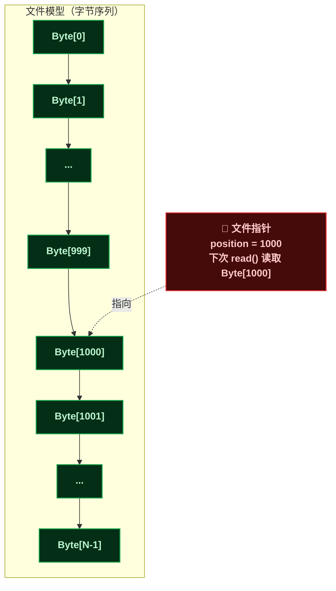
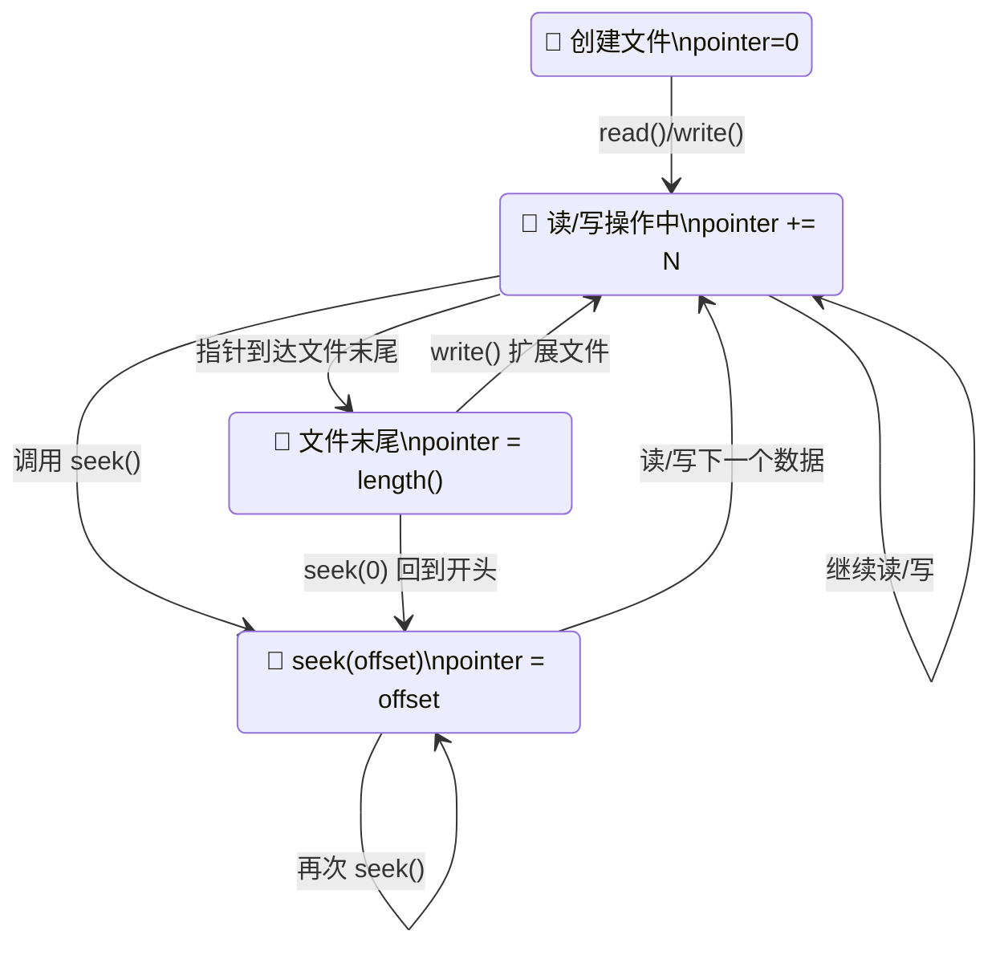
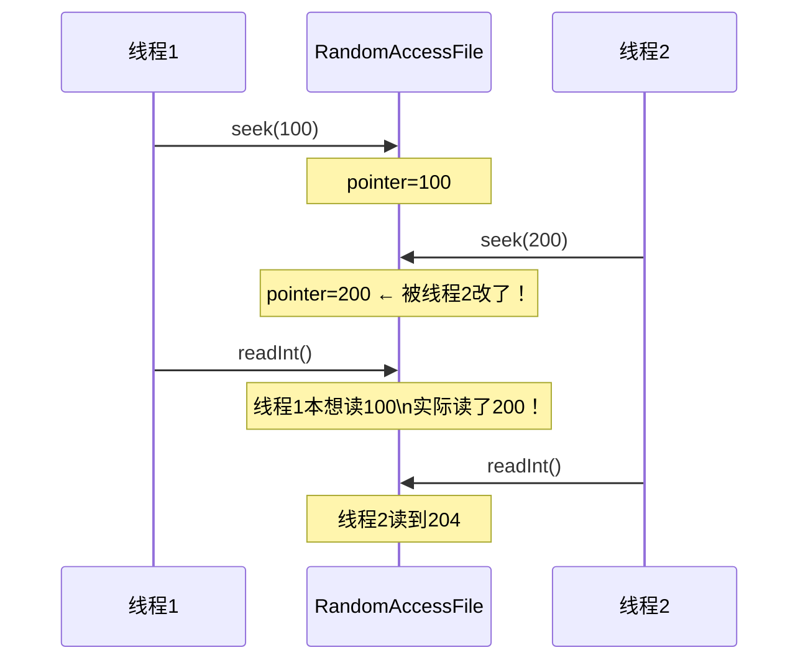
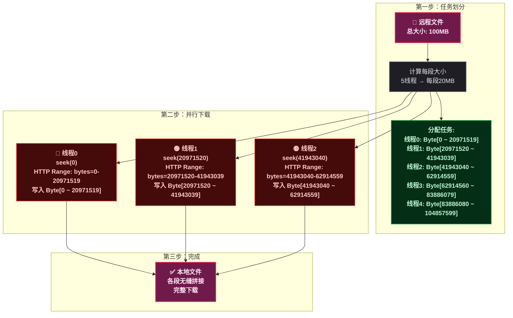
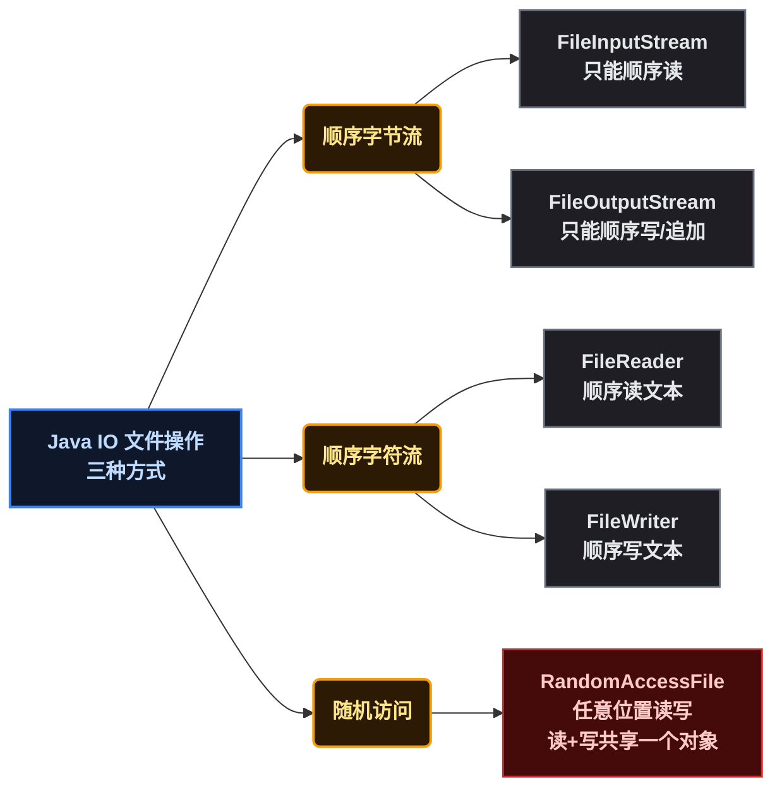

# RandomAccessFile 文件指针与任意位置读写：多线程分段下载实现

## 1 ⚡ 问题切入：流式读写的局限

前面介绍的 `FileInputStream` / `FileOutputStream` 都是 **顺序流** （Sequential Stream），只能从文件头开始，一个字节接一个字节地读写。如果只想读文件的第 1000 个字节，顺序流必须先把前面 999 个字节读完（或调用 `skip()`），效率很低。

如果要实现以下场景，顺序流就完全不够用了：

- 修改一个 1GB 文件的中间某几个字节
- 在文件末尾追加日志，同时读取文件头部的元数据
- 多线程分段下载文件，每个线程负责不同区间的数据块

这些场景需要 **随机读写** ——可以自由移动文件指针到任意位置，像操作数组下标一样操作文件。Java 提供了 `RandomAccessFile` 来实现这个能力。

```java
// 随机读：直接跳到第 1000 字节开始读
RandomAccessFile raf = new RandomAccessFile("data.bin", "r");
raf.seek(1000);              // 指针移到 position=1000
int b = raf.read();          // 读第 1000 个字节
System.out.printf("第1000字节: 0x%02X%n", b);
raf.close();
```

**跳过前面 999 个字节，直达目标位置——这就是 RandomAccessFile 的价值**。

## 2 🎯 核心概念：文件指针

### 2.1 ❓ 什么是文件指针

**文件指针** （File Pointer）是 `RandomAccessFile` 内部维护的一个 `long` 类型偏移量（Offset），表示 **下一次读写操作将发生的字节位置** 。它类似于数组的下标索引，但作用对象是文件。



### 2.2 🎮 指针控制方法

| 方法 | 返回值 | 说明 |
|------|--------|------|
| `getFilePointer()` | `long` | 获取当前文件指针位置 |
| `seek(long pos)` | `void` | 将文件指针设置到指定位置（从 0 开始计数） |
| `length()` | `long` | 返回文件当前长度（字节数） |

```java
RandomAccessFile raf = new RandomAccessFile("test.bin", "rw");

System.out.println("初始指针: " + raf.getFilePointer());  // 0

raf.writeInt(42);  // 写入 4 字节
System.out.println("写入后指针: " + raf.getFilePointer()); // 4

raf.seek(0);       // 回到文件开头
System.out.println("seek(0)后指针: " + raf.getFilePointer()); // 0

int val = raf.readInt();  // 读取 4 字节
System.out.println("读取值: " + val);                   // 42
System.out.println("读取后指针: " + raf.getFilePointer()); // 4

raf.close();
```

**关键行为** ：
- 每次 `read()` / `write()` 成功后，指针 **自动后移** 相应字节数
- `seek()` 可以设到 **文件末尾之后** （例如 `seek(length() + 100)`），此时 `read()` 返回 `-1`，但 `write()` 会扩展文件，中间部分填充 `0`
- 如果 `seek()` 的位置超过文件 `length()`，`read()` 返回 `-1`

### 2.3 🔄 指针移动示意



## 3 ⚙️ 读写模式与构造器

### 3.1 📋 四种模式

| 模式 | 含义 | 文件不存在时 |
|------|------|-------------|
| `"r"` | 只读（Read Only） | 抛 `FileNotFoundException` |
| `"rw"` | 读写（Read Write） | 自动创建新文件 |
| `"rws"` | 读写 + 每次写入立即同步 **内容** 到磁盘 | 自动创建新文件 |
| `"rwd"` | 读写 + 每次写入立即同步 **内容+元数据** 到磁盘 | 自动创建新文件 |

```java
// 只读模式
RandomAccessFile rafR = new RandomAccessFile("existing.dat", "r");

// 读写模式 —— 最常用
RandomAccessFile rafRW = new RandomAccessFile("data.bin", "rw");

// 同步写入模式 —— 数据可靠性要求高的场景
RandomAccessFile rafRWS = new RandomAccessFile("critical.dat", "rws");
```

### 3.2 📖 "r" vs "rw"

`"r"` 模式下只能调用 `readXxx()` 方法，调用 `writeXxx()` 会抛 `IOException`。通常用于查看或分析已有文件。

`"rw"` 模式是最常用的，支持读取和写入。如果文件不存在会自动创建。

### 3.3 ⚡ "rw" vs "rws" vs "rwd"

这三个模式都支持读写，区别在于 **写入数据的同步策略** ：

| 模式 | 内容数据 | 元数据（修改时间等） | 性能 | 适用场景 |
|------|:---:|:---:|:---:|------|
| `"rw"` | 延迟写入 | 延迟写入 | 高 | 普通场景 |
| `"rws"` | 立即同步 | 立即同步 | 低 | 事务日志、关键数据 |
| `"rwd"` | 立即同步 | 延迟写入 | 中 | 需要保证数据但元数据不重要 |

<span style="color:red">**注意**</span> ：`"rws"` 和 `"rwd"` 每次 `write()` 都会触发系统调用 `fsync`，性能远低于 `"rw"`。 **不要滥用同步模式** ，只有在数据可靠性要求极高的场景（如数据库事务日志）才使用。

## 4 📝 核心读写方法

### 4.1 📋 方法速查表

| 类别 | 方法 | 每次操作字节数 | 说明 |
|------|------|:---:|------|
| 字节级 | `read()` | 1 | 读取一个字节，返回 `0 ~ 255`，末尾返回 `-1` |
| 字节级 | `write(int b)` | 1 | 写入一个字节（低 8 位） |
| 字节数组 | `read(byte[] b)` | 数组长度 | 读取到缓冲区，返回实际读取数 |
| 字节数组 | `write(byte[] b)` | 数组长度 | 写入缓冲区全部字节 |
| 基本类型 | `readInt()` / `writeInt(int)` | 4 | 读写 int（大端序） |
| 基本类型 | `readLong()` / `writeLong(long)` | 8 | 读写 long（大端序） |
| 基本类型 | `readDouble()` / `writeDouble(double)` | 8 | 读写 double |
| 基本类型 | `readBoolean()` / `writeBoolean(boolean)` | 1 | 读写 boolean |
| 基本类型 | `readUTF()` / `writeUTF(String)` | 变长 | 读写 UTF-8 修改版字符串 |
| 行读取 | `readLine()` | — | 读取一行（**已废弃，不支持中文**） |

### 4.2 🛠️ 基本类型读写示例

```java
try (RandomAccessFile raf = new RandomAccessFile("record.bin", "rw")) {
    // 写入多种数据类型
    raf.writeInt(100);           // position: 0 → 4
    raf.writeDouble(3.14);       // position: 4 → 12
    raf.writeBoolean(true);      // position: 12 → 13
    raf.writeUTF("你好");        // position: 13 → 22 (2字节长度 + 编码数据)
    System.out.println("写入后文件大小: " + raf.length() + " 字节");

    // 回到开头，按顺序读取
    raf.seek(0);
    System.out.println(raf.readInt());     // 100
    System.out.println(raf.readDouble());  // 3.14
    System.out.println(raf.readBoolean()); // true
    System.out.println(raf.readUTF());     // 你好
}
```

### 4.3 🎯 随机位置修改

```java
// 场景：修改文件结构中 offset=12 处的 double 值
try (RandomAccessFile raf = new RandomAccessFile("record.bin", "rw")) {
    raf.seek(12);               // 定位到 double 字段的位置
    double oldVal = raf.readDouble();
    System.out.println("旧值: " + oldVal);  // 3.14

    raf.seek(12);               // 读完后指针到了 20，需要再 seek 回去
    raf.writeDouble(2.718);     // 覆盖写入新值
    System.out.println("更新后文件大小: " + raf.length());  // 不变，只是覆盖
}
```

**关键点** ：`readDouble()` 会移动指针，覆盖写入前必须重新 `seek()` 到目标位置。

## 5 🔒 线程安全分析

### 5.1 ⚠️ RandomAccessFile 不是线程安全的

`RandomAccessFile` 的所有方法都 **没有使用 synchronized** 。多个线程共享同一个 `RandomAccessFile` 对象时，指针操作存在竞态条件。



**根因** ：`seek()` 和 `read()` 是两个独立操作，中间没有锁保护。线程 1 执行 `seek(100)` 后，线程 2 可能在 `read()` 之前执行自己的 `seek(200)`，导致线程 1 读到的数据位置是错的。

### 5.2 🧪 验证竞态条件

```java
// 这个程序在高并发下会出现数据错乱
public class RafRaceConditionDemo {
    public static void main(String[] args) throws Exception {
        // 准备测试文件：写入 100 个 int，值为 0 到 99
        try (RandomAccessFile prep = new RandomAccessFile("test.dat", "rw")) {
            for (int i = 0; i < 100; i++) {
                prep.writeInt(i);
            }
        }

        RandomAccessFile raf = new RandomAccessFile("test.dat", "rw");

        // 启动 10 个线程，每个线程随机读取 1000 次
        for (int t = 0; t < 10; t++) {
            new Thread(() -> {
                try {
                    for (int i = 0; i < 1000; i++) {
                        int pos = (int) (Math.random() * 100);
                        raf.seek(pos * 4);          // 定位
                        int val = raf.readInt();    // 读取
                        // 期望: val == pos，但竞态下可能读到其他位置的值
                        if (val != pos) {
                            System.out.println("错乱! 期望位置 " + pos + " 读到了 " + val);
                        }
                    }
                } catch (IOException e) { e.printStackTrace(); }
            }).start();
        }
    }
}
```

<span style="color:red">**结论**</span> ：**多线程共享一个 `RandomAccessFile` 实例读写是不安全的** 。必须通过外部同步（`synchronized` / `ReentrantLock`）保护 `seek()` + `read()` / `write()` 的复合操作。

### 5.3 ✅ 正确的线程安全方案

**方案一：每个线程使用独立的 RandomAccessFile 实例** （推荐）

```java
// 每个线程打开自己的 RandomAccessFile，指针互不影响
new Thread(() -> {
    try (RandomAccessFile raf = new RandomAccessFile("data.dat", "r")) {
        raf.seek(myOffset);
        byte[] buf = new byte[chunkSize];
        raf.read(buf);
    }
}).start();
```

**方案二：外部加锁保护 seek+read 复合操作**

```java
public class ThreadSafeRAF {
    private final RandomAccessFile raf;
    private final ReentrantLock lock = new ReentrantLock();

    public ThreadSafeRAF(RandomAccessFile raf) { this.raf = raf; }

    public int readIntAt(long pos) throws IOException {
        lock.lock();
        try {
            raf.seek(pos);
            return raf.readInt();
        } finally {
            lock.unlock();
        }
    }
}
```

**两种方案对比** ：

| 方案 | 性能 | 复杂度 | 适用场景 |
|------|:---:|:---:|------|
| 每线程独立 RAF 实例 | 高（无锁竞争） | 低 | 分段下载，各线程写不同区间 |
| 外部加锁 | 低（串行化） | 中 | 必须共享同一个 RAF 实例 |

## 6 🚀 实战：多线程分段下载

### 6.1 💡 原理

多线程下载的核心思想：将文件分成 N 段，每个线程负责一段。各线程用各自的 `RandomAccessFile` 实例（或一个实例加锁），通过 `seek()` 定位到自己负责的区间，互不干扰地写入数据。



### 6.2 💻 本地模拟代码

以下代码在本地模拟多线程分段下载的过程，每个线程负责文件的一部分：

```java
import java.io.*;
import java.util.concurrent.*;

public class MultiThreadDownloader {

    // 模拟从网络获取某一段数据（实际应发 HTTP Range 请求）
    static byte[] fetchRemoteData(long start, long end) {
        int len = (int) (end - start + 1);
        byte[] data = new byte[len];
        // 模拟：填充数据为段起始位置的低8位
        for (int i = 0; i < len; i++) {
            data[i] = (byte) ((start + i) & 0xFF);
        }
        return data;
    }

    public static void download(String localFile, long totalSize, int threadCount)
            throws Exception {
        File tempFile = new File(localFile);
        // 预分配文件大小（创建空白文件，占位）
        try (RandomAccessFile preAlloc = new RandomAccessFile(tempFile, "rw")) {
            preAlloc.setLength(totalSize);
        }

        ExecutorService executor = Executors.newFixedThreadPool(threadCount);
        long chunkSize = totalSize / threadCount;
        CountDownLatch latch = new CountDownLatch(threadCount);

        for (int i = 0; i < threadCount; i++) {
            final int threadId = i;
            final long start = i * chunkSize;
            final long end = (i == threadCount - 1) ? totalSize - 1 : start + chunkSize - 1;

            executor.submit(() -> {
                try {
                    System.out.printf("[线程%d] 下载 Byte[%d ~ %d] 开始%n",
                            threadId, start, end);

                    // 模拟下载
                    byte[] data = fetchRemoteData(start, end);

                    // 每个线程用自己的 RandomAccessFile 写入
                    try (RandomAccessFile raf = new RandomAccessFile(tempFile, "rw")) {
                        raf.seek(start);
                        raf.write(data);
                    }

                    System.out.printf("[线程%d] 下载完成，写入 %d 字节%n",
                            threadId, data.length);
                } catch (IOException e) {
                    e.printStackTrace();
                } finally {
                    latch.countDown();
                }
            });
        }

        latch.await();
        executor.shutdown();

        System.out.println(">> 全部线程完成，文件总大小: " + tempFile.length() + " 字节");
    }

    public static void main(String[] args) throws Exception {
        download("download.bin", 10 * 1024 * 1024, 5);  // 10MB, 5线程
    }
}
```

**代码关键点** ：
1. **预分配文件大小** ：`raf.setLength(totalSize)` 创建占位文件，避免多线程写入时文件扩展冲突
2. **每线程独立 RAF 实例** ：避免指针竞态，每个线程 `seek()` 到自己的段起始位置后只写自己的区间
3. **CountDownLatch** ：等待所有线程完成下载
4. **最后一段处理** ：`end = totalSize - 1` 确保最后一段覆盖到文件末尾，不留空隙

### 6.3 🌐 HTTP 真实下载示例

下载器的核心是发送 HTTP **Range 请求** （范围请求，指定下载字节范围），服务器返回对应区间的数据。Java 中的实现：

```java
// 真实场景：用 HttpURLConnection 发送 Range 请求
public static byte[] downloadRange(String url, long start, long end) throws IOException {
    HttpURLConnection conn = (HttpURLConnection) new URL(url).openConnection();
    conn.setRequestProperty("Range", "bytes=" + start + "-" + end);
    conn.setConnectTimeout(5000);
    conn.setReadTimeout(10000);

    try (InputStream in = conn.getInputStream()) {
        return in.readAllBytes();  // 返回指定范围的数据
    }
}

// 使用方式（将上面的 fetchRemoteData 替换为此方法）
// byte[] data = downloadRange("https://example.com/file.zip", start, end);
// try (RandomAccessFile raf = new RandomAccessFile(localFile, "rw")) {
//     raf.seek(start);
//     raf.write(data);
// }
```

**迅雷、IDM 等多线程下载工具的原理** ：
1. 发送 HEAD 请求获取文件总大小
2. 计算分段（通常按线程数等分）
3. 每个线程发送 HTTP Range 请求获取自己负责的字节区间
4. 各线程通过 `RandomAccessFile.seek()` 将数据写入对应位置
5. 可配合 **断点续传** ：记录每个线程的下载进度，中断后从上次位置继续

## 7 📊 与其他 IO 类的对比



| 特性 | `FileInputStream` / `FileOutputStream` | `RandomAccessFile` |
|------|:---:|:---:|
| 读写方向 | 单向（读 or 写） | 双向（读 and 写） |
| 文件指针 | 自动顺序移动，不可控 | 可控，`seek()` 跳转 |
| 随机访问 | 不支持（需 `skip()` 跳过） | 支持任意位置读写 |
| 追加模式 | `FileOutputStream(path, true)` | 手动 `seek(length())` |
| 基本类型读写 | 不支持（需额外包装） | 内置 `readInt()`、`writeDouble()` 等 |
| 线程模型 | 每流独立 | 每实例独立 |

## 8 🎯 总结

### 8.1 💡 核心要点

1. **文件指针** 是 `RandomAccessFile` 的灵魂。`seek()` 控制读写的起始位置，每次读写后指针自动后移
2. **四种模式** `"r"`、`"rw"`、`"rws"`、`"rwd"` 各有用处，`"rw"` 最常用，同步模式用于关键数据
3. **线程不安全** ：`seek()` + `read()` / `write()` 是复合操作，多线程共享同一实例会竞态。正确做法是每线程独立实例
4. **多线程下载** ：利用 `seek()` 将文件划分为段，每个线程负责一段，实现并行下载

### 8.2 📋 适用场景速查

| 场景 | 推荐方案 |
|------|---------|
| 读取小文件全部内容 | `FileInputStream` / `BufferedReader` + `InputStreamReader` |
| 追加日志 | `FileOutputStream(path, true)` |
| 修改文件中间的某段数据 | `RandomAccessFile` + `seek()` |
| 读取文件尾部元数据 | `RandomAccessFile` + `seek(length() - N)` |
| 多线程分段下载 | 每线程 `RandomAccessFile` + `seek()` |
| 简易数据库文件存储 | `RandomAccessFile` + `seek()` 定位记录 |

### 8.3 ⚠️ 注意事项

- `readLine()` 方法已废弃，不支持中文（使用 `BufferedReader` + `InputStreamReader` 替代）
- `seek()` 到文件末尾之后可以 `write()` 扩展文件，但中间会出现空洞（填充 `0x00`）
- 频繁 `seek()` + 小数据量读写性能较差，考虑增加应用层缓冲
- `close()` 时会释放文件锁，确保用 try-with-resources 或 finally 关闭
