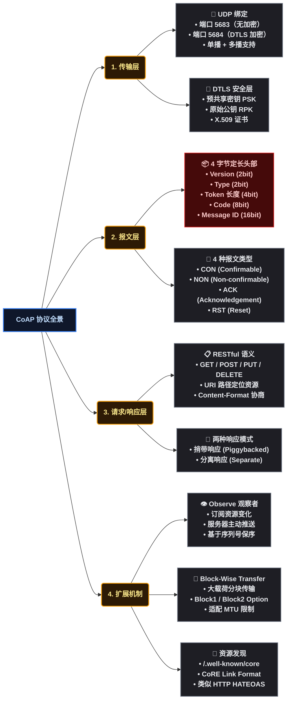
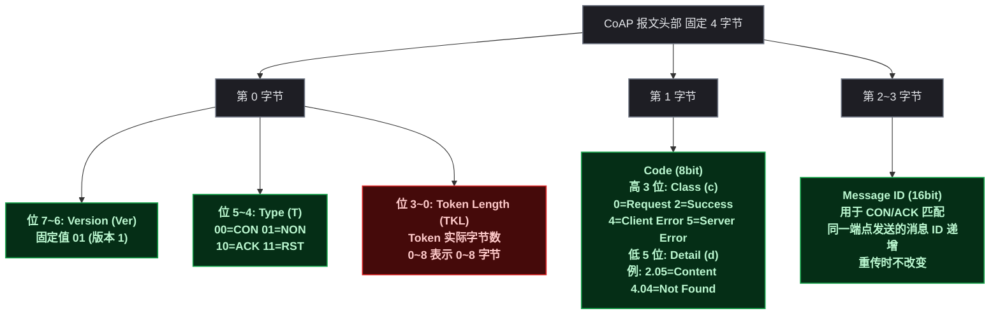
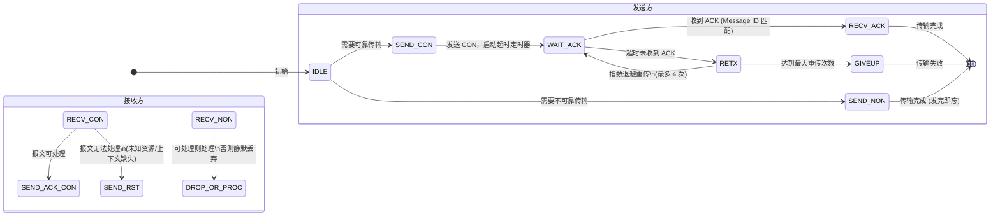
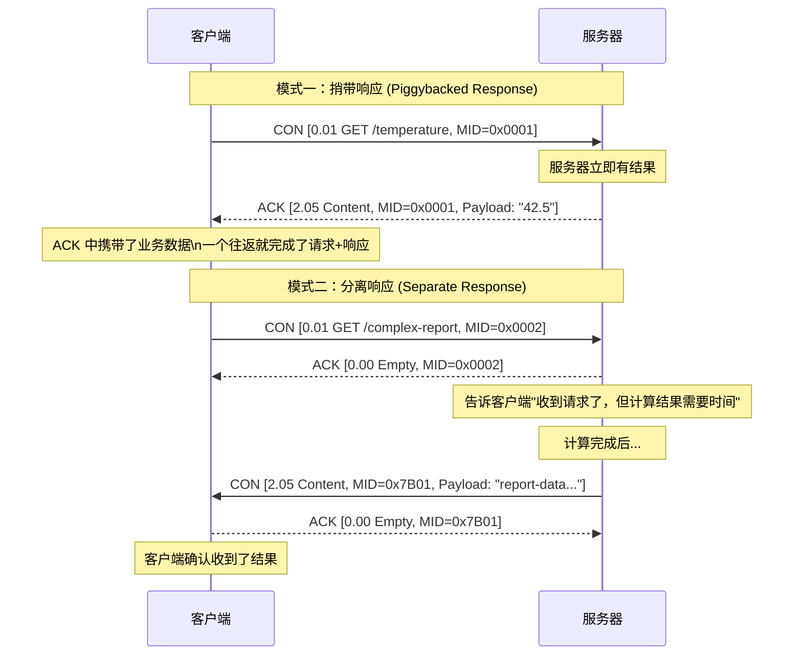
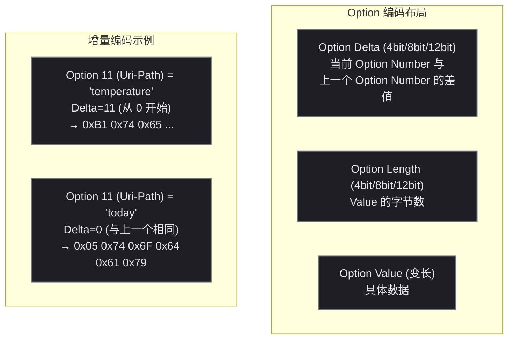
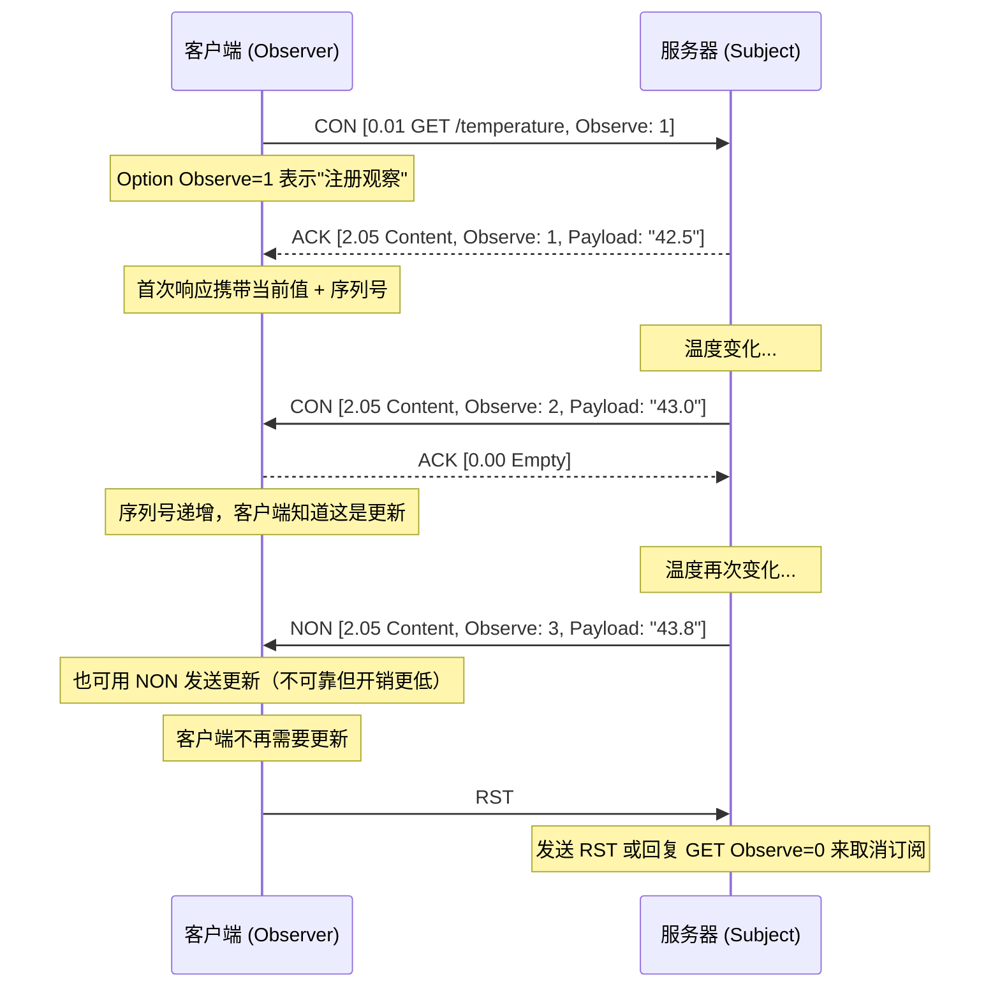
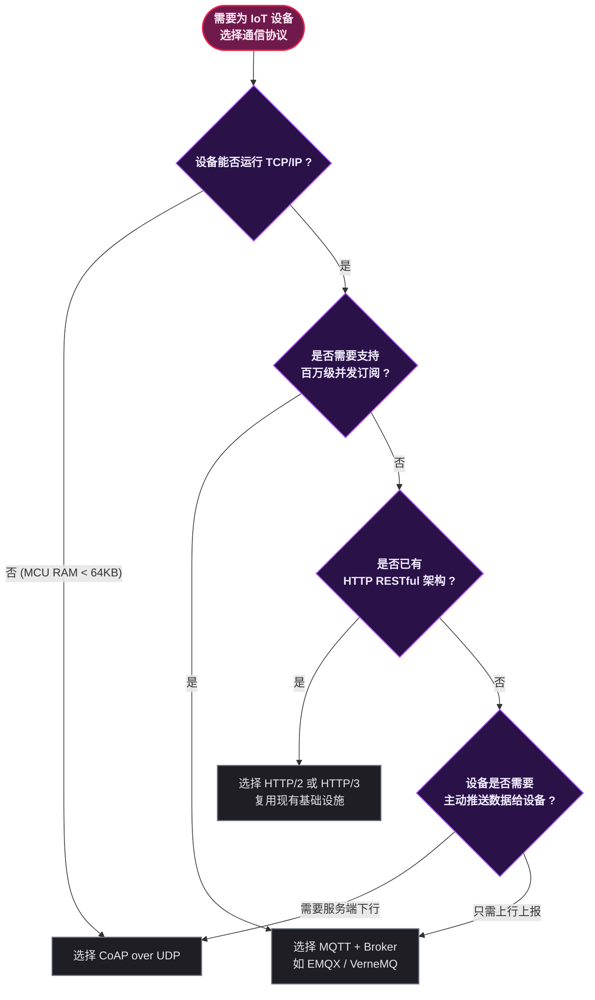
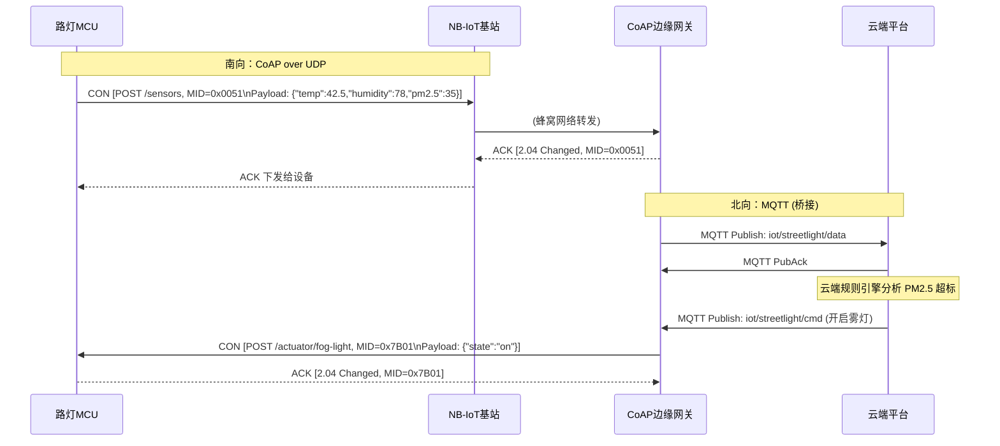
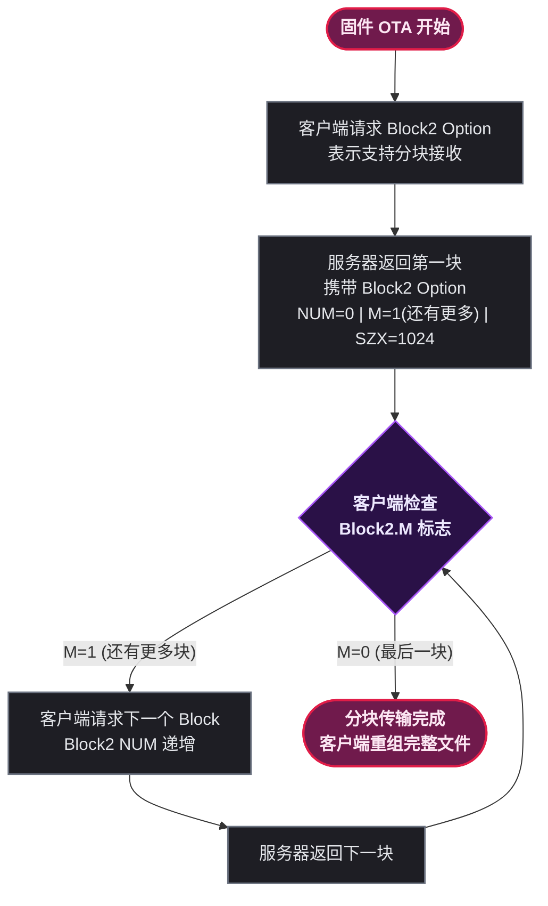
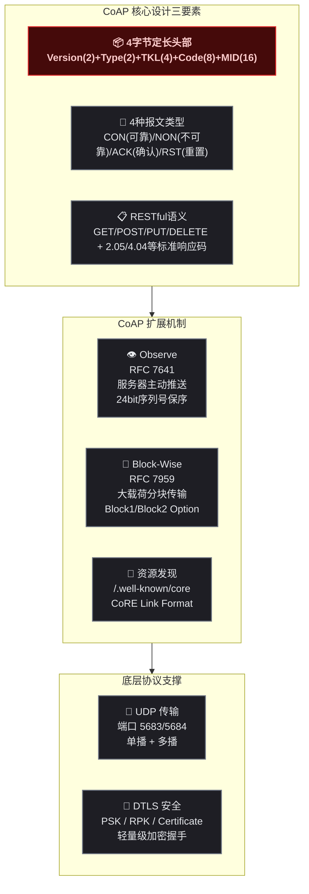

# 📡 CoAP 受限应用协议：报文格式、通信模型与物联网实战全解析

## 从一个智能灯控场景说起

假设你正在开发一套智能路灯系统。每个路灯上有一颗低功耗 MCU（微控制器），通过 NB-IoT（窄带物联网）蜂窝网络上报状态、接收开关指令。MCU 的 RAM 只有 64KB，Flash 只有 256KB，网络带宽不到 100kbps，每月流量限额 30MB。

你能在这颗 MCU 上跑 HTTP 吗？

**不能。** 原因有三：

1. HTTP 基于 TCP，TCP 三次握手 + TLS 握手需要至少 5 ~ 7 个往返（RTT），在 100kbps 窄带网络上耗时数秒
2. HTTP 头部是纯文本，一个  `GET /status HTTP/1.1\r\nHost: ...`  请求头轻松超过 200 字节，而传感器上报的有效数据可能只有 4 字节（一个温度值）
3. TCP 连接要保持状态，MCU 内存不足以维护大量连接

**CoAP** （Constrained Application Protocol，受限应用协议）就是为这种场景设计的。它用 UDP 替代 TCP、用 4 字节定长二进制头部替代 HTTP 的文本头、用简单的重传机制替代 TCP 的复杂拥塞控制，让一颗 64KB RAM 的 MCU 也能参与到互联网架构中。

下面先用一段概念性代码感受 CoAP 的编程模型：

```python
#  使用 aiocoap 库模拟路灯上报温度数据
import asyncio
from aiocoap import Context, Message, GET, POST, NON

async def main():
    # 创建 CoAP 客户端上下文
    protocol = await Context.create_client_context()

    # 路灯上报温度（NON 模式，不需要确认）
    payload = b'{"device":"streetlight-01","temp":42.5,"unit":"celsius"}'
    request = Message(code=POST, payload=payload, uri='coap://iot-hub.local/sensors')
    request.type = NON  # 不可靠传输，不等待 ACK
    await protocol.request(request).response

    # 路灯查询服务器上的配置（CON 模式，需要确认）
    config_req = Message(code=GET, uri='coap://iot-hub.local/config/streetlight-01')
    response = await protocol.request(config_req).response
    print(f"配置下发: {response.payload.decode()}")

asyncio.run(main())
```

这段代码演示了 CoAP 最核心的两个通信模式： **NON** （不可靠推送，发完即忘）和  **CON** （可靠请求，等待确认）。下面从协议层面逐层展开 CoAP 的完整设计。

## CoAP 协议总览

CoAP 由 IETF（互联网工程任务组）在 RFC 7252 中定义，核心定位是"受限节点上的 HTTP 替代品"。先通过一张思维导图建立全局认知：



CoAP 分为四个层次，从上到下依次是： **扩展机制层** （Observe/Block-Wise/资源发现）、 **请求/响应层** （RESTful 语义 + 响应模式）、 **报文层** （4 字节头部 + 4 种报文类型）、 **传输层** （UDP + DTLS）。

## CoAP 报文格式：4 字节定长头部

CoAP 最精妙的设计在于它的报文头部——固定 4 字节，每一个 bit 都有明确用途。



### 🔍 逐字段详解

**Version (Ver)** ：占 2 bit，固定为  `01` ，表示 CoAP 版本 1。如果收到其他值，接收方直接丢弃（因为目前只有版本 1 的语义）。

**Type (T)** ：占 2 bit，定义 4 种报文类型：

| 值 | 类型 | 缩写 | 含义 | 需要应答 |
|:---:|------|------|------|:---:|
| 0 | Confirmable | CON | 需要确认的报文，接收方必须回复 ACK 或 RST | 是 |
| 1 | Non-confirmable | NON | 不需要确认的报文，发完即忘 | 否 |
| 2 | Acknowledgement | ACK | 对 CON 报文的确认应答 | 否 |
| 3 | Reset | RST | 表示报文有误或上下文缺失，要求重置 | 否 |

**Token Length (TKL)** ：占 4 bit，表示  **Token**  字段的实际长度（0 ~ 8 字节）。Token 是 CoAP 用于匹配请求和响应的标识符（类比 HTTP/2 的 Stream ID），允许一对节点间并发多个请求。

**Code (8bit)** ：3 位 Class + 5 位 Detail，编码方式为  `c.dd` （如  `2.05`  表示 Content）。完整响应码如下：

| Class | 含义 | 常见 Code |
|:---:|------|------|
| 0 | Request | 0.01 GET, 0.02 POST, 0.03 PUT, 0.04 DELETE |
| 2 | Success | 2.01 Created, 2.02 Deleted, 2.03 Valid, 2.04 Changed, **2.05 Content** |
| 4 | Client Error | **4.00 Bad Request**, 4.01 Unauthorized, **4.04 Not Found**, 4.05 Method Not Allowed |
| 5 | Server Error | 5.00 Internal Server Error, 5.03 Service Unavailable |

**Message ID** ：16 bit 无符号整数（0 ~ 65535），始发端每发一条新报文自增。CON 和 ACK 通过匹配 Message ID 完成可靠传输。重传时 Message ID **不变** 。

### 📦 真实数据包拆解

以下是一个完整的 CoAP GET 请求的十六进制原始报文，逐一字节拆解：

```
十六进制报文:
42 01 12 34 71 74 B1 65 78 61 6D 70 6C 65 FF 74 65 6D 70

逐字节解析：
┌─────────────────────────────────────────────────────────────┐
│ Byte 0: 0x42 = 01 00 0010                                   │
│   Ver=01 (版本1), Type=00 (CON), TKL=0010 (Token=2字节)      │
│ Byte 1: 0x01 = 00000 001                                     │
│   Class=0 (Request), Detail=1 → 0.01 = GET                  │
│ Byte 2~3: 0x1234                                             │
│   Message ID = 0x1234 (4660)                                 │
│ Byte 4~5: 0x71 0x74   (Token: "qt", 2字节)                  │
│ Byte 6: 0xB1                                                │
│   Option Delta=11, Option Length=1                          │
│   → Option 11 = Uri-Path                                    │
│ Byte 7: 0x65 = "e" (路径第一段)                               │
│ Byte 8~14: 0x78 61 6D 70 6C 65 → "xample" (路径第二段?)      │
│   ... Option Delta=0, Length=6 (延续 Uri-Path)               │
│ Byte 15: 0xFF = Payload Marker (payload开始)                  │
│ Byte 16~18: 0x74 65 6D 70 → "temp" (payload内容)             │
└─────────────────────────────────────────────────────────────┘
```

这个 19 字节的请求做了一件事： `GET coap://server/example?payload=temp` 。对比 HTTP 同样语义的请求  `GET /example HTTP/1.1\r\nHost: server\r\nAccept: */*\r\n\r\n`  约 50 字节，CoAP 节省了 60% 以上的头部开销。

## 四种报文类型与状态机

CON / NON / ACK / RST 四种类型构成了 CoAP 可靠的通信基础。它们之间的转换关系如下：



### 🔄 重传机制：指数退避与超时计算

CoAP 的重传由两个参数控制：

| 参数 | 默认值 | 含义 |
|------|:---:|------|
| ACK_TIMEOUT | 2 秒 | 发送 CON 后等待 ACK 的最短超时时间 |
| ACK_RANDOM_FACTOR | 1.5 | 随机因子，实际超时 = ACK_TIMEOUT × (1 ~ 1.5) 之间的随机数 |
| MAX_RETRANSMIT | 4 | 最大重传次数 |

重传间隔公式：

$$Timeout_n = ACK\_TIMEOUT \times (1 + random(0, 0.5)) \times 2^{n-1}, \quad n \in [1, 4]$$

实际超时序列为：2 秒 → 4 秒 → 8 秒 → 16 秒，总共不超过 247 秒。引入随机因子是为了避免多个节点同时重传导致的拥塞同步。

## 请求/响应模型：两种响应模式

CoAP 支持两种响应模式，决定了 ACK 报文中是否携带业务数据：



### ⚖️ 两种模式的适用场景

| 对比维度 | 捎带响应 (Piggybacked) | 分离响应 (Separate) |
|------|------|------|
| 响应延迟 | 即时（< 1 秒） | 可能较长（秒级 ~ 分钟级） |
| 往返次数 | 1 次 | 2 次（先 ACK 空应答，再 CON 携带结果） |
| 服务器压力 | 低（无需额外状态） | 中（需暂存请求上下文） |
| 典型场景 | 读取传感器当前值、开关灯指令 | 生成报表、固件 OTA 下载、复杂计算 |
| ACK 中是否携带数据 | 是（ACK 的 Code=2.05, Payload 有数据） | 否（第一帧 ACK 的 Code=0.00 Empty） |

### 🧠 核心逻辑判断（RFC 7252 简化版）

```c
// 服务端处理 CON 请求的伪代码
void handle_con_request(coap_message_t *req) {
    result = process_request(req);  // 业务处理

    if (result.ready_immediately) {
        // 捎带响应：直接在 ACK 中返回结果
        send_ack(req->message_id, result.code, result.payload);
    } else {
        // 分离响应：先发空 ACK 确认收到请求
        send_empty_ack(req->message_id);
        // 异步计算...完成后以新 CON 发送结果
        schedule_async_response(req->token, result);
    }
}
```

关键判断就是  `<span style="color:red">result.ready_immediately</span>`——服务端是否能在当前时间片内计算完毕。这是区分两种模式的唯一标准。

## 核心 Option 字段：Uri-Path、Uri-Query、Content-Format

Options 是 CoAP 头部的扩展字段，位于 4 字节定长头部之后、Payload 之前。每个 Option 由  **Delta（增量）** + **Length** + **Value**  编码，使用增量编码减少重复传输。



### 📋 常用 Option 速查表

| Option No. | 名称 | 格式 | 用途 | 示例 |
|:---:|------|------|------|------|
| 3 | Uri-Host | string | 虚拟主机名 | `coap.example.com` |
| 7 | Uri-Port | uint | 目标端口 | `5684` |
| 11 | Uri-Path | string | URI 路径段（可多个） | `sensors/temperature` |
| 15 | Uri-Query | string | URI 查询参数（可多个） | `since=2024-01-01` |
| 12 | Content-Format | uint | Payload 的媒体类型 | `50` = application/json, `42` = application/octet-stream |
| 14 | Accept | uint | 客户端期望的响应格式 | `50` = application/json |
| 17 | ETag | opaque | 资源版本标识 | `0x12AB` |

**Content-Format 常用值** ：

| Content-Format ID | 对应 MIME 类型 | 典型场景 |
|:---:|------|------|
| 40 | application/link-format | 资源发现 |
| 41 | application/xml | 传统 SOAP/XML 网关 |
| 42 | application/octet-stream | 固件 OTA |
| 47 | application/exi | XML 高效二进制编码 |
| 50 | application/json | RESTful API |
| 60 | application/cbor | JSON 的二进制替代 |

## Observe 观察者机制：服务器主动推送

在标准 CoAP 中，客户端发起 GET 请求，服务器返回当前资源状态。但传感器数据是 **持续变化** 的——客户端需要不断轮询才能获得最新值。Observe（RFC 7641）解决了这个问题。

### 🔄 工作流程



Observe 的核心字段是  **Observe Option** （Option No. 6），它是一个 24 bit 序列号。每次推送递增，客户端据此判断：① 是否丢包（序列号跳跃）；② 推送顺序是否正确。

### 🛡️ 抗丢失设计

| 场景 | 客户端行为 |
|------|------|
| 序列号连续（如 1→2→3） | 正常处理 |
| 序列号跳跃（如 1→3） | 发现丢包，可主动 GET 当前值补充 |
| 序列号回退（如 3→1） | 可能是服务器重启，清空本地缓存重新计数 |
| 超过 128 秒未收到更新 | 认为订阅失效，重新注册 Observe |

Observe 机制让 CoAP 从"请求-响应"模式拓展到了"发布-订阅"模式，是物联网数据采集场景中最常用的特性之一。

## CoAP 与 MQTT / HTTP 的对比

这是物联网协议选型中最常遇到的决策问题。



### 📊 多维对比表

| 对比维度 | CoAP | MQTT | HTTP/1.1 |
|------|------|------|------|
| 传输层 | UDP | TCP | TCP |
| 头部开销 | 4 字节固定 | 2 字节固定 | 数百字节文本 |
| 通信模式 | 请求/响应 + 观察者 | 发布/订阅 | 请求/响应 |
| 消息可靠性 | CON/ACK 机制 | QoS 0/1/2 | TCP 保证 |
| 多播支持 | 原生支持（UDP） | 不支持 | 不支持 |
| 资源发现 | `/.well-known/core` | 无标准 | 无标准 |
| RESTful 语义 | 原生 GET/POST/PUT/DELETE | 无 | 原生支持 |
| 安全 | DTLS | TLS | TLS |
| 代理/缓存 | CoAP Proxy / 资源缓存 | Broker 中转 | HTTP Proxy |
| 典型场景 | 传感器、执行器、NB-IoT 设备 | 消息推送、即时通讯、车联网 | Web 应用、REST API |
| IETF 标准 | RFC 7252, RFC 7641 | OASIS 标准（非 IETF） | RFC 7230 ~ 7235 |

**不是替代关系，而是互补关系。** CoAP 和 MQTT 可以共存——设备端用 CoAP 上报到边缘网关，网关将数据桥接到 MQTT Broker，云端服务通过 MQTT 消费。

## 实际场景：NB-IoT 路灯系统完整数据流

下面用一个完整的智能路灯案例，展示 CoAP 在真实 IoT 系统中的应用。

### 🏗️ 系统架构



### 📟 设备端上报 CoAP 报文详解

以下是路灯上报 PM2.5 数据的完整 CoAP 报文（十六进制 + 分段解析）：

```
完整报文 (30 字节):
44 02 00 51 3D 12 B1 73 65 6E 73 6F 72 73 FF 7B 22 74 65
6D 70 22 3A 34 32 2E 35 7D

═══════════════════════════════════════
第一段：4 字节固定头部
═══════════════════════════════════════
Byte 0: 0x44 = 01 00 0100
  ├─ Ver  (bit 7~6): 01      → 版本 1
  ├─ Type (bit 5~4): 00      → CON (需要确认)
  └─ TKL  (bit 3~0): 0100    → Token 长度 = 4 字节

Byte 1: 0x02 = 00000 010
  ├─ Class (bit 7~5): 000    → 0 = Request
  └─ Detail(bit 4~0): 00010  → 2 = POST

Byte 2~3: 0x0051
  └─ Message ID: 81          → 用于 CON/ACK 配对

═══════════════════════════════════════
第二段：Token (4 字节)
═══════════════════════════════════════
Byte 4~7: 0x3D 0x12 0x00 0x00
  └─ Token: 用于匹配异步响应

═══════════════════════════════════════
第三段：Options (增量编码)
═══════════════════════════════════════
Byte 8: 0xB1
  ├─ Delta(高4bit): 0xB    → Option No. = 0 + 11 = 11 (Uri-Path)
  └─ Length(低4bit): 0x1   → Value 长度 = 1 (但0x1在这里是特殊编码...)

  实际解析: Delta=11, Length=1+ext → Value="s" (路径第一段字节)

Byte 9~15: 继续 Uri-Path 的后续字节
  → 路径最终为: "sensors"

═══════════════════════════════════════
第四段：Payload Marker 和 Payload
═══════════════════════════════════════
Byte 16: 0xFF
  └─ Payload Marker: 标志着 Options 结束，Payload 开始

Byte 17~23: 0x7B 0x22 0x74 0x65 0x6D 0x70 0x22 ...
  → JSON: {"temp":42.5}
```

### 🚪 网关响应（开启雾灯指令）

```
下行报文 (20 字节):
44 02 7B 01 8E 32 B1 61 63 74 75 61 74 6F 72 B1 66 6F 67 2D
     6C 69 67 68 74 FF 7B 22 73 74 61 74 65 22 3A 22 6F 6E 22 7D

═══════════════════════════════════════
头部解析：
  Byte 0: 0x44 → CON, Token=4字节
  Byte 1: 0x02 → POST
  Byte 2~3: 0x7B01 → Message ID = 31489

Options 解析：
  Uri-Path #1: "actuator"   (Option 11)
  Uri-Path #2: "fog-light"  (Option 11, Delta=0)
  Uri-Path #3: "on"         (Option 11, Delta=0)

Payload:
  {"state":"on"}
═══════════════════════════════════════
```

把反向操作调通后，整个路灯系统就具备了双向通信能力——设备上行传感器数据，平台下行控制指令，全程基于 CoAP 完成。

## Block-Wise Transfer：大载荷分块传输

CoAP 基于 UDP，单个数据包受 MTU（最大传输单元）限制（通常 1280 字节）。当 Payload 超过这个限制（如固件 OTA 升级包多达数百 KB），就需要用 Block-Wise Transfer（RFC 7959）分块传输。

### 🧩 分块机制



### 🔢 Block Option 编码

| Option No. | 名称 | 含义 | 字段 |
|:---:|------|------|------|
| 23 | Block2 | 响应中的分块控制（服务器→客户端） | NUM (块序号), M (是否有更多), SZX (块大小指数) |
| 27 | Block1 | 请求中的分块控制（客户端→服务器） | 同上 |

SZX（Size eXponent）与 2 的幂计算实际块大小：

$$BlockSize = 2^{SZX + 4}$$

| SZX | 块大小 | 典型 MTU |
|:---:|:---:|------|
| 0 | 16 字节 | 极受限链路 |
| 2 | 64 字节 | LoRaWAN |
| 4 | 256 字节 | NB-IoT |
| 6 | **1024 字节** （默认） | 以太网/标准 UDP |
| 7 | 2048 字节 | 局域网 |

### 📝 Block-Wise 请求样例

```python
#  客户端请求 Block2 分块：下载 512KB 固件
#  第一次请求
request = Message(code=GET, uri='coap://gateway/firmware/v2.1.bin')
request.opt.block2 = option.BlockOption.BlockwiseTuple(0, 0, 6)
#  NUM=0 (请求第0块), M=0 (由客户端发起), SZX=6 (1024字节/块)

#  服务器响应第一块
#  response.opt.block2 = (NUM=0, M=1(还有更多), SZX=6)
#  response.payload = 前1024字节固件

#  客户端请求第二块
request.opt.block2 = option.BlockOption.BlockwiseTuple(1, 0, 6)
#  NUM=1 (请求第1块)

#  服务器响应最后一块 (假设第 511 块是最后)
#  response.opt.block2 = (NUM=511, M=0(没有更多), SZX=6)
#  response.payload = 最后一部分固件字节
```

## 安全：DTLS 加密

CoAP 的安全层使用  **DTLS** （Datagram TLS，数据报传输层安全协议），本质上是 TLS 的 UDP 版本。CoAP 定义了四种安全模式：

| 安全模式 | 端口 | 加密 | 认证 | 场景 |
|------|:---:|:---:|------|------|
| **NoSec** （无安全） | 5683 | 无 | 无 | 封闭内网、开发调试 |
| **PreSharedKey** （预共享密钥） | 5684 | DTLS-PSK | 共享密钥 | 设备出厂烧录密钥，最常用 |
| **RawPublicKey** （原始公钥） | 5684 | DTLS-RPK | 非对称密钥 | 无需 PKI 证书体系 |
| **Certificate** （证书） | 5684 | DTLS-Cert | X.509 证书 | 对公网开放的服务 |

**DTLS-PSK 是物联网设备最常用的安全模式** ，因为：
1. 无需 CA 证书体系，MCU 上直接烧录 16 字节密钥
2. 握手仅需 2 ~ 3 个往返（比完整 TLS 握手少一半）
3. 不需要存储大体积证书链（X.509 证书可达 2KB+）

## 🎯 总结



### 📌 核心要点速查

| 要点 | 一句话总结 |
|------|------|
| 设计目标 | 在 RAM < 64KB、带宽 < 100kbps 的受限设备上替代 HTTP |
| 传输层 | UDP，4 字节定长二进制头部，HTTP 头部开销的 1/10 |
| 可靠性 | CON/ACK 机制 + 指数退避重传（最多 4 次），无需 TCP 连接 |
| 响应模式 | 捎带响应（ACK 携带数据）和分离响应（空 ACK + 独立 CON） |
| 扩展机制 | Observe（订阅推送）、Block-Wise（大文件分块）、资源发现 |
| 安全 | DTLS-PSK 是物联网最常用的加密方案 |
| 与 MQTT 的关系 | 互补而非替代——CoAP 侧重请求/响应 + RESTful，MQTT 侧重发布/订阅 + 百万并发 |
| 典型应用 | NB-IoT 路灯控制、智能电表采集、农业传感器网络、工业设备监控 |

CoAP 的设计哲学是： **用最少的字节数完成最核心的操作** 。4 字节头部、增量 Option 编码、捎带响应、指数退避重传——每一个设计决策都指向同一个目标——让一颗 64KB RAM 的 MCU 也能成为互联网的一等公民。
