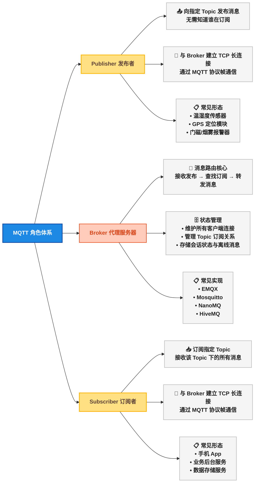
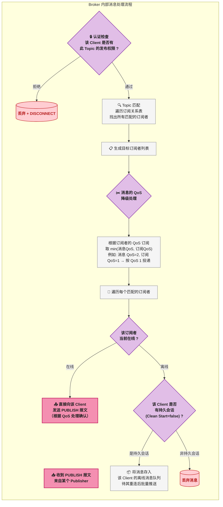
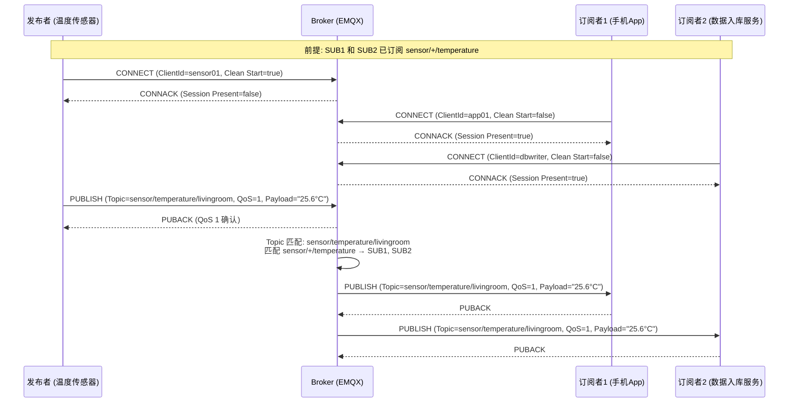
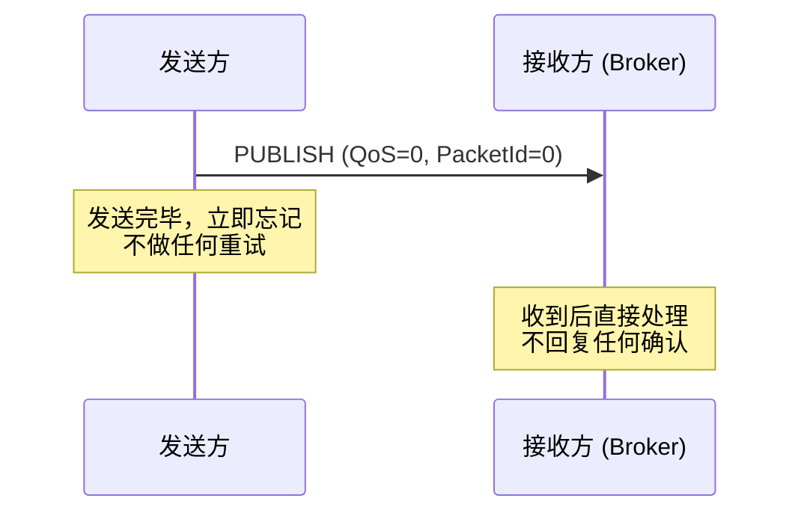
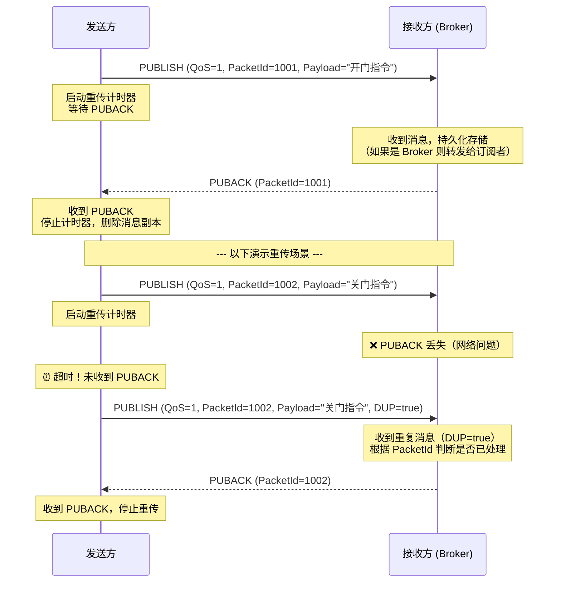
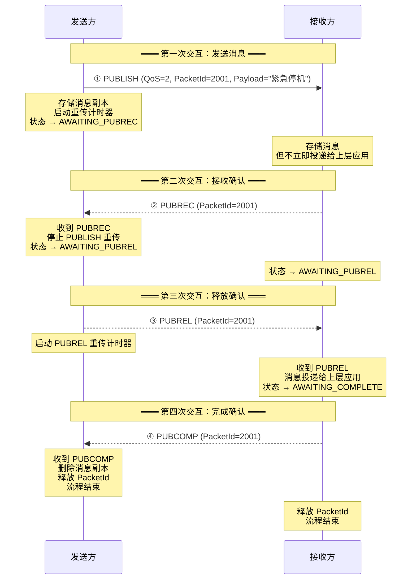
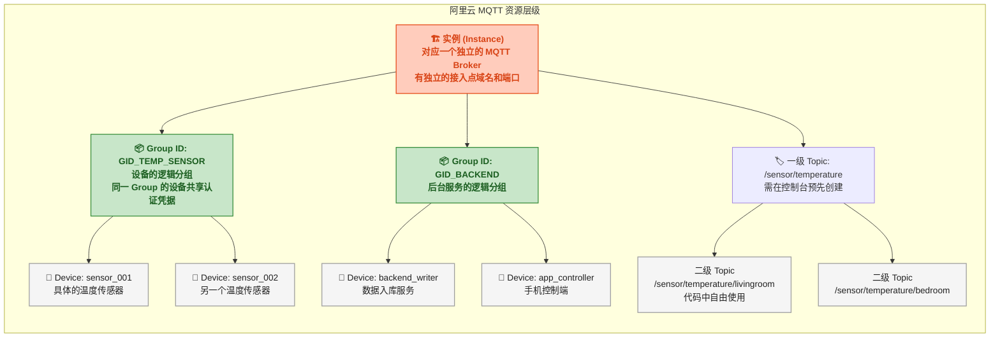
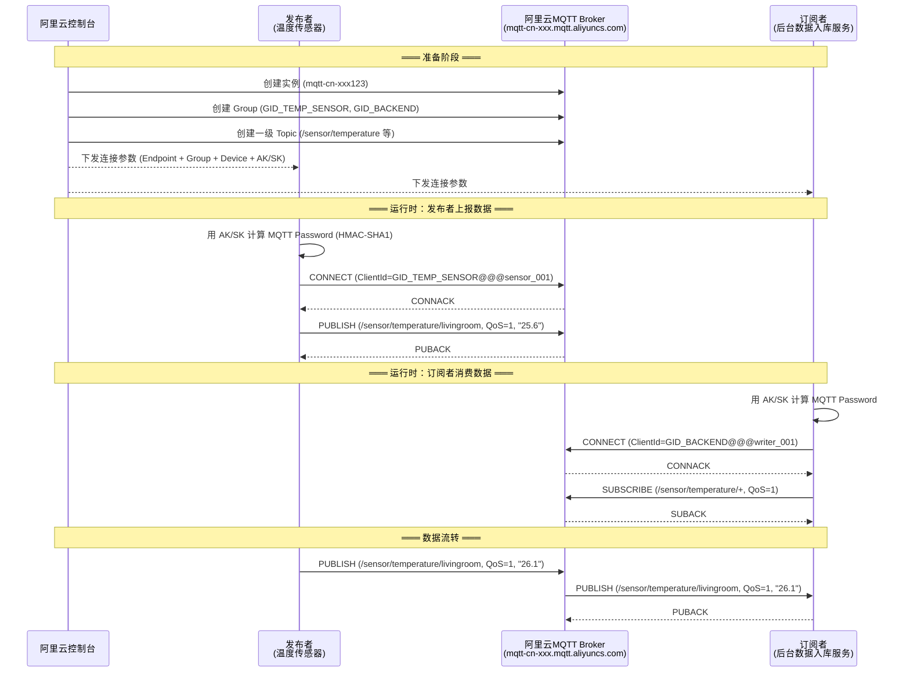
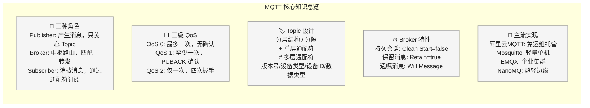

# 📡 MQTT 协议：角色体系、Broker 原理与 QoS 分级机制全解析

## 问题切入：一个智能家居的消息困境

假设你要开发一个智能家居系统，包含以下设备：

- 10 个温湿度传感器，每 5 秒上报一次数据
- 5 个智能插座，需要接收开关指令并上报当前功率
- 1 个手机 App，需要实时看到所有设备的状态，并能下发控制指令

你的第一反应可能是用 HTTP：传感器 POST 数据到服务端，App 轮询拉取最新状态。但很快问题就来了：

```
传感器数量 × 上报频率 = 10 × (1 / 5s) = 2 QPS 的上报请求
App 轮询最新状态 = 1 × (1 / 2s) = 0.5 QPS 的查询请求
设备控制指令 = App POST 到服务端，服务端再推给设备...
```

HTTP 是请求-响应模式，服务端无法主动向设备推送指令。如果让设备轮询指令，延迟高且浪费带宽。而且温湿度传感器是低功耗设备（电池供电的 ESP8266），HTTP 的 TCP 三次握手 + Header 开销太大。

这就是 MQTT（Message Queuing Telemetry Transport，消息队列遥测传输协议）解决的问题：它是一个 **发布-订阅模式** 的轻量级消息协议，专为低带宽、高延迟、不可靠网络下的物联网设备通信而设计。

## MQTT 的角色体系

MQTT 协议定义了三种角色。大部分文章对它们的介绍含糊其词，这里逐个讲清楚。



### 📨 Publisher（发布者）

Publisher 是 **产生消息的客户端** 。它的核心行为只有一件事：向指定 Topic 发送消息。

| 特征 | 说明 |
|------|------|
| **知道 Topic 吗？** | 知道。发布者必须指定消息发到哪个 Topic |
| **知道谁在订阅吗？** | 不知道。发布者完全不关心消息被谁消费 |
| **需要长连接吗？** | 需要。与 Broker 保持 TCP 长连接，通过 MQTT 协议帧通信 |
| **典型设备** | 传感器、GPS 模块、门锁状态上报器 |

Publisher 的职责边界非常窄——它只负责把消息交给 Broker，Broker 怎么分发、有哪些订阅者、消息是否送达，发布者一概不知（除非使用了 QoS 1/2 的确认机制）。

### 📨 Subscriber（订阅者）

Subscriber 是 **消费消息的客户端** 。它订阅感兴趣的 Topic，接收该 Topic 下的消息。

| 特征 | 说明 |
|------|------|
| **知道 Topic 吗？** | 知道。订阅者必须告诉 Broker 自己订阅哪个 Topic |
| **知道谁在发布吗？** | 不知道。订阅者不关心消息来源 |
| **需要长连接吗？** | 需要。与 Broker 保持 TCP 长连接以实时接收消息 |
| **典型设备** | 手机 App、监控后台、数据入库服务 |

订阅者可以同时订阅多个 Topic，也可以使用通配符一次性订阅一组 Topic（详见下文 Topic 设计章节）。

### 📡 Broker（代理服务器）—— 最重要的角色

Broker 是 MQTT 系统的 **核心中枢** 。它负责：

1. **接收所有发布者的消息**
2. **维护 Topic 订阅关系表** （哪个 Client 订阅了哪些 Topic）
3. **将消息转发给匹配的订阅者**
4. **管理客户端会话状态** （谁在线、谁离线、离线期间的消息怎么处理）
5. **处理 QoS 确认** （QoS 1 的 PUBACK、QoS 2 的四次握手）



Broker 的核心数据结构——订阅关系表：

```
// Broker 内部维护的订阅关系（概念模型，非源码）
{
    "sensor/temperature/livingroom": [Client_A, Client_B],   // 精确匹配
    "sensor/+/temperature":        [Client_C],               // 单层通配符
    "device/control/#":            [Client_D, Client_E],     // 多层通配符
}
```

每次收到 PUBLISH 报文时，Broker 需要用发布消息的 Topic 去匹配表中所有的订阅 Topic（包括通配符），找到所有匹配的订阅者。Topic 匹配算法是 Broker 的性能关键路径。

### 📬 一个完整的消息流转实例

以下是一次典型的 MQTT 消息发布-订阅流程：



注意几个关键点：

- 发布者发送消息时 **不需要指定接收者** ，只需要指定 Topic
- Broker 在 Topic 匹配后才决定消息转发给谁
- 发布者和订阅者彼此之间完全解耦——它们甚至不知道对方的存在
- 发布者和订阅者可以是同一个物理设备（一个 Client 既可以发布也可以订阅）

## QoS：消息可靠性的三级分层

QoS（Quality of Service，服务质量）是 MQTT 协议中最容易被误解的概念。它定义了 **消息从发送方到接收方的可靠性保证级别** ，不是消息的"优先级"或"重要性"。

MQTT 定义了 3 个 QoS 级别：

| QoS | 名称 | 语义 | 消息可能的状态 |
|:---:|------|------|------|
| 0 | 最多一次（At most once） | 发送即忘，不保证送达 | 丢失 或 到达 1 次 |
| 1 | 至少一次（At least once） | 确保送达，可能重复 | 到达 1 次 或 到达多次 |
| 2 | 仅一次（Exactly once） | 确保送达且不重复 | 到达且仅到达 1 次 |

**关键理解** ：QoS 是 **分段** 的，不是端到端的。一段是 Publisher → Broker，另一段是 Broker → Subscriber。两段的 QoS 可以不同。


上图示例中：发布者以 QoS 1 发布消息（确保到达 Broker），但某个订阅者以 QoS 0 订阅该 Topic（Broker 推给它时不需要确认）。Broker 在内部做 QoS 降级：取 `min(发布QoS, 订阅QoS)` = `min(1, 0)` = 0。

### 📡 QoS 0：最多一次

QoS 0 是最简单的级别——发送方发出 PUBLISH 报文后， **不等待任何确认** ，也不重试。



**适用场景** ：

| 场景 | 说明 |
|------|------|
| 高频传感器数据 | 温度每 2 秒上报一次，丢一两条不影响业务 |
| 实时性优先于可靠性 | 运动轨迹上报、实时位置更新 |
| 低功耗设备 | 省去确认报文的上行传输功耗 |

QoS 0 报文的 PacketId 固定为 0（没有重传需求，不需要标识符）。

### 📡 QoS 1：至少一次

QoS 1 确保消息 **至少被接收方收到一次** 。发送方发出 PUBLISH 后会等待 PUBACK 确认，超时未收到则重传。代价是接收方可能收到重复消息。



**关键设计细节** ：

| 机制 | 说明 |
|------|------|
| **PacketId** | 非 0 的 16 位整数，用于匹配 PUBLISH 与 PUBACK |
| **DUP 标志** | 重传时置为 1，告知接收方"这可能是重复消息" |
| **接收方去重** | 接收方可根据 PacketId 去重，但不是强制的（MQTT 规范只要求"尽力"） |
| **重传计时器** | 发送方自行管理，超时时间取决于实现（典型值 10 ~ 30 秒） |

**适用场景** ：

| 场景 | 说明 |
|------|------|
| 设备控制指令 | 开关、锁、阀门等——必须确保指令到达 |
| 告警消息 | 烟雾报警、水浸检测——不能丢失 |
| 状态变更通知 | 设备上线/下线通知 |

### 📡 QoS 2：仅一次

QoS 2 是 MQTT 中最复杂的可靠性级别，通过 **四次握手** 确保消息既不会丢失也不会重复。



每一步都有独立的超时重传机制：

| 交互 | 报文 | 发送方 | 丢失后的行为 |
|:---:|------|------|------|
| 1 | PUBLISH | Sender | Sender 超时重传 PUBLISH |
| 2 | PUBREC | Receiver | Sender 超时重传 PUBLISH（Receiver 收到重复 PUBLISH 后重发 PUBREC） |
| 3 | PUBREL | Sender | Receiver 超时重发 PUBREC（Sender 收到重复 PUBREC 后重发 PUBREL） |
| 4 | PUBCOMP | Receiver | Sender 超时重发 PUBREL（Receiver 收到重复 PUBREL 后重发 PUBCOMP） |

QoS 2 的设计思想是 **幂等性** ：每个报文都可以安全地重复发送，接收方根据当前状态做正确响应。

**适用场景** ：

| 场景 | 说明 |
|------|------|
| 金融交易指令 | 扣款、转账——重复执行会产生严重后果 |
| 计费消息 | 电量计费、流量计费——每条消息代表金额 |
| 关键状态同步 | 设备固件 OTA 升级指令 |

### 📡 QoS 核心注意事项

**（1）QoS 降级是单向的**

发布者以 QoS 2 发布，Broker 可能以 QoS 1 或 QoS 0 推送给订阅者：取 `min(pub_qos, sub_qos)` 。发布端的高 QoS 不保证订阅端也收到同样可靠性的消息。

**（2）QoS 越高，开销越大**

| QoS | 交互次数 | 网络往返 | 占用 PacketId | 适用设备 |
|:---:|:---:|:---:|:---:|------|
| 0 | 1 次 | 0 RTT | 否 | 低功耗传感器 |
| 1 | 2 次 | 1 RTT | 是（发到收 PUBACK） | 大多数设备 |
| 2 | 4 次 | 2 RTT | 是（几乎全程持有） | 高可靠性场景 |

**（3）PacketId 是有限资源**

PacketId 是 16 位字段，同一方向（Client → Broker 或 Broker → Client）上，同一个 Client 的飞行中的 QoS 1/2 消息最多 65535 个。在高吞吐场景下要注意飞行窗口管理。

**（4）不要用 QoS 替代业务层幂等**

QoS 2 保证"MQTT 协议的投递"是精确一次，但无法保证"应用层业务处理"是精确一次。例如：Broker 将消息投递给订阅者后，订阅者处理消息的过程中崩溃了，重启后这条消息就丢失了。如果业务需要严格精确一次，应在应用层做幂等设计（如基于消息 ID 去重）。

## Topic 设计与最佳实践

### 📡 Topic 的分层结构

MQTT 的 Topic 使用 `/` 作为层级分隔符，形成树形命名空间：

```
sensor/temperature/livingroom        # 客厅温度
sensor/temperature/bedroom           # 卧室温度
sensor/humidity/livingroom           # 客厅湿度
device/control/light/livingroom      # 客厅灯控制
device/control/plug/bedroom          # 卧室插座控制
device/status/light/livingroom       # 客厅灯状态上报
```

### 🔍 通配符

订阅者可以使用两种通配符来一次订阅多个 Topic：

| 通配符 | 含义 | 匹配范围 | 示例 |
|------|------|------|------|
| `+` | 单层通配符 | 匹配 **一个** 层级 | `sensor/+/temperature` 匹配 `sensor/livingroom/temperature` |
| `#` | 多层通配符 | 匹配 **零个或多个** 层级 | `device/control/#` 匹配 `device/control/light` 、 `device/control/plug/bedroom` |

**使用规则** ：

- `+` 必须单独占一个层级（不能出现 `sensor+/temperature` ）
- `#` 必须是 Topic 的最后一级（不能出现 `device/#/status` ）
- 发布消息时不允许使用通配符（只能在订阅时使用）
- `#` 匹配零层也有效： `sensor/#` 可以匹配 `sensor` 本身

### 📡 Topic 设计原则

| 原则 | 说明 | 正确示例 | 错误示例 |
|------|------|------|------|
| **语义分层** | 从大到小排列，越通用的越靠前 | `版本/设备类型/设备ID/数据类型` | `设备ID/温度` （无版本号，升级协议时无法兼容） |
| **避免以 `/` 开头** | MQTT 规范允许但不推荐 | `home/livingroom/temperature` | `/home/livingroom/temperature` |
| **避免以 `/` 结尾** | 会导致通配符匹配行为混乱 | `sensor/temperature` | `sensor/temperature/` |
| **预留版本号** | 协议升级时按版本订阅 | `v2/device/telemetry` | `device/telemetry` |
| **不用特殊字符** | 避免空格、中文、 `$` 开头（ `$` 开头的 Topic 通常保留给 Broker 内部使用） | `device/control` | `设备/控制` |
| **控制粒度用通配符** | 让订阅方用 `+` 或 `#` 灵活订阅 | `building/+/room/+/temperature` | `building1/room1/temperature` （太死板） |

**推荐的 Topic 命名范式** ：

```
{version}/{device_type}/{device_id}/{data_type}/{data_subtype}

示例:
v2/sensor/TH001/telemetry/temperature     # 温度遥测
v2/sensor/TH001/telemetry/humidity        # 湿度遥测
v2/sensor/TH001/event/alarm               # 告警事件
v2/plug/PL001/command/switch              # 开关指令
v2/plug/PL001/telemetry/power             # 功率上报
```

这样设计后，订阅端可以灵活组合：

```
#  订阅所有传感器的温度数据
v2/sensor/+/telemetry/temperature

#  订阅特定设备的所有遥测数据
v2/sensor/TH001/telemetry/#

#  订阅所有控制指令
v2/+/+/command/#
```

## Broker 的核心特性详解

### 💾 持久会话（Persistent Session）

MQTT 客户端连接时可以设置 `Clean Start` 标志：

| Clean Start | 行为 |
|:---:|------|
| `true` （默认） | 每次连接都创建全新会话。断开时 Broker 清除该 Client 的所有订阅关系和离线消息队列 |
| `false` | 使用持久会话。断开重连后，Broker 恢复之前的订阅关系，并推送离线期间积攒的消息 |

持久会话是 Broker 需要持久化存储的主要原因之一。它让不可靠网络环境下的设备（如 NB-IoT 设备、信号不稳定的移动设备）在断连后不会丢失消息。

### 📌 保留消息（Retained Message）

发布消息时如果设置 `Retain = true` ，Broker 会存储该 Topic 的 **最后一条保留消息** 。当有新的订阅者订阅该 Topic 时，Broker 立即将这条保留消息推送给它。

```
// 发布一条保留消息
PUBLISH (Topic=device/plug/PL001/status, QoS=1, Retain=true, Payload="{"power":120,"state":"on"}")

// 此时没有订阅者在线 —— 消息不丢失，Broker 保存它

// 5 分钟后，手机 App 订阅 device/plug/+/status
// Broker 立即推送该保留消息，让 App 无需等待就能获得最新状态
```

**注意** ：每个 Topic 只能保留一条消息（最新的那条会覆盖旧的）。要删除保留消息，发布一条空 Payload 的保留消息到该 Topic。

保留消息非常适合"设备状态同步"场景——新上线的订阅者无需等待设备下次上报就能立刻获得设备的最新已知状态。

### 📝 遗嘱消息（Last Will and Testament）

客户端连接时可以设置遗嘱消息（Will Message）。当 Broker 检测到该客户端 **非正常断开** （心跳超时，非主动发送 DISCONNECT）时，Broker 自动将遗嘱消息发布到指定 Topic。

```
// 设备连接时声明遗嘱
CONNECT (
    ClientId=PL001,
    Will Topic=device/plug/PL001/status,
    Will QoS=1,
    Will Retain=true,
    Will Payload="{"state":"offline","reason":"connection_lost"}"
)

// 设备正常工作时，定期发送 PINGREQ 维持心跳...
// 突然断电！设备停止响应

// Broker 心跳超时（如 60 秒未收到 PINGREQ）
// → Broker 发布遗嘱消息到 device/plug/PL001/status
// → 所有订阅者收到：{"state":"offline","reason":"connection_lost"}
```

遗嘱消息的核心价值在于： **让订阅者能感知到设备的在线/离线状态变化** ，而无需订阅者主动轮询。

## 实战：阿里云微消息队列 MQTT 完整接入

以下使用阿里云微消息队列 MQTT 作为实际平台，从零开始完成一个"智能温控系统"的 Publisher 和 Subscriber。所有代码可直接运行。

### 🏗️ 阿里云 MQTT 的资源模型

在开始写代码之前，必须先理解阿里云 MQTT 的资源层级——它和我们前面讲的抽象角色是一一对应的：



| 阿里云概念 | 对应 MQTT 概念 | 说明 |
|------|------|------|
| **实例（Instance）** | Broker | 一个独立的 MQTT Broker 实例，有专属的 TCP 接入点和 HTTP 接入点 |
| **Group ID** | 设备分组 | 逻辑上的设备分组，同时也是 MQTT ClientId 的第一段 |
| **Device ID** | 单个 Client | 一个具体的客户端标识，与 Group ID 拼接构成完整的 MQTT ClientId |
| **一级 Topic** | 父级 Topic | 必须在阿里云控制台预先创建（如 `/sensor/temperature` ） |
| **二级 Topic** | 子级 Topic | 代码中自由拼接使用，无需事先创建（如 `/sensor/temperature/livingroom` ） |
| **AccessKey** | 认证凭据 | 用于计算 MQTT 连接时的 Username 和 Password |

### 🛠️ 控制台准备：创建实例、Group 和 Topic

**第一步：购买实例** 。进入阿里云"微消息队列 MQTT 版"控制台，创建一个实例。记录以下参数，后续代码中要用：

```
实例 ID:           mqtt-cn-xxx123
TCP 接入点:        mqtt-cn-xxx123.mqtt.aliyuncs.com:1883
实例所属 Region:   cn-hangzhou
```

**第二步：创建 Group ID** 。在实例详情页的"Group 管理"中创建两个 Group：

| Group ID | 用途 | 
|------|------|
| `GID_TEMP_SENSOR` | 温度传感器设备组 |
| `GID_BACKEND` | 后台服务组（数据入库 + 控制端） |

**第三步：创建一级 Topic** 。在"Topic 管理"中创建一级 Topic：

```
/sensor/temperature    # 温度上报
/device/command        # 设备控制指令
/device/status         # 设备在线状态
```

**第四步：获取 AccessKey** 。在 RAM 控制台创建 AccessKey，记录 AccessKey ID 和 AccessKey Secret。后续连接 MQTT 时需要用它们计算签名。

### 🚪 接入流程总览



### ☕ 核心代码：通用的 MQTT 连接工厂

阿里云 MQTT 使用标准 MQTT 3.1.1 协议，可以用 Eclipse Paho 客户端直连。关键区别在于 **认证密码的计算方式** ——需要用 AccessKey Secret 对连接参数做 HMAC-SHA1 签名。

Maven 依赖：

```xml
<dependency>
    <groupId>org.eclipse.paho</groupId>
    <artifactId>org.eclipse.paho.client.mqttv3</artifactId>
    <version>1.2.5</version>
</dependency>
```

连接参数计算工具类：

```java
import javax.crypto.Mac;
import javax.crypto.spec.SecretKeySpec;
import java.nio.charset.StandardCharsets;
import org.apache.commons.codec.binary.Base64;

public class AliyunMqttAuth {

    /**
     * 计算阿里云 MQTT 连接所需的 Username 和 Password。
     *
     * @param instanceId   实例 ID，如 "mqtt-cn-xxx123"
     * @param accessKey    阿里云 AccessKey ID
     * @param secretKey    阿里云 AccessKey Secret
     * @param groupId      Group ID，如 "GID_TEMP_SENSOR"
     * @param deviceId     Device ID，如 "sensor_001"
     * @return [clientId, username, password]
     */
    public static MqttCredential buildCredential(
            String instanceId, String accessKey, String secretKey,
            String groupId, String deviceId) throws Exception {

        // Step 1: 构造 ClientId = GroupId + "@@@" + DeviceId
        String clientId = groupId + "@@@" + deviceId;

        // Step 2: 构造 Username = "Signature|{accessKey}|{instanceId}"
        String username = "Signature|" + accessKey + "|" + instanceId;

        // Step 3: 构造待签名字符串 = clientId 本身
        String plainText = clientId;

        // Step 4: HMAC-SHA1 签名，结果 Base64 编码即为 Password
        Mac hmac = Mac.getInstance("HmacSHA1");
        SecretKeySpec keySpec = new SecretKeySpec(
                secretKey.getBytes(StandardCharsets.UTF_8), "HmacSHA1");
        hmac.init(keySpec);
        byte[] signResult = hmac.doFinal(plainText.getBytes(StandardCharsets.UTF_8));
        String password = Base64.encodeBase64String(signResult);

        return new MqttCredential(clientId, username, password);
    }

    public static class MqttCredential {
        public final String clientId;
        public final String username;
        public final String password;

        public MqttCredential(String clientId, String username, String password) {
            this.clientId = clientId;
            this.username = username;
            this.password = password;
        }
    }
}
```

**签名流程分步说明** ：

| 步骤 | 操作 | 示例值 |
|:---:|------|------|
| 1 | 拼接 ClientId | `GID_TEMP_SENSOR@@@sensor_001` |
| 2 | 拼接 Username | `Signature|LTAI5tAbc123|mqtt-cn-xxx123` |
| 3 | 取待签名字符串（就是 ClientId） | `GID_TEMP_SENSOR@@@sensor_001` |
| 4 | HMAC-SHA1(secretKey, plainText) → Base64 | `aB3xK9m...(Base64 串)` |

### 📤 发布者代码：温度传感器上报

```java
import org.eclipse.paho.client.mqttv3.*;
import org.eclipse.paho.client.mqttv3.persist.MemoryPersistence;

public class TemperatureSensorPublisher {

    // ============ 从阿里云控制台获取的配置 ============
    private static final String ENDPOINT = "tcp://mqtt-cn-xxx123.mqtt.aliyuncs.com:1883";
    private static final String INSTANCE_ID = "mqtt-cn-xxx123";
    private static final String ACCESS_KEY = "LTAI5tAbc123456";     // 替换为实际 AK
    private static final String SECRET_KEY = "skabcdefg7890123456"; // 替换为实际 SK
    private static final String GROUP_ID = "GID_TEMP_SENSOR";
    private static final String DEVICE_ID = "sensor_001";

    public static void main(String[] args) throws Exception {
        // 1. 计算认证凭据
        AliyunMqttAuth.MqttCredential credential = AliyunMqttAuth.buildCredential(
                INSTANCE_ID, ACCESS_KEY, SECRET_KEY, GROUP_ID, DEVICE_ID);

        System.out.println("ClientId: " + credential.clientId);
        System.out.println("Username: " + credential.username);
        // 注意：正式环境不要打印 Password

        // 2. 创建 MQTT 客户端
        MqttClient client = new MqttClient(
                ENDPOINT,
                credential.clientId,
                new MemoryPersistence()      // 内存持久化（嵌入式场景不落盘）
        );

        // 3. 配置连接选项
        MqttConnectOptions options = new MqttConnectOptions();
        options.setUserName(credential.username);
        options.setPassword(credential.password.toCharArray());
        options.setCleanSession(true);       // 传感器断连后不保存离线消息
        options.setKeepAliveInterval(60);    // 心跳间隔 60 秒

        // 4. 设置遗嘱消息——Broker 检测到设备断连后自动发布
        options.setWill(
                "/device/status",                                 // 遗嘱 Topic
                ("{\"device\":\"" + DEVICE_ID + "\",\"status\":\"offline\"}").getBytes(),
                1,                                                // 遗嘱 QoS
                true                                              // 保留消息
        );

        // 5. 设置回调
        client.setCallback(new MqttCallback() {
            @Override
            public void connectionLost(Throwable cause) {
                System.err.println("连接断开: " + cause.getMessage());
                // 实际项目中应在这里实现自动重连逻辑
            }

            @Override
            public void messageArrived(String topic, MqttMessage message) {
                // 传感器通常只发不收，但也可以接收指令
                System.out.println("收到消息: Topic=" + topic
                        + ", Payload=" + new String(message.getPayload()));
            }

            @Override
            public void deliveryComplete(IMqttDeliveryToken token) {
                // QoS 1/2 消息投递完成回调，QoS 0 不触发
            }
        });

        // 6. 连接 Broker
        client.connect(options);
        System.out.println("温度传感器已连接 阿里云 MQTT Broker");

        // 7. 周期上报温度数据
        double temperature = 25.0;
        while (true) {
            temperature += (Math.random() - 0.5) * 2.0; // 模拟温度波动
            String payload = String.format(
                    "{\"device\":\"%s\",\"temperature\":%.1f,\"timestamp\":%d}",
                    DEVICE_ID, temperature, System.currentTimeMillis()
            );

            MqttMessage msg = new MqttMessage(payload.getBytes());
            msg.setQos(1);    // 使用 QoS 1 确保数据到达 Broker

            client.publish("/sensor/temperature/livingroom", msg);
            System.out.println("发布: " + payload);

            Thread.sleep(10000); // 每 10 秒上报一次
        }
    }
}
```

### 📥 订阅者代码：后台数据入库服务

```java
import org.eclipse.paho.client.mqttv3.*;
import org.eclipse.paho.client.mqttv3.persist.MemoryPersistence;

public class BackendDataSubscriber {

    private static final String ENDPOINT = "tcp://mqtt-cn-xxx123.mqtt.aliyuncs.com:1883";
    private static final String INSTANCE_ID = "mqtt-cn-xxx123";
    private static final String ACCESS_KEY = "LTAI5tAbc123456";
    private static final String SECRET_KEY = "skabcdefg7890123456";
    private static final String GROUP_ID = "GID_BACKEND";
    private static final String DEVICE_ID = "writer_001";

    public static void main(String[] args) throws Exception {
        AliyunMqttAuth.MqttCredential credential = AliyunMqttAuth.buildCredential(
                INSTANCE_ID, ACCESS_KEY, SECRET_KEY, GROUP_ID, DEVICE_ID);

        MqttClient client = new MqttClient(
                ENDPOINT, credential.clientId, new MemoryPersistence());

        MqttConnectOptions options = new MqttConnectOptions();
        options.setUserName(credential.username);
        options.setPassword(credential.password.toCharArray());
        options.setCleanSession(false);   // 持久会话！断连后恢复订阅 + 收离线消息
        options.setKeepAliveInterval(60);

        client.setCallback(new MqttCallback() {
            @Override
            public void connectionLost(Throwable cause) {
                System.err.println("连接断开: " + cause.getMessage());
            }

            @Override
            public void messageArrived(String topic, MqttMessage message) {
                String payload = new String(message.getPayload());
                System.out.println("收到: Topic=" + topic + ", QoS="
                        + message.getQos() + ", Payload=" + payload);

                // 实际项目中：解析 JSON → 写入 InfluxDB/TimescaleDB
                // saveToTimeSeriesDB(topic, payload);
            }

            @Override
            public void deliveryComplete(IMqttDeliveryToken token) { }
        });

        client.connect(options);
        System.out.println("数据入库服务已连接");

        // 订阅所有传感器的温度数据（单层通配符）
        client.subscribe("/sensor/temperature/+", 1);

        // 订阅设备状态
        client.subscribe("/device/status", 1);

        System.out.println("已订阅: /sensor/temperature/+, /device/status");

        // 保持运行，持续接收消息
        Thread.currentThread().join();
    }
}
```

### 📱 订阅者代码：手机控制端（发布 + 订阅）

```java
public class AppController {

    private static final String ENDPOINT = "tcp://mqtt-cn-xxx123.mqtt.aliyuncs.com:1883";
    private static final String INSTANCE_ID = "mqtt-cn-xxx123";
    private static final String ACCESS_KEY = "LTAI5tAbc123456";
    private static final String SECRET_KEY = "skabcdefg7890123456";
    private static final String GROUP_ID = "GID_BACKEND";
    private static final String DEVICE_ID = "app_001";

    private MqttClient client;

    public void connect() throws Exception {
        AliyunMqttAuth.MqttCredential credential = AliyunMqttAuth.buildCredential(
                INSTANCE_ID, ACCESS_KEY, SECRET_KEY, GROUP_ID, DEVICE_ID);

        client = new MqttClient(ENDPOINT, credential.clientId, new MemoryPersistence());

        MqttConnectOptions options = new MqttConnectOptions();
        options.setUserName(credential.username);
        options.setPassword(credential.password.toCharArray());
        options.setCleanSession(false);

        client.setCallback(new MqttCallback() {
            @Override
            public void connectionLost(Throwable cause) { }

            @Override
            public void messageArrived(String topic, MqttMessage message) {
                System.out.println("App 收到: " + topic + " → "
                        + new String(message.getPayload()));
                // 更新 UI 显示
            }

            @Override
            public void deliveryComplete(IMqttDeliveryToken token) { }
        });

        client.connect(options);

        // 订阅温度数据
        client.subscribe("/sensor/temperature/+", 0);

        // 订阅设备在线状态（QoS 1 —— 不能漏掉设备离线通知）
        client.subscribe("/device/status", 1);
    }

    /**
     * 下发指令到指定设备。
     * 阿里云 MQTT 中，二级 Topic 可以自由定义——不需要在控制台预先创建。
     */
    public void sendCommand(String targetDeviceId, String command, String params)
            throws MqttException {
        String topic = "/device/command/" + targetDeviceId;
        String payload = String.format(
                "{\"command\":\"%s\",\"params\":%s,\"timestamp\":%d}",
                command, params, System.currentTimeMillis()
        );

        MqttMessage msg = new MqttMessage(payload.getBytes());
        msg.setQos(1);  // 控制指令必须可靠送达

        client.publish(topic, msg);
        System.out.println("指令已下发: " + topic + " → " + payload);
    }

    public static void main(String[] args) throws Exception {
        AppController app = new AppController();
        app.connect();

        // 模拟用户操作：设置目标温度为 24°C
        Thread.sleep(3000);
        app.sendCommand("AC001", "SET_TEMP", "{\"target\":24}");
    }
}
```

### 🖥️ 运行输出样例

依次启动三个程序后，控制台输出如下：

**温度传感器** （发布者）：
```
温度传感器已连接 阿里云 MQTT Broker
发布: {"device":"sensor_001","temperature":25.3,"timestamp":1727650001000}
发布: {"device":"sensor_001","temperature":24.8,"timestamp":1727650011000}
发布: {"device":"sensor_001","temperature":25.1,"timestamp":1727650021000}
```

**数据入库服务** （订阅者）：
```
数据入库服务已连接
已订阅: /sensor/temperature/+, /device/status
收到: Topic=/sensor/temperature/livingroom, QoS=1, Payload={"device":"sensor_001","temperature":25.3}
收到: Topic=/sensor/temperature/livingroom, QoS=1, Payload={"device":"sensor_001","temperature":24.8}
```

**手机控制端** （订阅 + 发布）：
```
App 收到: /sensor/temperature/livingroom → {"device":"sensor_001","temperature":25.3}
App 收到: /sensor/temperature/livingroom → {"device":"sensor_001","temperature":24.8}
指令已下发: /device/command/AC001 → {"command":"SET_TEMP","params":{"target":24}}
```

### 📌 阿里云 MQTT 实操要点

| 要点 | 说明 |
|------|------|
| **ClientId 格式** | 必须是 `{GroupId}@@@{DeviceId}` 的三段式格式，分隔符为三个 `@` |
| **一级 Topic 必须创建** | 如 `/sensor/temperature` 必须在控制台预先创建，否则 PUBLISH 会被拒绝 |
| **二级 Topic 自由使用** | 如 `/sensor/temperature/livingroom` 无需创建，代码中直接 publish/subscribe |
| **父级 Topic 通配符** | 订阅 `/sensor/temperature/+` 即可收到所有二级 Topic 的消息 |
| **AccessKey 安全** | 生产环境中 AK/SK 不应硬编码，应从环境变量或配置中心读取 |
| **连接数限制** | 每个实例有最大连接数限制，按需购买规格 |
| **消息轨迹** | 阿里云控制台提供"消息轨迹"功能，可按 MessageId 追踪每条消息的完整链路 |

## 主流 Broker 实现对比

| Broker | 语言 | 特点 | 适用场景 |
|------|:---:|------|------|
| **阿里云 MQTT** | 托管服务 | 免运维、自动伸缩、集成阿里云 RAM 鉴权、消息轨迹可追踪、支持标准 MQTT 3.1.1 | 国内生产环境首选，与阿里云生态（函数计算/时序数据库/RocketMQ）无缝集成 |
| **Mosquitto** | C | 极轻量（几百 KB），单机部署，适合嵌入式和边缘计算 | 单机小规模，如家庭网关 |
| **EMQX** | Erlang | 企业级，支持集群、百万级并发、规则引擎、数据桥接 | 大规模生产环境、多租户云平台 |
| **NanoMQ** | C | 超轻量（编译后约 200KB），支持 MQTT over QUIC | 边缘计算、车载网关、资源极度受限环境 |
| **HiveMQ** | Java | 商业产品，企业级集群，完善的 Kafka/InfluxDB 桥接 | 工业物联网、车联网 |

对于国内生产环境， **阿里云 MQTT** 是免运维的首选——按量付费、自动伸缩、开箱即用。对于自建场景， **Mosquitto** 是最简单的选择——Docker 一行命令就能跑：

```bash
docker run -d --name mosquitto \
  -p 1883:1883 \
  -p 9001:9001 \
  -v ./mosquitto.conf:/mosquitto/config/mosquitto.conf \
  eclipse-mosquitto
```

配置示例（ `mosquitto.conf` ）：

```
listener 1883          # MQTT TCP 端口
listener 9001          # MQTT over WebSocket（浏览器客户端使用）
protocol websockets

allow_anonymous false
password_file /mosquitto/config/passwd

max_keepalive 120      # 心跳超时（秒）
```

对于需要集群、百万并发连接的场景， **EMQX** 是开源方案中功能最完善的选择。

## 🎯 总结



本文核心要点总结：

| 维度 | 核心结论 |
|------|------|
| **角色定位** | Publisher 只管发（到 Topic），Subscriber 只管收（从 Topic），Broker 做 Topic 匹配和消息路由。三者完全解耦 |
| **Broker 职责** | Topic 匹配、QoS 降级（min 策略）、持久会话管理、保留消息、遗嘱消息——比大多数文章描述的复杂得多 |
| **QoS 是分段的** | 发布端 QoS 和订阅端 QoS 独立，Broker 取最小值。高 QoS 发布不保证高 QoS 订阅 |
| **QoS 选型** | 高频遥测用 QoS 0，控制指令用 QoS 1，计费/金融用 QoS 2。绝大多数场景 QoS 1 足够 |
| **Topic 命名** | 使用 `版本/设备类型/设备ID/数据类型` 范式，预留通配符订阅的灵活性，不要用空格或中文 |
| **Broker 选型** | 国内生产用阿里云 MQTT（免运维），自建小规模用 Mosquitto，大规模用 EMQX，边缘计算用 NanoMQ |
