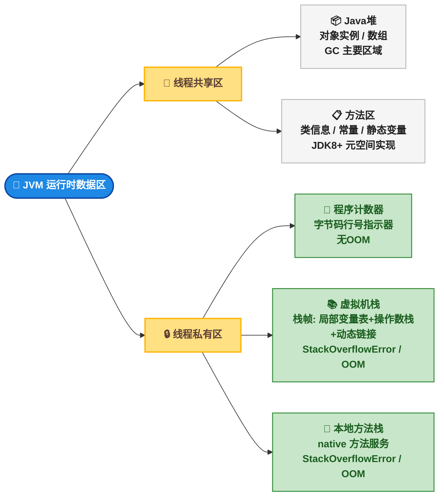
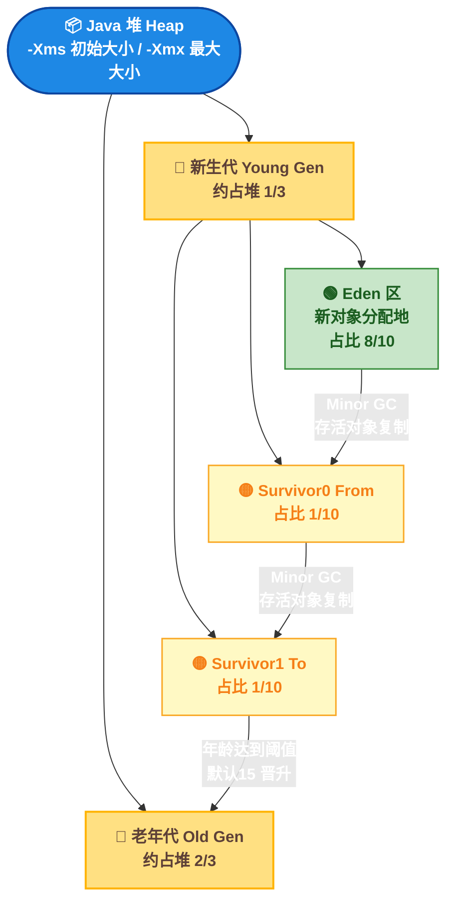
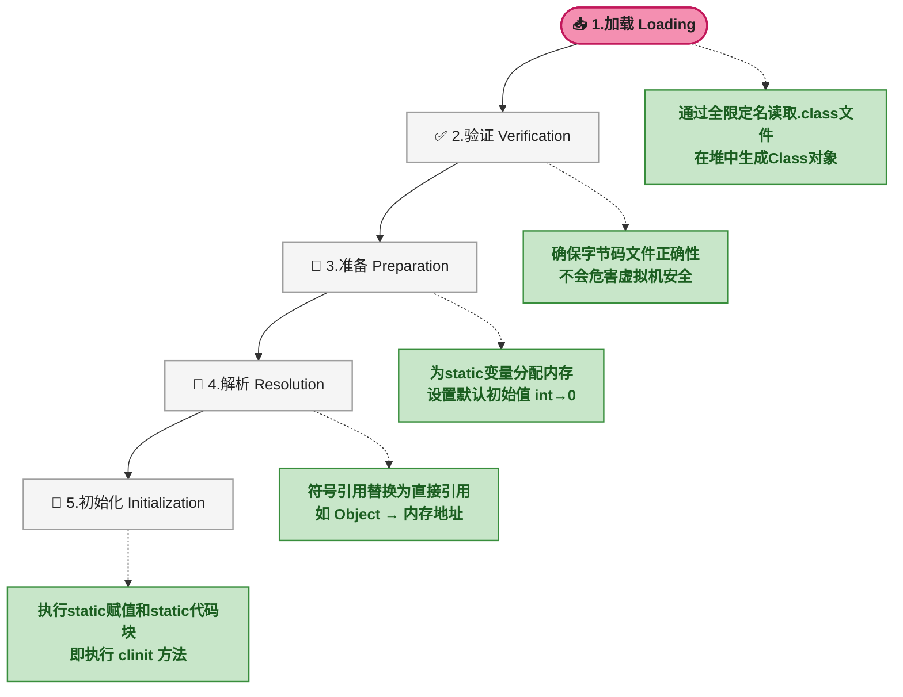
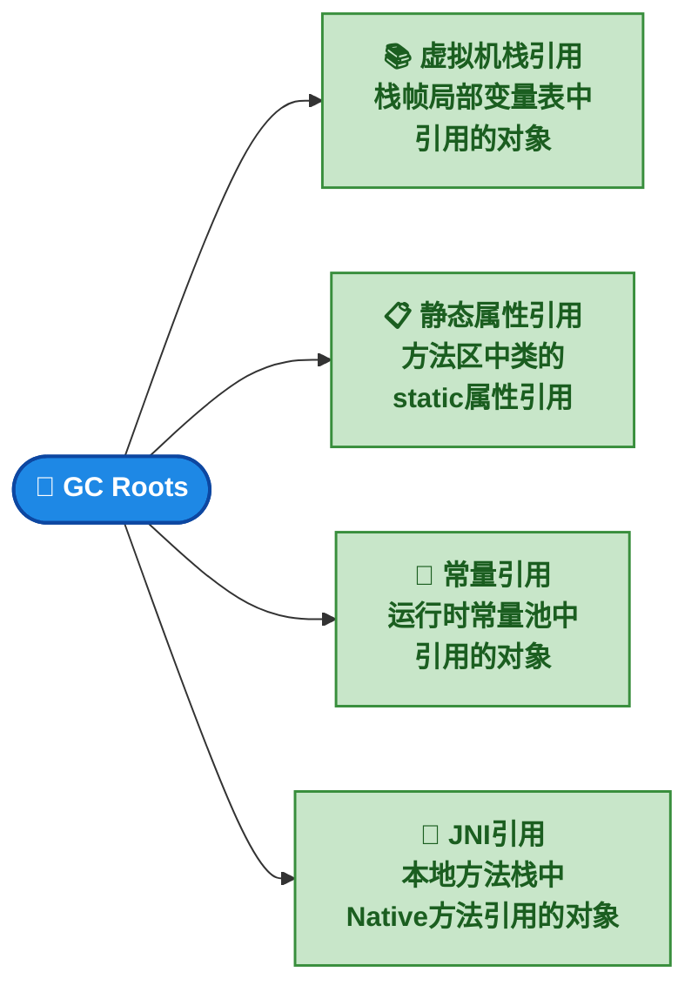
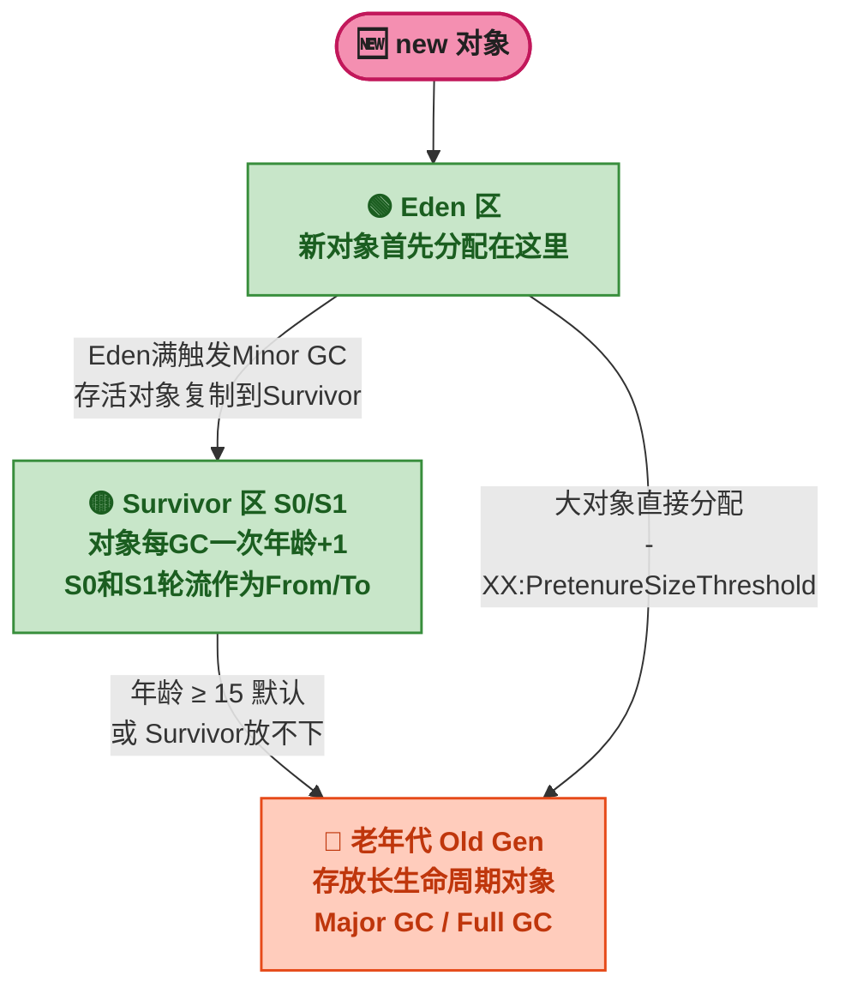
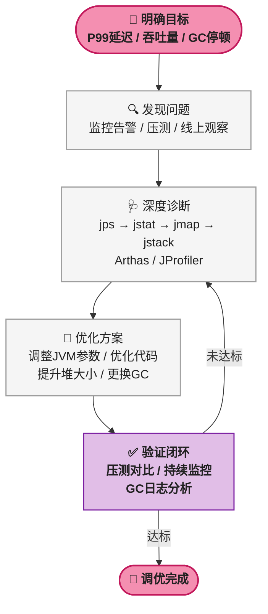
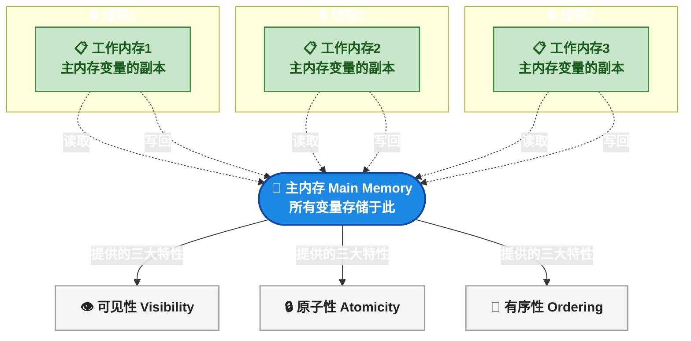

# 🔬 JVM 面试突击：运行时数据区、类加载、GC 与调优全解析

> 📌 <strong>前置知识</strong>：阅读本文需要具备 Java 基础语法知识、对 JVM 有初步概念（知道 JVM 是运行 Java 程序的虚拟机即可）。本文定位为面试突击速查手册，每个考点都按"面试怎么答"组织，命令部分附带完整的操作步骤和输出解读。

---

## 各模块面试频率参考

在开始具体考点之前，先了解各模块的面试出现频率，有助于合理分配复习时间：

| 模块 | 面试频率 | 关键程度 |
|------|:---:|------|
| 运行时数据区 | ⭐⭐⭐⭐⭐ | 每场必问，入门级考点 |
| 类加载机制 | ⭐⭐⭐⭐⭐ | 双亲委派模型高频出现 |
| 垃圾回收机制 | ⭐⭐⭐⭐⭐ | 区分候选人水平的关键 |
| 调优工具与实战 | ⭐⭐⭐⭐ | 考察实际动手能力 |
| JMM + volatile | ⭐⭐⭐⭐⭐ | 并发底层原理 |
| 经典面试题 | ⭐⭐⭐⭐ | 综合应用能力 |

---

## 📌 一、JVM 运行时数据区：内存布局与职责

### 🧠 1.1 JVM 内存布局全景图

这是面试最常考的入门题，必须清楚每个区域的功能、是否为线程共享，以及各自可能抛出的异常。下面先用 Mermaid 展示 JVM 内存区域的整体分类：



下面用 HTML+CSS 布局图精确展示 JVM 内存各区域的相对位置、大小关系和内部结构：

<div style="font-family:monospace;font-size:12px;max-width:100%;overflow-x:auto;margin:16px 0;">
  <div style="border:2px solid #1E88E5;border-radius:6px;padding:4px;max-width:680px;">
    <div style="background:#1E88E5;color:#FFFFFF;padding:4px 10px;font-size:13px;font-weight:bold;text-align:center;border-radius:3px;">JVM 运行时数据区（JDK 8+）</div>
    <div style="display:flex;margin-top:4px;gap:4px;">
      <div style="flex:1;">
        <div style="background:#C8E6C9;border:1px solid #388E3C;border-radius:3px;padding:6px;">
          <div style="font-weight:bold;color:#1B5E20;font-size:11px;text-align:center;">🔒 线程私有区</div>
          <div style="background:#FFF;border:1px solid #BDBDBD;border-radius:2px;margin:4px 0;padding:4px 6px;">
            <div style="font-weight:bold;color:#1565C0;">📍 程序计数器</div>
            <div style="color:#616161;font-size:10px;">当前线程字节码行号</div>
            <div style="color:#388E3C;font-size:10px;">✅ 不会OOM</div>
          </div>
          <div style="background:#FFF;border:1px solid #BDBDBD;border-radius:2px;margin:4px 0;padding:4px 6px;">
            <div style="font-weight:bold;color:#1565C0;">📚 虚拟机栈</div>
            <div style="color:#616161;font-size:10px;">栈帧: 局部变量+操作数栈+动态链接</div>
            <div style="color:#C62828;font-size:10px;">⚠ StackOverflowError / OOM</div>
          </div>
          <div style="background:#FFF;border:1px solid #BDBDBD;border-radius:2px;margin:4px 0;padding:4px 6px;">
            <div style="font-weight:bold;color:#1565C0;">🔧 本地方法栈</div>
            <div style="color:#616161;font-size:10px;">native方法 JNI调用</div>
            <div style="color:#C62828;font-size:10px;">⚠ StackOverflowError / OOM</div>
          </div>
        </div>
      </div>
      <div style="flex:1.5;">
        <div style="background:#FFCCBC;border:1px solid #E64A19;border-radius:3px;padding:6px;">
          <div style="font-weight:bold;color:#BF360C;font-size:11px;text-align:center;">👥 线程共享区</div>
          <div style="background:#FFF;border:1px solid #BDBDBD;border-radius:2px;margin:4px 0;padding:4px 6px;">
            <div style="font-weight:bold;color:#C62828;">📦 Java 堆 Heap</div>
            <div style="color:#616161;font-size:10px;">JVM 管理的最大内存区域</div>
            <div style="color:#616161;font-size:10px;">所有对象实例和数组的分配地</div>
            <div style="color:#616161;font-size:10px;">GC 主要回收区域（GC堆）</div>
            <div style="color:#C62828;font-size:10px;">⚠ OutOfMemoryError</div>
          </div>
          <div style="background:#FFF;border:1px solid #BDBDBD;border-radius:2px;margin:4px 0;padding:4px 6px;">
            <div style="font-weight:bold;color:#7B1FA2;">📋 方法区 Method Area</div>
            <div style="color:#616161;font-size:10px;">类信息 / 常量 / 静态变量 / JIT代码</div>
            <div style="color:#616161;font-size:10px;">JDK8+: 元空间Metaspace实现</div>
            <div style="color:#616161;font-size:10px;">使用本地内存(非堆内存)</div>
            <div style="color:#C62828;font-size:10px;">⚠ OutOfMemoryError (Metaspace)</div>
          </div>
          <div style="background:#F5F5F5;border:1px dashed #9E9E9E;border-radius:2px;margin:4px 0;padding:4px 6px;">
            <div style="font-weight:bold;color:#616161;">📝 运行时常量池</div>
            <div style="color:#9E9E9E;font-size:10px;">属于方法区的一部分</div>
          </div>
        </div>
      </div>
    </div>
  </div>
  <div style="font-size:11px;color:#9E9E9E;margin-top:4px;">▲ JVM 运行时数据区全景：线程私有区 vs 线程共享区的完整分类与职责</div>
</div>

> ⚠️ <strong>新手提示</strong>：初学 JVM 内存区域时，最关键的一步是区分"线程私有"和"线程共享"。线程私有区随线程而生、随线程而灭，不存在并发问题；线程共享区需要 GC 来管理，是性能问题的根源。

### 🔢 1.2 程序计数器（PC Register）

PC 寄存器（Program Counter Register）是当前线程所执行的字节码的<strong>行号指示器</strong>。每个线程都有一个独立的程序计数器，因此它是<span style="color:red">线程私有</span>的。

<strong>核心特征</strong>：
- 存的是字节码指令的行号（如果是 native 方法，计数器值为空 Undefined）
- 占用内存极小，是 JVM 规范中<span style="color:red">唯一一个不会抛出 OutOfMemoryError</span> 的区域
- 线程切换时，CPU 通过程序计数器恢复到上次执行的位置，这是多线程能够正确运行的基础

### 🧠 1.3 Java 虚拟机栈（Java Virtual Machine Stack）

每个 Java 方法被调用时，JVM 会同步创建一个<strong>栈帧（Stack Frame）</strong>压入虚拟机栈。栈帧存储以下信息：

| 栈帧组成 | 存储内容 |
|------|------|
| 局部变量表 | 方法参数、方法内定义的局部变量。基本类型存值，引用类型存指针 |
| 操作数栈 | 字节码指令操作的中间结果，是一个后进先出的栈 |
| 动态链接 | 指向运行时常量池中该方法所属类的符号引用 |
| 方法返回地址 | 方法出口信息（正常返回或异常返回） |

下面用 HTML+CSS 展示一个方法调用时栈帧的压栈过程：

<div style="font-family:monospace;font-size:12px;max-width:100%;margin:16px 0;">
  <div style="display:flex;gap:20px;flex-wrap:wrap;">
    <div style="flex:1;min-width:260px;">
      <div style="background:#1E88E5;color:#FFFFFF;padding:4px 10px;font-size:12px;font-weight:bold;text-align:center;">方法调用过程</div>
      <div style="border:2px solid #BDBDBD;padding:8px;">
        <div style="font-size:11px;color:#616161;text-align:center;">main() 调用 methodA()</div>
        <div style="display:flex;justify-content:center;font-size:18px;color:#9E9E9E;">↓</div>
        <div style="font-size:11px;color:#616161;text-align:center;">methodA() 调用 methodB()</div>
        <div style="display:flex;justify-content:center;font-size:18px;color:#9E9E9E;">↓</div>
        <div style="font-size:11px;color:#616161;text-align:center;">methodB() 执行中...</div>
      </div>
    </div>
    <div style="flex:1.2;min-width:280px;">
      <div style="background:#388E3C;color:#FFFFFF;padding:4px 10px;font-size:12px;font-weight:bold;text-align:center;">虚拟机栈（此时的状态）</div>
      <div style="border:2px solid #BDBDBD;padding:8px;">
        <div style="background:#C8E6C9;border:1px solid #388E3C;border-radius:2px;padding:5px 8px;margin:2px 0;">
          <div style="font-weight:bold;font-size:11px;">栈帧3: methodB()</div>
          <div style="font-size:10px;color:#616161;">局部变量表 | 操作数栈 | ... </div>
        </div>
        <div style="background:#E3F2FD;border:1px solid #1565C0;border-radius:2px;padding:5px 8px;margin:2px 0;">
          <div style="font-weight:bold;font-size:11px;">栈帧2: methodA()</div>
          <div style="font-size:10px;color:#616161;">局部变量表 | 操作数栈 | ... </div>
        </div>
        <div style="background:#F5F5F5;border:1px solid #9E9E9E;border-radius:2px;padding:5px 8px;margin:2px 0;">
          <div style="font-weight:bold;font-size:11px;">栈帧1: main()</div>
          <div style="font-size:10px;color:#616161;">局部变量表 | 操作数栈 | ... </div>
        </div>
        <div style="font-size:10px;color:#9E9E9E;text-align:center;margin-top:4px;">▲ 栈顶 = methodB() 的栈帧</div>
      </div>
    </div>
  </div>
  <div style="font-size:11px;color:#9E9E9E;margin-top:4px;">▲ 方法调用时栈帧的压栈过程：被调用方法的栈帧压入栈顶，执行完毕弹出销毁</div>
</div>

<strong>异常场景</strong>：
- <strong>StackOverflowError</strong>：栈深度超过了 JVM 允许的最大深度。最常见于<strong>无限递归</strong>（如忘记写递归终止条件）
- <strong>OutOfMemoryError</strong>：栈容量可以动态扩展，但扩展时无法申请到足够内存

```java
// StackOverflowError 示例
public void recursiveMethod() {
    recursiveMethod();  // 无限递归，每次调用压入新栈帧 → 栈溢出
}
```

### 🧠 1.4 本地方法栈（Native Method Stack）

本地方法栈与虚拟机栈功能相似，区别在于它<strong>为 HotSpot 虚拟机中的 native 方法（用 C/C++ 编写的方法）服务</strong>。线程私有，同样会抛出 StackOverflowError 和 OutOfMemoryError。

> ⚠️ <strong>新手提示</strong>：在实际面试中，HotSpot 虚拟机将本地方法栈和虚拟机栈合二为一实现，因此回答时可以说"功能类似虚拟机栈，为 native 方法服务"，面试官不会深究这一点。

### 🧠 1.5 Java 堆（Heap）

Java 堆是 JVM 管理的<strong>最大一块内存区域</strong>，在虚拟机启动时创建。<span style="color:red">几乎所有对象实例和数组</span>都在堆上分配（随着 JIT 逃逸分析技术的发展，栈上分配和标量替换优化使得"所有对象都在堆上"不再绝对）。

<strong>核心属性</strong>：
- <strong>线程共享</strong>：堆中的对象可以被所有线程访问
- <strong>GC 主要回收区域</strong>：也叫"GC 堆"（Garbage Collected Heap）
- <strong>分代设计</strong>：主流 JVM 将堆分为新生代和老年代（详见第三章）



### 🧠 1.6 方法区（Method Area）与元空间

方法区存储 JVM 已加载的<strong>类元数据信息</strong>（类型信息、常量、静态变量、JIT 编译后的代码缓存）。线程共享。

<strong>JDK 版本演进</strong>：

| 版本 | 方法区实现 | 存储位置 |
|------|------|------|
| JDK 7 及以前 | 永久代（PermGen） | JVM 堆内存中 |
| JDK 8+ | 元空间（Metaspace） | 本地内存（Native Memory） |

这个变化是面试高频考点，下面用 HTML+CSS 直观对比两种实现：

<div style="display:flex;gap:20px;flex-wrap:wrap;max-width:100%;margin:16px 0;">
  <div style="flex:1;min-width:280px;">
    <div style="background:#C62828;color:#FFFFFF;padding:4px 10px;font-size:13px;font-weight:bold;text-align:center;">JDK 7 及以前：永久代</div>
    <div style="border:2px solid #C62828;padding:10px;">
      <div style="background:#F5F5F5;padding:6px 8px;margin:3px 0;border-radius:2px;font-size:12px;">
        <strong>存储位置</strong>：JVM 堆内存中
      </div>
      <div style="background:#F5F5F5;padding:6px 8px;margin:3px 0;border-radius:2px;font-size:12px;">
        <strong>大小限制</strong>：<code>-XX:MaxPermSize</code>
      </div>
      <div style="background:#FFCDD2;padding:6px 8px;margin:3px 0;border-radius:2px;font-size:12px;">
        <strong>致命缺陷</strong>：动态生成类过多 →<br/><span style="color:#C62828;">PermGen space OOM</span>
      </div>
      <div style="background:#F5F5F5;padding:6px 8px;margin:3px 0;border-radius:2px;font-size:12px;">
        <strong>GC 行为</strong>：Full GC 时回收
      </div>
    </div>
  </div>
  <div style="display:flex;align-items:center;font-size:24px;font-weight:bold;color:#388E3C;">→</div>
  <div style="flex:1;min-width:280px;">
    <div style="background:#388E3C;color:#FFFFFF;padding:4px 10px;font-size:13px;font-weight:bold;text-align:center;">JDK 8+：元空间 Metaspace</div>
    <div style="border:2px solid #388E3C;padding:10px;">
      <div style="background:#F5F5F5;padding:6px 8px;margin:3px 0;border-radius:2px;font-size:12px;">
        <strong>存储位置</strong>：本地内存（OS 管理）
      </div>
      <div style="background:#F5F5F5;padding:6px 8px;margin:3px 0;border-radius:2px;font-size:12px;">
        <strong>大小限制</strong>：<code>-XX:MaxMetaspaceSize</code>（可选）
      </div>
      <div style="background:#C8E6C9;padding:6px 8px;margin:3px 0;border-radius:2px;font-size:12px;">
        <strong>优势</strong>：默认上限=本地内存总量 →<br/><span style="color:#388E3C;">OOM 风险显著降低</span>
      </div>
      <div style="background:#F5F5F5;padding:6px 8px;margin:3px 0;border-radius:2px;font-size:12px;">
        <strong>GC 行为</strong>：类加载器被回收时一并回收元数据
      </div>
    </div>
  </div>
</div>
<div style="font-size:11px;color:#9E9E9E;margin-top:2px;">▲ JDK 8 方法区实现从永久代到元空间的变迁对比</div>

> 📌 <strong>前置知识</strong>："本地内存"指操作系统管理的内存，而非 JVM 管理的内存。元空间使用本地内存意味着它的上限不再是 JVM 堆内存的 -Xmx 限制，而是机器的物理内存大小，因此动态生成大量类时不容易 OOM。

### 🔢 1.7 运行时常量池（Runtime Constant Pool）

运行时常量池属于方法区的一部分，用于存放：
- 编译期生成的各种<strong>字面量</strong>（如文本字符串 `"hello"`、被声明为 final 的常量值）
- <strong>符号引用</strong>（类和接口的全限定名、字段名称和描述符、方法名称和描述符）

> ⚠️ <strong>新手提示</strong>：<code>String.intern()</code> 方法的作用就是在运行时常量池中检查是否存在与该字符串值相等的引用，如果存在则返回池中的引用，否则将该字符串加入常量池。

### 🧠 1.8 堆和栈的区别

这是高频面试追问，以下表维度快速回答：

| 对比维度 | 栈（Stack） | 堆（Heap） |
|------|------|------|
| 存储内容 | 局部变量、操作数栈、方法出口等 | 对象实例、数组 |
| 生命周期 | 方法执行时创建栈帧，结束后弹出销毁 | 由 GC（垃圾收集器）负责回收 |
| 线程共享 | 线程私有，每个线程独立 | 线程共享，所有线程可见 |
| 内存大小 | 较小（通常几百 KB ~ 几 MB） | 较大，可动态扩展（-Xms / -Xmx） |
| 异常类型 | StackOverflowError 或 OOM | OutOfMemoryError: Java heap space |
| 分配方式 | 编译器确定，方法调用自动压栈 | new 关键字或反射分配 |

---

## 🔍 二、类加载机制：流程、双亲委派与打破

### 📦 2.1 类的生命周期

一个类从被加载到 JVM 到卸载，经历以下五个阶段：



<strong>面试口述版本</strong>：

1. <strong>加载</strong>：读取 `.class` 文件的二进制字节流，在堆中生成 `java.lang.Class` 对象作为方法区中该类数据的访问入口
2. <strong>验证</strong>：校验字节码文件的正确性（文件格式、元数据、字节码、符号引用验证），确保不会危害虚拟机安全
3. <strong>准备</strong>：为类变量（`static` 变量）在方法区中分配内存，并设置为<strong>默认零值</strong>（`int` → 0，`boolean` → false，引用 → null）。注意：这里不会执行赋值语句，`public static int value = 123` 在准备阶段 value 的值是 0 而非 123
4. <strong>解析</strong>：将常量池中的<strong>符号引用</strong>（如 `java.lang.Object`）替换为<strong>直接引用</strong>（内存中的实际地址）
5. <strong>初始化</strong>：执行类构造器 `<clinit>()` 方法，按顺序执行 `static` 变量赋值和 `static` 代码块

> ⚠️ <strong>新手提示</strong>：准备阶段的"默认零值"和初始化阶段的"实际赋值"是两个不同的阶段。这是面试中的陷阱题。例如 `public static final int MAX = 100` 是一个常量（`final` 修饰），在准备阶段就已经被赋值为 100 而非 0，因为 `final` + `static` 的组合在编译期就确定了值。

### 📦 2.2 双亲委派模型（Parents Delegation Model）

双亲委派模型是 JVM 保障安全的核心机制。下面用 HTML+CSS 管线图展示其工作流程：

<div style="font-family:monospace;font-size:12px;max-width:100%;overflow-x:auto;margin:16px 0;">
  <div style="border:2px solid #7B1FA2;border-radius:6px;padding:4px;max-width:680px;">
    <div style="background:#7B1FA2;color:#FFFFFF;padding:4px 10px;font-size:13px;font-weight:bold;text-align:center;border-radius:3px;">⚙️ 双亲委派模型工作流程</div>
    <div style="display:flex;flex-direction:column;gap:6px;padding:8px;">
      <div style="display:flex;align-items:center;background:#F5F5F5;border:1px solid #BDBDBD;border-radius:4px;padding:8px;">
        <span style="min-width:160px;font-weight:bold;color:#E64A19;">阶段1 收到请求</span>
        <span style="color:#424242;">类加载器收到加载类的请求</span>
      </div>
      <div style="display:flex;justify-content:center;font-size:18px;color:#9E9E9E;">↓</div>
      <div style="display:flex;align-items:center;background:#F5F5F5;border:1px solid #BDBDBD;border-radius:4px;padding:8px;">
        <span style="min-width:160px;font-weight:bold;color:#F57C00;">阶段2 向上委派</span>
        <span style="color:#424242;">检查是否已加载 → 未加载则委派父加载器</span>
      </div>
      <div style="display:flex;justify-content:center;font-size:18px;color:#9E9E9E;">↓</div>
      <div style="display:flex;align-items:center;background:#F5F5F5;border:1px solid #BDBDBD;border-radius:4px;padding:8px;">
        <span style="min-width:160px;font-weight:bold;color:#FFB300;">阶段3 递归传递</span>
        <span style="color:#424242;">每层都向上委派，最终到达 Bootstrap ClassLoader</span>
      </div>
      <div style="display:flex;justify-content:center;font-size:18px;color:#9E9E9E;">↓</div>
      <div style="display:flex;align-items:center;background:#F5F5F5;border:1px solid #BDBDBD;border-radius:4px;padding:8px;">
        <span style="min-width:160px;font-weight:bold;color:#7B1FA2;">阶段4 顶层尝试</span>
        <span style="color:#424242;">Bootstrap ClassLoader 尝试加载核心类库</span>
      </div>
      <div style="display:flex;justify-content:center;font-size:18px;color:#9E9E9E;">↓</div>
      <div style="display:flex;align-items:center;background:#C8E6C9;border:1px solid #388E3C;border-radius:4px;padding:8px;">
        <span style="min-width:160px;font-weight:bold;color:#388E3C;">阶段5 向下查找</span>
        <span style="color:#424242;">父加载器无法加载 → 子加载器自己尝试</span>
      </div>
    </div>
  </div>
  <div style="font-size:11px;color:#9E9E9E;margin-top:4px;">▲ 双亲委派模型：先向上委派、再向下尝试的类加载流程</div>
</div>

<strong>三层类加载器</strong>：

| 类加载器 | 加载范围 | 说明 |
|------|------|------|
| Bootstrap ClassLoader | `<JAVA_HOME>/lib` 核心类库（rt.jar 等） | C/C++ 实现，Java 中获取为 null |
| Extension ClassLoader | `<JAVA_HOME>/lib/ext` 扩展目录 | JDK 9+ 被平台类加载器取代 |
| Application ClassLoader | classpath 下的用户类 | 也叫 System ClassLoader |

<strong>为什么使用双亲委派</strong>：
1. <strong>保证核心类库安全</strong>：避免 `java.lang.String` 等核心类被自定义同名类替换（如有人恶意编写同名类植入后门）
2. <strong>避免重复加载</strong>：同一个类只会被加载一次，因为父加载器加载过的类子加载器不会重复加载

### 📦 2.3 如何打破双亲委派模型

自定义类加载器，<span style="color:red">重写 `loadClass()` 方法</span>（而非仅重写 `findClass()`），在方法中实现自己的加载逻辑，不先委派给父加载器。

```java
public class CustomClassLoader extends ClassLoader {
    @Override
    protected Class<?> loadClass(String name, boolean resolve) throws ClassNotFoundException {
        // 先自己尝试加载（打破了先委派父加载器的规则）
        Class<?> c = findLoadedClass(name);
        if (c == null) {
            try {
                c = findClass(name);  // 自己加载
            } catch (ClassNotFoundException e) {
                // 自己加载失败再走父加载器
                c = super.loadClass(name, resolve);
            }
        }
        return c;
    }
}
```

<strong>典型应用</strong>：Tomcat 通过自定义 `WebAppClassLoader` 打破了双亲委派模型，实现每个 Web 应用之间的类隔离——每个 WAR 包可以有自己的 `WEB-INF/lib` 中的 jar 版本，互不干扰。

---

## ⚙️ 三、JVM 垃圾回收机制：核心算法的演进

### 📐 3.1 对象存活判定算法

判断堆中哪些对象可以被回收，有两种算法：

| 算法 | 原理 | 优缺点 | JVM 是否采用 |
|------|------|------|:---:|
| 引用计数法 | 给对象添加引用计数器，引用数为 0 时回收 | 实现简单但<strong>无法解决循环引用</strong> | ❌ 未采用 |
| 可达性分析 | 从 GC Roots 向下搜索引用链，不可达=可回收 | 能解决循环引用，是主流做法 | ✅ 采用 |

<strong>循环引用问题示例</strong>：

```java
class Node {
    Node next;
    public static void main(String[] args) {
        Node a = new Node();
        Node b = new Node();
        a.next = b;    // a 引用 b
        b.next = a;    // b 引用 a（循环引用）
        a = null;      // a 置空
        b = null;      // b 置空
        // 此时 a 和 b 互相引用，计数器各为 1（不为 0），
        // 引用计数法无法回收，但可达性分析可正确回收
    }
}
```

### 🗑️ 3.2 GC Roots 的分类

下面用 Mermaid 展示 GC Roots 的四种类型：



### 🗑️ 3.3 三种基础回收算法

下面用 HTML+CSS 直观对比三种算法的执行效果：

<div style="display:flex;gap:16px;flex-wrap:wrap;max-width:100%;margin:16px 0;">
  <div style="flex:1;min-width:200px;border:2px solid #BDBDBD;border-radius:4px;">
    <div style="background:#E64A19;color:#FFFFFF;padding:4px 10px;font-size:13px;font-weight:bold;text-align:center;">标记-清除 Mark-Sweep</div>
    <div style="padding:10px;">
      <div style="font-size:11px;color:#424242;margin-bottom:6px;">GC前: <span style="background:#C8E6C9;display:inline-block;width:14px;height:14px;"></span>=存活 <span style="background:#FFCDD2;display:inline-block;width:14px;height:14px;"></span>=可回收</div>
      <div style="font-size:14px;font-family:monospace;background:#F5F5F5;padding:6px;border-radius:3px;">
        <span style="color:#388E3C;">■</span><span style="color:#C62828;">■</span><span style="color:#388E3C;">■</span><span style="color:#C62828;">■</span><span style="color:#388E3C;">■</span>
      </div>
      <div style="font-size:11px;color:#424242;margin:6px 0;">GC后: 只清除，不整理</div>
      <div style="font-size:14px;font-family:monospace;background:#F5F5F5;padding:6px;border-radius:3px;">
        <span style="color:#388E3C;">■</span><span style="opacity:0.3;">□</span><span style="color:#388E3C;">■</span><span style="opacity:0.3;">□</span><span style="color:#388E3C;">■</span>
      </div>
      <div style="font-size:11px;color:#C62828;margin-top:4px;">⚠ 产生碎片</div>
    </div>
  </div>
  <div style="flex:1;min-width:200px;border:2px solid #BDBDBD;border-radius:4px;">
    <div style="background:#388E3C;color:#FFFFFF;padding:4px 10px;font-size:13px;font-weight:bold;text-align:center;">复制 Copying</div>
    <div style="padding:10px;">
      <div style="font-size:11px;color:#424242;margin-bottom:6px;">内存分为两块，每次只用一半</div>
      <div style="font-size:14px;font-family:monospace;background:#F5F5F5;padding:6px;border-radius:3px;">
        <span style="color:#388E3C;">■</span><span style="color:#C62828;">■</span><span style="color:#388E3C;">■</span> <span style="opacity:0.3;">|</span> <span style="opacity:0.3;">□ □ □</span>
      </div>
      <div style="font-size:11px;color:#424242;margin:6px 0;">GC后: 存活对象复制到另一块</div>
      <div style="font-size:14px;font-family:monospace;background:#F5F5F5;padding:6px;border-radius:3px;">
        <span style="opacity:0.3;">□ □ □</span> <span style="opacity:0.3;">|</span> <span style="color:#388E3C;">■ ■ ■</span>
      </div>
      <div style="font-size:11px;color:#388E3C;margin-top:4px;">✅ 无碎片，但内存利用率低</div>
    </div>
  </div>
  <div style="flex:1;min-width:200px;border:2px solid #BDBDBD;border-radius:4px;">
    <div style="background:#7B1FA2;color:#FFFFFF;padding:4px 10px;font-size:13px;font-weight:bold;text-align:center;">标记-整理 Mark-Compact</div>
    <div style="padding:10px;">
      <div style="font-size:11px;color:#424242;margin-bottom:6px;">GC前: 存活和可回收混在一起</div>
      <div style="font-size:14px;font-family:monospace;background:#F5F5F5;padding:6px;border-radius:3px;">
        <span style="color:#388E3C;">■</span><span style="color:#C62828;">■</span><span style="color:#388E3C;">■</span><span style="color:#C62828;">■</span><span style="color:#388E3C;">■</span>
      </div>
      <div style="font-size:11px;color:#424242;margin:6px 0;">GC后: 存活对象移到一端，清理边界外</div>
      <div style="font-size:14px;font-family:monospace;background:#F5F5F5;padding:6px;border-radius:3px;">
        <span style="color:#388E3C;">■■■</span><span style="opacity:0.3;">□ □</span>
      </div>
      <div style="font-size:11px;color:#7B1FA2;margin-top:4px;">✅ 无碎片，但移动成本高</div>
    </div>
  </div>
</div>
<div style="font-size:11px;color:#9E9E9E;margin-top:2px;">▲ 三种基础 GC 算法的回收效果对比：● = 存活对象，该清除的位置用半透明表示</div>

### 🔢 3.4 分代收集理论

主流 JVM 将堆分为新生代和老年代，针对各自特点采用不同算法：



<strong>关键参数</strong>：

| 参数 | 含义 | 示例 |
|------|------|------|
| `-Xms` | 堆初始大小 | `-Xms2g` |
| `-Xmx` | 堆最大大小 | `-Xmx4g` |
| `-Xmn` | 新生代大小 | `-Xmn1g` |
| `-XX:SurvivorRatio` | Eden / Survivor 比例 | `-XX:SurvivorRatio=8`（Eden:S0=8:1） |
| `-XX:MaxTenuringThreshold` | 晋升老年代的年龄阈值 | 默认 15 |
| `-XX:PretenureSizeThreshold` | 大对象直接进入老年代的阈值 | `-XX:PretenureSizeThreshold=3M` |

### 🗑️ 3.5 垃圾收集器对比（从 Serial 到 G1）

| 收集器 | 目标区域 | 算法 | 特点与适用场景 |
|------|------|------|------|
| <strong>Serial</strong> | 新生代 | 复制算法 | 单线程，简单高效，适合桌面应用和客户端模式 |
| <strong>ParNew</strong> | 新生代 | 复制算法 | Serial 的多线程版，常与 CMS 配合 |
| <strong>Parallel Scavenge</strong> | 新生代 | 复制算法 | <strong>吞吐量优先</strong>，适合后台批处理 |
| <strong>Serial Old</strong> | 老年代 | 标记-整理 | Serial 的老年代版本 |
| <strong>Parallel Old</strong> | 老年代 | 标记-整理 | Parallel Scavenge 的老年代版本 |
| <strong>CMS</strong> | 老年代 | 标记-清除 | <strong>最短回收停顿</strong>，但产生碎片且 CPU 敏感 |
| <strong>G1</strong> | 新生代+老年代 | 标记-整理+复制 | <strong>可预测停顿</strong>，分区管理，JDK 9+ 默认 |
| <strong>ZGC</strong> | 新生代+老年代 | — | <strong>超低延迟</strong>，停顿 < 10ms，适合超大堆 |

> ⚠️ <strong>新手提示</strong>：面试中回答"你了解哪些 GC 收集器"时，建议按顺序从 Serial → G1 依次说明，重点讲清楚 G1 的分区（Region）思想和可预测停顿时间模型。如果能提到 ZGC 的低延迟特性可以加分。

---

## 📊 四、JVM 调优与工具：从理论到实战

### 🔧 4.1 JVM 调优完整流程



### 🧠 4.2 OOM（内存溢出）分析与排查完整指南

面试中一定会被问到"线上遇到 OOM 了怎么办？"以下按 OOM 类型逐一给出命令操作步骤。

#### 🧠 4.2.1 Java 堆 OOM

最常见，通常由<strong>内存泄漏</strong>或<strong>数据量激增</strong>导致。

**排查步骤**：

**第 1 步**：确认现象。首先在应用启动时添加 JVM 参数，让 OOM 时自动导出堆快照：

```bash
#  启动时加入以下 JVM 参数
-XX:+HeapDumpOnOutOfMemoryError
-XX:HeapDumpPath=/path/to/dump/heap.hprof
```

`-XX:+HeapDumpOnOutOfMemoryError` 是一个开关参数，`+` 表示开启此功能。当堆内存溢出时，JVM 会自动将整个堆的对象信息导出到指定路径的 `.hprof` 文件中。

**第 2 步**：如果没有自动导出，手动导出堆转储文件。首先用 `jps` 找到 Java 进程 PID：

```bash
#  列出所有 Java 进程
jps -l

#  示例输出：
#  12345 com.example.MyApplication
#  12346 sun.tools.jps.Jps
```

`jps -l` 的 `-l` 参数会显示完整的 main 类名或 jar 包路径，帮助确定是哪个应用需要排查。

**第 3 步**：使用 `jmap` 导出堆转储文件：

```bash
#  导出堆转储文件
jmap -dump:format=b,file=heap.hprof 12345

#  参数说明：
#  -dump        : 导出堆转储
#  format=b     : 二进制格式
#  file=xxx     : 输出文件路径
#  12345        : 目标 Java 进程的 PID
```

**第 4 步**：使用 MAT（Memory Analyzer Tool）或 JProfiler 打开 `heap.hprof` 文件分析：
- 查看 Leak Suspects（内存泄漏嫌疑报告），MAT 会自动分析占用内存最大的对象
- 点击 Dominator Tree（支配树视图），按对象占用内存大小降序排列
- 选中怀疑的对象 → 右键 Path to GC Roots → 查看引用链，定位到是哪个业务线程、哪个类持有了该对象

| 工具 | 特点 | 适用场景 |
|------|------|------|
| MAT（Eclipse Memory Analyzer） | 免费，分析能力强 | 离线 dump 分析 |
| JProfiler | 可视化好，实时监控 | 开发调试和线上实时 |
| Arthas | 阿里巴巴开源，命令行交互 | 线上实时诊断，无需重启 |

#### 🧠 4.2.2 元空间 OOM

一般由<strong>动态生成的类过多</strong>（如大量使用 CGLIB 代理、频繁热部署）导致。

```bash
#  增大元空间上限（默认无限制时几乎等于物理内存）
-XX:MaxMetaspaceSize=256m

#  开启类加载/卸载的详细日志追踪
-XX:+TraceClassLoading
-XX:+TraceClassUnloading
```

#### 🗑️ 4.2.3 GC Overhead Limit Exceeded

这是一种保护性错误，意味着 JVM 花费了大量时间（> 98%）做 GC 但回收效果极差（< 2% 堆空间），通常是堆内存 OOM 的前兆。

```bash
#  临时禁用此检查（不推荐，只用于紧急情况）
-XX:-UseGCOverheadLimit

#  正确做法：增加堆大小并开启 GC 日志分析
-XX:+PrintGCDetails
-XX:+PrintGCDateStamps
-Xloggc:/path/to/gc.log
```

#### 🔢 4.2.4 Unable to Create New Native Thread

无法创建新线程。原因通常是创建了过多线程、线程栈（`-Xss`）设置过大，或操作系统限制了最大线程数。

```bash
#  查看当前用户最大进程/线程数
ulimit -u

#  查看 Java 进程的线程数
ps -T -p <pid> | wc -l

#  调整线程栈大小（减小以容纳更多线程）
-Xss256k
```

`-Xss` 设置每个线程的栈大小，默认约 1MB。减小此值可以让同样大小的内存容纳更多线程。

### 🗑️ 4.3 jstat 命令详解——GC 实时监控

`jstat`（JVM Statistics Monitoring Tool）用于<strong>实时监控 JVM 的 GC 和类加载状态</strong>，是线上排查 GC 问题最常用的命令。

```bash
#  基本语法
jstat -<option> <pid> <interval_ms> [count]

#  示例：每 2 秒输出一次 GC 统计，共输出 10 次
jstat -gc 12345 2000 10
```

**核心输出列解读**：

执行 `jstat -gc <pid>` 后，输出类似如下：

```
 S0C    S1C    S0U    S1U      EC       EU        OC         OU       MC     MU
 0.0   1024.0  0.0   512.0   8192.0   4096.0   16384.0    8192.0   4864.0  4608.0

 YGC     YGCT    FGC    FGCT     GCT
 12      0.123   2      0.456    0.579
```

| 列名 | 含义 | 解读方法 |
|------|------|------|
| S0C / S1C | Survivor0 / Survivor1 容量（KB） | 如果 S0C=S1C=0，说明 SurvivorRatio 未生效 |
| EC | Eden 区容量 | 新生代大小 ≈ EC + S0C + S1C |
| EU | Eden 区当前使用量 | 如果 EU 始终接近 EC，说明 Eden 区太小 |
| OC / OU | 老年代容量 / 使用量 | OU 持续增长说明可能存在内存泄漏 |
| YGC | Young GC 次数 | Minor GC 频率 |
| YGCT | Young GC 总耗时（秒） | 平均每次 Minor GC 耗时 = YGCT / YGC |
| FGC | Full GC 次数 | Full GC 频繁是危险信号 |
| FGCT | Full GC 总耗时（秒） | 平均 Full GC 耗时 = FGCT / FGC |
| GCT | GC 总耗时 | GCT / 运行时间 = GC 时间占比 |

```bash
#  查看类加载统计
jstat -class 12345 1000 5
#  输出: Loaded(已加载) Bytes(占用字节) Unloaded(已卸载)

#  查看编译统计
jstat -compiler 12345
#  输出: Compiled(编译数) Failed(失败数) Invalid(无效数)
```

### 🧠 4.4 jmap 命令详解——内存快照分析

```bash
#  查看堆内存配置和使用概览
jmap -heap 12345

#  输出包含：
#    MinHeapFreeRatio / MaxHeapFreeRatio  : 堆空闲比例
#    MaxHeapSize / NewSize / OldSize       : 各区域大小
#    Eden Space / Survivor Space usage     : 新生代使用详情
```

```bash
#  查看堆中各类对象的统计信息（直方图）
jmap -histo 12345

#  输出示例（按占用字节降序）：
#   num     #instances    #bytes  class name
#   ----------------------------------------------
#     1:       100000   24000000  [C
#     2:        50000   12000000  java.lang.String
#     3:        20000    8000000  [B
#     4:        10000    5600000  com.example.User
```

| 列名 | 含义 |
|------|------|
| num | 序号，按占用总字节降序 |
| #instances | 该类的实例数量 |
| #bytes | 该类的所有实例占用的总字节数 |
| class name | 类名，`[C` = char[]，`[B` = byte[] |

如果 `com.example.User`（业务类）的实例数和字节数异常高，很可能该对象存在内存泄漏。

```bash
#  导出堆转储文件（用于 MAT 分析）
jmap -dump:format=b,file=/tmp/heap.hprof 12345
```

### 🧠 4.5 jstack 命令详解——线程分析

```bash
#  导出当前 JVM 所有线程的堆栈快照
jstack 12345 > thread_dump.txt
```

<strong>jstack 输出结构解读</strong>：

```
"http-nio-8080-exec-1" #31 daemon prio=5 os_prio=0 tid=0x00007f8b0c001000 nid=0x1a3c
   java.lang.Thread.State: RUNNABLE
        at com.example.UserService.getUser(UserService.java:23)
        ...

"DestroyJavaVM" #42 prio=5 os_prio=0 tid=0x00007f8b18008800 nid=0x1a2b waiting
   java.lang.Thread.State: WAITING (parking)
        at sun.misc.Unsafe.park(Native Method)
        ...
```

| 字段 | 含义 |
|------|------|
| 第一行 | 线程名、编号、守护状态、优先级、线程 ID（tid）、系统线程 ID（nid） |
| Thread.State | 线程状态：RUNNABLE / WAITING / BLOCKED / TIMED_WAITING |
| 堆栈行 | `at` 开头的行显示方法调用栈，最深层的调用在顶部 |

<strong>高频排查场景</strong>：

```bash
#  场景1：查找死锁
jstack -l 12345 | grep "deadlock" -A 10

#  场景2：找出占用 CPU 最高的线程
#  先用 top -H -p <pid> 找到 CPU 最高的线程的 nid（十六进制）
top -H -p 12345
#  假设找到 nid=0x1a3c 的线程 CPU 最高
#  在 jstack 输出中搜索 nid=0x1a3c，定位到具体代码行
```

> ⚠️ <strong>新手提示</strong>：`jstack` 输出中的 `nid` 是十六进制的，而 `top -H` 显示的线程 ID 是十进制的。匹配时需要将 `top` 显示的十进制转十六进制后再搜索。例如 `top` 显示线程 6716，十六进制为 `0x1A3C`。

<strong>Arthas 快速使用</strong>：

```bash
#  下载并启动 Arthas
curl -O https://arthas.aliyun.com/arthas-boot.jar
java -jar arthas-boot.jar

#  选择目标 Java 进程后，常用命令：
dashboard          # 实时面板（相当于 jstat + jstack 的可视化）
thread -b          # 查找当前阻塞其他线程的线程（死锁检测）
heapdump /tmp/dump.hprof  # 导出堆转储
jad com.example.UserService   # 反编译指定类
```

---

## 🛠️ 五、高级特性与并发支持：内存模型与 volatile

### 🧠 5.1 Java 内存模型（JMM）

JMM（Java Memory Model）的主要目的是<strong>屏蔽不同硬件和操作系统的内存访问差异</strong>，保证 Java 程序在各种平台上都能达到一致的内存访问效果。



<strong>JMM 三大特性</strong>：

| 特性 | 含义 | 实现方式 |
|------|------|------|
| <strong>可见性</strong> | 一个线程对共享变量的修改，必须能立即被其他线程看到 | `volatile`、`synchronized`、`final` |
| <strong>原子性</strong> | 一个或多个操作，要么全部执行且不被中断，要么全不执行 | `synchronized`、`Lock`、CAS |
| <strong>有序性</strong> | 编译器和处理器可能会对指令重排序，但要保证单线程下结果不变 | `volatile`、`synchronized`、happens-before |

### 🔀 5.2 volatile 关键字

`volatile` 是面试高频发问点，因为它直接关联到并发编程的底层原理。

<strong>两大作用</strong>：

1. <strong>保证可见性</strong>：对 `volatile` 变量的写操作会立即刷新到主内存，读操作直接从主内存读取（绕过线程工作内存的缓存）
2. <strong>禁止指令重排序</strong>：通过<strong>内存屏障（Memory Barrier）</strong>实现，`volatile` 变量前后的指令不会被编译器和处理器重新排序

下面用 HTML+CSS 展示 `volatile` 写操作前后插入的内存屏障：

<div style="font-family:monospace;font-size:12px;max-width:100%;margin:16px 0;">
  <div style="border:2px solid #7B1FA2;border-radius:6px;padding:4px;max-width:520px;">
    <div style="background:#7B1FA2;color:#FFFFFF;padding:4px 10px;font-size:13px;font-weight:bold;text-align:center;border-radius:3px;">volatile 写操作的两道内存屏障</div>
    <div style="padding:8px;">
      <div style="background:#E3F2FD;border:1px solid #1565C0;border-radius:3px;padding:6px 8px;margin:3px 0;font-size:11px;">
        <strong>普通读/写操作</strong>（可能被重排序到屏障之后）
      </div>
      <div style="background:#FFCCBC;border:2px solid #E64A19;border-radius:3px;padding:6px 8px;margin:3px 0;">
        <strong>🔒 StoreStore 屏障</strong>（禁止上面的普通写和下面的 volatile 写重排序）
      </div>
      <div style="background:#C8E6C9;border:1px solid #388E3C;border-radius:3px;padding:6px 8px;margin:3px 0;">
        <strong>volatile 写操作</strong>（将工作内存的值刷新到主内存）
      </div>
      <div style="background:#FFCCBC;border:2px solid #E64A19;border-radius:3px;padding:6px 8px;margin:3px 0;">
        <strong>🔒 StoreLoad 屏障</strong>（禁止上面的 volatile 写和下面的读操作重排序）
      </div>
      <div style="background:#E3F2FD;border:1px solid #1565C0;border-radius:3px;padding:6px 8px;margin:3px 0;font-size:11px;">
        <strong>后续读/写操作</strong>（不能重排序到屏障之前）
      </div>
    </div>
  </div>
  <div style="font-size:11px;color:#9E9E9E;margin-top:4px;">▲ volatile 变量写操作前后插入的两道内存屏障，确保可见性和有序性</div>
</div>

<strong>底层实现</strong>：在汇编指令层面，`volatile` 写操作被翻译为带有 `lock` 前缀的指令。`lock` 前缀会触发 CPU 的<strong>缓存一致性协议</strong>（如 MESI），将当前 CPU 缓存行写回主内存，并使其他 CPU 中该地址的缓存行失效（Invalidate），从而强制其他核心从主内存重新读取。

<strong>volatile 的局限性</strong>：`volatile` 不能保证复合操作的原子性。例如 `count++` 是三步操作（读→加→写），`volatile` 只能保证每次读都是最新的，但不能阻止三个线程同时读到 0 都加 1 写回 1。

```java
// ❌ 错误用法：volatile 不能保证 count++ 的原子性
private volatile int count = 0;
// 多线程执行 count++ 结果会小于预期

// ✅ 正确用法：使用 AtomicInteger 保证原子性
private AtomicInteger count = new AtomicInteger(0);
count.incrementAndGet();  // CAS 保证原子性
```

---

## 📋 六、经典面试题解析

### 🧠 6.1 JDK 8 为什么用元空间替代永久代？

| 原因 | 永久代的问题 | 元空间的改进 |
|------|------|------|
| <strong>OOM 风险</strong> | 使用 JVM 堆内存，`-XX:MaxPermSize` 有上限，动态生成类多时容易 `PermGen space OOM` | 使用本地内存，默认上限为机器可用内存，OOM 风险显著降低 |
| <strong>内存回收</strong> | Full GC 时回收，回收时机不可控 | 类加载器被回收时，其加载的类元数据可以立即被回收，减少内存碎片 |
| <strong>调优难度</strong> | 需要估计 MaxPermSize 大小，难以确定合理值 | 通常只需关注 `-XX:MaxMetaspaceSize` 一个参数 |

### 🗑️ 6.2 如何选择垃圾回收器？

<div style="display:flex;gap:16px;flex-wrap:wrap;max-width:100%;margin:16px 0;">
  <div style="flex:1;min-width:240px;border:2px solid #BDBDBD;border-radius:4px;">
    <div style="background:#E64A19;color:#FFFFFF;padding:4px 10px;font-size:13px;font-weight:bold;text-align:center;">🔄 吞吐量优先</div>
    <div style="padding:10px;">
      <div style="font-size:11px;color:#424242;">适用：后台批处理、大数据计算</div>
      <div style="background:#F5F5F5;padding:6px;margin:4px 0;border-radius:3px;font-size:12px;">
        推荐：<strong>Parallel Scavenge + Parallel Old</strong>
      </div>
      <div style="font-size:11px;color:#616161;">JVM 参数：<br/><code>-XX:+UseParallelGC</code></div>
    </div>
  </div>
  <div style="flex:1;min-width:240px;border:2px solid #BDBDBD;border-radius:4px;">
    <div style="background:#388E3C;color:#FFFFFF;padding:4px 10px;font-size:13px;font-weight:bold;text-align:center;">⚡ 低延迟优先</div>
    <div style="padding:10px;">
      <div style="font-size:11px;color:#424242;">适用：Web 应用、API 网关</div>
      <div style="background:#F5F5F5;padding:6px;margin:4px 0;border-radius:3px;font-size:12px;">
        推荐：<strong>G1（JDK 9+ 默认）</strong>
      </div>
      <div style="font-size:11px;color:#616161;">JVM 参数：<br/><code>-XX:+UseG1GC</code></div>
    </div>
  </div>
  <div style="flex:1;min-width:240px;border:2px solid #BDBDBD;border-radius:4px;">
    <div style="background:#7B1FA2;color:#FFFFFF;padding:4px 10px;font-size:13px;font-weight:bold;text-align:center;">🚀 极致低延迟</div>
    <div style="padding:10px;">
      <div style="font-size:11px;color:#424242;">适用：超大堆、延迟 < 10ms</div>
      <div style="background:#F5F5F5;padding:6px;margin:4px 0;border-radius:3px;font-size:12px;">
        推荐：<strong>ZGC</strong>
      </div>
      <div style="font-size:11px;color:#616161;">JVM 参数：<br/><code>-XX:+UseZGC</code></div>
    </div>
  </div>
</div>
<div style="font-size:11px;color:#9E9E9E;margin-top:2px;">▲ 根据不同性能需求的 GC 收集器选型策略</div>

### 🗑️ 6.3 线上频繁 Full GC 怎么排查？

<strong>完整排查步骤</strong>：

```bash
#  ========== 第 1 步：确认 GC 频率和耗时 ==========
jstat -gc <pid> 1000 30

#  重点观察：
#  FGC 列（Full GC 次数）是否持续增长
#  FGCT / FGC 算出单次 Full GC 耗时是否过长
#  OU 列（老年代使用量）是否持续接近 OC（老年代容量）

#  ========== 第 2 步：导出 GC 日志分析 ==========
#  启动时添加 GC 日志参数：
-XX:+PrintGCDetails
-XX:+PrintGCDateStamps
-Xloggc:/var/log/app/gc.log

#  ========== 第 3 步：导出堆转储 ==========
jmap -dump:format=b,file=heap.hprof <pid>

#  ========== 第 4 步：MAT 分析 dump 文件 ==========
#  在 MAT 中：
#  1. 打开 Leak Suspects 查看内存泄漏嫌疑
#  2. 查看 Dominator Tree 按对象大小排序
#  3. 选中可疑大对象 → Merge Shortest Paths to GC Roots
#     → 找到引用链 → 定位代码

#  ========== 第 5 步：参数调优（排除内存泄漏后） ==========
#  常见调整方向：
-Xms2g -Xmx4g                        # 增大堆内存
-Xmn1g                                # 调整新生代大小
-XX:MaxMetaspaceSize=256m            # 合理设置元空间上限
-XX:MaxTenuringThreshold=6           # 降低晋升阈值
```

<strong>三种常见的参数不当导致 Full GC 的场景</strong>：

| 场景 | 表现 | 调整方向 |
|------|------|------|
| 堆内存太小 | 老年代几乎满，YGC 无法释放足够空间 → 频繁 FGC | 增大 `-Xmx` |
| 新生代太小 | 大量短命对象过早晋升到老年代 | 增大 `-Xmn` 或调整 SurvivorRatio |
| 元空间过小 | 类加载频繁触发 FGC 来卸载类 | 增大 `-XX:MaxMetaspaceSize` |

---

## 🔧 七、面试频率总览与背诵策略

### 🔢 7.1 模块频率速查表

| 优先级 | 模块 | 必须掌握的内容 |
|:---:|------|------|
| 🔥🔥🔥 | 运行时数据区 | 6 个区域的功能、线程共享/私有、异常类型 |
| 🔥🔥🔥 | 堆和栈的区别 | 5 个维度对比表 |
| 🔥🔥🔥 | 类加载机制 | 5 阶段生命周期、双亲委派流程 |
| 🔥🔥🔥 | GC 算法 | 3 种算法的优缺点、分代收集理论 |
| 🔥🔥🔥 | 垃圾收集器 | Serial → G1 的特点、G1 的分区思想 |
| 🔥🔥🔥 | JMM + volatile | 可见性/原子性/有序性、内存屏障 |
| 🔥🔥🔥 | OOM 排查 | 4 种 OOM 类型及命令行操作 |
| 🔥🔥 | 调优工具 | jstat/jmap/jstack 常用选项 |
| 🔥🔥 | 经典面试题 | 元空间替换永久代、GC 选型 |

### 🔢 7.2 背诵顺序建议

<div style="max-width:100%;margin:16px 0;">
  <div style="display:flex;flex-direction:column;gap:4px;max-width:560px;">
    <div style="background:#E3F2FD;border-left:4px solid #1565C0;padding:8px 14px;border-radius:2px;">
      <strong>1</strong> 画出 JVM 内存布局图，口头说出每个区域（开场必问）
    </div>
    <div style="background:#C8E6C9;border-left:4px solid #388E3C;padding:8px 14px;border-radius:2px;">
      <strong>2</strong> 背出堆和栈的 5 维对比表（高频追问）
    </div>
    <div style="background:#FFF8E1;border-left:4px solid #FFB300;padding:8px 14px;border-radius:2px;">
      <strong>3</strong> 简述类加载的 5 个阶段 + 双亲委派流程
    </div>
    <div style="background:#E1BEE7;border-left:4px solid #7B1FA2;padding:8px 14px;border-radius:2px;">
      <strong>4</strong> 说出三种 GC 算法 + 分代收集 + G1 分区思想（拉开分差）
    </div>
    <div style="background:#FFCCBC;border-left:4px solid #E64A19;padding:8px 14px;border-radius:2px;">
      <strong>5</strong> 讲解 volatile 的两大作用 + 内存屏障位置
    </div>
    <div style="background:#F5F5F5;border-left:4px solid #9E9E9E;padding:8px 14px;border-radius:2px;">
      <strong>6</strong> 演示 jstat/jmap/jstack 命令操作（实操加分项）
    </div>
  </div>
  <div style="font-size:11px;color:#9E9E9E;margin-top:4px;">▲ 推荐记忆顺序：从内存布局出发，逐步深入到 GC 原理，最后到实战调优</div>
</div>

---

> ⚠️ <strong>给读者的面试提醒</strong>：JVM 面试考察的是一个系统的知识体系。本文覆盖的六大模块（运行时数据区、类加载、GC、调优工具、JMM、经典面试题）是基础 + 进阶的完整组合。建议按第 7.2 节的顺序进行背诵，每天攻克 1 ~ 2 个模块。面试时如果被问到"你有没有做过 JVM 调优"，即使没有真实调优经验，也可以把 jstat/jmap/jstack 的命令操作和 OOM 排查流程完整讲出来，证明具备实操能力。
